# 构建系统与代码生成 (Build System and Code Generation)

相关源文件 (Relevant source files)

-   [.ci/pytorch/macos-build.sh](https://github.com/pytorch/pytorch/blob/915982a4/.ci/pytorch/macos-build.sh)
-   [.ci/pytorch/macos-common.sh](https://github.com/pytorch/pytorch/blob/915982a4/.ci/pytorch/macos-common.sh)
-   [.ci/pytorch/macos-test.sh](https://github.com/pytorch/pytorch/blob/915982a4/.ci/pytorch/macos-test.sh)
-   [.gitignore](https://github.com/pytorch/pytorch/blob/915982a4/.gitignore)
-   [BUILD.bazel](https://github.com/pytorch/pytorch/blob/915982a4/BUILD.bazel)
-   [CMakeLists.txt](https://github.com/pytorch/pytorch/blob/915982a4/CMakeLists.txt)
-   [buckbuild.bzl](https://github.com/pytorch/pytorch/blob/915982a4/buckbuild.bzl)
-   [c10/core/impl/alloc\_cpu.cpp](https://github.com/pytorch/pytorch/blob/915982a4/c10/core/impl/alloc_cpu.cpp)
-   [c10/ovrsource\_defs.bzl](https://github.com/pytorch/pytorch/blob/915982a4/c10/ovrsource_defs.bzl)
-   [cmake/Dependencies.cmake](https://github.com/pytorch/pytorch/blob/915982a4/cmake/Dependencies.cmake)
-   [cmake/Summary.cmake](https://github.com/pytorch/pytorch/blob/915982a4/cmake/Summary.cmake)
-   [cmake/public/cuda.cmake](https://github.com/pytorch/pytorch/blob/915982a4/cmake/public/cuda.cmake)
-   [setup.py](https://github.com/pytorch/pytorch/blob/915982a4/setup.py)
-   [test/inductor/test\_cutedsl\_grouped\_mm.py](https://github.com/pytorch/pytorch/blob/915982a4/test/inductor/test_cutedsl_grouped_mm.py)
-   [torch/CMakeLists.txt](https://github.com/pytorch/pytorch/blob/915982a4/torch/CMakeLists.txt)
-   [torch/\_inductor/kernel/mm\_common.py](https://github.com/pytorch/pytorch/blob/915982a4/torch/_inductor/kernel/mm_common.py)
-   [torch/\_inductor/kernel/mm\_grouped.py](https://github.com/pytorch/pytorch/blob/915982a4/torch/_inductor/kernel/mm_grouped.py)
-   [torch/\_inductor/kernel/templates/cutedsl\_mm\_grouped.py.jinja](https://github.com/pytorch/pytorch/blob/915982a4/torch/_inductor/kernel/templates/cutedsl_mm_grouped.py.jinja)
-   [torch/\_inductor/template\_heuristics/cutedsl.py](https://github.com/pytorch/pytorch/blob/915982a4/torch/_inductor/template_heuristics/cutedsl.py)
-   [torch/csrc/jit/serialization/unpickler.h](https://github.com/pytorch/pytorch/blob/915982a4/torch/csrc/jit/serialization/unpickler.h)
-   [torch/distributed/\_init\_\_.py](https://github.com/pytorch/pytorch/blob/915982a4/torch/distributed/__init__.py)
-   [torch/distributed/\_shard/sharded\_tensor/reshard.py](https://github.com/pytorch/pytorch/blob/915982a4/torch/distributed/_shard/sharded_tensor/reshard.py)
-   [torch/distributed/\_shard/sharding\_spec/chunk\_sharding\_spec\_ops/embedding\_bag.py](https://github.com/pytorch/pytorch/blob/915982a4/torch/distributed/_shard/sharding_spec/chunk_sharding_spec_ops/embedding_bag.py)
-   [torch/distributed/nn/functional.py](https://github.com/pytorch/pytorch/blob/915982a4/torch/distributed/nn/functional.py)

**目的 (Purpose)**：本文档描述了 PyTorch 的构建基础设施和代码生成流水线。它涵盖了构建入口点 ([pyproject.toml](https://github.com/pytorch/pytorch/blob/915982a4/pyproject.toml) [setup.py](https://github.com/pytorch/pytorch/blob/915982a4/setup.py))、基于 CMake 的 C++ 编译、依赖管理，以及从 YAML 规范生成 C++ 算子、Autograd 函数和 Python 绑定的 `torchgen` 代码生成系统。

有关测试基础设施的信息，请参阅 [5.2](/pytorch/pytorch/5.2-testing-infrastructure-and-opinfo)。有关编译系统（TorchDynamo, TorchInductor）的信息，请参阅 [2](/pytorch/pytorch/2-compilation-system)。

---

## 构建系统架构 (Build System Architecture)

PyTorch 采用混合构建系统，将 Python 的 PEP 517 构建后端 (setuptools) 与用于 C++ 编译的 CMake 相结合。构建过程协调了子模块初始化、代码生成、C++ 编译以及 Python 扩展打包。

### 构建入口点与编排 (Build Entry Points and Orchestration)

构建系统有三个主要入口点：

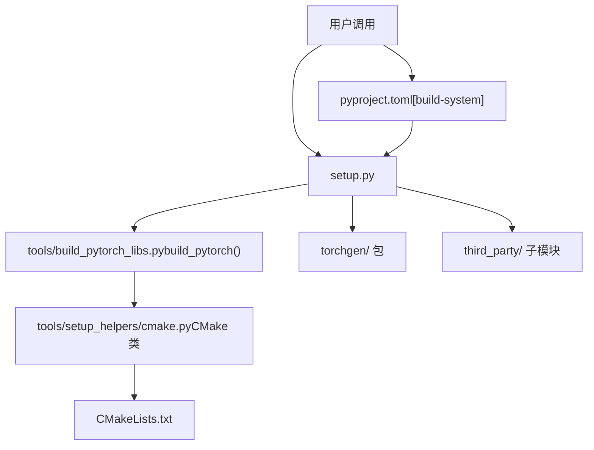
**来源**： [pyproject.toml3-17](https://github.com/pytorch/pytorch/blob/915982a4/pyproject.toml#L3-L17) [setup.py1-50](https://github.com/pytorch/pytorch/blob/915982a4/setup.py#L1-L50) [setup.py519-586](https://github.com/pytorch/pytorch/blob/915982a4/setup.py#L519-L586)

[pyproject.toml3-17](https://github.com/pytorch/pytorch/blob/915982a4/pyproject.toml#L3-L17) 文件定义了 PEP 517 构建系统的要求：

```
[build-system]requires = [    "setuptools>=70.1.0,<82",    "cmake>=3.27",    "ninja",    "numpy",    "packaging",    "pyyaml",    "requests",    ...]build-backend = "setuptools.build_meta"
```
[setup.py](https://github.com/pytorch/pytorch/blob/915982a4/setup.py) 脚本充当了主编排器，执行：

-   环境变量解析与验证
-   通过 `check_submodules()` 进行子模块初始化 [setup.py541-586](https://github.com/pytorch/pytorch/blob/915982a4/setup.py#L541-L586)
-   通过 `mirror_files_into_torchgen()` 为 `torchgen` 包进行文件镜像 [setup.py590-631](https://github.com/pytorch/pytorch/blob/915982a4/setup.py#L590-L631)
-   通过 [tools/build\_pytorch\_libs.py](https://github.com/pytorch/pytorch/blob/915982a4/tools/build_pytorch_libs.py) 中的 `build_pytorch()` 调用 CMake

**来源**： [pyproject.toml1-100](https://github.com/pytorch/pytorch/blob/915982a4/pyproject.toml#L1-L100) [setup.py245-631](https://github.com/pytorch/pytorch/blob/915982a4/setup.py#L245-L631) [tools/build\_pytorch\_libs.py1-50](https://github.com/pytorch/pytorch/blob/915982a4/tools/build_pytorch_libs.py#L1-L50)

### CMake 构建配置 (CMake Build Configuration)

C++ 构建由 CMake 管理，顶级 [CMakeLists.txt](https://github.com/pytorch/pytorch/blob/915982a4/CMakeLists.txt) 包含了后端特定的配置：

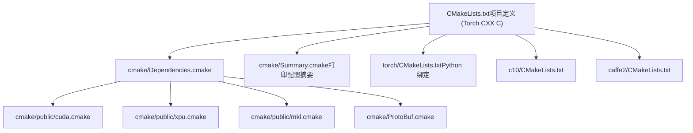
**来源**： [CMakeLists.txt1-100](https://github.com/pytorch/pytorch/blob/915982a4/CMakeLists.txt#L1-L100) [cmake/Dependencies.cmake1-100](https://github.com/pytorch/pytorch/blob/915982a4/cmake/Dependencies.cmake#L1-L100) [cmake/Summary.cmake1-50](https://github.com/pytorch/pytorch/blob/915982a4/cmake/Summary.cmake#L1-L50)

[CMakeLists.txt1-55](https://github.com/pytorch/pytorch/blob/915982a4/CMakeLists.txt#L1-L55) 文件确立了核心构建要求：

-   C++17 标准要求 [CMakeLists.txt47-54](https://github.com/pytorch/pytorch/blob/915982a4/CMakeLists.txt#L47-L54)
-   编译器检测的策略设置 [CMakeLists.txt6-20](https://github.com/pytorch/pytorch/blob/915982a4/CMakeLists.txt#L6-L20)
-   最低 GCC 版本检查 (9.3+) [CMakeLists.txt60-65](https://github.com/pytorch/pytorch/blob/915982a4/CMakeLists.txt#L60-L65)
-   架构检测 (CPU\_INTEL, CPU\_AARCH64, CPU\_POWER, CPU\_RISCV) [CMakeLists.txt171-184](https://github.com/pytorch/pytorch/blob/915982a4/CMakeLists.txt#L171-L184)

**来源**： [CMakeLists.txt1-400](https://github.com/pytorch/pytorch/blob/915982a4/CMakeLists.txt#L1-L400)

### 构建选项与环境变量 (Build Options and Environment Variables)

PyTorch 通过 CMake 选项和环境变量支持广泛的构建定制：

| 类别 | 变量 | 默认值 | 描述 |
| --- | --- | --- | --- |
| **核心** | `DEBUG` | OFF | 使用 -O0 和 -g 调试符号进行构建 |
| **核心** | `MAX_JOBS` | 自动 | 最大并行编译任务数 |
| **核心** | `BUILD_PYTHON` | ON | 构建 Python 绑定 |
| **CUDA** | `USE_CUDA` | ON | 启用 CUDA 支持 |
| **CUDA** | `USE_CUDNN` | ON (若 USE\_CUDA) | 启用 cuDNN |
| **CUDA** | `TORCH_CUDA_ARCH_LIST` | 自动 | 目标 CUDA 架构列表 |
| **BLAS** | `BLAS` | MKL | BLAS 库 (MKL/OpenBLAS/Eigen/等) |
| **分布式** | `USE_DISTRIBUTED` | ON | 启用 c10d 和分布式训练 |
| **分布式** | `USE_NCCL` | ON (若 USE\_CUDA) | 启用 NCCL 后端 |
| **移动端** | `BUILD_LITE_INTERPRETER` | OFF | 构建移动端轻量级解释器 |

**来源**： [setup.py1-243](https://github.com/pytorch/pytorch/blob/915982a4/setup.py#L1-L243) [CMakeLists.txt201-400](https://github.com/pytorch/pytorch/blob/915982a4/CMakeLists.txt#L201-L400)

[setup.py329-367](https://github.com/pytorch/pytorch/blob/915982a4/setup.py#L329-L367) 函数 `str2bool()` 标准化了布尔环境变量的解析，接受 "1"、"true"、"yes"、"on" 为真，接受 "0"、"false"、"no"、"off" 为假。

**来源**： [setup.py329-367](https://github.com/pytorch/pytorch/blob/915982a4/setup.py#L329-L367) [CMakeLists.txt240-400](https://github.com/pytorch/pytorch/blob/915982a4/CMakeLists.txt#L240-L400)

---

## 代码生成系统 (torchgen) (Code Generation System (torchgen))

PyTorch 的代码生成系统位于 `torchgen/` 目录，负责从 YAML 规范生成 C++ 算子、Autograd 函数、Python 绑定和类型存根 (type stubs)。这确保了各算子间的一致性并减少了手动代码维护量。

### 原生函数 YAML 规范 (Native Functions YAML Specification)

[aten/src/ATen/native/native\_functions.yaml](https://github.com/pytorch/pytorch/blob/915982a4/aten/src/ATen/native/native_functions.yaml) 文件是所有 PyTorch 算子的权威源：

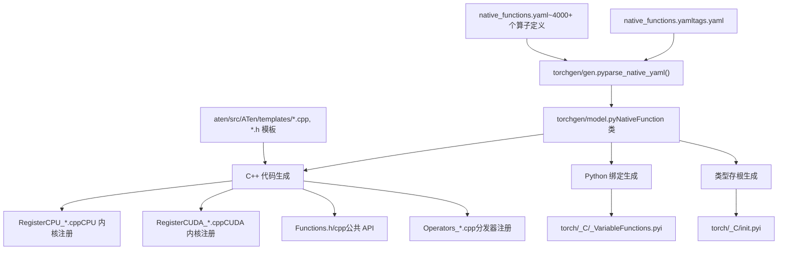
**来源**： [aten/src/ATen/native/native\_functions.yaml1-100](https://github.com/pytorch/pytorch/blob/915982a4/aten/src/ATen/native/native_functions.yaml#L1-L100) (参考), [CMakeLists.txt](https://github.com/pytorch/pytorch/blob/915982a4/CMakeLists.txt) (生成规则)

`native_functions.yaml` 中的每个算子遵循以下结构：

```
- func: add.Tensor(Tensor self, Tensor other, *, Scalar alpha=1) -> Tensor  variants: function, method  dispatch:    CPU: add_cpu    CUDA: add_cuda  tags: pointwise
```
YAML schema 由 [torchgen/gen.py](https://github.com/pytorch/pytorch/blob/915982a4/torchgen/gen.py) 解析为来自 [torchgen/model.py](https://github.com/pytorch/pytorch/blob/915982a4/torchgen/model.py) 的 `NativeFunction` 对象，包含：

-   函数签名和重载信息
-   映射到内核实现的分发键
-   后端可用性（CPU, CUDA, Meta 等）
-   用于分类的标签（pointwise, core 等）

**来源**： [torchgen/model.py](https://github.com/pytorch/pytorch/blob/915982a4/torchgen/model.py) (参考), [torchgen/gen.py](https://github.com/pytorch/pytorch/blob/915982a4/torchgen/gen.py) (参考)

### 代码生成流水线 (Code Generation Pipeline)

代码生成流水线在构建过程中被调用，产出多个类别的文件：

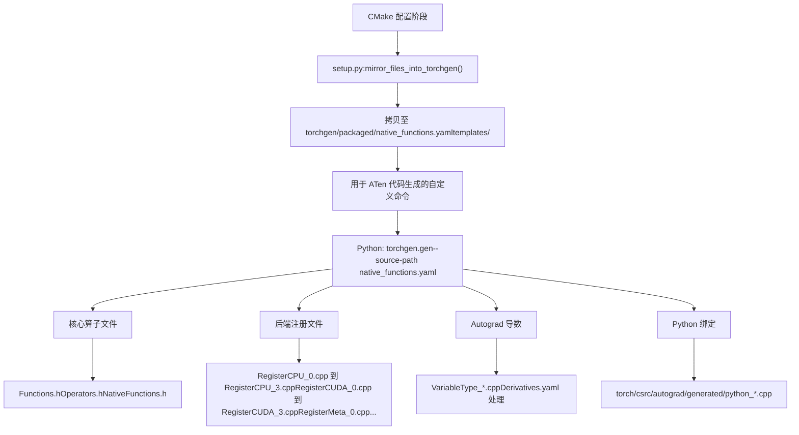
**来源**： [setup.py590-631](https://github.com/pytorch/pytorch/blob/915982a4/setup.py#L590-L631) [CMakeLists.txt](https://github.com/pytorch/pytorch/blob/915982a4/CMakeLists.txt) (生成规则)

[setup.py590-631](https://github.com/pytorch/pytorch/blob/915982a4/setup.py#L590-L631) 函数 `mirror_files_into_torchgen()` 将关键文件拷贝进 `torchgen/packaged/` 目录：

-   `native_functions.yaml` → `torchgen/packaged/ATen/native/native_functions.yaml`
-   `tags.yaml` → `torchgen/packaged/ATen/native/tags.yaml`
-   `aten/src/ATen/templates/` → `torchgen/packaged/ATen/templates/`
-   `tools/autograd/` → `torchgen/packaged/autograd/`

这种镜像机制允许 `torchgen` 被独立打包，用于下游项目。

**来源**： [setup.py590-631](https://github.com/pytorch/pytorch/blob/915982a4/setup.py#L590-L631)

### 按类别划分的生成文件 (Generated Files by Category)

代码生成系统产出如下几类文件：

#### 算子注册文件 (Operator Registration Files)

分布在多个文件中以并行化编译：

| 文件模式 | 用途 | 数量 |
| --- | --- | --- |
| `RegisterCPU_*.cpp` | CPU 内核注册 | 4 个文件 (0-3) |
| `RegisterCUDA_*.cpp` | CUDA 内核注册 | 4 个文件 (0-3) |
| `RegisterMeta_*.cpp` | Meta 张量形状推断 | 1 个文件 |
| `RegisterBackendSelect.cpp` | 后端选择逻辑 | 1 个文件 |
| `RegisterCompositeImplicitAutograd_*.cpp` | 复合算子 | 多个 |
| `RegisterSchema.cpp` | 算子 schema 注册 | 1 个文件 |

**来源**： [CMakeLists.txt](https://github.com/pytorch/pytorch/blob/915982a4/CMakeLists.txt) (生成规则), 构建输出

#### 公共 API 头文件 (Public API Headers)

| 文件 | 用途 |
| --- | --- |
| `Functions.h` | 函数式 API (例如 `torch::add()`) |
| `Operators.h` | 算子 API (例如 `at::add()`) |
| `NativeFunctions.h` | 原生函数声明 |
| `RedispatchFunctions.h` | 再分发机制 |
| `CPUFunctions.h` | CPU 特有函数 |

**来源**： 构建输出 (生成的工程文件)

#### Autograd 文件 (Autograd Files)

| 文件模式 | 用途 |
| --- | --- |
| `VariableType_*.cpp` | Autograd Variable 类型实现 |
| `TraceType_*.cpp` | JIT 追踪支持 |
| `Functions.cpp` | Autograd 函数实现 |
| `python_*.cpp` | Python Autograd 绑定 |

**来源**： [torch/csrc/autograd/generated/](https://github.com/pytorch/pytorch/blob/915982a4/torch/csrc/autograd/generated/) (输出目录)

### 基于模板的代码生成 (Template-Based Code Generation)

代码生成使用了位于 [aten/src/ATen/templates/](https://github.com/pytorch/pytorch/blob/915982a4/aten/src/ATen/templates/) 的 Jinja2 模板：

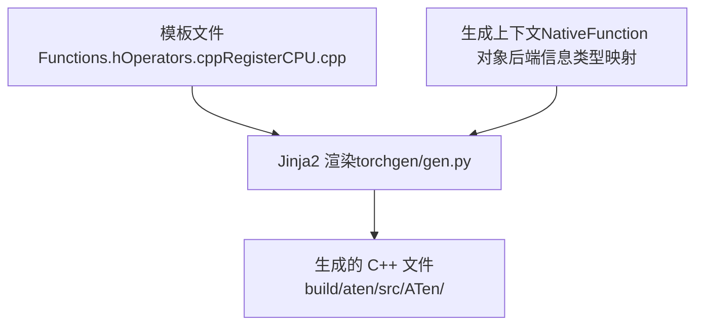
**来源**： [aten/src/ATen/templates/](https://github.com/pytorch/pytorch/blob/915982a4/aten/src/ATen/templates/) (目录), [torchgen/gen.py](https://github.com/pytorch/pytorch/blob/915982a4/torchgen/gen.py) (参考)

模板使用 Jinja2 语法迭代算子并生成重复性代码：

```
// 摘自 Functions.h 的模板{{function.return_type}} {{function.name}}({{function.parameters}});
```
模板引擎接收的上下文包括：

-   解析后的 `NativeFunction` 对象
-   后端分发信息
-   类型转换映射
-   每个后端的内核可用性

**来源**： [aten/src/ATen/templates/](https://github.com/pytorch/pytorch/blob/915982a4/aten/src/ATen/templates/) (目录)

---

## 构建流程 (Build Process Flow)

完整的构建过程遵循以下序列：

### 从构建调用到编译产物 (Build Invocation to Compiled Artifacts)

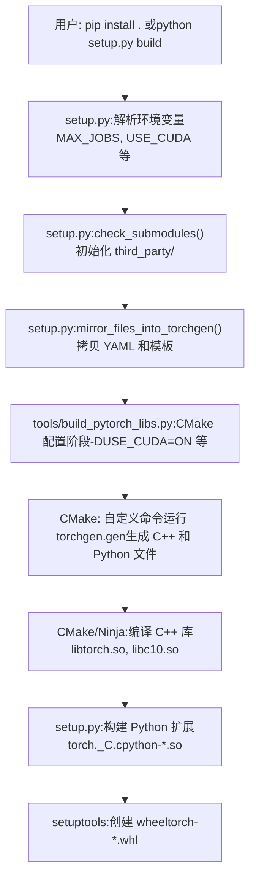
**来源**： [setup.py1-900](https://github.com/pytorch/pytorch/blob/915982a4/setup.py#L1-L900) [tools/build\_pytorch\_libs.py1-100](https://github.com/pytorch/pytorch/blob/915982a4/tools/build_pytorch_libs.py#L1-L100)

### 子模块管理 (Submodule Management)

PyTorch 依赖于大量作为 Git 子模块管理的第三方库：

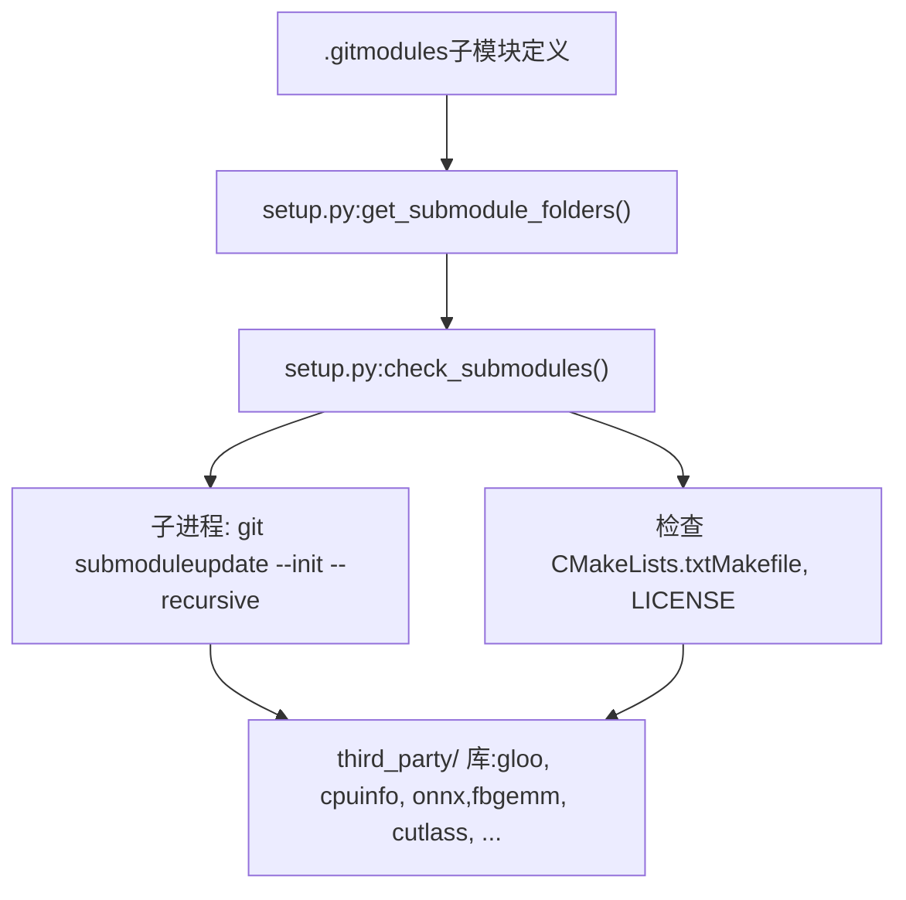
**来源**： [setup.py519-586](https://github.com/pytorch/pytorch/blob/915982a4/setup.py#L519-L586)

[setup.py541-586](https://github.com/pytorch/pytorch/blob/915982a4/setup.py#L541-L586) 中的 `check_submodules()` 函数：

1.  调用 `get_submodule_folders()` [setup.py519-538](https://github.com/pytorch/pytorch/blob/915982a4/setup.py#L519-L538) 枚举 `.gitmodules` 中的子模块。
2.  检查子模块目录是否存在且包含预期文件。
3.  若子模块缺失，则运行 `git submodule update --init --recursive`。
4.  验证关键文件是否存在（CMakeLists.txt, LICENSE 等）。

关键子模块包括：

-   `third_party/gloo` - 集合通信库
-   `third_party/cpuinfo` - CPU 特性检测
-   `third_party/onnx` - ONNX 格式支持
-   `third_party/fbgemm` - 量化 GEMM 操作
-   `third_party/cutlass` - NVIDIA CUTLASS CUDA 模板

**来源**： [setup.py519-586](https://github.com/pytorch/pytorch/blob/915982a4/setup.py#L519-L586)

### 依赖解析 (Dependency Resolution)

[cmake/Dependencies.cmake](https://github.com/pytorch/pytorch/blob/915982a4/cmake/Dependencies.cmake) 文件管理外部依赖：

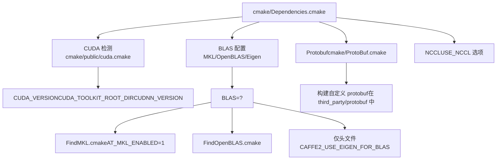
**来源**： [cmake/Dependencies.cmake1-500](https://github.com/pytorch/pytorch/blob/915982a4/cmake/Dependencies.cmake#L1-L500)

依赖解析遵循以下优先级：

1.  **CUDA/ROCm**：通过 `FindCUDA` 或 `FindHIP` 检测，设置 `CAFFE2_USE_CUDA` [cmake/Dependencies.cmake36-89](https://github.com/pytorch/pytorch/blob/915982a4/cmake/Dependencies.cmake#L36-L89)
2.  **BLAS**：优先级顺序为 MKL → OpenBLAS → ATLAS → Eigen [cmake/Dependencies.cmake159-267](https://github.com/pytorch/pytorch/blob/915982a4/cmake/Dependencies.cmake#L159-L267)
3.  **NCCL/RCCL**：取决于 `USE_DISTRIBUTED` 以及 CUDA/ROCm 的可用性 [cmake/Dependencies.cmake278-286](https://github.com/pytorch/pytorch/blob/915982a4/cmake/Dependencies.cmake#L278-L286)
4.  **Protobuf**：使用系统提供的或从 `third_party/protobuf` 构建 [cmake/Dependencies.cmake104-109](https://github.com/pytorch/pytorch/blob/915982a4/cmake/Dependencies.cmake#L104-L109)

**来源**： [cmake/Dependencies.cmake1-600](https://github.com/pytorch/pytorch/blob/915982a4/cmake/Dependencies.cmake#L1-L600)

---

## 高级构建特性 (Advanced Build Features)

### 条件编译与后端选择 (Conditional Compilation and Backend Selection)

PyTorch 支持对后端和算子进行选择性编译：

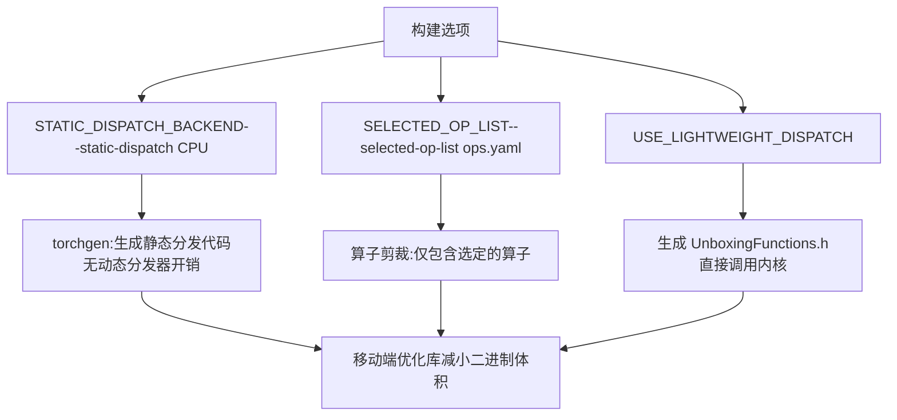
**来源**： [CMakeLists.txt541-559](https://github.com/pytorch/pytorch/blob/915982a4/CMakeLists.txt#L541-L559)

这些选项主要用于移动端构建 [CMakeLists.txt210-230](https://github.com/pytorch/pytorch/blob/915982a4/CMakeLists.txt#L210-L230)：

-   `BUILD_LITE_INTERPRETER`：启用移动端轻量级解释器
-   `SELECTED_OP_LIST`：要包含的算子列表 YAML 文件路径
-   `STATIC_DISPATCH_BACKEND`：为特定后端生成静态分发（例如 "CPU"）
-   `USE_LIGHTWEIGHT_DISPATCH`：启用 unboxed 内核调用约定

**来源**： [CMakeLists.txt210-559](https://github.com/pytorch/pytorch/blob/915982a4/CMakeLists.txt#L210-L559)

### Python 类型存根生成 (Python Type Stub Generation)

PyTorch 生成 `.pyi` 类型存根文件以提供 IDE 支持和类型检查：

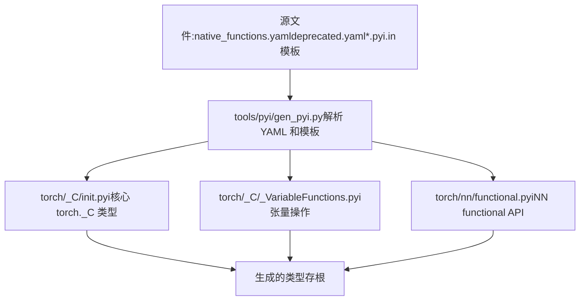
**来源**： [torch/CMakeLists.txt236-263](https://github.com/pytorch/pytorch/blob/915982a4/torch/CMakeLists.txt#L236-L263)

[torch/CMakeLists.txt239-263](https://github.com/pytorch/pytorch/blob/915982a4/torch/CMakeLists.txt#L239-L263) 里的自定义命令负责生成类型存根：

```
add_custom_command(    OUTPUT    "${TORCH_SRC_DIR}/_C/__init__.pyi"    "${TORCH_SRC_DIR}/_C/_VariableFunctions.pyi"    "${TORCH_SRC_DIR}/nn/functional.pyi"    COMMAND    "${Python_EXECUTABLE}" -mtools.pyi.gen_pyi      --native-functions-path "aten/src/ATen/native/native_functions.yaml"      --tags-path "aten/src/ATen/native/tags.yaml"      --deprecated-functions-path "tools/autograd/deprecated.yaml"    ...)
```
生成过程：

1.  解析 `native_functions.yaml` 获取算子签名。
2.  读取带有占位符的 `.pyi.in` 模板文件。
3.  基于 C++ 类型生成类型注解。
4.  产出完整的 `.pyi` 文件供 IDE 消费。

**来源**： [torch/CMakeLists.txt229-276](https://github.com/pytorch/pytorch/blob/915982a4/torch/CMakeLists.txt#L229-L276) [tools/pyi/gen\_pyi.py](https://github.com/pytorch/pytorch/blob/915982a4/tools/pyi/gen_pyi.py) (参考)

### Lint 检查与代码质量 (Linting and Code Quality)

构建系统通过 [.lintrunner.toml](https://github.com/pytorch/pytorch/blob/915982a4/.lintrunner.toml) 集成了代码质量检查：

| Linter | 代码 | 文件范围 | 目的 |
| --- | --- | --- | --- |
| Flake8 | `FLAKE8` | `**/*.py` | Python 风格检查 |
| clang-format | `CLANGFORMAT` | `**/*.cpp, **/*.h` | C++ 格式化 |
| clang-tidy | `CLANGTIDY` | `aten/src/**/*.cpp` | C++ 静态分析 |
| cmake-lint | `CMAKE` | `**/CMakeLists.txt` | CMake 风格 |
| Native Functions | `NATIVEFUNCTIONS` | `native_functions.yaml` | YAML 验证 |

**来源**： [.lintrunner.toml1-400](https://github.com/pytorch/pytorch/blob/915982a4/.lintrunner.toml#L1-L400)

[.lintrunner.toml1-50](https://github.com/pytorch/pytorch/blob/915982a4/.lintrunner.toml#L1-L50) 配置定义了多个 linter：

-   Python linter： FLAKE8, TYPEIGNORE, NOQA
-   C++ linter： CLANGFORMAT, CLANGTIDY
-   构建文件 linter： CMAKE, NATIVEFUNCTIONS
-   专门 linter： PYBIND11\_INCLUDE, CUBINCLUDE

**来源**： [.lintrunner.toml1-500](https://github.com/pytorch/pytorch/blob/915982a4/.lintrunner.toml#L1-L500) [.flake81-53](https://github.com/pytorch/pytorch/blob/915982a4/.flake8#L1-L53)

### 专门内核模板集成 (Specialized Kernel Template Integration)

针对高级 GPU 内核，构建系统将外部模板拷贝进源码树：

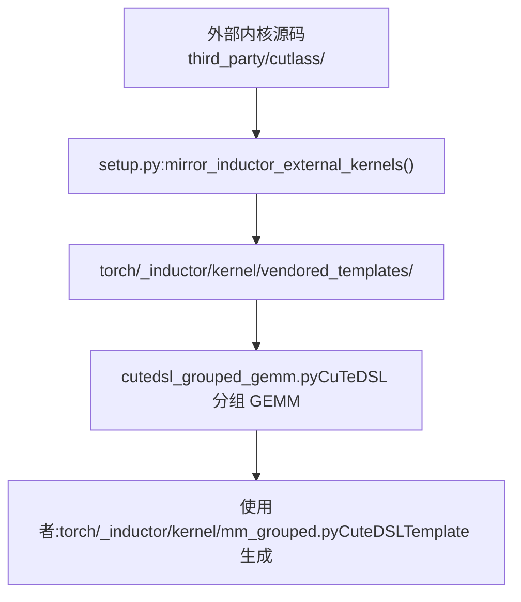
**来源**： [setup.py633-672](https://github.com/pytorch/pytorch/blob/915982a4/setup.py#L633-L672) [torch/\_inductor/kernel/mm\_grouped.py1-50](https://github.com/pytorch/pytorch/blob/915982a4/torch/_inductor/kernel/mm_grouped.py#L1-L50)

[setup.py633-672](https://github.com/pytorch/pytorch/blob/915982a4/setup.py#L633-L672) 中的 `mirror_inductor_external_kernels()` 函数负责拷贝专门内核：

```
paths = [    (        CWD / "torch/_inductor/kernel/vendored_templates/cutedsl_grouped_gemm.py",        CWD / "third_party/cutlass/examples/python/CuTeDSL/blackwell/grouped_gemm.py",        True,  # allow_missing_if_cuda_is_disabled    ),]
```
这允许 Inductor 使用最前沿的 CUDA 内核实现，而无需在运行时直接依赖外部仓库。

**来源**： [setup.py633-672](https://github.com/pytorch/pytorch/blob/915982a4/setup.py#L633-L672) [torch/\_inductor/kernel/mm\_grouped.py139-143](https://github.com/pytorch/pytorch/blob/915982a4/torch/_inductor/kernel/mm_grouped.py#L139-L143)

---

## 构建配置参考 (Build Configuration Reference)

### 关键 CMake 变量 (Key CMake Variables)

| 变量 | 类型 | 默认值 | 描述 |
| --- | --- | --- | --- |
| `CMAKE_BUILD_TYPE` | STRING | Release | 构建类型 (Debug/Release/RelWithDebInfo) |
| `CMAKE_INSTALL_PREFIX` | PATH | /usr/local | 安装目录 |
| `BUILD_SHARED_LIBS` | BOOL | ON | 构建动态库 |
| `BUILD_PYTHON` | BOOL | ON | 构建 Python 绑定 |
| `BUILD_TEST` | BOOL | ON | 构建 C++ 测试二进制文件 |
| `USE_CUDA` | BOOL | ON | 启用 CUDA 支持 |
| `USE_CUDNN` | BOOL | ON | 启用 cuDNN |
| `USE_MKLDNN` | BOOL | ON (x86) | 启用 MKLDNN/oneDNN |
| `USE_DISTRIBUTED` | BOOL | ON | 启用分布式训练 |
| `USE_NCCL` | BOOL | ON | 启用 NCCL 后端 |

**来源**： [CMakeLists.txt201-400](https://github.com/pytorch/pytorch/blob/915982a4/CMakeLists.txt#L201-L400)

### 环境变量到 CMake 选项的映射 (Environment Variable to CMake Option Mapping)

`setup.py` 脚本将环境变量转换为 CMake 选项：

| 环境变量 | CMake 选项 | 备注 |
| --- | --- | --- |
| `DEBUG=1` | `-DCMAKE_BUILD_TYPE=Debug` | 添加 -g 和 -O0 标志位 |
| `REL_WITH_DEB_INFO=1` | `-DCMAKE_BUILD_TYPE=RelWithDebInfo` | 优化 + 调试符号 |
| `USE_CUDA=0` | `-DUSE_CUDA=OFF` | 禁用 CUDA |
| `MAX_JOBS=8` | 设置 Ninja 并行任务数 | 控制编译并行度 |
| `BLAS=OpenBLAS` | `-DBLAS=OpenBLAS` | 选择 BLAS 实现 |
| `TORCH_CUDA_ARCH_LIST=7.0;8.0` | `-DTORCH_CUDA_ARCH_LIST=7.0;8.0` | CUDA 架构列表 |

**来源**： [setup.py1-400](https://github.com/pytorch/pytorch/blob/915982a4/setup.py#L1-L400) [tools/setup\_helpers/cmake.py](https://github.com/pytorch/pytorch/blob/915982a4/tools/setup_helpers/cmake.py) (参考)

### 生成文件位置 (Generated File Locations)

构建成功后，生成的文件位于：

| 类别 | 位置 | 模式 |
| --- | --- | --- |
| ATen 算子 | `build/aten/src/ATen/` | `Register*.cpp`, `Functions.h` |
| Autograd | `torch/csrc/autograd/generated/` | `VariableType_*.cpp` |
| Python 绑定 | `torch/csrc/autograd/generated/` | `python_*.cpp` |
| 类型存根 | `torch/_C/` | `*.pyi` |
| 库文件 | `torch/lib/` | `libtorch.so`, `libc10.so` |
| Python 扩展 | `torch/` | `_C.cpython-*.so` |

**来源**： [CMakeLists.txt](https://github.com/pytorch/pytorch/blob/915982a4/CMakeLists.txt) [torch/CMakeLists.txt](https://github.com/pytorch/pytorch/blob/915982a4/torch/CMakeLists.txt) 构建输出

---

**总结 (Summary)**： PyTorch 的构建系统结合了 Python 打包 (PEP 517) 与基于 CMake 的 C++ 编译，并广泛使用了基于 YAML 规范的代码生成机制。`torchgen` 包从 `native_functions.yaml` 生成了数千个 C++ 文件，确保了 4000 多个算子的一致性。构建配置通过环境变量和 CMake 选项进行控制，支持多种后端 (CUDA, ROCm, MPS, XPU) 和使用场景（服务器、移动端、嵌入式）。

**来源**： [pyproject.toml](https://github.com/pytorch/pytorch/blob/915982a4/pyproject.toml) [setup.py](https://github.com/pytorch/pytorch/blob/915982a4/setup.py) [CMakeLists.txt](https://github.com/pytorch/pytorch/blob/915982a4/CMakeLists.txt) [cmake/Dependencies.cmake](https://github.com/pytorch/pytorch/blob/915982a4/cmake/Dependencies.cmake) [torchgen/](https://github.com/pytorch/pytorch/blob/915982a4/torchgen/) (目录)
