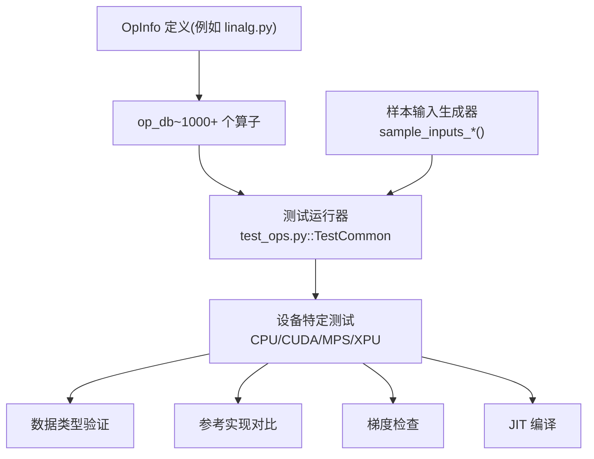
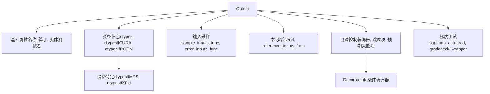
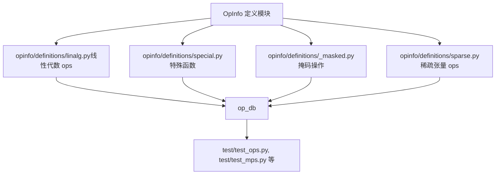
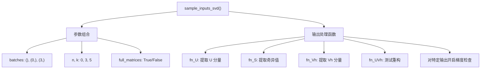
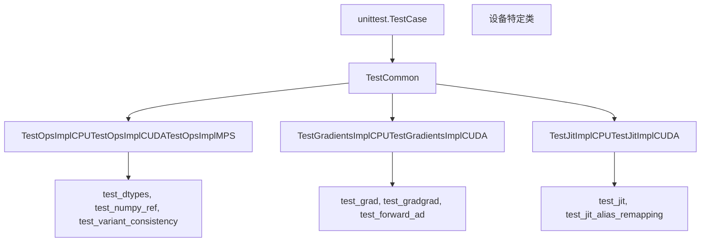
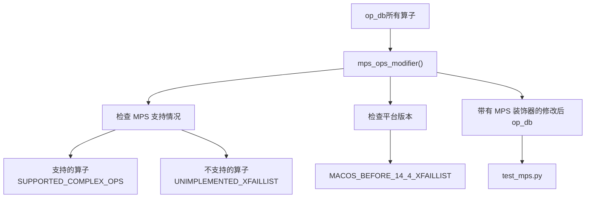
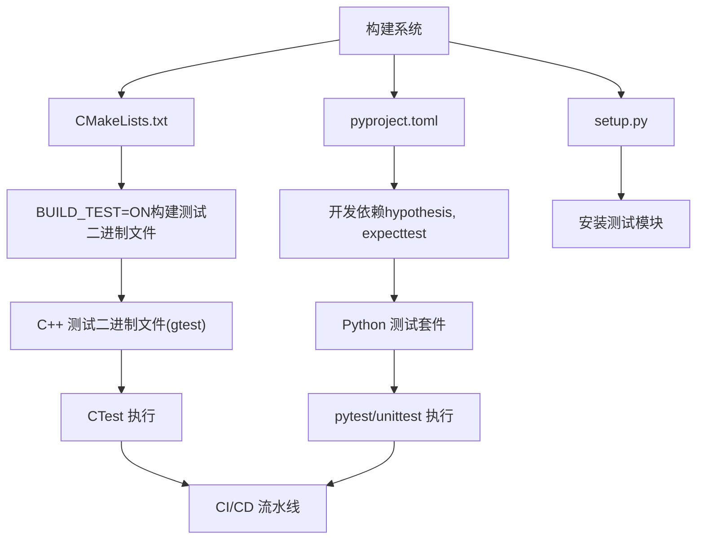
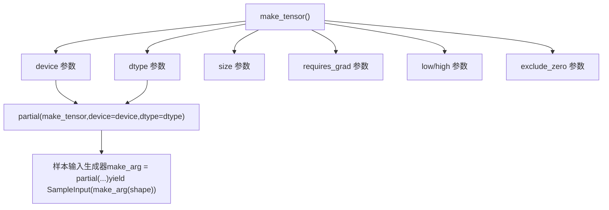
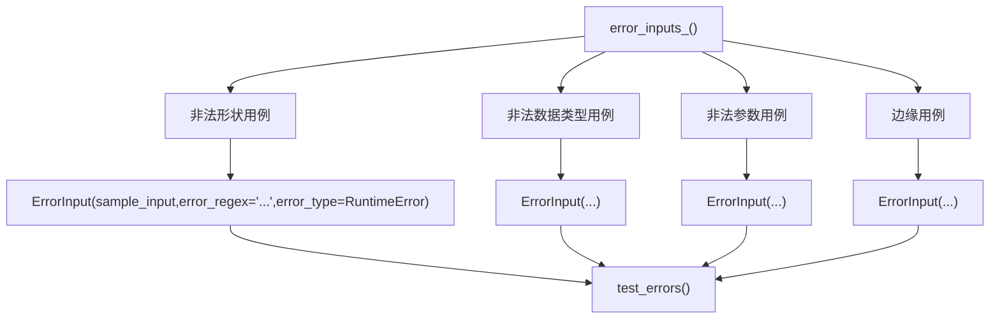
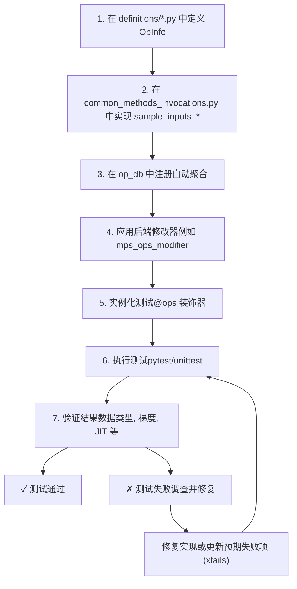

# 测试基础设施与 OpInfo (Testing Infrastructure and OpInfo)

相关源文件 (Relevant source files)

-   [.ci/docker/common/install\_cpython.sh](https://github.com/pytorch/pytorch/blob/915982a4/.ci/docker/common/install_cpython.sh)
-   [.ci/docker/manywheel/build\_scripts/ssl-check.py](https://github.com/pytorch/pytorch/blob/915982a4/.ci/docker/manywheel/build_scripts/ssl-check.py)
-   [.ci/pytorch/numba-cuda-13.patch](https://github.com/pytorch/pytorch/blob/915982a4/.ci/pytorch/numba-cuda-13.patch)
-   [.ci/pytorch/test.sh](https://github.com/pytorch/pytorch/blob/915982a4/.ci/pytorch/test.sh)
-   [.github/actions/linux-test/action.yml](https://github.com/pytorch/pytorch/blob/915982a4/.github/actions/linux-test/action.yml)
-   [.github/actions/test-pytorch-binary/action.yml](https://github.com/pytorch/pytorch/blob/915982a4/.github/actions/test-pytorch-binary/action.yml)
-   [.github/workflows/\_linux-build.yml](https://github.com/pytorch/pytorch/blob/915982a4/.github/workflows/_linux-build.yml)
-   [.github/workflows/\_linux-test.yml](https://github.com/pytorch/pytorch/blob/915982a4/.github/workflows/_linux-test.yml)
-   [.github/workflows/\_xpu-test.yml](https://github.com/pytorch/pytorch/blob/915982a4/.github/workflows/_xpu-test.yml)
-   [aten/src/ATen/native/tags.yaml](https://github.com/pytorch/pytorch/blob/915982a4/aten/src/ATen/native/tags.yaml)
-   [docs/source/distributed.md](https://github.com/pytorch/pytorch/blob/915982a4/docs/source/distributed.md)
-   [test/custom\_operator/test\_out\_variant.py](https://github.com/pytorch/pytorch/blob/915982a4/test/custom_operator/test_out_variant.py)
-   [test/distributed/test\_c10d\_nccl.py](https://github.com/pytorch/pytorch/blob/915982a4/test/distributed/test_c10d_nccl.py)
-   [test/jit/test\_autodiff\_subgraph\_slicing.py](https://github.com/pytorch/pytorch/blob/915982a4/test/jit/test_autodiff_subgraph_slicing.py)
-   [test/run\_test.py](https://github.com/pytorch/pytorch/blob/915982a4/test/run_test.py)
-   [test/test\_bundled\_inputs.py](https://github.com/pytorch/pytorch/blob/915982a4/test/test_bundled_inputs.py)
-   [test/test\_complex.py](https://github.com/pytorch/pytorch/blob/915982a4/test/test_complex.py)
-   [test/test\_jit.py](https://github.com/pytorch/pytorch/blob/915982a4/test/test_jit.py)
-   [test/test\_jit\_autocast.py](https://github.com/pytorch/pytorch/blob/915982a4/test/test_jit_autocast.py)
-   [test/test\_jit\_fuser.py](https://github.com/pytorch/pytorch/blob/915982a4/test/test_jit_fuser.py)
-   [test/test\_jit\_fuser\_legacy.py](https://github.com/pytorch/pytorch/blob/915982a4/test/test_jit_fuser_legacy.py)
-   [test/test\_jit\_fuser\_te.py](https://github.com/pytorch/pytorch/blob/915982a4/test/test_jit_fuser_te.py)
-   [test/test\_jit\_legacy.py](https://github.com/pytorch/pytorch/blob/915982a4/test/test_jit_legacy.py)
-   [test/test\_ops.py](https://github.com/pytorch/pytorch/blob/915982a4/test/test_ops.py)
-   [test/test\_type\_hints.py](https://github.com/pytorch/pytorch/blob/915982a4/test/test_type_hints.py)
-   [test/test\_type\_info.py](https://github.com/pytorch/pytorch/blob/915982a4/test/test_type_info.py)
-   [tools/stats/monitor.py](https://github.com/pytorch/pytorch/blob/915982a4/tools/stats/monitor.py)
-   [tools/stats/utilization\_stats\_lib.py](https://github.com/pytorch/pytorch/blob/915982a4/tools/stats/utilization_stats_lib.py)
-   [torch/\_library/\_out\_variant.py](https://github.com/pytorch/pytorch/blob/915982a4/torch/_library/_out_variant.py)
-   [torch/csrc/distributed/c10d/Backend.hpp](https://github.com/pytorch/pytorch/blob/915982a4/torch/csrc/distributed/c10d/Backend.hpp)
-   [torch/csrc/distributed/c10d/NCCLUtils.cpp](https://github.com/pytorch/pytorch/blob/915982a4/torch/csrc/distributed/c10d/NCCLUtils.cpp)
-   [torch/csrc/distributed/c10d/NCCLUtils.hpp](https://github.com/pytorch/pytorch/blob/915982a4/torch/csrc/distributed/c10d/NCCLUtils.hpp)
-   [torch/csrc/distributed/c10d/ProcessGroupNCCL.cpp](https://github.com/pytorch/pytorch/blob/915982a4/torch/csrc/distributed/c10d/ProcessGroupNCCL.cpp)
-   [torch/csrc/distributed/c10d/ProcessGroupNCCL.hpp](https://github.com/pytorch/pytorch/blob/915982a4/torch/csrc/distributed/c10d/ProcessGroupNCCL.hpp)
-   [torch/distributed/distributed\_c10d.py](https://github.com/pytorch/pytorch/blob/915982a4/torch/distributed/distributed_c10d.py)
-   [torch/testing/\_internal/common\_distributed.py](https://github.com/pytorch/pytorch/blob/915982a4/torch/testing/_internal/common_distributed.py)
-   [torch/testing/\_internal/common\_fsdp.py](https://github.com/pytorch/pytorch/blob/915982a4/torch/testing/_internal/common_fsdp.py)
-   [torch/testing/\_internal/common\_nn.py](https://github.com/pytorch/pytorch/blob/915982a4/torch/testing/_internal/common_nn.py)
-   [torch/testing/\_internal/common\_utils.py](https://github.com/pytorch/pytorch/blob/915982a4/torch/testing/_internal/common_utils.py)
-   [torch/testing/\_internal/distributed/distributed\_test.py](https://github.com/pytorch/pytorch/blob/915982a4/torch/testing/_internal/distributed/distributed_test.py)
-   [torch/testing/\_internal/opinfo/definitions/fft.py](https://github.com/pytorch/pytorch/blob/915982a4/torch/testing/_internal/opinfo/definitions/fft.py)

## 目的与范围 (Purpose and Scope)

本文档描述了 PyTorch 的算子测试基础设施，其核心是 **OpInfo** 抽象。OpInfo 系统提供了一种系统化的方法，用于在多个设备（CPU, CUDA, MPS, XPU）和数据类型（dtype）上测试 1000 多个 PyTorch 算子，并自动验证正确性、梯度、JIT 编译及其他属性。

**相关页面：**

-   有关从 `native_functions.yaml` 进行的代码生成，请参阅 [5.1](/pytorch/pytorch/5.1-build-system-and-code-generation)
-   有关构建系统和 CMake 的信息，请参阅 [5.1](/pytorch/pytorch/5.1-build-system-and-code-generation)

---

## 概览：测试架构 (Overview: Testing Architecture)

PyTorch 的测试基础设施围绕三个核心概念组织：

1.  **OpInfo 数据库** (`op_db`) —— 算子元数据的集中注册表
2.  **样本输入生成器 (Sample Input Generators)** —— 为每个算子产生测试用例的函数
3.  **测试运行器 (Test Runners)** —— 执行验证的设备特定测试类

该系统能够以极少的针对算子的模板代码，实现全面的跨设备测试。

### 高层测试流程 (High-Level Testing Flow)


**来源：** [torch/testing/\_internal/common\_methods\_invocations.py1-160](https://github.com/pytorch/pytorch/blob/915982a4/torch/testing/_internal/common_methods_invocations.py#L1-L160) [test/test\_ops.py1-80](https://github.com/pytorch/pytorch/blob/915982a4/test/test_ops.py#L1-L80)

---

## OpInfo：核心抽象 (OpInfo: The Core Abstraction)

`OpInfo` 类是描述算子测试要求的核心数据结构。每个 OpInfo 实例都包含关于以下内容的元数据：

-   算子可调用对象
-   支持的数据类型和设备
-   样本输入生成策略
-   用于验证的参考实现
-   预期失败 (expected failures) 和装饰器

### OpInfo 类结构 (OpInfo Class Structure)


**来源：** [torch/testing/\_internal/opinfo/core.py](https://github.com/pytorch/pytorch/blob/915982a4/torch/testing/_internal/opinfo/core.py) [torch/testing/\_internal/common\_methods\_invocations.py59-109](https://github.com/pytorch/pytorch/blob/915982a4/torch/testing/_internal/common_methods_invocations.py#L59-L109)

### 专门的 OpInfo 类型 (Specialized OpInfo Types)

PyTorch 为不同的算子类别提供了专门的 `OpInfo` 子类：

| OpInfo 类型 | 用途 | 关键特性 |
| --- | --- | --- |
| `OpInfo` | 通用算子 | 具有完整灵活性基类 |
| `UnaryUfuncInfo` | 一元逐元素操作 | 自动参考生成，定义域检查 |
| `BinaryUfuncInfo` | 二元逐元素操作 | 广播测试，类型提升 |
| `ReductionOpInfo` | 归约操作 | 维度处理，keepdim 参数 |
| `SpectralFuncInfo` | FFT 和频谱操作 | 复数支持，归一化模式 |
| `ShapeFuncInfo` | 形状变换操作 | 动态形状测试 |
| `ForeachFuncInfo` | Foreach 操作 | 张量列表输入处理 |

**来源：** [torch/testing/\_internal/common\_methods\_invocations.py88-101](https://github.com/pytorch/pytorch/blob/915982a4/torch/testing/_internal/common_methods_invocations.py#L88-L101)

---

## OpInfo 数据库 (op\_db) (The OpInfo Database (op_db))

`op_db` 是包含所有 `OpInfo` 实例的元组，是算子测试的唯一事实来源。它通过从多个专门模块导入 OpInfo 定义而构建。

### OpInfo 注册模式 (OpInfo Registration Pattern)


### 关键数据库文件 (Key Database Files)

```python
# torch/testing/_internal/common_methods_invocations.py
from torch.testing._internal.opinfo.core import (    
    OpInfo,    
    SampleInput,    
    ErrorInput,    
    # ... 其他导入项
)

# 导入专门的 OpInfo 定义
from torch.testing._internal.opinfo.definitions.linalg import (    
    sample_inputs_linalg_cholesky,    
    sample_inputs_svd,    
    # ... 更多
)

from torch.testing._internal.opinfo.definitions.special import (    
    sample_inputs_i0_i1,    
    sample_inputs_polygamma,    
    # ... 更多
)
```
**来源：** [torch/testing/\_internal/common\_methods\_invocations.py1-154](https://github.com/pytorch/pytorch/blob/915982a4/torch/testing/_internal/common_methods_invocations.py#L1-L154) [torch/testing/\_internal/opinfo/definitions/linalg.py1-60](https://github.com/pytorch/pytorch/blob/915982a4/torch/testing/_internal/opinfo/definitions/linalg.py#L1-L60)

---

## 样本输入生成 (Sample Input Generation)

样本输入生成是为每个算子创建具体测试用例的过程。每个 OpInfo 指定一个 `sample_inputs_func`，该函数产生 `SampleInput` 对象。

### SampleInput 和 ErrorInput 类 (SampleInput and ErrorInput Classes)

### 样本输入生成模式 (Sample Input Generation Pattern)

样本输入生成器遵循一致的模式：

```python
def sample_inputs_<operation>(op_info, device, dtype, requires_grad, **kwargs):    
    """    产生 SampleInput 实例的生成器函数。        
    参数：        
        op_info: 该操作对应的 OpInfo 对象        
        device: 目标设备 ('cpu', 'cuda', 'mps' 等)        
        dtype: 待测数据类型        
        requires_grad: 张量是否需要梯度        
    产出：        
        SampleInput: 包含输入张量、位置参数和关键字参数的测试用例    
    """    
    make_arg = partial(make_tensor, device=device, dtype=dtype,                       
                       requires_grad=requires_grad)        
    
    # 产出各种测试用例    
    yield SampleInput(make_arg((S, S)))  # 方阵    
    yield SampleInput(make_arg((S, M)))  # 长方形矩阵    
    yield SampleInput(make_arg((3, S, S)), kwargs={'dim': 1})  # 批量
```
**来源：** [torch/testing/\_internal/common\_methods\_invocations.py174-229](https://github.com/pytorch/pytorch/blob/915982a4/torch/testing/_internal/common_methods_invocations.py#L174-L229) [torch/testing/\_internal/opinfo/definitions/linalg.py120-130](https://github.com/pytorch/pytorch/blob/915982a4/torch/testing/_internal/opinfo/definitions/linalg.py#L120-L130)

### 示例：SVD 样本输入 (Example: SVD Sample Inputs)

SVD 操作展示了带有输出处理的高级样本输入生成：


**来源：** [torch/testing/\_internal/opinfo/definitions/linalg.py75-118](https://github.com/pytorch/pytorch/blob/915982a4/torch/testing/_internal/opinfo/definitions/linalg.py#L75-L118)

---

## 测试执行框架 (Test Execution Framework)

`test_ops.py` 中的测试执行框架跨所有支持的设备类型和数据类型，为每个 OpInfo 实例化测试。

### 测试类层级结构 (Test Class Hierarchy)


### 测试方法：test\_numpy\_ref (Test Method: test_numpy_ref)

核心测试方法之一是验证算子是否与 NumPy 参考实现匹配：

```python
# test/test_ops.py
@ops(_ref_test_ops, allowed_dtypes=(torch.float, torch.cfloat))
def test_numpy_ref(self, device, dtype, op):    
    """    验证 PyTorch 算子是否与 NumPy 参考实现匹配。    """    
    # 生成样本输入    
    for sample_input in op.sample_inputs(device, dtype, requires_grad=False):        
        # 运行 PyTorch 版本        
        torch_result = op(sample_input.input, *sample_input.args,                          
                          **sample_input.kwargs)                
        
        # 运行 NumPy 参考版本        
        numpy_result = op.ref(sample_input.input.cpu().numpy(),                              
                              *sample_input.args, **sample_input.kwargs)                
        
        # 对比结果        
        self.assertEqual(torch_result, numpy_result)
```
**来源：** [test/test\_ops.py99-107](https://github.com/pytorch/pytorch/blob/915982a4/test/test_ops.py#L99-L107)

### 使用 @ops 装饰器进行测试实例化 (Test Instantiation with @ops Decorator)

使用 `@ops` 装饰器对测试进行实例化，它会自动为每个 OpInfo 生成测试方法：

```python
# @ops 装饰器生成如下测试方法：
# - test_dtypes_add_cpu_float32
# - test_dtypes_add_cuda_float64
# - test_numpy_ref_svd_cpu_complex64
# 等等

@ops(op_db, dtypes=OpDTypes.supported)
def test_dtypes(self, device, dtype, op):    
    """使用特定数据类型测试算子。"""    
    pass

@ops(_ref_test_ops)
def test_numpy_ref(self, device, dtype, op):    
    """与 NumPy 参考实现对比。"""    
    pass
```
**来源：** [test/test\_ops.py90-107](https://github.com/pytorch/pytorch/blob/915982a4/test/test_ops.py#L90-L107) [torch/testing/\_internal/common\_device\_type.py](https://github.com/pytorch/pytorch/blob/915982a4/torch/testing/_internal/common_device_type.py)

---

## 后端特定测试：MPS 示例 (Backend-Specific Testing: MPS Example)

后端特定测试需要处理不同的算子支持程度和失败模式。MPS (Metal Performance Shaders) 后端提供了一个全面的示例。

### MPS 测试架构 (MPS Testing Architecture)


### MPS Ops 修改器实现 (MPS Ops Modifier Implementation)

`mps_ops_modifier` 函数为 `OpInfo` 实例应用后端特定的装饰器：

```python
# torch/testing/_internal/common_mps.py
def mps_ops_modifier(    
    ops: Sequence[OpInfo],    
    device_type: str = "mps",    
    xfail_exclusion: Optional[list[str]] = None,    
    sparse: bool = False,) -> Sequence[OpInfo]:    
    """    
    为 MPS 测试修改 OpInfo 数据库，增加以下内容：    
    - 不支持操作的预期失败 (xfails)    
    - 特定数据类型的预期失败    
    - 平台特定（macOS 版本）的预期失败    
    """        
    
    # 定义支持的复数操作    
    SUPPORTED_COMPLEX_OPS = {        
        "__radd__", "__rmul__", "abs", "add", "conj", "exp", ...    
    }        
    
    # 定义带有可选数据类型限制的未实现操作    
    UNIMPLEMENTED_XFAILLIST: dict[str, Optional[list]] = {        
        "logspace": None,  # 完全不支持        
        "linalg.eig": None,        
        "median": [torch.bool],  # 仅不支持 bool        
        "native_batch_norm": [torch.uint8, torch.bool, ...],        
        ...    
    }        
    
    # 应用修改...
```
**来源：** [torch/testing/\_internal/common\_mps.py13-659](https://github.com/pytorch/pytorch/blob/915982a4/torch/testing/_internal/common_mps.py#L13-L659)

### MPS 预期失败列表 (MPS Xfail Lists)

MPS 后端维护了几个预期失败列表，用于追踪算子支持情况：

| 列表名称 | 用途 | 示例条目 |
| --- | --- | --- |
| `SUPPORTED_COMPLEX_OPS` | 显式支持的复数操作 | `"abs"`, `"add"`, `"matmul"`, `"fft.fft"` |
| `UNIMPLEMENTED_XFAILLIST` | 尚未实现的算子 | `"logspace"`, `"linalg.eig"`, `"qr"` |
| `MACOS_BEFORE_14_4_XFAILLIST` | 版本特定的失败 | `"fft.hfft2": [torch.complex64]` |
| `UNDEFINED_XFAILLIST` | 产出随机/不稳定结果的算子 | `"multinomial"`, `"uniform"`, `"randn"` |

**来源：** [torch/testing/\_internal/common\_mps.py22-659](https://github.com/pytorch/pytorch/blob/915982a4/torch/testing/_internal/common_mps.py#L22-L659)

### 测试一致性模式 (Test Consistency Pattern)

MPS 测试使用了 `op_db` 的深拷贝，以便进行独立修改：

```python
# test/test_mps.py

# 创建用于一致性测试的独立副本
test_consistency_op_db = copy.deepcopy(op_db)

# 应用 MPS 特定的修改
modified_ops = mps_ops_modifier(    
    test_consistency_op_db,    
    device_type="mps",    
    xfail_exclusion=[])

# 在测试中使用修改后的数据库
@ops(modified_ops, allowed_dtypes=MPS_DTYPES)
def test_mps_consistency(self, device, dtype, op):    
    """验证 MPS 输出是否与 CPU 匹配。"""    
    pass
```
**来源：** [test/test\_mps.py52-63](https://github.com/pytorch/pytorch/blob/915982a4/test/test_mps.py#L52-L63)

---

## 与构建系统的集成 (Integration with Build System)

测试基础设施与 PyTorch 的构建系统集成，以支持提交前测试和 CI 验证。

### 关键集成点 (Key Integration Points)


**来源：** [CMakeLists.txt218-234](https://github.com/pytorch/pytorch/blob/915982a4/CMakeLists.txt#L218-L234) [pyproject.toml19-51](https://github.com/pytorch/pytorch/blob/915982a4/pyproject.toml#L19-L51) [setup.py1-50](https://github.com/pytorch/pytorch/blob/915982a4/setup.py#L1-L50)

### 测试发现与执行 (Test Discovery and Execution)

`pyproject.toml` 指定了测试所需的开发依赖：

```
[dependency-groups]dev = [    "expecttest>=0.3.0",    "hypothesis",    "networkx>=2.5.1",    ...]
```
CMake 控制 C++ 测试的编译：

```cmake
# CMakeLists.txt
option(BUILD_TEST "Build C++ test binaries (need gtest and gbenchmark)" ON)
```
**来源：** [pyproject.toml19-51](https://github.com/pytorch/pytorch/blob/915982a4/pyproject.toml#L19-L51) [CMakeLists.txt218-234](https://github.com/pytorch/pytorch/blob/915982a4/CMakeLists.txt#L218-L234)

### Lint 检查与代码质量 (Linting and Code Quality)

测试基础设施通过 `.lintrunner.toml` 中配置的 linter 进行验证：

```toml
[[linter]]
code = 'FLAKE8'
include_patterns = ['**/*.py']
exclude_patterns = [    
    'test/generated_type_hints_smoketest.py',    
    'test/torch_np/numpy_test/**/*.py',    
    ...]
```
**来源：** [.lintrunner.toml1-50](https://github.com/pytorch/pytorch/blob/915982a4/.lintrunner.toml#L1-L50) [.flake81-20](https://github.com/pytorch/pytorch/blob/915982a4/.flake8#L1-L20)

---

## 常用样本输入模式 (Common Sample Input Patterns)

`common_methods_invocations.py` 模块提供了可在不同算子类别中复用的样本输入生成模式。

### 张量工厂函数 (Tensor Factory Functions)


### 按算子类型的常用模式 (Common Patterns by Operator Type)

**归约操作 (Reduction Operations)：**

```python
def sample_inputs_reduction(op_info, device, dtype, requires_grad, **kwargs):    
    make_arg = partial(make_tensor, device=device, dtype=dtype,                       
                       requires_grad=requires_grad)        
    
    # 不进行归约 (keepdim 变体)    
    yield SampleInput(make_arg((S, S, S)))    
    yield SampleInput(make_arg((S, S, S)), kwargs={'keepdim': True})        
    
    # 单维度归约    
    yield SampleInput(make_arg((S, S, S)), kwargs={'dim': 0})    
    yield SampleInput(make_arg((S, S, S)), kwargs={'dim': 1, 'keepdim': True})        
    
    # 多维度归约    
    yield SampleInput(make_arg((S, S, S)), kwargs={'dim': (0, 2)})
```
**二元逐元素操作 (Element-wise Binary Operations)：**

```python
def sample_inputs_elementwise_binary(op_info, device, dtype, requires_grad, **kwargs):    
    make_arg = partial(make_tensor, device=device, dtype=dtype,                      
                       requires_grad=requires_grad)        
    
    # 相同形状输入    
    yield SampleInput(make_arg((S, S)), args=(make_arg((S, S)),))        
    
    # 广播输入    
    yield SampleInput(make_arg((S, 1)), args=(make_arg((S, S)),))    
    yield SampleInput(make_arg((1, S)), args=(make_arg((S, S)),))        
    
    # 标量参数    
    yield SampleInput(make_arg((S, S)), args=(0.5,))
```
**线性代数操作 (Linear Algebra Operations)：**

```python
def sample_inputs_linalg_invertible(op_info, device, dtype, requires_grad, **kwargs):    
    """针对需要可逆矩阵的操作。"""    
    make_fullrank = make_fullrank_matrices_with_distinct_singular_values    
    make_arg = partial(make_fullrank, dtype=dtype, device=device,                      
                       requires_grad=requires_grad)        
    
    # 方阵    
    yield SampleInput(make_arg(S, S))        
    
    # 批量方阵    
    yield SampleInput(make_arg(3, S, S))    
    yield SampleInput(make_arg(2, 1, S, S))
```
**来源：** [torch/testing/\_internal/common\_methods\_invocations.py174-658](https://github.com/pytorch/pytorch/blob/915982a4/torch/testing/_internal/common_methods_invocations.py#L174-L658)

---

## 错误输入测试 (Error Input Testing)

错误输入测试验证算子是否能针对非法输入正确抛出异常。

### ErrorInput 模式 (ErrorInput Pattern)


### 示例：切分操作的错误输入 (Example: Error Inputs for Split Operations)

```python
def error_inputs_hsplit(op_info, device, **kwargs):    
    make_arg = partial(make_tensor, dtype=torch.float32, device=device)        
    
    # 错误：0 维张量    
    err_msg1 = "torch.hsplit requires a tensor with at least 1 dimension"    
    yield ErrorInput(        
        SampleInput(make_arg(()), 0),         
        error_regex=err_msg1    
    )        
    
    # 错误：尺寸不能被 split_size 整除    
    err_msg2 = f"size of the dimension {S} is not divisible by the split_size 0"    
    yield ErrorInput(        
        SampleInput(make_arg((S, S, S)), 0),        
        error_regex=err_msg2    
    )        
    
    # 错误：参数类型不正确    
    err_msg3 = "received an invalid combination of arguments"    
    yield ErrorInput(        
        SampleInput(make_arg((S, S, S)), "abc"),        
        error_type=TypeError,        
        error_regex=err_msg3    
    )
```
**来源：** [torch/testing/\_internal/common\_methods\_invocations.py230-275](https://github.com/pytorch/pytorch/blob/915982a4/torch/testing/_internal/common_methods_invocations.py#L230-L275)

---

## 总结：测试工作流 (Summary: Testing Workflow)

从 OpInfo 定义到测试执行的完整测试工作流：


**测试基础设施中的关键文件：**

| 文件 | 用途 |
| --- | --- |
| `torch/testing/_internal/opinfo/core.py` | OpInfo 类定义 |
| `torch/testing/_internal/common_methods_invocations.py` | 样本输入生成器和 op\_db |
| `torch/testing/_internal/opinfo/definitions/*.py` | 按类别划分的 OpInfo 定义 |
| `test/test_ops.py` | 主算子测试套件 |
| `test/test_mps.py` | MPS 后端特定测试 |
| `torch/testing/_internal/common_mps.py` | MPS 修改器函数 |
| `torch/testing/_internal/common_device_type.py` | 设备类型测试装饰器 |

**来源：** [torch/testing/\_internal/common\_methods\_invocations.py1-160](https://github.com/pytorch/pytorch/blob/915982a4/torch/testing/_internal/common_methods_invocations.py#L1-L160) [test/test\_ops.py1-80](https://github.com/pytorch/pytorch/blob/915982a4/test/test_ops.py#L1-L80) [torch/testing/\_internal/common\_mps.py1-60](https://github.com/pytorch/pytorch/blob/915982a4/torch/testing/_internal/common_mps.py#L1-L60)
