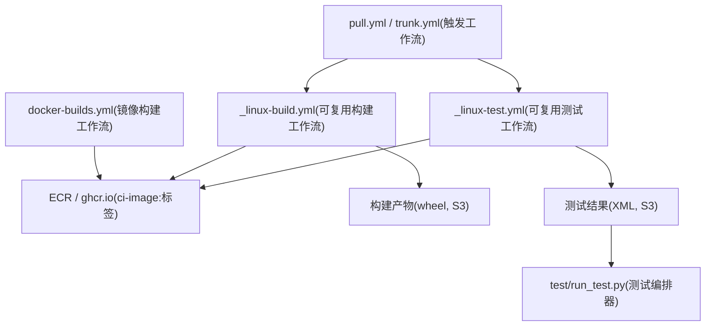
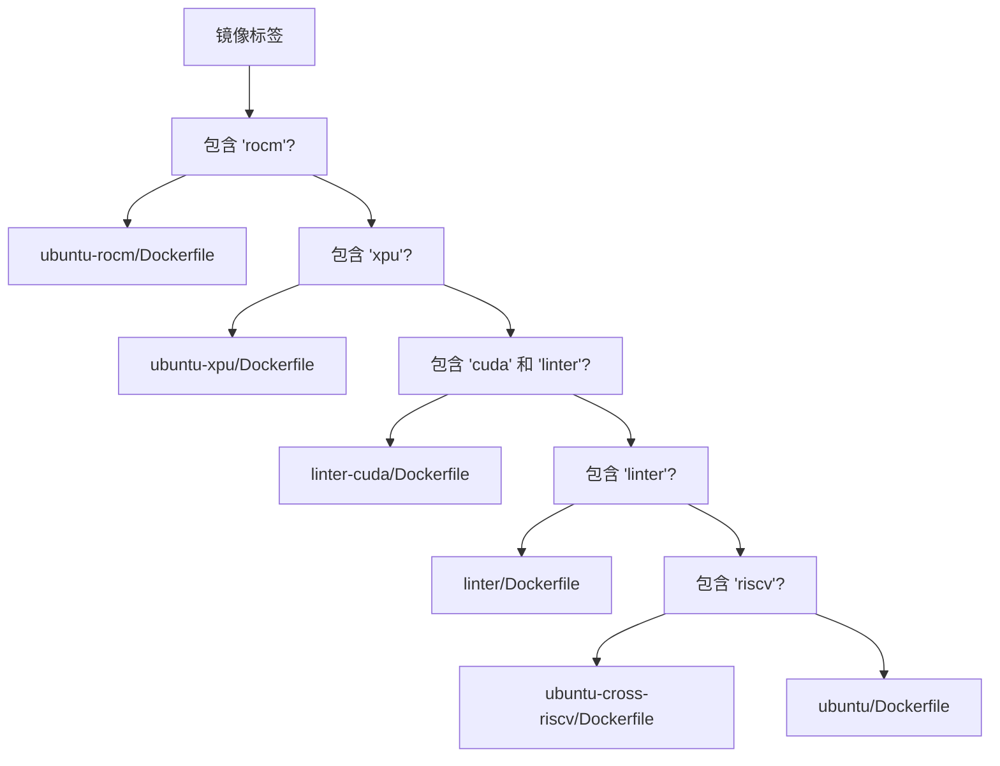
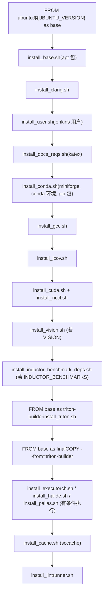
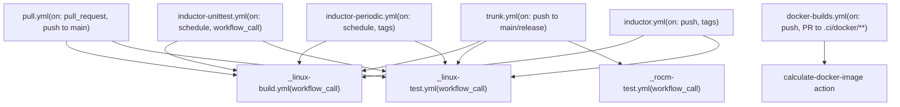
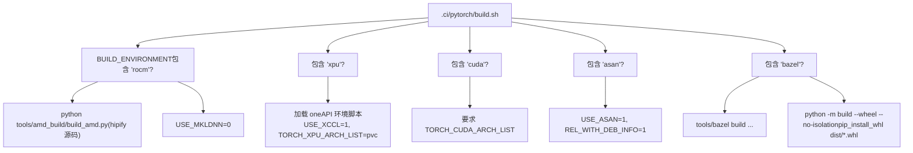
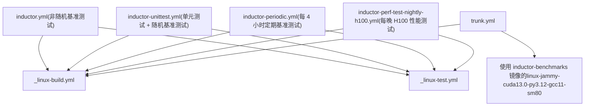

# CI/CD 工作流与 Docker 镜像构建 (CI/CD Workflows and Docker Image Builds)

相关源文件 (Relevant source files)

-   [.ci/docker/build.sh](https://github.com/pytorch/pytorch/blob/915982a4/.ci/docker/build.sh)
-   [.ci/docker/common/install\_amdsmi.sh](https://github.com/pytorch/pytorch/blob/915982a4/.ci/docker/common/install_amdsmi.sh)
-   [.ci/docker/common/install\_cache.sh](https://github.com/pytorch/pytorch/blob/915982a4/.ci/docker/common/install_cache.sh)
-   [.ci/docker/common/install\_conda.sh](https://github.com/pytorch/pytorch/blob/915982a4/.ci/docker/common/install_conda.sh)
-   [.ci/docker/common/install\_cpython.sh](https://github.com/pytorch/pytorch/blob/915982a4/.ci/docker/common/install_cpython.sh)
-   [.ci/docker/common/install\_inductor\_benchmark\_deps.sh](https://github.com/pytorch/pytorch/blob/915982a4/.ci/docker/common/install_inductor_benchmark_deps.sh)
-   [.ci/docker/common/install\_mingw.sh](https://github.com/pytorch/pytorch/blob/915982a4/.ci/docker/common/install_mingw.sh)
-   [.ci/docker/common/install\_rocm.sh](https://github.com/pytorch/pytorch/blob/915982a4/.ci/docker/common/install_rocm.sh)
-   [.ci/docker/manywheel/build\_scripts/ssl-check.py](https://github.com/pytorch/pytorch/blob/915982a4/.ci/docker/manywheel/build_scripts/ssl-check.py)
-   [.ci/docker/ubuntu-rocm/Dockerfile](https://github.com/pytorch/pytorch/blob/915982a4/.ci/docker/ubuntu-rocm/Dockerfile)
-   [.ci/docker/ubuntu/Dockerfile](https://github.com/pytorch/pytorch/blob/915982a4/.ci/docker/ubuntu/Dockerfile)
-   [.ci/pytorch/build.sh](https://github.com/pytorch/pytorch/blob/915982a4/.ci/pytorch/build.sh)
-   [.ci/pytorch/common\_utils.sh](https://github.com/pytorch/pytorch/blob/915982a4/.ci/pytorch/common_utils.sh)
-   [.ci/pytorch/numba-cuda-13.patch](https://github.com/pytorch/pytorch/blob/915982a4/.ci/pytorch/numba-cuda-13.patch)
-   [.ci/pytorch/test.sh](https://github.com/pytorch/pytorch/blob/915982a4/.ci/pytorch/test.sh)
-   [.github/actions/linux-test/action.yml](https://github.com/pytorch/pytorch/blob/915982a4/.github/actions/linux-test/action.yml)
-   [.github/actions/test-pytorch-binary/action.yml](https://github.com/pytorch/pytorch/blob/915982a4/.github/actions/test-pytorch-binary/action.yml)
-   [.github/ci\_commit\_pins/fbgemm\_rocm.txt](https://github.com/pytorch/pytorch/blob/915982a4/.github/ci_commit_pins/fbgemm_rocm.txt)
-   [.github/workflows/\_linux-build.yml](https://github.com/pytorch/pytorch/blob/915982a4/.github/workflows/_linux-build.yml)
-   [.github/workflows/\_linux-test.yml](https://github.com/pytorch/pytorch/blob/915982a4/.github/workflows/_linux-test.yml)
-   [.github/workflows/\_xpu-test.yml](https://github.com/pytorch/pytorch/blob/915982a4/.github/workflows/_xpu-test.yml)
-   [.github/workflows/docker-builds.yml](https://github.com/pytorch/pytorch/blob/915982a4/.github/workflows/docker-builds.yml)
-   [.github/workflows/dynamo-unittest.yml](https://github.com/pytorch/pytorch/blob/915982a4/.github/workflows/dynamo-unittest.yml)
-   [.github/workflows/inductor-micro-benchmark.yml](https://github.com/pytorch/pytorch/blob/915982a4/.github/workflows/inductor-micro-benchmark.yml)
-   [.github/workflows/inductor-perf-compare.yml](https://github.com/pytorch/pytorch/blob/915982a4/.github/workflows/inductor-perf-compare.yml)
-   [.github/workflows/inductor-perf-test-b200.yml](https://github.com/pytorch/pytorch/blob/915982a4/.github/workflows/inductor-perf-test-b200.yml)
-   [.github/workflows/inductor-perf-test-nightly-h100.yml](https://github.com/pytorch/pytorch/blob/915982a4/.github/workflows/inductor-perf-test-nightly-h100.yml)
-   [.github/workflows/inductor-perf-test-nightly.yml](https://github.com/pytorch/pytorch/blob/915982a4/.github/workflows/inductor-perf-test-nightly.yml)
-   [.github/workflows/inductor-periodic.yml](https://github.com/pytorch/pytorch/blob/915982a4/.github/workflows/inductor-periodic.yml)
-   [.github/workflows/inductor-unittest.yml](https://github.com/pytorch/pytorch/blob/915982a4/.github/workflows/inductor-unittest.yml)
-   [.github/workflows/inductor.yml](https://github.com/pytorch/pytorch/blob/915982a4/.github/workflows/inductor.yml)
-   [.github/workflows/pull.yml](https://github.com/pytorch/pytorch/blob/915982a4/.github/workflows/pull.yml)
-   [.github/workflows/rocm-nightly.yml](https://github.com/pytorch/pytorch/blob/915982a4/.github/workflows/rocm-nightly.yml)
-   [.github/workflows/slow.yml](https://github.com/pytorch/pytorch/blob/915982a4/.github/workflows/slow.yml)
-   [.github/workflows/torchbench.yml](https://github.com/pytorch/pytorch/blob/915982a4/.github/workflows/torchbench.yml)
-   [.github/workflows/trunk.yml](https://github.com/pytorch/pytorch/blob/915982a4/.github/workflows/trunk.yml)
-   [aten/src/ATen/native/tags.yaml](https://github.com/pytorch/pytorch/blob/915982a4/aten/src/ATen/native/tags.yaml)
-   [cmake/public/utils.cmake](https://github.com/pytorch/pytorch/blob/915982a4/cmake/public/utils.cmake)
-   [test/custom\_operator/test\_out\_variant.py](https://github.com/pytorch/pytorch/blob/915982a4/test/custom_operator/test_out_variant.py)
-   [test/run\_test.py](https://github.com/pytorch/pytorch/blob/915982a4/test/run_test.py)
-   [test/test\_bundled\_inputs.py](https://github.com/pytorch/pytorch/blob/915982a4/test/test_bundled_inputs.py)
-   [test/test\_complex.py](https://github.com/pytorch/pytorch/blob/915982a4/test/test_complex.py)
-   [test/test\_ops.py](https://github.com/pytorch/pytorch/blob/915982a4/test/test_ops.py)
-   [test/test\_type\_hints.py](https://github.com/pytorch/pytorch/blob/915982a4/test/test_type_hints.py)
-   [test/test\_type\_info.py](https://github.com/pytorch/pytorch/blob/915982a4/test/test_type_info.py)
-   [tools/stats/monitor.py](https://github.com/pytorch/pytorch/blob/915982a4/tools/stats/monitor.py)
-   [tools/stats/utilization\_stats\_lib.py](https://github.com/pytorch/pytorch/blob/915982a4/tools/stats/utilization_stats_lib.py)
-   [torch/\_library/\_out\_variant.py](https://github.com/pytorch/pytorch/blob/915982a4/torch/_library/_out_variant.py)
-   [torch/csrc/distributed/c10d/symm\_mem/nccl\_dev\_cap.hpp](https://github.com/pytorch/pytorch/blob/915982a4/torch/csrc/distributed/c10d/symm_mem/nccl_dev_cap.hpp)
-   [torch/csrc/distributed/c10d/symm\_mem/nccl\_devcomm\_manager.hpp](https://github.com/pytorch/pytorch/blob/915982a4/torch/csrc/distributed/c10d/symm_mem/nccl_devcomm_manager.hpp)
-   [torch/testing/\_internal/opinfo/definitions/fft.py](https://github.com/pytorch/pytorch/blob/915982a4/torch/testing/_internal/opinfo/definitions/fft.py)

## 目的与范围 (Purpose and Scope)

本页记录了 PyTorch 的 GitHub Actions CI/CD 系统是如何构建的，如何为每种构建配置构造 Docker 镜像，如何在这些容器内执行构建和测试，以及各主要工作流文件之间的关系。

本页涵盖了 CI 基础设施层：镜像构造、工作流编排以及容器内运行的 shell 脚本。有关测试框架本身（测试工具、参数化、OpInfo）的信息，请参阅 [测试基础设施与 OpInfo](/pytorch/pytorch/5.2-testing-infrastructure-and-opinfo)。有关生产可分发包的二进制发布流水线，请参阅 [二进制发布流水线](/pytorch/pytorch/5.4-binary-release-pipeline)。

---

## 高层架构 (High-Level Architecture)

CI 系统包含三个主要阶段：Docker 镜像构造、在容器内进行 PyTorch 构建，以及在容器内进行测试执行。这些阶段由 GitHub Actions 工作流协调，并调用可复用的子工作流。

**CI 阶段流程图**


来源： [.github/workflows/pull.yml1-114](https://github.com/pytorch/pytorch/blob/915982a4/.github/workflows/pull.yml#L1-L114) [.github/workflows/trunk.yml1-115](https://github.com/pytorch/pytorch/blob/915982a4/.github/workflows/trunk.yml#L1-L115) [.github/workflows/docker-builds.yml1-50](https://github.com/pytorch/pytorch/blob/915982a4/.github/workflows/docker-builds.yml#L1-L50) [.github/workflows/\_linux-build.yml1-60](https://github.com/pytorch/pytorch/blob/915982a4/.github/workflows/_linux-build.yml#L1-L60) [.github/workflows/\_linux-test.yml1-100](https://github.com/pytorch/pytorch/blob/915982a4/.github/workflows/_linux-test.yml#L1-L100)

---

## Docker 镜像构造 (Docker Image Construction)

### 镜像命名约定 (Image Naming Convention)

所有 CI 镜像遵循以下命名模式：

```
pytorch-linux-{os}-{加速器?}-{python}-{编译器}-{变体?}
```
示例：

-   `pytorch-linux-jammy-cuda13.0-cudnn9-py3-gcc11`
-   `pytorch-linux-jammy-rocm-n-py3`
-   `pytorch-linux-noble-xpu-n-py3`
-   `pytorch-linux-jammy-py3.10-clang15`
-   `pytorch-linux-jammy-linter`

镜像存储在 ECR 的 `ci-image:` 前缀下，并在推送到 `main` 或发布分支时镜像到 `ghcr.io/pytorch/ci-image`。

### `build.sh`：从镜像标签到构建参数 (`build.sh`: Image Tag to Build Parameters)

[.ci/docker/build.sh](https://github.com/pytorch/pytorch/blob/915982a4/.ci/docker/build.sh) 是构造任何 CI Docker 镜像的入口点。给定一个镜像标签，它会执行以下操作：

1.  解析标签以提取版本组件 (`CUDA_VERSION`, `ROCM_VERSION`, `ANACONDA_PYTHON_VERSION`, `GCC_VERSION`, `CLANG_VERSION` 等)
2.  选择合适的 `Dockerfile`
3.  使用解析出的 `--build-arg` 值调用 `docker buildx build`
4.  通过在容器内运行版本检查来验证已构建的镜像

**Dockerfile 选择逻辑**


来源： [.ci/docker/build.sh68-83](https://github.com/pytorch/pytorch/blob/915982a4/.ci/docker/build.sh#L68-L83)

**传递给 Docker 的构建参数**

| 构建参数 | 用途 |
| --- | --- |
| `ANACONDA_PYTHON_VERSION` | conda 环境的 Python 版本 |
| `CUDA_VERSION` | 要安装的 CUDA 工具包版本 |
| `ROCM_VERSION` | 要安装的 ROCm 版本 |
| `GCC_VERSION` / `CLANG_VERSION` | 编译器版本 |
| `TRITON` | 是否安装 Triton |
| `INDUCTOR_BENCHMARKS` | 是否安装 torchbench/HuggingFace/timm |
| `VISION` | 是否安装 torchvision |
| `PALLAS` / `TPU` | JAX/Pallas 支持 |
| `HALIDE` | Halide 编译器支持 |
| `EXECUTORCH` | ExecuTorch 支持 |
| `KATEX` | 用于文档生成的 KaTeX |
| `INSTALL_MINGW` | MinGW 交叉编译工具链 |

来源： [.ci/docker/build.sh359-401](https://github.com/pytorch/pytorch/blob/915982a4/.ci/docker/build.sh#L359-L401)

### 硬编码的标签配置 (Hardcoded Tag Configurations)

大多数生产镜像配置并不是从标签名推导出来的，而是硬编码在 `build.sh` 的 `case` 语句中。这避免了歧义并允许精细控制。选定示例：

| 标签 | Python | 编译器 | 额外组件 |
| --- | --- | --- | --- |
| `pytorch-linux-jammy-cuda13.0-cudnn9-py3-gcc11` | 3.10 | GCC 11 | VISION, KATEX, TRITON |
| `pytorch-linux-jammy-cuda13.0-cudnn9-py3-gcc11-inductor-benchmarks` | 3.10 | GCC 11 | \+ INDUCTOR\_BENCHMARKS |
| `pytorch-linux-jammy-rocm-n-py3` | 3.10 | GCC 13 | ROCm 7.2, TRITON |
| `pytorch-linux-noble-xpu-n-py3` | 3.10 | GCC 13 | XPU 2025.3 |
| `pytorch-linux-jammy-py3-clang18-asan` | 3.10 | Clang 18 | VISION |
| `pytorch-linux-jammy-py3.12-halide` | 3.12 | GCC 11 | HALIDE, CUDA 12.6 |
| `pytorch-linux-jammy-aarch64-py3.10-gcc13` | 3.10 | GCC 13 | ACL, OPENBLAS |

来源： [.ci/docker/build.sh93-306](https://github.com/pytorch/pytorch/blob/915982a4/.ci/docker/build.sh#L93-L306)

### Ubuntu Dockerfile 结构 (Ubuntu Dockerfile Structure)

基础 Ubuntu Dockerfile ([.ci/docker/ubuntu/Dockerfile](https://github.com/pytorch/pytorch/blob/915982a4/.ci/docker/ubuntu/Dockerfile)) 使用了多阶段构建：

**Ubuntu Dockerfile 层级顺序**


来源： [.ci/docker/ubuntu/Dockerfile1-165](https://github.com/pytorch/pytorch/blob/915982a4/.ci/docker/ubuntu/Dockerfile#L1-L165)

### ROCm Dockerfile

[.ci/docker/ubuntu-rocm/Dockerfile](https://github.com/pytorch/pytorch/blob/915982a4/.ci/docker/ubuntu-rocm/Dockerfile) 遵循类似的模式，但通过 `install_rocm.sh` 安装 ROCm。它将 `PYTORCH_ROCM_ARCH` 设置为固化在镜像中的环境变量（例如 `gfx90a;gfx942;gfx950;gfx1100`）。

### Inductor 基准测试依赖 (Inductor Benchmark Dependencies)

当 `INDUCTOR_BENCHMARKS=yes` 时， [.ci/docker/common/install\_inductor\_benchmark\_deps.sh](https://github.com/pytorch/pytorch/blob/915982a4/.ci/docker/common/install_inductor_benchmark_deps.sh) 会安装：

-   `torchbench`（取自 `ci_commit_pins/torchbench.txt` 中指定的 commit）
-   HuggingFace Transformers（来自 `ci_commit_pins/huggingface-requirements.txt`）
-   `timm`（取自 `ci_commit_pins/timm.txt` 中指定的 commit）

安装完成后，它会删除 `torch`、`torchvision`、`torchaudio` 和 `triton`，以便在测试时使用 CI 构建的版本。

来源： [.ci/docker/common/install\_inductor\_benchmark\_deps.sh1-72](https://github.com/pytorch/pytorch/blob/915982a4/.ci/docker/common/install_inductor_benchmark_deps.sh#L1-L72)

---

## GitHub Actions 工作流结构 (GitHub Actions Workflow Structure)

### 可复用工作流模式 (Reusable Workflow Pattern)

PyTorch 广泛使用了 GitHub Actions 的可复用工作流 (`workflow_call`)。顶层工作流委派给共享实现：


来源： [.github/workflows/pull.yml1-30](https://github.com/pytorch/pytorch/blob/915982a4/.github/workflows/pull.yml#L1-L30) [.github/workflows/trunk.yml1-35](https://github.com/pytorch/pytorch/blob/915982a4/.github/workflows/trunk.yml#L1-L35) [.github/workflows/docker-builds.yml43-120](https://github.com/pytorch/pytorch/blob/915982a4/.github/workflows/docker-builds.yml#L43-L120) [.github/workflows/inductor-unittest.yml34-61](https://github.com/pytorch/pytorch/blob/915982a4/.github/workflows/inductor-unittest.yml#L34-L61)

### 工作流触发摘要 (Workflow Trigger Summary)

| 工作流 | 触发条件 |
| --- | --- |
| `pull.yml` | `pull_request`, 推送到 `main`/`release/*`/`landchecks/*`, `ciflow/pull/*` 标签, 定时任务 |
| `trunk.yml` | 推送到 `main`/`release/*`/`landchecks/*`, `ciflow/trunk/*` 标签, 定时任务 |
| `docker-builds.yml` | `.ci/docker/**` 变更, 推送到 `main`/`release/*`, 定时任务（每周） |
| `inductor-unittest.yml` | `workflow_call`, 定时任务（每日）, 工作流文件 PR |
| `inductor-periodic.yml` | `ciflow/inductor-periodic/*` 标签, 定时任务（工作日每 4 小时） |
| `inductor.yml` | 推送到 `main`/`release/*`, `ciflow/inductor/*` 标签 |
| `slow.yml` | 推送到 `main`/`release/*`, `ciflow/slow/*` 标签, 定时任务 |

来源： [.github/workflows/pull.yml3-27](https://github.com/pytorch/pytorch/blob/915982a4/.github/workflows/pull.yml#L3-L27) [.github/workflows/trunk.yml3-24](https://github.com/pytorch/pytorch/blob/915982a4/.github/workflows/trunk.yml#L3-L24) [.github/workflows/docker-builds.yml4-21](https://github.com/pytorch/pytorch/blob/915982a4/.github/workflows/docker-builds.yml#L4-L21)

### 任务过滤与运行器选择 (Job Filtering and Runner Selection)

`pull.yml` 和 `trunk.yml` 都以两个前提任务开始：

-   **`job-filter`**：使用 `.github/workflows/job-filter.yml` 过滤要运行的任务（可以通过 `workflow_dispatch` 的输入项 `jobs-to-include` 进行覆盖）
-   **`get-label-type`**：使用 `_runner-determinator.yml` 确定运行器标签前缀（根据 PR 标签和操作者在自托管与 GitHub 托管运行器间选择）
-   **`llm-td` + `target-determination`**：下载并运行目标确定产物，以便有选择地跳过不受该 PR 影响的测试

来源： [.github/workflows/pull.yml37-69](https://github.com/pytorch/pytorch/blob/915982a4/.github/workflows/pull.yml#L37-L69) [.github/workflows/trunk.yml36-68](https://github.com/pytorch/pytorch/blob/915982a4/.github/workflows/trunk.yml#L36-L68)

### `docker-builds.yml`：镜像构建与推送 (`docker-builds.yml`: Image Build and Push)

该工作流构建并验证所有的生产 CI 镜像。每个镜像都在矩阵任务中构建。构建完成后：

1.  镜像被推送到 AWS ECR（始终执行）
2.  在向 `main`/release 分支 `push` 时，镜像也会通过重试循环被推送到 `ghcr.io/pytorch/ci-image`

ARM64 镜像 (`pytorch-linux-jammy-aarch64-*`) 通过 `matrix.include` 覆盖项使用 `linux.arm64.m7g.4xlarge` 运行器。

来源： [.github/workflows/docker-builds.yml43-170](https://github.com/pytorch/pytorch/blob/915982a4/.github/workflows/docker-builds.yml#L43-L170)

---

## 构建流水线：`_linux-build.yml` 和 `build.sh` (Build Pipeline: _linux-build.yml and build.sh)

### `_linux-build.yml` 输入参数 (`_linux-build.yml` Inputs)

可复用的构建工作流接受：

| 输入 | 描述 |
| --- | --- |
| `build-environment` | 标签字符串，例如 `linux-jammy-cuda13.0-py3.10-gcc11` |
| `docker-image-name` | 例如 `ci-image:pytorch-linux-jammy-cuda13.0-cudnn9-py3-gcc11` |
| `cuda-arch-list` | 空格分隔的 CUDA 架构列表，例如 `7.5 8.9` |
| `test-matrix` | 用于下游测试任务的 JSON 矩阵 |
| `runner` | 运行器标签 |
| `build-generates-artifacts` | 是否将 wheel 上传到 S3 |

来源： [.github/workflows/\_linux-build.yml1-60](https://github.com/pytorch/pytorch/blob/915982a4/.github/workflows/_linux-build.yml#L1-L60)

### `build.sh`：容器内构建逻辑 (`build.sh`: In-Container Build Logic)

[.ci/pytorch/build.sh](https://github.com/pytorch/pytorch/blob/915982a4/.ci/pytorch/build.sh) 在 Docker 容器内运行，负责实际的 PyTorch 构建。执行的关键决策如下：

**平台特定行为：**


在 wheel 构建并安装后，`build.sh` 还会根据 `BUILD_ADDITIONAL_PACKAGES` 条件性地安装额外的包，如 `torchvision`、`torchaudio`、`torchrec`、`fbgemm` 或 `torchao`。

来源： [.ci/pytorch/build.sh26-300](https://github.com/pytorch/pytorch/blob/915982a4/.ci/pytorch/build.sh#L26-L300)

---

## 测试流水线：`_linux-test.yml` 和 `test.sh` (Test Pipeline: _linux-test.yml and test.sh)

### `_linux-test.yml`：测试编排 (`_linux-test.yml`: Test Orchestration)

可复用的测试工作流执行以下操作：

1.  检出 PyTorch 源码
2.  设置 Linux 环境 (SSH 访问, nvidia 驱动)
3.  从 ECR 拉取 Docker 镜像
4.  从 S3 下载构建产物
5.  下载目标确定产物
6.  在 Docker 内部运行 `Test` 步骤，调用 `.ci/pytorch/test.sh`
7.  上传测试结果和产物

转发进 Docker 的关键环境变量：

| 变量 | 来源 |
| --- | --- |
| `BUILD_ENVIRONMENT` | 工作流输入项 |
| `TEST_CONFIG` | `matrix.config` |
| `SHARD_NUMBER` | `matrix.shard` |
| `NUM_TEST_SHARDS` | `matrix.num_shards` |
| `CONTINUE_THROUGH_ERROR` | 来自 `keep-going` action |
| `REENABLED_ISSUES` | 来自 `filter-test-configs` action |

来源： [.github/workflows/\_linux-test.yml311-370](https://github.com/pytorch/pytorch/blob/915982a4/.github/workflows/_linux-test.yml#L311-L370)

### `test.sh`：容器内测试分发 (`test.sh`: In-Container Test Dispatch)

[.ci/pytorch/test.sh](https://github.com/pytorch/pytorch/blob/915982a4/.ci/pytorch/test.sh) 是容器内测试执行的主要分发器。它读取 `TEST_CONFIG` 和 `BUILD_ENVIRONMENT` 来决定调用哪个测试函数。

**测试函数分发逻辑**

```mermaid
flowchart TD
    TS[".ci/pytorch/test.sh"]
    TC["TEST_CONFIG 的值"]
    PS["test_python_shard→ test/run_test.py --shard N M"]
    DW["test_dynamo_wrapped_shard→ test/run_test.py --dynamo"]
    IS["test_inductor_shard→ test/run_test.py --inductor"]
    ID["test_inductor_distributed→ test/run_test.py -i distributed/..."]
    IC["test_inductor_core→ test/run_test.py --include-inductor-core-tests"]
    CW["test_inductor_cpp_wrapper_shard→ TORCHINDUCTOR_CPP_WRAPPER=1"]
    DIST["test_distributed"]
    SLOW["PYTORCH_TEST_WITH_SLOW=1PYTORCH_TEST_SKIP_FAST=1"]
    BM["test_single_dynamo_benchmarkbenchmarks/dynamo/*.py --ci"]
    PERF["test_perf_for_dashboard(性能模式)"]
    PRB["pr_time_benchmarksbenchmarks/dynamo/pr_time_benchmarks/"]
    IH["test_inductor_halide→ inductor/test_halide.py"]
    IP["test_inductor_pallas→ inductor/test_pallas*.py"]

    TS --> TC
    TC --> PS
    TC --> DW
    TC --> IS
    TC --> ID
    TC --> IC
    TC --> CW
    TC --> DIST
    TC --> SLOW
    TC --> BM
    TC --> PERF
    TC --> PRB
    TC --> IH
    TC --> IP
```


来源： [.ci/pytorch/test.sh625-1100](https://github.com/pytorch/pytorch/blob/915982a4/.ci/pytorch/test.sh#L625-L1100)

**`test.sh` 中各平台的运行环境设置：**

| 平台 (`BUILD_ENVIRONMENT`) | 设置项 |
| --- | --- |
| `*cuda*` | `PYTORCH_TESTING_DEVICE_ONLY_FOR=cuda`, `detect_cuda_arch`, numba CUDA-13 补丁 |
| `*rocm*` | `rocminfo`, `HIP_VISIBLE_DEVICES`, `VALGRIND=OFF` |
| `*xpu*` | 加载 oneAPI vars.sh 脚本, `xpu-smi discovery` |
| `*asan*` | `ASAN_OPTIONS`, `UBSAN_OPTIONS`, `LD_PRELOAD`, `VALGRIND=OFF` |
| `*aarch64*` | `VALGRIND=OFF` |
| `*s390x*` | `VALGRIND=OFF` |

来源： [.ci/pytorch/test.sh37-235](https://github.com/pytorch/pytorch/blob/915982a4/.ci/pytorch/test.sh#L37-L235)

### `run_test.py`：测试编排器 (`run_test.py`: Test Orchestrator)

[test/run\_test.py](https://github.com/pytorch/pytorch/blob/915982a4/test/run_test.py) 由 `test.sh` 调用，处理实际的测试选择、分片和执行。它维护了几个关键列表：

| 列表 | 用途 |
| --- | --- |
| `WINDOWS_BLOCKLIST` | 在 Windows 上排除的测试 |
| `ROCM_BLOCKLIST` | 在 ROCm 上排除的测试 |
| `S390X_BLOCKLIST` | 在 s390x 上排除的测试 |
| `RUN_PARALLEL_BLOCKLIST` | 严禁相互并行运行的测试 |
| `CI_SERIAL_LIST` | 必须与其他文件串行运行的测试 |
| `CORE_TEST_LIST` | 用于核心功能验证的最小集合 |

关键函数：

-   `run_test()`：通过子进程执行单个测试模块，通过 `run_test_retries()` 处理重试逻辑
-   `calculate_shards()`：根据历史耗时数据将测试分布到各分片
-   `get_test_case_configs()`：从 S3 加载单项测试的耗时数据用于分片平衡

来源： [test/run\_test.py146-345](https://github.com/pytorch/pytorch/blob/915982a4/test/run_test.py#L146-L345) [test/run\_test.py485-680](https://github.com/pytorch/pytorch/blob/915982a4/test/run_test.py#L485-L680)

---

## 测试配置与分片 (Test Configurations and Sharding)

### 标准测试配置 (Standard Test Configs)

`TEST_CONFIG` 矩阵值决定了 `test.sh` 执行测试的哪个子集。在 `pull.yml`、`trunk.yml` 和 `inductor*.yml` 中使用的配置包括：

| `TEST_CONFIG` | 描述 |
| --- | --- |
| `default` | 标准 Python 测试，已分片，不包含 JIT/分布式/inductor |
| `dynamo_wrapped` | 在 TorchDynamo 下运行相同的测试 |
| `inductor` | 核心 inductor 测试 + `test_modules`, `test_ops`, `test_torch` |
| `inductor_core` | Inductor 单元测试子集（排除大型/慢速测试） |
| `inductor_distributed` | 多 GPU inductor + 分布式测试 |
| `inductor_cpp_wrapper` | 开启 `TORCHINDUCTOR_CPP_WRAPPER=1` 的 Inductor 测试 |
| `distributed` | 仅限分布式测试 |
| `slow` | 开启 `PYTORCH_TEST_WITH_SLOW=1` 的测试 |
| `crossref` | 开启 `PYTORCH_TEST_WITH_CROSSREF=1` 的测试 |
| `jit_legacy` | `test_jit_legacy`, `test_jit_fuser_legacy` |
| `docs_test` | 文档测试 |
| `pr_time_benchmarks` | 用于 PR 回归追踪的性能基准测试 |
| `dynamo_eager_torchbench` | Dynamo 在 TorchBench 套件上的准确性基准测试 |
| `inductor_torchbench` | Inductor 在 TorchBench 套件上的准确性基准测试 |

来源： [.ci/pytorch/test.sh614-638](https://github.com/pytorch/pytorch/blob/915982a4/.ci/pytorch/test.sh#L614-L638) [.github/workflows/pull.yml82-98](https://github.com/pytorch/pytorch/blob/915982a4/.github/workflows/pull.yml#L82-L98) [.github/workflows/trunk.yml100-145](https://github.com/pytorch/pytorch/blob/915982a4/.github/workflows/trunk.yml#L100-L145)

### 分片模式 (Sharding Pattern)

大多数测试配置在 `N` 个并行运行器上使用 `N` 个分片。`_linux-build.yml` 工作流接受 `test-matrix` 作为 JSON 对象，指定了每个分片的运行器分配。来自 `pull.yml` 的示例：

```
{ config: "default", shard: 1, num_shards: 5, runner: "linux.2xlarge" },
{ config: "default", shard: 2, num_shards: 5, runner: "linux.2xlarge" },
...
```
这些值变成为 `SHARD_NUMBER` 和 `NUM_TEST_SHARDS` 环境变量，`run_test.py` 的 `calculate_shards()` 使用这些变量并根据从 S3 拉取的历史运行时数据对测试列表进行划分。

来源： [.github/workflows/pull.yml82-98](https://github.com/pytorch/pytorch/blob/915982a4/.github/workflows/pull.yml#L82-L98) [test/run\_test.py364-384](https://github.com/pytorch/pytorch/blob/915982a4/test/run_test.py#L364-L384)

---

## Inductor 专用工作流 (Inductor-Specific Workflows)

Inductor 测试系统拥有其独立的工作流层级。另请参阅 [TorchInductor 后端](/pytorch/pytorch/2.5-torchinductor-backend) 以了解正在测试的编译器子系统。

**Inductor 工作流结构**


`trunk.yml` 中的 `inductor-build` 任务使用了一个单独的镜像 (`pytorch-linux-jammy-cuda13.0-cudnn9-py3-gcc11-inductor-benchmarks`)，该镜像预装了 `torchbench`、`timm` 和 HuggingFace。

来源： [.github/workflows/inductor-unittest.yml34-90](https://github.com/pytorch/pytorch/blob/915982a4/.github/workflows/inductor-unittest.yml#L34-L90) [.github/workflows/trunk.yml312-323](https://github.com/pytorch/pytorch/blob/915982a4/.github/workflows/trunk.yml#L312-L323) [.github/workflows/inductor-periodic.yml34-60](https://github.com/pytorch/pytorch/blob/915982a4/.github/workflows/inductor-periodic.yml#L34-L60)

---

## 关键文件参考 (Key File Reference)

| 文件 | 角色 |
| --- | --- |
| `.ci/docker/build.sh` | 解析镜像名称 → 调用 `docker buildx build` |
| `.ci/docker/ubuntu/Dockerfile` | 标准 Ubuntu CI 镜像定义 |
| `.ci/docker/ubuntu-rocm/Dockerfile` | ROCm CI 镜像定义 |
| `.ci/docker/common/install_*.sh` | 各个组件的安装脚本 |
| `.ci/pytorch/build.sh` | 容器内 PyTorch 构建脚本 |
| `.ci/pytorch/test.sh` | 容器内测试分发脚本 |
| `.ci/pytorch/common.sh` | 共享 shell 工具类 |
| `.ci/pytorch/common_utils.sh` | `pip_install`, `trap_add`, `assert_git_not_dirty` |
| `test/run_test.py` | Python 测试编排器，处理分片和选择 |
| `.github/workflows/pull.yml` | PR 和 main 分支的 CI 工作流 |
| `.github/workflows/trunk.yml` | 主干（合并后）扩展 CI 工作流 |
| `.github/workflows/docker-builds.yml` | 镜像构建与推送工作流 |
| `.github/workflows/_linux-build.yml` | 可复用的 Linux 构建子工作流 |
| `.github/workflows/_linux-test.yml` | 可复用的 Linux 测试子工作流 |
| `.github/workflows/inductor-unittest.yml` | Inductor 单元测试工作流 |
| `.github/workflows/inductor-periodic.yml` | Inductor 定期基准测试工作流 |
| `.github/workflows/inductor.yml` | Inductor 基准测试 CI 工作流 |
