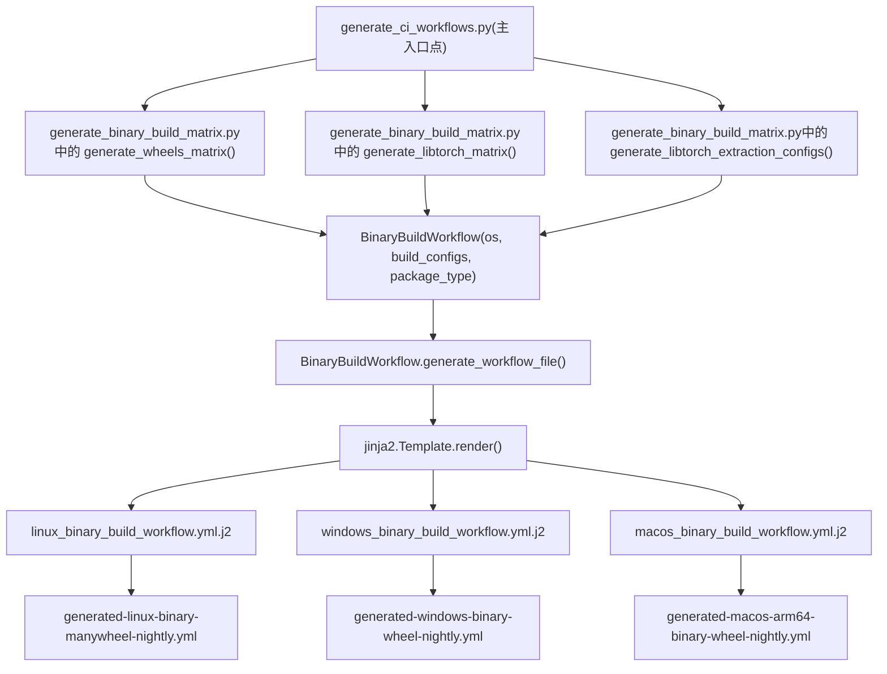

# 二进制发布流水线 (Binary Release Pipeline)

相关源文件 (Relevant source files)

-   [.ci/docker/README.md](https://github.com/pytorch/pytorch/blob/915982a4/.ci/docker/README.md)
-   [.ci/docker/common/install\_cuda.sh](https://github.com/pytorch/pytorch/blob/915982a4/.ci/docker/common/install_cuda.sh)
-   [.ci/docker/common/install\_cusparselt.sh](https://github.com/pytorch/pytorch/blob/915982a4/.ci/docker/common/install_cusparselt.sh)
-   [.ci/docker/manywheel/build\_scripts/manylinux1-check.py](https://github.com/pytorch/pytorch/blob/915982a4/.ci/docker/manywheel/build_scripts/manylinux1-check.py)
-   [.ci/libtorch/extract\_libtorch\_from\_wheel.py](https://github.com/pytorch/pytorch/blob/915982a4/.ci/libtorch/extract_libtorch_from_wheel.py)
-   [.ci/pytorch/smoke\_test/smoke\_test.py](https://github.com/pytorch/pytorch/blob/915982a4/.ci/pytorch/smoke_test/smoke_test.py)
-   [.ci/wheel/build\_wheel.sh](https://github.com/pytorch/pytorch/blob/915982a4/.ci/wheel/build_wheel.sh)
-   [.github/scripts/close\_nonexistent\_disable\_issues.py](https://github.com/pytorch/pytorch/blob/915982a4/.github/scripts/close_nonexistent_disable_issues.py)
-   [.github/scripts/generate\_binary\_build\_matrix.py](https://github.com/pytorch/pytorch/blob/915982a4/.github/scripts/generate_binary_build_matrix.py)
-   [.github/scripts/generate\_ci\_workflows.py](https://github.com/pytorch/pytorch/blob/915982a4/.github/scripts/generate_ci_workflows.py)
-   [.github/scripts/label\_utils.py](https://github.com/pytorch/pytorch/blob/915982a4/.github/scripts/label_utils.py)
-   [.github/templates/linux\_binary\_build\_workflow.yml.j2](https://github.com/pytorch/pytorch/blob/915982a4/.github/templates/linux_binary_build_workflow.yml.j2)
-   [.github/templates/macos\_binary\_build\_workflow.yml.j2](https://github.com/pytorch/pytorch/blob/915982a4/.github/templates/macos_binary_build_workflow.yml.j2)
-   [.github/templates/upload.yml.j2](https://github.com/pytorch/pytorch/blob/915982a4/.github/templates/upload.yml.j2)
-   [.github/templates/windows\_binary\_build\_workflow.yml.j2](https://github.com/pytorch/pytorch/blob/915982a4/.github/templates/windows_binary_build_workflow.yml.j2)
-   [.github/workflows/generated-linux-aarch64-binary-manywheel-nightly.yml](https://github.com/pytorch/pytorch/blob/915982a4/.github/workflows/generated-linux-aarch64-binary-manywheel-nightly.yml)
-   [.github/workflows/generated-linux-binary-manywheel-nightly.yml](https://github.com/pytorch/pytorch/blob/915982a4/.github/workflows/generated-linux-binary-manywheel-nightly.yml)
-   [.github/workflows/generated-linux-s390x-binary-manywheel-nightly.yml](https://github.com/pytorch/pytorch/blob/915982a4/.github/workflows/generated-linux-s390x-binary-manywheel-nightly.yml)
-   [.github/workflows/generated-macos-arm64-binary-wheel-nightly.yml](https://github.com/pytorch/pytorch/blob/915982a4/.github/workflows/generated-macos-arm64-binary-wheel-nightly.yml)
-   [.github/workflows/generated-windows-arm64-binary-libtorch-debug-nightly.yml](https://github.com/pytorch/pytorch/blob/915982a4/.github/workflows/generated-windows-arm64-binary-libtorch-debug-nightly.yml)
-   [.github/workflows/generated-windows-arm64-binary-wheel-nightly.yml](https://github.com/pytorch/pytorch/blob/915982a4/.github/workflows/generated-windows-arm64-binary-wheel-nightly.yml)
-   [.github/workflows/generated-windows-binary-libtorch-debug-nightly.yml](https://github.com/pytorch/pytorch/blob/915982a4/.github/workflows/generated-windows-binary-libtorch-debug-nightly.yml)
-   [.github/workflows/generated-windows-binary-wheel-nightly.yml](https://github.com/pytorch/pytorch/blob/915982a4/.github/workflows/generated-windows-binary-wheel-nightly.yml)
-   [test/jit/test\_freezing.py](https://github.com/pytorch/pytorch/blob/915982a4/test/jit/test_freezing.py)

本页记录了用于构建、测试并将 PyTorch 二进制包（Python wheel 包和 libtorch C++ 库）发布到公共分发渠道的自动化流水线。内容涵盖了如何生成构建矩阵、如何从模板组装 GitHub Actions 工作流、各平台使用的 Docker 镜像，以及如何通过冒烟测试 (smoke tests) 验证产出的产物。

有关在拉取请求和主干上运行的 CI 工作流（非发布构建），请参阅 [CI/CD 工作流与 Docker 镜像构建](/pytorch/pytorch/5.3-cicd-workflows-and-docker-image-builds)。有关构建系统本身的信息，请参阅 [构建系统与代码生成](/pytorch/pytorch/5.1-build-system-and-code-generation)。

---

## 概览 (Overview)

发布流水线是完全由代码生成的：一个 Python 脚本读取平台和版本常量，计算构建配置矩阵，然后将 Jinja2 模板渲染为具体的 GitHub Actions YAML 文件。生成的这些工作流文件会被提交到仓库中，严禁手动编辑。

**每个配置对应的流水线阶段：**

```
构建 (Build) → 测试 (Test) → 上传 (Upload)
```
每种配置都是由三个连续的 GitHub Actions 任务组成的独立集合。上传任务仅在 `nightly` 分支或发布候选 (release candidate) 标签上运行。

---

## 构建配置矩阵 (Build Configuration Matrix)

来源： [.github/scripts/generate\_binary\_build\_matrix.py1-541](https://github.com/pytorch/pytorch/blob/915982a4/.github/scripts/generate_binary_build_matrix.py#L1-L541)

`.github/scripts/generate_binary_build_matrix.py` 文件是所有受支持构建配置的唯一事实来源。

### 受支持的平台与加速器 (Supported Platforms and Accelerators)

| 常量 | 值 |
| --- | --- |
| `CUDA_ARCHES` | `12.6`, `12.8`, `12.9`, `13.0` |
| `ROCM_ARCHES` | `7.1`, `7.2` |
| `XPU_ARCHES` | `xpu` |
| `CPU_AARCH64_ARCH` | `cpu-aarch64` |
| `CPU_S390X_ARCH` | `cpu-s390x` |
| `CUDA_AARCH64_ARCHES` | `12.6-aarch64`, `12.8-aarch64`, `12.9-aarch64`, `13.0-aarch64` |
| `FULL_PYTHON_VERSIONS` | `3.10`, `3.11`, `3.12`, `3.13`, `3.13t`, `3.14`, `3.14t` |

`arch_type()` 函数 [.github/scripts/generate\_binary\_build\_matrix.py239-253](https://github.com/pytorch/pytorch/blob/915982a4/.github/scripts/generate_binary_build_matrix.py#L239-L253) 将版本字符串（如 `"12.6"` 或 `"7.1"`）映射到架构类型字符串（`"cuda"`, `"rocm"`, `"xpu"`, `"cpu-aarch64"`, `"cpu-s390x"`, `"cuda-aarch64"` 或 `"cpu"`）。

### 容器镜像映射 (Container Image Mapping)

每个平台通过 `WHEEL_CONTAINER_IMAGES` 和 `LIBTORCH_CONTAINER_IMAGES` 对应到一个命名的 Docker 镜像 [.github/scripts/generate\_binary\_build\_matrix.py258-278](https://github.com/pytorch/pytorch/blob/915982a4/.github/scripts/generate_binary_build_matrix.py#L258-L278)：

| 架构 (Arch) | Wheel 容器 | Libtorch 容器 |
| --- | --- | --- |
| `12.6` (x86) | `manylinux2_28-builder:cuda12.6` | `libtorch-cxx11-builder:cuda12.6` |
| `7.1` (ROCm) | `manylinux2_28-builder:rocm7.1` | `libtorch-cxx11-builder:rocm7.1` |
| `xpu` | `manylinux2_28-builder:xpu` | *(不构建)* |
| `cpu` | `manylinux2_28-builder:cpu` | `libtorch-cxx11-builder:cpu` |
| `cpu-aarch64` | `manylinux2_28_aarch64-builder:cpu-aarch64` | *(不构建)* |
| `cpu-s390x` | `pytorch/manylinuxs390x-builder:cpu-s390x` | *(不构建)* |
| `12.6-aarch64` | `manylinuxaarch64-builder:cuda12.6` | *(不构建)* |

镜像名称与其标签的分隔是通过 `.split(":")` 完成的，并作为 `container_image` 和 `container_image_tag_prefix` 分别存储在每个配置字典中，工作流模板使用它们来调用 `calculate-docker-image` 动作。

### 矩阵生成函数 (Matrix Generation Functions)

**`generate_wheels_matrix(os, arches, python_versions)`** [.github/scripts/generate\_binary\_build\_matrix.py360-479](https://github.com/pytorch/pytorch/blob/915982a4/.github/scripts/generate_binary_build_matrix.py#L360-L479)

返回配置字典列表，每个 `(python_version, arch_version)` 组合对应一个条目。对于 Linux，`package_type` 为 `manywheel`；对于其他操作系统，为 `wheel`。Linux CUDA 配置包含 `pytorch_extra_install_requirements` 字符串，列出了 `nvidia-cudnn-cu12`、`nvidia-nccl-cu12`、`nvidia-nvshmem-cu12`、`nvidia-cusparselt-cu12` 等包的精确固定版本。

**`generate_libtorch_matrix(os, release_type, arches, libtorch_variants)`** [.github/scripts/generate\_binary\_build\_matrix.py299-357](https://github.com/pytorch/pytorch/blob/915982a4/.github/scripts/generate_binary_build_matrix.py#L299-L357)

返回独立 libtorch 构建的配置。变体包括 `shared-with-deps`、`shared-without-deps`、`static-with-deps`、`static-without-deps`。ROCm 构建会跳过 `without-deps` 变体。用于专用 libtorch Windows 调试/发布模式构建。

**`generate_libtorch_extraction_configs(os, wheel_configs)`** [.github/scripts/generate\_binary\_build\_matrix.py482-526](https://github.com/pytorch/pytorch/blob/915982a4/.github/scripts/generate_binary_build_matrix.py#L482-L526)

返回轻量级提取配置，这些配置针对每个架构采用 Python 3.10 wheel 包，并从中解压出 libtorch 头文件和库文件，而不是从头开始构建 libtorch。这是 Linux 和 macOS libtorch 分发的首选方案。

### 依赖版本验证 (Dependency Version Validation)

在模块导入时，`generate_binary_build_matrix.py` 会运行两个验证器 [.github/scripts/generate\_binary\_build\_matrix.py530-533](https://github.com/pytorch/pytorch/blob/915982a4/.github/scripts/generate_binary_build_matrix.py#L530-L533)：

-   `validate_nccl_dep_consistency(arch_version)` —— 检查 `PYTORCH_EXTRA_INSTALL_REQUIREMENTS` 中的 NCCL wheel 版本是否与来自 `tools/optional_submodules.py` 的固定子模块版本匹配。
-   `validate_cudnn_version_consistency(arch_version)` —— 从 `.ci/docker/common/install_cuda.sh` (Linux) 和 `.ci/pytorch/windows/internal/cuda_install.bat` (Windows) 中解析 `CUDNN_VERSION` 以确认它们匹配。

---

## 工作流文件生成 (Workflow File Generation)

来源： [.github/scripts/generate\_ci\_workflows.py1-313](https://github.com/pytorch/pytorch/blob/915982a4/.github/scripts/generate_ci_workflows.py#L1-L313)

`.github/scripts/generate_ci_workflows.py` 脚本调用 `generate_binary_build_matrix` 获取配置列表，将它们包装在 `BinaryBuildWorkflow` 数据类实例中，并使用 `jinja2` 将模板文件渲染为 `.github/workflows/generated-*.yml` 文件。

### 关键数据结构 (Key Data Structures)

**`BinaryBuildWorkflow`** [.github/scripts/generate\_ci\_workflows.py51-93](https://github.com/pytorch/pytorch/blob/915982a4/.github/scripts/generate_ci_workflows.py#L51-L93)

| 字段 | 类型 | 描述 |
| --- | --- | --- |
| `os` | `str` | `OperatingSystem` 常量之一 |
| `build_configs` | `list[dict]` | `generate_*_matrix()` 调用的输出 |
| `package_type` | `str` | `"wheel"`, `"manywheel"`, 或 `"libtorch"` |
| `build_environment` | `str` | 计算出的名称，如 `linux-binary-manywheel` |
| `ciflow_config` | `CIFlowConfig` | 哪些 ciflow 标签会触发此工作流 |
| `branches` | `str` | 默认为 `"nightly"` |
| `libtorch_extraction_configs` | `list[dict]` | 从 wheel 配置派生出的提取任务 |

`generate_workflow_file()` 将渲染后的模板写入 `GITHUB_DIR / "workflows/generated-{build_environment}-{branches}.yml"`。

**`CIFlowConfig`** [.github/scripts/generate\_ci\_workflows.py29-43](https://github.com/pytorch/pytorch/blob/915982a4/.github/scripts/generate_ci_workflows.py#L29-L43)

控制哪些 ciflow 标签激活工作流。二进制构建工作流使用 `LABEL_CIFLOW_BINARIES` (`ciflow/binaries`)、`LABEL_CIFLOW_BINARIES_WHEEL` 和 `LABEL_CIFLOW_BINARIES_LIBTORCH` 等标签。

### Jinja2 模板 (Jinja2 Templates)

| 模板文件 | 渲染为 |
| --- | --- |
| `.github/templates/linux_binary_build_workflow.yml.j2` | `generated-linux-binary-manywheel-nightly.yml` 等 |
| `.github/templates/windows_binary_build_workflow.yml.j2` | `generated-windows-binary-wheel-nightly.yml` 等 |
| `.github/templates/macos_binary_build_workflow.yml.j2` | `generated-macos-arm64-binary-wheel-nightly.yml` 等 |
| `.github/templates/upload.yml.j2` | 嵌入在上述所有文件中的宏 |

Jinja2 环境使用 `!{{` / `}}` 作为其变量分隔符（而非默认的 `{{`），以避免与 GitHub Actions 的 `${{ }}` 语法冲突 [.github/scripts/generate\_ci\_workflows.py264-267](https://github.com/pytorch/pytorch/blob/915982a4/.github/scripts/generate_ci_workflows.py#L264-L267)

**图：工作流文件生成流程**


来源： [.github/scripts/generate\_ci\_workflows.py263-308](https://github.com/pytorch/pytorch/blob/915982a4/.github/scripts/generate_ci_workflows.py#L263-L308) [.github/templates/linux\_binary\_build\_workflow.yml.j21-260](https://github.com/pytorch/pytorch/blob/915982a4/.github/templates/linux_binary_build_workflow.yml.j2#L1-L260)

---

## 单个任务流水线结构 (Per-Job Pipeline Structure)

矩阵中的每个 `(python_version, arch_version)` 二元组都会扩展为三个链式任务。它们的命名约定为 `{构建名称}-build`、`{构建名称}-test` 和 `{构建名称}-upload`，其中 `构建名称` 由 `generate_wheels_matrix()` 计算得出，遵循 `manywheel-py3_10-cuda12_6` 模式。

**图：每个构建配置的三阶段任务结构**

> **[Mermaid sequence]**
> *(图表结构无法解析)*

来源： [.github/templates/linux\_binary\_build\_workflow.yml.j266-213](https://github.com/pytorch/pytorch/blob/915982a4/.github/templates/linux_binary_build_workflow.yml.j2#L66-L213) [.github/templates/upload.yml.j245-71](https://github.com/pytorch/pytorch/blob/915982a4/.github/templates/upload.yml.j2#L45-L71)

### 构建任务 (Build Job)

Linux 和 aarch64：委派给可复用工作流 `_binary-build-linux.yml`。
Windows：运行调用 `.circleci/scripts/binary_windows_build.sh` 的内联步骤。
macOS：直接运行 `.ci/wheel/build_wheel.sh` [.ci/wheel/build\_wheel.sh1-259](https://github.com/pytorch/pytorch/blob/915982a4/.ci/wheel/build_wheel.sh#L1-L259)

产物使用 `actions/upload-artifact@v4.4.0` 存储，使用 `构建名称` 作为产物名，保留期为 14 天。

### 测试任务 (Test Job)

Linux (非 ROCm, 非 XPU)：委派给 `_binary-test-linux.yml`。

ROCm 测试任务在 `linux.rocm.gpu.mi250.1` 运行器上运行内联步骤 [.github/templates/linux\_binary\_build\_workflow.yml.j2164-209](https://github.com/pytorch/pytorch/blob/915982a4/.github/templates/linux_binary_build_workflow.yml.j2#L164-L209)：

1.  `setup-rocm` 动作
2.  下载产物
3.  `calculate-docker-image` 动作
4.  `pull-docker-image` 动作
5.  `test-pytorch-binary` 动作（运行 `smoke_test.py`）
6.  `teardown-rocm` 动作

XPU 测试任务在 `linux.idc.xpu` 运行器上运行具有等效 `setup-xpu` / `teardown-xpu` 动作的步骤 [.github/templates/linux\_binary\_build\_workflow.yml.j2128-163](https://github.com/pytorch/pytorch/blob/915982a4/.github/templates/linux_binary_build_workflow.yml.j2#L128-L163)

### 上传任务 (Upload Job)

所有平台均使用可复用工作流 `_binary-upload.yml`。凭证作为 secrets 传递： `R2_ACCOUNT_ID`, `R2_ACCESS_KEY_ID`, `R2_SECRET_ACCESS_KEY`。对于 macOS 上传，由于使用了 R2，因此设置了 `use_s3: False` [.github/templates/macos\_binary\_build\_workflow.yml.j2122](https://github.com/pytorch/pytorch/blob/915982a4/.github/templates/macos_binary_build_workflow.yml.j2#L122-L122)

---

## 平台特定详情 (Platform-Specific Details)

### Linux (x86\_64)

生成的文件： `generated-linux-binary-manywheel-nightly.yml`

包类型： `manywheel`。所有 CUDA、ROCm、XPU 和 CPU 配置均会被构建。Linux 的默认架构为 `cpu + CUDA_ARCHES + ROCM_ARCHES + XPU_ARCHES` [.github/scripts/generate\_binary\_build\_matrix.py376-378](https://github.com/pytorch/pytorch/blob/915982a4/.github/scripts/generate_binary_build_matrix.py#L376-L378)

每个 CUDA 构建都会接收到一个 `PYTORCH_EXTRA_INSTALL_REQUIREMENTS` 环境变量，其中列出了所有必需 NVIDIA 包的精确固定版本 [.github/scripts/generate\_binary\_build\_matrix.py51-107](https://github.com/pytorch/pytorch/blob/915982a4/.github/scripts/generate_binary_build_matrix.py#L51-L107)

### Linux (aarch64)

生成的文件： `generated-linux-aarch64-binary-manywheel-nightly.yml`

架构： `CPU_AARCH64_ARCH + CUDA_AARCH64_ARCHES`。构建运行器为 `linux.arm64.r7g.12xlarge.memory`；测试运行器为 `linux.arm64.2xlarge`。CPU 构建使用 `manylinux2_28_aarch64-builder`，CUDA 构建使用 `manylinuxaarch64-builder`。CUDA aarch64 构建会跳过测试（上传取决于构建而非测试） [.github/templates/upload.yml.j252-56](https://github.com/pytorch/pytorch/blob/915982a4/.github/templates/upload.yml.j2#L52-L56)

### Linux (s390x)

生成的文件： `generated-linux-s390x-binary-manywheel-nightly.yml`

架构： 仅 `cpu-s390x`。容器： `pytorch/manylinuxs390x-builder:cpu-s390x`。在 `linux.s390x` 运行器上运行。超时时间为 420 分钟。除标准二进制标签外，还由 `ciflow/s390` 触发。

### Windows (x86\_64)

生成的文件： `generated-windows-binary-wheel-nightly.yml`

包类型： `wheel`。架构： `cpu + CUDA_ARCHES (减去 12.9) + XPU_ARCHES`。任务在 `windows.12xlarge` 运行器上内联运行（不通过可复用工作流）。构建过程调用 `.circleci/scripts/binary_windows_build.sh`；测试过程调用 `.circleci/scripts/binary_windows_test.sh`。工作流级别设置了 `SKIP_ALL_TESTS: 1`。

Windows 还有一个专用的 `generated-windows-binary-libtorch-debug-nightly.yml`，用于在调试模式下构建 libtorch (`LIBTORCH_CONFIG: debug`)。

### Windows (ARM64)

生成的文件： `generated-windows-arm64-binary-wheel-nightly.yml`

架构： 仅 `cpu`。Python 版本： `3.11`, `3.12`, `3.13`。在 `windows-11-arm64-preview` 运行器上运行。启用 MSVC 14.42 和 APL，禁用 OpenBLAS [.github/workflows/generated-windows-arm64-binary-wheel-nightly.yml33-37](https://github.com/pytorch/pytorch/blob/915982a4/.github/workflows/generated-windows-arm64-binary-wheel-nightly.yml#L33-L37)

### macOS (ARM64)

生成的文件： `generated-macos-arm64-binary-wheel-nightly.yml`

在 `macos-14-xlarge` 上运行。没有单独的测试任务 —— 冒烟测试在构建 wheel 后作为构建任务中的一个步骤运行。上传使用 R2 (`use_s3: False`)。macOS 构建启用了 `USE_PYTORCH_METAL_EXPORT=1` 和 `USE_COREML_DELEGATE=1`。

---

## libtorch 分发 (libtorch Distribution)

libtorch 包通过两种方式分发：

**1. 从 wheel 提取（Linux, macOS, Windows ARM64 首选）**

`generate_libtorch_extraction_configs()` 创建任务，下载 Python 3.10 wheel 产物并运行 `extract_libtorch_from_wheel.py` [.ci/libtorch/extract\_libtorch\_from\_wheel.py1-30](https://github.com/pytorch/pytorch/blob/915982a4/.ci/libtorch/extract_libtorch_from_wheel.py#L1-L30)，将 C++ 库、头文件和 CMake 文件考出到一个 libtorch zip 包中。

提取任务名称遵循 `libtorch-{gpu_arch_type}{gpu_arch_version}-shared-with-deps-release-extract` 模式。

**2. 专用 libtorch 构建（Windows x86\_64 和 ARM64）**

`generate_libtorch_matrix()` 生成从源码构建 libtorch 的配置。变体有 `shared-with-deps`、`shared-without-deps`、`static-with-deps`、`static-without-deps`。Windows 构建仅通过 `LIBTORCH_CONFIG: debug` 产出调试模式下的 `shared-with-deps`。

---

## 冒烟测试验证 (Smoke Test Validation)

来源： [.ci/pytorch/smoke\_test/smoke\_test.py1-541](https://github.com/pytorch/pytorch/blob/915982a4/.ci/pytorch/smoke_test/smoke_test.py#L1-L541)

冒烟测试脚本 `.ci/pytorch/smoke_test/smoke_test.py` 在安装好构建的 wheel 后运行。它读取几个环境变量：

| 变量 | 来源 |
| --- | --- |
| `MATRIX_GPU_ARCH_VERSION` / `GPU_ARCH_VERSION` | 工作流环境变量 |
| `MATRIX_GPU_ARCH_TYPE` | 工作流环境变量 |
| `MATRIX_CHANNEL` | 工作流环境变量 (`nightly` 或 `stable`) |
| `MATRIX_PACKAGE_TYPE` | 工作流环境变量 |
| `TARGET_OS` | 工作流环境变量 |

**测试函数：**

| 函数 | 检查项 |
| --- | --- |
| `check_version()` | 包版本是否匹配预期的每晚日期或来自 `release_matrix.json` 的稳定版本 |
| `check_nightly_binaries_date()` | 每晚构建的 `dev` 日期是否在 `NIGHTLY_ALLOWED_DELTA = 3` 天之内 |
| `smoke_test_cuda()` | `torch.cuda.is_available()`、CUDA 版本、通过 `torch.backends.cudnn.version()` 获取的 cuDNN 版本、NCCL 版本，以及 PyPI 包版本交叉检查 |
| `smoke_test_compile()` | 带有 `sin + cos` 和 `mode='max-autotune'` 的 `torch.compile()`，通过 `pick_vec_isa()` 进行向量化 ISA 检测 |
| `smoke_test_conv2d()` | 带有 autocast 的 CPU 和 CUDA 基础 Conv2d |
| `test_linalg()` | CPU 和 CUDA 上的 `torch.linalg.svd` |
| `smoke_test_nvshmem()` | 来自 `torch._C._distributed_c10d` 的 `_is_nvshmem_available()` |
| `test_cuda_runtime_errors_captured()` | CUDA 异常传播情况 |
| `test_cuda_gds_errors_captured()` | GDS 文件句柄注册错误（仅限 CUDA ≥ 12.6） |
| `test_sdpa()` | `scaled_dot_product_attention` 用以捕捉 cuDNN 执行计划失败 |

`Net` 类 [.ci/pytorch/smoke\_test/smoke\_test.py58-71](https://github.com/pytorch/pytorch/blob/915982a4/.ci/pytorch/smoke_test/smoke_test.py#L58-L71) 是一个小型的 CNN，用于测试 `max-autotune` 编译。

---

## 触发条件 (Trigger Conditions)

二进制构建工作流与常规主干 CI 相互隔离（在 `CIFlowConfig` 中设置了 `isolated_workflow=True`）。它们在以下情况激活：

| 触发器 | 详情 |
| --- | --- |
| 向 `nightly` 分支推送 | 产生带有日期版本号的每晚包 |
| 发布候选标签 | 模式： `v[0-9]+.[0-9]+.[0-9]+-rc[0-9]+` |
| `ciflow/binaries/*` 标签 | 触发所有二进制工作流 |
| `ciflow/binaries_wheel/*` 标签 | 仅触发 wheel 工作流 |
| `ciflow/binaries_libtorch/*` 标签 | 仅触发 libtorch 工作流 |
| `ciflow/s390/*` 标签 | 仅触发 s390x 工作流 |
| `workflow_dispatch` | 手动触发 |

`get-label-type` 任务（使用 `_runner-determinator.yml`）是每个工作流中的第一个任务，决定了运行器标签前缀（例如，针对 Linux 基金会运行器的 `lf.`）。

---

## 代码实体映射图 (Code Entity Map)

**图：流水线中的关键代码实体及其角色**

```mermaid
flowchart TD
    GBMX[".github/scripts/generate_binary_build_matrix.py"]
    GWF[".github/scripts/generate_ci_workflows.py"]
    CUDA_ARCHES["CUDA_ARCHES, ROCM_ARCHES, XPU_ARCHES"]
    WHEEL_CONT["WHEEL_CONTAINER_IMAGES"]
    LIBTORCH_CONT["LIBTORCH_CONTAINER_IMAGES"]
    EXTRA_REQS["PYTORCH_EXTRA_INSTALL_REQUIREMENTS"]
    BBW["BinaryBuildWorkflow 数据类"]
    CFC["CIFlowConfig 数据类"]
    TMPL_L[".github/templates/linux_binary_build_workflow.yml.j2"]
    TMPL_W[".github/templates/windows_binary_build_workflow.yml.j2"]
    TMPL_M[".github/templates/macos_binary_build_workflow.yml.j2"]
    UPL[".github/templates/upload.yml.j2"]
    LNX["generated-linux-binary-manywheel-nightly.yml"]
    WIN["generated-windows-binary-wheel-nightly.yml"]
    MAC["generated-macos-arm64-binary-wheel-nightly.yml"]
    AARCH["generated-linux-aarch64-binary-manywheel-nightly.yml"]
    S390["generated-linux-s390x-binary-manywheel-nightly.yml"]
    BWS[".ci/wheel/build_wheel.sh"]
    SMK[".ci/pytorch/smoke_test/smoke_test.py"]
    EXTR[".ci/libtorch/extract_libtorch_from_wheel.py"]
    INST_CUDA[".ci/docker/common/install_cuda.sh"]

    GBMX --> CUDA_ARCHES
    GBMX --> WHEEL_CONT
    GBMX --> LIBTORCH_CONT
    GBMX --> EXTRA_REQS
    GWF --> BBW
    GWF --> CFC
    BBW --> TMPL_L
    BBW --> TMPL_W
    BBW --> TMPL_M
    TMPL --> L_LNX
    TMPL --> W_WIN
    TMPL --> M_MAC
    TMPL --> L_AARCH
    TMPL --> L_S390
    LNX --> BWS
    MAC --> BWS
    LNX --> SMK
    MAC --> SMK
    WIN --> SMK
    LNX --> EXTR
    MAC --> EXTR
```


来源： [.github/scripts/generate\_binary\_build\_matrix.py1-100](https://github.com/pytorch/pytorch/blob/915982a4/.github/scripts/generate_binary_build_matrix.py#L1-L100) [.github/scripts/generate\_ci\_workflows.py50-130](https://github.com/pytorch/pytorch/blob/915982a4/.github/scripts/generate_ci_workflows.py#L50-L130) [.github/templates/linux\_binary\_build\_workflow.yml.j21-70](https://github.com/pytorch/pytorch/blob/915982a4/.github/templates/linux_binary_build_workflow.yml.j2#L1-L70)
