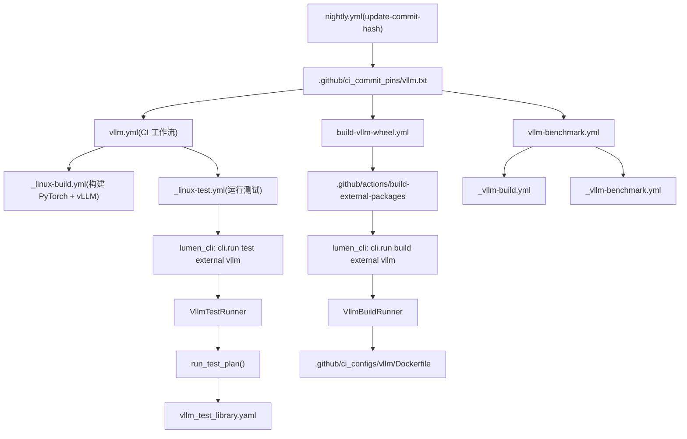
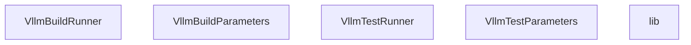
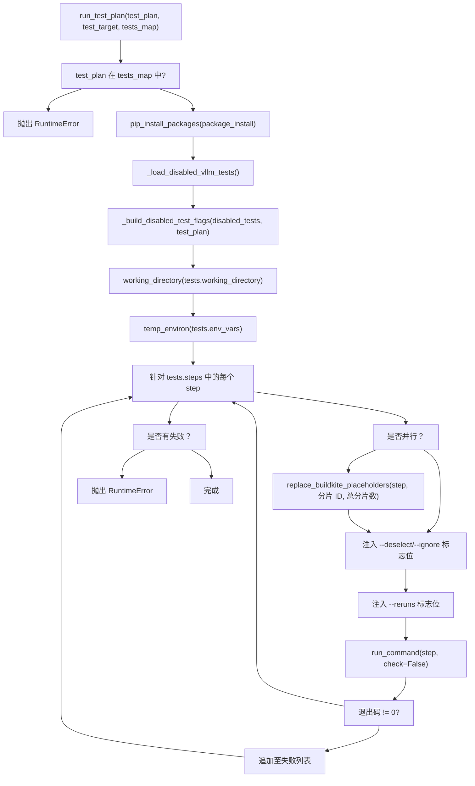

# 外部集成：vLLM CI 流水线 (External Integration: vLLM CI Pipeline)

相关源文件 (Relevant source files)

-   [.ci/lumen\_cli/cli/lib/common/gh\_summary.py](https://github.com/pytorch/pytorch/blob/915982a4/.ci/lumen_cli/cli/lib/common/gh_summary.py)
-   [.ci/lumen\_cli/cli/lib/common/git\_helper.py](https://github.com/pytorch/pytorch/blob/915982a4/.ci/lumen_cli/cli/lib/common/git_helper.py)
-   [.ci/lumen\_cli/cli/lib/common/pip\_helper.py](https://github.com/pytorch/pytorch/blob/915982a4/.ci/lumen_cli/cli/lib/common/pip_helper.py)
-   [.ci/lumen\_cli/cli/lib/core/vllm/disabled\_vllm\_tests.yaml](https://github.com/pytorch/pytorch/blob/915982a4/.ci/lumen_cli/cli/lib/core/vllm/disabled_vllm_tests.yaml)
-   [.ci/lumen\_cli/cli/lib/core/vllm/lib.py](https://github.com/pytorch/pytorch/blob/915982a4/.ci/lumen_cli/cli/lib/core/vllm/lib.py)
-   [.ci/lumen\_cli/cli/lib/core/vllm/vllm\_build.py](https://github.com/pytorch/pytorch/blob/915982a4/.ci/lumen_cli/cli/lib/core/vllm/vllm_build.py)
-   [.ci/lumen\_cli/cli/lib/core/vllm/vllm\_test.py](https://github.com/pytorch/pytorch/blob/915982a4/.ci/lumen_cli/cli/lib/core/vllm/vllm_test.py)
-   [.ci/lumen\_cli/cli/lib/core/vllm/vllm\_test\_library.yaml](https://github.com/pytorch/pytorch/blob/915982a4/.ci/lumen_cli/cli/lib/core/vllm/vllm_test_library.yaml)
-   [.ci/lumen\_cli/cli/test\_cli/register\_test.py](https://github.com/pytorch/pytorch/blob/915982a4/.ci/lumen_cli/cli/test_cli/register_test.py)
-   [.ci/lumen\_cli/tests/test\_run\_plan.py](https://github.com/pytorch/pytorch/blob/915982a4/.ci/lumen_cli/tests/test_run_plan.py)
-   [.circleci/scripts/binary\_linux\_test.sh](https://github.com/pytorch/pytorch/blob/915982a4/.circleci/scripts/binary_linux_test.sh)
-   [.circleci/scripts/binary\_upload.sh](https://github.com/pytorch/pytorch/blob/915982a4/.circleci/scripts/binary_upload.sh)
-   [.github/actions/build-external-packages/action.yml](https://github.com/pytorch/pytorch/blob/915982a4/.github/actions/build-external-packages/action.yml)
-   [.github/ci\_commit\_pins/torchao.txt](https://github.com/pytorch/pytorch/blob/915982a4/.github/ci_commit_pins/torchao.txt)
-   [.github/ci\_commit\_pins/vllm.txt](https://github.com/pytorch/pytorch/blob/915982a4/.github/ci_commit_pins/vllm.txt)
-   [.github/ci\_configs/vllm/Dockerfile](https://github.com/pytorch/pytorch/blob/915982a4/.github/ci_configs/vllm/Dockerfile)
-   [.github/ci\_configs/vllm/use\_existing\_torch.py](https://github.com/pytorch/pytorch/blob/915982a4/.github/ci_configs/vllm/use_existing_torch.py)
-   [.github/merge\_rules.yaml](https://github.com/pytorch/pytorch/blob/915982a4/.github/merge_rules.yaml)
-   [.github/scripts/prepare\_vllm\_wheels.sh](https://github.com/pytorch/pytorch/blob/915982a4/.github/scripts/prepare_vllm_wheels.sh)
-   [.github/workflows/\_binary-upload.yml](https://github.com/pytorch/pytorch/blob/915982a4/.github/workflows/_binary-upload.yml)
-   [.github/workflows/\_vllm-benchmark.yml](https://github.com/pytorch/pytorch/blob/915982a4/.github/workflows/_vllm-benchmark.yml)
-   [.github/workflows/\_vllm-build.yml](https://github.com/pytorch/pytorch/blob/915982a4/.github/workflows/_vllm-build.yml)
-   [.github/workflows/build-vllm-wheel.yml](https://github.com/pytorch/pytorch/blob/915982a4/.github/workflows/build-vllm-wheel.yml)
-   [.github/workflows/nightly.yml](https://github.com/pytorch/pytorch/blob/915982a4/.github/workflows/nightly.yml)
-   [.github/workflows/vllm-benchmark.yml](https://github.com/pytorch/pytorch/blob/915982a4/.github/workflows/vllm-benchmark.yml)
-   [.github/workflows/vllm.yml](https://github.com/pytorch/pytorch/blob/915982a4/.github/workflows/vllm.yml)
-   [test/dynamo\_skips/TestScript.test\_static\_method\_on\_module](https://github.com/pytorch/pytorch/blob/915982a4/test/dynamo_skips/TestScript.test_static_method_on_module)

## 目的与范围 (Purpose and Scope)

本页描述了 PyTorch 的 CI 基础设施如何与外部 LLM 推理库 [vLLM](https://github.com/pytorch/pytorch/blob/915982a4/vLLM) 集成，以进行兼容性测试和基准测试 (benchmarking)。内容涵盖了用于追踪特定 vLLM 修订版本的 commit pin 机制、针对 PyTorch 构建 vLLM wheel 包的 Docker 镜像构造、Lumen CLI 测试编排层，以及基准测试工作流。

本页重点关注 CI 基础设施相关事宜。有关 PyTorch 自身的通用 CI/CD 工作流和 Docker 镜像构造，请参阅 [CI/CD 工作流与 Docker 镜像构建](/pytorch/pytorch/5.3-cicd-workflows-and-docker-image-builds)。有关二进制发布流水线，请参阅 [二进制发布流水线](/pytorch/pytorch/5.4-binary-release-pipeline)。

---

## 架构概览 (Architecture Overview)

vLLM 集成由四个松耦合的子系统组成：

**完整的 vLLM CI 流水线**


来源： [.github/workflows/vllm.yml1-65](https://github.com/pytorch/pytorch/blob/915982a4/.github/workflows/vllm.yml#L1-L65) [.github/workflows/build-vllm-wheel.yml1-60](https://github.com/pytorch/pytorch/blob/915982a4/.github/workflows/build-vllm-wheel.yml#L1-L60) [.github/workflows/vllm-benchmark.yml1-124](https://github.com/pytorch/pytorch/blob/915982a4/.github/workflows/vllm-benchmark.yml#L1-L124) [.github/workflows/\_vllm-build.yml1-126](https://github.com/pytorch/pytorch/blob/915982a4/.github/workflows/_vllm-build.yml#L1-L126) [.github/workflows/\_vllm-benchmark.yml1-230](https://github.com/pytorch/pytorch/blob/915982a4/.github/workflows/_vllm-benchmark.yml#L1-L230)

---

## Commit Pin 机制 (Commit Pin Mechanism)

[.github/ci\_commit\_pins/vllm.txt1-2](https://github.com/pytorch/pytorch/blob/915982a4/.github/ci_commit_pins/vllm.txt#L1-L2) 文件持有一个 vLLM 仓库的单一 git commit SHA。所有检出 vLLM 的 CI 工作流都会读取此文件以确保可复现性。

```
8b5014d3dd343736ccf3e26cd44a0bb7700d205c
```
**如何读取 pin**（来自 `_vllm-build.yml` 和 `_vllm-benchmark.yml`）：

```
VLLM_PINNED_COMMIT=$(cat .github/ci_commit_pins/vllm.txt)
```
随后被用作检出的 ref：

```
ref: ${{ steps.vllm-pinned-commit.outputs.commit }}
```
**如何更新 pin**： `nightly.yml` 工作流每晚通过定时任务运行，并为 `vllm-project/vllm` 仓库调用 `pytorch/test-infra` 的 `update-commit-hash` 动作，目标为其 `main` 分支。这将创建一个更新 `vllm.txt` 的 PR。

[.github/workflows/nightly.yml89-104](https://github.com/pytorch/pytorch/blob/915982a4/.github/workflows/nightly.yml#L89-L104)

**合并规则**： `.github/merge_rules.yaml` 文件授予了 `pytorchbot` 对 `.github/ci_commit_pins/vllm.txt` 变更的自动合并权限，且要求 `inductor` 检查必须通过。

[.github/merge\_rules.yaml74-88](https://github.com/pytorch/pytorch/blob/915982a4/.github/merge_rules.yaml#L74-L88)

**Pin 生命周期图：**

> **[Mermaid sequence]**
> *(图表结构无法解析)*

来源： [.github/workflows/nightly.yml66-104](https://github.com/pytorch/pytorch/blob/915982a4/.github/workflows/nightly.yml#L66-L104) [.github/ci\_commit\_pins/vllm.txt1-2](https://github.com/pytorch/pytorch/blob/915982a4/.github/ci_commit_pins/vllm.txt#L1-L2) [.github/merge\_rules.yaml74-88](https://github.com/pytorch/pytorch/blob/915982a4/.github/merge_rules.yaml#L74-L88) [.ci/lumen\_cli/cli/lib/common/git\_helper.py65-69](https://github.com/pytorch/pytorch/blob/915982a4/.ci/lumen_cli/cli/lib/common/git_helper.py#L65-L69)

---

## Docker 镜像构造 (Docker Image Construction)

### Dockerfile 阶段 (Dockerfile Stages)

位于 [.github/ci\_configs/vllm/Dockerfile1-285](https://github.com/pytorch/pytorch/blob/915982a4/.github/ci_configs/vllm/Dockerfile#L1-L285) 的 Dockerfile 定义了一个多阶段构建。每个阶段都有明确的职责。

| 阶段 | `FROM` 基础镜像 | 目的 |
| --- | --- | --- |
| `torch-nightly-base` | `nvidia/cuda:${CUDA_VERSION}-devel-ubuntu22.04` | 安装系统依赖、GCC 10、Python venv, `uv` |
| `base` | `${BUILD_BASE_IMAGE}` | 安装 PyTorch wheel 包（本地、固定的 nightly 版，或最新的 nightly 版） |
| `build` | `base` | 通过 `python setup.py bdist_wheel` 编译 vLLM wheel 包 |
| `vllm-base` | `${FINAL_BASE_IMAGE}` | 安装最终的 torch + 已构建的 vLLM wheel 包 |
| `export-wheels` | `scratch` | 仅导出：拷贝 `.whl` 和 `build_summary.txt` |

**PyTorch 安装逻辑（在 `base` 阶段）**： Dockerfile 根据构建参数在三种策略间选择：

1.  如果 `TORCH_WHEELS_PATH` 指向本地 `.whl` 文件 → 从本地目录安装
2.  否则，如果设置了 `PINNED_TORCH_VERSION` → 安装该特定 nightly 版本
3.  否则 → 从 `download.pytorch.org/whl/nightly/cu*` 安装最新的 torch nightly 版

[.github/ci\_configs/vllm/Dockerfile95-109](https://github.com/pytorch/pytorch/blob/915982a4/.github/ci_configs/vllm/Dockerfile#L95-L109)

**Wheel 包重打包**： Docker 构建完成后， `prepare_vllm_wheels.sh` 会将 wheel 重命名以使用 nightly 版本号，添加一个 `Requires-Dist: torch==${torch_version}` 依赖，重新计算 RECORD 哈希，并运行 `auditwheel repair` 以使 wheel 包符合 manylinux 标准。

[.github/scripts/prepare\_vllm\_wheels.sh1-94](https://github.com/pytorch/pytorch/blob/915982a4/.github/scripts/prepare_vllm_wheels.sh#L1-L94)

**`build` 阶段的关键环境变量：**

| 变量 | 默认值 | 描述 |
| --- | --- | --- |
| `TORCH_CUDA_ARCH_LIST` | `8.0;8.9;9.0;10.0;12.0` | 编译进 vLLM 内核的 CUDA 架构 |
| `MAX_JOBS` | `16` | 并行编译任务数 |
| `NVCC_THREADS` | `8` | NVCC 线程数 |
| `USE_SCCACHE` | `0` | 启用 sccache 以缓存内核编译 |
| `VLLM_TARGET_DEVICE` | `cuda` | vLLM 构建的目标设备 |

来源： [.github/ci\_configs/vllm/Dockerfile139-189](https://github.com/pytorch/pytorch/blob/915982a4/.github/ci_configs/vllm/Dockerfile#L139-L189) [.github/scripts/prepare\_vllm\_wheels.sh1-94](https://github.com/pytorch/pytorch/blob/915982a4/.github/scripts/prepare_vllm_wheels.sh#L1-L94)

---

## CI 工作流 (CI Workflows)

### 主测试工作流： `vllm.yml` (Main Test Workflow: vllm.yml)

位于 [.github/workflows/vllm.yml1-65](https://github.com/pytorch/pytorch/blob/915982a4/.github/workflows/vllm.yml#L1-L65) 的工作流是主要的集成测试工作流。它在以下情况触发：

-   向 `main` 或 `release/*` 分支推送
-   匹配 `ciflow/vllm/*` 的标签
-   手动 `workflow_dispatch`

它按顺序运行两个任务：

1.  **`build` 任务** (`vllm-x-pytorch-build`)：委派给 `_linux-build.yml` 且设置 `build-external-packages: "vllm"`，运行在 `linux.24xlarge.memory` 运行器上。这会产出一个包含 PyTorch 和 vLLM wheel 包的 Docker 镜像。

2.  **`test` 任务** (`vllm-x-pytorch-test`)：使用来自构建任务的 Docker 镜像委派给 `_linux-test.yml`。它会在下述测试矩阵中进行分发。


**测试矩阵**（来自 `vllm.yml`）：

| 配置 | 分片 | 运行器 |
| --- | --- | --- |
| `vllm_basic_correctness_test` | 1/1 | `linux.g6.4xlarge.experimental.nvidia.gpu` |
| `vllm_basic_models_test` | 1/1 | `linux.g6.4xlarge.experimental.nvidia.gpu` |
| `vllm_entrypoints_test` | 1/1 | `linux.g6.4xlarge.experimental.nvidia.gpu` |
| `vllm_regression_test` | 1/1 | `linux.g6.4xlarge.experimental.nvidia.gpu` |
| `vllm_multi_model_processor_test` | 1/1 | `linux.g6.4xlarge.experimental.nvidia.gpu` |
| `vllm_pytorch_compilation_unit_tests` | 1/1 | `linux.g6.4xlarge.experimental.nvidia.gpu` |
| `vllm_pytorch_compilation_unit_tests` | 1/1 | `linux.dgx.b200` |
| `vllm_lora_test` | 0-3/4 | `linux.g6.4xlarge.experimental.nvidia.gpu` |
| `vllm_lora_tp_test_distributed` | 1/1 | `linux.g6.12xlarge.nvidia.gpu` |
| `vllm_distributed_test_28_failure_test` | 1/1 | `linux.g6.12xlarge.nvidia.gpu` |
| 各类 `*_28_failure_test` 配置 | 1/1 | `linux.g6.4xlarge.experimental.nvidia.gpu` |

来源： [.github/workflows/vllm.yml34-65](https://github.com/pytorch/pytorch/blob/915982a4/.github/workflows/vllm.yml#L34-L65)

### Wheel 构建工作流： `build-vllm-wheel.yml` (Wheel Build Workflow: build-vllm-wheel.yml)

[.github/workflows/build-vllm-wheel.yml1-257](https://github.com/pytorch/pytorch/blob/915982a4/.github/workflows/build-vllm-wheel.yml#L1-L257) 针对 PyTorch nightly 构建独立的 vLLM wheel 包，不运行测试。其触发条件：

-   当 `vllm.yml` 或 `vllm.txt` 变更时推送至 `main`
-   每日 UTC 01:30 定时触发
-   修改了这些文件的 PR
-   手动 `workflow_dispatch`

构建矩阵：

| 平台 | CUDA 版本 | 运行器 |
| --- | --- | --- |
| `manylinux_2_28_x86_64` | cu128, cu129, cu130 | `linux.12xlarge.memory` |
| `manylinux_2_28_aarch64` | cu128, cu129 | `linux.arm64.r7g.12xlarge.memory` |

Wheel 包会上传至 S3 (`s3://pytorch`)，并可选地通过 `binary_upload.sh` 上传至 Cloudflare R2。

来源： [.github/workflows/build-vllm-wheel.yml23-257](https://github.com/pytorch/pytorch/blob/915982a4/.github/workflows/build-vllm-wheel.yml#L23-L257) [.circleci/scripts/binary\_upload.sh1-132](https://github.com/pytorch/pytorch/blob/915982a4/.circleci/scripts/binary_upload.sh#L1-L132)

---

## Lumen CLI：测试与构建编排 (Lumen CLI: Test and Build Orchestration)

Lumen CLI (`lumen_cli`) 是一个位于 `.ci/lumen_cli/` 下的内部 Python 工具。它提供了 `cli.run build external vllm` 和 `cli.run test external vllm` 入口点。

**Lumen CLI vLLM 子系统的代码实体映射：**


来源： [.ci/lumen\_cli/cli/lib/core/vllm/vllm\_build.py1-297](https://github.com/pytorch/pytorch/blob/915982a4/.ci/lumen_cli/cli/lib/core/vllm/vllm_build.py#L1-L297) [.ci/lumen\_cli/cli/lib/core/vllm/vllm\_test.py1-283](https://github.com/pytorch/pytorch/blob/915982a4/.ci/lumen_cli/cli/lib/core/vllm/vllm_test.py#L1-L283) [.ci/lumen\_cli/cli/lib/core/vllm/lib.py1-289](https://github.com/pytorch/pytorch/blob/915982a4/.ci/lumen_cli/cli/lib/core/vllm/lib.py#L1-L289)

### 构建流程 (`VllmBuildRunner`) (Build Flow (VllmBuildRunner))

`VllmBuildRunner.run()` 执行以下步骤：

1.  通过 `clone_vllm()` → `clone_external_repo()` 检出 vLLM 的固定 commit，该过程会读取 `.github/ci_commit_pins/vllm.txt`
2.  将 [.github/ci\_configs/vllm/use\_existing\_torch.py](https://github.com/pytorch/pytorch/blob/915982a4/.github/ci_configs/vllm/use_existing_torch.py) **拷贝** 进 vLLM 工作区。该脚本会从 vLLM 的需求文件中移除所有 `torch`/`torchvision`/`torchaudio` 行，以防止 pip 覆盖已安装的 PyTorch 构建。
3.  将 **Dockerfile 拷贝** 进 `vllm/docker/Dockerfile.nightly_torch`
4.  如果 `use_torch_whl=True`，则将 **torch wheels 拷贝** 进 `vllm/tmp/`
5.  **运行 `docker buildx build`**，目标为 `export-wheels` 阶段，并将输出写入 `${output_dir}`

[.ci/lumen\_cli/cli/lib/core/vllm/vllm\_build.py157-182](https://github.com/pytorch/pytorch/blob/915982a4/.ci/lumen_cli/cli/lib/core/vllm/vllm_build.py#L157-L182)

**Docker 构建命令生成** (`_generate_docker_build_cmd`)：

命令组装了针对 `CUDA_VERSION`、`PYTHON_VERSION`、`TORCH_WHEELS_PATH`、`BUILD_BASE_IMAGE`、`FINAL_BASE_IMAGE`、`torch_cuda_arch_list` 的 `--build-arg` 标志位，并可选地通过存储桶/区域设置启用 `USE_SCCACHE`。

[.ci/lumen\_cli/cli/lib/core/vllm/vllm\_build.py267-296](https://github.com/pytorch/pytorch/blob/915982a4/.ci/lumen_cli/cli/lib/core/vllm/vllm_build.py#L267-L296)

### 测试流程 (`VllmTestRunner`) (Test Flow (VllmTestRunner))

`VllmTestRunner.run()` 执行：

1.  **`prepare()`**：
    -   检出固定 commit 的 vLLM
    -   拷贝 `use_existing_torch.py` 清理脚本
    -   从 `torch_whls_path` 安装 PyTorch wheels
    -   从 `vllm_whls_path` 安装 vLLM wheels
    -   运行 `use_existing_torch.py` 从 vLLM 需求中剥离 torch
    -   安装 `requirements/common.txt` 和 `requirements/build.txt`
    -   通过带有约束固定的 `uv pip compile` 解析测试依赖
2.  **运行测试计划**，通过 `lib.py` 中的 `run_test_plan()` 进行

[.ci/lumen\_cli/cli/lib/core/vllm/vllm\_test.py88-130](https://github.com/pytorch/pytorch/blob/915982a4/.ci/lumen_cli/cli/lib/core/vllm/vllm_test.py#L88-L130)

---

## 测试库： `vllm_test_library.yaml` (Test Library: vllm_test_library.yaml)

[.ci/lumen\_cli/cli/lib/core/vllm/vllm\_test\_library.yaml1-129](https://github.com/pytorch/pytorch/blob/915982a4/.ci/lumen_cli/cli/lib/core/vllm/vllm_test_library.yaml#L1-L129) 文件定义了所有可用的测试计划。每个条目包含：

| 字段 | 类型 | 描述 |
| --- | --- | --- |
| `title` | `str` | 人类可读的名称 |
| `id` | `str` | 工作流矩阵中使用的标识符 |
| `steps` | `list[str]` | Shell 命令（通常是 `pytest` 调用） |
| `env_vars` | `dict` | 为所有步骤设置的环境变量 |
| `package_install` | `list[str]` | 测试前安装的额外 pip 包 |
| `num_gpus` | `int` | 所需的最少 GPU 数量 |
| `parallelism` | `int` | 如果 > 1，则测试将被分片 |
| `working_directory` | `str` | 工作目录（默认： `tests`） |

**可用测试计划摘要：**

| 计划 ID | 标题 | GPU 数量 | 分片数 |
| --- | --- | --- | --- |
| `vllm_basic_correctness_test` | 基础正确性测试 | 1 | 1 |
| `vllm_basic_models_test` | 基础模型测试 | 1 | 1 |
| `vllm_entrypoints_test` | 入口点测试 | 1 | 1 |
| `vllm_regression_test` | 回归测试 | 1 | 1 |
| `vllm_lora_tp_test_distributed` | LoRA TP 测试（分布式） | 4 | 1 |
| `vllm_multi_model_processor_test` | 多模态处理器测试 | 1 | 1 |
| `vllm_pytorch_compilation_unit_tests` | PyTorch 编译单元测试 | 1 | 1 |
| `lora_test` | LoRA 测试 | 1 | 4 |

来源： [.ci/lumen\_cli/cli/lib/core/vllm/vllm\_test\_library.yaml1-129](https://github.com/pytorch/pytorch/blob/915982a4/.ci/lumen_cli/cli/lib/core/vllm/vllm_test_library.yaml#L1-L129)

### `run_test_plan` 执行流 (run_test_plan Execution Flow)

[.ci/lumen\_cli/cli/lib/core/vllm/lib.py181-259](https://github.com/pytorch/pytorch/blob/915982a4/.ci/lumen_cli/cli/lib/core/vllm/lib.py#L181-L259) 中的 `run_test_plan()` 函数编排了一个测试计划：


关键行为：

-   无论先前是否失败，所有步骤都会运行（无早期退出）；失败将被汇总
-   `pytest` 命令会被注入 `--reruns` 和 `--reruns-delay` 标志位（通过 `pytest-rerunfailures`）
-   默认： `VLLM_RERUN_FAILURES_COUNT=2`， `VLLM_RERUN_FAILURES_DELAY=10`

来源： [.ci/lumen\_cli/cli/lib/core/vllm/lib.py181-259](https://github.com/pytorch/pytorch/blob/915982a4/.ci/lumen_cli/cli/lib/core/vllm/lib.py#L181-L259)

---

## 禁用测试机制 (Disabled Test Mechanism)

测试可以通过两个被合并在一起的数据源禁用，而无需修改 `vllm_test_library.yaml`。

### 来源 1： 静态 YAML 文件 (Source 1: Static YAML file)

[.ci/lumen\_cli/cli/lib/core/vllm/disabled\_vllm\_tests.yaml1-22](https://github.com/pytorch/pytorch/blob/915982a4/.ci/lumen_cli/cli/lib/core/vllm/disabled_vllm_tests.yaml#L1-L22) —— 已提交进仓库。每个条目需要 `test`（相对于 vLLM `tests/` 的节点 ID）和 `issue`（追踪 URL）。可选的 `configs` 列表将该条目限制在特定的测试计划 ID 内。

```
disabled_tests:  - test: basic_correctness/test_basic_correctness.py::test_something    issue: https://github.com/pytorch/pytorch/issues/12345    configs:      - vllm_basic_correctness_test
```
### 来源 2： GitHub Issue 正文 (Source 2: GitHub issue body)

`_load_disabled_vllm_tests_from_github()` 从 pytorch/pytorch 仓库获取 issue #`_DISABLED_VLLM_TESTS_ISSUE`（当前为 `175899`）。它使用 `_parse_disabled_tests_from_issue_body()` 解析 issue 正文中的 ` ```yaml ``` ` 代码块。这允许动态地禁用测试，而无需进行代码提交。

[.ci/lumen\_cli/cli/lib/core/vllm/lib.py95-162](https://github.com/pytorch/pytorch/blob/915982a4/.ci/lumen_cli/cli/lib/core/vllm/lib.py#L95-L162)

### 标志位生成 (Flag generation)

`_build_disabled_test_flags()` 将条目转换为 pytest 标志位：

| 节点 ID 格式 | 生成的标志位 |
| --- | --- |
| `路径/到/文件.py::测试名称` | `--deselect=路径/到/文件.py::测试名称` |
| `路径/到/文件.py` | `--ignore=路径/到/文件.py` |

去重： 具有相同 `test` 键的情况下，YAML 条目优先级高于 GitHub issue 条目。

[.ci/lumen\_cli/cli/lib/core/vllm/lib.py153-178](https://github.com/pytorch/pytorch/blob/915982a4/.ci/lumen_cli/cli/lib/core/vllm/lib.py#L153-L178)

---

## 基准测试工作流 (Benchmark Workflows)

### 编排： `vllm-benchmark.yml` (Orchestration: vllm-benchmark.yml)

[.github/workflows/vllm-benchmark.yml1-124](https://github.com/pytorch/pytorch/blob/915982a4/.github/workflows/vllm-benchmark.yml#L1-L124) 由 `workflow_dispatch` 或每日 PST 5:15 触发。它包含三个任务：

1.  **`set-parameters`**： 使用 `pytorch-integration-testing` 仓库，通过 `generate_vllm_benchmark_matrix.py` 生成基准测试矩阵（按模型和运行器分组）。

2.  **`build`**： 调用 `_vllm-build.yml` 从源码构建 PyTorch 和 vLLM。

3.  **`benchmarks`**： 在矩阵中进行分发，每个 (运行器, 模型) 组合调用一次 `_vllm-benchmark.yml`。


**`_vllm-benchmark.yml` 中的基准测试执行：**

位于 [.github/workflows/\_vllm-benchmark.yml1-230](https://github.com/pytorch/pytorch/blob/915982a4/.github/workflows/_vllm-benchmark.yml#L1-L230) 的可复用工作流运行在 GPU Docker 容器中，并：

1.  检出指定 commit/分支的 PyTorch
2.  读取 `vllm.txt` 获取固定的 vLLM commit
3.  检出固定 commit 的 vLLM
4.  从 S3 (`gha-artifacts` 桶) 下载预构建的 wheel 产物
5.  安装 `torch`、`torchvision`、`torchaudio`、`torchao`、`vllm` 和 `deep_gemm` wheel 包
6.  克隆 `pytorch/pytorch-integration-testing` 以进行基准测试配置管理
7.  调用 `setup_vllm_benchmark.py` 填充 vLLM 的 `.buildkite/performance-benchmarks/tests/`
8.  运行 `run-performance-benchmarks.sh`，设置 `ENGINE_VERSION=v1` 和 `SAVE_TO_PYTORCH_BENCHMARK_FORMAT=1`
9.  通过 `check_benchmark_results.py --strict` 验证结果
10. 通过 `upload-benchmark-results` 动作将结果上传至 AWS S3 基准测试数据库

来源： [.github/workflows/vllm-benchmark.yml37-124](https://github.com/pytorch/pytorch/blob/915982a4/.github/workflows/vllm-benchmark.yml#L37-L124) [.github/workflows/\_vllm-benchmark.yml43-229](https://github.com/pytorch/pytorch/blob/915982a4/.github/workflows/_vllm-benchmark.yml#L43-L229)

---

## 支撑工具 (Supporting Utilities)

### `use_existing_torch.py`

[.github/ci\_configs/vllm/use\_existing\_torch.py1-22](https://github.com/pytorch/pytorch/blob/915982a4/.github/ci_configs/vllm/use_existing_torch.py#L1-L22) 是一个在依赖安装前拷贝进 vLLM 工作区的短脚本。它会从所有的 `requirements/*.txt` 文件和 `pyproject.toml` 中剔除包含 `torch`（不区分大小写）的每一行。这防止了 pip 降级通过 CI 构建的 wheel 包安装的 PyTorch 版本。

### `clone_vllm()` 和 `get_post_build_pinned_commit()`

`lib.py` 中的 `clone_vllm()` 委派给 `git_helper.py` 中的 `clone_external_repo()`：

[.ci/lumen\_cli/cli/lib/common/git\_helper.py34-69](https://github.com/pytorch/pytorch/blob/915982a4/.ci/lumen_cli/cli/lib/common/git_helper.py#L34-L69)

`get_post_build_pinned_commit("vllm")` 读取 `.github/ci_commit_pins/vllm.txt` 以获取用于检出的 commit SHA。

### `summarize_build_info()`

[.ci/lumen\_cli/cli/lib/core/vllm/lib.py282-288](https://github.com/pytorch/pytorch/blob/915982a4/.ci/lumen_cli/cli/lib/core/vllm/lib.py#L282-L288) 渲染了一个带有 vLLM commit SHA（带指向 `vllm-project/vllm` 的链接）和 PyTorch commit SHA（取自 `GITHUB_SHA` 环境变量）的 GitHub Actions 步骤摘要。使用了定义在 [.ci/lumen\_cli/cli/lib/core/vllm/lib.py47-55](https://github.com/pytorch/pytorch/blob/915982a4/.ci/lumen_cli/cli/lib/core/vllm/lib.py#L47-L55) 的 `_TPL_VLLM_INFO` Jinja2 模板。

---

## 端到端流程总结 (End-to-End Flow Summary)

**vllm.yml CI 运行（推送至 `main`）：**

> **[Mermaid sequence]**
> *(图表结构无法解析)*

来源： [.github/workflows/vllm.yml1-65](https://github.com/pytorch/pytorch/blob/915982a4/.github/workflows/vllm.yml#L1-L65) [.github/workflows/\_vllm-build.yml1-126](https://github.com/pytorch/pytorch/blob/915982a4/.github/workflows/_vllm-build.yml#L1-L126) [.ci/lumen\_cli/cli/lib/core/vllm/vllm\_build.py157-182](https://github.com/pytorch/pytorch/blob/915982a4/.ci/lumen_cli/cli/lib/core/vllm/vllm_build.py#L157-L182) [.ci/lumen\_cli/cli/lib/core/vllm/vllm\_test.py88-130](https://github.com/pytorch/pytorch/blob/915982a4/.ci/lumen_cli/cli/lib/core/vllm/vllm_test.py#L88-L130) [.ci/lumen\_cli/cli/lib/core/vllm/lib.py181-259](https://github.com/pytorch/pytorch/blob/915982a4/.ci/lumen_cli/cli/lib/core/vllm/lib.py#L181-L259)
