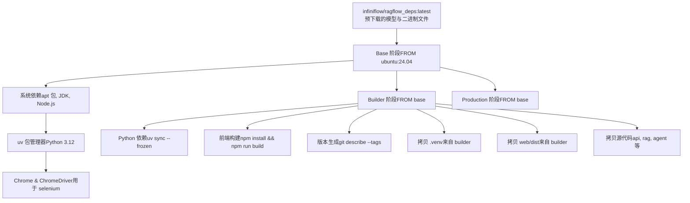
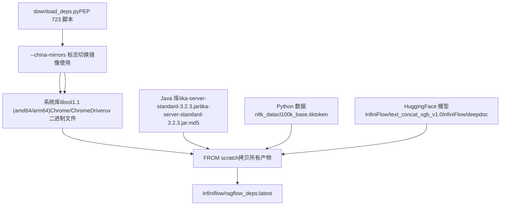
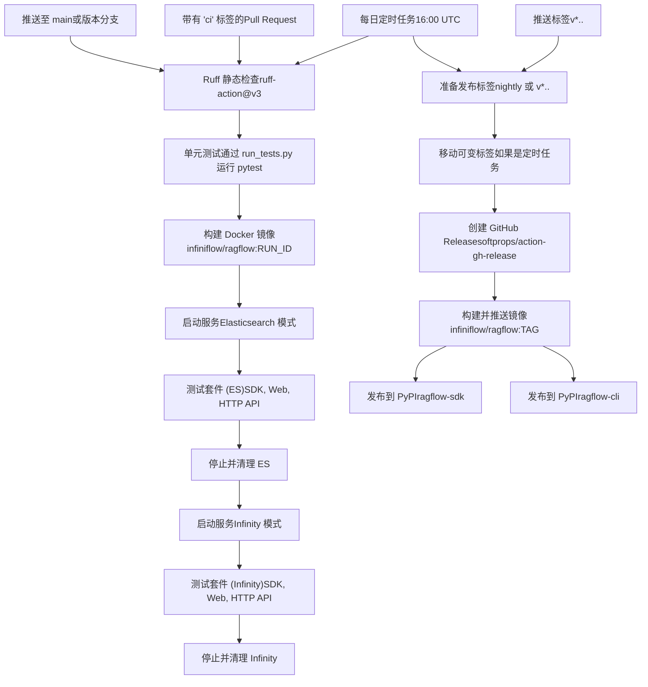

# 构建系统与 CI/CD

相关源文件

-   [.github/workflows/release.yml](https://github.com/infiniflow/ragflow/blob/80a16e71/.github/workflows/release.yml)
-   [.github/workflows/tests.yml](https://github.com/infiniflow/ragflow/blob/80a16e71/.github/workflows/tests.yml)
-   [Dockerfile](https://github.com/infiniflow/ragflow/blob/80a16e71/Dockerfile)
-   [Dockerfile.deps](https://github.com/infiniflow/ragflow/blob/80a16e71/Dockerfile.deps)
-   [api/apps/connector\_app.py](https://github.com/infiniflow/ragflow/blob/80a16e71/api/apps/connector_app.py)
-   [api/db/runtime\_config.py](https://github.com/infiniflow/ragflow/blob/80a16e71/api/db/runtime_config.py)
-   [api/db/services/connector\_service.py](https://github.com/infiniflow/ragflow/blob/80a16e71/api/db/services/connector_service.py)
-   [api/utils/common.py](https://github.com/infiniflow/ragflow/blob/80a16e71/api/utils/common.py)
-   [common/constants.py](https://github.com/infiniflow/ragflow/blob/80a16e71/common/constants.py)
-   [common/data\_source/\_\_init\_\_.py](https://github.com/infiniflow/ragflow/blob/80a16e71/common/data_source/__init__.py)
-   [common/data\_source/config.py](https://github.com/infiniflow/ragflow/blob/80a16e71/common/data_source/config.py)
-   [docker/docker-compose-base.yml](https://github.com/infiniflow/ragflow/blob/80a16e71/docker/docker-compose-base.yml)
-   [docker/infinity\_conf.toml](https://github.com/infiniflow/ragflow/blob/80a16e71/docker/infinity_conf.toml)
-   [download\_deps.py](https://github.com/infiniflow/ragflow/blob/80a16e71/download_deps.py)
-   [helm/values.yaml](https://github.com/infiniflow/ragflow/blob/80a16e71/helm/values.yaml)
-   [pyproject.toml](https://github.com/infiniflow/ragflow/blob/80a16e71/pyproject.toml)
-   [rag/svr/sync\_data\_source.py](https://github.com/infiniflow/ragflow/blob/80a16e71/rag/svr/sync_data_source.py)
-   [sdk/python/pyproject.toml](https://github.com/infiniflow/ragflow/blob/80a16e71/sdk/python/pyproject.toml)
-   [sdk/python/uv.lock](https://github.com/infiniflow/ragflow/blob/80a16e71/sdk/python/uv.lock)
-   [uv.lock](https://github.com/infiniflow/ragflow/blob/80a16e71/uv.lock)
-   [web/src/pages/user-setting/data-source/constant/index.tsx](https://github.com/infiniflow/ragflow/blob/80a16e71/web/src/pages/user-setting/data-source/constant/index.tsx)

本文档描述了 RAGFlow 的构建系统、依赖管理以及持续集成/交付（CI/CD）流水线。内容涵盖了多阶段 Docker 构建过程、依赖缓存策略、用于测试与发布的 GitHub Actions 工作流，以及 Docker 镜像与 Python 包的自动化发布流程。

有关部署与运行时配置的信息，请参见 [Docker Compose 部署](/infiniflow/ragflow/2.1-docker-compose-deployment) 与 [配置管理](/infiniflow/ragflow/2.2-configuration-management)。有关构建时可选的文档存储后端信息，请参见 [文档引擎选择](/infiniflow/ragflow/2.3-document-engine-selection)。

---

## 构建系统概述

RAGFlow 使用三阶段 Docker 构建过程，并采用激进的依赖缓存策略以最小化构建时间。该构建系统旨在同时支持互联网自由访问环境以及通过镜像支持受限网络环境（例如中国）。

### 多阶段 Docker 构建架构



**多阶段构建流程图**

该构建过程使用三个不同的阶段，这些阶段共享同一个基础镜像，以最大程度地复用镜像层，同时最小化最终镜像的体积。

数据源：[Dockerfile1-211](https://github.com/infiniflow/ragflow/blob/80a16e71/Dockerfile#L1-L211) [Dockerfile.deps1-11](https://github.com/infiniflow/ragflow/blob/80a16e71/Dockerfile.deps#L1-L11)

### Base 阶段：系统依赖

Base 阶段安装了构建与运行所需的所有系统级依赖。它从 `infiniflow/ragflow_deps:latest` 缓存镜像中拷贝预下载的资源，以避免重复下载。

**关键组件：**

-   **操作系统**：Ubuntu 24.04 [Dockerfile2](https://github.com/infiniflow/ragflow/blob/80a16e71/Dockerfile#L2-L2)
-   **Python**：由 `uv` 管理，版本 3.12 [Dockerfile73](https://github.com/infiniflow/ragflow/blob/80a16e71/Dockerfile#L73-L73)
-   **Node.js**：来自 NodeSource 的 20.x 版本 [Dockerfile79-84](https://github.com/infiniflow/ragflow/blob/80a16e71/Dockerfile#L79-L84)
-   **Rust/Cargo**：构建某些 Python 扩展所需 [Dockerfile87-100](https://github.com/infiniflow/ragflow/blob/80a16e71/Dockerfile#L87-L100)
-   **Java**：用于 Apache Tika 的 default-jdk [Dockerfile48](https://github.com/infiniflow/ragflow/blob/80a16e71/Dockerfile#L48-L48)
-   **Chrome/ChromeDriver**：用于基于 Selenium 的网页抓取 [Dockerfile122-129](https://github.com/infiniflow/ragflow/blob/80a16e71/Dockerfile#L122-L129)

Base 阶段通过挂载 apt 包缓存来加速后续构建：

```dockerfile
RUN --mount=type=cache,id=ragflow_apt,target=/var/cache/apt,sharing=locked \
    apt update && apt install -y <packages>
```

**镜像支持**：当设置了 `NEED_MIRROR=1` 时，构建过程会为 Ubuntu、Rust 和 Python 包使用中国镜像源 [Dockerfile38-92](https://github.com/infiniflow/ragflow/blob/80a16e71/Dockerfile#L38-L92)。

数据源：[Dockerfile1-139](https://github.com/infiniflow/ragflow/blob/80a16e71/Dockerfile#L1-L139)

### Builder 阶段：编译与产物

Builder 阶段执行所有的编译任务：

1.  **Python 依赖**：使用 `uv sync --frozen` 从 `uv.lock` 安装 [Dockerfile152-160](https://github.com/infiniflow/ragflow/blob/80a16e71/Dockerfile#L152-L160)。
2.  **前端产物**：通过 `npm install && npm run build` 构建 React 前端 [Dockerfile162-166](https://github.com/infiniflow/ragflow/blob/80a16e71/Dockerfile#L162-L166)。
3.  **版本信息**：使用 `git describe` 从 git 标签中提取版本 [Dockerfile168-173](https://github.com/infiniflow/ragflow/blob/80a16e71/Dockerfile#L168-L173)。

Builder 阶段同时为 `uv` 和 `npm` 使用挂载缓存：

```dockerfile
RUN --mount=type=cache,id=ragflow_uv,target=/root/.cache/uv,sharing=locked \
    uv sync --python 3.12 --frozen
```

数据源：[Dockerfile142-174](https://github.com/infiniflow/ragflow/blob/80a16e71/Dockerfile#L142-L174)

### Production 阶段：极简运行时

Production 阶段仅从 Builder 阶段拷贝必需的构建产物：

-   来自 `.venv` 的 Python 虚拟环境 [Dockerfile182-184](https://github.com/infiniflow/ragflow/blob/80a16e71/Dockerfile#L182-L184)。
-   来自 `web/dist` 的已编译前端产物 [Dockerfile207](https://github.com/infiniflow/ragflow/blob/80a16e71/Dockerfile#L207-L207)。
-   源代码（api, rag, agent 等）[Dockerfile188-200](https://github.com/infiniflow/ragflow/blob/80a16e71/Dockerfile#L188-L200)。
-   配置模板 [Dockerfile202-204](https://github.com/infiniflow/ragflow/blob/80a16e71/Dockerfile#L202-L204)。

通过排除构建工具、Source Map 以及中间产物，最终镜像的体积得以最小化。

数据源：[Dockerfile176-211](https://github.com/infiniflow/ragflow/blob/80a16e71/Dockerfile#L176-211)

---

## 依赖管理

### 下载脚本架构



**依赖下载与缓存工作流**

数据源：[download\_deps.py1-82](https://github.com/infiniflow/ragflow/blob/80a16e71/download_deps.py#L1-L82) [Dockerfile.deps1-11](https://github.com/infiniflow/ragflow/blob/80a16e71/Dockerfile.deps#L1-L11)

### 依赖类别

`download_deps.py` 脚本下载四类依赖：

**系统二进制文件** [download\_deps.py22-32](https://github.com/infiniflow/ragflow/blob/80a16e71/download_deps.py#L22-L32)：

-   用于 x86\_64 和 arm64 的 OpenSSL 1.1 库（aspose-slides 所需）。
-   Chrome 和 ChromeDriver 121.0.6167.85 版本。
-   用于 x86\_64 和 aarch64 的 uv 包管理器。

**Java 依赖** [download\_deps.py26-27](https://github.com/infiniflow/ragflow/blob/80a16e71/download_deps.py#L26-L27)：

-   Apache Tika server standard 3.2.3 及其 MD5 校验和。

**Python 数据** [download\_deps.py28-77](https://github.com/infiniflow/ragflow/blob/80a16e71/download_deps.py#L28-L77)：

-   OpenAI tiktoken 编码文件 `cl100k_base.tiktoken`。
-   NLTK 数据：wordnet, punkt, punkt\_tab。

**HuggingFace 模型** [download\_deps.py48-57](https://github.com/infiniflow/ragflow/blob/80a16e71/download_deps.py#L48-L57)：

-   `InfiniFlow/text_concat_xgb_v1.0`：用于切片合并的 XGBoost 模型。
-   `InfiniFlow/deepdoc`：OCR 与布局识别模型。

### 镜像策略

当传递了 `--china-mirrors` 时，脚本会使用替代 URL：

| 资源 | 默认值 | 中国镜像 |
| --- | --- | --- |
| Ubuntu 包 | `archive.ubuntu.com` | `mirrors.tuna.tsinghua.edu.cn` |
| Chrome | `storage.googleapis.com` | `registry.npmmirror.com` |
| Maven | `repo1.maven.org` | `repo.huaweicloud.com` |

数据源：[download\_deps.py21-45](https://github.com/infiniflow/ragflow/blob/80a16e71/download_deps.py#L21-L45)

### 使用 uv 进行 Python 包管理

RAGFlow 使用 `uv` 作为其 Python 包管理器，而不是 pip，以实现更快的依赖解析和安装。`pyproject.toml` 定义了项目元数据和依赖项 [pyproject.toml1-278](https://github.com/infiniflow/ragflow/blob/80a16e71/pyproject.toml#L1-L278)。

**关键配置**：

```toml
[project]
name = "ragflow"
version = "0.23.1"
requires-python = ">=3.12,<3.15"
```

`uv.lock` 文件锁定了跨多个 Python 版本和平台的所有传递依赖的确切版本。构建过程使用 `uv sync --frozen` 从锁定文件安装，而不进行重新解析 [Dockerfile158](https://github.com/infiniflow/ragflow/blob/80a16e71/Dockerfile#L158-L158)。

**镜像配置**：当 `NEED_MIRROR=1` 时，uv 被配置为使用清华 PyPI 镜像：

```toml
[[index]]
url = "https://pypi.tuna.tsinghua.edu.cn/simple"
default = true
```

数据源：[pyproject.toml1-278](https://github.com/infiniflow/ragflow/blob/80a16e71/pyproject.toml#L1-L278) [Dockerfile61-160](https://github.com/infiniflow/ragflow/blob/80a16e71/Dockerfile#L61-L160)

---

## CI/CD 流水线

### GitHub Actions 工作流



**CI/CD 工作流架构**

数据源：[.github/workflows/tests.yml1-295](https://github.com/infiniflow/ragflow/blob/80a16e71/.github/workflows/tests.yml#L1-L295) [.github/workflows/release.yml1-102](https://github.com/infiniflow/ragflow/blob/80a16e71/.github/workflows/release.yml#L1-L102)

### 测试工作流 (tests.yml)

测试工作流由三个触发器运行：

1.  **推送 (Push)** 到 main 或版本分支（排除文档更改）[.github/workflows/tests.yml6-12](https://github.com/infiniflow/ragflow/blob/80a16e71/.github/workflows/tests.yml#L6-L12)。
2.  **拉取请求 (Pull Request)** 带有 `ci` 标签且非草稿状态 [.github/workflows/tests.yml17-36](https://github.com/infiniflow/ragflow/blob/80a16e71/.github/workflows/tests.yml#L17-L36)。
3.  **每日定时任务** 16:00 UTC（北京时间午夜）[.github/workflows/tests.yml23-24](https://github.com/infiniflow/ragflow/blob/80a16e71/.github/workflows/tests.yml#L23-L24)。

**并发控制**：使用工作流级并发控制并自动取消，以防止重复运行 [.github/workflows/tests.yml27-29](https://github.com/infiniflow/ragflow/blob/80a16e71/.github/workflows/tests.yml#L27-L29)。

#### 测试执行步骤

**1. 静态分析** [.github/workflows/tests.yml94-98](https://github.com/infiniflow/ragflow/blob/80a16e71/.github/workflows/tests.yml#L94-L98)：

```yaml
- name: Static check with Ruff
  uses: astral-sh/ruff-action@v3
  with:
    version: ">=0.11.x"
    args: "check"
```

**2. 单元测试** [.github/workflows/tests.yml132-138](https://github.com/infiniflow/ragflow/blob/80a16e71/.github/workflows/tests.yml#L132-L138)：

```bash
uv sync --python 3.12 --group test --frozen
source .venv/bin/activate
python3 run_tests.py
```

**3. 构建 Docker 镜像** [.github/workflows/tests.yml140-153](https://github.com/infiniflow/ragflow/blob/80a16e71/.github/workflows/tests.yml#L140-L153)：

-   构建打有 `GITHUB_RUN_ID` 标签的镜像。
-   为中国境内的运行器使用 `NEED_MIRROR=1`。
-   根据触发器设置 `HTTP_API_TEST_LEVEL`（PR 为 p2，定时任务为 p3）。

**4. 文档引擎测试** [.github/workflows/tests.yml155-295](https://github.com/infiniflow/ragflow/blob/80a16e71/.github/workflows/tests.yml#L155-L295)：

该工作流通过以下方式对 Elasticsearch 和 Infinity 后端进行测试：

1.  以 Elasticsearch Profile 启动服务。
2.  运行测试套件（SDK, Web API, HTTP API）。
3.  收集日志。
4.  停止并清理。
5.  以 Infinity Profile 重启（通过在 docker/.env 中置顶 `DOC_ENGINE=infinity`）。
6.  重新运行所有测试套件。

**并行运行器的端口分配**：该工作流根据运行器编号动态分配端口，以支持并行执行 [.github/workflows/tests.yml157-198](https://github.com/infiniflow/ragflow/blob/80a16e71/.github/workflows/tests.yml#L157-L198)：

```bash
RUNNER_NUM=$(docker inspect $(hostname) --format '{{index .Config.Labels "com.docker.compose.container-number"}}' || echo 1)
ES_PORT=$((1200 + RUNNER_NUM * 10))
SVR_HTTP_PORT=$((9380 + RUNNER_NUM * 10))
# ... 等等
```

这确保了同一宿主机上的多个测试运行不会冲突。

数据源：[.github/workflows/tests.yml1-295](https://github.com/infiniflow/ragflow/blob/80a16e71/.github/workflows/tests.yml#L1-L295)

### 测试标记与级别

测试使用 `pyproject.toml` 中定义的 pytest 标记进行组织 [pyproject.toml208-212](https://github.com/infiniflow/ragflow/blob/80a16e71/pyproject.toml#L208-L212)：

```toml
markers = [
    "p1: high priority test cases",
    "p2: medium priority test cases",
    "p3: low priority test cases",
]
```

测试级别通过 `HTTP_API_TEST_LEVEL` 环境变量设置：

-   **p2**：拉取请求的默认级别（中等优先级测试）。
-   **p3**：定时运行的全面测试（包含低优先级）。

pytest 命令通过级别进行过滤：

```bash
pytest -s --tb=short --level=${HTTP_API_TEST_LEVEL} test/testcases/test_http_api
```

数据源：[pyproject.toml208-212](https://github.com/infiniflow/ragflow/blob/80a16e71/pyproject.toml#L208-L212) [.github/workflows/tests.yml148-233](https://github.com/infiniflow/ragflow/blob/80a16e71/.github/workflows/tests.yml#L148-L233)

### 工作流去重

该工作流实现了去重逻辑，以避免在 PR 合并时进行冗余运行 [.github/workflows/tests.yml52-91](https://github.com/infiniflow/ragflow/blob/80a16e71/.github/workflows/tests.yml#L52-L91)：

1.  **针对推送事件**：找到引入该提交的 PR。
2.  **检查工作区哈希**：将 `git rev-parse HEAD^{tree}` 与存储的 PR 哈希进行对比。
3.  **如果是重复则取消**：如果哈希匹配，则取消当前运行。
4.  **存储 PR 哈希**：针对 PR 事件，将工作区内容哈希存储在类似 Redis 的 artifact 存储中。

这防止了在 PR 合并到 main 时进行二次测试。

数据源：[.github/workflows/tests.yml52-91](https://github.com/infiniflow/ragflow/blob/80a16e71/.github/workflows/tests.yml#L52-L91)

---

## 发布工作流 (release.yml)

发布工作流处理到 Docker Hub 和 PyPI 的自动化发布。它由两个触发器运行：

1.  **每日定时任务** 13:00 UTC（北京时间 21:00）- 创建/更新 `nightly` 标签 [.github/workflows/release.yml4-5](https://github.com/infiniflow/ragflow/blob/80a16e71/.github/workflows/release.yml#L4-L5)。
2.  **标签推送 (Tag push)** 匹配 `v*.*.*` - 创建版本化发布 [.github/workflows/release.yml9-11](https://github.com/infiniflow/ragflow/blob/80a16e71/.github/workflows/release.yml#L9-L11)。

### 发布过程流

> **[Mermaid sequence]**
> *(图表结构无法解析)*

**发布工作流时序图**

数据源：[.github/workflows/release.yml1-102](https://github.com/infiniflow/ragflow/blob/80a16e71/.github/workflows/release.yml#L1-L102)

### 发布标签逻辑

工作流确定发布标签和预发布状态 [.github/workflows/release.yml39-57](https://github.com/infiniflow/ragflow/blob/80a16e71/.github/workflows/release.yml#L39-L57)：

```bash
if [[ ${GITHUB_EVENT_NAME} != "schedule" ]]; then
    RELEASE_TAG=${GITHUB_REF#refs/tags/}
    if [[ ${RELEASE_TAG} == v* ]]; then
        PRERELEASE=false  # 稳定发布
    else
        PRERELEASE=true   # RC 或 beta
    fi
else
    RELEASE_TAG=nightly
    PRERELEASE=true
fi
```

### 可变标签处理

对于定时发布，工作流会将 `nightly` 标签移动到当前提交 [.github/workflows/release.yml59-73](https://github.com/infiniflow/ragflow/blob/80a16e71/.github/workflows/release.yml#L59-L73)：

```bash
if [[ ${GITHUB_EVENT_NAME} == "schedule" ]]; then
    if [ "$(git rev-parse -q --verify "refs/tags/${RELEASE_TAG}")" = "${GITHUB_SHA}" ]; then
        echo "mutable tag ${RELEASE_TAG} exists and matches ${GITHUB_SHA}"
    else
        git tag -f ${RELEASE_TAG} ${GITHUB_SHA}
        git push -f origin ${RELEASE_TAG}:refs/tags/${RELEASE_TAG}
    fi
fi
```

这确保了 `nightly` 始终指向最新的定时构建结果。

数据源：[.github/workflows/release.yml59-73](https://github.com/infiniflow/ragflow/blob/80a16e71/.github/workflows/release.yml#L59-L73)

### Docker 镜像发布

工作流构建并发布两个 Docker 镜像标签 [.github/workflows/release.yml85-91](https://github.com/infiniflow/ragflow/blob/80a16e71/.github/workflows/release.yml#L85-L91)：

```bash
docker build --build-arg NEED_MIRROR=1 -t infiniflow/ragflow:${RELEASE_TAG} -f Dockerfile .
docker tag infiniflow/ragflow:${RELEASE_TAG} infiniflow/ragflow:latest
docker push infiniflow/ragflow:${RELEASE_TAG}
docker push infiniflow/ragflow:latest
```

**镜像标签**：

-   `infiniflow/ragflow:nightly` - 每日构建。
-   `infiniflow/ragflow:v0.23.1` - 特定版本构建。
-   `infiniflow/ragflow:latest` - 始终指向最新发布版本。

数据源：[.github/workflows/release.yml85-91](https://github.com/infiniflow/ragflow/blob/80a16e71/.github/workflows/release.yml#L85-L91)

### PyPI 包发布

对于版本标签（非 nightly），工作流会将 Python 包发布到 PyPI [.github/workflows/release.yml93-102](https://github.com/infiniflow/ragflow/blob/80a16e71/.github/workflows/release.yml#L93-L102)：

**ragflow-sdk** [.github/workflows/release.yml93-96](https://github.com/infiniflow/ragflow/blob/80a16e71/.github/workflows/release.yml#L93-L96)：

```bash
cd sdk/python && uv build && uv publish --token ${{ secrets.PYPI_API_TOKEN }}
```

**ragflow-cli** [.github/workflows/release.yml98-101](https://github.com/infiniflow/ragflow/blob/80a16e71/.github/workflows/release.yml#L98-L101)：

```bash
cd admin/client && uv build && uv publish --token ${{ secrets.PYPI_API_TOKEN }}
```

两个包都使用 `uv` 进行构建和发布，版本号与主项目版本保持同步 [sdk/python/pyproject.toml3](https://github.com/infiniflow/ragflow/blob/80a16e71/sdk/python/pyproject.toml#L3-L3)。

数据源：[.github/workflows/release.yml93-102](https://github.com/infiniflow/ragflow/blob/80a16e71/.github/workflows/release.yml#L93-L102) [sdk/python/pyproject.toml1-32](https://github.com/infiniflow/ragflow/blob/80a16e71/sdk/python/pyproject.toml#L1-L32)

---

## 构建配置细节

### 环境变量与构建参数

Dockerfile 接受控制镜像使用和代理设置的构建参数：

| 构建参数 | 目的 | 示例 |
| --- | --- | --- |
| `NEED_MIRROR` | 启用中国镜像 | `0` 或 `1` |
| `HTTP_PROXY` | 构建时的 HTTP 代理 | `http://proxy:8080` |
| `HTTPS_PROXY` | 构建时的 HTTPS 代理 | `http://proxy:8080` |

这些参数通常在 CI 工作流中设置 [.github/workflows/tests.yml146](https://github.com/infiniflow/ragflow/blob/80a16e71/.github/workflows/tests.yml#L146-L146)：

```bash
docker build --build-arg NEED_MIRROR=1 \
  --build-arg HTTPS_PROXY=${HTTPS_PROXY} \
  --build-arg HTTP_PROXY=${HTTP_PROXY} \
  -f Dockerfile -t ${RAGFLOW_IMAGE} .
```

数据源：[Dockerfile6-41](https://github.com/infiniflow/ragflow/blob/80a16e71/Dockerfile#L6-L41) [.github/workflows/tests.yml146](https://github.com/infiniflow/ragflow/blob/80a16e71/.github/workflows/tests.yml#L146-L146)

### 版本信息生成

构建过程使用 `git describe` 从 git 标签中提取版本信息 [Dockerfile170-173](https://github.com/infiniflow/ragflow/blob/80a16e71/Dockerfile#L170-L173)：

```dockerfile
RUN version_info=$(git describe --tags --match=v* --first-parent --always); \
    version_info="$version_info"; \
    echo "RAGFlow version: $version_info"; \
    echo $version_info > /ragflow/VERSION
```

该 VERSION 文件会被拷贝到生产镜像中，并在运行时由 `common.versions.get_ragflow_version()` 读取。

数据源：[Dockerfile168-173](https://github.com/infiniflow/ragflow/blob/80a16e71/Dockerfile#L168-L173)

### Python 虚拟环境设置

Builder 阶段使用 `uv` 创建虚拟环境 [Dockerfile152-160](https://github.com/infiniflow/ragflow/blob/80a16e71/Dockerfile#L152-L160)：

```dockerfile
RUN --mount=type=cache,id=ragflow_uv,target=/root/.cache/uv,sharing=locked \
    uv sync --python 3.12 --frozen && \
    .venv/bin/python3 -m ensurepip --upgrade
```

`--frozen` 标志通过防止依赖重解析来确保构建的可复现性。Production 阶段设置了环境变量以使用该虚拟环境 [Dockerfile182-186](https://github.com/infiniflow/ragflow/blob/80a16e71/Dockerfile#L182-L186)：

```dockerfile
ENV VIRTUAL_ENV=/ragflow/.venv
COPY --from=builder ${VIRTUAL_ENV} ${VIRTUAL_ENV}
ENV PATH="${VIRTUAL_ENV}/bin:${PATH}"
ENV PYTHONPATH=/ragflow/
```

数据源：[Dockerfile152-186](https://github.com/infiniflow/ragflow/blob/80a16e71/Dockerfile#L152-L186)

---

## 测试基础设施细节

### 测试套件组织

测试代码组织在 `test/testcases/` 下，分为三类：

1.  **SDK 测试** (`test_sdk_api/`) - 测试 Python SDK 功能。
2.  **Web API 测试** (`test_web_api/`) - 测试 Flask/Quart Web 端点。
3.  **HTTP API 测试** (`test_http_api/`) - 测试 HTTP REST API 的合规性。

每个测试套件都会分别针对 Elasticsearch 和 Infinity 后端运行 [.github/workflows/tests.yml208-278](https://github.com/infiniflow/ragflow/blob/80a16e71/.github/workflows/tests.yml#L208-L278)。

### 测试执行模式

工作流为每个测试套件使用一致的模式 [.github/workflows/tests.yml208-215](https://github.com/infiniflow/ragflow/blob/80a16e71/.github/workflows/tests.yml#L208-L215)：

```bash
# 等待服务就绪
until docker exec ${RAGFLOW_CONTAINER} curl -s --connect-timeout 5 ${HOST_ADDRESS}/v1/system/ping > /dev/null; do
    echo "Waiting for service to be available..."
    sleep 5
done

# 在正确的环境中运行测试
export http_proxy=""; export https_proxy=""  # 清理代理
source .venv/bin/activate
pytest -s --tb=short --level=${HTTP_API_TEST_LEVEL} test/testcases/test_sdk_api 2>&1 | tee es_sdk_test.log
```

测试日志会被重定向到独立文件（如 `es_sdk_test.log`, `infinity_sdk_test.log` 等）以便调试。

数据源：[.github/workflows/tests.yml208-278](https://github.com/infiniflow/ragflow/blob/80a16e71/.github/workflows/tests.yml#L208-L278)

### 日志收集

在每个测试阶段结束后，工作流会收集 RAGFlow 日志以供调试 [.github/workflows/tests.yml235-240](https://github.com/infiniflow/ragflow/blob/80a16e71/.github/workflows/tests.yml#L235-L240)：

```bash
cp -r docker/ragflow-logs ${ARTIFACTS_DIR}/ragflow-logs-es
echo "ragflow log" && tail -n 200 docker/ragflow-logs/ragflow_server.log
sudo rm -rf docker/ragflow-logs
```

Artifacts 存储在 `${ARTIFACTS_DIR}` 中，该路径是按次运行计算的 [.github/workflows/tests.yml89-91](https://github.com/infiniflow/ragflow/blob/80a16e71/.github/workflows/tests.yml#L89-L91)：

```bash
ARTIFACTS_DIR=${RUNNER_WORKSPACE_PREFIX}/artifacts/${GITHUB_REPOSITORY}/${GITHUB_RUN_ID}
rm -rf ${ARTIFACTS_DIR} && mkdir -p ${ARTIFACTS_DIR}
```

数据源：[.github/workflows/tests.yml89-240](https://github.com/infiniflow/ragflow/blob/80a16e71/.github/workflows/tests.yml#L89-L240)

---

## 覆盖率与质量指标

### 测试覆盖率配置

测试覆盖率在 `pyproject.toml` 中配置 [pyproject.toml231-277](https://github.com/infiniflow/ragflow/blob/80a16e71/pyproject.toml#L231-L277)：

```toml
[tool.coverage.run]
source = ["../../common"]
omit = [
    "*/tests/*",
    "*/test_*",
    "*/__pycache__/*",
    # ... 等等
]

[tool.coverage.report]
precision = 2
show_missing = true
skip_covered = false
fail_under = 0  # 当前未设置最低阈值
```

覆盖率报告以 HTML 格式生成在 `htmlcov/` 目录下 [pyproject.toml274-277](https://github.com/infiniflow/ragflow/blob/80a16e71/pyproject.toml#L274-L277)。

### Ruff 静态分析配置

Ruff 配置了特定的规则和排除项 [pyproject.toml190-196](https://github.com/infiniflow/ragflow/blob/80a16e71/pyproject.toml#L190-L196)：

```toml
[tool.ruff]
line-length = 200
exclude = [".venv", "rag/svr/discord_svr.py"]

[tool.ruff.lint]
extend-select = ["ASYNC", "ASYNC1"]  # 启用异步检查
ignore = ["E402"]  # 忽略模块级导入不在文件顶部的错误
```

CI 工作流使用 `>=0.11.x` 的版本约束运行 Ruff [.github/workflows/tests.yml94-98](https://github.com/infiniflow/ragflow/blob/80a16e71/.github/workflows/tests.yml#L94-L98)。

数据源：[pyproject.toml190-277](https://github.com/infiniflow/ragflow/blob/80a16e71/pyproject.toml#L190-L277) [.github/workflows/tests.yml94-98](https://github.com/infiniflow/ragflow/blob/80a16e71/.github/workflows/tests.yml#L94-L98)
