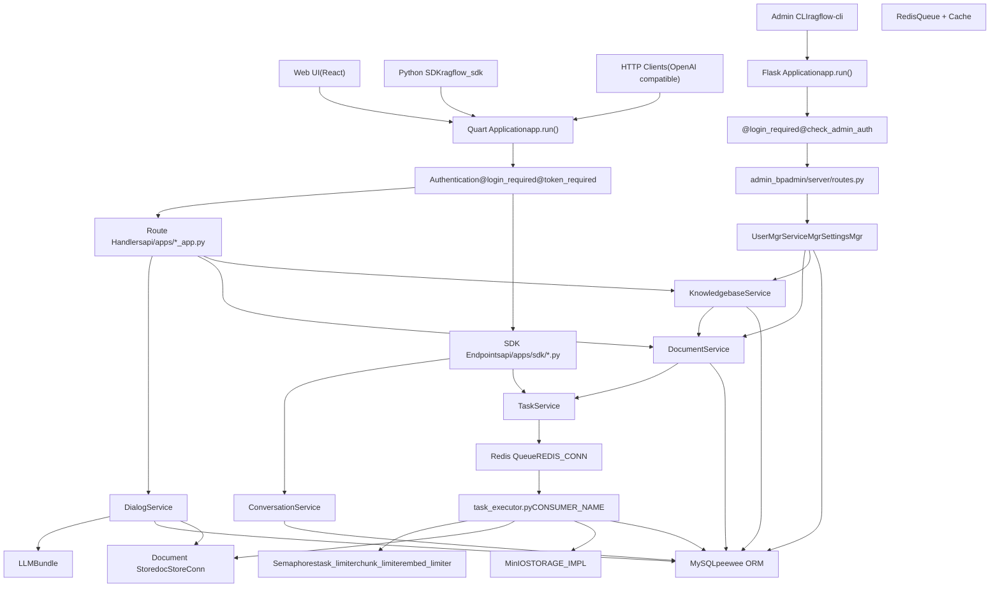
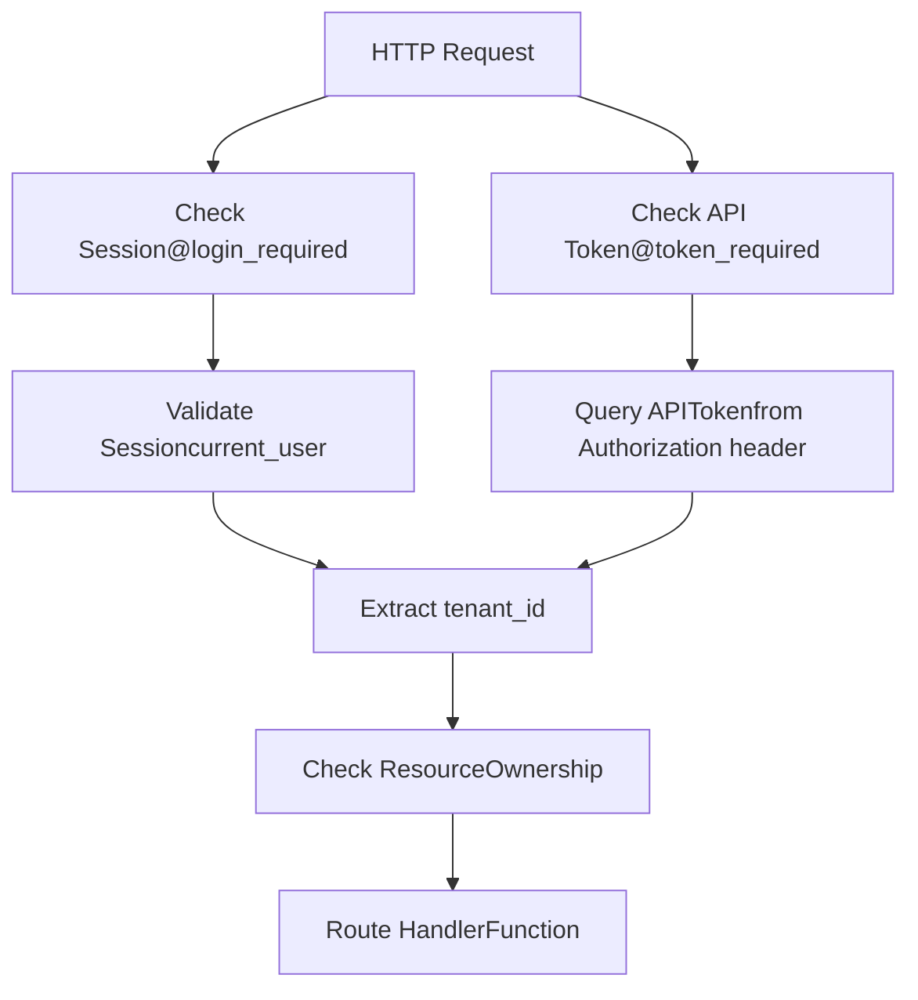
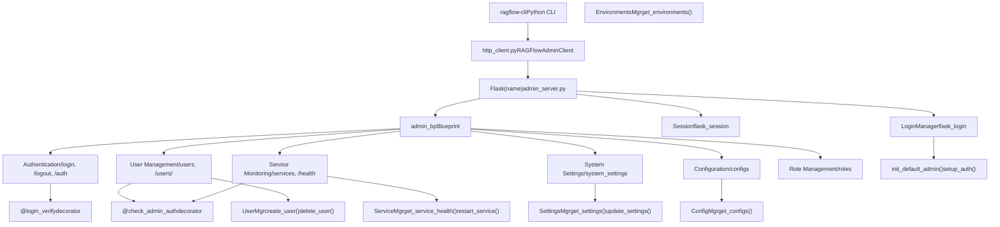
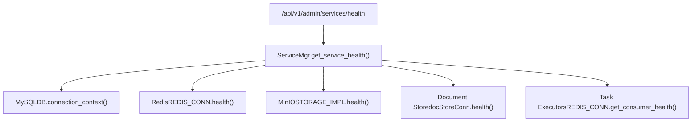
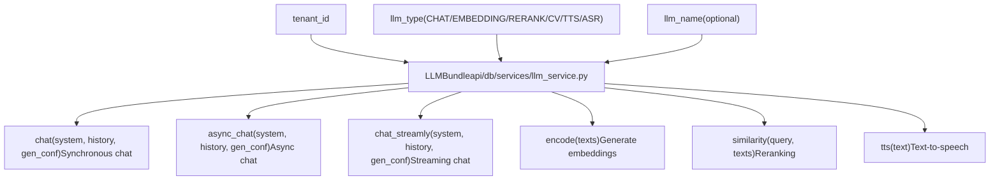
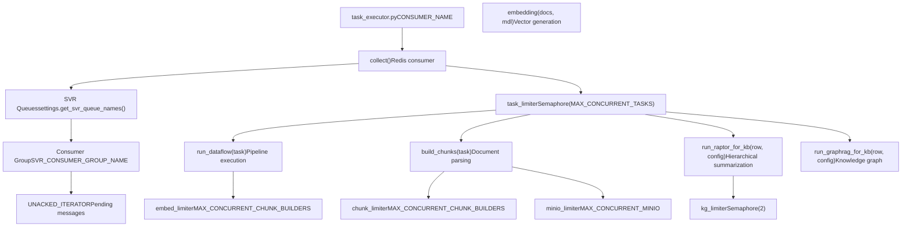
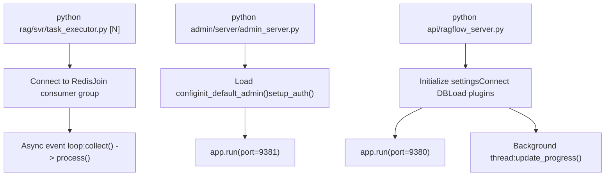

# 核心应用服务

相关源文件

-   [admin/client/README.md](https://github.com/infiniflow/ragflow/blob/80a16e71/admin/client/README.md)
-   [admin/client/http_client.py](https://github.com/infiniflow/ragflow/blob/80a16e71/admin/client/http_client.py)
-   [admin/client/parser.py](https://github.com/infiniflow/ragflow/blob/80a16e71/admin/client/parser.py)
-   [admin/client/pyproject.toml](https://github.com/infiniflow/ragflow/blob/80a16e71/admin/client/pyproject.toml)
-   [admin/client/ragflow_cli.py](https://github.com/infiniflow/ragflow/blob/80a16e71/admin/client/ragflow_cli.py)
-   [admin/client/ragflow_client.py](https://github.com/infiniflow/ragflow/blob/80a16e71/admin/client/ragflow_client.py)
-   [admin/client/user.py](https://github.com/infiniflow/ragflow/blob/80a16e71/admin/client/user.py)
-   [admin/server/admin_server.py](https://github.com/infiniflow/ragflow/blob/80a16e71/admin/server/admin_server.py)
-   [admin/server/auth.py](https://github.com/infiniflow/ragflow/blob/80a16e71/admin/server/auth.py)
-   [admin/server/config.py](https://github.com/infiniflow/ragflow/blob/80a16e71/admin/server/config.py)
-   [admin/server/routes.py](https://github.com/infiniflow/ragflow/blob/80a16e71/admin/server/routes.py)
-   [admin/server/services.py](https://github.com/infiniflow/ragflow/blob/80a16e71/admin/server/services.py)
-   [api/apps/chunk_app.py](https://github.com/infiniflow/ragflow/blob/80a16e71/api/apps/chunk_app.py)
-   [api/apps/conversation_app.py](https://github.com/infiniflow/ragflow/blob/80a16e71/api/apps/conversation_app.py)
-   [api/apps/document_app.py](https://github.com/infiniflow/ragflow/blob/80a16e71/api/apps/document_app.py)
-   [api/apps/file2document_app.py](https://github.com/infiniflow/ragflow/blob/80a16e71/api/apps/file2document_app.py)
-   [api/apps/file_app.py](https://github.com/infiniflow/ragflow/blob/80a16e71/api/apps/file_app.py)
-   [api/apps/kb_app.py](https://github.com/infiniflow/ragflow/blob/80a16e71/api/apps/kb_app.py)
-   [api/constants.py](https://github.com/infiniflow/ragflow/blob/80a16e71/api/constants.py)
-   [api/db/db_models.py](https://github.com/infiniflow/ragflow/blob/80a16e71/api/db/db_models.py)
-   [api/db/services/dialog_service.py](https://github.com/infiniflow/ragflow/blob/80a16e71/api/db/services/dialog_service.py)
-   [api/db/services/document_service.py](https://github.com/infiniflow/ragflow/blob/80a16e71/api/db/services/document_service.py)
-   [api/db/services/file_service.py](https://github.com/infiniflow/ragflow/blob/80a16e71/api/db/services/file_service.py)
-   [api/db/services/knowledgebase_service.py](https://github.com/infiniflow/ragflow/blob/80a16e71/api/db/services/knowledgebase_service.py)
-   [api/db/services/system_settings_service.py](https://github.com/infiniflow/ragflow/blob/80a16e71/api/db/services/system_settings_service.py)
-   [api/db/services/task_service.py](https://github.com/infiniflow/ragflow/blob/80a16e71/api/db/services/task_service.py)
-   [api/ragflow_server.py](https://github.com/infiniflow/ragflow/blob/80a16e71/api/ragflow_server.py)
-   [api/utils/configs.py](https://github.com/infiniflow/ragflow/blob/80a16e71/api/utils/configs.py)
-   [api/utils/health_utils.py](https://github.com/infiniflow/ragflow/blob/80a16e71/api/utils/health_utils.py)
-   [common/connection_utils.py](https://github.com/infiniflow/ragflow/blob/80a16e71/common/connection_utils.py)
-   [conf/system_settings.json](https://github.com/infiniflow/ragflow/blob/80a16e71/conf/system_settings.json)
-   [rag/nlp/search.py](https://github.com/infiniflow/ragflow/blob/80a16e71/rag/nlp/search.py)
-   [rag/svr/task_executor.py](https://github.com/infiniflow/ragflow/blob/80a16e71/rag/svr/task_executor.py)

本文档详细介绍了 RAGFlow 的核心应用服务层，包括两个 HTTP 服务器（[api/ragflow_server.py](https://github.com/infiniflow/ragflow/blob/80a16e71/api/ragflow_server.py) 和 [admin/server/admin_server.py](https://github.com/infiniflow/ragflow/blob/80a16e71/admin/server/admin_server.py)）、异步任务执行工作线程以及业务逻辑服务层。这些组件构成了 RAGFlow 请求处理、文档处理、RAG 操作和系统管理的主干。

有关数据存储架构的信息，请参阅[数据存储架构](/infiniflow/ragflow/3.2-data-storage-architecture)。有关任务队列实现的详细信息，请参阅[任务执行与队列系统](/infiniflow/ragflow/3.3-task-execution-and-queue-system)。

## 系统架构概述

RAGFlow 的核心应用服务由两个独立的 HTTP 服务器和一个后台工作线程池组成：


**图表：核心应用服务架构 - 两个服务器和后台工作线程**

来源：[api/ragflow_server.py](https://github.com/infiniflow/ragflow/blob/80a16e71/api/ragflow_server.py) [admin/server/admin_server.py](https://github.com/infiniflow/ragflow/blob/80a16e71/admin/server/admin_server.py) [rag/svr/task_executor.py1-128](https://github.com/infiniflow/ragflow/blob/80a16e71/rag/svr/task_executor.py#L1-L128) [api/apps/__init__.py](https://github.com/infiniflow/ragflow/blob/80a16e71/api/apps/__init__.py) [api/db/services/dialog_service.py1-50](https://github.com/infiniflow/ragflow/blob/80a16e71/api/db/services/dialog_service.py#L1-L50) [api/db/services/document_service.py1-47](https://github.com/infiniflow/ragflow/blob/80a16e71/api/db/services/document_service.py#L1-L47) [admin/server/routes.py1-50](https://github.com/infiniflow/ragflow/blob/80a16e71/admin/server/routes.py#L1-L50)

### 主要职责

| 层 | 组件 | 主要职责 |
| --- | --- | --- |
| **RAGFlow Server** | Quart 应用（端口 9380），路由处理器 | RAG 操作、聊天、数据集管理、API 端点 |
| **Admin Server** | Flask 应用（端口 9381），管理员路由 | 用户管理、系统监控、健康检查、设置 |
| **服务层** | 业务逻辑服务 | 数据库操作、业务规则、数据验证 |
| **任务执行** | 后台工作线程 | 异步处理、文档解析、嵌入生成 |
| **数据层** | MySQL、MinIO、Redis、文档存储 | 持久化存储、缓存、消息队列 |

来源：[api/ragflow_server.py148-151](https://github.com/infiniflow/ragflow/blob/80a16e71/api/ragflow_server.py#L148-L151) [admin/server/admin_server.py82-89](https://github.com/infiniflow/ragflow/blob/80a16e71/admin/server/admin_server.py#L82-L89)

## RAGFlow Server (api/ragflow_server.py)

主 API 服务器基于 Quart（异步 Flask）构建，处理所有与 RAG 相关的 HTTP 请求。它为 Web UI、Python SDK 和与 OpenAI 兼容的 API 客户端提供 RESTful 端点。服务器默认在 9380 端口运行。

### 应用初始化

主应用在 [api/ragflow_server.py](https://github.com/infiniflow/ragflow/blob/80a16e71/api/ragflow_server.py) 中初始化，并注册了多个蓝图（Blueprint）模块：

```mermaid
flowchart TD
    Server["ragflow_server.pycreate_app()"]
    UserApp["user_app/user"]
    KBApp["kb_app/kb"]
    DocApp["document_app/document"]
    DialogApp["dialog_app/dialog"]
    ConvApp["conversation_app/conversation"]
    ChunkApp["chunk_app/chunk"]
    FileApp["file_app/file"]
    SDKDataset["sdk.dataset/api/v1/datasets"]
    SDKDoc["sdk.doc/api/v1/datasets/{id}/documents"]
    SDKChat["sdk.chat/api/v1/chats"]
    SDKSession["sdk.session/api/v1/chats/{id}/sessions"]
    SDKRetrieval["sdk.dify_retrieval/api/retrieval"]

    Server --> UserApp
    Server --> KBApp
    Server --> DocApp
    Server --> DialogApp
    Server --> ConvApp
    Server --> ChunkApp
    Server --> FileApp
    Server --> SDKDataset
    Server --> SDKDoc
    Server --> SDKChat
    Server --> SDKSession
    Server --> SDKRetrieval
```


**图表：蓝图注册与路由组织**

来源：[api/ragflow_server.py76-156](https://github.com/infiniflow/ragflow/blob/80a16e71/api/ragflow_server.py#L76-L156) [api/apps/__init__.py1-50](https://github.com/infiniflow/ragflow/blob/80a16e71/api/apps/__init__.py#L1-L50) [api/apps/sdk/dataset.py55-57](https://github.com/infiniflow/ragflow/blob/80a16e71/api/apps/sdk/dataset.py#L55-L57) [api/apps/sdk/session.py49-51](https://github.com/infiniflow/ragflow/blob/80a16e71/api/apps/sdk/session.py#L49-L51)

### 服务器初始化序列

RAGFlow 服务器初始化遵循以下序列 [api/ragflow_server.py76-156](https://github.com/infiniflow/ragflow/blob/80a16e71/api/ragflow_server.py#L76-L156)：

> **[Mermaid sequence]**
> *(图表结构无法解析)*

**图表：RAGFlow Server 启动序列**

关键初始化步骤：

1.  **日志器（Logger）初始化** - 为 `ragflow_server` 配置根日志器
2.  **设置（Settings）初始化** - 从 `service_conf.yaml` 和环境变量中加载
3.  **数据库初始化** - 通过 `init_web_db()` 创建表，通过 `init_web_data()` 填充初始数据
4.  **运行时配置** - 在 `RuntimeConfig` 中设置 `JOB_SERVER_HOST` 和 `HTTP_PORT`
5.  **插件加载** - 通过 `GlobalPluginManager` 加载插件
6.  **后台线程** - 启动 `update_progress()` 线程，用于文档进度轮询
7.  **启动服务器** - 在配置的主机/端口上运行 Quart 应用

来源：[api/ragflow_server.py76-156](https://github.com/infiniflow/ragflow/blob/80a16e71/api/ragflow_server.py#L76-L156) [api/db/db_models.py1-100](https://github.com/infiniflow/ragflow/blob/80a16e71/api/db/db_models.py#L1-L100) [common/settings.py](https://github.com/infiniflow/ragflow/blob/80a16e71/common/settings.py)

### 身份验证机制

RAGFlow 支持两种身份验证方法：

1.  **基于会话（Session）的身份验证** (`@login_required`) - 用于 Web UI 用户
2.  **基于令牌（Token）的身份验证** (`@token_required`) - 用于 API/SDK 用户


**图表：身份验证与授权流程**

`@token_required` 装饰器从 API 令牌中提取租户 ID（tenant ID），并将其传递给路由处理器：

来源：[api/utils/api_utils.py280-320](https://github.com/infiniflow/ragflow/blob/80a16e71/api/utils/api_utils.py#L280-L320) [api/apps/__init__.py30-80](https://github.com/infiniflow/ragflow/blob/80a16e71/api/apps/__init__.py#L30-L80)

### 请求处理流水线

典型的 API 请求流经多个层：

> **[Mermaid sequence]**
> *(图表结构无法解析)*

**图表：API 请求处理序列**

来自聊天完成端点的示例 [api/apps/sdk/session.py124-173](https://github.com/infiniflow/ragflow/blob/80a16e71/api/apps/sdk/session.py#L124-L173)：

```
@manager.route("/chats/<chat_id>/completions", methods=["POST"])
@token_required
async def chat_completion(tenant_id, chat_id):
    req = await get_request_json()
    # 验证对话所有权
    dia = DialogService.query(tenant_id=tenant_id, id=chat_id, status=StatusEnum.VALID.value)
    if not dia:
        return get_error_data_result(f"You don't own the chat {chat_id}")

    # 流式或非流式响应
    if req.get("stream", True):
        resp = Response(rag_completion(tenant_id, chat_id, **req), mimetype="text/event-stream")
        return resp
    else:
        answer = None
        async for ans in rag_completion(tenant_id, chat_id, **req):
            answer = ans
            break
        return get_result(data=answer)
```
来源：[api/apps/sdk/session.py124-173](https://github.com/infiniflow/ragflow/blob/80a16e71/api/apps/sdk/session.py#L124-L173) [api/utils/api_utils.py113-150](https://github.com/infiniflow/ragflow/blob/80a16e71/api/utils/api_utils.py#L113-L150)

### OpenAI 兼容端点

RAGFlow 提供与 OpenAI 兼容的聊天完成端点：

| 端点 | 用途 | 兼容性 |
| --- | --- | --- |
| `/api/v1/chats_openai/{chat_id}/chat/completions` | 与知识库聊天 | OpenAI Chat Completions API |
| `/api/v1/agents_openai/{agent_id}/chat/completions` | Agent 执行 | OpenAI Chat Completions API |

这些端点接受 OpenAI 风格的请求格式并返回兼容的响应，从而可以使用 OpenAI SDK 进行无缝替换：

来源：[api/apps/sdk/session.py175-431](https://github.com/infiniflow/ragflow/blob/80a16e71/api/apps/sdk/session.py#L175-L431) [docs/references/http_api_reference.md30-418](https://github.com/infiniflow/ragflow/blob/80a16e71/docs/references/http_api_reference.md#L30-L418)

## Admin Server (admin/server/admin_server.py)

Admin Server 是一个独立的 Flask 应用，专门用于系统管理任务。它默认在 9381 端口运行，提供用户管理、健康监测和系统配置端点。

### Admin Server 架构


**图表：Admin Server 组件架构**

来源：[admin/server/admin_server.py42-89](https://github.com/infiniflow/ragflow/blob/80a16e71/admin/server/admin_server.py#L42-L89) [admin/server/routes.py1-80](https://github.com/infiniflow/ragflow/blob/80a16e71/admin/server/routes.py#L1-L80) [admin/server/services.py1-100](https://github.com/infiniflow/ragflow/blob/80a16e71/admin/server/services.py#L1-L100) [admin/server/auth.py1-100](https://github.com/infiniflow/ragflow/blob/80a16e71/admin/server/auth.py#L1-L100)

### Admin Server 功能

Admin Server 提供以下管理功能：

| 类别 | 端点 | 功能 |
| --- | --- | --- |
| **身份验证** | `/api/v1/admin/login`, `/logout`, `/auth` | 管理员用户使用邮箱/密码登录，会话管理 |
| **用户管理** | `/api/v1/admin/users`, `/users/<username>` | 创建、列出、删除用户；激活/停用账户 |
| **服务监控** | `/api/v1/admin/services`, `/health` | 检查 MySQL、Redis、MinIO、文档存储、任务执行器的健康状况 |
| **系统设置** | `/api/v1/admin/system_settings` | 从 `conf/system_settings.json` 获取/更新系统范围的设置 |
| **配置** | `/api/v1/admin/configs` | 查看当前配置值 |
| **环境变量** | `/api/v1/admin/environments` | 列出环境变量 |
| **角色管理** | `/api/v1/admin/roles` | 管理用户角色和权限 |

来源：[admin/server/routes.py34-250](https://github.com/infiniflow/ragflow/blob/80a16e71/admin/server/routes.py#L34-L250) [admin/server/services.py39-150](https://github.com/infiniflow/ragflow/blob/80a16e71/admin/server/services.py#L39-L150)

### Admin 身份验证流程

Admin Server 使用 Flask-Login 进行会话管理，并具有自定义的身份验证流程：

> **[Mermaid sequence]**
> *(图表结构无法解析)*

**图表：Admin 身份验证与授权**

Admin Server 执行严格的身份验证要求：

1.  **登录** - 只有 `is_superuser=True` 的用户才能登录管理界面
2.  **会话管理** - 使用 Flask-Login 配合会话 cookie
3.  **访问令牌（Access tokens）** - 生成存储在数据库中的唯一访问令牌
4.  **授权检查** - `@check_admin_auth` 装饰器验证超级用户状态
5.  **审计日志** - 跟踪最后登录时间和访问模式

来源：[admin/server/auth.py70-130](https://github.com/infiniflow/ragflow/blob/80a16e71/admin/server/auth.py#L70-L130) [admin/server/routes.py42-72](https://github.com/infiniflow/ragflow/blob/80a16e71/admin/server/routes.py#L42-L72) [admin/server/services.py39-55](https://github.com/infiniflow/ragflow/blob/80a16e71/admin/server/services.py#L39-L55)

### 服务健康监测

Admin Server 通过 `ServiceMgr` 提供全面的健康检查 [admin/server/services.py150-250](https://github.com/infiniflow/ragflow/blob/80a16e71/admin/server/services.py#L150-L250)：


**图表：服务健康检查架构**

健康检查响应格式：

```
{
  "mysql": {"status": "healthy", "latency_ms": 15},
  "redis": {"status": "healthy", "latency_ms": 2},
  "minio": {"status": "healthy", "latency_ms": 8},
  "doc_store": {"status": "healthy", "type": "elasticsearch", "latency_ms": 45},
  "task_executors": {
    "total_workers": 3,
    "active_workers": 2,
    "pending_tasks": 5,
    "consumers": [
      {"name": "task_executor_0", "boot_at": "2024-01-15T10:30:00", "pending": 2},
      {"name": "task_executor_1", "boot_at": "2024-01-15T10:30:05", "pending": 3}
    ]
  }
}
```
来源：[admin/server/services.py150-280](https://github.com/infiniflow/ragflow/blob/80a16e71/admin/server/services.py#L150-L280) [api/utils/health_utils.py1-150](https://github.com/infiniflow/ragflow/blob/80a16e71/api/utils/health_utils.py#L1-L150)

### Admin CLI 客户端

Admin CLI (`ragflow-cli`) 为 Admin Server 提供命令行界面 [admin/client/ragflow_cli.py1-400](https://github.com/infiniflow/ragflow/blob/80a16e71/admin/client/ragflow_cli.py#L1-L400)：

```
# 用户管理
ragflow-cli user create john@example.com password123
ragflow-cli user list
ragflow-cli user delete john@example.com

# 服务监控
ragflow-cli service list
ragflow-cli service health
ragflow-cli service restart task_executor

# 系统设置
ragflow-cli setting list
ragflow-cli setting set enable_whitelist true
```
该 CLI 使用 `RAGFlowAdminClient` 类 [admin/client/ragflow_client.py1-200](https://github.com/infiniflow/ragflow/blob/80a16e71/admin/client/ragflow_client.py#L1-L200)，其提供了：

-   具有自动令牌刷新的会话管理
-   请求/响应解析
-   错误处理和重试
-   命令参数验证

来源：[admin/client/ragflow_cli.py1-400](https://github.com/infiniflow/ragflow/blob/80a16e71/admin/client/ragflow_cli.py#L1-L400) [admin/client/ragflow_client.py1-200](https://github.com/infiniflow/ragflow/blob/80a16e71/admin/client/ragflow_client.py#L1-L200) [admin/client/http_client.py1-150](https://github.com/infiniflow/ragflow/blob/80a16e71/admin/client/http_client.py#L1-L150)

## 服务层

服务层封装了业务逻辑和数据库操作。每个服务类都继承自 `CommonService`，并管理特定的领域模型。

### 服务类架构

```mermaid
flowchart TD
    CommonService["CommonServiceapi/db/services/common_service.py"]
    DialogService["DialogServicemodel = Dialog"]
    DocumentService["DocumentServicemodel = Document"]
    KnowledgebaseService["KnowledgebaseServicemodel = Knowledgebase"]
    ConversationService["ConversationServicemodel = Conversation"]
    TaskService["TaskServicemodel = Task"]
    FileService["FileServicemodel = File"]
    GetByID["get_by_id(id)"]
    Query["query(**filters)"]
    Save["save(**data)"]
    UpdateByID["update_by_id(id, data)"]
    DeleteByID["delete_by_id(id)"]

    CommonService --> DialogService
    CommonService --> DocumentService
    CommonService --> KnowledgebaseService
    CommonService --> ConversationService
    CommonService --> TaskService
    CommonService --> FileService
    CommonService --> GetByID
    CommonService --> Query
    CommonService --> Save
    CommonService --> UpdateByID
    CommonService --> DeleteByID
```


**图表：服务层类层次结构**

来源：[api/db/services/common_service.py](https://github.com/infiniflow/ragflow/blob/80a16e71/api/db/services/common_service.py) [api/db/services/dialog_service.py51-52](https://github.com/infiniflow/ragflow/blob/80a16e71/api/db/services/dialog_service.py#L51-L52) [api/db/services/document_service.py46-47](https://github.com/infiniflow/ragflow/blob/80a16e71/api/db/services/document_service.py#L46-L47)

### 关键服务类

#### DialogService

管理聊天助手和 RAG 对话 [api/db/services/dialog_service.py51-237](https://github.com/infiniflow/ragflow/blob/80a16e71/api/db/services/dialog_service.py#L51-L237)：

**主要职责：**

-   聊天配置管理
-   对话执行（`async_chat`、`async_chat_solo`）
-   知识库检索集成
-   LLM 响应生成
-   引用插入和参考跟踪

**关键方法：**

-   `async_chat(dialog, messages, stream, **kwargs)` - RAG 模式下的主聊天执行
-   `async_chat_solo(dialog, messages, stream)` - 不使用知识库的聊天
-   `get_models(dialog)` - 初始化嵌入（embedding）、聊天（chat）、重排序（rerank）和 TTS 模型

#### DocumentService

处理文档生命周期和元数据 [api/db/services/document_service.py46-320](https://github.com/infiniflow/ragflow/blob/80a16e71/api/db/services/document_service.py#L46-L320)：

**主要职责：**

-   文档 CRUD 操作
-   文档解析状态跟踪
-   分块（chunk）数量和令牌（token）统计
-   元数据字段管理
-   批量文档操作

**关键方法：**

-   `get_by_kb_id(kb_id, page, size, orderby, desc, keywords, ...)` - 分页文档列表
-   `increment_chunk_num(doc_id, kb_id, token_count, chunk_count, duration)` - 更新统计信息
-   `get_meta_by_kbs(kb_ids)` - 获取用于过滤的元数据
-   `begin_parse(doc_id)` - 将文档标记为正在解析

#### KnowledgebaseService

管理知识库（数据集）配置 [api/db/services/knowledgebase_service.py](https://github.com/infiniflow/ragflow/blob/80a16e71/api/db/services/knowledgebase_service.py)：

**主要职责：**

-   数据集创建和配置
-   解析器和嵌入模型选择
-   分块方法配置
-   租户权限
-   数据集统计聚合

**关键方法：**

-   `create_with_name(name, tenant_id, parser_id, **kwargs)` - 使用默认值创建数据集
-   `get_by_ids(ids)` - 批量获取数据集
-   `accessible(kb_id, user_id)` - 检查访问权限

#### TaskService

管理异步任务生命周期 [api/db/services/task_service.py](https://github.com/infiniflow/ragflow/blob/80a16e71/api/db/services/task_service.py)：

**主要职责：**

-   任务队列管理
-   进度跟踪和更新
-   任务取消
-   状态监测

**关键方法：**

-   `get_task(task_id)` - 获取包含文档信息的任务
-   `update_progress(task_id, progress_dict)` - 更新任务进度
-   `has_canceled(task_id)` - 检查任务是否已取消

来源：[api/db/services/dialog_service.py51-237](https://github.com/infiniflow/ragflow/blob/80a16e71/api/db/services/dialog_service.py#L51-L237) [api/db/services/document_service.py46-320](https://github.com/infiniflow/ragflow/blob/80a16e71/api/db/services/document_service.py#L46-L320) [api/db/services/knowledgebase_service.py1-50](https://github.com/infiniflow/ragflow/blob/80a16e71/api/db/services/knowledgebase_service.py#L1-L50) [api/db/services/task_service.py1-100](https://github.com/infiniflow/ragflow/blob/80a16e71/api/db/services/task_service.py#L1-L100)

### LLMBundle - 统一的 LLM 接口

`LLMBundle` 为跨不同提供商的所有 LLM 操作提供了统一接口：


**图表：LLMBundle 统一接口**

来自 [api/db/services/dialog_service.py214-236](https://github.com/infiniflow/ragflow/blob/80a16e71/api/db/services/dialog_service.py#L214-L236) 的使用示例：

```
def get_models(dialog):
    embd_mdl = LLMBundle(dialog.tenant_id, LLMType.EMBEDDING, embedding_list[0])
    chat_mdl = LLMBundle(dialog.tenant_id, LLMType.CHAT, dialog.llm_id)
    rerank_mdl = LLMBundle(dialog.tenant_id, LLMType.RERANK, dialog.rerank_id)
    tts_mdl = LLMBundle(dialog.tenant_id, LLMType.TTS)
    return kbs, embd_mdl, rerank_mdl, chat_mdl, tts_mdl
```
来源：[api/db/services/llm_service.py](https://github.com/infiniflow/ragflow/blob/80a16e71/api/db/services/llm_service.py) [api/db/services/dialog_service.py214-236](https://github.com/infiniflow/ragflow/blob/80a16e71/api/db/services/dialog_service.py#L214-L236)

## 任务执行器（Task Executor）系统

任务执行器是一个后台工作进程，处理异步操作，如文档解析、分块、嵌入以及高级 RAG 功能（GraphRAG、RAPTOR）。

### 任务执行器架构


**图表：任务执行器进程架构**

来源：[rag/svr/task_executor.py106-128](https://github.com/infiniflow/ragflow/blob/80a16e71/rag/svr/task_executor.py#L106-L128) [rag/svr/task_executor.py169-231](https://github.com/infiniflow/ragflow/blob/80a16e71/rag/svr/task_executor.py#L169-L231)

### 任务类型与处理

执行器处理由 `task_type` 字段标识的多种任务类型：

| 任务类型 | 处理器函数 | 用途 |
| --- | --- | --- |
| `dataflow` | `run_dataflow()` | 执行自定义摄取流水线 |
| 标准解析 | `build_chunks()` + `embedding()` | 使用内置解析器解析文档 |
| `raptor` | `run_raptor_for_kb()` | 生成分层摘要 |
| `graphrag` | `run_graphrag_for_kb()` | 构建知识图谱 |
| `mindmap` | 脑图生成 | 提取文档结构 |
| `memory` | `handle_save_to_memory_task()` | 提取对话记忆 |

来源：[rag/svr/task_executor.py98-104](https://github.com/infiniflow/ragflow/blob/80a16e71/rag/svr/task_executor.py#L98-L104) [rag/svr/task_executor.py618-757](https://github.com/infiniflow/ragflow/blob/80a16e71/rag/svr/task_executor.py#L618-757)

### 标准文档处理流程

> **[Mermaid sequence]**
> *(图表结构无法解析)*

**图表：文档处理序列**

`build_chunks()` 函数 [rag/svr/task_executor.py237-510](https://github.com/infiniflow/ragflow/blob/80a16e71/rag/svr/task_executor.py#L237-L510) 编排整个解析流水线：

1.  **获取二进制文件** - 从 MinIO 存储中检索文件
2.  **解析文档** - 使用 `FACTORY` 字典中的适当解析器
3.  **上传图像** - 并行将分块图像存储到 MinIO
4.  **增强分块**（可选）：
    -   使用 LLM 生成关键词
    -   使用 LLM 生成问题
    -   使用 LLM 提取元数据
    -   使用现有标签为分块打标签
5.  **生成嵌入** - 使用嵌入模型创建向量
6.  **索引分块** - 插入文档存储
7.  **更新统计信息** - 记录分块数量和令牌使用情况

来源：[rag/svr/task_executor.py237-510](https://github.com/infiniflow/ragflow/blob/80a16e71/rag/svr/task_executor.py#L237-L510) [rag/svr/task_executor.py564-616](https://github.com/infiniflow/ragflow/blob/80a16e71/rag/svr/task_executor.py#L564-L616)

### 并发控制

任务执行器使用 asyncio 信号量来限制并发操作：

```
MAX_CONCURRENT_TASKS = int(os.environ.get('MAX_CONCURRENT_TASKS', "5"))
MAX_CONCURRENT_CHUNK_BUILDERS = int(os.environ.get('MAX_CONCURRENT_CHUNK_BUILDERS', "1"))
MAX_CONCURRENT_MINIO = int(os.environ.get('MAX_CONCURRENT_MINIO', '10'))

task_limiter = asyncio.Semaphore(MAX_CONCURRENT_TASKS)
chunk_limiter = asyncio.Semaphore(MAX_CONCURRENT_CHUNK_BUILDERS)
embed_limiter = asyncio.Semaphore(MAX_CONCURRENT_CHUNK_BUILDERS)
minio_limiter = asyncio.Semaphore(MAX_CONCURRENT_MINIO)
kg_limiter = asyncio.Semaphore(2)
```
这些信号量可防止资源耗尽并确保负载下的稳定运行。

来源：[rag/svr/task_executor.py118-125](https://github.com/infiniflow/ragflow/blob/80a16e71/rag/svr/task_executor.py#L118-L125)

### 进度跟踪

`set_progress()` 函数 [rag/svr/task_executor.py137-167](https://github.com/infiniflow/ragflow/blob/80a16e71/rag/svr/task_executor.py#L137-L167) 更新数据库中的任务状态：

```
def set_progress(task_id, from_page=0, to_page=-1, prog=None, msg="Processing..."):
    # 检查任务是否已取消
    cancel = has_canceled(task_id)
    if cancel:
        msg += " [Canceled]"
        prog = -1

    # 格式化带有时间戳和页面信息的消息
    if msg:
        msg = datetime.now().strftime("%H:%M:%S") + " " + msg

    # 更新数据库
    d = {"progress_msg": msg}
    if prog is not None:
        d["progress"] = prog
    TaskService.update_progress(task_id, d)

    # 如果已取消则抛出异常
    if cancel:
        raise TaskCanceledException(msg)
```
进度值：

-   `0.0` - 任务已开始
-   `0.0 - 0.7` - 解析和分块
-   `0.7 - 0.9` - 嵌入生成
-   `0.9 - 1.0` - 索引到文档存储
-   `1.0` - 已完成
-   `-1` - 发生错误

来源：[rag/svr/task_executor.py137-167](https://github.com/infiniflow/ragflow/blob/80a16e71/rag/svr/task_executor.py#L137-L167)

## 请求流程示例

### 示例 1：文档上传与解析

> **[Mermaid sequence]**
> *(图表结构无法解析)*

**图表：文档上传与解析流程**

来源：[api/apps/document_app.py52-97](https://github.com/infiniflow/ragflow/blob/80a16e71/api/apps/document_app.py#L52-L97) [api/db/services/document_service.py417-500](https://github.com/infiniflow/ragflow/blob/80a16e71/api/db/services/document_service.py#L417-L500) [api/db/services/task_service.py141-200](https://github.com/infiniflow/ragflow/blob/80a16e71/api/db/services/task_service.py#L141-L200) [rag/svr/task_executor.py169-231](https://github.com/infiniflow/ragflow/blob/80a16e71/rag/svr/task_executor.py#L169-L231)

### 示例 2：RAG 聊天完成

> **[Mermaid sequence]**
> *(图表结构无法解析)*

**图表：RAG 聊天完成序列**

聊天流程涉及几个关键步骤：

1.  **身份验证** - 验证租户是否拥有该对话
2.  **模型初始化** - 加载嵌入、聊天、重排序、TTS 模型
3.  **问题处理** - 优化查询、应用元数据过滤、提取关键词
4.  **检索** - 使用混合（向量 + 关键词）搜索来搜索文档存储
5.  **重排序** - 使用重排序模型对结果重新评分
6.  **上下文准备** - 格式化分块并使其适应令牌限制
7.  **LLM 生成** - 从聊天模型流式传输响应
8.  **引用插入** - 添加对相关分块的参考
9.  **响应交付** - 通过服务器发送事件（Server-Sent Events）流式传输给客户端

来源：[api/apps/sdk/session.py124-173](https://github.com/infiniflow/ragflow/blob/80a16e71/api/apps/sdk/session.py#L124-L173) [api/db/services/dialog_service.py276-574](https://github.com/infiniflow/ragflow/blob/80a16e71/api/db/services/dialog_service.py#L276-L574) [rag/nlp/search.py363-450](https://github.com/infiniflow/ragflow/blob/80a16e71/rag/nlp/search.py#L363-L450)

### 示例 3：Agent 画布（Canvas）执行

> **[Mermaid sequence]**
> *(图表结构无法解析)*

**图表：Agent 画布执行流程**

Agent 执行包括：

1.  **加载画布** - 从数据库检索 DSL 定义
2.  **初始化画布** - 解析工作流图并进行验证
3.  **执行组件** - 按依赖顺序运行每个组件
4.  **变量解析** - 解析 `{component_id@output}` 引用
5.  **流式事件** - 向客户端发送实时更新
6.  **错误处理** - 应用 `goto` 或 `comment` 异常策略
7.  **返回结果** - 发送最终输出和执行追踪

来源：[api/apps/sdk/session.py494-550](https://github.com/infiniflow/ragflow/blob/80a16e71/api/apps/sdk/session.py#L494-L550) [agent/canvas.py](https://github.com/infiniflow/ragflow/blob/80a16e71/agent/canvas.py) [api/db/services/canvas_service.py1-50](https://github.com/infiniflow/ragflow/blob/80a16e71/api/db/services/canvas_service.py#L1-L50)

## 配置与初始化

### 环境变量

控制服务行为的关键环境变量：

| 变量 | 默认值 | 用途 | 使用者 |
| --- | --- | --- | --- |
| `MAX_CONCURRENT_TASKS` | 5 | 最大并行任务执行数 | task_executor.py |
| `MAX_CONCURRENT_CHUNK_BUILDERS` | 1 | 最大并行解析操作数 | task_executor.py |
| `MAX_CONCURRENT_MINIO` | 10 | 最大并行 MinIO 操作数 | task_executor.py |
| `WORKER_HEARTBEAT_TIMEOUT` | 120 | 工作线程健康检查超时（秒） | task_executor.py |
| `EMBEDDING_BATCH_SIZE` | (config) | 嵌入生成的批次大小 | settings |
| `DOC_BULK_SIZE` | (config) | 文档存储插入的批次大小 | settings |
| `RAGFLOW_DEBUGPY_LISTEN` | 0 | debugpy 调试端口（0=禁用） | ragflow_server.py |
| `ADMIN_PORT` | 9381 | Admin Server 端口 | admin_server.py |
| `API_PORT` | 9380 | RAGFlow Server 端口 | ragflow_server.py |

来源：[rag/svr/task_executor.py118-126](https://github.com/infiniflow/ragflow/blob/80a16e71/rag/svr/task_executor.py#L118-L126) [api/ragflow_server.py49](https://github.com/infiniflow/ragflow/blob/80a16e71/api/ragflow_server.py#L49-L49) [admin/server/config.py1-100](https://github.com/infiniflow/ragflow/blob/80a16e71/admin/server/config.py#L1-L100)

### 服务启动过程

RAGFlow 由三个必须启动的独立进程组成：


**图表：RAGFlow 服务启动进程**

#### RAGFlow Server 启动 [api/ragflow_server.py76-156](https://github.com/infiniflow/ragflow/blob/80a16e71/api/ragflow_server.py#L76-L156)

1.  **日志器初始化** - `init_root_logger("ragflow_server")`
2.  **设置加载** - 从 `service_conf.yaml` 加载 `settings.init_settings()`
3.  **数据库初始化** - `init_web_db()`、`init_web_data()`
4.  **运行时配置** - 在 `RuntimeConfig` 中设置 `JOB_SERVER_HOST`、`HTTP_PORT`
5.  **插件加载** - `GlobalPluginManager.load_plugins()`
6.  **后台线程** - 启动 `update_progress()` 线程（每 6 秒轮询一次文档进度）
7.  **启动服务器** - `app.run(host=settings.HOST_IP, port=settings.HOST_PORT)`

#### Admin Server 启动 [admin/server/admin_server.py42-89](https://github.com/infiniflow/ragflow/blob/80a16e71/admin/server/admin_server.py#L42-L89)

1.  **日志器初始化** - `init_root_logger("admin_service")`
2.  **配置加载** - 从 `admin/server/config.py` 加载 `load_configurations()`
3.  **设置初始化** - `settings.init_settings()`
4.  **数据库检查** - 验证 MySQL 连接
5.  **创建默认管理员** - `init_default_admin()` 在不存在超级用户时创建一个
6.  **身份验证设置** - `setup_auth(app)` 配置 Flask-Login 和会话
7.  **蓝图注册** - 注册 `admin_bp` 路由
8.  **启动服务器** - `app.run(host="0.0.0.0", port=ADMIN_PORT)`

#### 任务执行器启动 [rag/svr/task_executor.py1-128](https://github.com/infiniflow/ragflow/blob/80a16e71/rag/svr/task_executor.py#L1-L128)

1.  **日志器初始化** - 使用特定于进程的名称调用 `init_root_logger()`
2.  **信号处理器** - 注册 `SIGINT`、`SIGTERM` 处理器以便优雅停机
3.  **设置初始化** - `settings.init_settings()`
4.  **标识消费者** - 设置 `CONSUMER_NAME = "task_executor_" + sys.argv[1]`
5.  **Redis 连接** - 连接到 `REDIS_CONN`
6.  **消费者组** - 创建或加入 `SVR_CONSUMER_GROUP_NAME`
7.  **事件循环** - 启动异步事件循环，通过 `collect()` 消费消息
8.  **信号量限制** - 初始化并发控制信号量

来源：[api/ragflow_server.py76-156](https://github.com/infiniflow/ragflow/blob/80a16e71/api/ragflow_server.py#L76-L156) [admin/server/admin_server.py42-89](https://github.com/infiniflow/ragflow/blob/80a16e71/admin/server/admin_server.py#L42-L89) [rag/svr/task_executor.py1-128](https://github.com/infiniflow/ragflow/blob/80a16e71/rag/svr/task_executor.py#L1-L128)

## 错误处理与韧性

### API 错误响应

API 层使用标准化的错误响应格式：

```
{
    "code": RetCode.ARGUMENT_ERROR,  # 错误代码
    "message": "Description of error"  # 人类可读的消息
}
```
常见错误代码：

-   `RetCode.ARGUMENT_ERROR` (400) - 参数无效
-   `RetCode.AUTHENTICATION_ERROR` (401) - 认证失败
-   `RetCode.OPERATING_ERROR` (403) - 权限被拒绝
-   `RetCode.DATA_ERROR` (404) - 资源未找到
-   `RetCode.SERVER_ERROR` (500) - 内部错误

来源：[api/utils/api_utils.py113-150](https://github.com/infiniflow/ragflow/blob/80a16e71/api/utils/api_utils.py#L113-L150) [common/constants.py](https://github.com/infiniflow/ragflow/blob/80a16e71/common/constants.py)

### 任务执行韧性

任务执行器实现了几种韧性机制：

1.  **任务取消** - 在执行昂贵操作前检查 `has_canceled()`
2.  **进度更新** - 带有时间戳的定期状态更新
3.  **异常处理** - 捕获并记录错误，将任务标记为失败
4.  **自动重试** - Redis 消费者组确保消息重新交付
5.  **优雅停机** - 信号处理器用于清理并终止

来自 [rag/svr/task_executor.py343-346](https://github.com/infiniflow/ragflow/blob/80a16e71/rag/svr/task_executor.py#L343-L346) 的取消检查示例：

```
if has_canceled(task["id"]):
    progress_callback(-1, msg="Task has been canceled.")
    return
```
来源：[rag/svr/task_executor.py137-167](https://github.com/infiniflow/ragflow/blob/80a16e71/rag/svr/task_executor.py#L137-L167) [api/db/services/task_service.py85-110](https://github.com/infiniflow/ragflow/blob/80a16e71/api/db/services/task_service.py#L85-L110)

### 数据库连接管理

Peewee ORM 连接上下文管理器确保正确的连接生命周期：

```
@classmethod
@DB.connection_context()
def get_by_id(cls, id):
    # 数据库操作
    # 方法返回后自动关闭连接
```
来源：[api/db/db_models.py45-180](https://github.com/infiniflow/ragflow/blob/80a16e71/api/db/db_models.py#L45-L180) [api/db/services/common_service.py](https://github.com/infiniflow/ragflow/blob/80a16e71/api/db/services/common_service.py)
