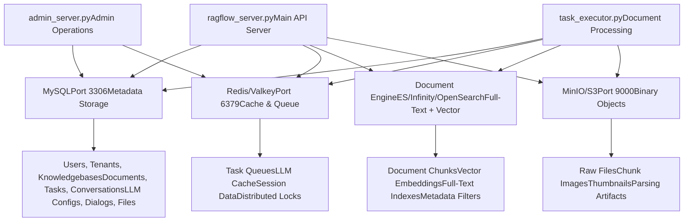
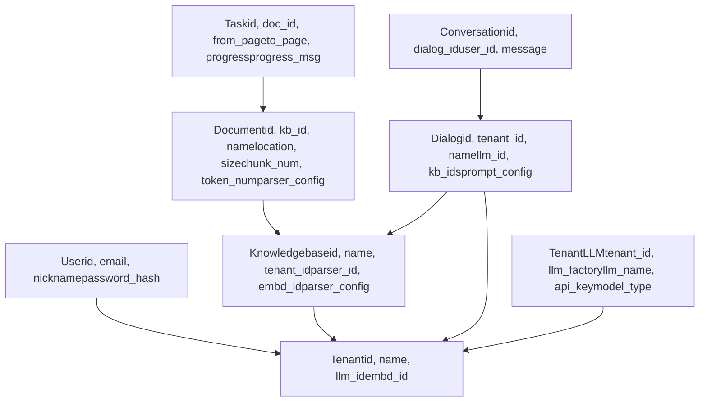
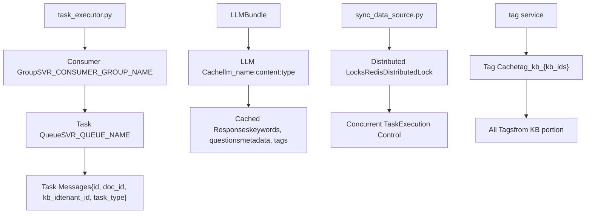
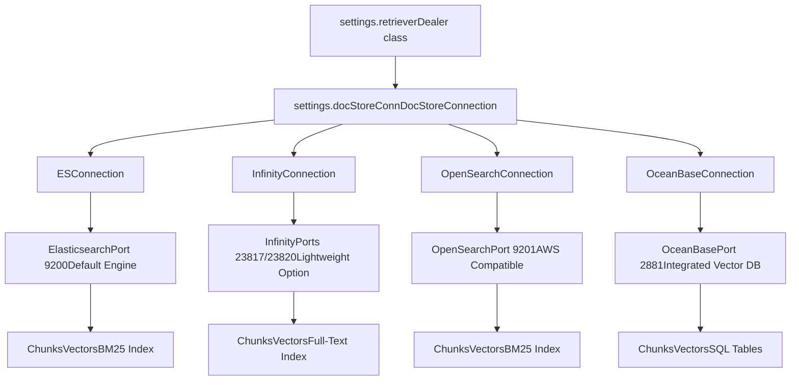
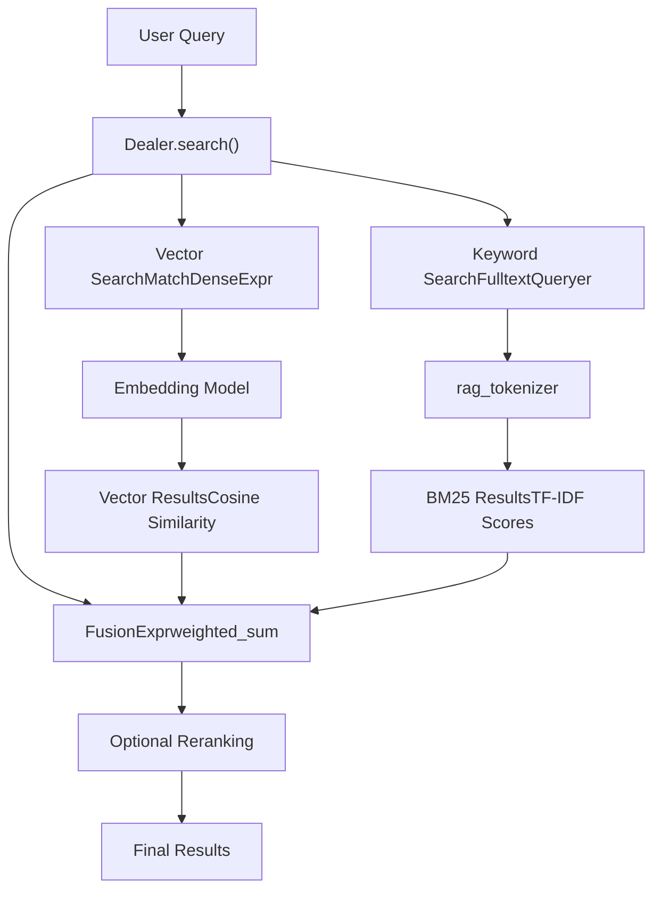
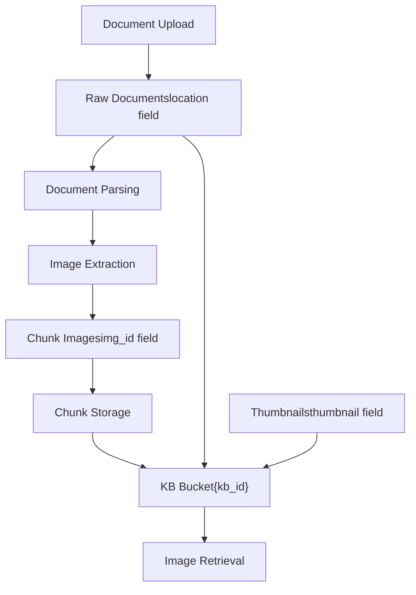

# 数据存储架构

相关源文件

-   [README.md](https://github.com/infiniflow/ragflow/blob/80a16e71/README.md)
-   [README_id.md](https://github.com/infiniflow/ragflow/blob/80a16e71/README_id.md)
-   [README_ja.md](https://github.com/infiniflow/ragflow/blob/80a16e71/README_ja.md)
-   [README_ko.md](https://github.com/infiniflow/ragflow/blob/80a16e71/README_ko.md)
-   [README_pt_br.md](https://github.com/infiniflow/ragflow/blob/80a16e71/README_pt_br.md)
-   [README_tzh.md](https://github.com/infiniflow/ragflow/blob/80a16e71/README_tzh.md)
-   [README_zh.md](https://github.com/infiniflow/ragflow/blob/80a16e71/README_zh.md)
-   [api/apps/chunk_app.py](https://github.com/infiniflow/ragflow/blob/80a16e71/api/apps/chunk_app.py)
-   [api/apps/connector_app.py](https://github.com/infiniflow/ragflow/blob/80a16e71/api/apps/connector_app.py)
-   [api/apps/conversation_app.py](https://github.com/infiniflow/ragflow/blob/80a16e71/api/apps/conversation_app.py)
-   [api/apps/document_app.py](https://github.com/infiniflow/ragflow/blob/80a16e71/api/apps/document_app.py)
-   [api/apps/file2document_app.py](https://github.com/infiniflow/ragflow/blob/80a16e71/api/apps/file2document_app.py)
-   [api/apps/file_app.py](https://github.com/infiniflow/ragflow/blob/80a16e71/api/apps/file_app.py)
-   [api/apps/kb_app.py](https://github.com/infiniflow/ragflow/blob/80a16e71/api/apps/kb_app.py)
-   [api/db/db_models.py](https://github.com/infiniflow/ragflow/blob/80a16e71/api/db/db_models.py)
-   [api/db/services/connector_service.py](https://github.com/infiniflow/ragflow/blob/80a16e71/api/db/services/connector_service.py)
-   [api/db/services/dialog_service.py](https://github.com/infiniflow/ragflow/blob/80a16e71/api/db/services/dialog_service.py)
-   [api/db/services/document_service.py](https://github.com/infiniflow/ragflow/blob/80a16e71/api/db/services/document_service.py)
-   [api/db/services/file_service.py](https://github.com/infiniflow/ragflow/blob/80a16e71/api/db/services/file_service.py)
-   [api/db/services/knowledgebase_service.py](https://github.com/infiniflow/ragflow/blob/80a16e71/api/db/services/knowledgebase_service.py)
-   [api/db/services/task_service.py](https://github.com/infiniflow/ragflow/blob/80a16e71/api/db/services/task_service.py)
-   [api/utils/common.py](https://github.com/infiniflow/ragflow/blob/80a16e71/api/utils/common.py)
-   [common/constants.py](https://github.com/infiniflow/ragflow/blob/80a16e71/common/constants.py)
-   [common/data_source/__init__.py](https://github.com/infiniflow/ragflow/blob/80a16e71/common/data_source/__init__.py)
-   [common/data_source/config.py](https://github.com/infiniflow/ragflow/blob/80a16e71/common/data_source/config.py)
-   [docker/.env](https://github.com/infiniflow/ragflow/blob/80a16e71/docker/.env)
-   [docker/README.md](https://github.com/infiniflow/ragflow/blob/80a16e71/docker/README.md)
-   [docker/docker-compose-base.yml](https://github.com/infiniflow/ragflow/blob/80a16e71/docker/docker-compose-base.yml)
-   [docker/infinity_conf.toml](https://github.com/infiniflow/ragflow/blob/80a16e71/docker/infinity_conf.toml)
-   [docs/configurations.md](https://github.com/infiniflow/ragflow/blob/80a16e71/docs/configurations.md)
-   [docs/guides/manage_files.md](https://github.com/infiniflow/ragflow/blob/80a16e71/docs/guides/manage_files.md)
-   [docs/guides/upgrade_ragflow.mdx](https://github.com/infiniflow/ragflow/blob/80a16e71/docs/guides/upgrade_ragflow.mdx)
-   [docs/quickstart.mdx](https://github.com/infiniflow/ragflow/blob/80a16e71/docs/quickstart.mdx)
-   [helm/values.yaml](https://github.com/infiniflow/ragflow/blob/80a16e71/helm/values.yaml)
-   [pyproject.toml](https://github.com/infiniflow/ragflow/blob/80a16e71/pyproject.toml)
-   [rag/nlp/search.py](https://github.com/infiniflow/ragflow/blob/80a16e71/rag/nlp/search.py)
-   [rag/svr/sync_data_source.py](https://github.com/infiniflow/ragflow/blob/80a16e71/rag/svr/sync_data_source.py)
-   [rag/svr/task_executor.py](https://github.com/infiniflow/ragflow/blob/80a16e71/rag/svr/task_executor.py)
-   [sdk/python/pyproject.toml](https://github.com/infiniflow/ragflow/blob/80a16e71/sdk/python/pyproject.toml)
-   [sdk/python/uv.lock](https://github.com/infiniflow/ragflow/blob/80a16e71/sdk/python/uv.lock)
-   [uv.lock](https://github.com/infiniflow/ragflow/blob/80a16e71/uv.lock)
-   [web/src/pages/user-setting/data-source/constant/index.tsx](https://github.com/infiniflow/ragflow/blob/80a16e71/web/src/pages/user-setting/data-source/constant/index.tsx)

## 目的与范围

本文档介绍了 RAGFlow 的多层存储架构，说明了系统如何在四个不同的存储后端之间分离关注点：用于元数据的 MySQL、用于缓存和任务队列的 Redis、用于全文和向量搜索的可插拔文档引擎，以及用于二进制对象存储的 MinIO/S3。

有关编排跨这些存储层进行数据处理的任务执行系统的信息，请参阅[任务执行与队列系统](/infiniflow/ragflow/3.3-task-execution-and-queue-system)。有关使用这些存储系统的应用服务的详细信息，请参阅[核心应用服务](/infiniflow/ragflow/3.1-core-application-services)。

## 存储层概述

RAGFlow 在其存储架构中采用了清晰的关注点分离，每个组件处理特定类型的数据和访问模式：


**存储职责图**

来源：[rag/svr/task_executor.py1-200](https://github.com/infiniflow/ragflow/blob/80a16e71/rag/svr/task_executor.py#L1-L200) [api/db/db_models.py1-100](https://github.com/infiniflow/ragflow/blob/80a16e71/api/db/db_models.py#L1-L100) [docker/.env1-150](https://github.com/infiniflow/ragflow/blob/80a16e71/docker/.env#L1-L150) [README.md137-141](https://github.com/infiniflow/ragflow/blob/80a16e71/README.md#L137-L141)

| 存储系统 | 数据类型 | 访问模式 | 持久性 |
| --- | --- | --- | --- |
| **MySQL** | 用户账户、知识库配置、文档元数据、任务状态、对话、LLM 设置 | 事务型 CRUD 操作 | 永久 |
| **Redis** | 任务队列、LLM 响应缓存、分布式锁、会话状态 | 高频读/写、发布/订阅 | 临时/易失 |
| **文档引擎** | 分块文本、向量嵌入、BM25 索引、元数据过滤器 | 混合搜索（向量 + 关键词）、聚合 | 永久 |
| **对象存储** | PDF/DOCX 文件、提取的图像、缩略图、解析结果 | 大容量二进制写入、低频读取 | 永久 |

## MySQL：元数据存储

MySQL 是 RAGFlow 中所有关系型元数据的权威事实来源。系统使用带有连接池的 Peewee ORM 进行数据库访问。


**MySQL 模式关系**

来源：[api/db/db_models.py134-850](https://github.com/infiniflow/ragflow/blob/80a16e71/api/db/db_models.py#L134-L850) [docker/.env109-123](https://github.com/infiniflow/ragflow/blob/80a16e71/docker/.env#L109-L123)

### 数据库配置

MySQL 连接通过环境变量配置，并支持 MySQL 和 PostgreSQL 后端：

-   **主机（Host）**: `MYSQL_HOST`（默认：`mysql`）
-   **端口（Port）**: `MYSQL_PORT`（默认：`3306`）
-   **数据库（Database）**: `MYSQL_DBNAME`（默认：`rag_flow`）
-   **凭据（Credentials）**: `MYSQL_USER`、`MYSQL_PASSWORD`
-   **连接池**: `PooledMySQLDatabase` 或 `PooledPostgresqlDatabase`

[api/db/db_models.py700-750](https://github.com/infiniflow/ragflow/blob/80a16e71/api/db/db_models.py#L700-L750) 实现了具有自动重连处理功能的数据库连接单例。

### 关键数据库模型

RAGFlow 使用 Peewee ORM 为所有主要实体定义了模型。每个模型都扩展了 `BaseModel`，后者提供自动时间戳管理：

-   **`User`**: 用户身份验证和个人资料 [api/db/db_models.py800-850](https://github.com/infiniflow/ragflow/blob/80a16e71/api/db/db_models.py#L800-L850)
-   **`Tenant`**: 多租户隔离，LLM 默认值 [api/db/db_models.py850-900](https://github.com/infiniflow/ragflow/blob/80a16e71/api/db/db_models.py#L850-L900)
-   **`Knowledgebase`**: 知识库配置、解析器设置、嵌入模型 [api/db/services/knowledgebase_service.py1-100](https://github.com/infiniflow/ragflow/blob/80a16e71/api/db/services/knowledgebase_service.py#L1-L100)
-   **`Document`**: 文件元数据、解析进度、分块数量 [api/db/services/document_service.py46-78](https://github.com/infiniflow/ragflow/blob/80a16e71/api/db/services/document_service.py#L46-L78)
-   **`Task`**: 异步解析任务状态 [api/db/services/task_service.py1-100](https://github.com/infiniflow/ragflow/blob/80a16e71/api/db/services/task_service.py#L1-L100)
-   **`Dialog`**: 聊天助手配置 [api/db/services/dialog_service.py50-68](https://github.com/infiniflow/ragflow/blob/80a16e71/api/db/services/dialog_service.py#L50-L68)
-   **`TenantLLM`**: 每个租户的 LLM API 密钥 [api/db/db_models.py400-450](https://github.com/infiniflow/ragflow/blob/80a16e71/api/db/db_models.py#L400-L450)

来源：[api/db/db_models.py134-850](https://github.com/infiniflow/ragflow/blob/80a16e71/api/db/db_models.py#L134-L850) [api/db/services/document_service.py1-100](https://github.com/infiniflow/ragflow/blob/80a16e71/api/db/services/document_service.py#L1-L100)

## Redis：缓存与队列

Redis（或其无缝替换方案 Valkey）在 RAGFlow 中提供了三个关键功能：任务队列管理、LLM 响应缓存和分布式锁定。


**Redis 数据结构与用法**

来源：[rag/svr/task_executor.py74-234](https://github.com/infiniflow/ragflow/blob/80a16e71/rag/svr/task_executor.py#L74-L234) [rag/utils/redis_conn.py1-200](https://github.com/infiniflow/ragflow/blob/80a16e71/rag/utils/redis_conn.py#L1-L200) [graphrag/utils.py1-100](https://github.com/infiniflow/ragflow/blob/80a16e71/graphrag/utils.py#L1-L100)

### 任务队列系统

RAGFlow 使用 Redis Streams 通过消费者组实现可靠的任务排队。该队列架构确保了精确一次（exactly-once）的处理，并能对未确认（unacknowledged）的消息进行自动重试。

**队列配置：**

-   **队列名称**: 由 `settings.get_svr_queue_names()` 定义 [common/settings.py](https://github.com/infiniflow/ragflow/blob/80a16e71/common/settings.py)
-   **消费者组**: `SVR_CONSUMER_GROUP_NAME` 常量 [common/constants.py79](https://github.com/infiniflow/ragflow/blob/80a16e71/common/constants.py#L79-L79)
-   **消费者名称**: `task_executor_{CONSUMER_NO}` [rag/svr/task_executor.py113](https://github.com/infiniflow/ragflow/blob/80a16e71/rag/svr/task_executor.py#L113-L113)

**队列操作：**

-   `REDIS_CONN.queue_product()`: 生产新任务到队列 [api/db/services/task_service.py200-250](https://github.com/infiniflow/ragflow/blob/80a16e71/api/db/services/task_service.py#L200-L250)
-   `REDIS_CONN.queue_consumer()`: 从队列中取出并处理 [rag/svr/task_executor.py173-234](https://github.com/infiniflow/ragflow/blob/80a16e71/rag/svr/task_executor.py#L173-L234)
-   `REDIS_CONN.get_unacked_iterator()`: 重试未确认的消息 [rag/svr/task_executor.py180-183](https://github.com/infiniflow/ragflow/blob/80a16e71/rag/svr/task_executor.py#L180-L183)

来源：[rag/svr/task_executor.py173-234](https://github.com/infiniflow/ragflow/blob/80a16e71/rag/svr/task_executor.py#L173-L234) [rag/utils/redis_conn.py1-300](https://github.com/infiniflow/ragflow/blob/80a16e71/rag/utils/redis_conn.py#L1-L300)

### LLM 响应缓存

为了降低 API 成本和延迟，RAGFlow 会为确定性操作（如关键词提取、问题生成和元数据提取）缓存 LLM 响应。

**缓存键结构：**

```
{llm_name}:{content_hash}:{operation_type}:{params_json}
```
**被缓存的操作：**

-   `keyword_extraction`: 自动生成的关键词 [rag/svr/task_executor.py344-356](https://github.com/infiniflow/ragflow/blob/80a16e71/rag/svr/task_executor.py#L344-L356)
-   `question_proposal`: 自动生成的问题 [rag/svr/task_executor.py377-389](https://github.com/infiniflow/ragflow/blob/80a16e71/rag/svr/task_executor.py#L377-L389)
-   `gen_metadata`: 提取的元数据字段 [rag/svr/task_executor.py409-424](https://github.com/infiniflow/ragflow/blob/80a16e71/rag/svr/task_executor.py#L409-L424)
-   `content_tagging`: 文档标签 [rag/svr/task_executor.py478-500](https://github.com/infiniflow/ragflow/blob/80a16e71/rag/svr/task_executor.py#L478-L500)

**缓存函数：**

-   `get_llm_cache(llm_name, content, cache_type, params)` [graphrag/utils.py30-50](https://github.com/infiniflow/ragflow/blob/80a16e71/graphrag/utils.py#L30-L50)
-   `set_llm_cache(llm_name, content, result, cache_type, params)` [graphrag/utils.py51-70](https://github.com/infiniflow/ragflow/blob/80a16e71/graphrag/utils.py#L51-L70)

来源：[rag/svr/task_executor.py344-512](https://github.com/infiniflow/ragflow/blob/80a16e71/rag/svr/task_executor.py#L344-L512) [graphrag/utils.py1-100](https://github.com/infiniflow/ragflow/blob/80a16e71/graphrag/utils.py#L1-L100)

### 分布式锁定

Redis 为跨多个工作线程协调并发操作提供分布式锁。

**锁实现：**

-   `RedisDistributedLock` 类 [rag/utils/redis_conn.py200-300](https://github.com/infiniflow/ragflow/blob/80a16e71/rag/utils/redis_conn.py#L200-L300)
-   用于数据源同步 [rag/svr/sync_data_source.py1-200](https://github.com/infiniflow/ragflow/blob/80a16e71/rag/svr/sync_data_source.py#L1-L200)
-   防止对同一文件的重复处理

**Redis 配置：**

-   **主机**: `REDIS_HOST`（默认：`redis`） [docker/.env140](https://github.com/infiniflow/ragflow/blob/80a16e71/docker/.env#L140-L140)
-   **端口**: `REDIS_PORT`（默认：`6379`） [docker/.env144](https://github.com/infiniflow/ragflow/blob/80a16e71/docker/.env#L144-L144)
-   **密码**: `REDIS_PASSWORD` [docker/.env146](https://github.com/infiniflow/ragflow/blob/80a16e71/docker/.env#L146-L146)

来源：[rag/utils/redis_conn.py1-300](https://github.com/infiniflow/ragflow/blob/80a16e71/rag/utils/redis_conn.py#L1-L300) [docker/.env140-146](https://github.com/infiniflow/ragflow/blob/80a16e71/docker/.env#L140-L146)

## 文档引擎：全文与向量搜索

RAGFlow 通过一个可插拔接口抽象了文档存储，支持四个后端：Elasticsearch、Infinity、OpenSearch 和 OceanBase。这允许根据性能、许可和运营要求灵活部署。


**文档引擎架构**

来源：[common/doc_store/doc_store_base.py1-100](https://github.com/infiniflow/ragflow/blob/80a16e71/common/doc_store/doc_store_base.py#L1-L100) [docker/.env13-20](https://github.com/infiniflow/ragflow/blob/80a16e71/docker/.env#L13-L20) [rag/nlp/search.py34-41](https://github.com/infiniflow/ragflow/blob/80a16e71/rag/nlp/search.py#L34-L41)

### 引擎选择与配置

文档引擎在启动时通过 `DOC_ENGINE` 环境变量选择：

```
# docker/.env 中的可用选项
DOC_ENGINE=elasticsearch  # 默认
DOC_ENGINE=infinity       # 轻量级替代方案
DOC_ENGINE=opensearch     # AWS 兼容
DOC_ENGINE=oceanbase      # 集成向量数据库
```
**配置文件：**

-   环境: [docker/.env13-20](https://github.com/infiniflow/ragflow/blob/80a16e71/docker/.env#L13-L20)
-   服务探测: [common/settings.py1-100](https://github.com/infiniflow/ragflow/blob/80a16e71/common/settings.py#L1-L100)
-   连接工厂: [common/doc_store/__init__.py1-50](https://github.com/infiniflow/ragflow/blob/80a16e71/common/doc_store/__init__.py#L1-L50)

所选引擎决定了哪个 Docker Compose 配置（profile）被激活，以及哪个连接类被实例化。

来源：[docker/.env13-20](https://github.com/infiniflow/ragflow/blob/80a16e71/docker/.env#L13-L20) [docker/docker-compose-base.yml1-200](https://github.com/infiniflow/ragflow/blob/80a16e71/docker/docker-compose-base.yml#L1-L200)

### 索引结构与分块存储

文档以分块（chunk）形式存储，同时具有全文和向量表示。每个分块包含：

**核心字段：**

-   `id`: 内容 + doc_id 的 xxhash [rag/svr/task_executor.py303-305](https://github.com/infiniflow/ragflow/blob/80a16e71/rag/svr/task_executor.py#L303-L305)
-   `doc_id`、`kb_id`: 指向 MySQL 的外键
-   `content_with_weight`: 原始文本内容
-   `content_ltks`: 用于 BM25 搜索的标记化文本
-   `content_sm_ltks`: 细粒度标记
-   `q_{dimension}_vec`: 向量嵌入（例如 `q_1024_vec`）

**增强字段：**

-   `important_kwd`: 自动生成的关键词 [rag/svr/task_executor.py354-356](https://github.com/infiniflow/ragflow/blob/80a16e71/rag/svr/task_executor.py#L354-L356)
-   `question_kwd`: 自动生成的问题 [rag/svr/task_executor.py387-389](https://github.com/infiniflow/ragflow/blob/80a16e71/rag/svr/task_executor.py#L387-L389)
-   `metadata_obj`: 提取的元数据 [rag/svr/task_executor.py423](https://github.com/infiniflow/ragflow/blob/80a16e71/rag/svr/task_executor.py#L423-L423)
-   `pagerank_flt`: PageRank 分数（仅限 Elasticsearch） [common/constants.py79](https://github.com/infiniflow/ragflow/blob/80a16e71/common/constants.py#L79-L79)
-   `tag_fld`: 内容标签 [common/constants.py79](https://github.com/infiniflow/ragflow/blob/80a16e71/common/constants.py#L79-L79)

**位置字段：**

-   `page_num_int`: 原始页码
-   `top_int`、`position_int`: 布局坐标
-   `create_timestamp_flt`: 分块创建时间

来源：[rag/svr/task_executor.py289-620](https://github.com/infiniflow/ragflow/blob/80a16e71/rag/svr/task_executor.py#L289-L620) [common/constants.py79](https://github.com/infiniflow/ragflow/blob/80a16e71/common/constants.py#L79-L79)

### 搜索与检索操作

`Dealer` 类提供了一个统一接口，用于结合向量相似度和 BM25 关键词匹配的混合搜索：


**混合搜索架构**

**关键搜索方法：**

-   `Dealer.search()`: 主搜索接口 [rag/nlp/search.py75-172](https://github.com/infiniflow/ragflow/blob/80a16e71/rag/nlp/search.py#L75-L172)
-   `Dealer.get_vector()`: 生成向量嵌入 [rag/nlp/search.py53-61](https://github.com/infiniflow/ragflow/blob/80a16e71/rag/nlp/search.py#L53-L61)
-   `FulltextQueryer.question()`: BM25 查询构建 [rag/nlp/query.py1-100](https://github.com/infiniflow/ragflow/blob/80a16e71/rag/nlp/query.py#L1-L100)

**搜索表达式类型：**

-   `MatchDenseExpr`: 具有余弦相似度的向量搜索 [common/doc_store/doc_store_base.py1-100](https://github.com/infiniflow/ragflow/blob/80a16e71/common/doc_store/doc_store_base.py#L1-L100)
-   `MatchTextExpr`: BM25 关键词搜索
-   `FusionExpr`: 加权组合（默认：5% 关键词，95% 向量） [rag/nlp/search.py128](https://github.com/infiniflow/ragflow/blob/80a16e71/rag/nlp/search.py#L128-L128)

**检索配置：**

-   `similarity_threshold`: 最小向量相似度（默认：0.1） [rag/nlp/search.py61](https://github.com/infiniflow/ragflow/blob/80a16e71/rag/nlp/search.py#L61-L61)
-   `topk`: 检索的最大结果数 [rag/nlp/search.py88](https://github.com/infiniflow/ragflow/blob/80a16e71/rag/nlp/search.py#L88-L88)
-   `vector_similarity_weight`: 向量与 BM25 的权重比例 [api/db/services/dialog_service.py425](https://github.com/infiniflow/ragflow/blob/80a16e71/api/db/services/dialog_service.py#L425-L425)

来源：[rag/nlp/search.py37-172](https://github.com/infiniflow/ragflow/blob/80a16e71/rag/nlp/search.py#L37-L172) [common/doc_store/doc_store_base.py1-200](https://github.com/infiniflow/ragflow/blob/80a16e71/common/doc_store/doc_store_base.py#L1-L200)

### 索引管理

索引创建和管理基于知识库配置自动处理：

**索引命名：**

-   `index_name(tenant_id)` 返回 `ragflow_{tenant_id}` [rag/nlp/search.py34](https://github.com/infiniflow/ragflow/blob/80a16e71/rag/nlp/search.py#L34-L34)

**索引创建：**

```
# 来自 task_executor.py:563-566
idxnm = search.index_name(row["tenant_id"])
parser_id = row.get("parser_id", None)
settings.docStoreConn.create_idx(idxnm, row.get("kb_id", ""), vector_size, parser_id)
```
**分块插入：**

-   `insert_chunks()`: 具有去重功能的批量插入 [rag/svr/task_executor.py870-920](https://github.com/infiniflow/ragflow/blob/80a16e71/rag/svr/task_executor.py#L870-L920)
-   使用 `settings.docStoreConn.insert()` 进行批量操作
-   基于维度处理向量字段命名

来源：[rag/svr/task_executor.py563-920](https://github.com/infiniflow/ragflow/blob/80a16e71/rag/svr/task_executor.py#L563-L920) [rag/nlp/search.py34](https://github.com/infiniflow/ragflow/blob/80a16e71/rag/nlp/search.py#L34-L34)

## 对象存储：二进制数据

MinIO（或 S3 兼容服务）存储所有二进制数据，包括原始文档、提取的图像和解析产物。这将大容量二进制存储与数据库和文档引擎分离开来。


**对象存储数据流**

来源：[rag/svr/task_executor.py238-338](https://github.com/infiniflow/ragflow/blob/80a16e71/rag/svr/task_executor.py#L238-L338) [common/settings.py1-200](https://github.com/infiniflow/ragflow/blob/80a16e71/common/settings.py#L1-L200)

### 存储接口

RAGFlow 通过 `STORAGE_IMPL` 接口抽象了对象存储，支持 MinIO 和 S3：

**存储操作：**

-   `STORAGE_IMPL.put(bucket, name, binary)`: 上传对象 [rag/svr/task_executor.py317](https://github.com/infiniflow/ragflow/blob/80a16e71/rag/svr/task_executor.py#L317-L317)
-   `STORAGE_IMPL.get(bucket, name)`: 下载对象 [rag/svr/task_executor.py238](https://github.com/infiniflow/ragflow/blob/80a16e71/rag/svr/task_executor.py#L238-L238)
-   `STORAGE_IMPL.delete(bucket, chunk_id)`: 删除对象 [rag/svr/task_executor.py864](https://github.com/infiniflow/ragflow/blob/80a16e71/rag/svr/task_executor.py#L864-L864)
-   `STORAGE_IMPL.obj_exist(bucket, name)`: 检查是否存在 [rag/svr/task_executor.py135](https://github.com/infiniflow/ragflow/blob/80a16e71/rag/svr/task_executor.py#L135-L135)

**存储桶（Bucket）结构：**

-   每个知识库都有自己的存储桶：`{kb_id}`
-   对象以基于内容或 ID 的确定性名称存储

来源：[rag/svr/task_executor.py238-338](https://github.com/infiniflow/ragflow/blob/80a16e71/rag/svr/task_executor.py#L238-L338) [common/settings.py1-200](https://github.com/infiniflow/ragflow/blob/80a16e71/common/settings.py#L1-L200)

### 文档存储

上传文档时，它们存储在 MinIO 中，元数据记录在 MySQL 中：

**上传流程：**

1.  通过 API 上传文档 [api/apps/document_app.py52-98](https://github.com/infiniflow/ragflow/blob/80a16e71/api/apps/document_app.py#L52-L98)
2.  二进制文件存储在 MinIO 的 `{kb_id}/{location}` [rag/svr/task_executor.py135-137](https://github.com/infiniflow/ragflow/blob/80a16e71/rag/svr/task_executor.py#L135-L137)
3.  元数据保存到 `Document` 表，带有 `location` 字段 [api/db/services/document_service.py1-100](https://github.com/infiniflow/ragflow/blob/80a16e71/api/db/services/document_service.py#L1-L100)

**检索以进行处理：**

```
# 来自 task_executor.py:251-252
bucket, name = File2DocumentService.get_storage_address(doc_id=task["doc_id"])
binary = await get_storage_binary(bucket, name)
```
来源：[rag/svr/task_executor.py238-265](https://github.com/infiniflow/ragflow/blob/80a16e71/rag/svr/task_executor.py#L238-L265) [api/apps/document_app.py52-98](https://github.com/infiniflow/ragflow/blob/80a16e71/api/apps/document_app.py#L52-L98)

### 图像提取与存储

在文档解析期间，图像被提取并单独存储，以便高效检索：

**图像存储过程：**

1.  解析器提取 base64 编码的图像 [deepdoc/parser1-100](https://github.com/infiniflow/ragflow/blob/80a16e71/deepdoc/parser#L1-L100)
2.  每个带有图像的分块调用 `image2id()` [rag/svr/task_executor.py317](https://github.com/infiniflow/ragflow/blob/80a16e71/rag/svr/task_executor.py#L317-L317)
3.  图像存储在 MinIO 的 `{kb_id}/{chunk_id}`
4.  分块记录的 `img_id` 字段被设置 [rag/svr/task_executor.py308-318](https://github.com/infiniflow/ragflow/blob/80a16e71/rag/svr/task_executor.py#L308-L318)

**图像检索：**

-   图像通过 `/v1/document/image/{kb_id}-{img_id}` 端点提供
-   生成的缩略图也存储在 MinIO 中，用于文档预览 [api/utils/file_utils.py1-100](https://github.com/infiniflow/ragflow/blob/80a16e71/api/utils/file_utils.py#L1-L100)

来源：[rag/svr/task_executor.py298-338](https://github.com/infiniflow/ragflow/blob/80a16e71/rag/svr/task_executor.py#L298-L338) [rag/utils/base64_image.py1-100](https://github.com/infiniflow/ragflow/blob/80a16e71/rag/utils/base64_image.py#L1-L100)

### MinIO 配置

MinIO 通过环境变量和服务配置：

-   **主机**: `MINIO_HOST`（默认：`minio`） [docker/.env126](https://github.com/infiniflow/ragflow/blob/80a16e71/docker/.env#L126-L126)
-   **API 端口**: `MINIO_PORT`（默认：`9000`） [docker/.env132](https://github.com/infiniflow/ragflow/blob/80a16e71/docker/.env#L132-L132)
-   **控制台端口**: `MINIO_CONSOLE_PORT`（默认：`9001`） [docker/.env129](https://github.com/infiniflow/ragflow/blob/80a16e71/docker/.env#L129-L129)
-   **凭据**: `MINIO_USER`、`MINIO_PASSWORD` [docker/.env135-138](https://github.com/infiniflow/ragflow/blob/80a16e71/docker/.env#L135-L138)

**连接限流：**

-   并发 MinIO 操作受 `minio_limiter` 信号量控制
-   默认：`MAX_CONCURRENT_MINIO=10` [rag/svr/task_executor.py124-128](https://github.com/infiniflow/ragflow/blob/80a16e71/rag/svr/task_executor.py#L124-L128)

来源：[docker/.env125-138](https://github.com/infiniflow/ragflow/blob/80a16e71/docker/.env#L125-L138) [rag/svr/task_executor.py124-128](https://github.com/infiniflow/ragflow/blob/80a16e71/rag/svr/task_executor.py#L124-L128)

## 跨存储层的数据流

了解文档处理期间数据如何在存储层之间流动，可以深入洞察系统架构：

> **[Mermaid sequence]**
> *(图表结构无法解析)*

**文档处理数据流**

来源：[rag/svr/task_executor.py173-762](https://github.com/infiniflow/ragflow/blob/80a16e71/rag/svr/task_executor.py#L173-L762) [api/db/services/document_service.py400-600](https://github.com/infiniflow/ragflow/blob/80a16e71/api/db/services/document_service.py#L400-L600)

### 文档上传流程

1.  **API 请求** [api/apps/document_app.py52-98](https://github.com/infiniflow/ragflow/blob/80a16e71/api/apps/document_app.py#L52-L98)
    -   用户通过 `/document/upload` 上传文件
    -   对文件类型和大小进行验证
2.  **MySQL 记录** [api/db/services/document_service.py1-100](https://github.com/infiniflow/ragflow/blob/80a16e71/api/db/services/document_service.py#L1-L100)
    -   创建带有元数据的 `Document` 记录
    -   状态设为 `RUNNING`
3.  **MinIO 存储** [rag/svr/task_executor.py135-137](https://github.com/infiniflow/ragflow/blob/80a16e71/rag/svr/task_executor.py#L135-L137)
    -   二进制文件存储在 `{kb_id}/{location}`
    -   位置记录在 `Document.location` 中
4.  **任务队列** [api/db/services/task_service.py200-250](https://github.com/infiniflow/ragflow/blob/80a16e71/api/db/services/task_service.py#L200-L250)
    -   将任务消息加入 Redis Stream 队列
    -   包含 `{doc_id, kb_id, tenant_id, task_type}`

来源：[api/apps/document_app.py52-98](https://github.com/infiniflow/ragflow/blob/80a16e71/api/apps/document_app.py#L52-L98) [api/db/services/document_service.py1-100](https://github.com/infiniflow/ragflow/blob/80a16e71/api/db/services/document_service.py#L1-L100)

### 分块处理与索引流程

1.  **取出任务** [rag/svr/task_executor.py173-234](https://github.com/infiniflow/ragflow/blob/80a16e71/rag/svr/task_executor.py#L173-L234)
    -   工作线程从 Redis Stream 检索任务
    -   从 MySQL 加载任务状态
2.  **文件检索** [rag/svr/task_executor.py238-265](https://github.com/infiniflow/ragflow/blob/80a16e71/rag/svr/task_executor.py#L238-L265)
    -   使用 `get_storage_binary()` 从 MinIO 获取二进制文件
    -   具有 80 分钟限制的超时保护
3.  **分块（Chunking）** [rag/svr/task_executor.py242-288](https://github.com/infiniflow/ragflow/blob/80a16e71/rag/svr/task_executor.py#L242-L288)
    -   基于 `parser_id` 选择解析器
    -   使用模板策略将文档拆分为分块
    -   进度回调通过 `set_progress()` 更新 MySQL
4.  **增强** [rag/svr/task_executor.py339-513](https://github.com/infiniflow/ragflow/blob/80a16e71/rag/svr/task_executor.py#L339-L513)
    -   如果启用，生成自动关键词 [rag/svr/task_executor.py344-370](https://github.com/infiniflow/ragflow/blob/80a16e71/rag/svr/task_executor.py#L344-L370)
    -   如果启用，生成自动问题 [rag/svr/task_executor.py372-402](https://github.com/infiniflow/ragflow/blob/80a16e71/rag/svr/task_executor.py#L372-L402)
    -   根据配置提取元数据 [rag/svr/task_executor.py404-447](https://github.com/infiniflow/ragflow/blob/80a16e71/rag/svr/task_executor.py#L404-L447)
    -   所有 LLM 响应都缓存在 Redis 中
5.  **图像存储** [rag/svr/task_executor.py298-338](https://github.com/infiniflow/ragflow/blob/80a16e71/rag/svr/task_executor.py#L298-L338)
    -   提取的图像上传到 MinIO
    -   为分块分配图像 ID
    -   通过 `asyncio.gather()` 进行并发上传
6.  **生成嵌入** [rag/svr/task_executor.py569-620](https://github.com/infiniflow/ragflow/blob/80a16e71/rag/svr/task_executor.py#L569-L620)
    -   使用嵌入模型将文本转换为向量
    -   向量字段命名为 `q_{dimension}_vec`
    -   标题嵌入与内容嵌入加权结合
7.  **分块插入** [rag/svr/task_executor.py870-920](https://github.com/infiniflow/ragflow/blob/80a16e71/rag/svr/task_executor.py#L870-L920)
    -   将分块批量插入文档引擎
    -   通过分块 ID 进行去重
    -   如果索引不存在则创建
8.  **元数据更新** [rag/svr/task_executor.py755-760](https://github.com/infiniflow/ragflow/blob/80a16e71/rag/svr/task_executor.py#L755-L760)
    -   更新 MySQL 中的 `Document` 记录的 `chunk_num`、`token_num`
    -   将任务标记为已完成

来源：[rag/svr/task_executor.py173-920](https://github.com/infiniflow/ragflow/blob/80a16e71/rag/svr/task_executor.py#L173-L920) [api/db/services/document_service.py400-600](https://github.com/infiniflow/ragflow/blob/80a16e71/api/db/services/document_service.py#L400-L600)

### 检索与聊天流程

1.  **接收查询** [api/db/services/dialog_service.py275-450](https://github.com/infiniflow/ragflow/blob/80a16e71/api/db/services/dialog_service.py#L275-L450)
    -   通过聊天 API 接收用户查询
    -   从 MySQL 加载对话（Dialog）配置
2.  **查询增强** [api/db/services/dialog_service.py349-368](https://github.com/infiniflow/ragflow/blob/80a16e71/api/db/services/dialog_service.py#L349-L368)
    -   从 MySQL 的 `Conversation` 表中获取多轮上下文
    -   使用 LLM 优化查询（在 Redis 中缓存）
    -   如果是这种情况，进行跨语言翻译
3.  **混合搜索** [rag/nlp/search.py75-172](https://github.com/infiniflow/ragflow/blob/80a16e71/rag/nlp/search.py#L75-L172)
    -   使用嵌入模型对查询进行嵌入
    -   在文档引擎上执行向量 + BM25 搜索
    -   使用加权组合融合结果
4.  **LLM 生成** [api/db/services/dialog_service.py458-549](https://github.com/infiniflow/ragflow/blob/80a16e71/api/db/services/dialog_service.py#L458-L549)
    -   检索到的分块格式化为上下文
    -   LLM 生成带有引用的响应
    -   通过 SSE（Server-Sent Events）将响应流式传输给客户端
5.  **对话存储** [api/db/services/conversation_service.py1-200](https://github.com/infiniflow/ragflow/blob/80a16e71/api/db/services/conversation_service.py#L1-L200)
    -   将消息历史追加到 MySQL 的 `Conversation` 记录中
    -   存储引用以用于引用显示

来源：[api/db/services/dialog_service.py275-549](https://github.com/infiniflow/ragflow/blob/80a16e71/api/db/services/dialog_service.py#L275-L549) [rag/nlp/search.py75-172](https://github.com/infiniflow/ragflow/blob/80a16e71/rag/nlp/search.py#L75-L172)

## 切换文档引擎

RAGFlow 的可插拔文档引擎架构允许在不更改代码的情况下切换后端。本节介绍迁移过程。

### 迁移先决条件

**重要提示：** 切换文档引擎需要清除现有数据。如果您想保留用户账户和配置，请备份您的 MySQL 数据库。

1.  停止所有容器
2.  移除文档引擎卷（volumes）
3.  更新配置
4.  使用新引擎重新启动

来源：[README.md273-294](https://github.com/infiniflow/ragflow/blob/80a16e71/README.md#L273-L294) [docker/.env13-20](https://github.com/infiniflow/ragflow/blob/80a16e71/docker/.env#L13-L20)

### 切换到 Infinity

Infinity 是 Elasticsearch 的轻量级替代方案，具有类似功能：

```
# 停止所有服务
docker compose -f docker/docker-compose.yml down -v

# 更新环境变量
# 编辑 docker/.env:
DOC_ENGINE=infinity

# 使用新引擎启动服务
docker compose -f docker-compose.yml up -d
```
**Infinity 配置：**

-   **Thrift 端口**: `INFINITY_THRIFT_PORT=23817` [docker/.env71](https://github.com/infiniflow/ragflow/blob/80a16e71/docker/.env#L71-L71)
-   **HTTP 端口**: `INFINITY_HTTP_PORT=23820` [docker/.env72](https://github.com/infiniflow/ragflow/blob/80a16e71/docker/.env#L72-L72)
-   **连接**: `InfinityConnection` 类 [common/doc_store/infinity_conn.py1-100](https://github.com/infiniflow/ragflow/blob/80a16e71/common/doc_store/infinity_conn.py#L1-L100)

**局限性：**

-   在 Linux/ARM64 平台上未正式支持 [README.md293-294](https://github.com/infiniflow/ragflow/blob/80a16e71/README.md#L293-L294)
-   尚不支持标签解析器（tag parser） [api/apps/kb_app.py92-98](https://github.com/infiniflow/ragflow/blob/80a16e71/api/apps/kb_app.py#L92-L98)

来源：[README.md273-294](https://github.com/infiniflow/ragflow/blob/80a16e71/README.md#L273-L294) [docker/.env67-73](https://github.com/infiniflow/ragflow/blob/80a16e71/docker/.env#L67-L73) [api/apps/kb_app.py91-98](https://github.com/infiniflow/ragflow/blob/80a16e71/api/apps/kb_app.py#L91-L98)

### 切换到 OpenSearch

OpenSearch 提供具有开源许可且与 AWS 兼容的搜索：

```
# 停止服务
docker compose -f docker/docker-compose.yml down -v

# 更新配置
# 编辑 docker/.env:
DOC_ENGINE=opensearch

# 启动服务
docker compose -f docker-compose.yml up -d
```
**OpenSearch 配置：**

-   **主机**: `OS_HOST=opensearch01` [docker/.env48](https://github.com/infiniflow/ragflow/blob/80a16e71/docker/.env#L48-L48)
-   **端口**: `OS_PORT=1201` [docker/.env45](https://github.com/infiniflow/ragflow/blob/80a16e71/docker/.env#L45-L45)
-   **密码**: `OPENSEARCH_PASSWORD`（需要大写、小写、数字、特殊字符） [docker/.env52](https://github.com/infiniflow/ragflow/blob/80a16e71/docker/.env#L52-L52)
-   **连接**: `OpenSearchConnection` 类 [common/doc_store/opensearch_conn.py1-100](https://github.com/infiniflow/ragflow/blob/80a16e71/common/doc_store/opensearch_conn.py#L1-L100)

来源：[docker/.env44-52](https://github.com/infiniflow/ragflow/blob/80a16e71/docker/.env#L44-L52) [docker/docker-compose-base.yml36-75](https://github.com/infiniflow/ragflow/blob/80a16e71/docker/docker-compose-base.yml#L36-L75)

### 切换到 OceanBase

OceanBase 是具有原生向量支持的集成 SQL 数据库：

```
# 停止服务
docker compose -f docker/docker-compose.yml down -v

# 更新配置
# 编辑 docker/.env:
DOC_ENGINE=oceanbase

# 启动服务
docker compose -f docker-compose.yml up -d
```
**OceanBase 配置：**

-   **主机**: `OCEANBASE_HOST=oceanbase` [docker/.env76](https://github.com/infiniflow/ragflow/blob/80a16e71/docker/.env#L76-L76)
-   **端口**: `OCEANBASE_PORT=2881` [docker/.env78](https://github.com/infiniflow/ragflow/blob/80a16e71/docker/.env#L78-L78)
-   **用户**: `OCEANBASE_USER=root@ragflow` [docker/.env80](https://github.com/infiniflow/ragflow/blob/80a16e71/docker/.env#L80-L80)
-   **数据库**: `OCEANBASE_DOC_DBNAME=ragflow_doc` [docker/.env84](https://github.com/infiniflow/ragflow/blob/80a16e71/docker/.env#L84-L84)
-   **连接**: `OceanBaseConnection` 类 [common/doc_store/oceanbase_conn.py1-100](https://github.com/infiniflow/ragflow/blob/80a16e71/common/doc_store/oceanbase_conn.py#L1-L100)

来源：[docker/.env75-94](https://github.com/infiniflow/ragflow/blob/80a16e71/docker/.env#L75-L94) [docker/docker-compose-base.yml102-140](https://github.com/infiniflow/ragflow/blob/80a16e71/docker/docker-compose-base.yml#L102-L140)

### 引擎对比

| 特性 | Elasticsearch | Infinity | OpenSearch | OceanBase |
| --- | --- | --- | --- | --- |
| **成熟度** | 生产就绪 | 稳定 | 生产就绪 | 新兴 |
| **许可（License）** | Elastic License 2.0 | Apache 2.0 | Apache 2.0 | MulanPSL-2.0 |
| **向量支持** | 稠密向量字段 | 原生向量 | 稠密向量字段 | 原生向量 |
| **BM25 搜索** | 原生 | 原生 | 原生 | 全文索引 |
| **混合搜索** | Function score | Fusion | Function score | SQL + 向量 |
| **PageRank** | 支持 | 不支持 | 支持 | 不支持 |
| **标签解析器** | 支持 | 不支持 | 支持 | 支持 |
| **Docker 镜像** | 500MB+ | ~100MB | 500MB+ | 800MB+ |
| **内存占用** | 2-4GB | 512MB-1GB | 2-4GB | 2-8GB |

**选择指南：**

-   **Elasticsearch**: 默认选择，经过最充分测试，支持全套功能
-   **Infinity**: 轻量级部署，资源受限的环境
-   **OpenSearch**: AWS 兼容性，开源许可要求
-   **OceanBase**: SQL 优先的工作流，集成数据库需求

来源：[docker/.env13-20](https://github.com/infiniflow/ragflow/blob/80a16e71/docker/.env#L13-L20) [README.md273-294](https://github.com/infiniflow/ragflow/blob/80a16e71/README.md#L273-L294) [api/apps/kb_app.py91-104](https://github.com/infiniflow/ragflow/blob/80a16e71/api/apps/kb_app.py#L91-L104)

## 存储性能注意事项

### 连接池

RAGFlow 为所有存储系统实现连接池以优化性能：

**MySQL：**

-   具有可配置池大小的 `PooledMySQLDatabase` [api/db/db_models.py700-750](https://github.com/infiniflow/ragflow/blob/80a16e71/api/db/db_models.py#L700-L750)
-   连接丢失时自动重连

**Redis：**

-   每个进程一个具有连接验证功能的连接
-   网络错误时自动重试

**文档引擎：**

-   连接池由后端客户端库管理
-   可配置的超时和重试策略

**MinIO：**

-   通过信号量控制并发操作限制：`MAX_CONCURRENT_MINIO=10` [rag/svr/task_executor.py124](https://github.com/infiniflow/ragflow/blob/80a16e71/rag/svr/task_executor.py#L124-L124)
-   使用 `asyncio.gather()` 进行并行上传 [rag/svr/task_executor.py326-334](https://github.com/infiniflow/ragflow/blob/80a16e71/rag/svr/task_executor.py#L326-L334)

来源：[api/db/db_models.py700-750](https://github.com/infiniflow/ragflow/blob/80a16e71/api/db/db_models.py#L700-L750) [rag/svr/task_executor.py124-334](https://github.com/infiniflow/ragflow/blob/80a16e71/rag/svr/task_executor.py#L124-L334)

### 并发控制

任务执行器使用信号量管理并发操作：

```
# 来自 task_executor.py:125-129
task_limiter = asyncio.Semaphore(MAX_CONCURRENT_TASKS)  # 默认：5
chunk_limiter = asyncio.Semaphore(MAX_CONCURRENT_CHUNK_BUILDERS)  # 默认：1
embed_limiter = asyncio.Semaphore(MAX_CONCURRENT_CHUNK_BUILDERS)  # 默认：1
minio_limiter = asyncio.Semaphore(MAX_CONCURRENT_MINIO)  # 默认：10
kg_limiter = asyncio.Semaphore(2)
```
**环境变量：**

-   `MAX_CONCURRENT_TASKS`: 总体任务并发数 [rag/svr/task_executor.py122](https://github.com/infiniflow/ragflow/blob/80a16e71/rag/svr/task_executor.py#L122-L122)
-   `MAX_CONCURRENT_CHUNK_BUILDERS`: 解析器并发数 [rag/svr/task_executor.py123](https://github.com/infiniflow/ragflow/blob/80a16e71/rag/svr/task_executor.py#L123-L123)
-   `MAX_CONCURRENT_MINIO`: MinIO 操作并发数 [rag/svr/task_executor.py124](https://github.com/infiniflow/ragflow/blob/80a16e71/rag/svr/task_executor.py#L124-L124)

来源：[rag/svr/task_executor.py122-129](https://github.com/infiniflow/ragflow/blob/80a16e71/rag/svr/task_executor.py#L122-L129)

### 批量操作

贯穿始终的高效批量处理：

**嵌入生成：**

-   批次大小：设置中的 `EMBEDDING_BATCH_SIZE` [rag/svr/task_executor.py595-604](https://github.com/infiniflow/ragflow/blob/80a16e71/rag/svr/task_executor.py#L595-L604)
-   减少 API 调用和延迟

**分块插入：**

-   批量插入文档引擎 [rag/svr/task_executor.py870-920](https://github.com/infiniflow/ragflow/blob/80a16e71/rag/svr/task_executor.py#L870-L920)
-   插入前进行去重

**LLM 缓存查找：**

-   针对多个分块的并发缓存检查 [rag/svr/task_executor.py358-368](https://github.com/infiniflow/ragflow/blob/80a16e71/rag/svr/task_executor.py#L358-L368)
-   使用 `asyncio.gather()` 进行并行 LLM 调用

来源：[rag/svr/task_executor.py358-920](https://github.com/infiniflow/ragflow/blob/80a16e71/rag/svr/task_executor.py#L358-L920)

## 存储监控与健康状况

### MySQL 健康检查

通过以下方式监测 MySQL 连接健康：

-   连接池状态
-   查询超时探测
-   故障时自动重连 [api/db/db_models.py700-750](https://github.com/infiniflow/ragflow/blob/80a16e71/api/db/db_models.py#L700-L750)

### Redis 健康检查

Redis 的可用性对于任务处理至关重要：

-   操作前进行连接验证
-   连接失败时采用指数退避
-   针对未确认消息的消费者组恢复 [rag/svr/task_executor.py180-183](https://github.com/infiniflow/ragflow/blob/80a16e71/rag/svr/task_executor.py#L180-L183)

### 文档引擎健康

每个文档引擎都公开了健康检查端点：

-   **Elasticsearch**: `curl http://localhost:9200` [docker/docker-compose-base.yml28-31](https://github.com/infiniflow/ragflow/blob/80a16e71/docker/docker-compose-base.yml#L28-L31)
-   **Infinity**: HTTP 端口健康检查
-   **OpenSearch**: `curl http://localhost:9201` [docker/docker-compose-base.yml65-68](https://github.com/infiniflow/ragflow/blob/80a16e71/docker/docker-compose-base.yml#L65-L68)
-   **OceanBase**: TCP 端口检查

### MinIO 健康

通过以下方式监测 MinIO 健康：

-   HTTP API 可用性
-   存储桶存在性检查
-   存储容量监测

来源：[docker/docker-compose-base.yml1-200](https://github.com/infiniflow/ragflow/blob/80a16e71/docker/docker-compose-base.yml#L1-L200)
