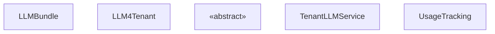
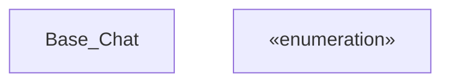
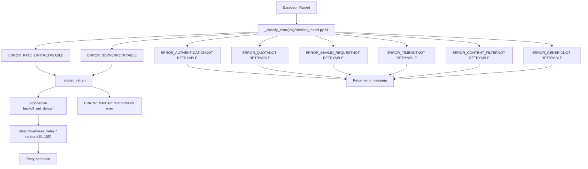
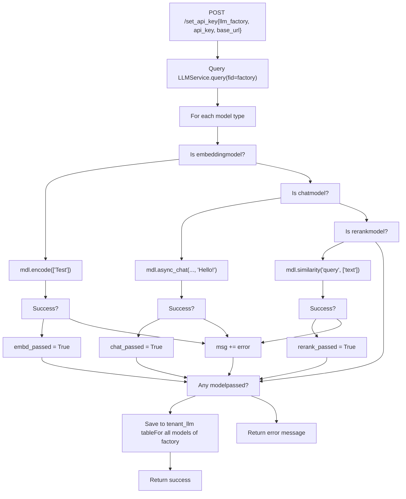

# LLM 集成系统 (LLM Integration System)

相关源文件：

-   [README.md](https://github.com/infiniflow/ragflow/blob/80a16e71/README.md)
-   [README_id.md](https://github.com/infiniflow/ragflow/blob/80a16e71/README_id.md)
-   [README_ja.md](https://github.com/infiniflow/ragflow/blob/80a16e71/README_ja.md)
-   [README_ko.md](https://github.com/infiniflow/ragflow/blob/80a16e71/README_ko.md)
-   [README_pt_br.md](https://github.com/infiniflow/ragflow/blob/80a16e71/README_pt_br.md)
-   [README_tzh.md](https://github.com/infiniflow/ragflow/blob/80a16e71/README_tzh.md)
-   [README_zh.md](https://github.com/infiniflow/ragflow/blob/80a16e71/README_zh.md)
-   [api/apps/llm_app.py](https://github.com/infiniflow/ragflow/blob/80a16e71/api/apps/llm_app.py)
-   [api/db/init_data.py](https://github.com/infiniflow/ragflow/blob/80a16e71/api/db/init_data.py)
-   [api/db/services/llm_service.py](https://github.com/infiniflow/ragflow/blob/80a16e71/api/db/services/llm_service.py)
-   [conf/llm_factories.json](https://github.com/infiniflow/ragflow/blob/80a16e71/conf/llm_factories.json)
-   [docker/.env](https://github.com/infiniflow/ragflow/blob/80a16e71/docker/.env)
-   [docker/README.md](https://github.com/infiniflow/ragflow/blob/80a16e71/docker/README.md)
-   [docs/configurations.md](https://github.com/infiniflow/ragflow/blob/80a16e71/docs/configurations.md)
-   [docs/guides/manage_files.md](https://github.com/infiniflow/ragflow/blob/80a16e71/docs/guides/manage_files.md)
-   [docs/guides/upgrade_ragflow.mdx](https://github.com/infiniflow/ragflow/blob/80a16e71/docs/guides/upgrade_ragflow.mdx)
-   [docs/quickstart.mdx](https://github.com/infiniflow/ragflow/blob/80a16e71/docs/quickstart.mdx)
-   [docs/references/supported_models.mdx](https://github.com/infiniflow/ragflow/blob/80a16e71/docs/references/supported_models.mdx)
-   [rag/llm/__init__.py](https://github.com/infiniflow/ragflow/blob/80a16e71/rag/llm/__init__.py)
-   [rag/llm/chat_model.py](https://github.com/infiniflow/ragflow/blob/80a16e71/rag/llm/chat_model.py)
-   [rag/llm/cv_model.py](https://github.com/infiniflow/ragflow/blob/80a16e71/rag/llm/cv_model.py)
-   [rag/llm/embedding_model.py](https://github.com/infiniflow/ragflow/blob/80a16e71/rag/llm/embedding_model.py)
-   [rag/llm/rerank_model.py](https://github.com/infiniflow/ragflow/blob/80a16e71/rag/llm/rerank_model.py)
-   [rag/llm/sequence2txt_model.py](https://github.com/infiniflow/ragflow/blob/80a16e71/rag/llm/sequence2txt_model.py)
-   [rag/llm/tts_model.py](https://github.com/infiniflow/ragflow/blob/80a16e71/rag/llm/tts_model.py)
-   [web/src/assets/svg/llm/n1n.svg](https://github.com/infiniflow/ragflow/blob/80a16e71/web/src/assets/svg/llm/n1n.svg)
-   [web/src/constants/llm.ts](https://github.com/infiniflow/ragflow/blob/80a16e71/web/src/constants/llm.ts)
-   [web/src/pages/user-setting/setting-model/constant.ts](https://github.com/infiniflow/ragflow/blob/80a16e71/web/src/pages/user-setting/setting-model/constant.ts)
-   [web/src/utils/common-util.ts](https://github.com/infiniflow/ragflow/blob/80a16e71/web/src/utils/common-util.ts)

## 目的与范围 (Purpose and Scope)

LLM 集成系统提供了一个统一的抽象层，用于将多个 AI 模型提供商集成到 RAGFlow 中。该系统使平台能够通过一致的界面支持 10 多个 LLM 提供商，涵盖 6 种模型类型（聊天、嵌入、重排序、文本转语音、语音转文本和视觉）。系统负责处理特定提供商的身份验证、错误处理、重试逻辑、Token 使用跟踪以及可观测性集成。

本文档涵盖核心抽象层、模型注册系统和提供商集成模式。有关以下方面的信息：

-   在对话式 AI 工作流中使用 LLM：参见 [检索与 RAG 系统 (Retrieval and RAG System)](/zh/10-retrieval-and-rag-system)
-   在智能体工作流中使用 LLM：参见 [智能体与工作流系统 (Agent and Workflow System)](/zh/9-agent-and-workflow-system)
-   管理 LLM 配置的 API 端点：参见 [后端 API 系统 (Backend API System)](/zh/8-backend-api-system)

---

## 系统架构概览 (System Architecture Overview)

LLM 集成系统采用分层架构，其核心是动态模型注册：

### 架构图

```mermaid
flowchart TD
    DialogService["DialogService(Conversational AI)"]
    CanvasService["Canvas(Agent Workflows)"]
    TaskExecutor["TaskExecutor(Document Processing)"]
    LLMBundle["LLMBundleapi/db/services/llm_service.py:85"]
    TenantConfig["TenantLLMServiceTenant-specific configs"]
    UsageTracking["Usage Trackingincrease_usage()"]
    LangfuseInt["Langfuse IntegrationObservability"]
    ChatModelDict["ChatModel dictrag/llm/init.py:123"]
    EmbedModelDict["EmbeddingModel dictrag/llm/init.py:125"]
    RerankModelDict["RerankModel dictrag/llm/init.py:126"]
    CvModelDict["CvModel dictrag/llm/init.py:124"]
    Seq2txtModelDict["Seq2txtModel dictrag/llm/init.py:127"]
    TTSModelDict["TTSModel dictrag/llm/init.py:128"]
    OpenAIChat["OpenAIBase class"]
    QWenChat["QWenTongyi-Qianwen"]
    AnthropicChat["AnthropicClaude"]
    OllamaChat["OllamaLocal models"]
    LiteLLMBase["LiteLLMBaseGeneric wrapper"]
    ChatBase["chat_model.Baserag/llm/chat_model.py:64"]
    EmbedBase["embedding_model.Baserag/llm/embedding_model.py:37"]
    RerankBase["rerank_model.Baserag/llm/rerank_model.py:28"]

    DialogService --> LLMBundle
    CanvasService --> LLMBundle
    TaskExecutor --> LLMBundle
    LLMBundle --> TenantConfig
    LLMBundle --> UsageTracking
    LLMBundle --> LangfuseInt
    LLMBundle --> ChatModelDict
    LLMBundle --> EmbedModelDict
    LLMBundle --> RerankModelDict
    LLMBundle --> CvModelDict
    LLMBundle --> Seq2txtModelDict
    LLMBundle --> TTSModelDict
    ChatModelDict --> OpenAIChat
    ChatModelDict --> QWenChat
    ChatModelDict --> AnthropicChat
    ChatModelDict --> OllamaChat
    ChatModelDict --> LiteLLMBase
    OpenAIChat --> ChatBase
    QWenChat --> ChatBase
    AnthropicChat --> ChatBase
    EmbedModelDict --> EmbedBase
    RerankModelDict --> RerankBase
```


**数据源**：[rag/llm/__init__.py:1-183](https://github.com/infiniflow/ragflow/blob/80a16e71/rag/llm/__init__.py#L1-L183) [api/db/services/llm_service.py:85-397](https://github.com/infiniflow/ragflow/blob/80a16e71/api/db/services/llm_service.py#L85-L397) [rag/llm/chat_model.py:64-487](https://github.com/infiniflow/ragflow/blob/80a16e71/rag/llm/chat_model.py#L64-L487)

### 关键组件

| 组件 | 用途 | 位置 |
| --- | --- | --- |
| `LLMBundle` | 所有 LLM 操作的主要入口点，处理租户配置和使用跟踪 | [api/db/services/llm_service.py:85-397](https://github.com/infiniflow/ragflow/blob/80a16e71/api/db/services/llm_service.py#L85-L397) |
| 模型注册表 (Model Registries) | 将提供商名称映射到实现类的字典 | [rag/llm/__init__.py:123-128](https://github.com/infiniflow/ragflow/blob/80a16e71/rag/llm/__init__.py#L123-L128) |
| 基类 (Base Classes) | 定义模型类型接口的抽象基类 | [rag/llm/chat_model.py:64](https://github.com/infiniflow/ragflow/blob/80a16e71/rag/llm/chat_model.py#L64-L64) [rag/llm/embedding_model.py:37](https://github.com/infiniflow/ragflow/blob/80a16e71/rag/llm/embedding_model.py#L37-L37) 等 |
| `TenantLLMService` | 管理每个租户的 API 密钥和模型偏好 | [api/db/services/tenant_llm_service.py](https://github.com/infiniflow/ragflow/blob/80a16e71/api/db/services/tenant_llm_service.py) |
| `LLMFactoriesService` | 维护可用提供商及其能力的注册表 | [api/db/services/tenant_llm_service.py](https://github.com/infiniflow/ragflow/blob/80a16e71/api/db/services/tenant_llm_service.py) |

---

## 动态模型注册系统 (Dynamic Model Registration System)

系统使用基于反射的方法，在模块导入时自动发现并注册模型实现。

### 注册过程

> **[Mermaid sequence]**
> *(图表结构无法解析)*

**数据源**：[rag/llm/__init__.py:132-172](https://github.com/infiniflow/ragflow/blob/80a16e71/rag/llm/__init__.py#L132-L172)

### 工厂名称属性 (Factory Name Attribute)

每个模型实现类都声明一个 `_FACTORY_NAME` 属性来标识其提供商。对于具有多个标识符的提供商，该属性可以是单个字符串或字符串列表。

**来自 chat_model.py 的示例**：

```python
class XinferenceChat(Base):
    _FACTORY_NAME = "Xinference"

class OpenAI_APIChat(Base):
    _FACTORY_NAME = ["VLLM", "OpenAI-API-Compatible"]
```
**数据源**：[rag/llm/chat_model.py:490-743](https://github.com/infiniflow/ragflow/blob/80a16e71/rag/llm/chat_model.py#L490-L743)

### 模块映射 (Module Mapping)

注册系统通过 `MODULE_MAPPING` 字典处理六种模型类型：

| 模块文件 | 注册字典 | 用途 |
| --- | --- | --- |
| `chat_model.py` | `ChatModel` | 对话式文本生成 |
| `embedding_model.py` | `EmbeddingModel` | 文本向量化 |
| `rerank_model.py` | `RerankModel` | 按相关性对结果重新排序 |
| `cv_model.py` | `CvModel` | 图像转文本 (视觉) 模型 |
| `sequence2txt_model.py` | `Seq2txtModel` | 语音转文本 (ASR) |
| `tts_model.py` | `TTSModel` | 文本转语音合成 |

**数据源**：[rag/llm/__init__.py:132-141](https://github.com/infiniflow/ragflow/blob/80a16e71/rag/llm/__init__.py#L132-L141)

---

## LLMBundle 抽象层 (LLMBundle Abstraction Layer)

`LLMBundle` 为所有 LLM 操作提供主要接口，屏蔽了特定提供商的细节，同时添加了使用跟踪和可观测性等横切关注点。

### LLMBundle 类层级


**数据源**：[api/db/services/llm_service.py:85-397](https://github.com/infiniflow/ragflow/blob/80a16e71/api/db/services/llm_service.py#L85-L397) [api/db/services/tenant_llm_service.py:1-382](https://github.com/infiniflow/ragflow/blob/80a16e71/api/db/services/tenant_llm_service.py#L1-L382)

### 核心操作

#### 文本嵌入 (Text Embedding)

[api/db/services/llm_service.py:95-118](https://github.com/infiniflow/ragflow/blob/80a16e71/api/db/services/llm_service.py#L95-L118) - `encode()` 方法处理批量文本嵌入，具有自动截断至模型最大长度的功能及使用跟踪。

```text
流程：文本 → 必要时截断 → mdl.encode() → 更新用量 → 返回嵌入向量
```

#### 聊天生成 (Chat Generation)

[api/db/services/llm_service.py:281-397](https://github.com/infiniflow/ragflow/blob/80a16e71/api/db/services/llm_service.py#L281-L397) - 支持同步 (`async_chat`) 和流式 (`async_chat_streamly`) 生成，并具备工具调用 (tool calling) 能力。

```text
流程：历史记录 → 绑定工具 → mdl.async_chat() → 移除推理过程 → 更新用量 → 返回响应
```

#### 重排序 (Reranking)

[api/db/services/llm_service.py:135-147](https://github.com/infiniflow/ragflow/blob/80a16e71/api/db/services/llm_service.py#L135-L147) - `similarity()` 方法根据查询对文档进行评分，用于相关性排序。

#### 视觉/语音/TTS

其他方法处理多模态操作：

-   `describe()` / `describe_with_prompt()` - [api/db/services/llm_service.py:149-175](https://github.com/infiniflow/ragflow/blob/80a16e71/api/db/services/llm_service.py#L149-L175)
-   `transcription()` / `stream_transcription()` - [api/db/services/llm_service.py:177-251](https://github.com/infiniflow/ragflow/blob/80a16e71/api/db/services/llm_service.py#L177-L251)
-   `tts()` - [api/db/services/llm_service.py:253-265](https://github.com/infiniflow/ragflow/blob/80a16e71/api/db/services/llm_service.py#L253-L265)

**数据源**：[api/db/services/llm_service.py:85-397](https://github.com/infiniflow/ragflow/blob/80a16e71/api/db/services/llm_service.py#L85-L397)

---

## 模型类型接口 (Model Type Interfaces)

每种模型类型通过其基类定义了一致的接口。所有提供商实现必须符合此接口。

### 聊天模型接口 (Chat Model Interface)


**数据源**：[rag/llm/chat_model.py:64-487](https://github.com/infiniflow/ragflow/blob/80a16e71/rag/llm/chat_model.py#L64-L487)

### 关键方法

| 方法 | 用途 | 返回类型 |
| --- | --- | --- |
| `async_chat()` | 非流式聊天补全 | `tuple[str, int]` (响应, tokens) |
| `async_chat_streamly()` | 流式聊天补全 | `AsyncGenerator[str, None]` |
| `async_chat_with_tools()` | 支持工具调用的聊天 | `tuple[str, int]` |
| `bind_tools()` | 为函数调用注册工具 | `None` |

### 嵌入模型接口 (Embedding Model Interface)

[rag/llm/embedding_model.py:37-51](https://github.com/infiniflow/ragflow/blob/80a16e71/rag/llm/embedding_model.py#L37-L51) - 嵌入模型实现：

-   `encode(texts: list)` → `tuple[np.ndarray, int]` - 批量嵌入生成
-   `encode_queries(text: str)` → `tuple[np.ndarray, int]` - 使用针对查询优化的参数进行单条查询嵌入

### 重排序模型接口 (Rerank Model Interface)

[rag/llm/rerank_model.py:28-37](https://github.com/infiniflow/ragflow/blob/80a16e71/rag/llm/rerank_model.py#L28-L37) - 重排序模型实现：

-   `similarity(query: str, texts: list)` → `tuple[np.ndarray, int]` - 返回相关性评分数组和 Token 计数

### 视觉模型接口 (Vision Model Interface)

[rag/llm/cv_model.py:39-184](https://github.com/infiniflow/ragflow/blob/80a16e71/rag/llm/cv_model.py#L39-L184) - 视觉模型实现：

-   `describe(image)` → `tuple[str, int]` - 生成图像描述
-   `describe_with_prompt(image, prompt)` → `tuple[str, int]` - 引导式图像描述
-   `async_chat()` / `async_chat_streamly()` - 支持文本+图像的多模态输入

### 语音转文本接口 (Speech-to-Text Interface)

[rag/llm/sequence2txt_model.py:31-50](https://github.com/infiniflow/ragflow/blob/80a16e71/rag/llm/sequence2txt_model.py#L31-L50) - ASR 模型实现：

-   `transcription(audio_path)` → `tuple[str, int]` - 语音转文本转换
-   `stream_transcription(audio_path)` (可选) - 流式转录

### 文本转语音接口 (Text-to-Speech Interface)

[rag/llm/tts_model.py:65-78](https://github.com/infiniflow/ragflow/blob/80a16e71/rag/llm/tts_model.py#L65-L78) - TTS 模型实现：

-   `tts(text: str)` → `Generator[bytes|int, None, None]` - 产出音频块及最终 Token 计数

---

## 错误处理与重试逻辑 (Error Handling and Retry Logic)

系统实现了精细的错误分类和选择性重试机制，以平稳处理提供商特有的故障。

### 错误分类系统


**数据源**：[rag/llm/chat_model.py:39-51](https://github.com/infiniflow/ragflow/blob/80a16e71/rag/llm/chat_model.py#L39-L51) [rag/llm/chat_model.py:81-100](https://github.com/infiniflow/ragflow/blob/80a16e71/rag/llm/chat_model.py#L81-L100) [rag/llm/chat_model.py:203-243](https://github.com/infiniflow/ragflow/blob/80a16e71/rag/llm/chat_model.py#L203-L243)

### 错误分类实现

`_classify_error()` 方法通过对错误消息字符串进行关键词匹配来对故障进行分类：

[rag/llm/chat_model.py:81-100](https://github.com/infiniflow/ragflow/blob/80a16e71/rag/llm/chat_model.py#L81-L100) - 错误消息被转换为小写并与预定义的关键词集进行匹配：

| 错误代码 | 关键词 | 可重试 |
| --- | --- | --- |
| `ERROR_RATE_LIMIT` | rate limit, 429, tpm limit, too many requests | ✓ |
| `ERROR_SERVER` | server, 503, 502, 504, 500, unavailable | ✓ |
| `ERROR_AUTHENTICATION` | auth, key, apikey, 401, forbidden | ✗ |
| `ERROR_QUOTA` | quota, capacity, credit, billing, balance | ✗ |
| `ERROR_INVALID_REQUEST` | invalid, bad request, 400, format, malformed | ✗ |
| `ERROR_TIMEOUT` | timeout, timed out | ✗ |
| `ERROR_CONNECTION` | connect, network, unreachable, dns | ✗ |
| `ERROR_CONTENT_FILTER` | filter, content, policy, blocked, safety | ✗ |
| `ERROR_MODEL` | model, not found, does not exist | ✗ |

**数据源**：[rag/llm/chat_model.py:84-99](https://github.com/infiniflow/ragflow/blob/80a16e71/rag/llm/chat_model.py#L84-L99)

### 重试策略 (Retry Strategy)

[rag/llm/chat_model.py:78-79](https://github.com/infiniflow/ragflow/blob/80a16e71/rag/llm/chat_model.py#L78-L79) - 重试参数可通过环境变量配置：

-   `LLM_MAX_RETRIES` (默认值: 5) - 最大重试次数
-   `LLM_BASE_DELAY` (默认值: 2.0) - 基础延迟时间（秒）

[rag/llm/chat_model.py:78-79](https://github.com/infiniflow/ragflow/blob/80a16e71/rag/llm/chat_model.py#L78-L79) - 延迟计算使用随机指数退避：

```python
delay = base_delay * random.uniform(10, 150)
```
在默认设置下，这会产生 20-300 秒之间的延迟，防止出现惊群效应 (thundering herd) 问题。

### 同步 vs 异步错误处理

系统为同步和异步上下文提供了并行实现：

-   `_exceptions()` [rag/llm/chat_model.py:212-227](https://github.com/infiniflow/ragflow/blob/80a16e71/rag/llm/chat_model.py#L212-L227) - 在同步操作中使用 `time.sleep()`
-   `_exceptions_async()` [rag/llm/chat_model.py:229-243](https://github.com/infiniflow/ragflow/blob/80a16e71/rag/llm/chat_model.py#L229-L243) - 在异步操作中使用 `asyncio.sleep()`

两者都返回 `None` 以发出重试信号，或者返回一个错误消息字符串以停止操作。

**数据源**：[rag/llm/chat_model.py:64-487](https://github.com/infiniflow/ragflow/blob/80a16e71/rag/llm/chat_model.py#L64-L487)

---

## 提供商实现模式 (Provider Implementation Patterns)

系统通过三种实现模式支持提供商，为不同的 API 风格提供灵活性。

### 模式 1：OpenAI 兼容基类

许多提供商遵循 OpenAI API 规范。这些实现继承自一个通用的 `Base` 类，该类使用 `openai` Python 客户端。


**示例**：

-   `XinferenceChat` [rag/llm/chat_model.py:489-497](https://github.com/infiniflow/ragflow/blob/80a16e71/rag/llm/chat_model.py#L489-L497) - 在基础 URL 后追加 `/v1`
-   `HuggingFaceChat` [rag/llm/chat_model.py:499-507](https://github.com/infiniflow/ragflow/blob/80a16e71/rag/llm/chat_model.py#L499-L507) - 去除模型名称后缀 `___`
-   `OpenAI_APIChat` [rag/llm/chat_model.py:735-743](https://github.com/infiniflow/ragflow/blob/80a16e71/rag/llm/chat_model.py#L735-L743) - 处理多个工厂名称
-   `LmStudioChat` [rag/llm/chat_model.py:723-733](https://github.com/infiniflow/ragflow/blob/80a16e71/rag/llm/chat_model.py#L723-L733) - 使用固定的 API 密钥 "lm-studio"

**数据源**：[rag/llm/chat_model.py:64-136](https://github.com/infiniflow/ragflow/blob/80a16e71/rag/llm/chat_model.py#L64-L136) [rag/llm/chat_model.py:489-743](https://github.com/infiniflow/ragflow/blob/80a16e71/rag/llm/chat_model.py#L489-L743)

### 模式 2：提供商特定的客户端库

某些提供商需要使用自己的客户端库，这些库具有独特的身份验证或 API 模式。

**示例**：

-   **Mistral**: 使用 `mistralai.client.MistralClient` [rag/llm/chat_model.py:669-721](https://github.com/infiniflow/ragflow/blob/80a16e71/rag/llm/chat_model.py#L669-L721)
-   **Replicate**: 使用 `replicate.client.Client` [rag/llm/chat_model.py:754-793](https://github.com/infiniflow/ragflow/blob/80a16e71/rag/llm/chat_model.py#L754-L793)
-   **Tencent Hunyuan**: 使用 `tencentcloud.hunyuan` SDK [rag/llm/chat_model.py:795-871](https://github.com/infiniflow/ragflow/blob/80a16e71/rag/llm/chat_model.py#L795-L871)
-   **BaiduYiyan**: 使用 `qianfan.ChatCompletion` [rag/llm/chat_model.py:895-1003](https://github.com/infiniflow/ragflow/blob/80a16e71/rag/llm/chat_model.py#L895-L1003)
-   **XunFei Spark**: 使用基于 WebSocket 的协议 [rag/llm/chat_model.py:873-893](https://github.com/infiniflow/ragflow/blob/80a16e71/rag/llm/chat_model.py#L873-L893)

这些实现通过覆盖 `_clean_conf()` 等方法来适配参数命名约定。

**数据源**：[rag/llm/chat_model.py:669-1003](https://github.com/infiniflow/ragflow/blob/80a16e71/rag/llm/chat_model.py#L669-L1003)

### 模式 3：特殊的身份验证处理

某些提供商需要将多个参数组装成 JSON 结构的身份验证方式：

**火山引擎 (VolcEngine)** [rag/llm/chat_model.py:654-667](https://github.com/infiniflow/ragflow/blob/80a16e71/rag/llm/chat_model.py#L654-L667)：

```python
ark_api_key = json.loads(key).get("ark_api_key", "")
model_name = json.loads(key).get("ep_id", "") + json.loads(key).get("endpoint_id", "")
```

**Bedrock** [rag/llm/embedding_model.py:461-503](https://github.com/infiniflow/ragflow/blob/80a16e71/rag/llm/embedding_model.py#L461-L503)：

-   支持三种认证模式：`access_key_secret`, `iam_role`, `assume_role`
-   从 JSON 密钥中解析区域和凭据
-   使用 `boto3.client("bedrock-runtime")`

**Azure OpenAI** [rag/llm/embedding_model.py:153-162](https://github.com/infiniflow/ragflow/blob/80a16e71/rag/llm/embedding_model.py#L153-L162)：

```python
api_key = json.loads(key).get("api_key", "")
api_version = json.loads(key).get("api_version", "2024-02-01")
self.client = AzureOpenAI(api_key=api_key, azure_endpoint=base_url, api_version=api_version)
```
**数据源**：[rag/llm/chat_model.py:654-667](https://github.com/infiniflow/ragflow/blob/80a16e71/rag/llm/chat_model.py#L654-L667) [rag/llm/embedding_model.py:153-162](https://github.com/infiniflow/ragflow/blob/80a16e71/rag/llm/embedding_model.py#L153-L162) [rag/llm/embedding_model.py:461-503](https://github.com/infiniflow/ragflow/blob/80a16e71/rag/llm/embedding_model.py#L461-L503)

### 配置清洗 (Configuration Cleaning)

不同提供商支持的参数不同。`_clean_conf()` 方法用于过滤生成配置：

[rag/llm/chat_model.py:102-136](https://github.com/infiniflow/ragflow/blob/80a16e71/rag/llm/chat_model.py#L102-L136) - 基础实现允许标准的 OpenAI 参数：

```python
allowed_conf = {
    "temperature", "max_completion_tokens", "top_p", "stream",
    "stop", "presence_penalty", "frequency_penalty",
    "functions", "tools", "tool_choice", "response_format"
}
```
特殊情况：

-   GPT-5 模型：清除所有自定义参数 [rag/llm/chat_model.py:133-134](https://github.com/infiniflow/ragflow/blob/80a16e71/rag/llm/chat_model.py#L133-L134)
-   百川 (BaiChuan)：仅允许 `temperature` 和 `top_p` [rag/llm/chat_model.py:534-538](https://github.com/infiniflow/ragflow/blob/80a16e71/rag/llm/chat_model.py#L534-L538)
-   Mistral：允许 `temperature`, `top_p`, `max_tokens` [rag/llm/chat_model.py:680-684](https://github.com/infiniflow/ragflow/blob/80a16e71/rag/llm/chat_model.py#L680-L684)

**数据源**：[rag/llm/chat_model.py:102-136](https://github.com/infiniflow/ragflow/blob/80a16e71/rag/llm/chat_model.py#L102-L136)

---

## 租户配置与 API 密钥管理 (Tenant Configuration and API Key Management)

系统管理每个租户的 LLM 配置，允许不同用户使用不同的提供商和模型，并使用各自的 API 密钥。

### 配置数据流

> **[Mermaid sequence]**
> *(图表结构无法解析)*

**数据源**：[api/db/services/llm_service.py:85-94](https://github.com/infiniflow/ragflow/blob/80a16e71/api/db/services/llm_service.py#L85-L94) [api/db/services/tenant_llm_service.py:138-243](https://github.com/infiniflow/ragflow/blob/80a16e71/api/db/services/tenant_llm_service.py#L138-L243)

### 数据库模式

系统使用两个主要表：

**llm_factories** [api/db/db_models.py](https://github.com/infiniflow/ragflow/blob/80a16e71/api/db/db_models.py) - 存储提供商元数据：

-   `name` - 提供商标识符（如 "OpenAI", "Anthropic"）
-   `logo` - 提供商 Logo URL
-   `tags` - 逗号分隔的能力（如 "LLM,TEXT EMBEDDING,TTS"）
-   `status` - 有效性状态
-   `rank` - 显示排序

**tenant_llm** [api/db/db_models.py](https://github.com/infiniflow/ragflow/blob/80a16e71/api/db/db_models.py) - 存储租户特定的配置：

-   `tenant_id` - 用户/租户标识符
-   `llm_factory` - 提供商名称（外键关联 llm_factories）
-   `llm_name` - 具体模型名称
-   `model_type` - 模型类型（chat, embedding, rerank 等）
-   `api_key` - 加密的 API 凭据
-   `api_base` - 自定义基础 URL（可选）
-   `max_tokens` - 模型上下文窗口大小
-   `used_tokens` - 累积 Token 使用计数器

### API 密钥校验

[api/apps/llm_app.py:58-125](https://github.com/infiniflow/ragflow/blob/80a16e71/api/apps/llm_app.py#L58-L125) - `/set_api_key` 端点在保存前校验凭据：


**数据源**：[api/apps/llm_app.py:58-125](https://github.com/infiniflow/ragflow/blob/80a16e71/api/apps/llm_app.py#L58-L125)

### 默认配置初始化

[api/db/init_data.py:36-93](https://github.com/infiniflow/ragflow/blob/80a16e71/api/db/init_data.py#L36-L93) - 创建新租户时，系统从环境设置中初始化默认 LLM 配置：

```python
model_configs = {
    LLMType.CHAT: settings.CHAT_CFG,
    LLMType.EMBEDDING: settings.EMBEDDING_CFG,
    LLMType.SPEECH2TEXT: settings.ASR_CFG,
    LLMType.IMAGE2TEXT: settings.IMAGE2TEXT_CFG,
    LLMType.RERANK: settings.RERANK_CFG,
}
```
这些设置来自 `conf/service_conf.yaml`，提供系统级的默认值，用户可以进行覆盖。

**数据源**：[api/db/init_data.py:36-93](https://github.com/infiniflow/ragflow/blob/80a16e71/api/db/init_data.py#L36-L93) [api/db/services/llm_service.py:36-82](https://github.com/infiniflow/ragflow/blob/80a16e71/api/db/services/llm_service.py#L36-L82)

---

## 使用跟踪与可观测性 (Usage Tracking and Observability)

系统跟踪每个租户的 Token 使用情况，并可选地集成 Langfuse 以实现 LLM 可观测性。

### 使用跟踪流

> **[Mermaid sequence]**
> *(图表结构无法解析)*

**数据源**：[api/db/services/llm_service.py:95-118](https://github.com/infiniflow/ragflow/blob/80a16e71/api/db/services/llm_service.py#L95-L118) [api/db/services/tenant_llm_service.py](https://github.com/infiniflow/ragflow/blob/80a16e71/api/db/services/tenant_llm_service.py)

### 使用跟踪实现

每个 `LLMBundle` 操作在完成后都会调用 `TenantLLMService.increase_usage()`：

| 方法 | 跟踪调用 | 位置 |
| --- | --- | --- |
| `encode()` | `increase_usage(tenant_id, EMBEDDING, tokens, llm_name)` | [api/db/services/llm_service.py:111-112](https://github.com/infiniflow/ragflow/blob/80a16e71/api/db/services/llm_service.py#L111-L112) |
| `encode_queries()` | `increase_usage(tenant_id, EMBEDDING, tokens, llm_name)` | [api/db/services/llm_service.py:126-127](https://github.com/infiniflow/ragflow/blob/80a16e71/api/db/services/llm_service.py#L126-L127) |
| `similarity()` | `increase_usage(tenant_id, RERANK, tokens)` | [api/db/services/llm_service.py:140-141](https://github.com/infiniflow/ragflow/blob/80a16e71/api/db/services/llm_service.py#L140-L141) |
| `describe()` | `increase_usage(tenant_id, IMAGE2TEXT, tokens)` | [api/db/services/llm_service.py:154-155](https://github.com/infiniflow/ragflow/blob/80a16e71/api/db/services/llm_service.py#L154-L155) |
| `transcription()` | `increase_usage(tenant_id, SEQUENCE2TXT, tokens)` | [api/db/services/llm_service.py:182-183](https://github.com/infiniflow/ragflow/blob/80a16e71/api/db/services/llm_service.py#L182-L183) |
| `tts()` | `increase_usage(tenant_id, TTS, tokens, llm_name)` | [api/db/services/llm_service.py:259-260](https://github.com/infiniflow/ragflow/blob/80a16e71/api/db/services/llm_service.py#L259-L260) |
| `async_chat()` | `increase_usage(tenant_id, CHAT, tokens)` | [api/db/services/llm_service.py:340-341](https://github.com/infiniflow/ragflow/blob/80a16e71/api/db/services/llm_service.py#L340-L341) |
| `async_chat_streamly()` | `increase_usage(tenant_id, CHAT, tokens)` | [api/db/services/llm_service.py:376-377](https://github.com/infiniflow/ragflow/blob/80a16e71/api/db/services/llm_service.py#L376-L377) |

**数据源**：[api/db/services/llm_service.py:85-397](https://github.com/infiniflow/ragflow/blob/80a16e71/api/db/services/llm_service.py#L85-L397)

### Langfuse 集成

[api/db/services/tenant_llm_service.py:196-243](https://github.com/infiniflow/ragflow/blob/80a16e71/api/db/services/tenant_llm_service.py#L196-L243) - `LLM4Tenant` 基类条件性地启用 Langfuse 追踪：

```python
if settings.LANGFUSE_PUBLIC_KEY:
    from langfuse import Langfuse
    self.langfuse = Langfuse(
        public_key=settings.LANGFUSE_PUBLIC_KEY,
        secret_key=settings.LANGFUSE_SECRET_KEY,
        host=settings.LANGFUSE_HOST
    )
```
启用后，`LLMBundle` 会使用生成追踪包裹各项操作。这将捕获模型名称、操作类型、输入参数、输出结果、Token 用量以及延迟耗时等信息。

**数据源**：[api/db/services/tenant_llm_service.py:196-243](https://github.com/infiniflow/ragflow/blob/80a16e71/api/db/services/tenant_llm_service.py#L196-L243) [api/db/services/llm_service.py:96-117](https://github.com/infiniflow/ragflow/blob/80a16e71/api/db/services/llm_service.py#L96-L117)

---

## 工具调用与函数执行 (Tool Calling and Function Execution)

聊天模型支持工具调用（函数调用），以实现智能体工作流，使 LLM 能够调用外部函数。

### 工具调用架构

> **[Mermaid sequence]**
> *(图表结构无法解析)*

**数据源**：[rag/llm/chat_model.py:272-331](https://github.com/infiniflow/ragflow/blob/80a16e71/rag/llm/chat_model.py#L272-L331) [rag/llm/chat_model.py:333-442](https://github.com/infiniflow/ragflow/blob/80a16e71/rag/llm/chat_model.py#L333-L442)

### 工具绑定 (Tool Binding)

[rag/llm/chat_model.py:272-277](https://github.com/infiniflow/ragflow/blob/80a16e71/rag/llm/chat_model.py#L272-L277) - 工具在聊天操作前进行绑定。`tools` 参数遵循 OpenAI 的函数调用模式。

### 执行循环

[rag/llm/chat_model.py:279-331](https://github.com/infiniflow/ragflow/blob/80a16e71/rag/llm/chat_model.py#L279-L331) - `async_chat_with_tools()` 方法实现多轮工具调用：

1.  **发送带有工具的请求**：包含 `tools` 参数并将 `tool_choice` 设为 `"auto"`。
2.  **检查响应**：如果存在 `tool_calls`，则继续步骤 3；否则返回最终回答。
3.  **执行工具**：对于每个工具调用，解析函数名和参数，调用 `tool_call()`，并将包含工具调用的助手消息及包含结果的工具消息追加到历史记录中。
4.  **重复**：继续循环，最多执行 `max_rounds` 次。
5.  **强制完成**：如果超过最大轮数，追加错误消息并强制返回最终响应。

### 流式工具调用

[rag/llm/chat_model.py:333-442](https://github.com/infiniflow/ragflow/blob/80a16e71/rag/llm/chat_model.py#L333-L442) - `async_chat_streamly_with_tools()` 变体支持实时流式传输，能够从流中累积工具调用增量，产出详细的工具使用消息，并支持带有 `<think>` 标签的推理内容（如 QwQ 模型）。

### 历史管理

[rag/llm/chat_model.py:248-270](https://github.com/infiniflow/ragflow/blob/80a16e71/rag/llm/chat_model.py#L248-L270) - `_append_history()` 方法负责维护对话上下文及工具调用结果。

**数据源**：[rag/llm/chat_model.py:245-442](https://github.com/infiniflow/ragflow/blob/80a16e71/rag/llm/chat_model.py#L245-L442)

---

## 提供商配置参考 (Provider Configuration Reference)

系统从 `conf/llm_factories.json` 加载提供商和模型定义，该文件在系统启动期间被初始化到数据库中。

### 工厂配置结构

[conf/llm_factories.json:1-199](https://github.com/infiniflow/ragflow/blob/80a16e71/conf/llm_factories.json#L1-L199) - 每个工厂条目定义：

-   `name`: 工厂标识符，与代码中的 `_FACTORY_NAME` 匹配
-   `tags`: 逗号分隔的能力 (LLM, TEXT EMBEDDING 等)
-   `status`: "1" 表示启用，"0" 表示禁用
-   `rank`: 显示排序优先级（越高越靠前）
-   `llm[].llm_name`: 具体模型标识符
-   `llm[].max_tokens`: 上下文窗口大小
-   `llm[].model_type`: chat, embedding, rerank, image2text, speech2text, tts, ocr 之一
-   `llm[].is_tools`: 模型是否支持函数调用

**数据源**：[conf/llm_factories.json:1-20000](https://github.com/infiniflow/ragflow/blob/80a16e71/conf/llm_factories.json#L1-L20000)

### 支持的提供商概览

下表总结了主要提供商及其支持的模型类型：

| 提供商 | 聊天 | 嵌入 | 重排序 | 视觉 | ASR | TTS | 工厂类位置 |
| --- | --- | --- | --- | --- | --- | --- | --- |
| OpenAI | ✓ | ✓ | ✗ | ✓ | ✓ | ✓ | [rag/llm/chat_model.py:64-136](https://github.com/infiniflow/ragflow/blob/80a16e71/rag/llm/chat_model.py#L64-L136) |
| Anthropic | ✓ | ✗ | ✗ | ✗ | ✗ | ✗ | 通过 LiteLLM |
| 通义千问 | ✓ | ✓ | ✓ | ✓ | ✓ | ✓ | [rag/llm/chat_model.py:1005-1139](https://github.com/infiniflow/ragflow/blob/80a16e71/rag/llm/chat_model.py#L1005-L1139) |
| 智谱 AI | ✓ | ✓ | ✗ | ✓ | ✗ | ✗ | [rag/llm/chat_model.py:1141-1272](https://github.com/infiniflow/ragflow/blob/80a16e71/rag/llm/chat_model.py#L1141-L1272) |
| Ollama | ✓ | ✓ | ✗ | ✓ | ✗ | ✗ | [rag/llm/chat_model.py:1448-1496](https://github.com/infiniflow/ragflow/blob/80a16e71/rag/llm/chat_model.py#L1448-L1496) |
| Xinference | ✓ | ✓ | ✓ | ✓ | ✓ | ✓ | [rag/llm/chat_model.py:489-497](https://github.com/infiniflow/ragflow/blob/80a16e71/rag/llm/chat_model.py#L489-L497) |
| Azure-OpenAI | ✓ | ✓ | ✗ | ✓ | ✓ | ✗ | [rag/llm/chat_model.py:1274-1313](https://github.com/infiniflow/ragflow/blob/80a16e71/rag/llm/chat_model.py#L1274-L1313) |
| Bedrock | ✓ | ✓ | ✗ | ✗ | ✗ | ✗ | [rag/llm/embedding_model.py:461-540](https://github.com/infiniflow/ragflow/blob/80a16e71/rag/llm/embedding_model.py#L461-L540) |
| Gemini | ✓ | ✓ | ✗ | ✓ | ✗ | ✗ | 通过 LiteLLM |
| Cohere | ✓ | ✓ | ✓ | ✓ | ✗ | ✗ | [rag/llm/embedding_model.py:645-671](https://github.com/infiniflow/ragflow/blob/80a16e71/rag/llm/embedding_model.py#L645-L671) |
| Jina | ✗ | ✓ | ✓ | ✗ | ✗ | ✗ | [rag/llm/embedding_model.py:354-409](https://github.com/infiniflow/ragflow/blob/80a16e71/rag/llm/embedding_model.py#L354-L409) |
| VLLM | ✓ | ✓ | ✓ | ✓ | ✗ | ✗ | [rag/llm/chat_model.py:735-743](https://github.com/infiniflow/ragflow/blob/80a16e71/rag/llm/chat_model.py#L735-L743) |

有关每个提供商支持的完整模型列表，请参阅 [docs/references/supported_models.mdx:1-82](https://github.com/infiniflow/ragflow/blob/80a16e71/docs/references/supported_models.mdx#L1-L82)。

**数据源**：[conf/llm_factories.json:1-20000](https://github.com/infiniflow/ragflow/blob/80a16e71/conf/llm_factories.json#L1-L20000) [docs/references/supported_models.mdx:1-82](https://github.com/infiniflow/ragflow/blob/80a16e71/docs/references/supported_models.mdx#L1-L82)

### 数据库初始化

[api/db/init_data.py:95-144](https://github.com/infiniflow/ragflow/blob/80a16e71/api/db/init_data.py#L95-L144) - `init_llm_factory()` 函数在启动时加载配置：

1.  删除现有的 `llm_factories` 条目。
2.  遍历从 JSON 加载的提供商信息。
3.  将工厂元数据插入 `llm_factories` 表。
4.  将单个模型插入 `llm` 表，并关联外键 `fid`。
5.  移除已弃用的工厂。
6.  使用新的解析器配置更新现有租户。

---

## LLM 管理 API 端点 (API Endpoints for LLM Management)

系统通过 `api/apps/llm_app.py` 模块提供用于管理 LLM 配置的 REST API。

### 端点摘要

| 端点 | 方法 | 用途 | 关键参数 |
| --- | --- | --- | --- |
| `/factories` | GET | 列出可用的 LLM 提供商 | 无 |
| `/set_api_key` | POST | 添加/更新提供商的 API 密钥 | `llm_factory`, `api_key`, `base_url` |
| `/add_llm` | POST | 添加特定的模型配置 | `llm_factory`, `llm_name`, `model_type`, `api_key`, `api_base` |
| `/delete_llm` | POST | 移除模型配置 | `llm_factory`, `llm_name` |
| `/enable_llm` | POST | 启用/禁用模型 | `llm_factory`, `llm_name`, `status` |
| `/delete_factory` | POST | 移除提供商的所有模型 | `llm_factory` |
| `/my_llms` | GET | 列出当前租户的 LLM 配置 | `include_details` (可选) |
| `/list` | GET | 列出所有可用模型及状态 | `model_type` (可选过滤) |

**数据源**：[api/apps/llm_app.py:1-407](https://github.com/infiniflow/ragflow/blob/80a16e71/api/apps/llm_app.py#L1-L407)

### 添加 LLM 端点 (Add LLM Endpoint)

[api/apps/llm_app.py:128-295](https://github.com/infiniflow/ragflow/blob/80a16e71/api/apps/llm_app.py#L128-L295) - 处理特定提供商的身份验证格式，如火山引擎的 `ark_api_key` 和 `endpoint_id` 组装，Bedrock 的多模式认证组装等。保存前会通过嵌入、聊天或重排序测试对模型进行校验。

---

## 前端集成 (Frontend Integration)

前端通过设置页面提供管理 LLM 配置的 UI。

### LLM 工厂常量

[web/src/constants/llm.ts:1-180](https://github.com/infiniflow/ragflow/blob/80a16e71/web/src/constants/llm.ts#L1-L180) - 定义了提供商标识符、图标映射和 API 文档链接等元数据。

### 模型配置 UI

位于 `/user-setting/setting-model` 的设置界面允许用户：
1.  查看可用提供商。
2.  添加 API 密钥或特定模型。
3.  查看已配置的模型及 Token 用量。
4.  启用、禁用或删除配置。

**数据源**：[web/src/constants/llm.ts:1-180](https://github.com/infiniflow/ragflow/blob/80a16e71/web/src/constants/llm.ts#L1-L180) [web/src/pages/user-setting/setting-model](https://github.com/infiniflow/ragflow/blob/80a16e71/web/src/pages/user-setting/setting-model)

---

## 总结 (Summary)

LLM 集成系统提供了一个全面的抽象层，支持 10 多个提供商和 6 种模型类型。其关键特性包括：

-   **架构**：通过反射实现动态模型注册，`LLMBundle` 提供统一接口，特定提供商实现继承自基类。
-   **能力**：支持带有流式传输和工具调用的聊天生成，以及文本嵌入、重排序、视觉、ASR 和 TTS 等多模态能力。
-   **可靠性**：具有选择性重试的错误分类机制，使用带抖动的指数退避，且重试限制和延迟可配置。
-   **多租户**：支持租户特定的 API 密钥和配置，按租户和模型进行用量跟踪，并集成了 Langfuse 可观测性。
-   **可扩展性**：可以通过实现基类并指定 `_FACTORY_NAME` 轻松添加新提供商，并通过 JSON 文件和 API 端点进行运行时配置。
