# 文档处理流水线 (Document Processing Pipeline)

相关源文件：

-   [api/apps/chunk_app.py](https://github.com/infiniflow/ragflow/blob/80a16e71/api/apps/chunk_app.py)
-   [api/apps/conversation_app.py](https://github.com/infiniflow/ragflow/blob/80a16e71/api/apps/conversation_app.py)
-   [api/apps/document_app.py](https://github.com/infiniflow/ragflow/blob/80a16e71/api/apps/document_app.py)
-   [api/apps/file2document_app.py](https://github.com/infiniflow/ragflow/blob/80a16e71/api/apps/file2document_app.py)
-   [api/apps/file_app.py](https://github.com/infiniflow/ragflow/blob/80a16e71/api/apps/file_app.py)
-   [api/apps/kb_app.py](https://github.com/infiniflow/ragflow/blob/80a16e71/api/apps/kb_app.py)
-   [api/db/db_models.py](https://github.com/infiniflow/ragflow/blob/80a16e71/api/db/db_models.py)
-   [api/db/services/dialog_service.py](https://github.com/infiniflow/ragflow/blob/80a16e71/api/db/services/dialog_service.py)
-   [api/db/services/document_service.py](https://github.com/infiniflow/ragflow/blob/80a16e71/api/db/services/document_service.py)
-   [api/db/services/file_service.py](https://github.com/infiniflow/ragflow/blob/80a16e71/api/db/services/file_service.py)
-   [api/db/services/knowledgebase_service.py](https://github.com/infiniflow/ragflow/blob/80a16e71/api/db/services/knowledgebase_service.py)
-   [api/db/services/task_service.py](https://github.com/infiniflow/ragflow/blob/80a16e71/api/db/services/task_service.py)
-   [api/utils/file_utils.py](https://github.com/infiniflow/ragflow/blob/80a16e71/api/utils/file_utils.py)
-   [common/file_utils.py](https://github.com/infiniflow/ragflow/blob/80a16e71/common/file_utils.py)
-   [deepdoc/parser/excel_parser.py](https://github.com/infiniflow/ragflow/blob/80a16e71/deepdoc/parser/excel_parser.py)
-   [deepdoc/parser/pdf_parser.py](https://github.com/infiniflow/ragflow/blob/80a16e71/deepdoc/parser/pdf_parser.py)
-   [deepdoc/parser/ppt_parser.py](https://github.com/infiniflow/ragflow/blob/80a16e71/deepdoc/parser/ppt_parser.py)
-   [deepdoc/vision/__init__.py](https://github.com/infiniflow/ragflow/blob/80a16e71/deepdoc/vision/__init__.py)
-   [deepdoc/vision/layout_recognizer.py](https://github.com/infiniflow/ragflow/blob/80a16e71/deepdoc/vision/layout_recognizer.py)
-   [deepdoc/vision/ocr.py](https://github.com/infiniflow/ragflow/blob/80a16e71/deepdoc/vision/ocr.py)
-   [deepdoc/vision/operators.py](https://github.com/infiniflow/ragflow/blob/80a16e71/deepdoc/vision/operators.py)
-   [deepdoc/vision/postprocess.py](https://github.com/infiniflow/ragflow/blob/80a16e71/deepdoc/vision/postprocess.py)
-   [deepdoc/vision/recognizer.py](https://github.com/infiniflow/ragflow/blob/80a16e71/deepdoc/vision/recognizer.py)
-   [deepdoc/vision/t_ocr.py](https://github.com/infiniflow/ragflow/blob/80a16e71/deepdoc/vision/t_ocr.py)
-   [deepdoc/vision/t_recognizer.py](https://github.com/infiniflow/ragflow/blob/80a16e71/deepdoc/vision/t_recognizer.py)
-   [deepdoc/vision/table_structure_recognizer.py](https://github.com/infiniflow/ragflow/blob/80a16e71/deepdoc/vision/table_structure_recognizer.py)
-   [rag/app/book.py](https://github.com/infiniflow/ragflow/blob/80a16e71/rag/app/book.py)
-   [rag/app/laws.py](https://github.com/infiniflow/ragflow/blob/80a16e71/rag/app/laws.py)
-   [rag/app/manual.py](https://github.com/infiniflow/ragflow/blob/80a16e71/rag/app/manual.py)
-   [rag/app/naive.py](https://github.com/infiniflow/ragflow/blob/80a16e71/rag/app/naive.py)
-   [rag/app/one.py](https://github.com/infiniflow/ragflow/blob/80a16e71/rag/app/one.py)
-   [rag/app/paper.py](https://github.com/infiniflow/ragflow/blob/80a16e71/rag/app/paper.py)
-   [rag/app/presentation.py](https://github.com/infiniflow/ragflow/blob/80a16e71/rag/app/presentation.py)
-   [rag/app/qa.py](https://github.com/infiniflow/ragflow/blob/80a16e71/rag/app/qa.py)
-   [rag/app/table.py](https://github.com/infiniflow/ragflow/blob/80a16e71/rag/app/table.py)
-   [rag/nlp/__init__.py](https://github.com/infiniflow/ragflow/blob/80a16e71/rag/nlp/__init__.py)
-   [rag/nlp/search.py](https://github.com/infiniflow/ragflow/blob/80a16e71/rag/nlp/search.py)
-   [rag/settings.py](https://github.com/infiniflow/ragflow/blob/80a16e71/rag/settings.py)
-   [rag/svr/task_executor.py](https://github.com/infiniflow/ragflow/blob/80a16e71/rag/svr/task_executor.py)

## 目的与范围

文档处理流水线是核心子系统，负责将原始文档转化为可搜索且语义丰富的切片 (chunks)，为 RAGFlow 的检索能力提供动力。该流水线处理从初始文件上传、解析、切分、增强、嵌入 (embedding) 生成，到最终索引至文档存储的全过程。

本页面涵盖了完整的文档处理工作流，包括 12 种以上专门的解析策略、智能切分算法、基于 LLM 生成元数据的内容增强，以及异步任务执行系统。有关使用这些已处理切片的检索阶段的信息，请参阅 [检索与 RAG 系统 (Retrieval and RAG System)](/zh/10-retrieval-and-rag-system)。有关向流水线馈送文档的数据源连接器的详细信息，请参阅 [数据源集成 (Data Source Integration)](/zh/7-data-source-integration)。

---

## 架构概览

文档处理流水线作为一个异步的多阶段工作流运行，由任务执行器 (Task Executor) 服务进行编排。

### 完整流水线流程

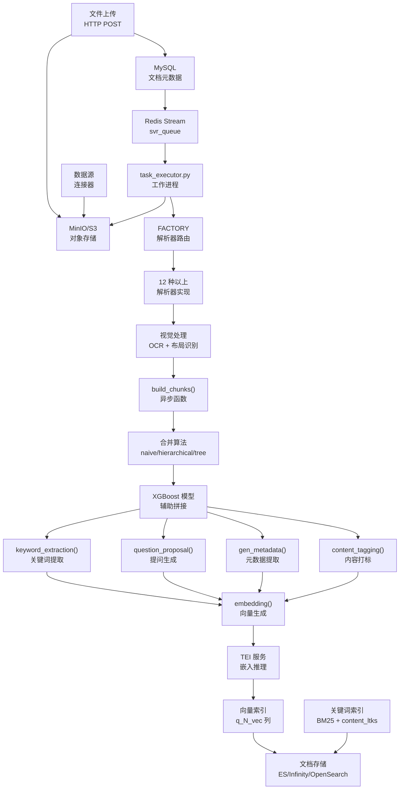
**数据源：** [rag/svr/task_executor.py:1-1500](https://github.com/infiniflow/ragflow/blob/80a16e71/rag/svr/task_executor.py#L1-L1500)

### 核心组件

| 组件 | 位置 | 用途 |
| --- | --- | --- |
| `task_executor.py` | [rag/svr/task_executor.py](https://github.com/infiniflow/ragflow/blob/80a16e71/rag/svr/task_executor.py) | 编排文档处理的主异步工作进程 |
| `FACTORY` | [rag/svr/task_executor.py:83-100](https://github.com/infiniflow/ragflow/blob/80a16e71/rag/svr/task_executor.py#L83-L100) | 将 parser_id 映射到对应实现的解析器选择字典 |
| `build_chunks()` | [rag/svr/task_executor.py:242-514](https://github.com/infiniflow/ragflow/blob/80a16e71/rag/svr/task_executor.py#L242-L514) | 带有超时和速率限制控制的核心切分函数 |
| `embedding()` | [rag/svr/task_executor.py:569-620](https://github.com/infiniflow/ragflow/blob/80a16e71/rag/svr/task_executor.py#L569-L620) | 通过 TEI 服务生成向量嵌入 |
| `insert_chunks()` | [rag/svr/task_executor.py:870-979](https://github.com/infiniflow/ragflow/blob/80a16e71/rag/svr/task_executor.py#L870-L979) | 带有重试逻辑的批量插入文档存储操作 |

**数据源：** [rag/svr/task_executor.py:1-1500](https://github.com/infiniflow/ragflow/blob/80a16e71/rag/svr/task_executor.py#L1-L1500)

---

## 文档摄入 (Document Ingestion)

文档通过两条主要路径进入流水线：直接 HTTP 上传和自动化数据源连接器。

### 上传流程

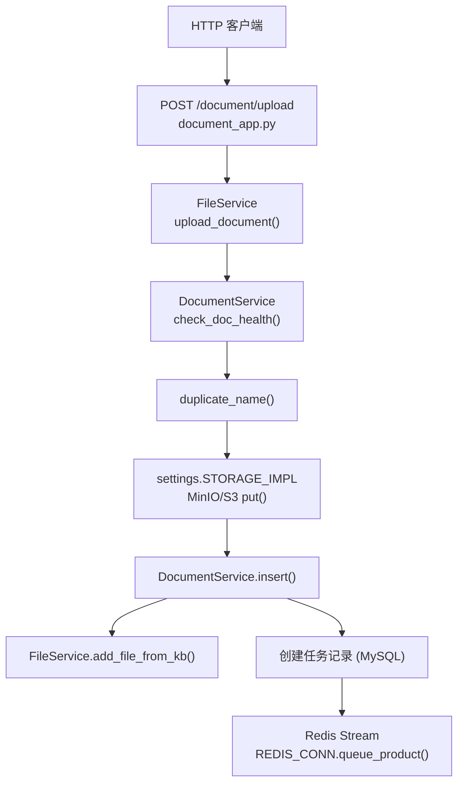

上传端点在将二进制文件存储到对象存储并创建元数据记录之前，会验证文件大小、名称长度和租户配额。

**核心验证检查：**

-   文件大小：[rag/svr/task_executor.py:243-245](https://github.com/infiniflow/ragflow/blob/80a16e71/rag/svr/task_executor.py#L243-L245) 中的 `task["size"] > settings.DOC_MAXIMUM_SIZE` 检查。
-   文件名长度：[api/apps/document_app.py:78-80](https://github.com/infiniflow/ragflow/blob/80a16e71/api/apps/document_app.py#L78-L80) 中的 `FILE_NAME_LEN_LIMIT` 验证。
-   租户文档数量：[api/db/services/document_service.py:120-121](https://github.com/infiniflow/ragflow/blob/80a16e71/api/db/services/document_service.py#L120-L121) 中的 `MAX_FILE_NUM_PER_USER` 检查。

**数据源：** [api/apps/document_app.py:52-97](https://github.com/infiniflow/ragflow/blob/80a16e71/api/apps/document_app.py#L52-L97) [api/db/services/file_service.py:270-425](https://github.com/infiniflow/ragflow/blob/80a16e71/api/db/services/file_service.py#L270-L425) [api/db/services/document_service.py:331-336](https://github.com/infiniflow/ragflow/blob/80a16e71/api/db/services/document_service.py#L331-L336)

### 任务队列架构

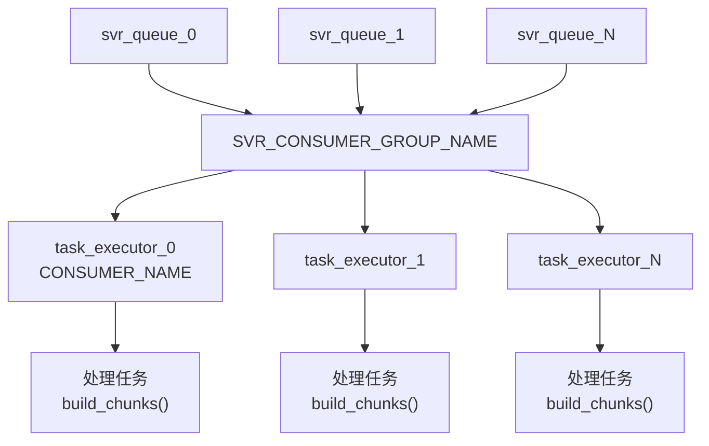

系统使用 **Redis Streams** 配合消费者组进行可靠的任务分发。多个队列（由 `settings.get_svr_queue_names()` 配置）用于负载均衡，而消费者组通过 ACK 机制确保任务有且仅被处理一次。

**并发控制：**

-   `MAX_CONCURRENT_TASKS`：总任务限制（默认 5），位于 [rag/svr/task_executor.py:122](https://github.com/infiniflow/ragflow/blob/80a16e71/rag/svr/task_executor.py#L122-L122)。
-   `MAX_CONCURRENT_CHUNK_BUILDERS`：限制同时进行的切分操作（默认 1），位于 [rag/svr/task_executor.py:123](https://github.com/infiniflow/ragflow/blob/80a16e71/rag/svr/task_executor.py#L123-L123)。
-   `MAX_CONCURRENT_MINIO`：限制 MinIO 操作（默认 10），位于 [rag/svr/task_executor.py:124](https://github.com/infiniflow/ragflow/blob/80a16e71/rag/svr/task_executor.py#L124-L124)。

**数据源：** [rag/svr/task_executor.py:173-234](https://github.com/infiniflow/ragflow/blob/80a16e71/rag/svr/task_executor.py#L173-L234) [rag/utils/redis_conn.py](https://github.com/infiniflow/ragflow/blob/80a16e71/rag/utils/redis_conn.py) [common/settings.py](https://github.com/infiniflow/ragflow/blob/80a16e71/common/settings.py)

---

## 解析策略 (Parsing Strategies)

RAGFlow 提供了 12 种以上专门的解析策略，每种都针对不同的文档类型和结构进行了优化。

### 解析器工厂 (Parser Factory)

```mermaid
flowchart TD
    Task["来自队列的任务\nparser_id 字段"]
    Factory["FACTORY 字典\ntask_executor.py:83-100"]
    Naive["ParserType.NAIVE\nnaive 模块"]
    Paper["ParserType.PAPER\npaper 模块"]
    Book["ParserType.BOOK\nbook 模块"]
    Presentation["ParserType.PRESENTATION\npresentation 模块"]
    Manual["ParserType.MANUAL\nmanual 模块"]
    Laws["ParserType.LAWS\nlaws 模块"]
    QA["ParserType.QA\nqa 模块"]
    Table["ParserType.TABLE\ntable 模块"]
    Resume["ParserType.RESUME\nresume 模块"]
    Picture["ParserType.PICTURE\npicture 模块"]
    One["ParserType.ONE\none 模块"]
    Audio["ParserType.AUDIO\naudio 模块"]
    Email["ParserType.EMAIL\nemail 模块"]
    KG["ParserType.KG\nnaive 模块"]
    Tag["ParserType.TAG\ntag 模块"]

    Task --> Factory
    Factory --> Naive
    Factory --> Paper
    Factory --> Book
    Factory --> Presentation
    Factory --> Manual
    Factory --> Laws
    Factory --> QA
    Factory --> Table
    Factory --> Resume
    Factory --> Picture
    Factory --> One
    Factory --> Audio
    Factory --> Email
    Factory --> KG
    Factory --> Tag
```

[rag/svr/task_executor.py:83-100](https://github.com/infiniflow/ragflow/blob/80a16e71/rag/svr/task_executor.py#L83-L100) 中的 `FACTORY` 字典将解析器标识符映射到其实现。每个解析器通过以下方式调用：

```python
chunker = FACTORY[task["parser_id"].lower()]
cks = await thread_pool_exec(
    chunker.chunk,
    task["name"],
    binary=binary,
    from_page=task["from_page"],
    to_page=task["to_page"],
    lang=task["language"],
    callback=progress_callback,
    kb_id=task["kb_id"],
    parser_config=task["parser_config"],
    tenant_id=task["tenant_id"],
)
```

**数据源：** [rag/svr/task_executor.py:83-100](https://github.com/infiniflow/ragflow/blob/80a16e71/rag/svr/task_executor.py#L83-L100) [rag/svr/task_executor.py:248-280](https://github.com/infiniflow/ragflow/blob/80a16e71/rag/svr/task_executor.py#L248-L280)

### 解析器实现模式

每个解析器都遵循通用接口，但实现了特定领域的逻辑：

| 解析器类型 | 主要用例 | 核心特性 | 实现 |
| --- | --- | --- | --- |
| **Naive** | 通用文档 | 基础文本提取，分级合并 | [rag/app/naive.py](https://github.com/infiniflow/ragflow/blob/80a16e71/rag/app/naive.py) |
| **Paper** | 学术论文 | 摘要检测、章节识别、引用处理 | [rag/app/paper.py](https://github.com/infiniflow/ragflow/blob/80a16e71/rag/app/paper.py) |
| **Book** | 长篇书籍 | 章节检测、目录提取、层级结构 | [rag/app/book.py](https://github.com/infiniflow/ragflow/blob/80a16e71/rag/app/book.py) |
| **Presentation** | PPT/PPTX 文件 | 逐页处理、演讲者备注、图像提取 | [rag/app/presentation.py](https://github.com/infiniflow/ragflow/blob/80a16e71/rag/app/presentation.py) |
| **Manual** | 技术手册 | 章节编号、层级列表、步骤检测 | [rag/app/manual.py](https://github.com/infiniflow/ragflow/blob/80a16e71/rag/app/manual.py) |
| **Laws** | 法律文件 | 条款编号、子句检测、层级结构 | [rag/app/laws.py](https://github.com/infiniflow/ragflow/blob/80a16e71/rag/app/laws.py) |
| **QA** | 问答文档 | 问题检测、成对的 Q&A 提取 | [rag/app/qa.py](https://github.com/infiniflow/ragflow/blob/80a16e71/rag/app/qa.py) |
| **Table** | Excel/CSV 文件 | 列类型推断、SQL 表生成、元数据提取 | [rag/app/table.py](https://github.com/infiniflow/ragflow/blob/80a16e71/rag/app/table.py) |
| **One** | 单切片文档 | 整个文档作为一个切片，最少处理 | [rag/app/one.py](https://github.com/infiniflow/ragflow/blob/80a16e71/rag/app/one.py) |
| **Picture** | 图像文件 | 通过视觉模型实现图像转文本，OCR 回退 | [rag/app/picture.py](https://github.com/infiniflow/ragflow/blob/80a16e71/rag/app/picture.py) |
| **Audio** | 音频文件 | 通过 ASR 模型（Whisper 等）实现语音转文本 | [rag/app/audio.py](https://github.com/infiniflow/ragflow/blob/80a16e71/rag/app/audio.py) |
| **Email** | 邮件文件 (.eml) | 发件人/收件人提取、邮件链检测 | [rag/app/email.py](https://github.com/infiniflow/ragflow/blob/80a16e71/rag/app/email.py) |

**数据源：** [rag/app/naive.py](https://github.com/infiniflow/ragflow/blob/80a16e71/rag/app/naive.py) [rag/app/paper.py](https://github.com/infiniflow/ragflow/blob/80a16e71/rag/app/paper.py) [rag/app/book.py](https://github.com/infiniflow/ragflow/blob/80a16e71/rag/app/book.py) [rag/app/manual.py](https://github.com/infiniflow/ragflow/blob/80a16e71/rag/app/manual.py) [rag/app/laws.py](https://github.com/infiniflow/ragflow/blob/80a16e71/rag/app/laws.py) [rag/app/qa.py](https://github.com/infiniflow/ragflow/blob/80a16e71/rag/app/qa.py) [rag/app/table.py](https://github.com/infiniflow/ragflow/blob/80a16e71/rag/app/table.py) [rag/app/one.py](https://github.com/infiniflow/ragflow/blob/80a16e71/rag/app/one.py) [rag/app/presentation.py](https://github.com/infiniflow/ragflow/blob/80a16e71/rag/app/presentation.py)

### PDF 解析后端

对于 PDF 文档，RAGFlow 支持通过 `parser_config` 配置多个解析后端：

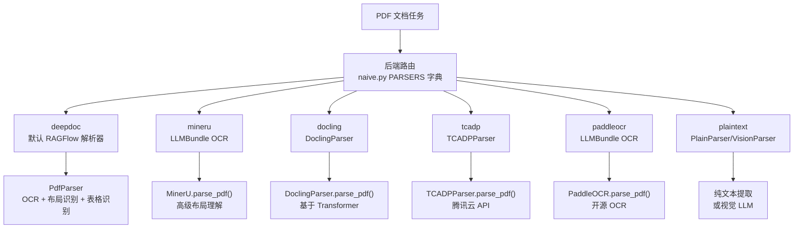

[rag/app/naive.py:221-228](https://github.com/infiniflow/ragflow/blob/80a16e71/rag/app/naive.py#L221-L228) 中的 `PARSERS` 字典将后端名称映射到对应的函数：

-   `by_deepdoc`：使用 RAGFlowPdfParser，包含 OCR、布局识别和表格结构检测。
-   `by_mineru`：通过 LLMBundle 集成 MinerU，用于高级布局理解。
-   `by_docling`：使用 IBM Docling 进行基于 transformer 的解析。
-   `by_tcadp`：调用腾讯云文档解析 API。
-   `by_paddleocr`：通过 LLMBundle 使用 PaddleOCR。
-   `by_plaintext`：仅提取文本，可选配合视觉 LLM 进行布局理解。

**数据源：** [rag/app/naive.py:57-228](https://github.com/infiniflow/ragflow/blob/80a16e71/rag/app/naive.py#L57-L228) [deepdoc/parser/pdf_parser.py:55-579](https://github.com/infiniflow/ragflow/blob/80a16e71/deepdoc/parser/pdf_parser.py#L55-L579)

---

## 切分方法 (Chunking Methods)

解析完成后，文档将使用由机器学习指导的智能合并算法切分为多个块。

### 切分架构

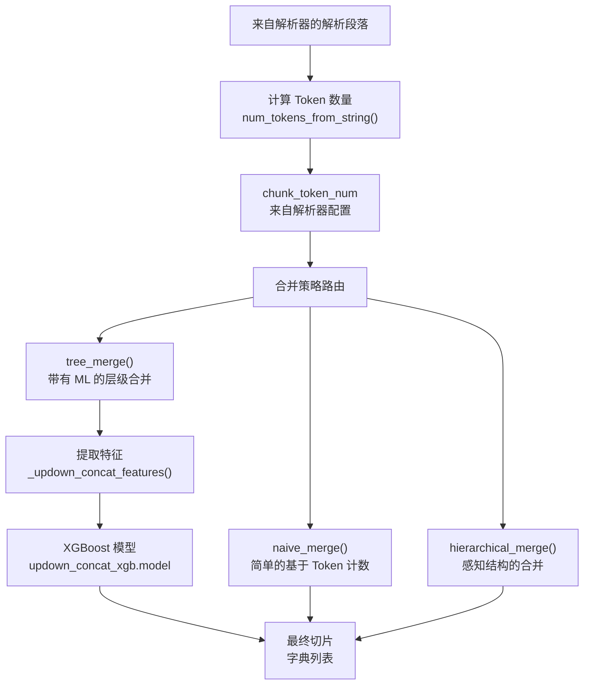
**数据源：** [rag/nlp/__init__.py:275-530](https://github.com/infiniflow/ragflow/blob/80a16e71/rag/nlp/__init__.py#L275-L530) [deepdoc/parser/pdf_parser.py:91-105](https://github.com/infiniflow/ragflow/blob/80a16e71/deepdoc/parser/pdf_parser.py#L91-L105)

### 合并算法

#### 1. Naive Merge

基于 Token 数量阈值的简单拼接：

```python
def naive_merge(sections, chunk_token_num, delimeter="\n"):
    chunks = []
    current_chunk = ""
    for section in sections:
        if num_tokens_from_string(current_chunk + section) <= chunk_token_num:
            current_chunk += delimeter + section
        else:
            chunks.append(current_chunk)
            current_chunk = section
    if current_chunk:
        chunks.append(current_chunk)
    return chunks
```
**数据源：** [rag/nlp/__init__.py:275-295](https://github.com/infiniflow/ragflow/blob/80a16e71/rag/nlp/__init__.py#L275-L295)

#### 2. Hierarchical Merge

在合并过程中尊重文档结构（列表项、标题、章节）。使用 `BULLET_PATTERN` 和 `bullets_category()` 来检测层级。

**核心函数：**

-   `bullets_category()`：确定列表项类型（数字、字母、Markdown 标题），位于 [rag/nlp/__init__.py:216-233](https://github.com/infiniflow/ragflow/blob/80a16e71/rag/nlp/__init__.py#L216-L233)。
-   `hierarchical_merge()`：在保持层级的同时进行合并，位于 [rag/nlp/__init__.py:296-420](https://github.com/infiniflow/ragflow/blob/80a16e71/rag/nlp/__init__.py#L296-L420)。

**数据源：** [rag/nlp/__init__.py:169-233](https://github.com/infiniflow/ragflow/blob/80a16e71/rag/nlp/__init__.py#L169-L233) [rag/nlp/__init__.py:296-420](https://github.com/infiniflow/ragflow/blob/80a16e71/rag/nlp/__init__.py#L296-L420)

#### 3. Tree Merge (由 XGBoost 引导)

使用预训练的 XGBoost 模型来预测相邻段落是否应该拼接。该模型评估 32 个特征，包括：

| 特征类别 | 示例 |
| --- | --- |
| **布局** | 是否在同一行 (`up.get("R") == down.get("R")`)、y 轴距离、页边距 |
| **内容类型** | 是否均为文本、是否均为表格、布局类型 (layout_type) 是否匹配 |
| **文本模式** | 是否以标点符号结尾、是否以大写字母开头、括号是否匹配 |
| **Token 重叠** | 边界处的共享 Token、Token 计数差异 |
| **结构化** | 列表项模式匹配、标题检测 |

特征提取实现在 [deepdoc/parser/pdf_parser.py:135-178](https://github.com/infiniflow/ragflow/blob/80a16e71/deepdoc/parser/pdf_parser.py#L135-L178) 中的 `_updown_concat_features()`。

**模型加载：**

```python
self.updown_cnt_mdl = xgb.Booster()
self.updown_cnt_mdl.load_model(os.path.join(model_dir, "updown_concat_xgb.model"))
```
**数据源：** [deepdoc/parser/pdf_parser.py:91-105](https://github.com/infiniflow/ragflow/blob/80a16e71/deepdoc/parser/pdf_parser.py#L91-L105) [deepdoc/parser/pdf_parser.py:135-178](https://github.com/infiniflow/ragflow/blob/80a16e71/deepdoc/parser/pdf_parser.py#L135-L178) [rag/nlp/__init__.py:421-530](https://github.com/infiniflow/ragflow/blob/80a16e71/rag/nlp/__init__.py#L421-L530)

### 切片结构

每个切片是一个具有以下结构的字典：

```python
{
    "content_with_weight": str,        # 原始文本内容
    "content_ltks": str,               # 用于 BM25 的分词内容
    "content_sm_ltks": str,            # 细粒度分词
    "image": Optional[PIL.Image],      # 关联的图像
    "important_kwd": List[str],        # LLM 生成的关键词
    "important_tks": str,              # 关键词分词
    "question_kwd": List[str],         # LLM 生成的问题
    "question_tks": str,               # 问题分词
    "metadata_obj": Optional[dict],    # 结构化元数据
    "tag_fld": Optional[dict],         # 标签评分
    "positions": List[List[int]],      # 坐标 [页码, x0, top, x1, bottom]
    "page_num_int": List[int],         # 页码
    # ... 其他字段
}
```
**数据源：** [rag/svr/task_executor.py:289-514](https://github.com/infiniflow/ragflow/blob/80a16e71/rag/svr/task_executor.py#L289-L514)

---

## 内容增强 (Content Enhancement)

在初始切分之后，流水线可以选择性地使用 LLM 生成的元数据来增强切片。

### 增强流水线

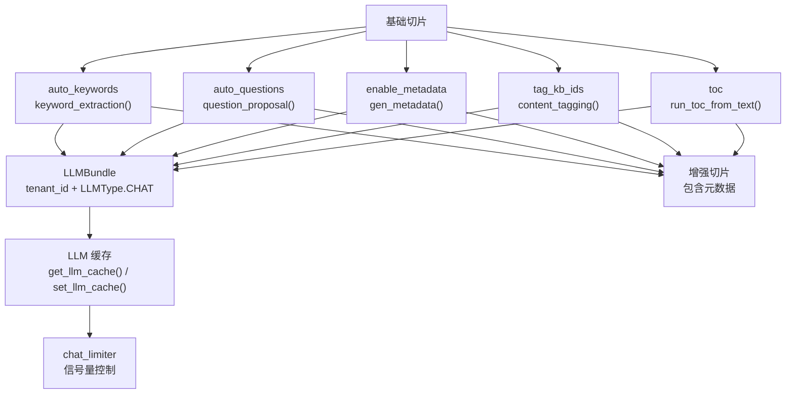
**数据源：** [rag/svr/task_executor.py:339-512](https://github.com/infiniflow/ragflow/blob/80a16e71/rag/svr/task_executor.py#L339-L512)

### 关键词提取

当设置了 `parser_config["auto_keywords"]`（如 5）时，系统会为每个切片生成关键词：

```python
async def doc_keyword_extraction(chat_mdl, d, topn):
    cached = get_llm_cache(chat_mdl.llm_name, d["content_with_weight"], "keywords", {"topn": topn})
    if not cached:
        if has_canceled(task["id"]):
            return
        async with chat_limiter:
            cached = await keyword_extraction(chat_mdl, d["content_with_weight"], topn)
        set_llm_cache(chat_mdl.llm_name, d["content_with_weight"], cached, "keywords", {"topn": topn})
    if cached:
        d["important_kwd"] = cached.split(",")
        d["important_tks"] = rag_tokenizer.tokenize(" ".join(d["important_kwd"]))
```

`keyword_extraction()` 提示词位于 [rag/prompts/generator.py](https://github.com/infiniflow/ragflow/blob/80a16e71/rag/prompts/generator.py)，它使用配置好的 LLM 来提取关键术语。

**数据源：** [rag/svr/task_executor.py:339-370](https://github.com/infiniflow/ragflow/blob/80a16e71/rag/svr/task_executor.py#L339-L370) [rag/prompts/generator.py](https://github.com/infiniflow/ragflow/blob/80a16e71/rag/prompts/generator.py)

### 提问生成

当设置了 `parser_config["auto_questions"]` 时，系统会生成可能被该切片回答的潜在问题：

```python
async def doc_question_proposal(chat_mdl, d, topn):
    cached = get_llm_cache(chat_mdl.llm_name, d["content_with_weight"], "question", {"topn": topn})
    if not cached:
        async with chat_limiter:
            cached = await question_proposal(chat_mdl, d["content_with_weight"], topn)
        set_llm_cache(chat_mdl.llm_name, d["content_with_weight"], cached, "question", {"topn": topn})
    if cached:
        d["question_kwd"] = cached.split("\n")
        d["question_tks"] = rag_tokenizer.tokenize("\n".join(d["question_kwd"]))
```

这实现了在检索过程中的**假设性提问匹配** —— 如果用户的查询匹配到了生成的问题，对应的切片将被视为高度相关。

**数据源：** [rag/svr/task_executor.py:372-402](https://github.com/infiniflow/ragflow/blob/80a16e71/rag/svr/task_executor.py#L372-L402)

### 元数据提取

当 `parser_config["enable_metadata"]` 为 true 且 `parser_config["metadata"]` 定义了架构时，系统会提取结构化元数据：

```python
async def gen_metadata_task(chat_mdl, d):
    cached = get_llm_cache(chat_mdl.llm_name, d["content_with_weight"], "metadata",
                           task["parser_config"]["metadata"])
    if not cached:
        async with chat_limiter:
            cached = await gen_metadata(chat_mdl,
                                        turn2jsonschema(task["parser_config"]["metadata"]),
                                        d["content_with_weight"])
        set_llm_cache(chat_mdl.llm_name, d["content_with_weight"], cached, "metadata",
                      task["parser_config"]["metadata"])
    if cached:
        d["metadata_obj"] = cached
```

元数据会跨所有切片进行汇总，并存储在 `Document.meta_fields` 中用于过滤。

**数据源：** [rag/svr/task_executor.py:404-447](https://github.com/infiniflow/ragflow/blob/80a16e71/rag/svr/task_executor.py#L404-L447) [common/metadata_utils.py](https://github.com/infiniflow/ragflow/blob/80a16e71/common/metadata_utils.py)

### 内容打标

当配置了 `kb_parser_config["tag_kb_ids"]` 时，系统会基于参考知识库为切片打标：

1.  从参考 KB 检索所有标签：`settings.retriever.all_tags_in_portion(tenant_id, kb_ids, S)`。
2.  尝试通过向量相似度进行快速打标：`settings.retriever.tag_content()`。
3.  对于未打标的切片，使用带有 few-shot 示例的 LLM：

```python
async def doc_content_tagging(chat_mdl, d, topn_tags):
    cached = get_llm_cache(chat_mdl.llm_name, d["content_with_weight"], all_tags, {"topn": topn_tags})
    if not cached:
        picked_examples = random.choices(examples, k=2)
        async with chat_limiter:
            cached = await content_tagging(
                chat_mdl,
                d["content_with_weight"],
                all_tags,
                picked_examples,
                topn_tags,
            )
        set_llm_cache(chat_mdl.llm_name, d["content_with_weight"], cached, all_tags, {"topn": topn_tags})
    if cached:
        d[TAG_FLD] = json.loads(cached)
```

标签存储在 `TAG_FLD` 字段中，用于在检索过程中进行评分。

**数据源：** [rag/svr/task_executor.py:449-512](https://github.com/infiniflow/ragflow/blob/80a16e71/rag/svr/task_executor.py#L449-L512) [graphrag/utils.py](https://github.com/infiniflow/ragflow/blob/80a16e71/graphrag/utils.py)

### 目录 (TOC) 生成

对于符合条件的文档，系统可以生成层级目录：

```python
def build_TOC(task, docs, progress_callback):
    chat_mdl = LLMBundle(task["tenant_id"], LLMType.CHAT, llm_name=task["llm_id"], lang=task["language"])
    docs = sorted(docs, key=lambda d: (d.get("page_num_int", 0), d.get("top_int", 0)))
    toc: list[dict] = asyncio.run(
        run_toc_from_text([d["content_with_weight"] for d in docs], chat_mdl, progress_callback))
```

TOC 被存储为一个特殊的切片，其 `toc_kwd = "toc"` 且 `available_int = 0`（即在普通检索中被排除）。

**数据源：** [rag/svr/task_executor.py:517-560](https://github.com/infiniflow/ragflow/blob/80a16e71/rag/svr/task_executor.py#L517-L560) [rag/prompts/generator.py](https://github.com/infiniflow/ragflow/blob/80a16e71/rag/prompts/generator.py)

---

## 视觉处理 (Vision Processing)

对于包含图像、表格或复杂布局的文档，RAGFlow 采用多阶段视觉处理流水线。

### 视觉处理架构

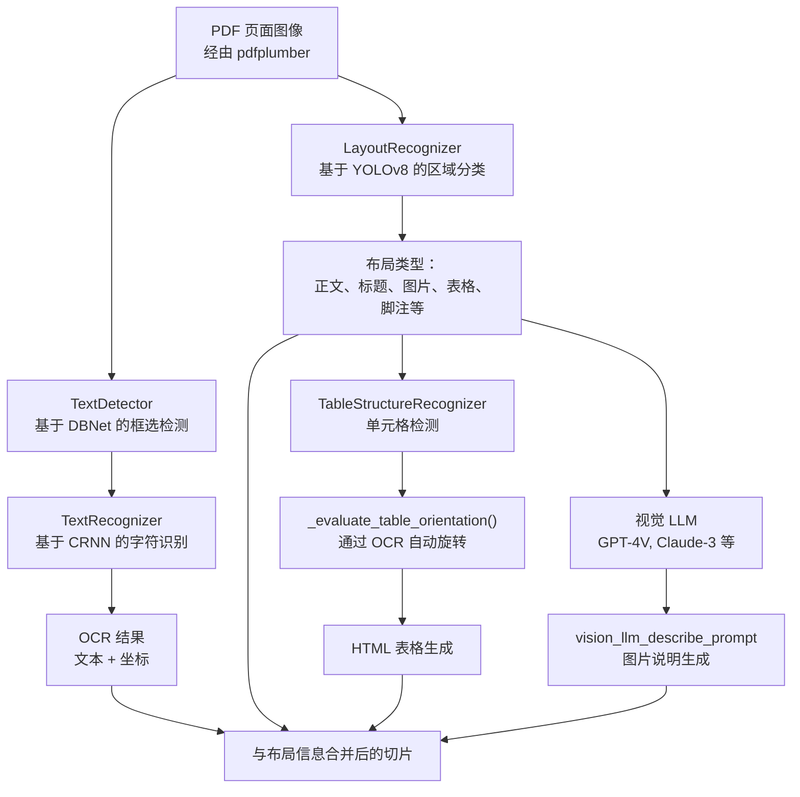
**数据源：** [deepdoc/parser/pdf_parser.py:55-579](https://github.com/infiniflow/ragflow/blob/80a16e71/deepdoc/parser/pdf_parser.py#L55-L579) [deepdoc/vision/ocr.py](https://github.com/infiniflow/ragflow/blob/80a16e71/deepdoc/vision/ocr.py) [deepdoc/vision/layout_recognizer.py](https://github.com/infiniflow/ragflow/blob/80a16e71/deepdoc/vision/layout_recognizer.py) [deepdoc/vision/recognizer.py](https://github.com/infiniflow/ragflow/blob/80a16e71/deepdoc/vision/recognizer.py)

### OCR 组件

#### TextDetector

`TextDetector` 类使用基于 DBNet 的模型来检测图像中的文本区域。它输出每个检测到的文本区域的边界框 (bounding boxes)。

**实现：** [deepdoc/vision/ocr.py](https://github.com/infiniflow/ragflow/blob/80a16e71/deepdoc/vision/ocr.py)

#### TextRecognizer

`TextRecognizer` 类使用 CRNN 架构来识别检测到的边界框内的字符。它支持通过 `lang` 参数配置的多语言。

**实现：** [deepdoc/vision/recognizer.py](https://github.com/infiniflow/ragflow/blob/80a16e71/deepdoc/vision/recognizer.py)

#### OCR 类

`OCR` 类结合了检测和识别：

```python
class OCR:
    def __init__(self):
        self.text_detector = TextDetector()
        self.text_recognizer = TextRecognizer()

    def __call__(self, img_array):
        boxes = self.text_detector(img_array)
        results = []
        for box in boxes:
            text, confidence = self.text_recognizer(img_array, box)
            results.append((box, (text, confidence)))
        return results
```
**数据源：** [deepdoc/vision/ocr.py](https://github.com/infiniflow/ragflow/blob/80a16e71/deepdoc/vision/ocr.py)

### 布局识别 (Layout Recognition)

`LayoutRecognizer` 类使用 YOLOv8 将文档区域划分为不同类型：

| 布局类型 | 描述 |
| --- | --- |
| `text` | 正文段落 |
| `title` | 章节标题和题目 |
| `figure` | 图片、图表、图示 |
| `table` | 表格区域 |
| `caption` | 图片和表格的说明文字 |
| `footer` | 页脚 |
| `header` | 页眉 |
| `reference` | 参考文献条目 |
| `equation` | 数学公式 |

该识别器在 `RAGFlowPdfParser.__init__()` 中初始化：

```python
if layout_recognizer_type == "ascend":
    self.layouter = AscendLayoutRecognizer(recognizer_domain)
else:
    self.layouter = LayoutRecognizer(recognizer_domain)
```
**数据源：** [deepdoc/parser/pdf_parser.py:74-88](https://github.com/infiniflow/ragflow/blob/80a16e71/deepdoc/parser/pdf_parser.py#L74-L88) [deepdoc/vision/layout_recognizer.py](https://github.com/infiniflow/ragflow/blob/80a16e71/deepdoc/vision/layout_recognizer.py)

### 表格结构识别 (Table Structure Recognition)

表格处理涉及三个阶段：

#### 1. 表格检测

布局识别标识出表格区域。

#### 2. 方向校正

`_evaluate_table_orientation()` 函数测试 4 个旋转角度（0°, 90°, 180°, 270°），并利用 OCR 置信度评分来确定最佳方向：

```python
def _evaluate_table_orientation(self, table_img, sample_ratio=0.3):
    rotations = [
        (0, "original"),
        (90, "rotate_90"),
        (180, "rotate_180"),
        (270, "rotate_270"),
    ]

    results = {}
    best_score = -1
    best_angle = 0
    best_img = table_img

    for angle, name in rotations:
        rotated_img = table_img.rotate(-angle, expand=True) if angle else table_img
        ocr_results = self.ocr(np.array(rotated_img))
        scores = [conf for _, (_, conf) in ocr_results]
        avg_score = sum(scores) / len(scores) if scores else 0
        combined_score = avg_score * (1 + 0.1 * min(len(scores), 50) / 50)

        if combined_score > best_score:
            best_score = combined_score
            best_angle = angle
            best_img = rotated_img

    return best_angle, best_img, results
```
**数据源：** [deepdoc/parser/pdf_parser.py:200-276](https://github.com/infiniflow/ragflow/blob/80a16e71/deepdoc/parser/pdf_parser.py#L200-L276)

#### 3. 单元格结构检测

`TableStructureRecognizer`（通过 `self.tbl_det`）检测单个单元格及其关系。流水线随后将 OCR 文本与单元格匹配并生成 HTML：

```python
def _table_transformer_job(self, ZM, auto_rotate=True):
    # 收集表格图像
    for p, tbls in enumerate(self.page_layout):
        for tb in tbls:
            if tb["type"] == "table":
                # 裁剪表格区域
                table_img = self.page_images[p].crop((left, top, right, bott))

                # 可选校正方向
                if auto_rotate:
                    best_angle, table_img, _ = self._evaluate_table_orientation(table_img)

                imgs.append(table_img)

    # 通过 TableStructureRecognizer 批量处理
    tables = self.tbl_det(imgs)

    # 为每个表格生成 HTML
    for table_data in tables:
        html = self._generate_table_html(table_data)
```
**数据源：** [deepdoc/parser/pdf_parser.py:278-469](https://github.com/infiniflow/ragflow/blob/80a16e71/deepdoc/parser/pdf_parser.py#L278-L469)

### 通过视觉 LLM 进行图片描述

对于插图和图像，RAGFlow 可以使用具有视觉能力的 LLM 生成描述：

```python
def vision_figure_parser_pdf_wrapper(tbls, sections, callback, **kwargs):
    vision_model_name = kwargs.get("parser_config", {}).get("layout_recognizer", "")
    if not vision_model_name or vision_model_name == "Plain Text":
        return tbls

    tenant_id = kwargs.get("tenant_id")
    vision_model = LLMBundle(
        tenant_id,
        LLMType.IMAGE2TEXT,
        llm_name=vision_model_name,
        lang=kwargs.get("lang", "Chinese"),
    )

    for tb in tbls:
        if tb.get("type") == "figure":
            prompt = vision_llm_describe_prompt()
            description = vision_model.describe_image(tb["image"], prompt)
            tb["text"] = description
```
**数据源：** [deepdoc/parser/figure_parser.py](https://github.com/infiniflow/ragflow/blob/80a16e71/deepdoc/parser/figure_parser.py) [rag/prompts/generator.py](https://github.com/infiniflow/ragflow/blob/80a16e71/rag/prompts/generator.py)

---

## 嵌入与索引 (Embedding and Indexing)

在完成切分和增强之后，切片将被嵌入并索引到文档存储中。

### 嵌入生成

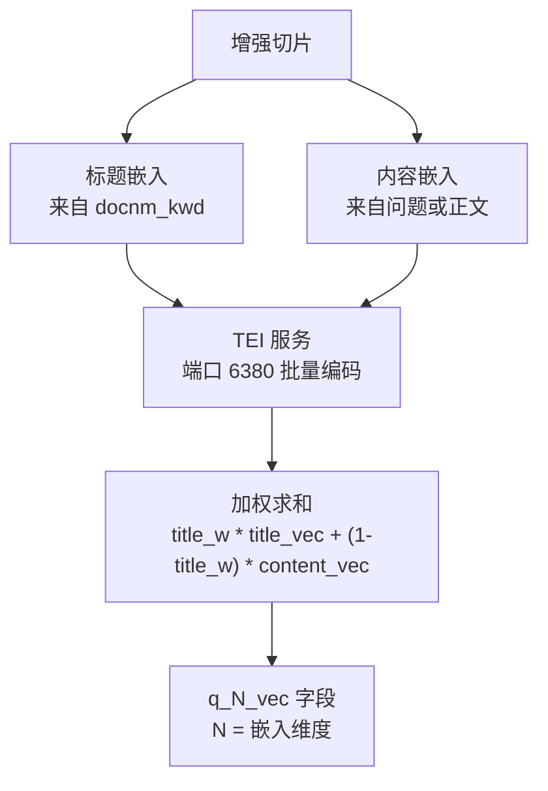

[rag/svr/task_executor.py:569-620](https://github.com/infiniflow/ragflow/blob/80a16e71/rag/svr/task_executor.py#L569-L620) 中的 `embedding()` 函数用于生成向量：

```python
async def embedding(docs, mdl, parser_config=None, callback=None):
    tts, cnts = [], []
    for d in docs:
        tts.append(d.get("docnm_kwd", "Title"))
        c = "\n".join(d.get("question_kwd", []))
        if not c:
            c = d["content_with_weight"]
        cnts.append(c)

    # 标题嵌入 (针对所有切片复用)
    vts, c = await thread_pool_exec(mdl.encode, tts[0:1])
    tts = np.tile(vts[0], (len(cnts), 1))

    # 内容嵌入 (批量处理)
    cnts_ = np.array([])
    for i in range(0, len(cnts), settings.EMBEDDING_BATCH_SIZE):
        async with embed_limiter:
            vts, c = await thread_pool_exec(batch_encode, cnts[i: i + settings.EMBEDDING_BATCH_SIZE])
        cnts_ = np.concatenate((cnts_, vts), axis=0) if len(cnts_) else vts

    # 加权组合
    filename_embd_weight = parser_config.get("filename_embd_weight", 0.1)
    title_w = float(filename_embd_weight)
    vects = title_w * tts + (1 - title_w) * cnts_

    for i, d in enumerate(docs):
        v = vects[i].tolist()
        d["q_%d_vec" % len(v)] = v
```

**核心点：**

-   **标题嵌入复用**：对来自同一文档的所有切片复用同一标题向量（性能优化）。
-   **内容嵌入优先级**：如果存在生成的问题，则优先针对问题进行嵌入，否则使用原始正文。
-   **批量化**：通过 `settings.EMBEDDING_BATCH_SIZE`（通常为 32）进行批量处理。
-   **信号量控制**：通过 `embed_limiter` 防止瞬时请求冲垮 TEI 服务。
-   **向量列命名**：例如 768 维嵌入命名为 `q_768_vec`。

**数据源：** [rag/svr/task_executor.py:569-620](https://github.com/infiniflow/ragflow/blob/80a16e71/rag/svr/task_executor.py#L569-L620)

### 为 BM25 进行分词

在向量嵌入的同时，切片还会针对关键词搜索进行分词：

```python
def tokenize(d, txt, eng):
    d["content_with_weight"] = txt
    t = re.sub(r"</?(table|td|caption|tr|th)( [^<>]{0,12})?>", " ", txt)
    d["content_ltks"] = rag_tokenizer.tokenize(t)
    d["content_sm_ltks"] = rag_tokenizer.fine_grained_tokenize(d["content_ltks"])
```

-   `content_ltks`：用于 BM25 匹配的标准分词。
-   `content_sm_ltks`：细粒度分词，用以提升短查询的回显率。

**数据源：** [rag/nlp/__init__.py:268-273](https://github.com/infiniflow/ragflow/blob/80a16e71/rag/nlp/__init__.py#L268-L273)

### 文档存储索引 (Document Store Indexing)

`insert_chunks()` 函数执行批量插入：

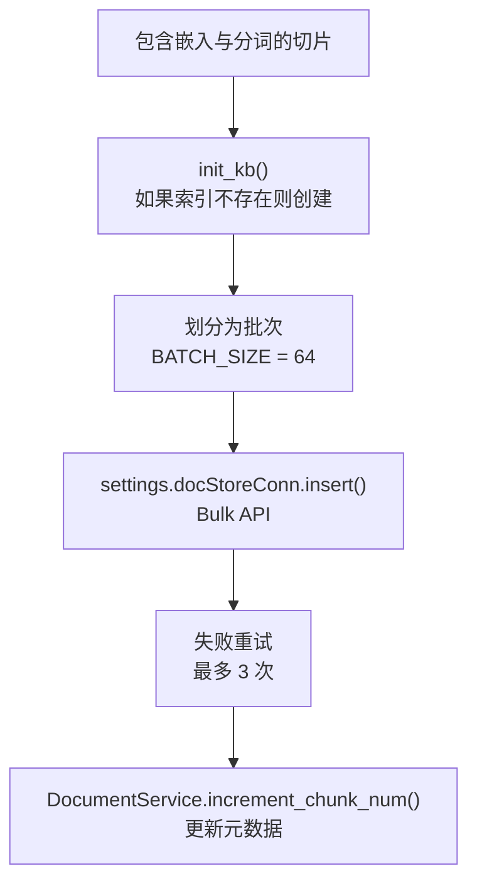

**索引架构**（因文档引擎而异）：

针对 **Elasticsearch**：

-   索引名称：`ragflow_{tenant_id}`。
-   通过 `kb_id` 字段进行知识库过滤。
-   向量字段：`q_{N}_vec` (dense_vector 类型)。
-   关键词字段：`content_ltks` (text), `content_sm_ltks` (text)。

针对 **Infinity**：

-   表名：`ragflow_{tenant_id}_{kb_id}`（每个知识库一张表）。
-   向量列：`q_{N}_vec` (vector 类型)。
-   关键词列：`content_ltks` (varchar，带有 BM25 索引)。

**批量插入逻辑：**

```python
async def insert_chunks(task_id, task_tenant_id, task_dataset_id, chunks, progress_callback):
    # 初始化索引/表
    vector_size = len(chunks[0]["q_%d_vec" % vector_size])
    init_kb(task, vector_size)

    # 批量插入
    for i in range(0, len(chunks), BATCH_SIZE):
        batch = chunks[i:i + BATCH_SIZE]
        retry_times = 0
        while retry_times < 3:
            try:
                settings.docStoreConn.insert(
                    batch,
                    search.index_name(task_tenant_id),
                    task_dataset_id
                )
                break
            except Exception as e:
                retry_times += 1
                if retry_times >= 3:
                    raise

    # 更新文档元数据
    DocumentService.increment_chunk_num(
        task["doc_id"],
        task_dataset_id,
        embedding_token_consumption,
        len(chunks),
        task_time_cost
    )
```
**数据源：** [rag/svr/task_executor.py:870-979](https://github.com/infiniflow/ragflow/blob/80a16e71/rag/svr/task_executor.py#L870-L979) [common/doc_store/elasticsearch_conn.py](https://github.com/infiniflow/ragflow/blob/80a16e71/common/doc_store/elasticsearch_conn.py) [common/doc_store/infinity_conn.py](https://github.com/infiniflow/ragflow/blob/80a16e71/common/doc_store/infinity_conn.py)

---

## 高级处理：RAPTOR 与知识图谱

除了基础切分外，RAGFlow 还支持更高级的处理方法。

### RAPTOR 层级摘要

RAPTOR (Recursive Abstractive Processing for Tree-Organized Retrieval) 创建多层级摘要：

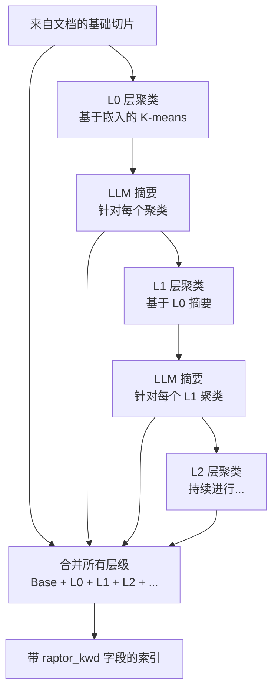

[rag/svr/task_executor.py:764-858](https://github.com/infiniflow/ragflow/blob/80a16e71/rag/svr/task_executor.py#L764-L858) 中的 `run_raptor_for_kb()` 函数编排了该过程：

```python
async def run_raptor_for_kb(row, kb_parser_config, chat_mdl, embd_mdl, vector_size, callback=None, doc_ids=[]):
    raptor_config = kb_parser_config.get("raptor", {})
    vctr_nm = "q_%d_vec" % vector_size

    # 获取基础切片
    chunks = []
    for doc_id in doc_ids:
        for d in settings.retriever.chunk_list(doc_id, row["tenant_id"], [str(row["kb_id"])],
                                               fields=["content_with_weight", vctr_nm],
                                               sort_by_position=True):
            chunks.append((d["content_with_weight"], np.array(d[vctr_nm])))

    # 应用 RAPTOR
    raptor = Raptor(
        raptor_config.get("max_cluster", 64),
        chat_mdl,
        embd_mdl,
        raptor_config["prompt"],
        raptor_config["max_token"],
        raptor_config["threshold"],
        max_errors=max_errors,
    )
    chunks = await raptor(chunks, kb_parser_config["raptor"]["random_seed"], callback, row["id"])

    # 存储摘要切片
    for content, vctr in chunks[original_length:]:
        d = {
            "id": xxhash.xxh64((content + str(fake_doc_id)).encode("utf-8")).hexdigest(),
            "doc_id": doc_id,
            "kb_id": [str(row["kb_id"])],
            "raptor_kwd": "raptor",
            vctr_nm: vctr.tolist(),
            "content_with_weight": content,
            # ... 分词 ...
        }
        res.append(d)
```

RAPTOR 切片被标记为 `raptor_kwd = "raptor"`，可以在检索过程中进行过滤。

**数据源：** [rag/svr/task_executor.py:764-858](https://github.com/infiniflow/ragflow/blob/80a16e71/rag/svr/task_executor.py#L764-L858) [rag/raptor.py](https://github.com/infiniflow/ragflow/blob/80a16e71/rag/raptor.py)

### 知识图谱构建

`run_graphrag_for_kb()` 函数负责提取实体和关系：

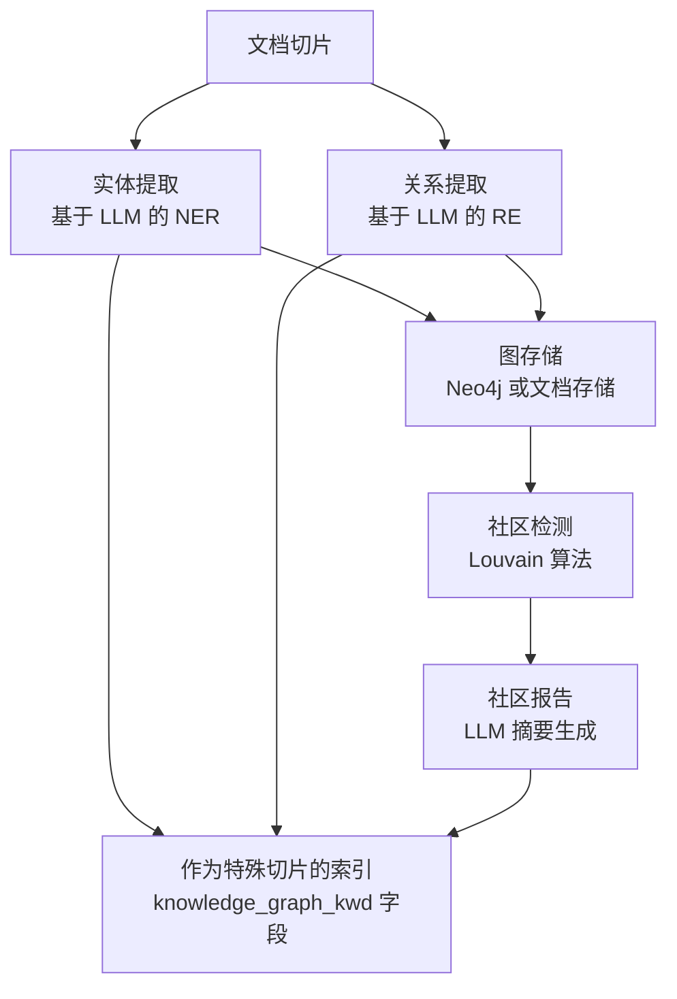

图元素存储时带有：

-   `knowledge_graph_kwd = ["entity"]`：针对实体切片。
-   `knowledge_graph_kwd = ["relation"]`：针对关系切片。
-   `knowledge_graph_kwd = ["graph"]`：针对图元数据。
-   `knowledge_graph_kwd = ["community_report"]`：针对社区摘要。

**数据源：** [graphrag/general/index.py](https://github.com/infiniflow/ragflow/blob/80a16e71/graphrag/general/index.py) [rag/svr/task_executor.py](https://github.com/infiniflow/ragflow/blob/80a16e71/rag/svr/task_executor.py)

---

## 任务执行系统 (Task Execution System)

异步任务执行系统是文档处理的骨干。

### 工作进程架构

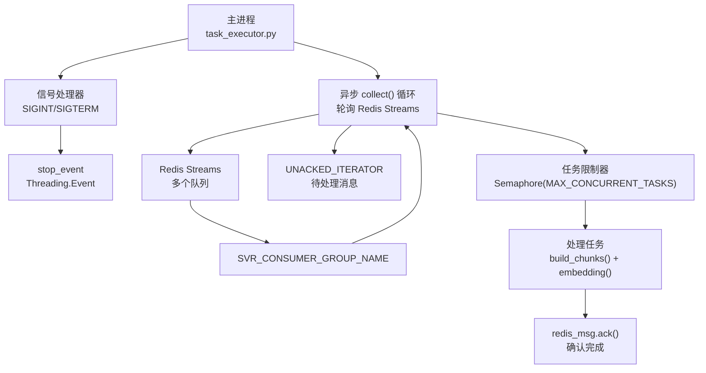

**核心函数：**

#### collect()

从 Redis 获取任务：

```python
async def collect():
    global UNACKED_ITERATOR
    svr_queue_names = settings.get_svr_queue_names()
    redis_msg = None

    # 首先检查未确认 (unacked) 的消息
    if not UNACKED_ITERATOR:
        UNACKED_ITERATOR = REDIS_CONN.get_unacked_iterator(svr_queue_names, SVR_CONSUMER_GROUP_NAME, CONSUMER_NAME)
    try:
        redis_msg = next(UNACKED_ITERATOR)
    except StopIteration:
        # 然后轮询新消息
        for svr_queue_name in svr_queue_names:
            redis_msg = REDIS_CONN.queue_consumer(svr_queue_name, SVR_CONSUMER_GROUP_NAME, CONSUMER_NAME)
            if redis_msg:
                break

    if not redis_msg:
        return None, None

    msg = redis_msg.get_message()
    task = TaskService.get_task(msg["id"])

    return redis_msg, task
```
**数据源：** [rag/svr/task_executor.py:173-234](https://github.com/infiniflow/ragflow/blob/80a16e71/rag/svr/task_executor.py#L173-L234)

#### 主执行循环

```python
async def main():
    while not stop_event.is_set():
        redis_msg, task = await collect()
        if not task:
            await asyncio.sleep(1)
            continue

        async with task_limiter:
            try:
                await process_task(task)
                redis_msg.ack()
            except TaskCanceledException:
                redis_msg.ack()
            except Exception as e:
                logging.error(f"任务 {task['id']} 失败: {e}")
                redis_msg.ack()  # 即使失败也 ACK，避免无限重试
```
**数据源：** [rag/svr/task_executor.py:1300-1500](https://github.com/infiniflow/ragflow/blob/80a16e71/rag/svr/task_executor.py#L1300-L1500)

### 进度追踪

`set_progress()` 函数更新 MySQL 中的任务状态：

```python
def set_progress(task_id, from_page=0, to_page=-1, prog=None, msg="正在处理..."):
    cancel = has_canceled(task_id)

    if cancel:
        msg += " [已取消]"
        prog = -1

    if to_page > 0 and msg:
        if from_page < to_page:
            msg = f"页码({from_page + 1}~{to_page + 1}): " + msg

    msg = datetime.now().strftime("%H:%M:%S") + " " + msg

    d = {"progress_msg": msg}
    if prog is not None:
        d["progress"] = prog

    TaskService.update_progress(task_id, d)

    if cancel:
        raise TaskCanceledException(msg)
```

进度值：
-   `0.0 - 1.0`：正常进度。
-   `-1`：错误。
-   `1.0`：完成。

**数据源：** [rag/svr/task_executor.py:141-170](https://github.com/infiniflow/ragflow/blob/80a16e71/rag/svr/task_executor.py#L141-L170)

### 取消处理 (Cancellation Handling)

可以通过 `has_canceled()` 检查来取消任务：

```python
def has_canceled(task_id):
    return REDIS_CONN.get(f"task_cancel_{task_id}") is not None
```

当检测到取消时，会抛出 `TaskCanceledException`，这会触发清理工作和 ACK 确认。

**数据源：** [api/db/services/task_service.py](https://github.com/infiniflow/ragflow/blob/80a16e71/api/db/services/task_service.py) [common/exceptions.py](https://github.com/infiniflow/ragflow/blob/80a16e71/common/exceptions.py)

### 超时处理

关键函数被 `@timeout()` 装饰器封装：

```python
@timeout(60 * 80, 1)  # 80 分钟超时，组 1
async def build_chunks(task, progress_callback):
    # ... 切分逻辑 ...

@timeout(3600)  # 1 小时超时
async def run_raptor_for_kb(row, kb_parser_config, ...):
    # ... RAPTOR 逻辑 ...

@timeout(60)  # 1 分钟超时
async def upload_to_minio(document, chunk):
    # ... 上传 MinIO ...
```

超时设置可以防止在处理有问题的文档或遇到网络问题时无限期挂起。

**数据源：** [common/connection_utils.py](https://github.com/infiniflow/ragflow/blob/80a16e71/common/connection_utils.py) [rag/svr/task_executor.py:241-514](https://github.com/infiniflow/ragflow/blob/80a16e71/rag/svr/task_executor.py#L241-L514)

---

## 配置信息

文档处理流水线可以通过 `parser_config` 和 `kb_parser_config` 进行高度定制。

### 解析器配置架构 (Parser Configuration Schema)

```json
{
    // 切分参数
    "chunk_token_num": int,              // 每个切片的目标 Token 数量 (默认: 128)
    "delimiter": str,                     // 切片分隔符 (默认: "\n!?。；！？")
    "layout_recognize": bool,             // 启用布局识别 (默认: True)
    "raptor": dict,                       // RAPTOR 配置

    // 增强标志
    "auto_keywords": int,                 // 生成的关键词数量 (0 表示禁用)
    "auto_questions": int,                // 生成的问题数量 (0 表示禁用)
    "enable_metadata": bool,              // 启用元数据提取
    "metadata": list,                     // 元数据架构

    // 嵌入参数
    "filename_embd_weight": float,        // 文件名嵌入权重 (默认: 0.1)

    // 视觉处理
    "layout_recognizer": str,             // 视觉模型名称或 "Plain Text"

    // PDF 专用
    "pdf_parser": str,                    // "deepdoc", "mineru", "docling" 等
    "mineru_llm_name": str,              // MinerU 模型名称
    "paddleocr_llm_name": str,           // PaddleOCR 模型名称

    // 表格专用
    "auto_rotate_tables": bool,           // 启用表格方向校正
    "separate_tables_figures": bool,      // 将表格/图片与正文分离
}
```
**数据源：** [api/utils/api_utils.py](https://github.com/infiniflow/ragflow/blob/80a16e71/api/utils/api_utils.py) [common/parser_config_utils.py](https://github.com/infiniflow/ragflow/blob/80a16e71/common/parser_config_utils.py)

### 知识库层级配置

```json
{
    // 高级处理
    "raptor": {
        "max_cluster": int,               // 最大聚类大小 (默认: 64)
        "prompt": str,                    // 摘要生成提示词
        "max_token": int,                 // 每个摘要的最大 Token 数 (默认: 256)
        "threshold": float,               // 聚类阈值 (默认: 0.1)
        "random_seed": int,               // 可重复性种子
        "scope": str,                     // "file" 或 "dataset"
    },

    "graphrag": {
        // 知识图谱设置
    },

    "tag_kb_ids": list,                   // 用于打标的参考知识库
    "topn_tags": int,                     // 每个切片的标签数量 (默认: 3)

    "toc": bool,                          // 启用 TOC 生成
    "toc_enhance": bool,                  // 使用 TOC 进行检索增强
}
```
**数据源：** [api/db/services/knowledgebase_service.py](https://github.com/infiniflow/ragflow/blob/80a16e71/api/db/services/knowledgebase_service.py) [rag/svr/task_executor.py](https://github.com/infiniflow/ragflow/blob/80a16e71/rag/svr/task_executor.py)

### 环境变量

| 变量 | 默认值 | 用途 |
| --- | --- | --- |
| `MAX_CONCURRENT_TASKS` | 5 | 每个工作进程的最大并行任务数 |
| `MAX_CONCURRENT_CHUNK_BUILDERS` | 1 | 最大并行切分操作数 |
| `MAX_CONCURRENT_MINIO` | 10 | 最大并行 MinIO 操作数 |
| `WORKER_HEARTBEAT_TIMEOUT` | 120 | 工作进程被视为死亡前的超时秒数 |
| `EMBEDDING_BATCH_SIZE` | 32 | 嵌入生成的批量大小 |
| `DOC_MAXIMUM_SIZE` | 128MB | 最大文件大小限制 |
| `RAPTOR_MAX_ERRORS` | 3 | RAPTOR 失败前的最大 LLM 错误数 |
| `LAYOUT_RECOGNIZER_TYPE` | "onnx" | 布局识别器后端 ("onnx" 或 "ascend") |
| `PARALLEL_DEVICES` | 1 | 并行视觉处理设备的数量 |

**数据源：** [rag/svr/task_executor.py:122-130](https://github.com/infiniflow/ragflow/blob/80a16e71/rag/svr/task_executor.py#L122-L130) [common/settings.py](https://github.com/infiniflow/ragflow/blob/80a16e71/common/settings.py) [deepdoc/parser/pdf_parser.py:74](https://github.com/infiniflow/ragflow/blob/80a16e71/deepdoc/parser/pdf_parser.py#L74-L74)

---

## 性能考量

### 批量处理与并行

1.  **嵌入批量化**：将切片分成 `settings.EMBEDDING_BATCH_SIZE`（通常为 32）的批次，以减少 TEI 服务调用。
2.  **MinIO 并行**：通过 `asyncio.gather()` 配合 `minio_limiter` 控制并发上传图像。
3.  **LLM 增强并行**：并发地为所有切片生成关键词、提问、元数据和标签。
4.  **切分构建信号量**：`chunk_limiter` 通过限制并发解析操作来防止内存溢出 (OOM)。

**数据源：** [rag/svr/task_executor.py:569-620](https://github.com/infiniflow/ragflow/blob/80a16e71/rag/svr/task_executor.py#L569-L620) [rag/svr/task_executor.py:324-334](https://github.com/infiniflow/ragflow/blob/80a16e71/rag/svr/task_executor.py#L324-L334) [rag/svr/task_executor.py:358-369](https://github.com/infiniflow/ragflow/blob/80a16e71/rag/svr/task_executor.py#L358-L369)

### 缓存机制

LLM 增强结果缓存在 Redis 中，使用复合键：

```text
cache_key = f"{llm_name}:{content_hash}:{operation}:{params}"
```

```python
cached = get_llm_cache(chat_mdl.llm_name, d["content_with_weight"], "keywords", {"topn": topn})
if not cached:
    # 调用 LLM
    cached = await keyword_extraction(chat_mdl, d["content_with_weight"], topn)
    set_llm_cache(chat_mdl.llm_name, d["content_with_weight"], cached, "keywords", {"topn": topn})
```

这可以防止在重新解析文档时产生冗余的 LLM 调用。

**数据源：** [graphrag/utils.py](https://github.com/infiniflow/ragflow/blob/80a16e71/graphrag/utils.py) [rag/svr/task_executor.py:345-352](https://github.com/infiniflow/ragflow/blob/80a16e71/rag/svr/task_executor.py#L345-L352)

### 超时与重试

-   **切分超时**：通过 [rag/svr/task_executor.py:241](https://github.com/infiniflow/ragflow/blob/80a16e71/rag/svr/task_executor.py#L241-L241) 处的 `@timeout(60 * 80, 1)` 设置为 80 分钟。
-   **MinIO 超时**：通过 [rag/svr/task_executor.py:298](https://github.com/infiniflow/ragflow/blob/80a16e71/rag/svr/task_executor.py#L298-L298) 处的 `@timeout(60)` 设置为单次操作 60 秒。
-   **索引重试**：在 [rag/svr/task_executor.py:900-930](https://github.com/infiniflow/ragflow/blob/80a16e71/rag/svr/task_executor.py#L900-L930) 处，最多尝试 3 次带有指数退避的重试。

**数据源：** [rag/svr/task_executor.py:241-514](https://github.com/infiniflow/ragflow/blob/80a16e71/rag/svr/task_executor.py#L241-L514) [rag/svr/task_executor.py:870-979](https://github.com/infiniflow/ragflow/blob/80a16e71/rag/svr/task_executor.py#L870-L979)

---

## 错误处理

### 错误传播

错误被捕获并存储在任务进度中：

```python
try:
    chunks = await build_chunks(task, progress_callback)
except TaskCanceledException:
    # 用户启动的取消
    redis_msg.ack()
    return
except TimeoutError:
    progress_callback(-1, "Internal server error: Operation timeout.")
    raise
except Exception as e:
    progress_callback(-1, f"Internal server error: {str(e)}")
    raise
```

进度值为 `-1` 表示发生错误，且 `progress_msg` 包含具体详情。

**数据源：** [rag/svr/task_executor.py:242-287](https://github.com/infiniflow/ragflow/blob/80a16e71/rag/svr/task_executor.py#L242-L287)

### 重试逻辑

任务重试在数据库层级通过 `Task.retry_count` 处理。 [api/db/services/task_service.py:75-150](https://github.com/infiniflow/ragflow/blob/80a16e71/api/db/services/task_service.py#L75-L150) 中的 `get_task()` 函数会检查：

```python
if task.retry_count >= 3:
    return None  # 超过最大重试次数
```
**数据源：** [api/db/services/task_service.py:75-150](https://github.com/infiniflow/ragflow/blob/80a16e71/api/db/services/task_service.py#L75-L150)

### 优雅降级

当高级功能失败时，流水线会优雅地回退：

-   **视觉模型不可用**：回退到通过 `by_plaintext` 解析器进行的原始文本提取。
-   **LLM 增强失败**：直接索引不带增强信息的切片。
-   **嵌入失败**：将任务标记为错误，但保持数据库状态一致。
-   **文档部分成功**：即使后续页面处理失败，也会保留已经索引的切片。

**数据源：** [rag/app/naive.py:57-228](https://github.com/infiniflow/ragflow/blob/80a16e71/rag/app/naive.py#L57-L228) [rag/svr/task_executor.py:242-514](https://github.com/infiniflow/ragflow/blob/80a16e71/rag/svr/task_executor.py#L242-L514)
