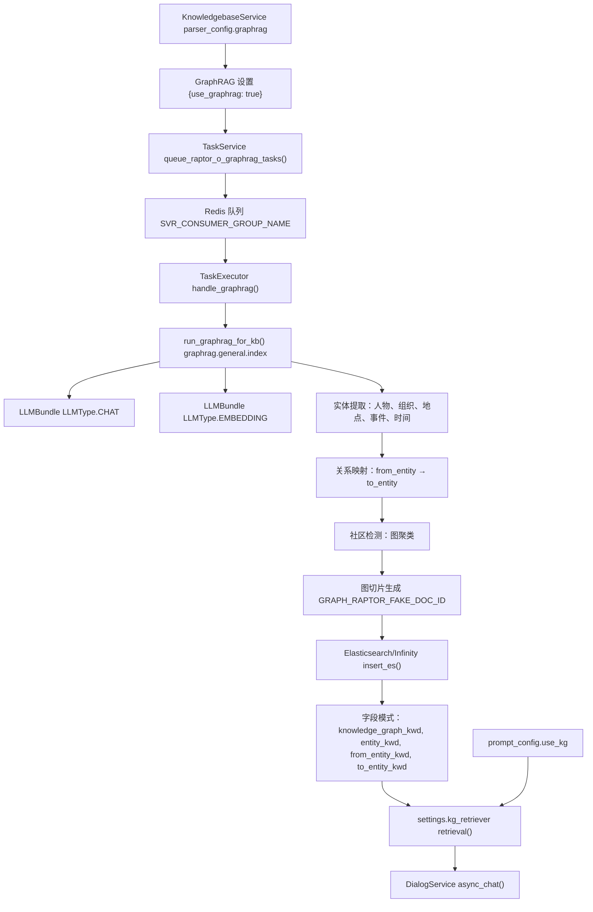

# 6.5 知识图谱构建 (Knowledge Graph Construction)

相关源文件：

- [agent/tools/retrieval.py](https://github.com/infiniflow/ragflow/blob/80a16e71/agent/tools/retrieval.py)
- [api/apps/chunk_app.py](https://github.com/infiniflow/ragflow/blob/80a16e71/api/apps/chunk_app.py)
- [api/db/services/dialog_service.py](https://github.com/infiniflow/ragflow/blob/80a16e71/api/db/services/dialog_service.py)
- [api/db/services/document_service.py](https://github.com/infiniflow/ragflow/blob/80a16e71/api/db/services/document_service.py)
- [rag/nlp/search.py](https://github.com/infiniflow/ragflow/blob/80a16e71/rag/nlp/search.py)
- [rag/svr/task_executor.py](https://github.com/infiniflow/ragflow/blob/80a16e71/rag/svr/task_executor.py)

## 目的与范围 (Purpose and Scope)

本文档介绍了 RAGFlow 的知识图谱构建系统 (GraphRAG)，该系统从文档中提取实体和关系，以创建结构化的图表示，从而通过语义上下文增强检索。有关使用聚类进行分层摘要的信息，请参阅 [RAPTOR 分层摘要 (RAPTOR Hierarchical Summarization)](/zh/6-document-processing-pipeline/6.6-raptor-hierarchical-summarization)。有关通用文档解析和切片策略，请参阅 [文档处理流水线 (Document Processing Pipeline)](/zh/6-document-processing-pipeline)。

GraphRAG 在知识库层面运作，为数据集中的所有文档构建统一的图，以捕捉相互关联的概念、实体及其关系。系统提取结构化信息（人物、组织、地点、事件、时间参考）并将其存储为针对图检索优化的特殊切片。

## 系统架构 (System Architecture)

GraphRAG 的实现采用批处理模型，并集成了 RAGFlow 的任务执行系统：

**图 1：GraphRAG 构建架构**

## 配置与触发 (Configuration and Triggering)

GraphRAG 的构建通过知识库层面的解析配置启用：

**配置模式 (Configuration Schema)**

| 配置字段 | 类型 | 描述 |
| --- | --- | --- |
| `parser_config.graphrag` | `object` | GraphRAG 特定设置 |
| `parser_config.graphrag.use_graphrag` | `boolean` | 启用/禁用图构建（默认：`false`） |
| `kb.embd_id` | `string` | 用于对实体进行向量化的嵌入模型 ID |
| `llm_id` | `string` | 用于实体提取的聊天模型 ID |

**触发构建过程**

GraphRAG 是通过任务队列系统进行的批处理操作：
1. 用户在数据集配置中启用 GraphRAG。
2. `DocumentService.queue_raptor_o_graphrag_tasks()` 创建任务。
3. 任务进入 Redis 队列，类型为 `PipelineTaskType.GRAPH_RAG`。
4. `TaskExecutor.handle_graphrag()` 异步消费并处理任务。
5. 为知识库中的所有文档构建图。

系统使用基于信号量的并发限制器 (`kg_limiter = asyncio.Semaphore(2)`)，以防止在并行构建图时由于大量调用而导致 LLM 服务过载。

## 实体提取与处理流水线 (Entity Extraction and Processing Pipeline)

**提取的实体类型**

基于 LLM 的提取会识别五大主要实体类别：
1.  **人物 (Person)**：个人姓名、角色、头衔。
2.  **组织 (Organization)**：公司、机构、团体。
3.  **地点 (Location)**：地理实体（城市、国家、地标）。
4.  **事件 (Event)**：重大发生、会议、事件。
5.  **时间 (Time)**：时间参考和阶段。

**关系映射 (Relationship Mapping)**

提取的实体通过表示语义关系的定向边连接。每个关系捕捉：
- 源实体 (`from_entity_kwd`)
- 目标实体 (`to_entity_kwd`)
- 关系类型（隐含在上下文中）
- 来自文档切片的共现上下文

## 图结构与存储模式 (Graph Structure and Storage Schema)

GraphRAG 切片存储在文档引擎中，采用与普通文档切片不同的特殊模式：

**图切片字段模式 (Field Schema for Graph Chunks)**

| 字段名 | 类型 | 用途 |
| --- | --- | --- |
| `knowledge_graph_kwd` | `keyword` | 指示图切片类型的标志 |
| `entity_kwd` | `keyword` | 主要实体名称 |
| `from_entity_kwd` | `keyword` | 关系中的源实体 |
| `to_entity_kwd` | `keyword` | 关系中的目标实体 |
| `content_with_weight` | `text` | 实体/关系的文本描述 |
| `q_{N}_vec` | `vector` | 嵌入向量 (维度 N) |
| `kb_id` | `keyword` | 知识库标识符 |
| `doc_id` | `keyword` | 始终设置为 `GRAPH_RAPTOR_FAKE_DOC_ID` |
| `available_int` | `integer` | 可用性标志 (1 = 可用, 0 = 隐藏) |

**特殊文档 ID**

图切片使用合成的文档 ID (`GRAPH_RAPTOR_FAKE_DOC_ID = "graph_raptor_fake"`)，以便将其与普通文档切片区分开。

## 检索集成 (Retrieval Integration)

启用后，基于图的检索会集成到 RAGFlow 的聊天补全流水线中：

**检索实现**

在对话过程中，知识图谱检索器 (`settings.kg_retriever`) 会根据条件被调用。如果启用 `use_kg`，图切片会被插入到上下文的第 0 个位置（最高优先级），确保实体关系信息在 LLM 的上下文窗口中占据显著位置。

## 生命周期管理 (Lifecycle Management)

**批处理构建 vs. 增量更新**

GraphRAG 采用针对性能优化的批处理构建模型：
- **初始构建**：处理数据集中的所有文档。
- **添加文档**：**不会**触发自动重建。
- **手动重建**：用户通过任务队列发起。
- **删除文档**：图切片会保留，直到显式重建。

这种设计选择是为了显著降低构建开销，因为图构建的计算成本非常昂贵。

## 性能特性 (Performance Characteristics)

- **并发控制**：并发图构建任务限制为 2 个，以防止 LLM API 过载。
- **Token 用量追踪**：系统会追踪实体提取和嵌入生成的 Token 消耗。
- **缓存策略**：利用 LLM 缓存系统减少针对类似内容的重复提取。
