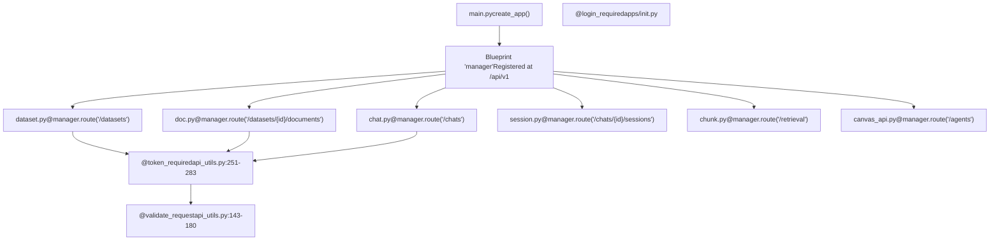
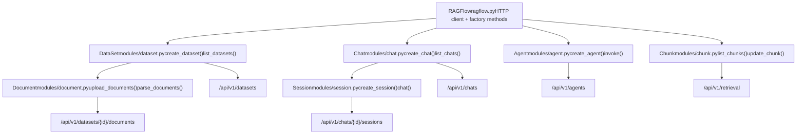
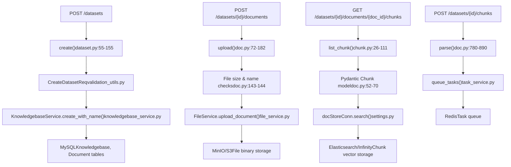
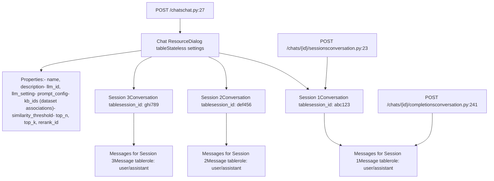
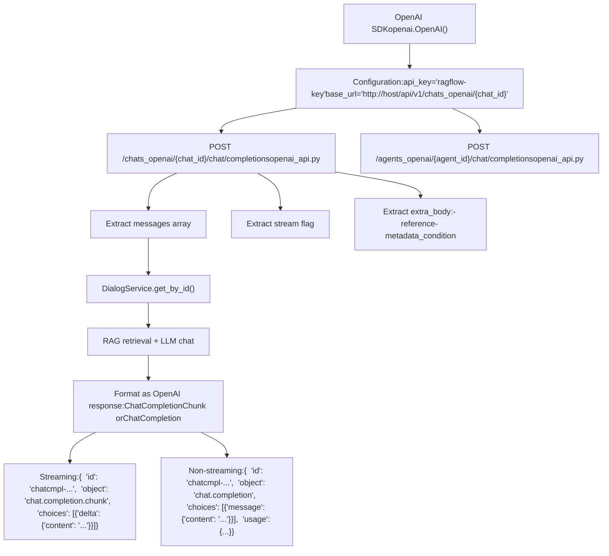

# API 架构与 SDK

相关源文件

-   [admin/client/README.md](https://github.com/infiniflow/ragflow/blob/80a16e71/admin/client/README.md)
-   [admin/client/http_client.py](https://github.com/infiniflow/ragflow/blob/80a16e71/admin/client/http_client.py)
-   [admin/client/parser.py](https://github.com/infiniflow/ragflow/blob/80a16e71/admin/client/parser.py)
-   [admin/client/pyproject.toml](https://github.com/infiniflow/ragflow/blob/80a16e71/admin/client/pyproject.toml)
-   [admin/client/ragflow_cli.py](https://github.com/infiniflow/ragflow/blob/80a16e71/admin/client/ragflow_cli.py)
-   [admin/client/ragflow_client.py](https://github.com/infiniflow/ragflow/blob/80a16e71/admin/client/ragflow_client.py)
-   [admin/client/user.py](https://github.com/infiniflow/ragflow/blob/80a16e71/admin/client/user.py)
-   [admin/server/admin_server.py](https://github.com/infiniflow/ragflow/blob/80a16e71/admin/server/admin_server.py)
-   [admin/server/auth.py](https://github.com/infiniflow/ragflow/blob/80a16e71/admin/server/auth.py)
-   [admin/server/config.py](https://github.com/infiniflow/ragflow/blob/80a16e71/admin/server/config.py)
-   [admin/server/routes.py](https://github.com/infiniflow/ragflow/blob/80a16e71/admin/server/routes.py)
-   [admin/server/services.py](https://github.com/infiniflow/ragflow/blob/80a16e71/admin/server/services.py)
-   [agent/tools/retrieval.py](https://github.com/infiniflow/ragflow/blob/80a16e71/agent/tools/retrieval.py)
-   [api/apps/sdk/chat.py](https://github.com/infiniflow/ragflow/blob/80a16e71/api/apps/sdk/chat.py)
-   [api/apps/sdk/dataset.py](https://github.com/infiniflow/ragflow/blob/80a16e71/api/apps/sdk/dataset.py)
-   [api/apps/sdk/dify_retrieval.py](https://github.com/infiniflow/ragflow/blob/80a16e71/api/apps/sdk/dify_retrieval.py)
-   [api/apps/sdk/doc.py](https://github.com/infiniflow/ragflow/blob/80a16e71/api/apps/sdk/doc.py)
-   [api/apps/sdk/session.py](https://github.com/infiniflow/ragflow/blob/80a16e71/api/apps/sdk/session.py)
-   [api/constants.py](https://github.com/infiniflow/ragflow/blob/80a16e71/api/constants.py)
-   [api/db/services/canvas_service.py](https://github.com/infiniflow/ragflow/blob/80a16e71/api/db/services/canvas_service.py)
-   [api/db/services/conversation_service.py](https://github.com/infiniflow/ragflow/blob/80a16e71/api/db/services/conversation_service.py)
-   [api/db/services/system_settings_service.py](https://github.com/infiniflow/ragflow/blob/80a16e71/api/db/services/system_settings_service.py)
-   [api/ragflow_server.py](https://github.com/infiniflow/ragflow/blob/80a16e71/api/ragflow_server.py)
-   [api/utils/api_utils.py](https://github.com/infiniflow/ragflow/blob/80a16e71/api/utils/api_utils.py)
-   [api/utils/configs.py](https://github.com/infiniflow/ragflow/blob/80a16e71/api/utils/configs.py)
-   [api/utils/health_utils.py](https://github.com/infiniflow/ragflow/blob/80a16e71/api/utils/health_utils.py)
-   [common/connection_utils.py](https://github.com/infiniflow/ragflow/blob/80a16e71/common/connection_utils.py)
-   [conf/system_settings.json](https://github.com/infiniflow/ragflow/blob/80a16e71/conf/system_settings.json)
-   [docs/references/http_api_reference.md](https://github.com/infiniflow/ragflow/blob/80a16e71/docs/references/http_api_reference.md)
-   [docs/references/python_api_reference.md](https://github.com/infiniflow/ragflow/blob/80a16e71/docs/references/python_api_reference.md)
-   [docs/release_notes.md](https://github.com/infiniflow/ragflow/blob/80a16e71/docs/release_notes.md)
-   [rag/advanced_rag/__init__.py](https://github.com/infiniflow/ragflow/blob/80a16e71/rag/advanced_rag/__init__.py)
-   [rag/benchmark.py](https://github.com/infiniflow/ragflow/blob/80a16e71/rag/benchmark.py)
-   [sdk/python/ragflow_sdk/modules/chat.py](https://github.com/infiniflow/ragflow/blob/80a16e71/sdk/python/ragflow_sdk/modules/chat.py)
-   [sdk/python/ragflow_sdk/ragflow.py](https://github.com/infiniflow/ragflow/blob/80a16e71/sdk/python/ragflow_sdk/ragflow.py)

本页介绍了 RAGFlow 基于 Flask 的 HTTP API 架构，包括装饰器模式、响应格式标准以及官方 Python SDK (`ragflow-sdk`)。该 API 通过按功能领域组织的 RESTful 端点，提供了对 RAGFlow 所有功能的程序化访问。

---

## Flask/Quart API 框架结构

RAGFlow 的 API 层构建在 **Quart** 之上，Quart 是 Flask 的一个支持异步的派生版本。API 模块组织在 `api/apps/sdk/` 下，每个模块都在共享的 `manager` 蓝图（Blueprint）上注册路由。

### 蓝图与路由注册模式


每个模块都遵循如下模式：

```
# api/apps/sdk/dataset.py
manager = Blueprint('manager', __name__)

@manager.route("/datasets", methods=["POST"])
@token_required
async def create(tenant_id):
    # tenant_id 由 @token_required 注入
    req = await get_request_json()
    # ... 实现
```
**来源：**

-   [api/apps/sdk/dataset.py55](https://github.com/infiniflow/ragflow/blob/80a16e71/api/apps/sdk/dataset.py#L55-L55)
-   [api/apps/sdk/doc.py72](https://github.com/infiniflow/ragflow/blob/80a16e71/api/apps/sdk/doc.py#L72-L72)
-   [api/apps/sdk/chat.py27](https://github.com/infiniflow/ragflow/blob/80a16e71/api/apps/sdk/chat.py#L27-L27)
-   [api/utils/api_utils.py251-283](https://github.com/infiniflow/ragflow/blob/80a16e71/api/utils/api_utils.py#L251-L283)

---

## 装饰器（Decorator）模式

RAGFlow 使用三个主要的装饰器在 API 端点上强制执行身份验证、验证和授权。

### 身份验证装饰器

#### @token_required - API 密钥身份验证

用于 SDK 或外部 API 访问。验证 `Authorization` 标头中的 Bearer 令牌并注入 `tenant_id`：

```
def token_required(func):
    def get_tenant_id(**kwargs):
        authorization_str = request.headers.get("Authorization")
        if not authorization_str:
            return False, get_json_result(
                data=False,
                message="`Authorization` can't be empty"
            )

        token = authorization_str.split()[1]
        objs = APIToken.query(token=token)
        if not objs:
            return False, get_json_result(
                data=False,
                message="Authentication error: API key is invalid!",
                code=RetCode.AUTHENTICATION_ERROR
            )

        kwargs["tenant_id"] = objs[0].tenant_id
        return True, kwargs

    @wraps(func)
    async def adecorated_function(*args, **kwargs):
        e, kwargs = get_tenant_id(**kwargs)
        if not e:
            return kwargs
        return await func(*args, **kwargs)

    return adecorated_function
```
**来源：**

-   [api/utils/api_utils.py251-283](https://github.com/infiniflow/ragflow/blob/80a16e71/api/utils/api_utils.py#L251-L283)

#### @login_required - 会话（Session）身份验证

用于 Web UI 请求。验证用户会话 cookie：

```
def login_required(func):
    @wraps(func)
    async def decorated_view(*args, **kwargs):
        if not current_user.is_authenticated:
            return get_json_result(
                code=RetCode.UNAUTHORIZED,
                message="Please login first"
            )
        return await func(*args, **kwargs)
    return decorated_view
```
**来源：**

-   [api/apps/__init__.py](https://github.com/infiniflow/ragflow/blob/80a16e71/api/apps/__init__.py)

### 验证装饰器

#### @validate_request - 参数验证

强制要求必需的参数并验证其值：

```
@validate_request("conversation_id", "messages")
async def completion():
    # 确保请求中包含 conversation_id 和 messages
    req = await get_request_json()
    # ... 实现
```
其实现会提取位置参数和关键字参数：

```
def validate_request(*args, **kwargs):
    def process_args(input_arguments):
        no_arguments = []
        error_arguments = []

        # 检查必需的位置参数
        for arg in args:
            if arg not in input_arguments:
                no_arguments.append(arg)

        # 检查具有特定值的必需关键字参数
        for k, v in kwargs.items():
            config_value = input_arguments.get(k, None)
            if config_value is None:
                no_arguments.append(k)
            elif isinstance(v, (tuple, list)):
                if config_value not in v:
                    error_arguments.append((k, set(v)))
            elif config_value != v:
                error_arguments.append((k, v))

        if no_arguments or error_arguments:
            error_string = ""
            if no_arguments:
                error_string += "required argument are missing: {}; ".format(
                    ",".join(no_arguments)
                )
            if error_arguments:
                error_string += "required argument values: {}".format(
                    ",".join(["{}={}".format(a[0], a[1]) for a in error_arguments])
                )
            return error_string
        return None

    def wrapper(func):
        @wraps(func)
        async def decorated_function(*_args, **_kwargs):
            errs = process_args(await get_request_json())
            if errs:
                return get_json_result(
                    code=RetCode.ARGUMENT_ERROR,
                    message=errs
                )
            return await func(*_args, **_kwargs)
        return decorated_function
    return wrapper
```
**来源：**

-   [api/utils/api_utils.py143-180](https://github.com/infiniflow/ragflow/blob/80a16e71/api/utils/api_utils.py#L143-L180)
-   [api/apps/sdk/session.py124](https://github.com/infiniflow/ragflow/blob/80a16e71/api/apps/sdk/session.py#L124-L124)

#### @not_allowed_parameters - 参数黑名单

防止客户端发送特定参数：

```
@not_allowed_parameters("tenant_id", "user_id")
async def update_dataset(tenant_id, dataset_id):
    # 确保客户端无法覆盖 tenant_id 或 user_id
    req = await get_request_json()
    # ... 实现
```
**来源：**

-   [api/utils/api_utils.py183-195](https://github.com/infiniflow/ragflow/blob/80a16e71/api/utils/api_utils.py#L183-L195)

### 装饰器堆叠顺序

装饰器从下到上应用。典型顺序如下：

1.  `@manager.route()` - 注册路由
2.  `@token_required` 或 `@login_required` - 身份验证
3.  `@validate_request()` - 参数验证
4.  `async def handler()` - 端点实现

示例：

```
@manager.route("/chats/<chat_id>/completions", methods=["POST"])
@token_required
@validate_request("question")
async def chat_completion(tenant_id, chat_id):
    # tenant_id 由 @token_required 注入
    # question 由 @validate_request 验证
    req = await get_request_json()
    # ... 实现
```
**来源：**

-   [api/apps/sdk/session.py124-173](https://github.com/infiniflow/ragflow/blob/80a16e71/api/apps/sdk/session.py#L124-L173)

---

## 标准化响应格式

所有 API 端点都使用 `api/utils/api_utils.py` 中的辅助函数返回结构一致的 JSON。

### 响应格式结构

#### 成功响应

```
{
    "code": 0,
    "message": "success",
    "data": { ... }
}
```
由以下函数生成：

```
def get_result(code=0, message="success", data=None):
    return jsonify({"code": code, "message": message, "data": data})
```
#### 错误响应

```
{
    "code": 101,
    "message": "Dataset name 'example' already exists"
}
```
由以下函数生成：

```
def get_error_data_result(code=RetCode.DATA_ERROR, message="Sorry! Data missing!"):
    response = {"code": code, "message": message}
    return jsonify(response)
```
**来源：**

-   [api/utils/api_utils.py286-306](https://github.com/infiniflow/ragflow/blob/80a16e71/api/utils/api_utils.py#L286-L306)

### 错误代码系统

`common/constants.py` 中的 `RetCode` 枚举定义了所有错误代码：

| 代码 | 常量 | 用法 |
| --- | --- | --- |
| 0 | `SUCCESS` | 操作成功完成 |
| 100 | `ARGUMENT_ERROR` | 请求参数无效 |
| 101 | `DATA_ERROR` | 数据验证失败（重复、约束等） |
| 102 | `OPERATING_ERROR` | 操作失败（权限、状态问题） |
| 103 | `AUTHENTICATION_ERROR` | 凭据无效 |
| 401 | `UNAUTHORIZED` | 缺少身份验证 |
| 403 | `FORBIDDEN` | 访问被拒绝 |
| 404 | `NOT_FOUND` | 资源未找到 |
| 500 | `EXCEPTION_ERROR` | 未处理的服务器错误 |

**来源：**

-   [common/constants.py](https://github.com/infiniflow/ragflow/blob/80a16e71/common/constants.py)
-   [docs/references/http_api_reference.md15-27](https://github.com/infiniflow/ragflow/blob/80a16e71/docs/references/http_api_reference.md#L15-L27)

### 异常处理模式

端点使用 try-except 块配合标准化的错误响应：

```
try:
    # 数据库操作
    if not KnowledgebaseService.save(**req):
        return get_error_data_result(message="Failed to create dataset")

    ok, kb = KnowledgebaseService.get_by_id(req["id"])
    if not ok:
        return get_error_data_result(message="Dataset created failed")

    return get_result(data=kb.to_dict())

except OperationalError as e:
    logging.exception(e)
    return get_error_data_result(message="Database operation failed")
```
**来源：**

-   [api/apps/sdk/dataset.py144-154](https://github.com/infiniflow/ragflow/blob/80a16e71/api/apps/sdk/dataset.py#L144-L154)

---

## API 架构与客户端结构

RAGFlow API 系统由三层组成：后端公开的 HTTP REST API、Python SDK 客户端库，以及用于无缝集成的 OpenAI 兼容端点。

### 三层架构

```mermaid
flowchart TD
    PythonSDK["Python SDKragflow_sdk.RAGFlow"]
    DirectHTTP["Direct HTTPcurl, requests"]
    OpenAISDK["OpenAI SDKopenai.OpenAI()"]
    DatasetRoutes["Dataset Routesapi/apps/sdk/dataset.py@manager.route('/datasets')"]
    DocRoutes["Document Routesapi/apps/sdk/doc.py@manager.route('/datasets/{id}/documents')"]
    ChatRoutes["Chat Routesapi/apps/sdk/chat.py@manager.route('/chats')"]
    SessionRoutes["Session Routesapi/apps/sdk/session.py@manager.route('/chats/{id}/sessions')"]
    ChunkRoutes["Chunk Routesapi/apps/sdk/chunk.py@manager.route('/retrieval')"]
    OpenAIRoutes["OpenAI Routesapi/apps/sdk/session.py@manager.route('/chats_openai/{id}')"]
    TokenRequired["@token_requiredValidates Bearer tokenInjects tenant_id"]
    LoginRequired["@login_requiredValidates sessionUses current_user"]
    ValidateRequest["@validate_requestValidates parameters"]
    KBService["KnowledgebaseServiceapi/db/services/knowledgebase_service.py"]
    DocService["DocumentServiceapi/db/services/document_service.py"]
    DialogService["DialogServiceapi/db/services/dialog_service.py"]
    ConvService["ConversationServiceapi/db/services/conversation_service.py"]
    FileService["FileServiceapi/db/services/file_service.py"]
    MySQL["MySQLKnowledgebase, Document,Dialog, Conversation tables"]
    DocStore["DocStoreElasticsearch/InfinityVector + fulltext index"]
    MinIO["MinIO/S3Object storageSTORAGE_IMPL"]
    Redis["RedisTask queueCache"]

    PythonSDK --> DatasetRoutes
    PythonSDK --> DocRoutes
    PythonSDK --> ChatRoutes
    DirectHTTP --> DatasetRoutes
    DirectHTTP --> ChunkRoutes
    OpenAISDK --> OpenAIRoutes
    DatasetRoutes --> TokenRequired
    DocRoutes --> TokenRequired
    ChatRoutes --> TokenRequired
    SessionRoutes --> TokenRequired
    OpenAIRoutes --> TokenRequired
    TokenRequired --> ValidateRequest
    ValidateRequest --> KBService
    ValidateRequest --> DocService
    ValidateRequest --> DialogService
    ValidateRequest --> ConvService
    KBService --> MySQL
    DocService --> MySQL
    DocService --> DocStore
    FileService --> MinIO
    DialogService --> Redis
```


**来源：**

-   [api/apps/sdk/dataset.py55](https://github.com/infiniflow/ragflow/blob/80a16e71/api/apps/sdk/dataset.py#L55-L55)
-   [api/apps/sdk/doc.py72](https://github.com/infiniflow/ragflow/blob/80a16e71/api/apps/sdk/doc.py#L72-L72)
-   [api/apps/sdk/chat.py27](https://github.com/infiniflow/ragflow/blob/80a16e71/api/apps/sdk/chat.py#L27-L27)
-   [api/apps/sdk/session.py49](https://github.com/infiniflow/ragflow/blob/80a16e71/api/apps/sdk/session.py#L49-L49)
-   [api/utils/api_utils.py251-283](https://github.com/infiniflow/ragflow/blob/80a16e71/api/utils/api_utils.py#L251-L283)
-   [api/db/services/knowledgebase_service.py](https://github.com/infiniflow/ragflow/blob/80a16e71/api/db/services/knowledgebase_service.py)
-   [api/db/services/dialog_service.py](https://github.com/infiniflow/ragflow/blob/80a16e71/api/db/services/dialog_service.py)

---

## 身份验证与租户隔离

API 请求使用 Bearer 令牌身份验证，并通过 `@token_required` 装饰器实现自动租户隔离。

### 基于令牌的身份验证流程

> **[Mermaid sequence]**
> *(图表结构无法解析)*

**来源：**

-   [api/utils/api_utils.py251-283](https://github.com/infiniflow/ragflow/blob/80a16e71/api/utils/api_utils.py#L251-L283)
-   [api/db/db_models.py](https://github.com/infiniflow/ragflow/blob/80a16e71/api/db/db_models.py) (APIToken 模型)

### 租户 ID 注入模式

`@token_required` 装饰器会自动将 `tenant_id` 作为关键字参数注入：

```
@manager.route("/datasets", methods=["POST"])
@token_required
async def create(tenant_id):
    # tenant_id 从 API 令牌中自动注入
    req = await get_request_json()

    # 所有服务调用都使用 tenant_id 进行隔离
    e, req = KnowledgebaseService.create_with_name(
        name=req.pop("name"),
        tenant_id=tenant_id,  # 确保多租户隔离
        **req
    )
```
该模式确保了：

-   所有数据库查询都按 `tenant_id` 过滤
-   用户无法访问其他租户的资源
-   处理器中无需手动进行租户 ID 验证

**来源：**

-   [api/apps/sdk/dataset.py55-127](https://github.com/infiniflow/ragflow/blob/80a16e71/api/apps/sdk/dataset.py#L55-L127)
-   [api/utils/api_utils.py251-283](https://github.com/infiniflow/ragflow/blob/80a16e71/api/utils/api_utils.py#L251-L283)

---

## HTTP API 端点组织

HTTP API 将端点组织到各个功能领域中，每个领域都在 `api/apps/sdk/` 下的专用模块中实现。所有端点都遵循 RESTful 约定，并返回带有标准化错误代码的 JSON 响应。

### 端点领域与路由

```mermaid
flowchart TD
    ChatCompletion["POST /chats_openai/{id}/chat/completionsopenai_api.py"]
    AgentCompletion["POST /agents_openai/{id}/chat/completionsopenai_api.py"]
    CreateDataset["POST /datasetsdataset.py:55"]
    ListDatasets["GET /datasetsdataset.py:386"]
    UpdateDataset["PUT /datasets/{id}dataset.py:254"]
    DeleteDatasets["DELETE /datasetsdataset.py:156"]
    GetKG["GET /datasets/{id}/knowledge_graphdataset.py:444"]
    RunGraphRAG["POST /datasets/{id}/run_graphragdataset.py:512"]
    RunRAPTOR["POST /datasets/{id}/run_raptordataset.py:601"]
    UploadDocs["POST /datasets/{id}/documentsdoc.py:72"]
    ListDocs["GET /datasets/{id}/documentsdoc.py:420"]
    UpdateDoc["PUT /datasets/{id}/documents/{doc_id}doc.py:184"]
    DeleteDocs["DELETE /datasets/{id}/documentsdoc.py:670"]
    DownloadDoc["GET /datasets/{id}/documents/{doc_id}doc.py:360"]
    ParseDocs["POST /datasets/{id}/chunksdoc.py:780"]
    ListChunks["GET /datasets/{id}/documents/{doc_id}/chunkschunk.py:26"]
    CreateChunk["POST /datasets/{id}/documents/{doc_id}/chunkschunk.py:175"]
    UpdateChunk["PUT /datasets/{id}/documents/{doc_id}/chunks/{chunk_id}chunk.py:273"]
    DeleteChunk["DELETE /datasets/{id}/documents/{doc_id}/chunkschunk.py:326"]
    RetrieveChunks["POST /retrievalchunk.py:113"]
    CreateChat["POST /chatschat.py:27"]
    ListChats["GET /chatschat.py:271"]
    UpdateChat["PUT /chats/{id}chat.py:144"]
    DeleteChats["DELETE /chatschat.py:229"]
    CreateSession["POST /chats/{id}/sessionsconversation.py:23"]
    ListSessions["GET /chats/{id}/sessionsconversation.py:71"]
    UpdateSession["PUT /chats/{id}/sessions/{session_id}conversation.py:146"]
    DeleteSession["DELETE /chats/{id}/sessions/{session_id}conversation.py:199"]
    Completion["POST /chats/{id}/completionsconversation.py:241"]

    CreateDataset --> UploadDocs
    UploadDocs --> ParseDocs
    ParseDocs --> ListChunks
    ListChunks --> RetrieveChunks
    CreateChat --> CreateSession
    CreateSession --> Completion
```


**来源：**

-   [api/apps/sdk/dataset.py55-700](https://github.com/infiniflow/ragflow/blob/80a16e71/api/apps/sdk/dataset.py#L55-L700)
-   [api/apps/sdk/doc.py72-1400](https://github.com/infiniflow/ragflow/blob/80a16e71/api/apps/sdk/doc.py#L72-L1400)
-   [api/apps/sdk/chunk.py26-400](https://github.com/infiniflow/ragflow/blob/80a16e71/api/apps/sdk/chunk.py#L26-L400)
-   [api/apps/sdk/chat.py27-326](https://github.com/infiniflow/ragflow/blob/80a16e71/api/apps/sdk/chat.py#L27-L326)
-   [api/apps/sdk/conversation.py23-500](https://github.com/infiniflow/ragflow/blob/80a16e71/api/apps/sdk/conversation.py#L23-L500)

### 响应辅助函数

`api/utils/api_utils.py` 模块提供了标准化的响应构建器：

| 函数 | 用途 | 返回结构 |
| --- | --- | --- |
| `get_result(data, code=0)` | 成功响应 | `{"code": 0, "message": "success", "data": ...}` |
| `get_error_data_result(message, code=101)` | 错误响应 | `{"code": 101, "message": "..."}` |
| `get_json_result(code, message, data)` | 通用响应 | `{"code": ..., "message": ..., "data": ...}` |
| `server_error_response(e)` | 异常处理器 | 记录并返回格式化的错误 |

使用模式：

```
# 成功案例
return get_result(data=dataset.to_dict())

# 错误案例
return get_error_data_result(
    message="Dataset name already exists",
    code=RetCode.DATA_ERROR
)
```
**来源：**

-   [api/utils/api_utils.py109-141](https://github.com/infiniflow/ragflow/blob/80a16e71/api/utils/api_utils.py#L109-L141)
-   [api/utils/api_utils.py216-219](https://github.com/infiniflow/ragflow/blob/80a16e71/api/utils/api_utils.py#L216-L219)

---

## Python SDK (`ragflow-sdk`)

`ragflow-sdk` 包在 HTTP API 之上提供了一个面向对象的 Python 接口。SDK 会自动处理身份验证、请求序列化和响应反序列化。

### SDK 客户端初始化

`RAGFlow` 类是管理 HTTP 通信的入口点：

```
from ragflow_sdk import RAGFlow

# 使用 API 密钥和基地址（base URL）初始化客户端
rag = RAGFlow(
    api_key="<YOUR_API_KEY>",
    base_url="http://localhost:9380"
)

# 所有请求都会自动包含 Authorization 标头
# Authorization: Bearer <YOUR_API_KEY>
```
`sdk/python/ragflow_sdk/ragflow.py` 中的实现：

```
class RAGFlow:
    def __init__(self, api_key, base_url, version="v1"):
        self.user_key = api_key
        self.api_url = f"{base_url}/api/{version}"
        self.authorization_header = {
            "Authorization": "Bearer {}".format(self.user_key)
        }

    def post(self, path, json=None, stream=False, files=None):
        return requests.post(
            url=self.api_url + path,
            json=json,
            headers=self.authorization_header,
            stream=stream,
            files=files
        )
```
**来源：**

-   [sdk/python/ragflow_sdk/ragflow.py27-50](https://github.com/infiniflow/ragflow/blob/80a16e71/sdk/python/ragflow_sdk/ragflow.py#L27-L50)

### 资源模块结构


每个模块类：

-   封装单一资源类型
-   维护与服务器同步的本地状态
-   提供调用 HTTP 端点的 CRUD 方法
-   处理请求/响应的序列化

**来源：**

-   [sdk/python/ragflow_sdk/ragflow.py52-288](https://github.com/infiniflow/ragflow/blob/80a16e71/sdk/python/ragflow_sdk/ragflow.py#L52-L288)
-   [sdk/python/ragflow_sdk/modules/dataset.py](https://github.com/infiniflow/ragflow/blob/80a16e71/sdk/python/ragflow_sdk/modules/dataset.py)
-   [sdk/python/ragflow_sdk/modules/chat.py](https://github.com/infiniflow/ragflow/blob/80a16e71/sdk/python/ragflow_sdk/modules/chat.py)
-   [sdk/python/ragflow_sdk/modules/agent.py](https://github.com/infiniflow/ragflow/blob/80a16e71/sdk/python/ragflow_sdk/modules/agent.py)

### SDK 使用模式

#### 工厂方法创建资源

`RAGFlow` 类提供了返回资源对象的工厂方法：

```
# 创建数据集
dataset = rag.create_dataset(
    name="my_knowledge_base",
    chunk_method="naive",
    embedding_model="BAAI/bge-large-zh-v1.5@BAAI"
)
# 返回带有 id、name 等属性的 DataSet 实例

# 创建聊天助手
chat = rag.create_chat(
    name="Customer Support",
    dataset_ids=[dataset.id],
    llm=Chat.LLM(model_name="gpt-4", temperature=0.1)
)
# 返回 Chat 实例
```
#### 实例方法操作资源

资源对象提供了执行操作的方法：

```
# 更新数据集设置
dataset.update({
    "name": "Updated Name",
    "similarity_threshold": 0.3
})

# 上传文档到数据集
dataset.upload_documents([{
    "display_name": "manual.pdf",
    "blob": open("manual.pdf", "rb").read()
}])

# 触发异步解析
dataset.async_parse_documents()

# 列出子资源
documents = dataset.list_documents(page=1, page_size=10)
```
#### 状态同步

资源对象在本地缓存服务器状态。更新方法会刷新缓存属性：

```
dataset = rag.create_dataset(name="test")
print(dataset.chunk_count)  # 0 (初始状态)

# 上传并解析文档...
dataset.async_parse_documents()

# 从服务器刷新状态
dataset_list = rag.list_datasets(id=dataset.id)
dataset = dataset_list[0]
print(dataset.chunk_count)  # 42 (更新后的状态)
```
**来源：**

-   [sdk/python/ragflow_sdk/ragflow.py52-162](https://github.com/infiniflow/ragflow/blob/80a16e71/sdk/python/ragflow_sdk/ragflow.py#L52-L162)
-   [sdk/python/ragflow_sdk/modules/dataset.py](https://github.com/infiniflow/ragflow/blob/80a16e71/sdk/python/ragflow_sdk/modules/dataset.py)

---

## 领域特定 API 实现

每个功能领域都有专门的实现文件处理验证、服务层交互和响应格式化。下图映射了 HTTP 端点与其实现及底层服务之间的关系。

### 数据集与文档领域


**来源：**

-   [api/apps/sdk/dataset.py55-384](https://github.com/infiniflow/ragflow/blob/80a16e71/api/apps/sdk/dataset.py#L55-L384)
-   [api/apps/sdk/doc.py72-890](https://github.com/infiniflow/ragflow/blob/80a16e71/api/apps/sdk/doc.py#L72-L890)
-   [api/apps/sdk/chunk.py26-400](https://github.com/infiniflow/ragflow/blob/80a16e71/api/apps/sdk/chunk.py#L26-L400)
-   [api/utils/validation_utils.py](https://github.com/infiniflow/ragflow/blob/80a16e71/api/utils/validation_utils.py)
-   [api/db/services/knowledgebase_service.py](https://github.com/infiniflow/ragflow/blob/80a16e71/api/db/services/knowledgebase_service.py)
-   [api/db/services/file_service.py](https://github.com/infiniflow/ragflow/blob/80a16e71/api/db/services/file_service.py)
-   [api/db/services/task_service.py](https://github.com/infiniflow/ragflow/blob/80a16e71/api/db/services/task_service.py)

### 数据集管理操作

数据集端点支持完整的 CRUD 操作，并具有用于知识图谱和 RAPTOR 构建的额外功能：

| 操作 | 端点 | 处理器 | 服务方法 |
| --- | --- | --- | --- |
| 创建 | `POST /datasets` | [dataset.py55-155](https://github.com/infiniflow/ragflow/blob/80a16e71/dataset.py#L55-L155) | `KnowledgebaseService.create_with_name()` |
| 列表 | `GET /datasets` | [dataset.py386-469](https://github.com/infiniflow/ragflow/blob/80a16e71/dataset.py#L386-L469) | `KnowledgebaseService.get_list()` |
| 更新 | `PUT /datasets/{id}` | [dataset.py254-384](https://github.com/infiniflow/ragflow/blob/80a16e71/dataset.py#L254-L384) | `KnowledgebaseService.update_by_id()` |
| 删除 | `DELETE /datasets` | [dataset.py156-252](https://github.com/infiniflow/ragflow/blob/80a16e71/dataset.py#L156-L252) | `KnowledgebaseService.delete_by_id()` |
| 获取知识图谱 | `GET /datasets/{id}/knowledge_graph` | [dataset.py444-510](https://github.com/infiniflow/ragflow/blob/80a16e71/dataset.py#L444-L510) | `DocumentService.get_graph()` |
| 构建知识图谱 | `POST /datasets/{id}/run_graphrag` | [dataset.py512-599](https://github.com/infiniflow/ragflow/blob/80a16e71/dataset.py#L512-L599) | `queue_raptor_o_graphrag_tasks()` |
| 构建 RAPTOR | `POST /datasets/{id}/run_raptor` | [dataset.py601-698](https://github.com/infiniflow/ragflow/blob/80a16e71/dataset.py#L601-L698) | `queue_raptor_o_graphrag_tasks()` |

### 文档上传与解析流程

文档处理遵循异步流水线：

1.  **上传**: 二进制文件存储在 MinIO，元数据存储在 MySQL
2.  **排队**: 解析任务连同文档 ID 被加入 Redis 队列
3.  **解析**: TaskExecutor 检索文件，应用分块方法
4.  **索引**: 分块被向量化并存储在文档引擎中

上传处理器在存储前验证文件属性：

```
for file_obj in file_objs:
    if len(file_obj.filename.encode("utf-8")) > FILE_NAME_LEN_LIMIT:
        return get_result(
            message=f"File name must be {FILE_NAME_LEN_LIMIT} bytes or less.",
            code=RetCode.ARGUMENT_ERROR
        )
```
**来源：**

-   [api/apps/sdk/doc.py72-182](https://github.com/infiniflow/ragflow/blob/80a16e71/api/apps/sdk/doc.py#L72-L182)
-   [api/apps/sdk/doc.py780-890](https://github.com/infiniflow/ragflow/blob/80a16e71/api/apps/sdk/doc.py#L780-L890)
-   [api/db/services/file_service.py](https://github.com/infiniflow/ragflow/blob/80a16e71/api/db/services/file_service.py)
-   [api/db/services/task_service.py](https://github.com/infiniflow/ragflow/blob/80a16e71/api/db/services/task_service.py)

### 分块检索与管理

分块操作提供了对已解析文档段的底层访问：

| 操作 | 端点 | 关键参数 |
| --- | --- | --- |
| 列出分块 | `GET /datasets/{id}/documents/{doc_id}/chunks` | `keywords`、`page`、`page_size` |
| 创建分块 | `POST /datasets/{id}/documents/{doc_id}/chunks` | `content`、`important_keywords`、`questions` |
| 更新分块 | `PUT /datasets/{id}/documents/{doc_id}/chunks/{chunk_id}` | `content`、`available`、`important_keywords` |
| 删除分块 | `DELETE /datasets/{id}/documents/{doc_id}/chunks` | `chunk_ids` (数组) |
| 检索（搜索） | `POST /retrieval` | `question`、`dataset_ids`、`similarity_threshold` |

分块（Chunk）模型使用 Pydantic 验证：

```
class Chunk(BaseModel):
    id: str = ""
    content: str = ""
    document_id: str = ""
    important_keywords: list = Field(default_factory=list)
    questions: list = Field(default_factory=list)
    positions: list[list[int]] = Field(default_factory=list)

    @validator("positions")
    def validate_positions(cls, value):
        for sublist in value:
            if len(sublist) != 5:
                raise ValueError("Each sublist must have length 5")
        return value
```
**来源：**

-   [api/apps/sdk/chunk.py26-400](https://github.com/infiniflow/ragflow/blob/80a16e71/api/apps/sdk/chunk.py#L26-L400)
-   [api/apps/sdk/doc.py52-70](https://github.com/infiniflow/ragflow/blob/80a16e71/api/apps/sdk/doc.py#L52-L70)

---

## 聊天与对话 API

聊天领域将聊天助手配置（无状态）与对话会话（有状态）分离开来。这种架构允许每个聊天助手拥有多个并发会话，同时保持对话历史的隔离。

### 聊天（Chat）与会话（Session）的区别


**来源：**

-   [api/apps/sdk/chat.py27-326](https://github.com/infiniflow/ragflow/blob/80a16e71/api/apps/sdk/chat.py#L27-L326)
-   [api/apps/sdk/conversation.py23-500](https://github.com/infiniflow/ragflow/blob/80a16e71/api/apps/sdk/conversation.py#L23-L500)
-   [api/db/services/dialog_service.py](https://github.com/infiniflow/ragflow/blob/80a16e71/api/db/services/dialog_service.py)
-   [api/db/services/conversation_service.py](https://github.com/infiniflow/ragflow/blob/80a16e71/api/db/services/conversation_service.py)

### 聊天助手创建

创建聊天需要指定数据集、LLM 配置和提示词设置：

```
# Python SDK 示例
chat = rag.create_chat(
    name="Customer Support",
    dataset_ids=["dataset_id_1", "dataset_id_2"],
    llm=Chat.LLM(
        model_name="gpt-4",
        temperature=0.1,
        top_p=0.3,
        max_tokens=512
    ),
    prompt=Chat.Prompt(
        similarity_threshold=0.2,
        keywords_similarity_weight=0.7,
        top_n=8,
        prompt="You are a helpful assistant..."
    )
)
```
HTTP 端点会验证各数据集之间嵌入模型的一致性：

```
kbs = KnowledgebaseService.get_by_ids(req.get("kb_ids", []))
embd_ids = [TenantLLMService.split_model_name_and_factory(kb.embd_id)[0]
            for kb in kbs]
embd_count = list(set(embd_ids))
if len(embd_count) > 1:
    return get_result(
        message='Datasets use different embedding models."',
        code=RetCode.AUTHENTICATION_ERROR
    )
```
**来源：**

-   [api/apps/sdk/chat.py27-142](https://github.com/infiniflow/ragflow/blob/80a16e71/api/apps/sdk/chat.py#L27-L142)
-   [sdk/python/ragflow_sdk/ragflow.py110-162](https://github.com/infiniflow/ragflow/blob/80a16e71/sdk/python/ragflow_sdk/ragflow.py#L110-L162)

### 会话管理与消息流

每个会话都维护着隔离的对话状态：

| 会话属性 | 类型 | 用途 |
| --- | --- | --- |
| `id` | 字符串 | 唯一的会话标识符 |
| `name` | 字符串 | 用户定义的会话名称 |
| `messages` | 数组 | 完整的消息历史 |
| `chat_id` | 字符串 | 所属聊天助手的引用 |
| `user_id` | 字符串 | 多用户场景下的可选用户标识符 |

完成（completion）端点处理消息并返回流式或非流式响应：

**流式响应：**

```
data: {"answer": "Hello", "reference": {...}}
data: {"answer": " there", "reference": {...}}
data: {"answer": "!", "reference": {...}}
data: [DONE]
```
**非流式响应：**

```
{
    "code": 0,
    "data": {
        "answer": "Hello there!",
        "reference": {
            "chunks": [...],
            "doc_aggs": {...}
        }
    }
}
```
**来源：**

-   [api/apps/sdk/conversation.py241-500](https://github.com/infiniflow/ragflow/blob/80a16e71/api/apps/sdk/conversation.py#L241-L500)
-   [docs/references/http_api_reference.md1700-2000](https://github.com/infiniflow/ragflow/blob/80a16e71/docs/references/http_api_reference.md#L1700-L2000)

---

## OpenAI 兼容 API 端点

RAGFlow 提供了与 OpenAI 聊天完成 API 接受相同请求格式的兼容端点，从而能够与现有的 OpenAI SDK 客户端无缝集成。

### OpenAI 兼容层


**来源：**

-   [docs/references/http_api_reference.md28-173](https://github.com/infiniflow/ragflow/blob/80a16e71/docs/references/http_api_reference.md#L28-L173)
-   [docs/references/python_api_reference.md37-97](https://github.com/infiniflow/ragflow/blob/80a16e71/docs/references/python_api_reference.md#L37-L97)

### OpenAI API 请求格式

RAGFlow 接受标准的 OpenAI 请求参数，并在 `extra_body` 中支持可选扩展：

```
# 对 RAGFlow 使用 OpenAI SDK
from openai import OpenAI

client = OpenAI(
    api_key="ragflow-api-key",
    base_url="http://localhost:9380/api/v1/chats_openai/<chat_id>"
)

completion = client.chat.completions.create(
    model="model",  # 由 RAGFlow 自动解析
    messages=[
        {"role": "user", "content": "What is RAGFlow?"}
    ],
    stream=True,
    extra_body={
        "reference": True,  # 包含来源引用
        "metadata_condition": {  # 按元数据过滤
            "logic": "and",
            "conditions": [{
                "name": "author",
                "comparison_operator": "is",
                "value": "John Doe"
            }]
        }
    }
)
```
### 响应格式映射

RAGFlow 将内部响应转换为 OpenAI 格式：

| RAGFlow 字段 | OpenAI 字段 | 备注 |
| --- | --- | --- |
| `answer` | `choices[0].message.content` | 生成的文本 |
| `reference.chunks` | `choices[0].delta.reference` (流式) | 自定义扩展 |
| `reference.chunks` | `choices[0].message.reference` (非流式) | 自定义扩展 |
| 令牌计数 | `usage.prompt_tokens`、`usage.completion_tokens` | 标准用法统计 |

`reference` 字段是一个 RAGFlow 扩展，包含检索到的分块及其相似度分数：

```
{
    "reference": {
        "chunks": {
            "20": {
                "id": "chunk_id",
                "content": "Source text...",
                "document_id": "doc_id",
                "document_name": "file.pdf",
                "similarity": 0.85,
                "positions": [[12, 11, 11, 11, 11]]
            }
        },
        "doc_aggs": {
            "file.pdf": {
                "doc_name": "file.pdf",
                "doc_id": "doc_id",
                "count": 3
            }
        }
    }
}
```
**来源：**

-   [docs/references/http_api_reference.md80-163](https://github.com/infiniflow/ragflow/blob/80a16e71/docs/references/http_api_reference.md#L80-L163)
-   [api/utils/api_utils.py419-461](https://github.com/infiniflow/ragflow/blob/80a16e71/api/utils/api_utils.py#L419-L461)

---

## 请求验证与错误处理

API 使用 Pydantic 模型和自定义验证器实现了全面的验证。请求验证发生在执行服务层之前，确保早期错误检测和一致的错误响应。

### 验证架构

| 验证层 | 实现方式 | 示例 |
| --- | --- | --- |
| Pydantic 模型 | `validation_utils.py` | `CreateDatasetReq`、`UpdateDatasetReq` |
| 自定义验证器 | `@validator` 装饰器 | 字段约束、格式验证 |
| 业务逻辑检查 | 服务方法 | 重复名称检查、权限验证 |
| 数据库约束 | ORM 模型 | 外键验证、唯一约束 |

### 验证流程示例

```
# validation_utils.py
class CreateDatasetReq(BaseModel):
    name: str
    chunk_method: Optional[str] = "naive"
    embedding_model: Optional[str] = None

    @validator("name")
    def validate_name(cls, v):
        if not v or len(v.strip()) == 0:
            raise ValueError("Dataset name cannot be empty")
        if len(v.encode("utf-8")) > 128:
            raise ValueError("Dataset name too long (max 128 bytes)")
        return v.strip()

    @validator("chunk_method")
    def validate_chunk_method(cls, v):
        valid_methods = {"naive", "manual", "qa", "table", ...}
        if v not in valid_methods:
            raise ValueError(f"Invalid chunk_method: {v}")
        return v

# 端点用法
@manager.route("/datasets", methods=["POST"])
@token_required
async def create(tenant_id):
    req, err = await validate_and_parse_json_request(request, CreateDatasetReq)
    if err is not None:
        return get_error_argument_result(err)
    # 继续处理经过验证的数据...
```
**来源：**

-   [api/utils/validation_utils.py](https://github.com/infiniflow/ragflow/blob/80a16e71/api/utils/validation_utils.py)
-   [api/apps/sdk/dataset.py119-127](https://github.com/infiniflow/ragflow/blob/80a16e71/api/apps/sdk/dataset.py#L119-L127)
-   [api/utils/api_utils.py323-324](https://github.com/infiniflow/ragflow/blob/80a16e71/api/utils/api_utils.py#L323-L324)

### 标准错误响应

所有验证错误和运行时错误都返回结构化的 JSON：

```
{
    "code": 100,
    "message": "Dataset name cannot be empty"
}
```
常见错误场景及其代码：

| 场景 | 代码 | 消息模式 |
| --- | --- | --- |
| 缺少必需字段 | 100 | "`field_name` is required" |
| 字段值无效 | 100 | "Invalid `field_name`: ..." |
| 资源重复 | 101 | "Resource with name '...' already exists" |
| 资源未找到 | 102 | "Resource not found" |
| 权限被拒绝 | 102 | "You don't own the resource" |
| 数据库错误 | 500 | "Database operation failed" |

**来源：**

-   [docs/references/http_api_reference.md12-24](https://github.com/infiniflow/ragflow/blob/80a16e71/docs/references/http_api_reference.md#L12-L24)
-   [api/utils/api_utils.py309-333](https://github.com/infiniflow/ragflow/blob/80a16e71/api/utils/api_utils.py#L309-L333)

---

## Python SDK 实现详情

Python SDK 使用一种一致的模式，其中每种资源类型（数据集、聊天、Agent）都由一个类表示，该类维护状态并提供操作方法。所有 HTTP 通信都通过父级 `RAGFlow` 实例进行。

### 资源类模式

每个 SDK 模块都遵循如下结构：

```
# modules/dataset.py
class DataSet:
    def __init__(self, rag, res):
        self.rag = rag  # 对 RAGFlow 客户端的引用
        self.id = res.get("id")
        self.name = res.get("name")
        # ... 其他属性

    def update(self, update_message: dict):
        res = self.rag.put(f"/datasets/{self.id}", update_message)
        res = res.json()
        if res.get("code") != 0:
            raise Exception(res["message"])
        # 更新本地状态
        for k, v in update_message.items():
            setattr(self, k, v)

    def upload_documents(self, document_list: list[dict]):
        # 准备多部分表单数据（multipart form data）
        files = [("file", (doc["display_name"], doc["blob"]))
                 for doc in document_list]
        res = self.rag.post(f"/datasets/{self.id}/documents", files=files)
        # ... 处理响应
```
### 属性同步

资源对象维护服务器状态的本地副本。更新操作会同步属性：

1.  **读穿透（Read-through）**: 属性访问返回本地缓存的值
2.  **写穿透（Write-through）**: 更新方法调用 API 并刷新本地状态
3.  **懒加载（Lazy loading）**: 相关对象（如文档）按需加载

### 嵌套资源管理

父资源提供子资源的工厂方法：

```
# DataSet 提供文档管理功能
dataset = rag.create_dataset(name="kb")

# 上传操作返回更新后的数据集状态
dataset.upload_documents([{"display_name": "doc.pdf", "blob": b"..."}])

# 列表操作返回 Document 对象
docs = dataset.list_documents(page=1, page_size=10)

# 文档操作
doc = docs[0]
doc.update({"parser_config": {"chunk_token_num": 256}})
doc.download()  # 返回字节流
```
**来源：**

-   [sdk/python/ragflow_sdk/modules/dataset.py](https://github.com/infiniflow/ragflow/blob/80a16e71/sdk/python/ragflow_sdk/modules/dataset.py)
-   [sdk/python/ragflow_sdk/modules/document.py](https://github.com/infiniflow/ragflow/blob/80a16e71/sdk/python/ragflow_sdk/modules/document.py)
-   [sdk/python/ragflow_sdk/modules/chunk.py](https://github.com/infiniflow/ragflow/blob/80a16e71/sdk/python/ragflow_sdk/modules/chunk.py)

---

## 特殊用途端点

除了标准的 CRUD 操作外，API 还为检索测试、元数据过滤和 Dify 兼容性等高级功能提供了专用端点。

### 检索测试

检索端点允许在不创建聊天的情况下测试 RAG 搜索：

```
POST /api/v1/retrieval
Content-Type: application/json
Authorization: Bearer <token>

{
    "question": "What is RAGFlow?",
    "dataset_ids": ["dataset_id_1"],
    "document_ids": ["doc_id_1", "doc_id_2"],  # 可选过滤器
    "similarity_threshold": 0.2,
    "vector_similarity_weight": 0.3,
    "top_k": 1024,
    "page": 1,
    "page_size": 30,
    "metadata_condition": {
        "logic": "and",
        "conditions": [{
            "name": "author",
            "comparison_operator": "is",
            "value": "John"
        }]
    }
}
```
返回带有相似度分数和元数据的分块数组。

**来源：**

-   [api/apps/sdk/chunk.py113-173](https://github.com/infiniflow/ragflow/blob/80a16e71/api/apps/sdk/chunk.py#L113-L173)
-   [docs/references/http_api_reference.md2200-2350](https://github.com/infiniflow/ragflow/blob/80a16e71/docs/references/http_api_reference.md#L2200-L2350)

### 元数据过滤

文档支持用于过滤的任意 JSON 元数据：

```
# 设置文档元数据
PUT /api/v1/datasets/{id}/documents/{doc_id}
{
    "meta_fields": {
        "author": "Jane Doe",
        "department": "Engineering",
        "sensitivity": "public"
    }
}

# 使用元数据过滤器进行查询
POST /api/v1/retrieval
{
    "dataset_ids": ["dataset_id"],
    "question": "...",
    "metadata_condition": {
        "logic": "and",
        "conditions": [
            {"name": "department", "comparison_operator": "is", "value": "Engineering"},
            {"name": "sensitivity", "comparison_operator": "is_not", "value": "confidential"}
        ]
    }
}
```
支持的比较运算符：

| 运算符 | 含义 |
| --- | --- |
| `is` | 精确匹配 |
| `is_not` | 不等于 |
| `contains` | 子串匹配 |
| `not_contains` | 不包含 |
| `greater_than` | 数值 > |
| `less_than` | 数值 < |

**来源：**

-   [api/apps/sdk/doc.py255-258](https://github.com/infiniflow/ragflow/blob/80a16e71/api/apps/sdk/doc.py#L255-L258)
-   [common/metadata_utils.py](https://github.com/infiniflow/ragflow/blob/80a16e71/common/metadata_utils.py)

### Dify 兼容检索

RAGFlow 提供了 Dify 兼容端点，用于与 Dify 工作流集成：

```
POST /api/v1/dify/retrieval
Authorization: Bearer <api_key>

{
    "knowledge_id": "dataset_id",
    "query": "What is RAGFlow?",
    "use_kg": false,
    "retrieval_setting": {
        "score_threshold": 0.0,
        "top_k": 1024
    },
    "metadata_condition": {...}
}
```
返回 Dify 格式的记录：

```
{
    "records": [{
        "content": "RAGFlow is...",
        "score": 0.85,
        "title": "document.pdf",
        "metadata": {"doc_id": "...", "author": "..."}
    }]
}
```
**来源：**

-   [api/apps/sdk/dify_retrieval.py29-183](https://github.com/infiniflow/ragflow/blob/80a16e71/api/apps/sdk/dify_retrieval.py#L29-L183)

---

## API 工具与辅助函数

`api/utils/api_utils.py` 模块提供了跨所有 API 端点使用的共享工具，以确保行为一致。

### 关键工具函数

| 函数 | 用途 | 用法 |
| --- | --- | --- |
| `token_required` | 身份验证装饰器 | 所有 SDK 路由上的 `@token_required` |
| `get_result()` | 成功响应格式化程序 | 返回 `{"code": 0, "data": ...}` |
| `get_error_data_result()` | 错误响应格式化程序 | 返回 `{"code": 101, "message": "..."}` |
| `get_parser_config()` | 默认解析器配置生成器 | 提供分块方法默认值 |
| `deep_merge()` | 递归字典合并 | 将用户配置与默认值合并 |
| `verify_embedding_availability()` | 模型验证 | 检查模型是否存在且可访问 |
| `check_duplicate_ids()` | 去重 | 从列表中移除重复 ID |

### 配置合并

`get_parser_config()` 函数通过将用户设置与特定方法的默认值合并，生成完整的解析器配置：

```
def get_parser_config(chunk_method, parser_config):
    base_defaults = {
        "table_context_size": 0,
        "image_context_size": 0,
    }

    key_mapping = {
        "naive": {
            "layout_recognize": "DeepDOC",
            "chunk_token_num": 512,
            "delimiter": "\n",
            "raptor": {"use_raptor": True, ...},
            "graphrag": {"use_graphrag": True, ...}
        },
        "qa": {"raptor": {"use_raptor": False}, ...},
        # ... 其他方法
    }

    default_config = key_mapping[chunk_method]
    if not parser_config:
        return deep_merge(base_defaults, default_config)
    return deep_merge(deep_merge(base_defaults, default_config), parser_config)
```
这确保了所有必需配置字段都存在，同时允许用户进行覆盖。

**来源：**

-   [api/utils/api_utils.py341-417](https://github.com/infiniflow/ragflow/blob/80a16e71/api/utils/api_utils.py#L341-L417)

### OpenAI 响应格式化

`get_data_openai()` 辅助函数格式化 RAGFlow 响应以匹配 OpenAI 的 API 规范：

```
def get_data_openai(id, model, content, finish_reason,
                    prompt_tokens=0, completion_tokens=0,
                    stream=False):
    if stream:
        return {
            "id": f"chatcmpl-{id}",
            "object": "chat.completion.chunk",
            "model": model,
            "choices": [{
                "delta": {"content": content},
                "finish_reason": finish_reason,
                "index": 0
            }]
        }

    return {
        "id": f"chatcmpl-{id}",
        "object": "chat.completion",
        "model": model,
        "choices": [{
            "message": {"role": "assistant", "content": content},
            "finish_reason": finish_reason,
            "index": 0
        }],
        "usage": {
            "prompt_tokens": prompt_tokens,
            "completion_tokens": completion_tokens,
            "total_tokens": prompt_tokens + completion_tokens
        }
    }
```
**来源：**

-   [api/utils/api_utils.py419-461](https://github.com/infiniflow/ragflow/blob/80a16e71/api/utils/api_utils.py#L419-L461)
