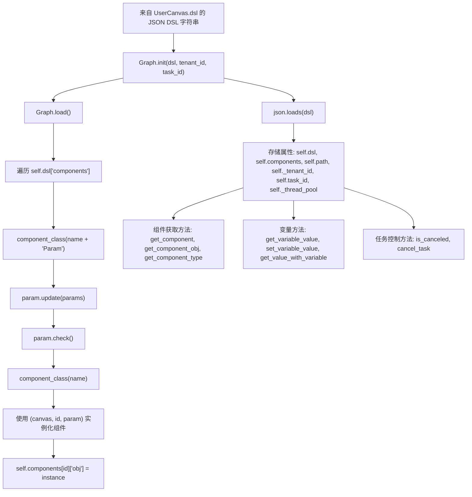
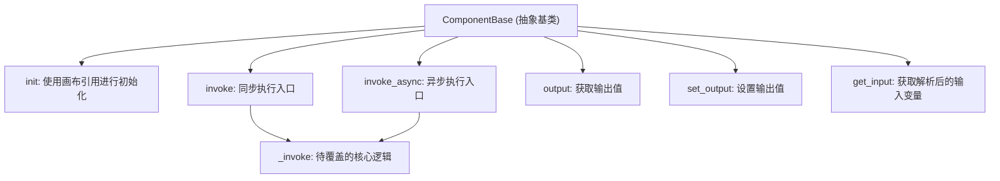

# 9 智能体与工作流系统 (Agent and Workflow System)

相关源文件：

- [agent/canvas.py](https://github.com/infiniflow/ragflow/blob/80a16e71/agent/canvas.py)
- [agent/component/agent_with_tools.py](https://github.com/infiniflow/ragflow/blob/80a16e71/agent/component/agent_with_tools.py)
- [agent/component/base.py](https://github.com/infiniflow/ragflow/blob/80a16e71/agent/component/base.py)
- [agent/component/categorize.py](https://github.com/infiniflow/ragflow/blob/80a16e71/agent/component/categorize.py)
- [agent/component/llm.py](https://github.com/infiniflow/ragflow/blob/80a16e71/agent/component/llm.py)
- [agent/tools/base.py](https://github.com/infiniflow/ragflow/blob/80a16e71/agent/tools/base.py)
- [agent/tools/retrieval.py](https://github.com/infiniflow/ragflow/blob/80a16e71/agent/tools/retrieval.py)
- [api/apps/api_app.py](https://github.com/infiniflow/ragflow/blob/80a16e71/api/apps/api_app.py)
- [api/apps/canvas_app.py](https://github.com/infiniflow/ragflow/blob/80a16e71/api/apps/canvas_app.py)
- [api/apps/sdk/chat.py](https://github.com/infiniflow/ragflow/blob/80a16e71/api/apps/sdk/chat.py)
- [api/apps/sdk/dataset.py](https://github.com/infiniflow/ragflow/blob/80a16e71/api/apps/sdk/dataset.py)
- [api/apps/sdk/dify_retrieval.py](https://github.com/infiniflow/ragflow/blob/80a16e71/api/apps/sdk/dify_retrieval.py)
- [api/apps/sdk/doc.py](https://github.com/infiniflow/ragflow/blob/80a16e71/api/apps/sdk/doc.py)
- [api/apps/sdk/session.py](https://github.com/infiniflow/ragflow/blob/80a16e71/api/apps/sdk/session.py)
- [api/db/services/canvas_service.py](https://github.com/infiniflow/ragflow/blob/80a16e71/api/db/services/canvas_service.py)
- [api/db/services/conversation_service.py](https://github.com/infiniflow/ragflow/blob/80a16e71/api/db/services/conversation_service.py)
- [api/utils/api_utils.py](https://github.com/infiniflow/ragflow/blob/80a16e71/api/utils/api_utils.py)
- [docs/references/http_api_reference.md](https://github.com/infiniflow/ragflow/blob/80a16e71/docs/references/http_api_reference.md)
- [docs/references/python_api_reference.md](https://github.com/infiniflow/ragflow/blob/80a16e71/docs/references/python_api_reference.md)
- [docs/release_notes.md](https://github.com/infiniflow/ragflow/blob/80a16e71/docs/release_notes.md)
- [rag/advanced_rag/__init__.py](https://github.com/infiniflow/ragflow/blob/80a16e71/rag/advanced_rag/__init__.py)
- [rag/benchmark.py](https://github.com/infiniflow/ragflow/blob/80a16e71/rag/benchmark.py)
- [rag/prompts/generator.py](https://github.com/infiniflow/ragflow/blob/80a16e71/rag/prompts/generator.py)
- [sdk/python/ragflow_sdk/modules/chat.py](https://github.com/infiniflow/ragflow/blob/80a16e71/sdk/python/ragflow_sdk/modules/chat.py)
- [sdk/python/ragflow_sdk/ragflow.py](https://github.com/infiniflow/ragflow/blob/80a16e71/sdk/python/ragflow_sdk/ragflow.py)
- [web/src/components/knowledge-base-item.tsx](https://github.com/infiniflow/ragflow/blob/80a16e71/web/src/components/knowledge-base-item.tsx)
- [web/src/interfaces/request/flow.ts](https://github.com/infiniflow/ragflow/blob/80a16e71/web/src/interfaces/request/flow.ts)

智能体与工作流系统提供了一个可视化的、基于 DSL 的编排引擎，用于构建复杂的 AI 工作流。它允许用户通过将组件（LLM、检索、智能体、分类等）连接成有向图来组合多步流程，并支持状态管理、变量解析和流式输出的异步执行。该系统为 RAGFlow 的智能体能力和自定义工作流自动化提供了核心动力。

有关与工作流集成的文档检索功能，请参阅[检索与 RAG 系统](/zh/10-retrieval-and-rag-system)。有关组件使用的 LLM 供应商集成，请参阅[LLM 集成系统](/zh/5-llm-integration-system)。

---

## 画布与图架构 (Canvas and Graph Architecture)

工作流系统围绕两个核心类构建：`Graph`（基础编排器）和 `Canvas`（针对智能体的扩展）。

### DSL 结构 (DSL Structure)

工作流定义为包含组件、连接和状态的 JSON DSL。DSL 存储在 `UserCanvas` 数据库记录的 `dsl` 字段中，并由 `Graph` 和 `Canvas` 类加载。

```json
{
  "components": {
    "begin": {
      "obj": {
        "component_name": "Begin",
        "params": {}
      },
      "downstream": ["retrieval_0"],
      "upstream": []
    },
    "retrieval_0": {
      "obj": {
        "component_name": "Retrieval",
        "params": {"kb_ids": ["kb-123"]}
      },
      "downstream": ["generate_0"],
      "upstream": ["begin"]
    }
  },
  "history": [],
  "path": ["begin"],
  "retrieval": {"chunks": {}, "doc_aggs": {}},
  "globals": {
    "sys.query": "",
    "sys.user_id": "tenant_id",
    "sys.conversation_turns": 0,
    "sys.files": []
  },
  "variables": {
    "api_key": {"type": "string", "value": ""},
    "threshold": {"type": "number", "value": 0.8}
  },
  "memory": []
}
```

**DSL 生命周期：**
- **存储**：MySQL 中的 `UserCanvas.dsl` 字段（JSON 或序列化字符串）。
- **加载**：`Graph.__init__(dsl: str)` → `json.loads(dsl)` → `Graph.load()`。
- **组件实例化**：`component_class(name)` 工厂函数。
- **序列化**：`Graph.__str__()` → `json.dumps(dsl)` → 保存回数据库。

### Graph 类 (Graph Class)

`Graph` 类 (`agent/canvas.py`) 提供了核心的工作流编排：



**核心方法 (Graph 类)：**
- `__init__`：解析 DSL，创建 `ThreadPoolExecutor(max_workers=5)`。
- `load()`：实例化并校验所有组件。
- `get_variable_value(exp)`：解析 `{sys.*}`、`{env.*}` 或 `{cpn_id@var}` 表达式。
- `cancel_task()`：通过 Redis 设置取消标志。

### Canvas 类 (Canvas Class)

`Canvas` 继承自 `Graph`，增加了针对智能体的状态管理和执行逻辑：

```python
class Canvas(Graph):
    def __init__(self, dsl: str, tenant_id, task_id, canvas_id):
        self.globals = {
            "sys.query": "",
            "sys.user_id": tenant_id,
            "sys.conversation_turns": 0,
            "sys.files": []
        }
        self.variables = {}  # 来自 DSL 的用户定义 env.* 变量
        super().__init__(dsl, tenant_id, task_id)
        self._id = canvas_id
```

**Canvas 特有状态：**
- `self.history`：对话历史元组。
- `self.retrieval`：每轮检索到的切片/文档。
- `self.memory`：情节记忆（Episodic memory）元组。
- `self.variables`：变量定义（类型、值、描述）。

---

## 组件系统 (Component System)

### ComponentBase 抽象基类 (Abstract Base Class)

所有工作流组件均继承自 `ComponentBase` (`agent/component/base.py`)：



### 组件参数 (ComponentParamBase)

参数对象定义了组件的配置和 I/O 模式，支持参数校验（`check()`）和递归更新（`update()`）。

---

## 变量解析系统 (Variable Resolution System)

系统支持三类变量：
- `sys.*`：系统变量（如 `sys.query`, `sys.user_id`）。
- `env.*`：环境/用户变量。
- `{cpn_id}@{field}`：组件输出变量。

变量通过正则表达式模式匹配，并支持通过点号（`.`）访问嵌套路径，例如 `{retrieval_0@chunks.0.content}`。

---

## 执行引擎 (Execution Engine)

### 异步批量执行 (Async Batch Execution)

`Canvas.run()` 方法编排组件的异步执行并生成流式 SSE 事件：
1. **初始化**：生成 `message_id`，更新全局变量。
2. **批量运行**：使用 `asyncio.gather` 并行执行当前批次的组件。
3. **后处理**：处理 `Message` 组件的流式输出，应用错误处理，并根据逻辑扩展执行路径（分支、循环等）。
4. **流式支持**：支持 `<think>` 标签识别、自动引用检测及可选的 TTS 语音合成。

---

## 内置组件概览 (Built-in Components Overview)

系统通过工厂模式动态加载组件。常见操作符类别包括：
- **基础 (Foundation)**：`Begin`, `Retrieval`, `Agent` (ReAct)。
- **对话 (Dialog)**：`Message`, `UserFillUp`。
- **流控 (Flow Control)**：`Categorize`, `Switch`, `Iteration`, `Loop`。
- **数据操作 (Data Manipulation)**：`Code`, `DataOperations`, `VariableAssigner`。
- **工具 (Tools)**：`ExeSQL`, `DuckDuckGo`, `GitHub`, `TavilySearch`, `Email`, `Crawler` 等。

---

## 智能体组件与 ReAct 循环 (Agent Component and ReAct Loop)

`Agent` 组件实现了 **ReAct (Reasoning + Acting)** 循环进行工具编排：
1. **分析任务**：理解目标及可用工具。
2. **规划下一步**：LLM 决定要调用的工具。
3. **并发执行工具**：支持组件化工具和 **MCP (Model Context Protocol)** 服务工具。
4. **反思与生成**：构建观测结果（Observation）并更新对话历史，直到任务完成。

---

## 总结 (Summary)

智能体与工作流系统提供了一个灵活的、基于 DSL 的编排引擎，具有以下核心特点：
- **可视化架构**：基于 ReactFlow 的前端编辑器与 Python 后端 `Graph/Canvas` 模型紧密结合。
- **高性能执行**：利用线程池与 `asyncio` 实现组件的并行执行和流式响应。
- **强大的智能体能力**：内置 ReAct 循环和对 MCP 协议的支持，使智能体能够动态利用外部工具。
- **灵活的变量系统**：支持跨组件的数据流转和复杂的嵌套路径解析。
