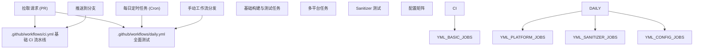
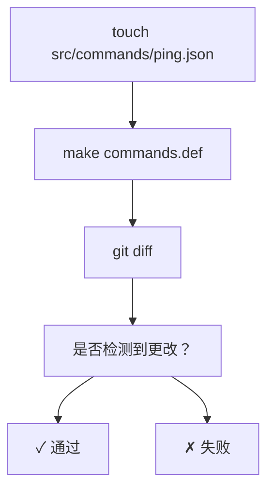
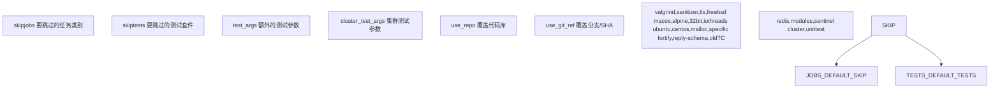
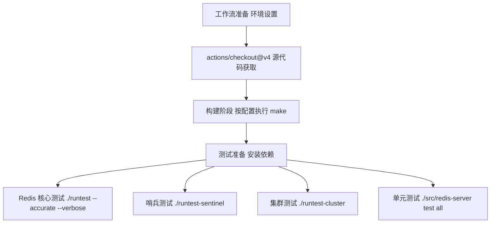
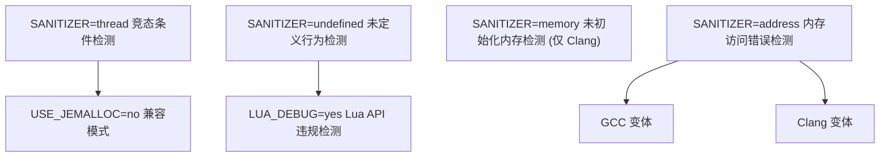
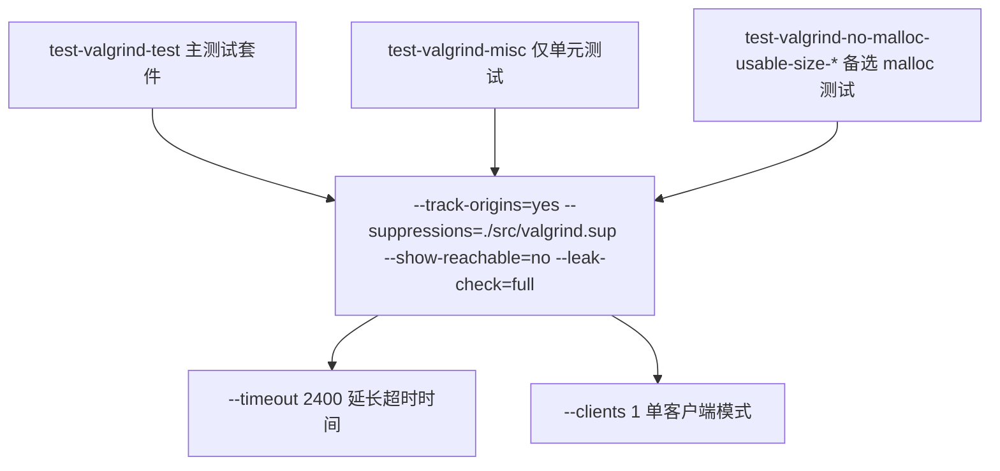
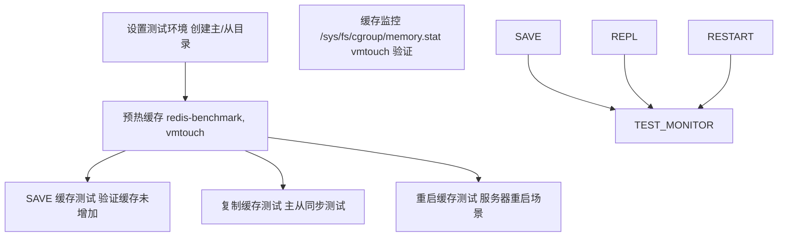

# 持续集成 (CI)

相关源文件

-   [.github/workflows/ci.yml](https://github.com/redis/redis/blob/8ad54215/.github/workflows/ci.yml)
-   [.github/workflows/daily.yml](https://github.com/redis/redis/blob/8ad54215/.github/workflows/daily.yml)
-   [.gitignore](https://github.com/redis/redis/blob/8ad54215/.gitignore)
-   [deps/Makefile](https://github.com/redis/redis/blob/8ad54215/deps/Makefile)
-   [deps/fast\_float/Makefile](https://github.com/redis/redis/blob/8ad54215/deps/fast_float/Makefile)
-   [deps/fast\_float/README.md](https://github.com/redis/redis/blob/8ad54215/deps/fast_float/README.md)
-   [deps/fast\_float/fast\_float.h](https://github.com/redis/redis/blob/8ad54215/deps/fast_float/fast_float.h)
-   [deps/fast\_float/fast\_float\_strtod.cpp](https://github.com/redis/redis/blob/8ad54215/deps/fast_float/fast_float_strtod.cpp)
-   [deps/fast\_float/fast\_float\_strtod.h](https://github.com/redis/redis/blob/8ad54215/deps/fast_float/fast_float_strtod.h)

本文描述了 Redis 使用 GitHub Actions 实现的自动持续集成 (CI) 系统。该 CI 系统通过跨多个平台、配置和构建目标进行的全面测试，确保代码在合并前具备良好的质量。

有关构建系统和编译过程的信息，请参阅[构建系统与依赖](/redis/redis/10.1-build-system-and-dependencies)。有关测试框架本身的详细信息，请参阅[测试框架](/redis/redis/10.2-testing-framework)。

## CI 架构概览

Redis 使用 GitHub Actions，具有两个提供不同级别测试覆盖率的主要工作流文件：



**来源：** [.github/workflows/ci.yml1-103](https://github.com/redis/redis/blob/8ad54215/.github/workflows/ci.yml#L1-L103) [.github/workflows/daily.yml1-30](https://github.com/redis/redis/blob/8ad54215/.github/workflows/daily.yml#L1-L30)

## 主要 CI 工作流

主要的 CI 工作流在每次推送和拉取请求时运行，为常见的开发场景提供快速反馈：

### 基础 CI 任务

| 任务名称 | 目的 | 关键操作 |
| --- | --- | --- |
| `test-ubuntu-latest` | 标准构建与测试 | `make`, `runtest --tags -slow` |
| `test-sanitizer-address` | 地址 Sanitizer 测试 | `SANITIZER=address`, 基础测试套件 |
| `build-debian-old` | 旧版兼容性 | 在 Debian Buster 上构建 |
| `build-macos-latest` | macOS 兼容性 | 带 TLS 支持的构建 |
| `build-32bit` | 32 位架构 | `make 32bit` |
| `build-libc-malloc` | 备选分配器 | `MALLOC=libc` |
| `build-centos-jemalloc` | 企业级 Linux | CentOS Stream 9 构建 |
| `build-old-chain-jemalloc` | 旧版工具链 | GCC 4.8 兼容性 |

### 命令定义验证

CI 工作流包含一个关键的验证步骤，确保命令定义保持同步：



**来源：** [.github/workflows/ci.yml7-25](https://github.com/redis/redis/blob/8ad54215/.github/workflows/ci.yml#L7-L25) [.github/workflows/ci.yml19-24](https://github.com/redis/redis/blob/8ad54215/.github/workflows/ci.yml#L19-L24)

## 每日全面工作流

每日工作流提供了带有可配置任务执行的详尽测试覆盖：

### 工作流配置

每日工作流支持通过输入参数进行细粒度控制：



**来源：** [.github/workflows/daily.yml11-29](https://github.com/redis/redis/blob/8ad54215/.github/workflows/daily.yml#L11-L29)

### 测试执行矩阵

每日工作流运行庞大的测试配置矩阵：

| 配置类别 | 任务 | 关键变体 |
| --- | --- | --- |
| **标准构建** | `test-ubuntu-jemalloc` | 默认 jemalloc 构建 |
| **内存分配器** | `test-ubuntu-libc-malloc`, `test-ubuntu-no-malloc-usable-size` | libc malloc 变体 |
| **架构** | `test-ubuntu-32bit` | 带有 multilib 的 32 位构建 |
| **安全** | `test-ubuntu-jemalloc-fortify` | `_FORTIFY_SOURCE=3` 加固 |
| **TLS 支持** | `test-ubuntu-tls`, `test-ubuntu-tls-no-tls` | 启用/禁用 TLS 模式 |
| **线程** | `test-ubuntu-io-threads` | I/O 线程配置 |
| **内存分析** | `test-valgrind-*` | Valgrind 内存检查 |
| **Sanitizer** | `test-sanitizer-*` | 地址、内存、UBSan、TSan |
| **平台** | `test-centos-*`, `test-macos-latest` | 多平台测试 |

**来源：** [.github/workflows/daily.yml34-1003](https://github.com/redis/redis/blob/8ad54215/.github/workflows/daily.yml#L34-L1003)

## 测试套件执行流水线

每个 CI 任务都遵循一致的执行模式：



### 通用测试依赖

大多数任务需要以下标准依赖项：

-   `tcl8.6` - 测试控制语言运行时。
-   `tclx` - 扩展的 Tcl 命令。
-   `tcl-tls` - Tcl 的 TLS 支持 (用于 TLS 构建)。
-   `procps-ng` - 进程实用程序。
-   `gcc`/`g++` - 编译工具链。

**来源：** [.github/workflows/daily.yml57-70](https://github.com/redis/redis/blob/8ad54215/.github/workflows/daily.yml#L57-L70) [.github/workflows/daily.yml242-244](https://github.com/redis/redis/blob/8ad54215/.github/workflows/daily.yml#L242-L244)

## Sanitizer 测试策略

Redis 采用多种 Sanitizer 来检测不同类别的 bug：



### Sanitizer 特定配置

-   **AddressSanitizer**: 检测缓冲区溢出、释放后使用 (use-after-free) 和内存泄漏。
-   **MemorySanitizer**: 需要 Clang，检测未初始化内存的读取。
-   **UndefinedBehaviorSanitizer**: 通过 `LUA_DEBUG=yes` 包含 Lua C API 违规检测。
-   **ThreadSanitizer**: 由于兼容性问题禁用 jemalloc，并使用 `io-threads` 配置。

**来源：** [.github/workflows/daily.yml532-703](https://github.com/redis/redis/blob/8ad54215/.github/workflows/daily.yml#L532-L703)

## 内存测试与验证

### Valgrind 集成

Valgrind 测试提供了全面的内存分析：



### 缓存回收测试

一项专门的测试用于验证 Redis 是否能正确回收文件系统缓存：



**来源：** [.github/workflows/daily.yml330-407](https://github.com/redis/redis/blob/8ad54215/.github/workflows/daily.yml#L330-L407)

## 平台与环境覆盖

### 多平台测试

CI 系统在不同的操作系统和架构上进行测试：

| 平台 | 容器/运行器 | 关键特性 |
| --- | --- | --- |
| Ubuntu 最新版 | `ubuntu-latest` | 主要开发平台 |
| CentOS Stream 9 | `quay.io/centos/centos:stream9` | 企业级 Linux 兼容性 |
| macOS 最新版 | `macos-latest` | macOS 兼容性 |
| 32 位 Linux | 带有 multilib 的 Ubuntu | 架构兼容性 |
| 旧版 Debian | `debian:buster` | 向后兼容性 |
| 旧版工具链 | 带有 GCC 4.8 的 Ubuntu 20.04 | 旧版编译器支持 |

### TLS 配置测试

TLS 支持在多种配置下进行测试：

-   **全量 TLS**: `BUILD_TLS=yes`，通过 `./utils/gen-test-certs.sh` 生成证书。
-   **TLS 模块**: `BUILD_TLS=module` 用于动态 TLS 加载。
-   **混合模式**: 对开启 TLS 的构建版本在启用和未启用 TLS 协议的情况下进行测试。

**来源：** [.github/workflows/daily.yml218-827](https://github.com/redis/redis/blob/8ad54215/.github/workflows/daily.yml#L218-L827) [.github/workflows/ci.yml38-103](https://github.com/redis/redis/blob/8ad54215/.github/workflows/ci.yml#L38-L103)

## 质量保证集成

### 将构建警告视为错误

所有构建都使用 `-Werror` 将警告视为编译错误，从而确保代码质量：

```
make REDIS_CFLAGS='-Werror -DREDIS_TEST'
```

### 调试断言

关键构建版本包含用于额外运行时检查的调试断言：

```
make SANITIZER=address REDIS_CFLAGS='-Werror -DDEBUG_ASSERTIONS'
```

### 测试覆盖选项

可以使用各种标志位配置测试：

-   `--accurate`: 更彻底但较慢的测试。
-   `--verbose`: 详细的测试输出。
-   `--dump-logs`: 失败时保留测试日志。
-   `--tls`: 启用 TLS 协议测试。
-   `--valgrind`: 内存分析模式。
-   `--timeout 2400`: 针对慢速测试的延长超时时间。

**来源：** [.github/workflows/ci.yml14](https://github.com/redis/redis/blob/8ad54215/.github/workflows/ci.yml#L14-L14) [.github/workflows/daily.yml55](https://github.com/redis/redis/blob/8ad54215/.github/workflows/daily.yml#L55-L55) [.github/workflows/daily.yml436](https://github.com/redis/redis/blob/8ad54215/.github/workflows/daily.yml#L436-L436)
