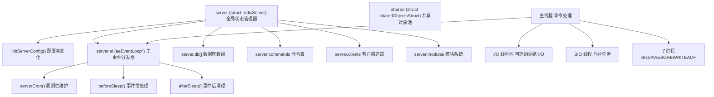
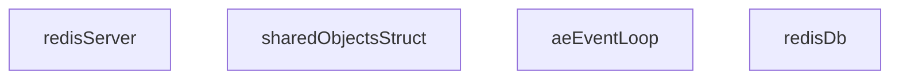
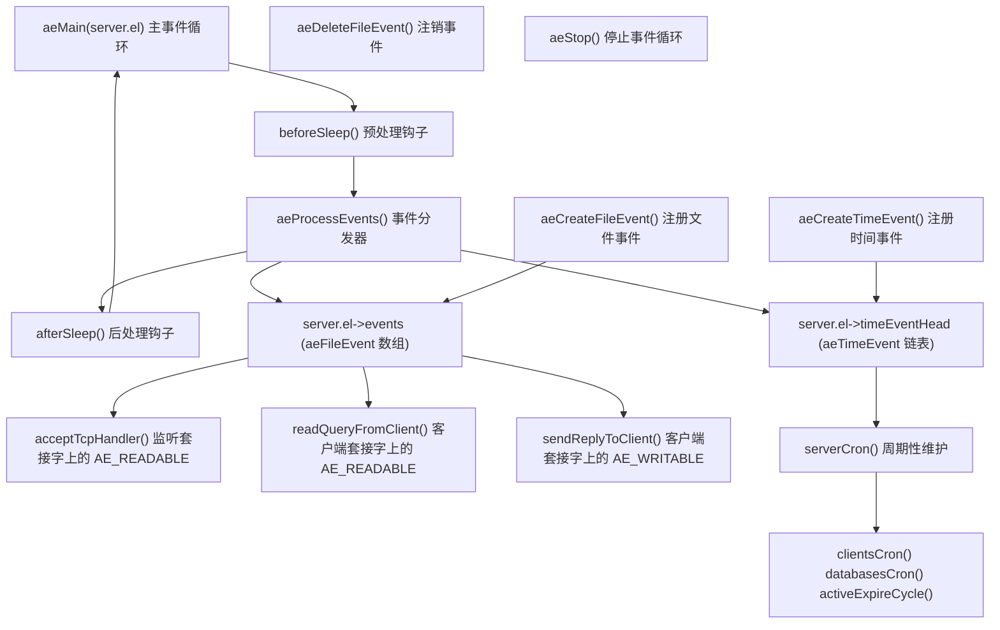
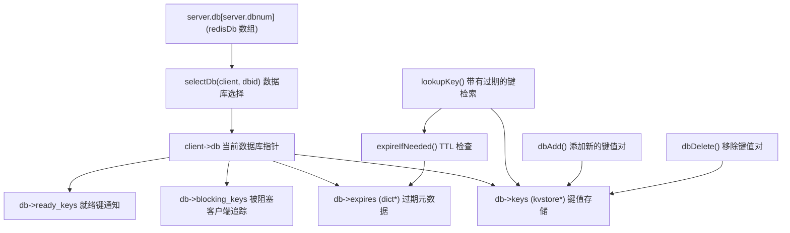
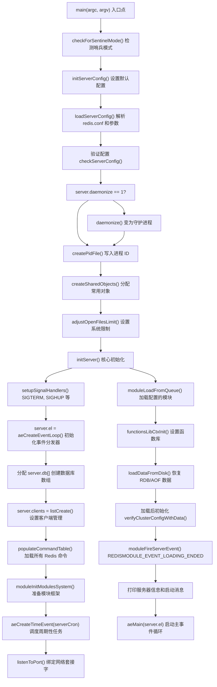
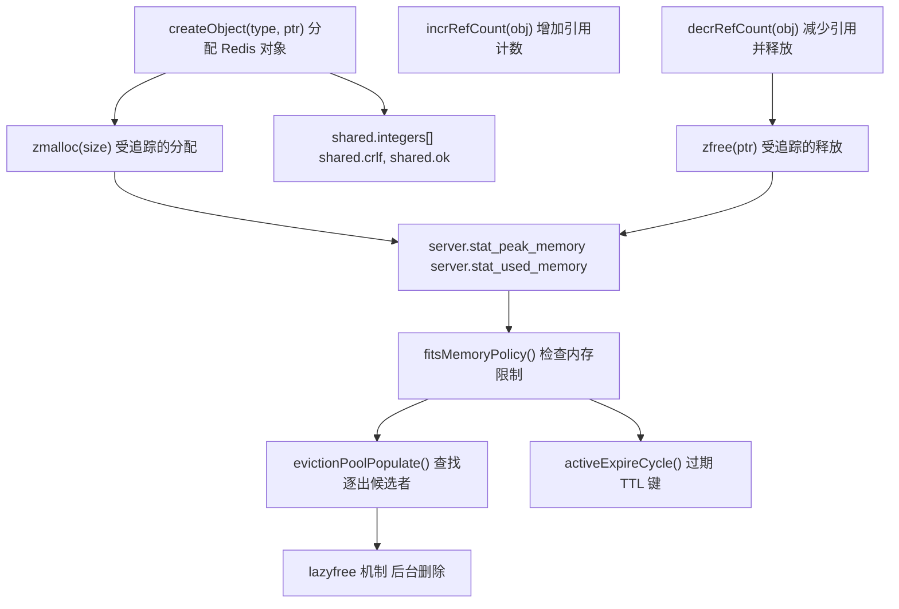
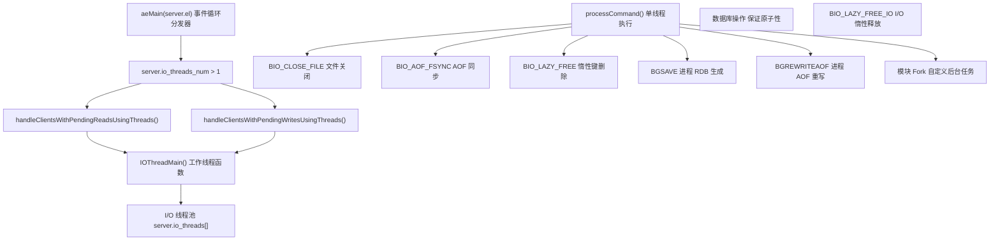
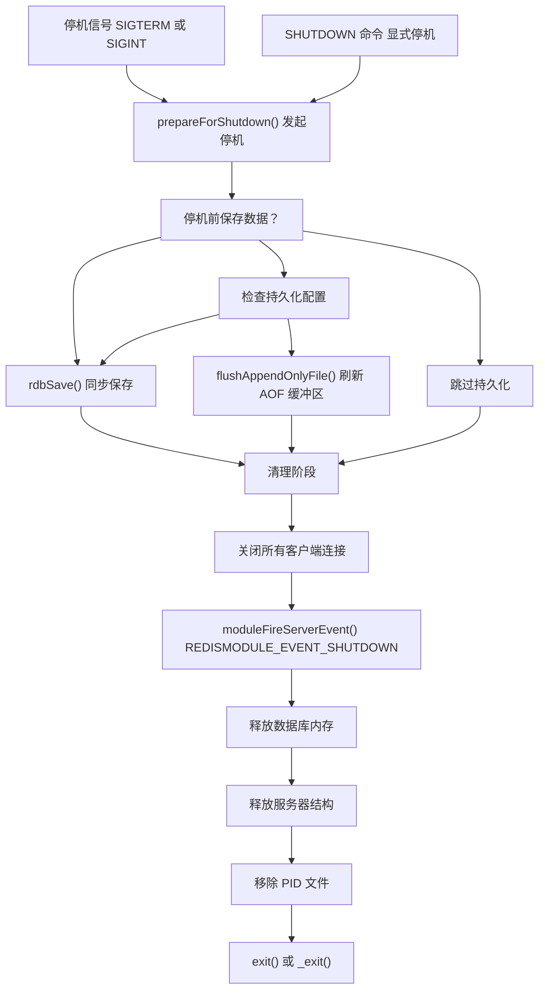
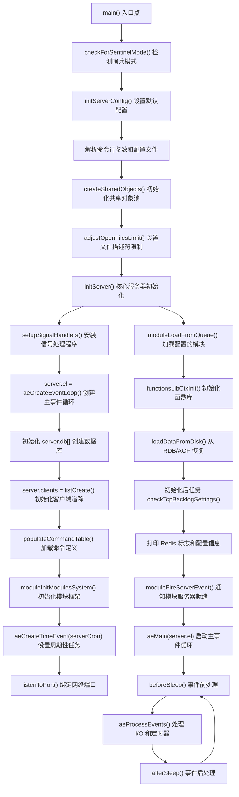

# 服务器架构与生命周期

相关源文件

-   [redis.conf](https://github.com/redis/redis/blob/8ad54215/redis.conf)
-   [src/aof.c](https://github.com/redis/redis/blob/8ad54215/src/aof.c)
-   [src/config.c](https://github.com/redis/redis/blob/8ad54215/src/config.c)
-   [src/db.c](https://github.com/redis/redis/blob/8ad54215/src/db.c)
-   [src/debug.c](https://github.com/redis/redis/blob/8ad54215/src/debug.c)
-   [src/module.c](https://github.com/redis/redis/blob/8ad54215/src/module.c)
-   [src/networking.c](https://github.com/redis/redis/blob/8ad54215/src/networking.c)
-   [src/object.c](https://github.com/redis/redis/blob/8ad54215/src/object.c)
-   [src/rdb.c](https://github.com/redis/redis/blob/8ad54215/src/rdb.c)
-   [src/replication.c](https://github.com/redis/redis/blob/8ad54215/src/replication.c)
-   [src/server.c](https://github.com/redis/redis/blob/8ad54215/src/server.c)
-   [src/server.h](https://github.com/redis/redis/blob/8ad54215/src/server.h)
-   [tests/unit/introspection.tcl](https://github.com/redis/redis/blob/8ad54215/tests/unit/introspection.tcl)

本文涵盖了 Redis 服务器架构，重点介绍了服务器初始化、全局状态管理、事件循环基础设施以及完整的服务器生命周期。这一基础架构支持了 Redis 从启动到停机的所有操作。

## 服务器架构概览

Redis 作为一个事件驱动的服务器运行，使用单个主线程进行命令处理，并支持可选的 I/O 线程。其架构核心在于全局变量 `server`，它在整个服务器生命周期中协调所有子系统。

### 核心基础设施组件

**来源：** [src/server.c79](https://github.com/redis/redis/blob/8ad54215/src/server.c#L79-L79)（全局服务器变量），[src/server.c69](https://github.com/redis/redis/blob/8ad54215/src/server.c#L69-L69)（共享对象），[src/server.h1920-2100](https://github.com/redis/redis/blob/8ad54215/src/server.h#L1920-L2100)（struct redisServer），[src/server.c1200-1400](https://github.com/redis/redis/blob/8ad54215/src/server.c#L1200-L1400)（serverCron），[src/server.c1465-1555](https://github.com/redis/redis/blob/8ad54215/src/server.c#L1465-L1555)（beforeSleep）

## 全局服务器状态管理

定义在 [src/server.c80](https://github.com/redis/redis/blob/8ad54215/src/server.c#L80-L80) 的 `server` 全局变量是所有 Redis 操作的核心协调点。这个 `struct redisServer` 实例维护了完整的服务器状态，并在整个服务器生命周期内协调各子系统的交互。

### 服务器状态结构

### 状态管理函数

| 函数 | 用途 | 阶段 | 文件位置 |
| --- | --- | --- | --- |
| `initServerConfig()` | 初始化配置默认值 | 启动 | [src/server.c2880-3178](https://github.com/redis/redis/blob/8ad54215/src/server.c#L2880-L3178) |
| `createSharedObjects()` | 分配共享对象池 | 启动 | [src/server.c1080-1120](https://github.com/redis/redis/blob/8ad54215/src/server.c#L1080-L1120) |
| `initServer()` | 初始化核心服务器结构 | 启动 | [src/server.c3220-3550](https://github.com/redis/redis/blob/8ad54215/src/server.c#L3220-L3550) |
| `resetServerStats()` | 重置统计计数器 | 运行时 | [src/server.c1725-1780](https://github.com/redis/redis/blob/8ad54215/src/server.c#L1725-L1780) |
| `updateCachedTime()` | 更新缓存的时间 | 运行时 | [src/server.c1200-1220](https://github.com/redis/redis/blob/8ad54215/src/server.c#L1200-L1220) |
| `prepareForShutdown()` | 优雅停机准备 | 停机 | [src/server.c3800-3900](https://github.com/redis/redis/blob/8ad54215/src/server.c#L3800-L3900) |

### 服务器配置状态

| 配置类别 | 关键变量 | 描述 |
| --- | --- | --- |
| 网络 | `port`, `bindaddr`, `tcp_backlog` | 网络绑定配置 |
| 持久化 | `aof_state`, `saveparams`, `rdb_filename` | 数据持久化设置 |
| 内存 | `maxmemory`, `maxmemory_policy` | 内存管理配置 |
| 复制 | `masterhost`, `replid`, `master_repl_offset` | 复制状态 |
| 集群 | `cluster_enabled`, `cluster_node_timeout` | 集群配置 |
| 安全 | `requirepass`, `acl_users` | 身份验证设置 |

**来源：** [src/server.h1920-2800](https://github.com/redis/redis/blob/8ad54215/src/server.h#L1920-L2800)（struct redisServer），[src/server.c69](https://github.com/redis/redis/blob/8ad54215/src/server.c#L69-L69)（共享对象结构体），[src/server.c2880-3178](https://github.com/redis/redis/blob/8ad54215/src/server.c#L2880-L3178)（initServerConfig），[src/server.c1080-1120](https://github.com/redis/redis/blob/8ad54215/src/server.c#L1080-L1120)（createSharedObjects）

## 事件循环基础设施

事件循环基础设施使用 `ae` 库实现，提供跨平台的多路复用 I/O。位于 `server.el` 的主事件循环同时处理文件事件（网络 I/O）和时间事件（周期性维护）。

### 事件循环架构

### 事件循环配置与控制

| 设置项 | 默认值 | 用途 | 位置 |
| --- | --- | --- | --- |
| `server.hz` | 10 | `serverCron` 频率 (Hz) | [src/server.h123](https://github.com/redis/redis/blob/8ad54215/src/server.h#L123-L123) |
| `server.el->maxfd` | 动态 | 最大文件描述符 | 事件循环初始化 |
| `server.el->setsize` | `server.maxclients + CONFIG_FDSET_INCR` | 事件集大小 | [src/server.c3350-3400](https://github.com/redis/redis/blob/8ad54215/src/server.c#L3350-L3400) |
| `server.cronloops` | 0 | Cron 执行计数器 | [src/server.c1200-1300](https://github.com/redis/redis/blob/8ad54215/src/server.c#L1200-L1300) |

### 核心事件处理函数

| 函数 | 用途 | 触发时机 | 文件引用 |
| --- | --- | --- | --- |
| `beforeSleep()` | 处理等待写入、惰性过期 | 每次轮询前 | [src/server.c1465-1555](https://github.com/redis/redis/blob/8ad54215/src/server.c#L1465-L1555) |
| `afterSleep()` | 后处理清理 | 每次轮询后 | [src/server.c1575-1585](https://github.com/redis/redis/blob/8ad54215/src/server.c#L1575-L1585) |
| `serverCron()` | 周期性维护任务 | 每 `1000/server.hz` 毫秒 | [src/server.c1200-1450](https://github.com/redis/redis/blob/8ad54215/src/server.c#L1200-L1450) |
| `handleClientsWithPendingWrites()` | 优化客户端 I/O | 在 `beforeSleep()` 中 | [src/networking.c4186-4264](https://github.com/redis/redis/blob/8ad54215/src/networking.c#L4186-L4264) |
| `processEventsWhileBlocked()` | 阻塞操作期间的事件处理 | 特殊情况 | [src/server.c5154-5200](https://github.com/redis/redis/blob/8ad54215/src/server.c#L5154-L5200) |

**来源：** [src/server.c1465-1555](https://github.com/redis/redis/blob/8ad54215/src/server.c#L1465-L1555)（beforeSleep），[src/server.c1200-1450](https://github.com/redis/redis/blob/8ad54215/src/server.c#L1200-L1450)（serverCron），[src/server.c3350-3400](https://github.com/redis/redis/blob/8ad54215/src/server.c#L3350-L3400)（事件循环初始化），[src/networking.c4186-4264](https://github.com/redis/redis/blob/8ad54215/src/networking.c#L4186-L4264)（等待写入处理）

## 核心基础设施组件

Redis 服务器基础设施包括几个关键子系统，它们支持主事件循环并在整个生命周期内维护服务器状态。

### 数据库与存储基础设施

### 命令系统基础设施

| 组件 | 用途 | 位置 |
| --- | --- | --- |
| `server.commands` | 命令查找表 | [src/server.c2100-2200](https://github.com/redis/redis/blob/8ad54215/src/server.c#L2100-L2200) |
| `server.orig_commands` | 原始命令备份 | [src/server.c2250-2300](https://github.com/redis/redis/blob/8ad54215/src/server.c#L2250-L2300) |
| `populateCommandTable()` | 初始化命令定义 | [src/server.c2400-2500](https://github.com/redis/redis/blob/8ad54215/src/server.c#L2400-L2500) |
| `lookupCommand()` | 按名称查找命令 | [src/server.c3050-3100](https://github.com/redis/redis/blob/8ad54215/src/server.c#L3050-L3100) |
| `struct redisCommand` | 命令元数据结构 | [src/server.h2100-2200](https://github.com/redis/redis/blob/8ad54215/src/server.h#L2100-L2200) |

### 模块系统基础设施

| 组件 | 用途 | 位置 |
| --- | --- | --- |
| `server.modules` | 已加载模块注册表 | [src/module.c79](https://github.com/redis/redis/blob/8ad54215/src/module.c#L79-L79) |
| `server.loadmodule_queue` | 启动时加载的模块队列 | [src/server.c3500-3550](https://github.com/redis/redis/blob/8ad54215/src/server.c#L3500-L3550) |
| `moduleLoadFromQueue()` | 加载队列中的模块 | [src/module.c1500-1600](https://github.com/redis/redis/blob/8ad54215/src/module.c#L1500-L1600) |
| `moduleFireServerEvent()` | 通知模块服务器事件 | [src/module.c1800-1900](https://github.com/redis/redis/blob/8ad54215/src/module.c#L1800-L1900) |

**来源：** [src/db.c198-253](https://github.com/redis/redis/blob/8ad54215/src/db.c#L198-L253)（lookupKey），[src/db.c1100-1200](https://github.com/redis/redis/blob/8ad54215/src/db.c#L1100-L1200)（数据库操作），[src/server.c2400-2500](https://github.com/redis/redis/blob/8ad54215/src/server.c#L2400-L2500)（命令表），[src/module.c79](https://github.com/redis/redis/blob/8ad54215/src/module.c#L79-L79)（模块系统）

## 服务器初始化生命周期

Redis 服务器初始化遵循精确的序列，在进入主事件循环之前建立所有核心基础设施。

### 初始化流程

### 初始化阶段详情

| 阶段 | 关键函数 | 用途 |
| --- | --- | --- |
| 配置 | `initServerConfig()`, `loadServerConfig()` | 建立服务器设置 |
| 进程设置 | `daemonize()`, `createPidFile()` | 进程管理 |
| 对象池 | `createSharedObjects()` | 预分配常用对象 |
| 核心基础设施 | `initServer()` | 初始化所有子系统 |
| 模块加载 | `moduleLoadFromQueue()` | 加载并初始化模块 |
| 数据恢复 | `loadDataFromDisk()` | 恢复持久化状态 |
| 事件循环启动 | `aeMain()` | 开始处理请求 |

**来源：** [src/server.c7185-7388](https://github.com/redis/redis/blob/8ad54215/src/server.c#L7185-L7388)（main 函数），[src/server.c2880-3178](https://github.com/redis/redis/blob/8ad54215/src/server.c#L2880-L3178)（initServerConfig），[src/server.c3220-3550](https://github.com/redis/redis/blob/8ad54215/src/server.c#L3220-L3550)（initServer），[src/server.c1080-1120](https://github.com/redis/redis/blob/8ad54215/src/server.c#L1080-L1120)（createSharedObjects）

## 内存管理基础设施

Redis 通过分配追踪、共享对象池以及在整个服务器生命周期内运行的逐出策略来实现全面的内存管理。

### 内存管理架构

### 内存管理配置

| 设置项 | 用途 | 默认值 | 配置命令 |
| --- | --- | --- | --- |
| `maxmemory` | 内存使用上限 | 0 (无限制) | `CONFIG SET maxmemory` |
| `maxmemory-policy` | 逐出策略 | `noeviction` | LRU, LFU, 随机, TTL |
| `lazyfree-lazy-eviction` | 后台逐出 | `no` | 异步键删除 |
| `maxmemory-samples` | 逐出采样大小 | 5 | LRU/LFU 精度 |

### 关键内存函数

| 函数 | 用途 | 阶段 | 位置 |
| --- | --- | --- | --- |
| `zmalloc_used_memory()` | 获取总内存使用量 | 运行时 | [src/zmalloc.c200-250](https://github.com/redis/redis/blob/8ad54215/src/zmalloc.c#L200-L250) |
| `getMaxmemoryState()` | 检查内存策略 | 命令执行 | [src/evict.c150-200](https://github.com/redis/redis/blob/8ad54215/src/evict.c#L150-L200) |
| `performEvictions()` | 执行逐出策略 | 执行命令前 | [src/evict.c500-600](https://github.com/redis/redis/blob/8ad54215/src/evict.c#L500-L600) |
| `activeExpireCycle()` | 过期 TTL 键 | `serverCron()` | [src/expire.c200-300](https://github.com/redis/redis/blob/8ad54215/src/expire.c#L200-L300) |
| `createSharedObjects()` | 初始化对象池 | 启动 | [src/server.c1080-1120](https://github.com/redis/redis/blob/8ad54215/src/server.c#L1080-L1120) |

**来源：** [src/zmalloc.c200-250](https://github.com/redis/redis/blob/8ad54215/src/zmalloc.c#L200-L250)（内存追踪），[src/server.c1080-1120](https://github.com/redis/redis/blob/8ad54215/src/server.c#L1080-L1120)（共享对象），[src/evict.c150-200](https://github.com/redis/redis/blob/8ad54215/src/evict.c#L150-L200)（内存策略），[src/expire.c200-300](https://github.com/redis/redis/blob/8ad54215/src/expire.c#L200-L300)（TTL 过期）

## 线程模型与并发

Redis 采用混合线程模型，主线程负责命令执行，并为 I/O 和后台操作提供可选的多线程支持。

### 线程架构

### 线程配置

| 配置项 | 默认值 | 用途 | 控制变量 |
| --- | --- | --- | --- |
| `io-threads` | 1 | I/O 线程数 | `server.io_threads_num` |
| `io-threads-do-reads` | no | 开启多线程读取 | `server.io_threads_do_reads` |
| 仅主线程 | 始终开启 | 命令执行 | 单线程保证 |
| 后台 I/O | 始终开启 | 文件操作 | BIO 任务队列 |

### 进程生命周期管理

| 进程类型 | 创建函数 | 生命周期管理 |
| --- | --- | --- |
| 主服务器 | `main()` | 完整的服务器生命周期 |
| BGSAVE 子进程 | `rdbSaveBackground()` | `server.child_pid` 追踪 |
| BGREWRITEAOF 子进程 | `rewriteAppendOnlyFileBackground()` | 后台 AOF 重写 |
| 模块 Fork | `RM_Fork()` | 模块控制的子进程 |

**来源：** [src/networking.c4186-4264](https://github.com/redis/redis/blob/8ad54215/src/networking.c#L4186-L4264)（I/O 多线程），[src/bio.c200-300](https://github.com/redis/redis/blob/8ad54215/src/bio.c#L200-L300)（后台 I/O），[src/rdb.c1400-1500](https://github.com/redis/redis/blob/8ad54215/src/rdb.c#L1400-L1500)（BGSAVE），[src/aof.c1800-1900](https://github.com/redis/redis/blob/8ad54215/src/aof.c#L1800-L1900)（BGREWRITEAOF）

## 服务器停机与清理

Redis 支持优雅停机，能够妥善清理资源，并可选择性执行持久化操作。

### 停机过程

### 停机配置选项

| 选项 | 用途 | 实现方式 |
| --- | --- | --- |
| `SHUTDOWN SAVE` | 强制退出前保存 | `prepareForShutdown(SHUTDOWN_SAVE)` |
| `SHUTDOWN NOSAVE` | 退出且不保存 | `prepareForShutdown(SHUTDOWN_NOSAVE)` |
| `shutdown-on-sigterm` | 信号处理策略 | 配置项设置 |
| `shutdown-on-sigint` | SIGINT 处理 | 配置项设置 |

### 清理函数

| 函数 | 用途 | 位置 |
| --- | --- | --- |
| `prepareForShutdown()` | 主停机协调器 | [src/server.c3800-3900](https://github.com/redis/redis/blob/8ad54215/src/server.c#L3800-L3900) |
| `closeListeningSockets()` | 关闭监听套接字 | [src/server.c3950-4000](https://github.com/redis/redis/blob/8ad54215/src/server.c#L3950-L4000) |
| `freeClientAsync()` | 清理客户端连接 | [src/networking.c1300-1400](https://github.com/redis/redis/blob/8ad54215/src/networking.c#L1300-L1400) |
| `flushAppendOnlyFile()` | 最终 AOF 刷新 | [src/aof.c900-1000](https://github.com/redis/redis/blob/8ad54215/src/aof.c#L900-L1000) |

**来源：** [src/server.c3800-3900](https://github.com/redis/redis/blob/8ad54215/src/server.c#L3800-L3900)（prepareForShutdown），[src/server.c1660-1720](https://github.com/redis/redis/blob/8ad54215/src/server.c#L1660-L1720)（信号处理程序），[src/debug.c1200-1300](https://github.com/redis/redis/blob/8ad54215/src/debug.c#L1200-L1300)（崩溃处理）

## 服务器初始化

Redis 服务器初始化遵循以下详细序列：

**来源：** [src/server.c7185-7388](https://github.com/redis/redis/blob/8ad54215/src/server.c#L7185-L7388)（main 函数），[src/server.c2880-3200](https://github.com/redis/redis/blob/8ad54215/src/server.c#L2880-L3200)（initServerConfig），[src/server.c3350-3550](https://github.com/redis/redis/blob/8ad54215/src/server.c#L3350-L3550)（initServer），[src/server.c1200-1400](https://github.com/redis/redis/blob/8ad54215/src/server.c#L1200-L1400)（serverCron），[src/module.c1500-1600](https://github.com/redis/redis/blob/8ad54215/src/module.c#L1500-L1600)（模块初始化）

## 核心要点与设计决策

1.  **单线程核心**：简化了数据结构访问，避免了锁和复杂的并发问题。
2.  **事件驱动架构**：以极低的资源占用高效处理成千上万个客户端。
3.  **可选的 I/O 多线程**：允许在高吞吐量场景下进行扩展，同时保持核心的简洁性。
4.  **内存设计**：优先保证速度，并提供可选的持久化。
5.  **命令结构**：命令在命令表中以 C 函数的形式实现。
6.  **客户端状态机**：定义良好的客户端生命周期，具有清晰的状态转换。

**来源：** [src/server.c77-78](https://github.com/redis/redis/blob/8ad54215/src/server.c#L77-L78)（全局服务器实例），[src/server.h3500-4500](https://github.com/redis/redis/blob/8ad54215/src/server.h#L3500-L4500)（服务器结构体定义）
