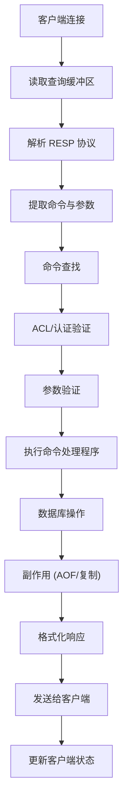
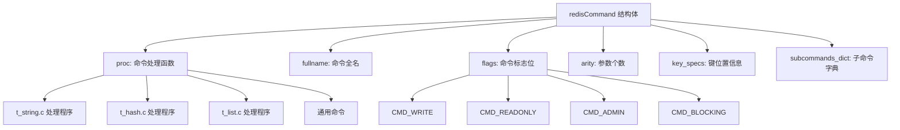
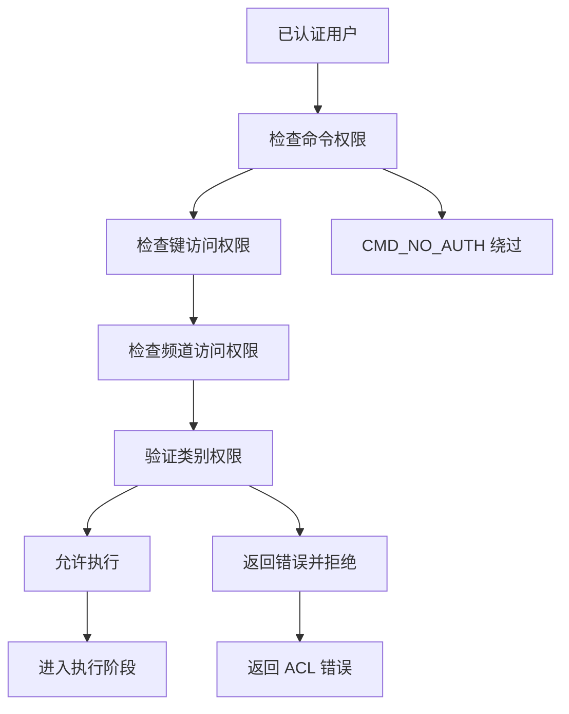
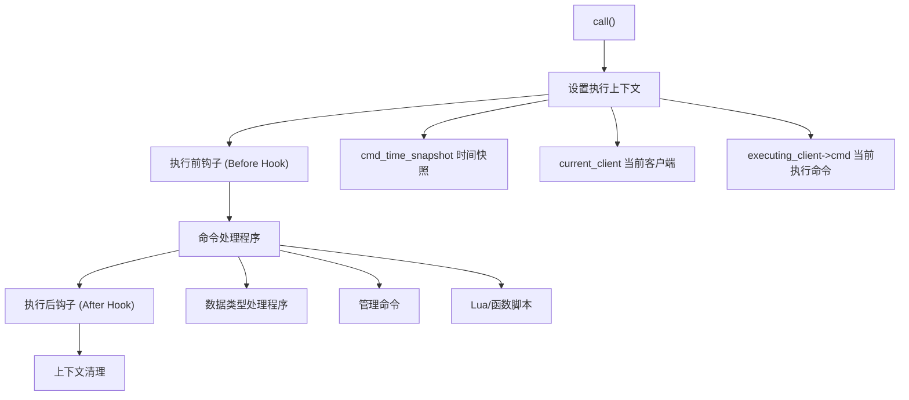
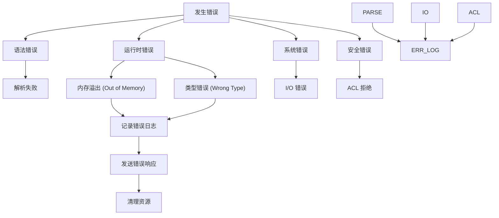
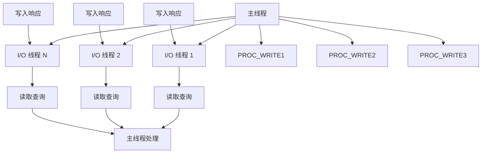

# 命令处理流水线

相关源文件

-   [redis.conf](https://github.com/redis/redis/blob/8ad54215/redis.conf)
-   [src/aof.c](https://github.com/redis/redis/blob/8ad54215/src/aof.c)
-   [src/config.c](https://github.com/redis/redis/blob/8ad54215/src/config.c)
-   [src/db.c](https://github.com/redis/redis/blob/8ad54215/src/db.c)
-   [src/debug.c](https://github.com/redis/redis/blob/8ad54215/src/debug.c)
-   [src/module.c](https://github.com/redis/redis/blob/8ad54215/src/module.c)
-   [src/networking.c](https://github.com/redis/redis/blob/8ad54215/src/networking.c)
-   [src/object.c](https://github.com/redis/redis/blob/8ad54215/src/object.c)
-   [src/rdb.c](https://github.com/redis/redis/blob/8ad54215/src/rdb.c)
-   [src/replication.c](https://github.com/redis/redis/blob/8ad54215/src/replication.c)
-   [src/server.c](https://github.com/redis/redis/blob/8ad54215/src/server.c)
-   [src/server.h](https://github.com/redis/redis/blob/8ad54215/src/server.h)
-   [tests/unit/introspection.tcl](https://github.com/redis/redis/blob/8ad54215/tests/unit/introspection.tcl)

本文描述了 Redis 的命令处理流水线，涵盖了如何接收、解析、验证、执行客户端命令以及如何返回响应。这包含了核心的请求-响应循环，处理从简单的键值操作到复杂的事务和脚本的所有 Redis 操作。

有关客户端连接管理和网络 I/O 的信息，请参阅[客户端连接管理](/redis/redis/2.2-client-connection-management)。有关数据库操作和数据存储的详细信息，请参阅[数据存储与管理](/redis/redis/3-data-storage-and-management)。

## 概览

命令处理流水线是 Redis 的中枢神经系统，负责将客户端请求转化为数据库操作并返回相应的响应。该流水线由几个顺序阶段组成，每个命令都必须通过这些阶段，且每个阶段都有各种验证和处理步骤。

### 高层流水线流程

**来源：** [src/networking.c1-7000](https://github.com/redis/redis/blob/8ad54215/src/networking.c#L1-L7000) [src/server.c1-6000](https://github.com/redis/redis/blob/8ad54215/src/server.c#L1-L6000) [src/server.h1-3000](https://github.com/redis/redis/blob/8ad54215/src/server.h#L1-L3000)

## 协议处理与命令解析

当数据从客户端连接到达时，命令处理开始。Redis 使用 RESP (Redis 序列化协议) 进行通信。

### 查询缓冲区管理

每个客户端维护一个查询缓冲区 (`querybuf`) 来累积传入的数据。网络层根据使用模式管理缓冲区的分配、重新分配和清理。

> **[Mermaid 序列图 (sequence)]**
> *(注：此处的图表结构已根据原文保留占位)*

系统处理内联 (inline) 和多批量 (multibulk，即数组) 两种 RESP 格式，并为每种格式提供不同的解析逻辑：

-   **内联格式**：简单的字符串命令，如 `PING` 或 `INFO`。
-   **多批量格式**：基于数组的命令，如 `SET key value`。

**来源：** [src/networking.c1500-2000](https://github.com/redis/redis/blob/8ad54215/src/networking.c#L1500-L2000) [src/networking.c2500-3000](https://github.com/redis/redis/blob/8ad54215/src/networking.c#L2500-L3000)

### 命令结构与查找

命令由 `redisCommand` 结构表示，该结构包含有关每个命令的元数据，包括其处理函数、参数个数 (arity)、标志位和键规范 (key specifications)。

命令查找过程涉及：

1.  从解析后的参数中提取命令名称。
2.  在全局命令表中进行不区分大小写的查找。
3.  处理命令别名和子命令。
4.  缓存常用命令以提高性能。

**来源：** [src/server.h2800-3000](https://github.com/redis/redis/blob/8ad54215/src/server.h#L2800-L3000) [src/server.c2000-2500](https://github.com/redis/redis/blob/8ad54215/src/server.c#L2000-L2500)

## 命令验证与安全

在执行之前，命令会经历几个验证步骤，以确保安全性、正确性和系统稳定性。

### 身份验证与授权

ACL (访问控制列表) 系统验证经过身份验证的用户是否有权执行请求的命令：

### 参数与状态验证

验证命令的以下内容：

-   **参数个数检查**：根据命令规范检查参数数量是否正确。
-   **键验证**：根据命令要求验证键名和模式。
-   **状态验证**：服务器状态兼容性（例如，集群模式、复制状态）。
-   **内存限制**：当超过 `maxmemory` 时，检查写命令的 OOM (内存溢出) 情况。

**来源：** [src/acl.c1-1000](https://github.com/redis/redis/blob/8ad54215/src/acl.c#L1-L1000) [src/server.c3500-4000](https://github.com/redis/redis/blob/8ad54215/src/server.c#L3500-L4000)

## 命令执行框架

核心执行框架将经过验证的命令路由到其相应的处理程序，并管理执行上下文。

### 执行上下文与调用栈

[src/server.c3800-4200](https://github.com/redis/redis/blob/8ad54215/src/server.c#L3800-L4200) 中的 `call()` 函数是核心执行分发器。它管理：

### 命令处理函数类型

Redis 命令分为几个类别实现：

| 处理程序类型 | 位置 | 示例 | 用途 |
| --- | --- | --- | --- |
| 数据类型命令 | `t_*.c` 文件 | `GET`, `SET`, `HGET` | 核心数据结构操作 |
| 管理命令 | `server.c` | `INFO`, `CONFIG`, `CLIENT` | 服务器管理 |
| 脚本命令 | `script.c`, `functions.c` | `EVAL`, `FCALL` | 脚本执行 |
| 集群命令 | `cluster.c` | `CLUSTER INFO` | 集群管理 |
| 模块命令 | `module.c` | 模块自定义命令 | 扩展命令 |

**来源：** [src/server.c3800-4200](https://github.com/redis/redis/blob/8ad54215/src/server.c#L3800-L4200) [src/t_string.c1-500](https://github.com/redis/redis/blob/8ad54215/src/t_string.c#L1-L500) [src/t_hash.c1-500](https://github.com/redis/redis/blob/8ad54215/src/t_hash.c#L1-L500)

## 响应生成与输出

执行命令后，Redis 格式化响应并通过 RESP 协议将其发送回客户端。

### 响应构建流水线

> **[Mermaid 序列图 (sequence)]**
> *(注：此处的图表结构已根据原文保留占位)*

响应系统包括：

-   **静态缓冲区**：在 `c->buf` 中处理小响应的快速路径。
-   **回复列表**：用于较大响应的响应块链表。
-   **缓冲区管理**：自动调整大小和强制执行内存限制。
-   **延迟响应**：支持异步完成的命令。

### 响应类型与格式化

Redis 支持多种 RESP 响应类型：

| 类型 | 格式 | 示例 | 用途 |
| --- | --- | --- | --- |
| 简单字符串 | `+OK\r\n` | 命令成功执行 | 状态响应 |
| 错误 | `-ERR message\r\n` | 命令执行失败 | 错误情况 |
| 整数 | `:123\r\n` | 数值 | 计数器、长度 |
| 批量字符串 (Bulk String) | `$6\r\nfoobar\r\n` | 二进制数据 | 键/值内容 |
| 数组 (Array) | `*2\r\n$3\r\nfoo\r\n$3\r\nbar\r\n` | 多个值 | 列表响应 |

**来源：** [src/networking.c4000-5000](https://github.com/redis/redis/blob/8ad54215/src/networking.c#L4000-L5000) [src/networking.c500-1000](https://github.com/redis/redis/blob/8ad54215/src/networking.c#L500-L1000)

## 错误处理与恢复

命令处理流水线包含全面的错误处理，以维护系统稳定性并向客户端提供有意义的反馈。

### 错误类别与处理

### 错误传播与日志记录

错误在多个层面进行处理：

-   **协议层**：畸形的 RESP 数据。
-   **命令层**：无效的参数或状态。
-   **数据库层**：数据类型不匹配或约束违规。
-   **系统层**：内存、I/O 或资源耗尽。

**来源：** [src/networking.c5500-6000](https://github.com/redis/redis/blob/8ad54215/src/networking.c#L5500-L6000) [src/server.c4500-5000](https://github.com/redis/redis/blob/8ad54215/src/server.c#L4500-L5000)

## 线程与并发

根据配置，Redis 的命令处理流水线支持单线程和多线程执行模型。

### I/O 线程模型

启用 I/O 线程时：

-   I/O 线程负责读取客户端查询并写入响应。
-   主线程执行所有命令处理和数据库操作。
-   同步发生在流水线的特定点。
-   跨线程边界仔细管理客户端状态。

**来源：** [src/networking.c7000-8000](https://github.com/redis/redis/blob/8ad54215/src/networking.c#L7000-L8000) [src/server.c1000-1500](https://github.com/redis/redis/blob/8ad54215/src/server.c#L1000-L1500)

命令处理流水线构成了 Redis 性能和功能的基础，高效地将客户端请求转化为数据库操作，同时保持数据一致性、安全性和系统可靠性。
