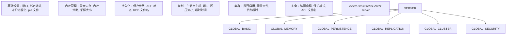
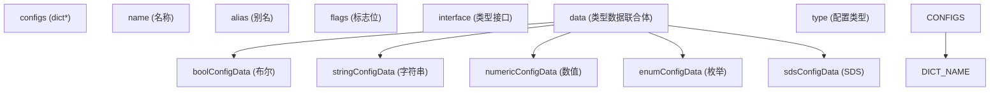
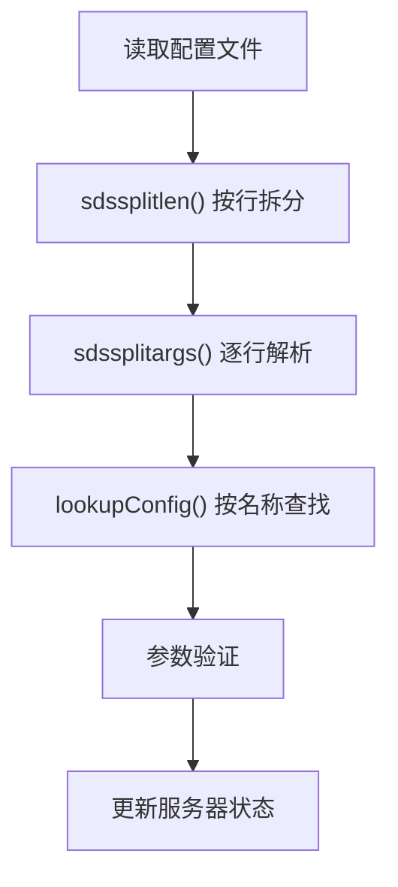
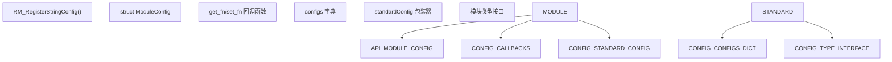

# 配置管理

相关源文件

-   [redis.conf](https://github.com/redis/redis/blob/8ad54215/redis.conf)
-   [src/aof.c](https://github.com/redis/redis/blob/8ad54215/src/aof.c)
-   [src/config.c](https://github.com/redis/redis/blob/8ad54215/src/config.c)
-   [src/db.c](https://github.com/redis/redis/blob/8ad54215/src/db.c)
-   [src/debug.c](https://github.com/redis/redis/blob/8ad54215/src/debug.c)
-   [src/module.c](https://github.com/redis/redis/blob/8ad54215/src/module.c)
-   [src/networking.c](https://github.com/redis/redis/blob/8ad54215/src/networking.c)
-   [src/object.c](https://github.com/redis/redis/blob/8ad54215/src/object.c)
-   [src/rdb.c](https://github.com/redis/redis/blob/8ad54215/src/rdb.c)
-   [src/replication.c](https://github.com/redis/redis/blob/8ad54215/src/replication.c)
-   [src/server.c](https://github.com/redis/redis/blob/8ad54215/src/server.c)
-   [src/server.h](https://github.com/redis/redis/blob/8ad54215/src/server.h)
-   [tests/unit/introspection.tcl](https://github.com/redis/redis/blob/8ad54215/tests/unit/introspection.tcl)

本文涵盖了 Redis 的配置管理系统，该系统负责处理服务器设置、运行时参数管理和配置持久化。内容包括配置文件的解析、`CONFIG` 命令接口、参数验证以及存储配置状态的底层数据结构。

有关命令处理和验证的信息，请参阅[命令处理流水线](/redis/redis/2.3-command-processing-pipeline)。有关服务器初始化和生命周期的详细信息，请参阅[服务器架构与生命周期](/redis/redis/2.1-server-architecture-and-lifecycle)。

## 架构概览

Redis 配置管理通过一个多层系统运行，处理来自各种来源的配置，并通过命令提供运行时访问。

### 配置系统组件

```mermaid
flowchart TD
    CONF_FILE["redis.conf"]
    CLI_ARGS["命令行参数"]
    CONFIG_CMD["CONFIG SET 命令"]
    MODULE_CONFIG["模块配置"]
    PARSER["loadServerConfigFromString()"]
    VALIDATOR["配置验证器"]
    TYPE_INTERFACE["类型接口 (typeInterface)"]
    SERVER_STRUCT["server (全局状态)"]
    CONFIGS_DICT["configs (字典)"]
    STANDARD_CONFIG["standardConfig 结构体"]
    CONFIG_GET["CONFIG GET"]
    CONFIG_SET["CONFIG SET"]
    CONFIG_REWRITE["CONFIG REWRITE"]
    INFO_CMD["INFO 命令"]

    CONF --> FILE_PARSER
    CLI --> ARGS_PARSER
    CONFIG --> CMD_TYPE_INTERFACE
    MODULE --> CONFIG_CONFIGS_DICT
    PARSER --> VALIDATOR
    VALIDATOR --> SERVER_STRUCT
    TYPE --> INTERFACE_VALIDATOR
    SERVER --> STRUCT_CONFIGS_DICT
    CONFIGS --> DICT_STANDARD_CONFIG
    CONFIG --> GET_CONFIGS_DICT
    CONFIG --> SET_TYPE_INTERFACE
    CONFIG --> REWRITE_STANDARD_CONFIG
    INFO --> CMD_SERVER_STRUCT
```



**来源：** [src/config.c432-503](https://github.com/redis/redis/blob/8ad54215/src/config.c#L432-L503) [src/server.h79-80](https://github.com/redis/redis/blob/8ad54215/src/server.h#L79-L80) [src/server.c80](https://github.com/redis/redis/blob/8ad54215/src/server.c#L80-L80)

## 配置存储

### 全局服务器状态

主要的配置存储是 `server.h` 中定义的全局 `server` 结构。该结构包含数百个按功能组织的配置参数。



**来源：** [src/server.h1700-2800](https://github.com/redis/redis/blob/8ad54215/src/server.h#L1700-L2800) [src/server.c80](https://github.com/redis/redis/blob/8ad54215/src/server.c#L80-L80)

### 配置字典

`configs` 字典提供了统一的配置访问接口，将配置名称映射到 `standardConfig` 结构。



**来源：** [src/config.c261-269](https://github.com/redis/redis/blob/8ad54215/src/config.c#L261-L269) [src/config.c271](https://github.com/redis/redis/blob/8ad54215/src/config.c#L271-L271) [src/config.c233-239](https://github.com/redis/redis/blob/8ad54215/src/config.c#L233-L239)

## 配置处理流水线

### 配置加载流程

> **[Mermaid 序列图 (sequence)]**
> *(注：此处的图表结构已根据原文保留占位)*

**来源：** [src/config.c432-503](https://github.com/redis/redis/blob/8ad54215/src/config.c#L432-L503) [src/config.c274-278](https://github.com/redis/redis/blob/8ad54215/src/config.c#L274-L278)

### 配置类型系统

Redis 支持几种配置数据类型，每种类型都有特定的验证和转换逻辑：

| 类型 | 结构体 | 用途 | 示例 |
| --- | --- | --- | --- |
| `boolConfigData` | 布尔值 | 是/否设置 | `daemonize`, `protected-mode` |
| `stringConfigData` | 字符串值 | 文件路径、地址 | `logfile`, `bind` |
| `numericConfigData` | 整数值 | 端口、超时、限制 | `port`, `timeout`, `maxmemory` |
| `enumConfigData` | 枚举值 | 预定义选项 | `loglevel`, `maxmemory-policy` |
| `sdsConfigData` | SDS 字符串值 | 动态字符串 | `save`, `client-output-buffer-limit` |

**来源：** [src/config.c170-231](https://github.com/redis/redis/blob/8ad54215/src/config.c#L170-L231)

## 运行时配置管理

### CONFIG 命令实现

```mermaid
flowchart TD
    CONFIG_CMD["CONFIG 命令"]
    GET_HANDLER["configGetCommand()"]
    SET_HANDLER["configSetCommand()"]
    REWRITE_HANDLER["configRewriteCommand()"]
    GET_FUNC["interface.get()"]
    SET_FUNC["interface.set()"]
    REWRITE_FUNC["interface.rewrite()"]
    APPLY_FUNC["interface.apply()"]
    LOOKUP["lookupConfig()"]
    VALIDATE["参数验证"]
    UPDATE["server.* 更新"]

    CONFIG --> CMD_GET_HANDLER
    CONFIG --> CMD_SET_HANDLER
    CONFIG --> CMD_REWRITE_HANDLER
    GET --> HANDLER_GET_FUNC
    SET --> HANDLER_SET_FUNC
    SET --> HANDLER_APPLY_FUNC
    REWRITE --> HANDLER_REWRITE_FUNC
    GET --> FUNC_LOOKUP
    SET --> FUNC_VALIDATE
    VALIDATE --> UPDATE
```



**来源：** [src/config.c3500-3600](https://github.com/redis/redis/blob/8ad54215/src/config.c#L3500-L3600) [src/config.c3800-3900](https://github.com/redis/redis/blob/8ad54215/src/config.c#L3800-L3900) [src/config.c244-259](https://github.com/redis/redis/blob/8ad54215/src/config.c#L244-L259)

### 配置验证

每种配置类型通过函数指针实现验证：

```
typedef struct numericConfigData {
    // ... 字段 ...
    int (*is_valid_fn)(long long val, const char **err);
} numericConfigData;
```

常见的验证模式包括：

-   **范围检查**：确保数值落在可接受的边界内。
-   **文件路径验证**：验证文件路径是否可访问。
-   **枚举验证**：根据预定义集合检查值。
-   **格式验证**：确保字符串符合预期模式。

**来源：** [src/config.c212-231](https://github.com/redis/redis/blob/8ad54215/src/config.c#L212-L231) [src/config.c167-174](https://github.com/redis/redis/blob/8ad54215/src/config.c#L167-L174)

## 配置文件处理

### 文件格式与解析

配置文件格式支持：

-   键值对：`参数 值`
-   带引号的多行值
-   包含指令：`include /path/to/other.conf`
-   以 `#` 开头的注释
-   已弃用参数的处理



**来源：** [src/config.c447-503](https://github.com/redis/redis/blob/8ad54215/src/config.c#L447-L503) [redis.conf1-50](https://github.com/redis/redis/blob/8ad54215/redis.conf#L1-L50)

## 模块配置扩展

Redis 模块可以通过模块 API 注册自己的配置参数，从而扩展核心配置系统。



**来源：** [src/module.c451-475](https://github.com/redis/redis/blob/8ad54215/src/module.c#L451-L475) [src/config.c268](https://github.com/redis/redis/blob/8ad54215/src/config.c#L268-L268)

## 配置持久化

### CONFIG REWRITE 实现

`CONFIG REWRITE` 命令使用当前的运行时值重新生成配置文件，在更新已更改参数的同时保留注释和结构。

关键特性：

-   保留原始文件结构和注释。
-   仅更新已修改的参数。
-   处理复杂的多值配置。
-   保留原始文件的备份。

**来源：** [src/config.c4200-4400](https://github.com/redis/redis/blob/8ad54215/src/config.c#L4200-L4400) [src/config.c258](https://github.com/redis/redis/blob/8ad54215/src/config.c#L258-L258)

配置管理系统为 Redis 广泛的可配置性提供了坚实的基础，同时保持了对模块和未来增强功能的向后兼容性和可扩展性。
