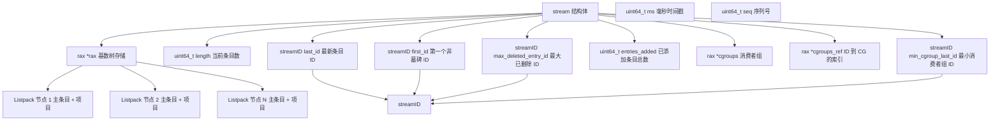
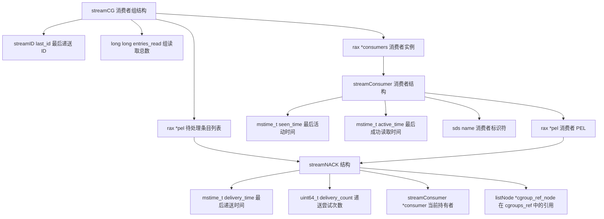
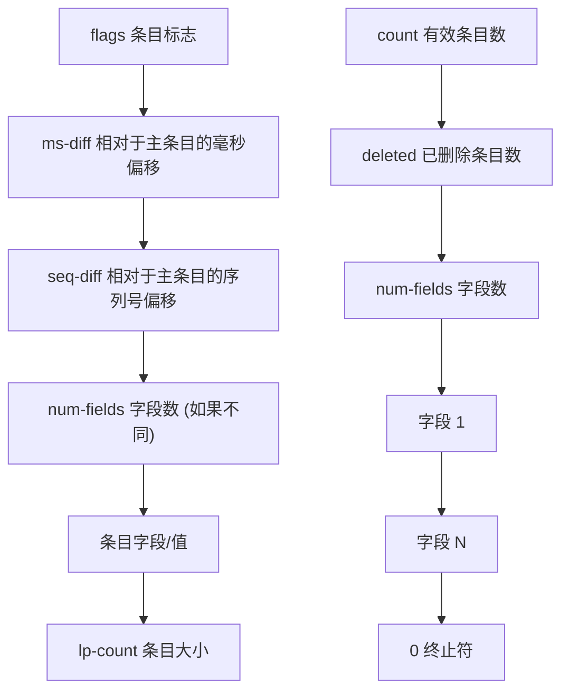
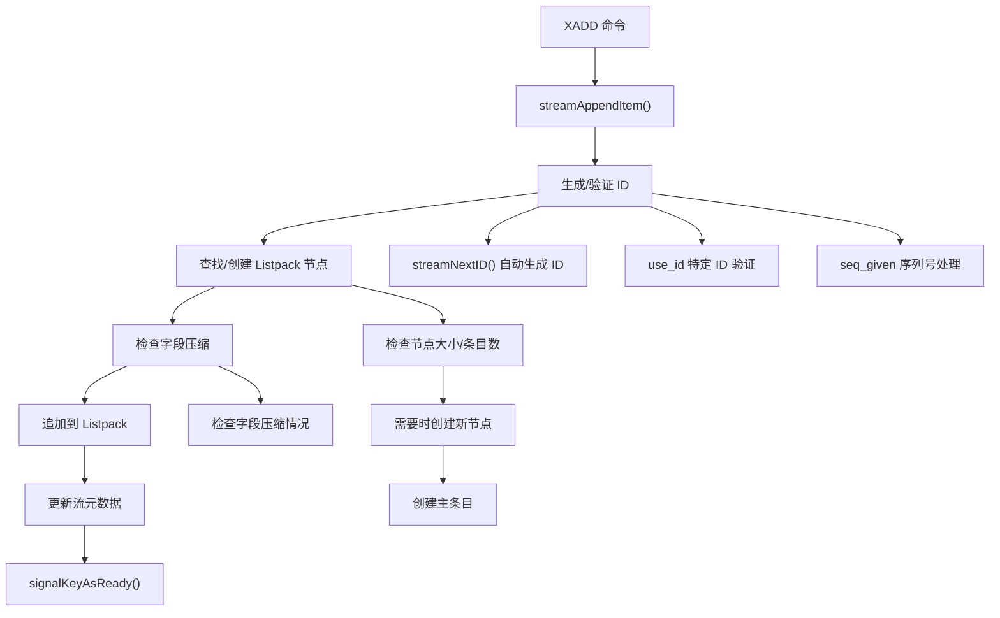
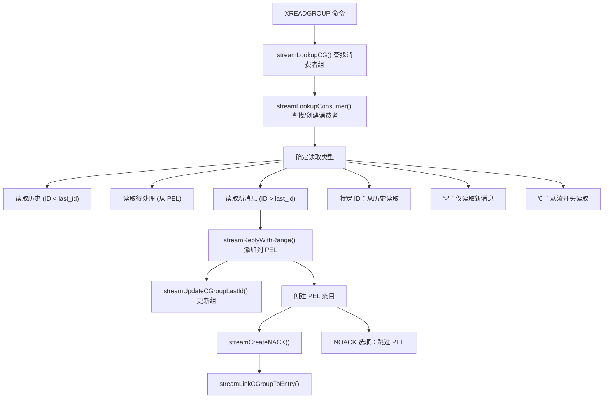
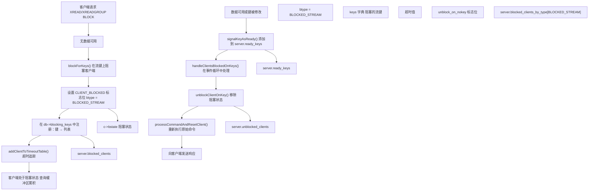
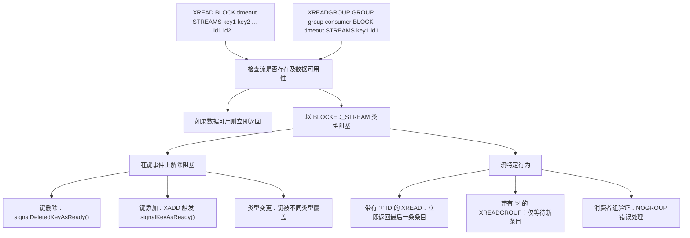
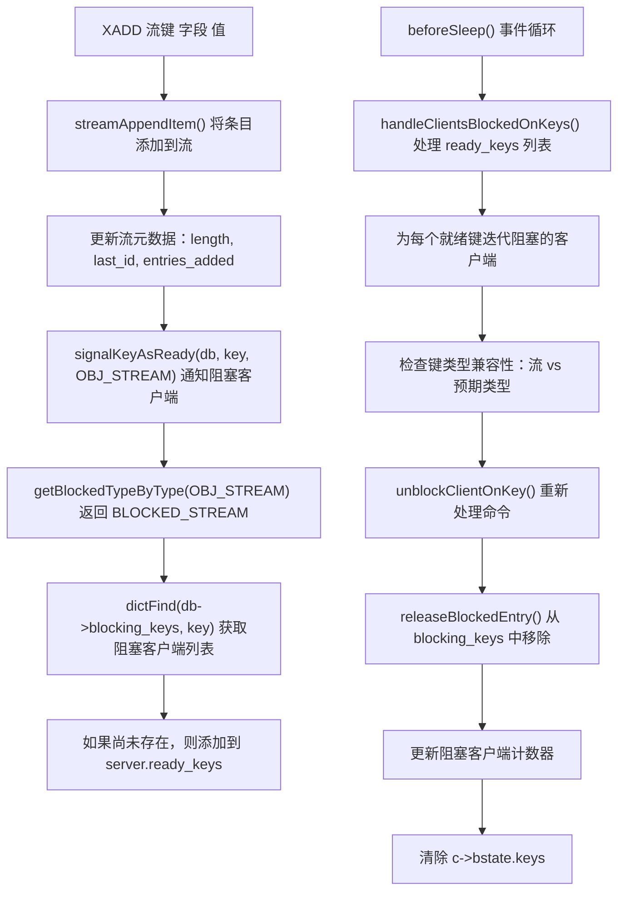
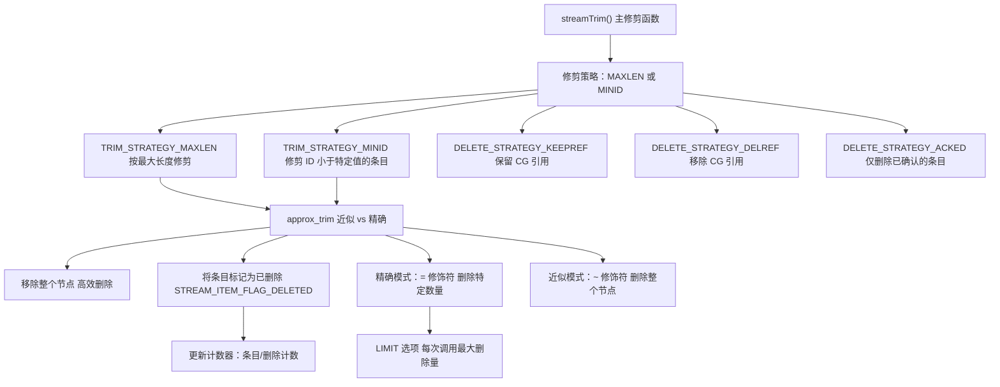
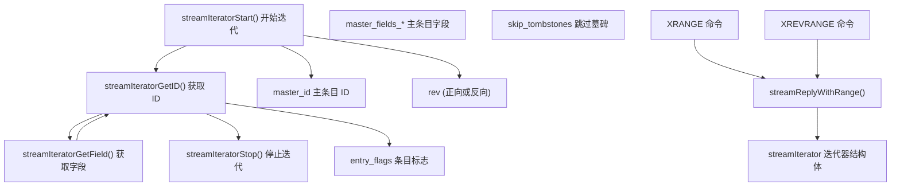

# 流 (Streams) 与阻塞操作

相关源文件

-   [src/blocked.c](https://github.com/redis/redis/blob/8ad54215/src/blocked.c)
-   [src/stream.h](https://github.com/redis/redis/blob/8ad54215/src/stream.h)
-   [src/t\_stream.c](https://github.com/redis/redis/blob/8ad54215/src/t_stream.c)
-   [tests/unit/type/stream-cgroups.tcl](https://github.com/redis/redis/blob/8ad54215/tests/unit/type/stream-cgroups.tcl)
-   [tests/unit/type/stream.tcl](https://github.com/redis/redis/blob/8ad54215/tests/unit/type/stream.tcl)

流 (Streams) 是 Redis 的一种数据类型，实现了带有消费者组 (consumer group) 功能和复杂阻塞操作支持的仅追加日志。它们提供了类似时间序列的功能，具有高效的范围查询、消息传递保证，以及支持实时数据处理的客户端阻塞机制。其实现结合了基数树 (`rax`) 与压缩的 listpack 以实现高效存储，并与 Redis 通用的阻塞客户端系统集成，以实现响应式的事件驱动操作。

阻塞操作系统允许客户端在多个流键上高效地等待新数据，并在添加条目、删除键或发生超时时自动解除阻塞。这种集成使 Redis 流既能作为持久化日志，也能作为实时消息传递系统。

有关列表和有序集合等其他数据类型的信息，请参阅第 3.1 页。有关流数据持久化的详细信息，请参阅第 7 页。

## 核心架构与数据结构

### 流数据结构概览

**来源：** [src/stream.h16-27](https://github.com/redis/redis/blob/8ad54215/src/stream.h#L16-L27) [src/stream.h11-14](https://github.com/redis/redis/blob/8ad54215/src/stream.h#L11-L14) [src/t\_stream.c51-68](https://github.com/redis/redis/blob/8ad54215/src/t_stream.c#L51-L68)

`stream` 结构使用基数树 (`rax`) 将条目存储在 listpack 中，提供高效的范围查询和内存压缩。每个流都维护有关其边界 (`first_id`, `last_id`)、删除状态 (`max_deleted_entry_id`) 和消费者组追踪的元数据。`streamID` 是一个由毫秒时间戳和序列号组成的 128 位标识符。

### 消费者组架构

**来源：** [src/stream.h57-76](https://github.com/redis/redis/blob/8ad54215/src/stream.h#L57-L76) [src/stream.h78-92](https://github.com/redis/redis/blob/8ad54215/src/stream.h#L78-L92) [src/stream.h95-101](https://github.com/redis/redis/blob/8ad54215/src/stream.h#L95-L101)

消费者组允许多个消费者以递送保证来处理流条目。待处理条目列表 (PEL) 追踪组和消费者层面未确认的消息。每个 `streamNACK` 代表已递送但尚未确认的消息，并追踪递送时间、次数和消费者归属。`cgroup_ref_node` 提供了流中 `cgroups_ref` 索引条目的引用，以实现高效查找。

## 流条目存储与压缩

### Listpack 编码结构

**来源：** [src/t\_stream.c14-19](https://github.com/redis/redis/blob/8ad54215/src/t_stream.c#L14-L19) [src/t\_stream.c490-520](https://github.com/redis/redis/blob/8ad54215/src/t_stream.c#L490-L520) [src/t\_stream.c601-652](https://github.com/redis/redis/blob/8ad54215/src/t_stream.c#L601-L652)

流条目以压缩形式存储在 listpack 中。每个 listpack 节点包含：

1.  一个**主条目** (master entry)，定义了节点中所有条目的公共字段。
2.  多个**流条目**，存储相对于主条目的增量。

条目标志包括：

-   `STREAM_ITEM_FLAG_NONE` (0)：无特殊标志。
-   `STREAM_ITEM_FLAG_DELETED` (1<<0)：条目已删除（墓碑）。
-   `STREAM_ITEM_FLAG_SAMEFIELDS` (1<<1)：条目具有与主条目相同的字段。

当设置了 `SAMEFIELDS` 标志时，条目会省略字段名称和字段数量，仅存储值，当条目具有一致的架构 (schema) 时，这可以显著节省内存。

## 核心流操作

### 流添加流程 (XADD)

**来源：** [src/t\_stream.c420-662](https://github.com/redis/redis/blob/8ad54215/src/t_stream.c#L420-L662) [src/t\_stream.c130-139](https://github.com/redis/redis/blob/8ad54215/src/t_stream.c#L130-L139)

`streamAppendItem()` 函数（由 `XADD` 调用）处理：

1.  **ID 生成或验证**：
    -   通过 `streamNextID()` 自动生成 ID。
    -   验证用户提供的 ID。
    -   使用 `seq_given` 标志处理序列号。
2.  **Listpack 节点管理**：
    -   根据 `stream_node_max_bytes` 和 `stream_node_max_entries` 检查当前节点是否能容纳新条目。
    -   在需要时创建带有主条目的新节点。
3.  **字段压缩**：
    -   检查条目字段是否与主条目字段匹配。
    -   为压缩设置 `STREAM_ITEM_FLAG_SAMEFIELDS` 标志。
4.  **流元数据更新**：
    -   更新 `length`, `entries_added`, `first_id` 和 `last_id`。
    -   通过 `signalKeyAsReady()` 通知阻塞的客户端。

### 消费者组读取流程 (XREADGROUP)

**来源：** [src/t\_stream.c3000-3300](https://github.com/redis/redis/blob/8ad54215/src/t_stream.c#L3000-L3300) [tests/unit/type/stream-cgroups.tcl46-74](https://github.com/redis/redis/blob/8ad54215/tests/unit/type/stream-cgroups.tcl#L46-L74) [tests/unit/type/stream-cgroups.tcl180-204](https://github.com/redis/redis/blob/8ad54215/tests/unit/type/stream-cgroups.tcl#L180-L204)

`XREADGROUP` 命令实现了消费者组读取，包含三种主要场景：

1.  **新消息 (ID = `>`)**：
    -   读取比组内 `last_id` 更新的消息。
    -   将条目添加到待处理条目列表 (PEL)。
    -   更新消费者组的 `last_id`。
2.  **历史 (特定 ID)**：
    -   从流中的特定点读取消息。
    -   用于回放历史或从故障中恢复。
3.  **待处理消息 (从 PEL)**：
    -   检索已经递送但尚未确认的消息。
    -   允许消费者重新处理处理失败的消息。

`NOACK` 选项可用于跳过向 PEL 添加条目的步骤，这在只读操作或不需要确认时很有用。

## 客户端阻塞操作系统

### 阻塞客户端生命周期

**来源：** [src/blocked.c17-46](https://github.com/redis/redis/blob/8ad54215/src/blocked.c#L17-L46) [src/blocked.c61-86](https://github.com/redis/redis/blob/8ad54215/src/blocked.c#L61-L86) [src/blocked.c387-437](https://github.com/redis/redis/blob/8ad54215/src/blocked.c#L387-L437) [src/blocked.c659-700](https://github.com/redis/redis/blob/8ad54215/src/blocked.c#L659-L700)

阻塞操作系统通过精密的客户端状态管理系统实现了对流数据的高效等待：

1.  **阻塞注册**：
    -   `blockForKeys()` 将客户端注册在特定的流键上，类型为 `BLOCKED_STREAM`。
    -   客户端被添加到每个数据库的 `blocking_keys` 字典中，以便快速查找。
    -   全局计数器按类型追踪被阻塞客户端的统计数据。
2.  **状态管理**：
    -   `CLIENT_BLOCKED` 标志位防止在阻塞状态下处理命令。
    -   阻塞期间，查询缓冲区会累积命令。
    -   通过 `addClientToTimeoutTable()` 进行超时管理。
3.  **解除阻塞流程**：
    -   流的修改触发 `signalKeyAsReady()`，将键排队到 `server.ready_keys`。
    -   `handleClientsBlockedOnKeys()` 在事件循环中处理就绪的键。
    -   带有 `CLIENT_REEXECUTING_COMMAND` 标志的命令会被原子性地重新处理。

### 流特定的阻塞特性

**来源：** [tests/unit/type/stream-cgroups.tcl221-285](https://github.com/redis/redis/blob/8ad54215/tests/unit/type/stream-cgroups.tcl#L221-L285) [tests/unit/type/stream.tcl422-480](https://github.com/redis/redis/blob/8ad54215/tests/unit/type/stream.tcl#L422-L480) [src/blocked.c570-576](https://github.com/redis/redis/blob/8ad54215/src/blocked.c#L570-L576)

流阻塞操作具有专门的行为：

1.  **键状态变更**：
    -   `unblock_on_nokey` 标志位支持在键被删除或更改类型时解除阻塞。
    -   当消费者组被销毁时，XREADGROUP 操作解除阻塞并返回 `NOGROUP` 错误。
    -   类型变更（例如 SET 覆盖了流）会触发 `WRONGTYPE` 错误。
2.  **流特定 ID**：
    -   如果流非空，带有 `+` ID 的 `XREAD` 会立即返回最后一条条目。
    -   带有 `>` ID 的 `XREADGROUP` 仅等待超出组内 `last_id` 的新条目。
    -   在解除阻塞期间进行消费者组验证。
3.  **错误处理**：
    -   被阻塞的客户端可能因错误（超时、键删除、类型变更）而解除阻塞。
    -   `updateStatsOnUnblock()` 确保正确记录命令统计数据。

### 与流操作的集成

**来源：** [src/blocked.c475-522](https://github.com/redis/redis/blob/8ad54215/src/blocked.c#L475-L522) [src/blocked.c535-568](https://github.com/redis/redis/blob/8ad54215/src/blocked.c#L535-L568) [src/blocked.c581-616](https://github.com/redis/redis/blob/8ad54215/src/blocked.c#L581-L616) [src/t\_stream.c420-662](https://github.com/redis/redis/blob/8ad54215/src/t_stream.c#L420-L662)

流操作与阻塞系统无缝集成：

1.  **信号生成**：
    -   `XADD` 操作在成功添加条目后调用 `signalKeyAsReady()`。
    -   `signalDeletedKeyAsReady()` 处理键删除场景。
    -   类型检查确保仅解除合适的客户端的阻塞。
2.  **客户端处理**：
    -   `handleClientsBlockedOnKeys()` 在 `beforeSleep()` 中运行，以实现高效的批量处理。
    -   通过按键的 FIFO 顺序处理客户端来维持公平性。
    -   使用 `in_handling_blocked_clients` 标志位防止递归解除阻塞。
3.  **状态清理**：
    -   `releaseBlockedEntry()` 从阻塞键映射中移除客户端。
    -   引用计数确保正确清理 `blocking_keys_unblock_on_nokey`。
    -   统计数据被更新以反映解除阻塞后的客户端状态变化。

这种集成系统使 Redis 流能够提供响应灵敏的、事件驱动的数据处理，同时在并发操作中保持一致性和性能。

## 流管理与维护

### 修剪与内存管理

**来源：** [src/t\_stream.c686-699](https://github.com/redis/redis/blob/8ad54215/src/t_stream.c#L686-L699) [src/t\_stream.c724-914](https://github.com/redis/redis/blob/8ad54215/src/t_stream.c#L724-L914) [src/t\_stream.c917-939](https://github.com/redis/redis/blob/8ad54215/src/t_stream.c#L917-L939)

流修剪通过 `streamTrim()` 函数实现，具有几个关键特性：

1.  **修剪策略**：
    -   `TRIM_STRATEGY_MAXLEN`：修剪到指定的最大条目数。
    -   `TRIM_STRATEGY_MINID`：移除 ID 小于指定 ID 的条目。
2.  **精度模式**：
    -   精确模式 (`=` 修饰符)：精确修剪到指定的数量。
    -   近似模式 (`~` 修饰符)：为了效率，仅移除完整的节点。
3.  **删除策略**：
    -   `DELETE_STRATEGY_KEEPREF`：保留消费者组引用（默认）。
    -   `DELETE_STRATEGY_DELREF`：移除消费者组引用。
    -   `DELETE_STRATEGY_ACKED`：仅删除已被所有组确认的条目。
4.  **性能控制**：
    -   `LIMIT` 选项：限制每次调用处理的条目数量。
    -   节点级优化：尽可能移除整个节点。
    -   条目标记：使用 `STREAM_ITEM_FLAG_DELETED` 将条目标记为已删除。

该实现在内存效率与性能之间取得了平衡，允许应用程序通过各种选项控制权衡。

### 迭代器与范围查询系统

**来源：** [src/stream.h32-52](https://github.com/redis/redis/blob/8ad54215/src/stream.h#L32-L52) [src/stream.h119-124](https://github.com/redis/redis/blob/8ad54215/src/stream.h#L119-L124)

`streamIterator` 为正向或反向遍历流条目提供了统一接口，自动处理压缩和墓碑过滤。

该流系统使 Redis 能够既作为简单的消息队列，也作为具有消费者组语义、持久化消息递送以及对时间排序数据的高效范围查询的复杂事件流平台。
