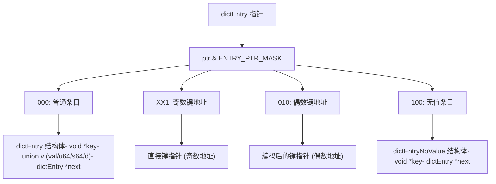
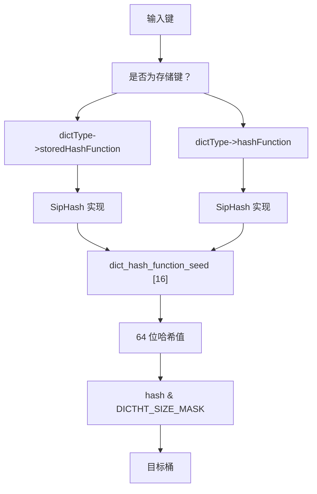
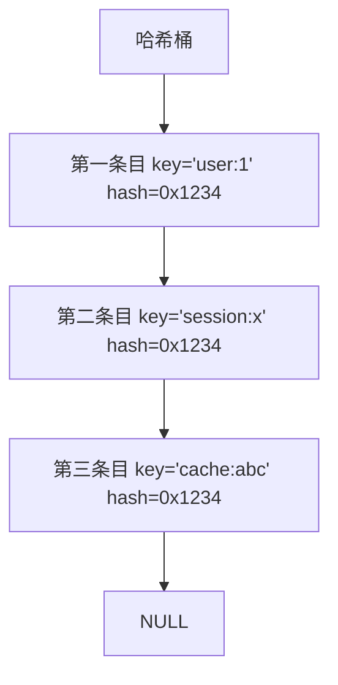
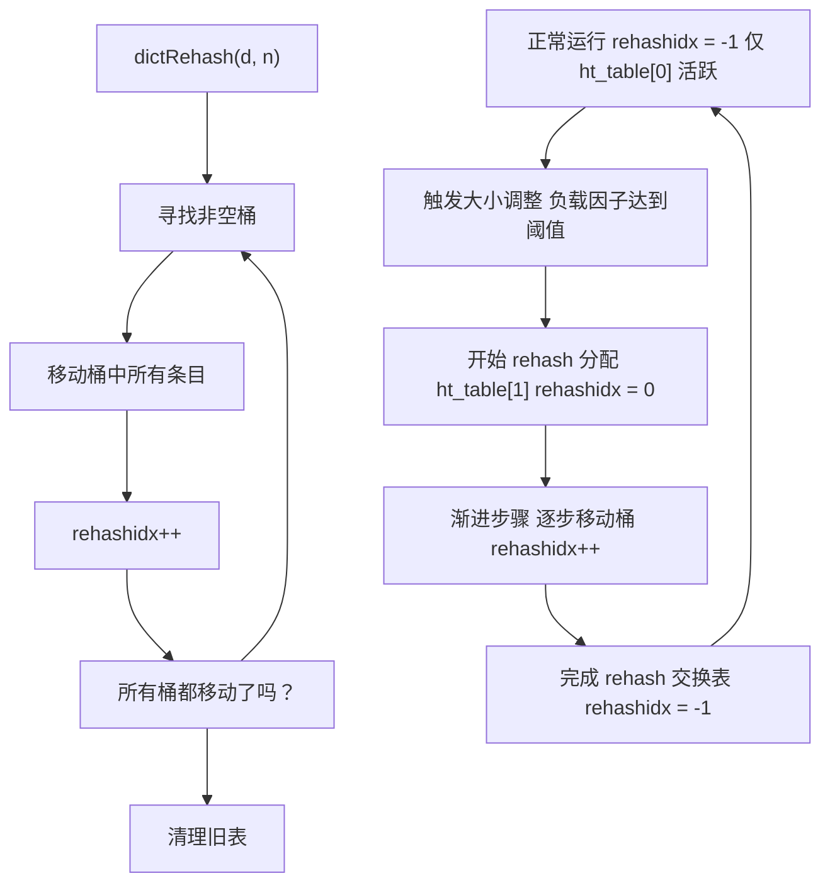
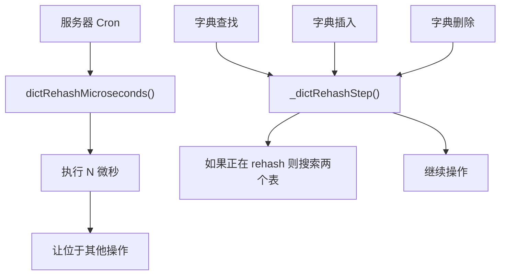
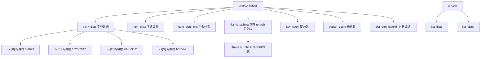
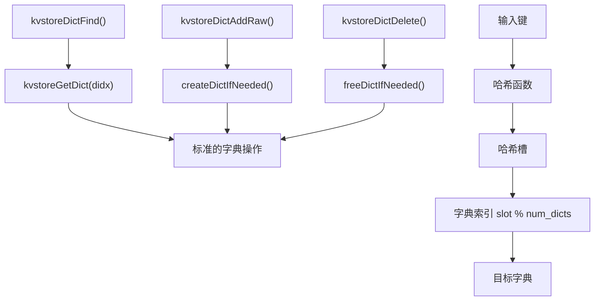
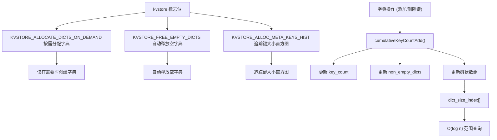
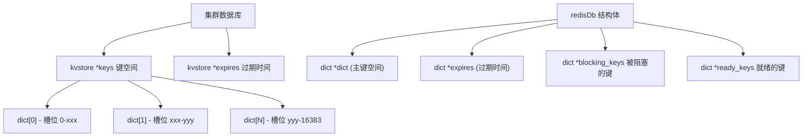

# 字典与键值存储

相关源文件

-   [src/defrag.c](https://github.com/redis/redis/blob/8ad54215/src/defrag.c)
-   [src/dict.c](https://github.com/redis/redis/blob/8ad54215/src/dict.c)
-   [src/dict.h](https://github.com/redis/redis/blob/8ad54215/src/dict.h)
-   [src/iothread.c](https://github.com/redis/redis/blob/8ad54215/src/iothread.c)
-   [src/kvstore.c](https://github.com/redis/redis/blob/8ad54215/src/kvstore.c)
-   [src/kvstore.h](https://github.com/redis/redis/blob/8ad54215/src/kvstore.h)
-   [tests/unit/info-keysizes.tcl](https://github.com/redis/redis/blob/8ad54215/tests/unit/info-keysizes.tcl)
-   [tests/unit/info.tcl](https://github.com/redis/redis/blob/8ad54215/tests/unit/info.tcl)
-   [tests/unit/memefficiency.tcl](https://github.com/redis/redis/blob/8ad54215/tests/unit/memefficiency.tcl)
-   [tests/unit/networking.tcl](https://github.com/redis/redis/blob/8ad54215/tests/unit/networking.tcl)
-   [tests/unit/obuf-limits.tcl](https://github.com/redis/redis/blob/8ad54215/tests/unit/obuf-limits.tcl)
-   [tests/unit/shutdown.tcl](https://github.com/redis/redis/blob/8ad54215/tests/unit/shutdown.tcl)

本文涵盖了 Redis 的核心字典（哈希表）实现以及管理字典集合的键值存储层 (kvstore)。字典是 Redis 中存储键值对的基础数据结构，而 kvstore 则提供了用于管理多个字典的高层抽象，特别是在集群配置中。

字典实现包括渐进式 rehash、主动碎片整理和内存高效的条目存储优化。kvstore 层在此基础上扩展了统计追踪、跨多个字典的协调 rehash，以及对单机和集群 Redis 部署的支持。

## 字典架构

Redis 通过 [src/dict.h122-137](https://github.com/redis/redis/blob/8ad54215/src/dict.h#L122-L137) 中定义的 `dict` 结构实现哈希表。其核心设计使用拉链法 (separate chaining) 解决冲突，采用 2 的幂次大小的哈希表，并支持渐进式 rehash。

### 核心字典结构

```mermaid
flowchart TD
    dict["dict 结构体"]
    type["dictType *type 类型"]
    ht_table0["dictEntry **ht_table[0] 主表"]
    ht_table1["dictEntry **ht_table[1] rehash 表"]
    ht_used0["ht_used[0] 已用量"]
    ht_used1["ht_used[1] 已用量"]
    ht_size_exp0["ht_size_exp[0] 大小指数"]
    ht_size_exp1["ht_size_exp[1] 大小指数"]
    rehashidx["rehashidx rehash 索引"]
    bucket0["桶 0"]
    bucket1["桶 1"]
    bucketN["桶 N"]
    entry1["dictEntry 条目 1"]
    entry2["dictEntry 条目 2"]
    entry3["dictEntry 条目 3"]
    newbucket0["新桶 0"]
    newbucket1["新桶 1"]
    newbucketM["新桶 M"]
    hashFunction["hashFunction 哈希函数"]
    keyCompare["keyCompare 键比较"]
    keyDup["keyDup 键复制"]
    valDup["valDup 值复制"]
    keyDestructor["keyDestructor 键析构"]
    valDestructor["valDestructor 值析构"]

    dict --> type
    dict --> ht_table0
    dict --> ht_table1
    dict --> ht_used0
    dict --> ht_used1
    dict --> ht_size_exp0
    dict --> ht_size_exp1
    dict --> rehashidx
    ht --> table0_bucket0
    ht --> table0_bucket1
    ht --> table0_bucketN
    bucket0 --> entry1
    entry1 --> entry2
    entry2 --> entry3
    ht --> table1_newbucket0
    ht --> table1_newbucket1
    ht --> table1_newbucketM
    type --> hashFunction
    type --> keyCompare
    type --> keyDup
    type --> valDup
    type --> keyDestructor
    type --> valDestructor
```

**来源：** [src/dict.h122-137](https://github.com/redis/redis/blob/8ad54215/src/dict.h#L122-L137) [src/dict.c48-57](https://github.com/redis/redis/blob/8ad54215/src/dict.c#L48-L57)

字典维护两个哈希表以实现渐进式 rehash。在正常操作期间，仅使用 `ht_table[0]`。当需要调整大小时，会分配 `ht_table[1]`，并将条目逐渐从旧表移动到新表。

### 字典条目类型

Redis 通过指针位操作，使用不同的条目类型来优化内存使用：

**来源：** [src/dict.c128-179](https://github.com/redis/redis/blob/8ad54215/src/dict.c#L128-L179) [src/dict.c142-150](https://github.com/redis/redis/blob/8ad54215/src/dict.c#L142-L150)

这种优化允许配置为 `no_value=1` 的字典（如集合）在只有一个键时，直接将键存储在哈希表桶中，从而避免分配开销。

## 哈希函数与冲突解决

### 主要哈希函数

Redis 使用 SipHash 作为默认哈希函数，以保证安全性和分布质量：

**来源：** [src/dict.c99-104](https://github.com/redis/redis/blob/8ad54215/src/dict.c#L99-L104) [src/dict.c117-126](https://github.com/redis/redis/blob/8ad54215/src/dict.c#L117-L126)

### 冲突解决

冲突通过拉链法处理，每个桶包含一个条目链表：

**来源：** [src/dict.c48-57](https://github.com/redis/redis/blob/8ad54215/src/dict.c#L48-L57)

## 渐进式 rehash

Redis 实现了渐进式 rehash，以避免在哈希表扩容或收缩期间产生阻塞：

### rehash 过程

**来源：** [src/dict.c400-429](https://github.com/redis/redis/blob/8ad54215/src/dict.c#L400-L429) [src/dict.c329-372](https://github.com/redis/redis/blob/8ad54215/src/dict.c#L329-L372)

### rehash 集成

rehash 过程集成到了正常的字典操作中：

**来源：** [src/dict.c463-465](https://github.com/redis/redis/blob/8ad54215/src/dict.c#L463-L465) [src/dict.c441-453](https://github.com/redis/redis/blob/8ad54215/src/dict.c#L441-L453)

## KVStore 层

`kvstore` 提供了一个更高层级的抽象，用于管理多个字典，主要用于 Redis 集群模式，其中不同的哈希槽需要独立的字典。

### KVStore 架构

**来源：** [src/kvstore.c37-52](https://github.com/redis/redis/blob/8ad54215/src/kvstore.c#L37-L52) [src/kvstore.c255-301](https://github.com/redis/redis/blob/8ad54215/src/kvstore.c#L255-L301)

### 字典选择与操作

**来源：** [src/kvstore.c86-88](https://github.com/redis/redis/blob/8ad54215/src/kvstore.c#L86-L88) [src/kvstore.c164-171](https://github.com/redis/redis/blob/8ad54215/src/kvstore.c#L164-L171) [src/kvstore.c180-189](https://github.com/redis/redis/blob/8ad54215/src/kvstore.c#L180-L189)

### 统计与内存管理

kvstore 维护所有字典的汇总统计信息，使用树状数组 (Fenwick Tree) 实现高效的范围查询：

**来源：** [src/kvstore.c138-161](https://github.com/redis/redis/blob/8ad54215/src/kvstore.c#L138-L161) [src/kvstore.c180-189](https://github.com/redis/redis/blob/8ad54215/src/kvstore.c#L180-L189) [src/kvstore.c255-301](https://github.com/redis/redis/blob/8ad54215/src/kvstore.c#L255-L301)

## 与 Redis 核心集成

### Redis 中的字典类型

Redis 为各种用途使用了不同的 `dictType` 配置：

| 字典类型 | 键类型 | 值类型 | 使用场景 |
| --- | --- | --- | --- |
| `dbDictType` | `robj*` | `robj*` | 主数据库 |
| `setDictType` | `sds` | `NULL` | 集合数据类型 |
| `zsetDictType` | `sds` | `double*` | 有序集合分值 |
| `hashDictType` | `hfield` | `sds` | 哈希字段 |
| `pubsubDictType` | `sds` | `list*` | 发布/订阅频道 |

**来源：** 参考各数据类型实现。

### 数据库集成

**来源：** 参考数据库和集群实现。

字典和 kvstore 系统构成了 Redis 数据存储的骨架，提供了具有内存优化、渐进式 rehash 以及对单实例和集群部署支持的高效哈希表操作。

**来源：** [src/dict.c](https://github.com/redis/redis/blob/8ad54215/src/dict.c) [src/dict.h](https://github.com/redis/redis/blob/8ad54215/src/dict.h) [src/kvstore.c](https://github.com/redis/redis/blob/8ad54215/src/kvstore.c) [src/kvstore.h](https://github.com/redis/redis/blob/8ad54215/src/kvstore.h)
