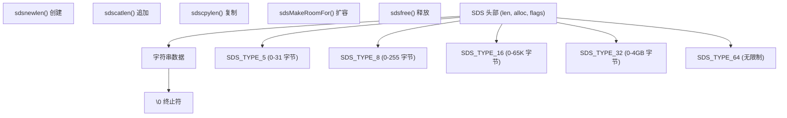
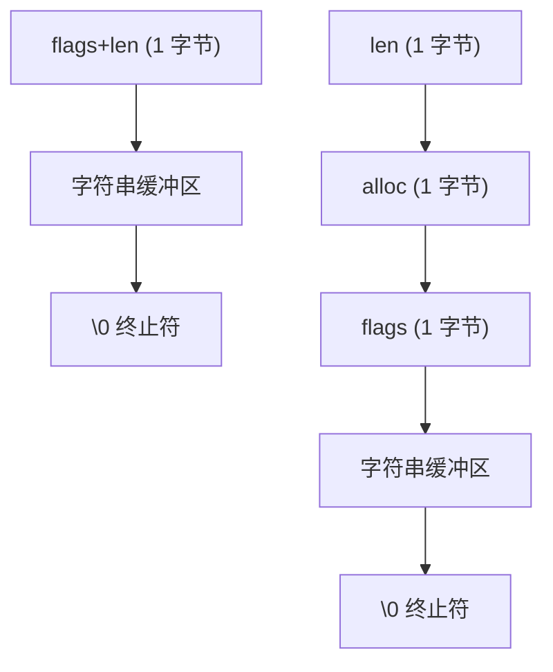
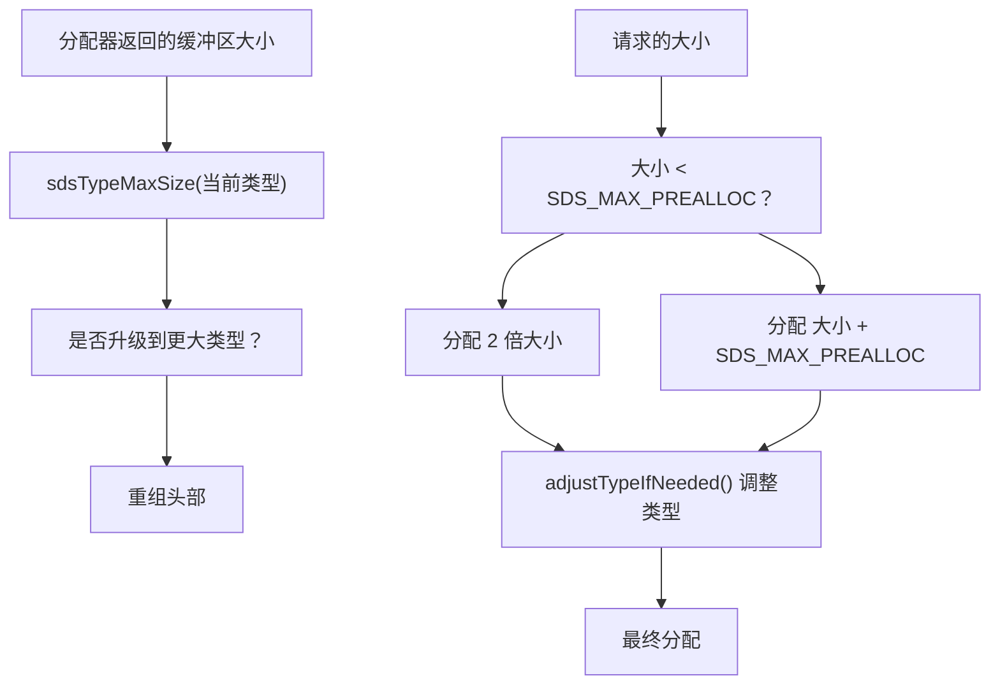
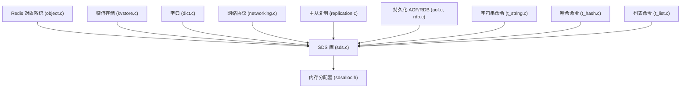
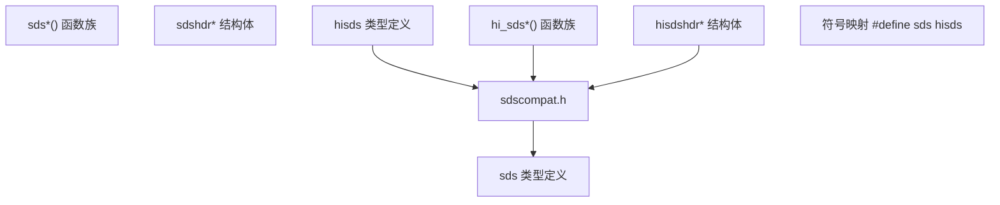

# 动态字符串库 (SDS)

相关源文件

-   [deps/hiredis/hiredis\_ssl.h](https://github.com/redis/redis/blob/8ad54215/deps/hiredis/hiredis_ssl.h)
-   [deps/hiredis/sds.c](https://github.com/redis/redis/blob/8ad54215/deps/hiredis/sds.c)
-   [deps/hiredis/sds.h](https://github.com/redis/redis/blob/8ad54215/deps/hiredis/sds.h)
-   [deps/hiredis/sdsalloc.h](https://github.com/redis/redis/blob/8ad54215/deps/hiredis/sdsalloc.h)
-   [deps/hiredis/sdscompat.h](https://github.com/redis/redis/blob/8ad54215/deps/hiredis/sdscompat.h)
-   [deps/hiredis/ssl.c](https://github.com/redis/redis/blob/8ad54215/deps/hiredis/ssl.c)
-   [src/sds.c](https://github.com/redis/redis/blob/8ad54215/src/sds.c)
-   [src/sds.h](https://github.com/redis/redis/blob/8ad54215/src/sds.h)

动态字符串库 (SDS) 是 Redis 自定义的字符串实现，提供高效、二进制安全且具备自动内存管理的字符串处理功能。SDS 在整个 Redis 中取代了标准的 C 字符串，以实现 O(1) 的长度获取操作、减少内存分配次数，并支持二进制数据存储。

有关使用 SDS 的高层数据类型实现的信息，请参阅[核心数据类型实现](/redis/redis/3.1-core-data-types-implementation)。有关内存分配策略，请参阅[内存分配器与构建系统](/redis/redis/4.2-memory-allocators-and-build-system)。

## SDS 架构概览

SDS 采用带有前置头部的设计，元数据存储在紧邻字符串数据之前的位置。这允许将字符串指针直接当作 C 字符串使用，同时又保留了长度和分配信息。

**SDS 架构图**

**来源：** [src/sds.h28-55](https://github.com/redis/redis/blob/8ad54215/src/sds.h#L28-L55) [src/sds.c33-43](https://github.com/redis/redis/blob/8ad54215/src/sds.c#L33-L43)

## 内存布局与类型系统

SDS 实现了五种不同的头部类型，以根据字符串大小最小化内存开销。每种类型都使用紧凑结构 (packed structures) 以消除字节填充 (padding)。

| 类型 | 大小范围 | 头部大小 | 字段 |
| --- | --- | --- | --- |
| SDS\_TYPE\_5 | 0-31 字节 | 1 字节 | 仅 flags (长度存储在高 5 位) |
| SDS\_TYPE\_8 | 0-255 字节 | 3 字节 | len, alloc, flags (uint8\_t) |
| SDS\_TYPE\_16 | 0-65K 字节 | 5 字节 | len, alloc, flags (uint16\_t) |
| SDS\_TYPE\_32 | 0-4GB 字节 | 9 字节 | len, alloc, flags (uint32\_t) |
| SDS\_TYPE\_64 | 无限制 | 17 字节 | len, alloc, flags (uint64\_t) |

**按类型的 SDS 内存布局**

`sdsReqType()` 函数根据字符串长度确定合适的类型，而 `adjustTypeIfNeeded()` 则处理分配器返回的内存超过请求量的情况。

**来源：** [src/sds.h28-55](https://github.com/redis/redis/blob/8ad54215/src/sds.h#L28-L55) [src/sds.c33-83](https://github.com/redis/redis/blob/8ad54215/src/sds.c#L33-L83)

## 核心 SDS 操作

SDS 为字符串的创建、操作和内存管理提供了全面的 API。该库在添加长度追踪和自动调容功能的同时，保持了与 C 字符串的兼容性。

```mermaid
flowchart TD
    SDSLEN["sdslen(sds) 获取长度"]
    SDSAVAIL["sdsavail(sds) 获取可用空间"]
    SDSCMP["sdscmp(sds, sds) 字符串比较"]
    SDSSPLIT["sdssplitlen(...) 拆分字符串"]
    SDSNEW["sdsnew(char*) 基于 C 字符串创建"]
    SDSNEWLEN["sdsnewlen(void*, size_t) 指定长度创建"]
    SDSEMPTY["sdsempty() 创建空字符串"]
    SDSDUP["sdsdup(sds) 复制"]
    SDSCAT["sdscat(sds, char*) 追加 C 字符串"]
    SDSCATLEN["sdscatlen(sds, void*, size_t) 追加指定长度数据"]
    SDSCPY["sdscpy(sds, char*) 覆盖 C 字符串"]
    SDSTRIM["sdstrim(sds, char*) 修剪"]
    SDSRANGE["sdsrange(sds, start, end) 获取范围"]
    MAKROOM["sdsMakeRoomFor(sds, size_t) 预留空间"]
    RESIZE["sdsResize(sds, size_t, int) 调整大小"]
    REMFREE["sdsRemoveFreeSpace(sds) 移除空闲空间"]
    INCRLEN["sdsIncrLen(sds, ssize_t) 增量更新长度"]

    SDSNEW --> MAKROOM
    SDSCAT --> MAKROOM
    MAKROOM --> RESIZE
```

**SDS 操作流程**

关键实现细节：

-   **字符串创建**：`sdsnewlen()` 是基础创建函数，其他函数多为其封装 [src/sds.c98-190](https://github.com/redis/redis/blob/8ad54215/src/sds.c#L98-L190)。
-   **拼接追加**：`sdscatlen()` 会调用 `sdsMakeRoomFor()` 自动增长缓冲区 [src/sds.c532-541](https://github.com/redis/redis/blob/8ad54215/src/sds.c#L532-L541)。
-   **内存增长**：在 `SDS_MAX_PREALLOC` (1MB) 以下使用指数增长策略，之后使用线性增长 [src/sds.c280-285](https://github.com/redis/redis/blob/8ad54215/src/sds.c#L280-L285)。
-   **长度访问**：通过访问头部，所有长度操作均为 O(1) [src/sds.h73-86](https://github.com/redis/redis/blob/8ad54215/src/sds.h#L73-L86)。

**来源：** [src/sds.c188-587](https://github.com/redis/redis/blob/8ad54215/src/sds.c#L188-L587) [src/sds.h213-287](https://github.com/redis/redis/blob/8ad54215/src/sds.h#L213-L287)

## 内存管理策略

SDS 实现了精密的内存管理，以平衡性能和内存效率。系统根据使用模式采用贪婪 (greedy) 和非贪婪分配策略。

**SDS 内存管理流程**

内存管理系统处理几种关键场景：

-   **贪婪增长**：`sdsMakeRoomFor()` 会预分配额外空间以减少未来的重新分配 [src/sds.c264-329](https://github.com/redis/redis/blob/8ad54215/src/sds.c#L264-L329)。
-   **非贪婪增长**：`sdsMakeRoomForNonGreedy()` 仅分配所需的精确大小 [src/sds.c332-334](https://github.com/redis/redis/blob/8ad54215/src/sds.c#L332-L334)。
-   **类型晋升**：当分配器返回的内存超过当前类型可寻址范围时，`adjustTypeIfNeeded()` 会升级 SDS 类型 [src/sds.c75-83](https://github.com/redis/redis/blob/8ad54215/src/sds.c#L75-L83)。
-   **内存压缩**：`sdsRemoveFreeSpace()` 将分配的大小收缩至精确长度 [src/sds.c342-344](https://github.com/redis/redis/blob/8ad54215/src/sds.c#L342-L344)。

**来源：** [src/sds.c264-425](https://github.com/redis/redis/blob/8ad54215/src/sds.c#L264-L425) [src/sds.h17](https://github.com/redis/redis/blob/8ad54215/src/sds.h#L17-L17)

## 与 Redis 核心系统的集成

SDS 是整个 Redis 中的基础字符串类型，广泛用于数据结构、协议处理和内部操作。

**SDS 在 Redis 架构中的集成**

关键集成点：

-   **Redis 对象**：字符串对象使用 SDS 存储值，并进行了编码优化。
-   **协议处理**：RESP 协议解析和生成使用 SDS 作为命令和回复缓冲区。
-   **键存储**：字典键以 SDS 字符串形式存储，以实现高效操作。
-   **主从复制**：命令传播使用 SDS 进行缓冲和传输。
-   **持久化**：AOF 命令和 RDB 字符串值利用了 SDS 编码。

**来源：** [src/sds.c1-26](https://github.com/redis/redis/blob/8ad54215/src/sds.c#L1-L26) 以及整个 Redis 代码库中的集成模式。

## SDS 变体与兼容性

Redis 包含两个 SDS 实现：主版本和 hiredis 专用变体，两者的命名约定和行为略有不同。

**SDS 变体与兼容性**

hiredis 版本包括：

-   带有前缀的函数名 (`hi_sds*`) 以避免符号冲突 [deps/hiredis/sds.h49](https://github.com/redis/redis/blob/8ad54215/deps/hiredis/sds.h#L49-L49)。
-   稍有不同的类型选择逻辑 [deps/hiredis/sds.c59-69](https://github.com/redis/redis/blob/8ad54215/deps/hiredis/sds.c#L59-L69)。
-   用于符号映射的兼容性头部 [deps/hiredis/sdscompat.h45-93](https://github.com/redis/redis/blob/8ad54215/deps/hiredis/sdscompat.h#L45-L93)。

**来源：** [deps/hiredis/sds.c1-40](https://github.com/redis/redis/blob/8ad54215/deps/hiredis/sds.c#L1-L40) [deps/hiredis/sds.h49](https://github.com/redis/redis/blob/8ad54215/deps/hiredis/sds.h#L49-L49) [deps/hiredis/sdscompat.h42-94](https://github.com/redis/redis/blob/8ad54215/deps/hiredis/sdscompat.h#L42-L94)

## 性能特性

SDS 相比标准 C 字符串具有多项性能优势：

-   **O(1) 长度操作**：头部存储长度，消除了 `strlen()` 调用。
-   **减少分配次数**：贪婪增长策略最小化了重新分配的频率。
-   **缓存友好布局**：连续的内存布局提高了缓存性能。
-   **二进制安全**：嵌入的长度信息使其能够处理包含空字符的二进制数据。
-   **内存效率**：类型系统最小化了针对不同字符串大小的头部开销。

该库还包含专门的函数，如用于快速格式化且无 `sprintf()` 开销的 `sdscatfmt()` [src/sds.c672-765](https://github.com/redis/redis/blob/8ad54215/src/sds.c#L672-L765)，以及用于在直接操作缓冲区时高效调整长度的 `sdsIncrLen()` [src/sds.c469-507](https://github.com/redis/redis/blob/8ad54215/src/sds.c#L469-L507)。

**来源：** [src/sds.c672-765](https://github.com/redis/redis/blob/8ad54215/src/sds.c#L672-L765) [src/sds.c469-507](https://github.com/redis/redis/blob/8ad54215/src/sds.c#L469-L507) [src/sds.h88-111](https://github.com/redis/redis/blob/8ad54215/src/sds.h#L88-L111)
