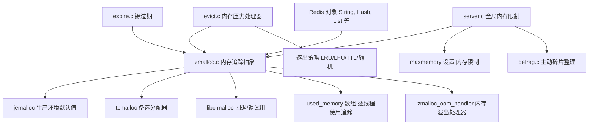
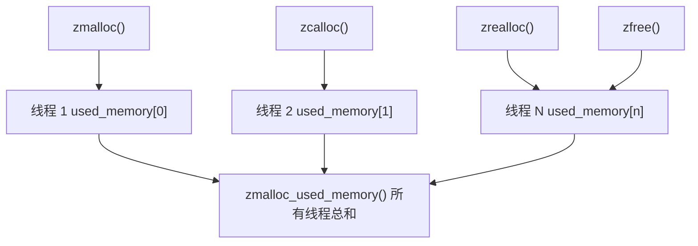
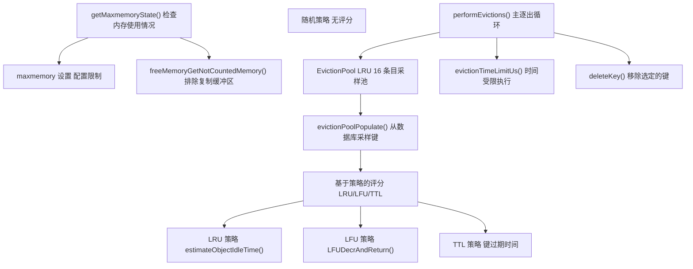
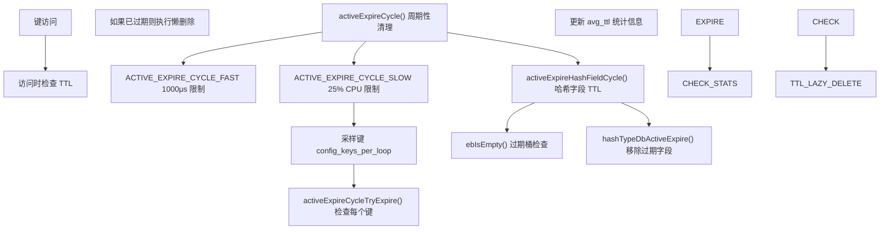
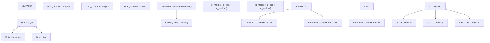
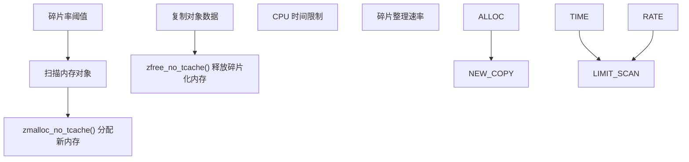

# 内存管理

相关源文件

-   [deps/jemalloc/include/jemalloc/internal/jemalloc\_internal\_externs.h](https://github.com/redis/redis/blob/8ad54215/deps/jemalloc/include/jemalloc/internal/jemalloc_internal_externs.h)
-   [deps/jemalloc/include/jemalloc/internal/jemalloc\_internal\_inlines\_c.h](https://github.com/redis/redis/blob/8ad54215/deps/jemalloc/include/jemalloc/internal/jemalloc_internal_inlines_c.h)
-   [deps/jemalloc/include/jemalloc/jemalloc\_macros.h.in](https://github.com/redis/redis/blob/8ad54215/deps/jemalloc/include/jemalloc/jemalloc_macros.h.in)
-   [deps/jemalloc/src/jemalloc.c](https://github.com/redis/redis/blob/8ad54215/deps/jemalloc/src/jemalloc.c)
-   [deps/jemalloc/src/jemalloc\_cpp.cpp](https://github.com/redis/redis/blob/8ad54215/deps/jemalloc/src/jemalloc_cpp.cpp)
-   [src/Makefile](https://github.com/redis/redis/blob/8ad54215/src/Makefile)
-   [src/config.h](https://github.com/redis/redis/blob/8ad54215/src/config.h)
-   [src/evict.c](https://github.com/redis/redis/blob/8ad54215/src/evict.c)
-   [src/expire.c](https://github.com/redis/redis/blob/8ad54215/src/expire.c)
-   [src/zmalloc.c](https://github.com/redis/redis/blob/8ad54215/src/zmalloc.c)
-   [src/zmalloc.h](https://github.com/redis/redis/blob/8ad54215/src/zmalloc.h)
-   [tests/unit/expire.tcl](https://github.com/redis/redis/blob/8ad54215/tests/unit/expire.tcl)
-   [tests/unit/maxmemory.tcl](https://github.com/redis/redis/blob/8ad54215/tests/unit/maxmemory.tcl)

Redis 内存管理涵盖了分配追踪、逐出策略、键过期以及内存优化策略。该系统确保 Redis 在内存限制内高效运行，同时提供可预测的性能特征。

有关数据结构内存优化的信息，请参阅[内存高效的数据结构](/redis/redis/3.4-memory-efficient-data-structures)。有关逐出和过期策略的详细信息，请参阅[逐出与过期策略](/redis/redis/4.1-eviction-and-expiration-policies)。有关内存分配器编译配置，请参阅[内存分配器与构建系统](/redis/redis/4.2-memory-allocators-and-build-system)。

## 内存分配架构

Redis 实现了多层内存管理架构，构建在可插拔分配器之上，并配有全面的追踪和控制机制。

**来源：** [src/zmalloc.c1-1030](https://github.com/redis/redis/blob/8ad54215/src/zmalloc.c#L1-L1030) [src/zmalloc.h1-164](https://github.com/redis/redis/blob/8ad54215/src/zmalloc.h#L1-L164) [src/Makefile79-106](https://github.com/redis/redis/blob/8ad54215/src/Makefile#L79-L106)

## 内存追踪与统计

`zmalloc` 层通过线程安全的逐线程计数器和详细的分配器统计信息，提供全面的内存使用追踪。

### 线程安全的使用追踪

Redis 使用缓存行对齐的逐线程计数器跨多个线程追踪内存使用，以避免竞争：

**来源：** [src/zmalloc.c85-109](https://github.com/redis/redis/blob/8ad54215/src/zmalloc.c#L85-L109) [src/zmalloc.c503-516](https://github.com/redis/redis/blob/8ad54215/src/zmalloc.c#L503-L516)

### 特定于分配器的统计信息

当使用 jemalloc 时，Redis 会公开详细的内存统计信息，包括碎片指标：

| 函数 | 用途 | 关键指标 |
| --- | --- | --- |
| `zmalloc_get_allocator_info()` | 全局分配器统计 | 已分配 (allocated), 活动 (active), 常驻 (resident), 碎片 (fragmentation) |
| `zmalloc_get_allocator_info_by_arena()` | 逐 arena 统计 | 特定 arena 的分配模式 |
| `zmalloc_get_frag_smallbins()` | 碎片分析 | 小 bin 碎片字节数 |
| `zmalloc_get_rss()` | 操作系统内存使用 | 来自操作系统的常驻集大小 (RSS) |

**来源：** [src/zmalloc.c799-845](https://github.com/redis/redis/blob/8ad54215/src/zmalloc.c#L799-L845) [src/zmalloc.c852-891](https://github.com/redis/redis/blob/8ad54215/src/zmalloc.c#L852-L891)

## 逐出系统架构

逐出系统通过多种逐出策略和采样策略，将内存使用维持在配置的限制范围内。

**来源：** [src/evict.c104-116](https://github.com/redis/redis/blob/8ad54215/src/evict.c#L104-L116) [src/evict.c126-215](https://github.com/redis/redis/blob/8ad54215/src/evict.c#L126-L215) [src/evict.c510-700](https://github.com/redis/redis/blob/8ad54215/src/evict.c#L510-L700)

### 逐出池策略

Redis 使用基于采样的逐出池来高效地近似最优逐出策略：

-   **池大小**：16 个条目 (`EVPOOL_SIZE`)
-   **采样**：从随机字典槽位中采样键
-   **评分**：特定于策略的评分（LRU 为空闲时间，LFU 为反向频率）
-   **选择**：选择评分最高的键进行逐出

**来源：** [src/evict.c34-42](https://github.com/redis/redis/blob/8ad54215/src/evict.c#L34-L42) [src/evict.c163-214](https://github.com/redis/redis/blob/8ad54215/src/evict.c#L163-L214)

## 键过期管理

Redis 实现了被动和主动过期策略，以确保过期键被高效移除。

**来源：** [src/expire.c187-408](https://github.com/redis/redis/blob/8ad54215/src/expire.c#L187-L408) [src/expire.c38-51](https://github.com/redis/redis/blob/8ad54215/src/expire.c#L38-L51) [src/expire.c144-185](https://github.com/redis/redis/blob/8ad54215/src/expire.c#L144-L185)

### 主动过期参数

| 参数 | 快速循环 (Fast Cycle) | 慢速循环 (Slow Cycle) | 用途 |
| --- | --- | --- | --- |
| 时间限制 | 1000μs | 25% CPU | 防止阻塞 |
| 每次循环键数 | 20 + effort | 20 + effort | 采样大小 |
| 可接受过期比例 | 10% - effort | 10% - effort | 继续运行的阈值 |
| 数据库覆盖范围 | 所有数据库 | CRON\_DBS\_PER\_CALL | 覆盖策略 |

**来源：** [src/expire.c93-98](https://github.com/redis/redis/blob/8ad54215/src/expire.c#L93-L98) [src/expire.c191-200](https://github.com/redis/redis/blob/8ad54215/src/expire.c#L191-L200)

## 内存分配器集成

Redis 支持在构建时配置多种内存分配器，jemalloc 是生产环境的默认值。

### 分配器选择逻辑

**来源：** [src/Makefile79-106](https://github.com/redis/redis/blob/8ad54215/src/Makefile#L79-L106) [src/zmalloc.c56-80](https://github.com/redis/redis/blob/8ad54215/src/zmalloc.c#L56-L80)

### jemalloc Redis 集成

Redis 使用具有 Redis 特定特性的定制 jemalloc：

-   **碎片提示**：`JEMALLOC_FRAG_HINT` 启用碎片整理支持。
-   **可用大小**：`JEMALLOC_ALLOC_WITH_USIZE` 提供分配大小反馈。
-   **后台线程**：`set_jemalloc_bg_thread()` 控制异步清理 (purging)。
-   **Arena 管理**：逐 arena 的统计和控制。

**来源：** [deps/jemalloc/include/jemalloc/jemalloc\_macros.h.in152-156](https://github.com/redis/redis/blob/8ad54215/deps/jemalloc/include/jemalloc/jemalloc_macros.h.in#L152-L156) [src/zmalloc.c894-912](https://github.com/redis/redis/blob/8ad54215/src/zmalloc.c#L894-L912)

## 内存优化策略

### 主动碎片整理

在受支持的分配器上启用时，Redis 会执行主动碎片整理以减少内存碎片：

**来源：** [src/zmalloc.c242-256](https://github.com/redis/redis/blob/8ad54215/src/zmalloc.c#L242-L256)

### 内存使用排除项

Redis 在逐出计算中排除某些内存使用，以防止反馈循环：

-   **复制缓冲区**：排除超出积压缓冲区大小的输出缓冲区。
-   **AOF 缓冲区**：排除追加日志文件写缓冲区。
-   **客户端缓冲区**：可配置的客户端内存限制。

**来源：** [src/evict.c308-343](https://github.com/redis/redis/blob/8ad54215/src/evict.c#L308-L343) [src/evict.c369-420](https://github.com/redis/redis/blob/8ad54215/src/evict.c#L369-L420)

### RSS 和内存报告

Redis 提供多种内存使用指标用于监控和调试：

| 指标 | 函数 | 用途 |
| --- | --- | --- |
| 已用内存 (Used Memory) | `zmalloc_used_memory()` | Redis 分配的总内存 |
| 常驻集大小 (RSS) | `zmalloc_get_rss()` | 操作系统常驻集大小 |
| 私有脏页 (Private Dirty) | `zmalloc_get_private_dirty()` | 进程私有的脏页 |
| 内存峰值 | 服务器统计 | 历史最大内存使用量 |

**来源：** [src/zmalloc.c607-728](https://github.com/redis/redis/blob/8ad54215/src/zmalloc.c#L607-L728) [src/zmalloc.c1024-1060](https://github.com/redis/redis/blob/8ad54215/src/zmalloc.c#L1024-L1060)
