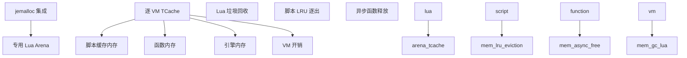

# Lua 脚本与 Redis 函数

相关源文件

-   [src/commands.c](https://github.com/redis/redis/blob/8ad54215/src/commands.c)
-   [src/eval.c](https://github.com/redis/redis/blob/8ad54215/src/eval.c)
-   [src/function\_lua.c](https://github.com/redis/redis/blob/8ad54215/src/function_lua.c)
-   [src/functions.c](https://github.com/redis/redis/blob/8ad54215/src/functions.c)
-   [src/functions.h](https://github.com/redis/redis/blob/8ad54215/src/functions.h)
-   [src/script.c](https://github.com/redis/redis/blob/8ad54215/src/script.c)
-   [src/script.h](https://github.com/redis/redis/blob/8ad54215/src/script.h)
-   [src/script\_lua.c](https://github.com/redis/redis/blob/8ad54215/src/script_lua.c)
-   [src/script\_lua.h](https://github.com/redis/redis/blob/8ad54215/src/script_lua.h)
-   [tests/unit/functions.tcl](https://github.com/redis/redis/blob/8ad54215/tests/unit/functions.tcl)
-   [tests/unit/scripting.tcl](https://github.com/redis/redis/blob/8ad54215/tests/unit/scripting.tcl)

## 目的与范围

本文涵盖了 Redis 的 Lua 脚本功能，包括旧版的 EVAL 命令和现代的 Redis 函数（Redis Functions）系统。内容解释了支持 Redis 服务器端 Lua 脚本执行的架构、执行模型、安全机制以及 API 交互。该系统提供了复杂操作的原子性执行、服务器端计算以及可扩展的命令功能。

有关使用原生代码扩展 Redis 的模块系统信息，请参阅 [Redis 模块 API](/redis/redis/5.2-redis-module-api)。

## 架构概览

Redis 支持两种 Lua 脚本系统：旧版的 EVAL 命令和现代的函数系统。两者共享通用的基础设施，但具有不同的执行模型和管理方式。

### 核心脚本组件

```mermaid
flowchart TD
    EVAL["EVAL/EVALSHA"]
    EVAL_RO["EVAL_RO/EVALSHA_RO"]
    FCALL["FCALL/FCALL_RO"]
    FLOAD["FUNCTION LOAD"]
    FDEL["FUNCTION DELETE"]
    script_c["script.c scriptRunCtx"]
    eval_c["eval.c luaCtx"]
    functions_c["functions.c functionsLibCtx"]
    script_lua_c["script_lua.c Lua-Redis 桥接层"]
    function_lua_c["function_lua.c Lua 函数引擎"]
    lua_state["lua_State 解释器"]
    lua_scripts["脚本缓存"]
    lua_functions["函数注册表"]
    commands_c["命令执行"]
    acl["ACL 验证"]
    cluster["集群支持"]
    repl["复制"]

    EVAL --> eval_c
    EVAL --> RO_eval_c
    FCALL --> functions_c
    FLOAD --> functions_c
    FDEL --> functions_c
    eval --> c_script_c
    functions --> c_script_c
    script --> c_script_lua_c
    functions --> c_function_lua_c
    script --> lua_c_lua_state
    function --> lua_c_lua_state
    lua --> state_lua_scripts
    lua --> state_lua_functions
    script --> c_commands_c
    script --> c_acl
    script --> c_cluster
    script --> c_repl
```

**来源：** [src/eval.c1-50](https://github.com/redis/redis/blob/8ad54215/src/eval.c#L1-L50) [src/script.c1-50](https://github.com/redis/redis/blob/8ad54215/src/script.c#L1-L50) [src/functions.c1-50](https://github.com/redis/redis/blob/8ad54215/src/functions.c#L1-L50) [src/script\_lua.c1-50](https://github.com/redis/redis/blob/8ad54215/src/script_lua.c#L1-L50)

### 脚本执行上下文

`scriptRunCtx` 结构为 EVAL 和函数提供了核心执行上下文：

| 字段 | 类型 | 用途 |
| --- | --- | --- |
| `funcname` | `const char*` | 正在执行的函数/脚本名称 |
| `c` | `client*` | 脚本执行客户端 |
| `original_client` | `client*` | 原始调用客户端 |
| `flags` | `int` | 执行标志位 (只读, 允许 OOM 等) |
| `repl_flags` | `int` | 复制设置 |
| `start_time` | `monotime` | 执行开始时间戳 |
| `slot` | `int` | 用于键验证的集群槽位 |

**来源：** [src/script.h48-59](https://github.com/redis/redis/blob/8ad54215/src/script.h#L48-L59)

## 旧版 EVAL 系统

EVAL 系统提供向后兼容的 Lua 脚本执行，具有基于 SHA1 的缓存和脚本管理功能。

### EVAL 命令流程

> **[Mermaid 序列图 (sequence)]**
> *(注：此处的图表结构已根据原文保留占位)*

**来源：** [src/eval.c434-491](https://github.com/redis/redis/blob/8ad54215/src/eval.c#L434-L491) [src/script.c176-302](https://github.com/redis/redis/blob/8ad54215/src/script.c#L176-L302) [src/script\_lua.c218-222](https://github.com/redis/redis/blob/8ad54215/src/script_lua.c#L218-L222)

### 脚本缓存与管理

EVAL 系统维护一个以 SHA1 哈希值为索引的已编译脚本缓存：

-   **脚本缓存**：`lctx.lua_scripts` 字典，映射 SHA1 → `luaScript`。
-   **LRU 管理**：`lua_scripts_lru_list` 用于缓存逐出。
-   **内存追踪**：`lua_scripts_mem` 追踪缓存内存使用量。
-   **函数命名**：脚本在 Lua 注册表中被编译为 `f_<sha1>` 函数。

**来源：** [src/eval.c58-65](https://github.com/redis/redis/blob/8ad54215/src/eval.c#L58-L65) [src/eval.c532-580](https://github.com/redis/redis/blob/8ad54215/src/eval.c#L532-L580)

## Redis 函数系统

函数 (Functions) 系统提供了持久化的命名函数，具备库组织形式和增强的元数据。

### 函数库架构

```mermaid
flowchart TD
    lib_ctx["functionsLibCtx 当前上下文"]
    libraries["libraries 字典：名称 → functionLibInfo"]
    functions["functions 字典：名称 → functionInfo"]
    engines_stats["engines_stats 字典：引擎统计"]
    lib_info["functionLibInfo：名称, 代码, 函数"]
    func_info["functionInfo：名称, 函数, 描述, 标志位"]
    engine_info["engineInfo：名称, 引擎, 客户端"]
    engine["engine 结构体：回调函数"]
    lua_engine["function_lua.c Lua 引擎实现"]
    create_cb["create()"]
    call_cb["call()"]
    free_cb["free_function()"]

    lib --> ctx_libraries
    lib --> ctx_functions
    lib --> ctx_engines_stats
    libraries --> lib_info
    functions --> func_info
    lib --> info_func_info
    func --> info_engine_info
    engine --> info_engine
    engine --> lua_engine
    engine --> create_cb
    engine --> call_cb
    engine --> free_cb
```

**来源：** [src/functions.h35-103](https://github.com/redis/redis/blob/8ad54215/src/functions.h#L35-L103) [src/functions.c36-41](https://github.com/redis/redis/blob/8ad54215/src/functions.c#L36-L41) [src/function\_lua.c40-49](https://github.com/redis/redis/blob/8ad54215/src/function_lua.c#L40-L49)

### 函数注册过程

函数在执行 `FUNCTION LOAD` 期间通过 `redis.register_function()` API 进行注册：

1.  **解析 Shebang**：从 `#!lua` 头部提取引擎和标志位。
2.  **创建库**：使用元数据初始化 `functionLibInfo`。
3.  **编译代码**：引擎在超时保护下编译库代码。
4.  **注册函数**：`redis.register_function()` 调用会创建 `functionInfo` 条目。
5.  **链接库**：添加到全局函数注册表。

**来源：** [src/functions.c244-268](https://github.com/redis/redis/blob/8ad54215/src/functions.c#L244-L268) [src/function\_lua.c88-142](https://github.com/redis/redis/blob/8ad54215/src/function_lua.c#L88-L142) [src/function\_lua.c403-424](https://github.com/redis/redis/blob/8ad54215/src/function_lua.c#L403-L424)

## Lua 执行环境

EVAL 和函数系统共享一个集成了 Redis API 的通用 Lua 执行环境。

### Lua 状态配置

```mermaid
flowchart TD
    lua_state["lua_State 主解释器"]
    globals["全局表 (受保护)"]
    registry["LUA_REGISTRYINDEX 内部存储"]
    redis_api["redis 表"]
    call_func["redis.call()"]
    pcall_func["redis.pcall()"]
    setresp_func["redis.setresp()"]
    sha1hex_func["redis.sha1hex()"]
    log_func["redis.log()"]
    cjson["cjson 库"]
    cmsgpack["cmsgpack 库"]
    bit["位操作"]
    math["math 库"]
    string["string 库"]
    table["table 库"]
    globals_protection["全局变量保护"]
    readonly_tables["只读表"]
    sandbox["操作系统函数沙箱"]

    lua --> state_globals
    lua --> state_registry
    globals --> redis_api
    redis --> api_call_func
    redis --> api_pcall_func
    redis --> api_setresp_func
    redis --> api_sha1hex_func
    redis --> api_log_func
    globals --> cjson
    globals --> cmsgpack
    globals --> bit
    globals --> math
    globals --> string
    globals --> table
    lua --> state_globals_protection
    lua --> state_readonly_tables
    lua --> state_sandbox
```

**来源：** [src/script\_lua.c30-109](https://github.com/redis/redis/blob/8ad54215/src/script_lua.c#L30-L109) [src/eval.c170-257](https://github.com/redis/redis/blob/8ad54215/src/eval.c#L170-L257) [src/function\_lua.c427-490](https://github.com/redis/redis/blob/8ad54215/src/function_lua.c#L427-L490)

### Redis 命令集成

`redis.call()` 和 `redis.pcall()` 函数提供了从 Lua 执行 Redis 命令的主要接口：

-   **参数转换**：`luaArgsToRedisArgv()` 将 Lua 值转换为 Redis 对象。
-   **命令执行**：`scriptCall()` 验证并执行命令。
-   **回复转换**：`redisProtocolToLuaType()` 将 Redis 回复转换为 Lua 值。
-   **错误处理**：`redis.pcall()` 以表的形式返回错误，`redis.call()` 抛出 Lua 错误。

**来源：** [src/script\_lua.c782-796](https://github.com/redis/redis/blob/8ad54215/src/script_lua.c#L782-L796) [src/script.c616-690](https://github.com/redis/redis/blob/8ad54215/src/script.c#L616-L690) [src/script\_lua.c218-222](https://github.com/redis/redis/blob/8ad54215/src/script_lua.c#L218-L222)

## 脚本执行流程

### 执行上下文管理

> **[Mermaid 状态图 (stateDiagram)]**
> *(注：此处的图表结构已根据原文保留占位)*

**来源：** [src/script.c176-302](https://github.com/redis/redis/blob/8ad54215/src/script.c#L176-L302) [src/script.c126-155](https://github.com/redis/redis/blob/8ad54215/src/script.c#L126-L155) [src/script.c305-325](https://github.com/redis/redis/blob/8ad54215/src/script.c#L305-L325)

### 命令验证流水线

每次 `redis.call()` 执行都要经过多个验证层：

| 验证步骤 | 函数 | 目的 |
| --- | --- | --- |
| 命令查找 | `lookupCommand()` | 寻找命令定义 |
| 参数个数检查 | `scriptVerifyCommandArity()` | 验证参数数量 |
| ACL 验证 | `scriptVerifyACL()` | 检查用户权限 |
| 写权限 | `scriptVerifyWriteCommandAllow()` | 验证写操作 |
| OOM 检查 | `scriptVerifyOOM()` | 内存限制验证 |
| 集群检查 | `scriptVerifyClusterState()` | 跨槽位验证 |
| 过期检查 | `scriptVerifyAllowStale()` | 从节点过期数据检查 |

**来源：** [src/script.c375-609](https://github.com/redis/redis/blob/8ad54215/src/script.c#L375-L609)

## 命令处理

### EVAL 命令族

EVAL 命令族支持脚本文本和基于 SHA1 的执行：

-   **EVAL**：直接执行脚本文本。
-   **EVALSHA**：通过 SHA1 哈希执行缓存的脚本。
-   **EVAL\_RO**：只读脚本执行。
-   **EVALSHA\_RO**：只读的缓存脚本执行。

**来源：** [src/eval.c1200-1300](https://github.com/redis/redis/blob/8ad54215/src/eval.c#L1200-L1300)

### 函数命令族

函数命令族提供全面的函数管理：

-   **FUNCTION LOAD**：加载带有可选标志的函数库。
-   **FCALL/FCALL\_RO**：调用命名函数。
-   **FUNCTION DELETE**：移除函数库。
-   **FUNCTION LIST**：列出带有元数据的函数。
-   **FUNCTION DUMP/RESTORE**：序列化/反序列化函数。
-   **FUNCTION FLUSH**：清除所有函数。
-   **FUNCTION KILL**：终止正在运行的函数。
-   **FUNCTION STATS**：运行时统计信息。

**来源：** [src/functions.c432-473](https://github.com/redis/redis/blob/8ad54215/src/functions.c#L432-L473) [src/functions.c500-600](https://github.com/redis/redis/blob/8ad54215/src/functions.c#L500-L600)

## 内存管理

### Lua 内存追踪

**来源：** [src/script.c52-107](https://github.com/redis/redis/blob/8ad54215/src/script.c#L52-L107) [src/eval.c532-580](https://github.com/redis/redis/blob/8ad54215/src/eval.c#L532-L580) [src/functions.c105-114](https://github.com/redis/redis/blob/8ad54215/src/functions.c#L105-L114)

### 垃圾回收与清理

-   **脚本 GC**：`luaGC()` 执行增量垃圾回收。
-   **脚本逐出**：EVAL 脚本缓存的 LRU 逐出（500 条脚本限制）。
-   **函数清理**：大型函数库的异步清理。
-   **内存报告**：通过 `INFO memory` 提供详细的内存使用情况。

**来源：** [src/script\_lua.c1046-1063](https://github.com/redis/redis/blob/8ad54215/src/script_lua.c#L1046-L1063) [src/eval.c532-580](https://github.com/redis/redis/blob/8ad54215/src/eval.c#L532-L580) [src/functions.c183-194](https://github.com/redis/redis/blob/8ad54215/src/functions.c#L183-L194)

## 安全与沙箱

### 全局变量保护

Lua 环境实现了严格的全局变量保护：

-   **读取保护**：访问未定义的全局变量会引发错误。
-   **写入保护**：禁止修改全局表。
-   **允许列表**：预定义的允许访问的全局变量集。
-   **递归保护**：递归地应用表保护。

**来源：** [src/script\_lua.c94-109](https://github.com/redis/redis/blob/8ad54215/src/script_lua.c#L94-L109) [src/eval.c249-255](https://github.com/redis/redis/blob/8ad54215/src/eval.c#L249-L255)

### 操作系统函数沙箱

危险的操作系统函数已被移除或限制：

-   **已移除的函数**：`os.execute()`, `os.exit()`, `os.getenv()`, `io.*`。
-   **允许的函数**：用于计时的 `os.clock()`。
-   **加载保护**：移除了 `loadfile()`, `dofile()`。
-   **调试移除**：初始化后移除了 `debug` 表。

**来源：** [src/script\_lua.c115-120](https://github.com/redis/redis/blob/8ad54215/src/script_lua.c#L115-L120) [tests/unit/scripting.tcl747-755](https://github.com/redis/redis/blob/8ad54215/tests/unit/scripting.tcl#L747-L755)

### 脚本标志与权限

函数脚本可以在 Shebang 头部声明执行标志位：

| 标志位 | 目的 |
| --- | --- |
| `no-writes` | 禁止写命令 |
| `allow-oom` | 允许在 OOM 时执行 |
| `allow-stale` | 允许在数据过期的从节点上执行 |
| `no-cluster` | 禁止在集群模式下执行 |
| `allow-cross-slot-keys` | 允许访问跨槽位的键 |

**来源：** [src/script.h61-67](https://github.com/redis/redis/blob/8ad54215/src/script.h#L61-L67) [src/script.c23-30](https://github.com/redis/redis/blob/8ad54215/src/script.c#L23-L30)

这一全面的脚本系统在维持 Redis 性能、安全性和一致性保证的同时，实现了强大的服务器端计算。
