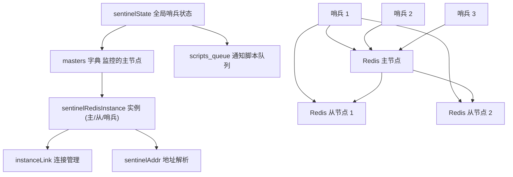
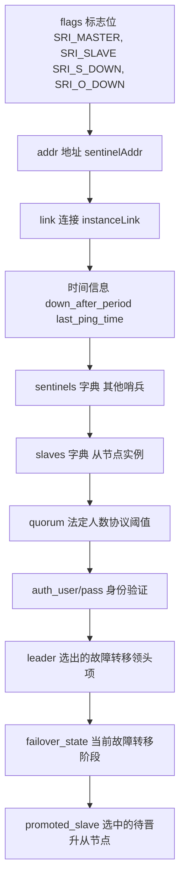

# Redis 哨兵 (Sentinel)

相关源文件

-   [sentinel.conf](https://github.com/redis/redis/blob/8ad54215/sentinel.conf)
-   [src/sentinel.c](https://github.com/redis/redis/blob/8ad54215/src/sentinel.c)
-   [tests/sentinel/tests/00-base.tcl](https://github.com/redis/redis/blob/8ad54215/tests/sentinel/tests/00-base.tcl)
-   [tests/sentinel/tests/01-conf-update.tcl](https://github.com/redis/redis/blob/8ad54215/tests/sentinel/tests/01-conf-update.tcl)
-   [tests/sentinel/tests/02-slaves-reconf.tcl](https://github.com/redis/redis/blob/8ad54215/tests/sentinel/tests/02-slaves-reconf.tcl)
-   [tests/sentinel/tests/05-manual.tcl](https://github.com/redis/redis/blob/8ad54215/tests/sentinel/tests/05-manual.tcl)
-   [tests/sentinel/tests/06-ckquorum.tcl](https://github.com/redis/redis/blob/8ad54215/tests/sentinel/tests/06-ckquorum.tcl)
-   [tests/sentinel/tests/07-down-conditions.tcl](https://github.com/redis/redis/blob/8ad54215/tests/sentinel/tests/07-down-conditions.tcl)
-   [tests/sentinel/tests/09-acl-support.tcl](https://github.com/redis/redis/blob/8ad54215/tests/sentinel/tests/09-acl-support.tcl)
-   [tests/sentinel/tests/10-replica-priority.tcl](https://github.com/redis/redis/blob/8ad54215/tests/sentinel/tests/10-replica-priority.tcl)
-   [tests/sentinel/tests/11-port-0.tcl](https://github.com/redis/redis/blob/8ad54215/tests/sentinel/tests/11-port-0.tcl)
-   [tests/sentinel/tests/12-master-reboot.tcl](https://github.com/redis/redis/blob/8ad54215/tests/sentinel/tests/12-master-reboot.tcl)

Redis 哨兵 (Sentinel) 是一个用于 Redis 部署的分布式监控和高可用系统。它为 Redis 主从拓扑结构提供自动故障转移、服务发现和配置管理。哨兵持续监控 Redis 实例，并在主节点不可用时编排故障转移程序，确保生产环境中的停机时间降至最低。

本文涵盖了哨兵的实现、架构和运行机制。有关 Redis 集群分布式数据分片能力的信息，请参阅 [Redis 集群](/redis/redis/6.1-redis-cluster)。

## 架构概览

Redis 哨兵作为一个独立的进程运行，监控 Redis 实例并与其他哨兵实例协调以做出故障转移决策。该系统采用基于法定人数 (quorum) 的方法，即触发故障转移操作前必须由多个哨兵达成一致。

### 核心系统组件



**来源：** [src/sentinel.c235-258](https://github.com/redis/redis/blob/8ad54215/src/sentinel.c#L235-L258) [src/sentinel.c162-232](https://github.com/redis/redis/blob/8ad54215/src/sentinel.c#L162-L232) [src/sentinel.c36-41](https://github.com/redis/redis/blob/8ad54215/src/sentinel.c#L36-L41)

### 实例状态管理

> **[Mermaid 状态图 (stateDiagram)]**
> *(注：此处的图表结构已根据原文保留占位)*

**来源：** [src/sentinel.c44-60](https://github.com/redis/redis/blob/8ad54215/src/sentinel.c#L44-L60) [src/sentinel.c90-96](https://github.com/redis/redis/blob/8ad54215/src/sentinel.c#L90-L96)

## 核心数据结构

### 哨兵全局状态

`sentinelState` 结构维护一个哨兵实例的全局状态，包括其标识、监控的主节点以及运行参数。

| 字段 | 类型 | 用途 |
| --- | --- | --- |
| `myid` | `char[41]` | 唯一的哨兵标识符 |
| `current_epoch` | `uint64_t` | 用于协调的配置纪元 |
| `masters` | `dict*` | 受监控主节点实例的字典 |
| `tilt` | `int` | 处理时钟问题的 TILT 模式标志 |
| `scripts_queue` | `list*` | 等待执行的通知脚本队列 |
| `announce_ip/port` | `char*/int` | 用于 NAT 环境的宣告地址覆盖 |

**来源：** [src/sentinel.c235-258](https://github.com/redis/redis/blob/8ad54215/src/sentinel.c#L235-L258)

### Redis 实例表示

`sentinelRedisInstance` 结构代表任何受监控的 Redis 实例（主节点、从节点或其他哨兵），具有全面的状态追踪功能。



**来源：** [src/sentinel.c162-232](https://github.com/redis/redis/blob/8ad54215/src/sentinel.c#L162-L232)

### 连接管理

`instanceLink` 结构管理哨兵实例之间的共享连接，以避免在监控多个主节点时连接数激增。

**来源：** [src/sentinel.c135-160](https://github.com/redis/redis/blob/8ad54215/src/sentinel.c#L135-L160)

## 监控与故障检测

### Ping 与健康检查

哨兵使用多种机制持续监控 Redis 实例：

-   **PING 命令**：按可配置间隔进行的定期健康检查。
-   **INFO 命令**：收集实例角色和复制状态。
-   **发布/订阅频道**：`__sentinel__:hello` 用于哨兵发现和 Gossip。

监控过程根据可配置的时间参数运行：

| 参数 | 默认值 | 目的 |
| --- | --- | --- |
| `sentinel_ping_period` | 1000ms | PING 命令之间的间隔 |
| `sentinel_info_period` | 10000ms | INFO 命令的频率 |
| `sentinel_default_down_after` | 30000ms | 宣告 SDOWN 之前的超时时间 |
| `sentinel_ask_period` | 1000ms | 哨兵查询间隔 |

**来源：** [src/sentinel.c63-77](https://github.com/redis/redis/blob/8ad54215/src/sentinel.c#L63-L77)

### 下线状态检测

**来源：** [src/sentinel.c44-60](https://github.com/redis/redis/blob/8ad54215/src/sentinel.c#L44-L60) [tests/sentinel/tests/07-down-conditions.tcl46-104](https://github.com/redis/redis/blob/8ad54215/tests/sentinel/tests/07-down-conditions.tcl#L46-L104)

## 故障转移过程

### 领头项选举与协调

当主节点被宣告为客观下线 (ODOWN) 时，哨兵会参与领头项 (leader) 选举过程，以指定哪个哨兵将编排故障转移。

> **[Mermaid 序列图 (sequence)]**
> *(注：此处的图表结构已根据原文保留占位)*

**来源：** [src/sentinel.c374](https://github.com/redis/redis/blob/8ad54215/src/sentinel.c#L374-L374) [src/sentinel.c385](https://github.com/redis/redis/blob/8ad54215/src/sentinel.c#L385-L385)

### 故障转移状态机

故障转移过程遵循定义好的状态机，具有特定的阶段：

| 状态 | 值 | 目的 |
| --- | --- | --- |
| `SENTINEL_FAILOVER_STATE_NONE` | 0 | 无故障转移正在进行 |
| `SENTINEL_FAILOVER_STATE_WAIT_START` | 1 | 等待故障转移开始时间 |
| `SENTINEL_FAILOVER_STATE_SELECT_SLAVE` | 2 | 选择用于晋升的从节点 |
| `SENTINEL_FAILOVER_STATE_SEND_SLAVEOF_NOONE` | 3 | 将从节点晋升为主节点 |
| `SENTINEL_FAILOVER_STATE_WAIT_PROMOTION` | 4 | 等待角色变更完成 |
| `SENTINEL_FAILOVER_STATE_RECONF_SLAVES` | 5 | 重新配置剩余的从节点 |
| `SENTINEL_FAILOVER_STATE_UPDATE_CONFIG` | 6 | 更新监控配置 |

**来源：** [src/sentinel.c90-96](https://github.com/redis/redis/blob/8ad54215/src/sentinel.c#L90-L96)

### 从节点选择算法

在选择用于晋升的从节点时，哨兵会考虑在 `sentinelSelectSlave()` 中实现的多个因素：

-   **从节点优先级**：可配置的优先级值（越低 = 优先级越高）。
-   **复制偏移量**：具有最新数据的从节点优先。
-   **从节点宣告**：从节点是否被宣告为可用。
-   **连接健康状况**：与从节点的连接是否稳定。

**来源：** [src/sentinel.c380](https://github.com/redis/redis/blob/8ad54215/src/sentinel.c#L380-L380)

## 配置与管理

### 配置文件结构

哨兵使用动态配置文件，该文件在运行时会被重写以持久化状态变更：

```
# 基础哨兵配置
port 26379
sentinel monitor mymaster 127.0.0.1 6379 2
sentinel down-after-milliseconds mymaster 30000
sentinel parallel-syncs mymaster 1
sentinel failover-timeout mymaster 180000

# 身份验证
sentinel auth-pass mymaster MySUPER--secret-0123passw0rd
sentinel auth-user mymaster sentinel-user

# 脚本
sentinel notification-script mymaster /var/redis/notify.sh
sentinel client-reconfig-script mymaster /var/redis/reconfig.sh
```

**来源：** [sentinel.conf1-362](https://github.com/redis/redis/blob/8ad54215/sentinel.conf#L1-L362)

### 运行时配置命令

哨兵提供了用于运行时配置管理的命令：

| 命令 | 目的 |
| --- | --- |
| `SENTINEL MONITOR` | 添加要监控的新主节点 |
| `SENTINEL REMOVE` | 停止监控主节点 |
| `SENTINEL SET` | 修改主节点参数 |
| `SENTINEL CONFIG GET/SET` | 管理哨兵配置 |
| `SENTINEL FAILOVER` | 触发手动故障转移 |

**来源：** [src/sentinel.c443-445](https://github.com/redis/redis/blob/8ad54215/src/sentinel.c#L443-L445)

## 脚本执行系统

### 通知与重配置脚本

哨兵支持在故障转移事件期间执行外部脚本，用于通知和客户端重配置。脚本执行系统提供以下功能：

-   **通知脚本**：在 WARNING 级别事件发生时执行，用于警报。
-   **客户端重配置脚本**：在故障转移期间执行，用于更新客户端。
-   **重试逻辑**：具有指数级退避的自动重试。
-   **超时保护**：脚本超过最大运行时间将被终止。

**来源：** [src/sentinel.c261-271](https://github.com/redis/redis/blob/8ad54215/src/sentinel.c#L261-L271) [src/sentinel.c736-780](https://github.com/redis/redis/blob/8ad54215/src/sentinel.c#L736-L780) [src/sentinel.c800-908](https://github.com/redis/redis/blob/8ad54215/src/sentinel.c#L800-L908)

### 脚本安全

脚本执行包含安全措施：

-   **deny-scripts-reconfig**：防止在运行时修改脚本路径。
-   **最大运行时间**：默认 60 秒超时，之后会发送 SIGKILL。
-   **最大重试次数**：最多重试 10 次。
-   **队列限制**：最大 256 个排队脚本，16 个并发执行。

**来源：** [src/sentinel.c75-76](https://github.com/redis/redis/blob/8ad54215/src/sentinel.c#L75-L76) [src/sentinel.c110-114](https://github.com/redis/redis/blob/8ad54215/src/sentinel.c#L110-L114) [sentinel.conf301-306](https://github.com/redis/redis/blob/8ad54215/sentinel.conf#L301-L306)

## 网络与安全特性

### 地址解析与 NAT 支持

哨兵支持通过地址宣告在 NAT 环境中部署：

-   **resolve-hostnames**：启用主机名解析，而非仅限 IP。
-   **announce-hostnames**：可用时宣告主机名而非 IP。
-   **announce-ip/port**：覆盖宣告的地址以进行 NAT 穿透。

**来源：** [src/sentinel.c256-257](https://github.com/redis/redis/blob/8ad54215/src/sentinel.c#L256-L257) [sentinel.conf336-351](https://github.com/redis/redis/blob/8ad54215/sentinel.conf#L336-L351)

### 身份验证集成

哨兵与 Redis 身份验证系统集成：

-   **ACL 支持**：与 Redis 6.0+ ACL 系统完全集成。
-   **旧版 AUTH**：支持基于密码的身份验证。
-   **哨兵间验证**：用于哨兵间通信的独立凭据。
-   **主/从验证**：用于受监控实例的统一凭据。

**来源：** [src/sentinel.c200-201](https://github.com/redis/redis/blob/8ad54215/src/sentinel.c#L200-L201) [src/sentinel.c254-255](https://github.com/redis/redis/blob/8ad54215/src/sentinel.c#L254-L255) [tests/sentinel/tests/09-acl-support.tcl1-56](https://github.com/redis/redis/blob/8ad54215/tests/sentinel/tests/09-acl-support.tcl#L1-L56)

## 高可用特性

### TILT 模式保护

哨兵包含 TILT 模式，作为针对时钟问题和系统不稳定的保护措施：

在 TILT 模式期间，哨兵：

-   继续监控但避免触发故障转移。
-   防止误报的故障检测。
-   在时间稳定后自动恢复。

**来源：** [src/sentinel.c241-245](https://github.com/redis/redis/blob/8ad54215/src/sentinel.c#L241-L245) [src/sentinel.c70-71](https://github.com/redis/redis/blob/8ad54215/src/sentinel.c#L70-L71)

### 法定人数 (Quorum) 与多数派要求

哨兵实现了一个两级决策系统：

1.  **ODOWN 法定人数**：宣告客观下线所需的最小哨兵数。
2.  **多数派同意**：已知哨兵的多数派必须同意才能授权故障转移。

这防止了脑裂场景，并确保故障转移仅在达成充分共识的情况下发生。

**来源：** [tests/sentinel/tests/00-base.tcl121-158](https://github.com/redis/redis/blob/8ad54215/tests/sentinel/tests/00-base.tcl#L121-L158) [tests/sentinel/tests/06-ckquorum.tcl1-42](https://github.com/redis/redis/blob/8ad54215/tests/sentinel/tests/06-ckquorum.tcl#L1-L42)
