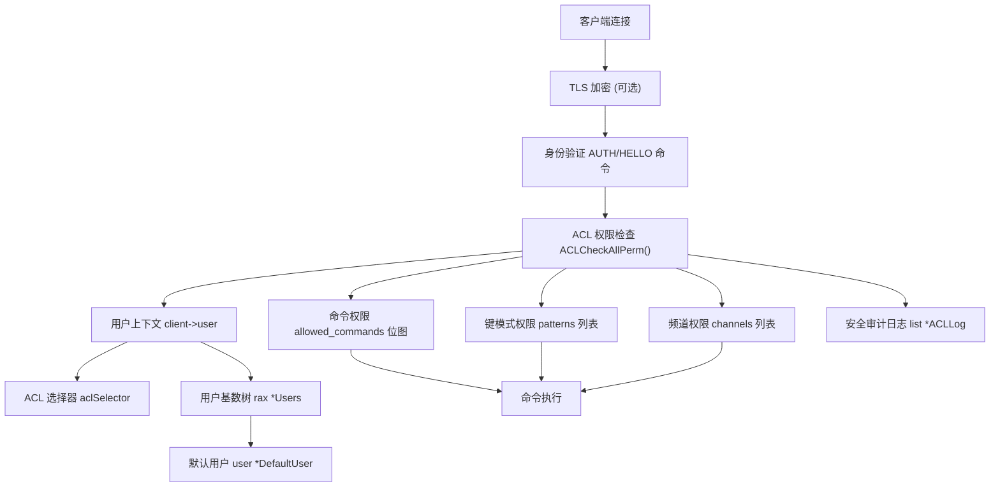
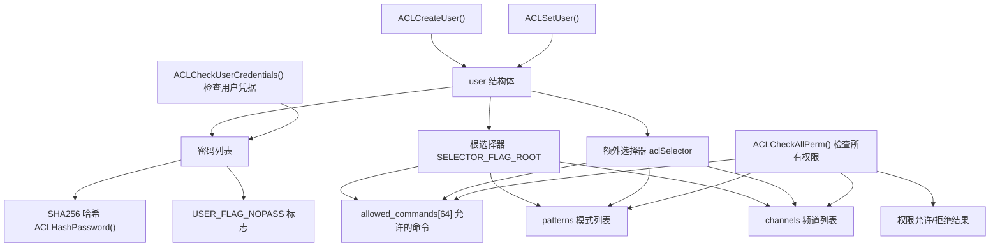
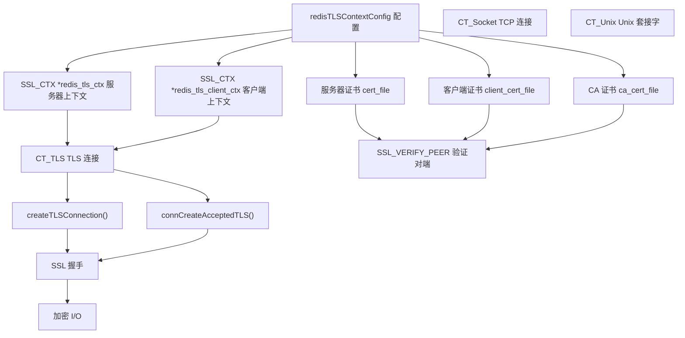

# 安全

相关源文件

-   [src/acl.c](https://github.com/redis/redis/blob/8ad54215/src/acl.c)
-   [src/anet.c](https://github.com/redis/redis/blob/8ad54215/src/anet.c)
-   [src/anet.h](https://github.com/redis/redis/blob/8ad54215/src/anet.h)
-   [src/connection.c](https://github.com/redis/redis/blob/8ad54215/src/connection.c)
-   [src/connection.h](https://github.com/redis/redis/blob/8ad54215/src/connection.h)
-   [src/socket.c](https://github.com/redis/redis/blob/8ad54215/src/socket.c)
-   [src/tls.c](https://github.com/redis/redis/blob/8ad54215/src/tls.c)
-   [src/unix.c](https://github.com/redis/redis/blob/8ad54215/src/unix.c)
-   [tests/assets/user.acl](https://github.com/redis/redis/blob/8ad54215/tests/assets/user.acl)
-   [tests/unit/acl-v2.tcl](https://github.com/redis/redis/blob/8ad54215/tests/unit/acl-v2.tcl)
-   [tests/unit/acl.tcl](https://github.com/redis/redis/blob/8ad54215/tests/unit/acl.tcl)
-   [tests/unit/introspection-2.tcl](https://github.com/redis/redis/blob/8ad54215/tests/unit/introspection-2.tcl)

## 目的与范围

本文涵盖了 Redis 全面的安全框架，该框架提供了身份验证、授权和网络保护能力。安全系统主要由两个核心组件组成：用于用户管理和权限控制的访问控制列表 (ACL)，以及包括 TLS/SSL 加密在内的网络安全特性。

有关用户管理以及命令/键权限的详细信息，请参阅[访问控制列表 (ACL)](/redis/redis/8.1-access-control-lists)。有关网络加密和证书管理的详细信息，请参阅[网络安全与 TLS](/redis/redis/8.2-network-security-and-tls)。

## Redis 安全架构

Redis 安全性围绕分层方法构建，在多个层面防止未经授权的访问：身份验证、命令授权、键访问控制以及网络加密。



**Redis 安全架构概览**

**来源：** [src/acl.c20-41](https://github.com/redis/redis/blob/8ad54215/src/acl.c#L20-L41) [src/tls.c41-42](https://github.com/redis/redis/blob/8ad54215/src/tls.c#L41-L42) [src/networking.c](https://github.com/redis/redis/blob/8ad54215/src/networking.c) [src/connection.c30-31](https://github.com/redis/redis/blob/8ad54215/src/connection.c#L30-L31)

## 访问控制列表 (ACL)

ACL 系统提供对用户身份验证和授权的细粒度控制。每个用户可以拥有多个密码、命令权限、键访问模式以及通过选择器组织起的频道权限。



**ACL 系统组件与数据流**

ACL 系统维护一个包含所有用户定义的全局 `Users` 基数树。每个用户都有一组定义其权限的选择器。根选择器提供向后兼容性，而额外的选择器则支持复杂的权限方案。

**来源：** [src/acl.c420-442](https://github.com/redis/redis/blob/8ad54215/src/acl.c#L420-L442) [src/acl.c345-362](https://github.com/redis/redis/blob/8ad54215/src/acl.c#L345-L362) [src/acl.c504-518](https://github.com/redis/redis/blob/8ad54215/src/acl.c#L504-L518)

## 网络安全与 TLS

Redis 通过连接抽象层支持所有连接类型的 TLS 加密。TLS 配置包括证书管理、协议版本控制以及客户端身份验证选项。



**TLS 连接安全流程**

**来源：** [src/tls.c180-255](https://github.com/redis/redis/blob/8ad54215/src/tls.c#L180-L255) [src/tls.c433-444](https://github.com/redis/redis/blob/8ad54215/src/tls.c#L433-L444) [src/tls.c467-496](https://github.com/redis/redis/blob/8ad54215/src/tls.c#L467-L496)

## 安全命令处理

Redis 将安全检查集成到每个命令执行路径中。安全验证发生在命令执行之前，并记录安全违规行为以供审计。

> **[Mermaid 序列图 (sequence)]**
> *(注：此处的图表结构已根据原文保留占位)*

**安全集成的命令处理**

**来源：** [src/acl.c2447-2495](https://github.com/redis/redis/blob/8ad54215/src/acl.c#L2447-L2495) [src/acl.c2497-2565](https://github.com/redis/redis/blob/8ad54215/src/acl.c#L2497-L2565) [src/networking.c](https://github.com/redis/redis/blob/8ad54215/src/networking.c)

## 安全配置与管理

### 用户管理

| 组件 | 用途 | 关键函数 |
| --- | --- | --- |
| `Users` 基数树 | 全局用户存储 | `ACLCreateUser()`, `ACLFreeUser()` |
| `DefaultUser` | 回退（默认）权限 | 在启动时配置 |
| 密码管理 | 身份验证凭据 | `ACLHashPassword()`, 支持明文 |

### 权限模型

| 权限类型 | 范围 | 配置示例 |
| --- | --- | --- |
| 命令权限 | 单个命令或类别 | `+command`, `-command`, `+@category` |
| 键模式 | 键访问控制 | `~pattern`, `%R~pattern`, `%W~pattern` |
| 频道模式 | 发布/订阅授权 | `&pattern`, `resetchannels` |

### 安全配置文件

Redis 支持通过 `.acl` 文件进行外部 ACL 配置，其中定义了用户及其权限。配置在启动时加载，并可以动态重新加载。

示例 ACL 配置结构：

```
user alice on allcommands allkeys &* >alice
user bob on -@all +@set +acl ~set* &* >bob
```

**来源：** [tests/assets/user.acl1-4](https://github.com/redis/redis/blob/8ad54215/tests/assets/user.acl#L1-L4) [src/acl.c27-33](https://github.com/redis/redis/blob/8ad54215/src/acl.c#L27-L33) [src/server.c](https://github.com/redis/redis/blob/8ad54215/src/server.c)

安全系统通过高效的数据结构和优化的权限检查算法，在保持 Redis 性能特性的同时提供了全面的保护。
