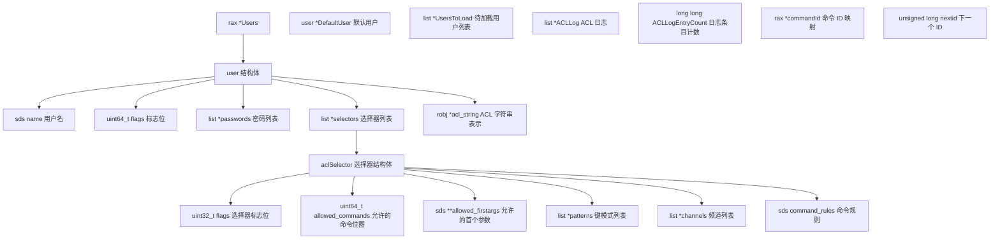
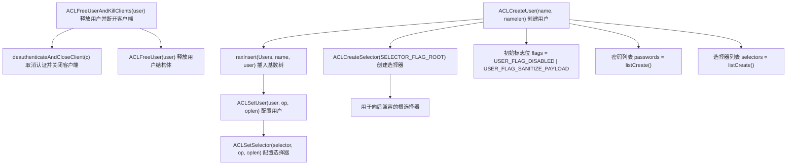
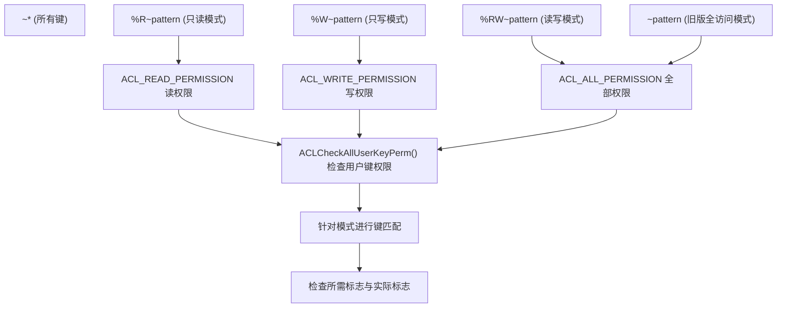
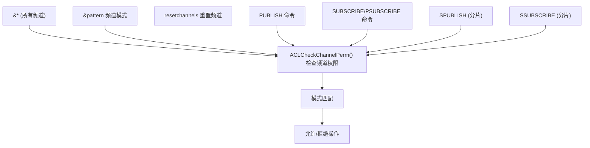
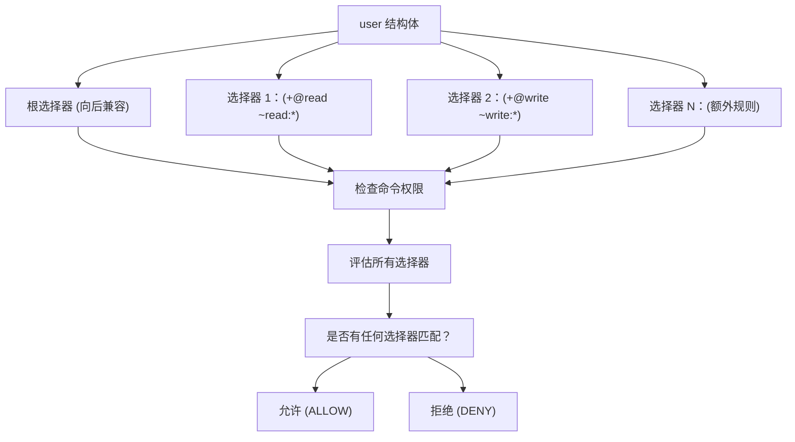
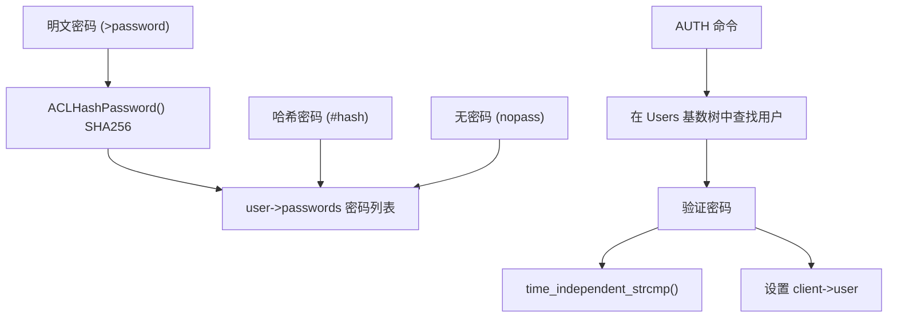

# 访问控制列表 (ACL)

相关源文件

-   [src/acl.c](https://github.com/redis/redis/blob/8ad54215/src/acl.c)
-   [tests/assets/user.acl](https://github.com/redis/redis/blob/8ad54215/tests/assets/user.acl)
-   [tests/unit/acl-v2.tcl](https://github.com/redis/redis/blob/8ad54215/tests/unit/acl-v2.tcl)
-   [tests/unit/acl.tcl](https://github.com/redis/redis/blob/8ad54215/tests/unit/acl.tcl)
-   [tests/unit/introspection-2.tcl](https://github.com/redis/redis/blob/8ad54215/tests/unit/introspection-2.tcl)

Redis 访问控制列表 (ACL) 提供了一个全面的身份验证和授权系统，能够对用户权限进行细粒度控制。ACL 系统允许管理员定义具有特定命令权限、键访问模式和发布/订阅频道限制的用户。

## 系统架构

ACL 系统围绕几个核心组件构建，这些组件共同协作以强制执行安全策略：

### 核心数据结构



**来源：** [src/acl.c20-41](https://github.com/redis/redis/blob/8ad54215/src/acl.c#L20-L41) [src/acl.c121-132](https://github.com/redis/redis/blob/8ad54215/src/acl.c#L121-L132) [src/acl.c146-173](https://github.com/redis/redis/blob/8ad54215/src/acl.c#L146-L173)

ACL 系统维护一个全局基数树 (`Users`)，将用户名映射到 `user` 结构。每个用户包含身份验证凭据、标志位以及一个或多个定义其权限的 `aclSelector` 结构。`commandId` 基数树将命令名称映射到 ID，以便进行高效的权限检查。

### 命令类别与权限检查

```mermaid
flowchart TD
    ACLCommandCategories["struct ACLCategoryItem *ACLCommandCategories 命令类别"]
    ACLDefaultCommandCategories["ACLDefaultCommandCategories[] 默认命令类别"]
    nextCommandCategory["size_t nextCommandCategory 下一类别索引"]
    ACLAddCommandCategory["ACLAddCommandCategory() 添加命令类别"]
    ACLGetCommandBitCoordinates["ACLGetCommandBitCoordinates() 获取命令位坐标"]
    ACLGetSelectorCommandBit["ACLGetSelectorCommandBit() 获取选择器命令位"]
    ACLSetSelectorCommandBit["ACLSetSelectorCommandBit() 设置选择器命令位"]
    ACLCheckCommandPerm["ACLCheckCommandPerm() 检查命令权限"]
    orig_commands["server.orig_commands 原始命令表"]
    subcommands_dict["cmd->subcommands_dict 子命令字典"]
    cmd_id["cmd->id 命令 ID"]
    acl_categories["cmd->acl_categories 命令所属 ACL 类别"]

    ACLCommandCategories --> ACLGetCommandBitCoordinates
    orig --> commands_cmd_id
    cmd --> id_ACLGetSelectorCommandBit
    acl --> categories_ACLSetSelectorCommandBit
    subcommands --> dict_cmd_id
    ACLGetSelectorCommandBit --> ACLCheckCommandPerm
```



**来源：** [src/acl.c45-71](https://github.com/redis/redis/blob/8ad54215/src/acl.c#L45-L71) [src/acl.c89-105](https://github.com/redis/redis/blob/8ad54215/src/acl.c#L89-L105) [src/acl.c526-531](https://github.com/redis/redis/blob/8ad54215/src/acl.c#L526-L531) [src/acl.c540-544](https://github.com/redis/redis/blob/8ad54215/src/acl.c#L540-L544)

ACL 系统定义了命令类别（如 "keyspace"、"read"、"write" 等），将相关的命令分组。每个命令都被分配了一个唯一的 ID，并且可以属于多个类别。权限检查系统使用位操作来实现高效的命令权限验证。

## 用户管理

### 用户生命周期与管理函数



**来源：** [src/acl.c420-442](https://github.com/redis/redis/blob/8ad54215/src/acl.c#L420-L442) [src/acl.c482-499](https://github.com/redis/redis/blob/8ad54215/src/acl.c#L482-L499) [src/acl.c345-362](https://github.com/redis/redis/blob/8ad54215/src/acl.c#L345-L362) [src/acl.c463-472](https://github.com/redis/redis/blob/8ad54215/src/acl.c#L463-L472)

`ACLCreateUser` 函数创建一个带有 `USER_FLAG_DISABLED` 和 `USER_FLAG_SANITIZE_PAYLOAD` 标志的新用户。为了向后兼容，每个用户最初都有一个通过 `ACLCreateSelector` 创建的、带有 `SELECTOR_FLAG_ROOT` 标志的根选择器。当使用 `ACLFreeUserAndKillClients` 删除用户时，所有认证为该用户的已连接客户端都会被断开。

### 用户标志与状态

| 标志位 | 用途 | 描述 |
| --- | --- | --- |
| `USER_FLAG_ENABLED` | 用户已启用 | 允许用户连接到 Redis |
| `USER_FLAG_DISABLED` | 用户已禁用 | 禁止用户连接 (默认) |
| `USER_FLAG_NOPASS` | 无需密码 | 允许无需密码进行认证 |
| `USER_FLAG_SANITIZE_PAYLOAD` | 在日志中脱敏命令参数 | 在日志中隐藏敏感数据 (默认) |
| `USER_FLAG_SANITIZE_PAYLOAD_SKIP` | 跳过脱敏 | 在日志中显示所有命令参数 |

**来源：** [src/acl.c121-132](https://github.com/redis/redis/blob/8ad54215/src/acl.c#L121-L132)

这些标志控制用户帐户的基本行为。默认情况下，新用户创建时带有 `USER_FLAG_DISABLED` 和 `USER_FLAG_SANITIZE_PAYLOAD`。可以使用 `ACL SETUSER` 命令及其选项（如 `on`、`off`、`nopass` 等）修改这些标志。

## 权限系统

### 命令权限位图系统

```mermaid
flowchart TD
    ACLSetSelectorCommandBitsForCategory["ACLSetSelectorCommandBitsForCategory() 设置类别的命令位"]
    ACLChangeSelectorPerm["ACLChangeSelectorPerm(selector, cmd, allow) 更改选择器权限"]
    subcommands_dict["迭代 cmd->subcommands_dict"]
    cmd_id["unsigned long id 命令 ID"]
    ACLGetCommandBitCoordinates["ACLGetCommandBitCoordinates(id, &word, &bit) 获取位坐标"]
    word_calc["字索引计算 *word = id / sizeof(uint64_t) / 8"]
    bit_calc["位掩码计算 *bit = 1ULL << (id % (sizeof(uint64_t) * 8))"]
    ACLGetSelectorCommandBit["ACLGetSelectorCommandBit(selector, id)"]
    allowed_commands_check["检查位图 selector->allowed_commands[word] & bit"]
    ACLSetSelectorCommandBit["ACLSetSelectorCommandBit(selector, id, value)"]
    SELECTOR_FLAG_ALLCOMMANDS["如果值为 0，则清除 SELECTOR_FLAG_ALLCOMMANDS"]
    allowed_firstargs["允许的首个参数 selector->allowed_firstargs[id]"]
    ACLAddAllowedFirstArg["ACLAddAllowedFirstArg(selector, id, sub)"]
    ACLResetFirstArgsForCommand["ACLResetFirstArgsForCommand(selector, id) 重置首个参数"]

    cmd --> id_ACLGetCommandBitCoordinates
    ACLGetCommandBitCoordinates --> word_calc
    ACLGetCommandBitCoordinates --> bit_calc
    word --> calc_ACLGetSelectorCommandBit
    bit --> calc_ACLGetSelectorCommandBit
    ACLGetSelectorCommandBit --> allowed_commands_check
    ACLSetSelectorCommandBit --> SELECTOR_FLAG_ALLCOMMANDS
    cmd --> id_allowed_firstargs
    allowed --> firstargs_ACLAddAllowedFirstArg
    ACLSetSelectorCommandBitsForCategory --> ACLChangeSelectorPerm
    ACLChangeSelectorPerm --> subcommands_dict
```



**来源：** [src/acl.c526-531](https://github.com/redis/redis/blob/8ad54215/src/acl.c#L526-L531) [src/acl.c540-567](https://github.com/redis/redis/blob/8ad54215/src/acl.c#L540-L567) [src/acl.c651-664](https://github.com/redis/redis/blob/8ad54215/src/acl.c#L651-L664) [src/acl.c913-1001](https://github.com/redis/redis/blob/8ad54215/src/acl.c#L913-L1001)

系统使用 `USER_COMMAND_BITS_COUNT` 来定义命令的最大数量。通过 `ACLGetCommandBitCoordinates`，每个命令 ID 映射到 `allowed_commands` 数组中的特定位。类别由 `ACLSetSelectorCommandBitsForCategory` 处理，该函数迭代所有具有匹配 `acl_categories` 标志的命令。

`allowed_firstargs` 数组通过允许特定的子命令或命令参数实现了更细粒度的控制。例如，可以允许用户使用 `CONFIG GET` 但禁止使用 `CONFIG SET`。

### 键访问模式

Redis ACL v2 引入了细粒度的键权限，包括读、写和读写访问：



**来源：** [src/acl.c292-326](https://github.com/redis/redis/blob/8ad54215/src/acl.c#L292-L326) [src/acl.c330-341](https://github.com/redis/redis/blob/8ad54215/src/acl.c#L330-L341)

键模式控制用户可以访问哪些键。系统支持不同的权限类型：

-   `~pattern` - 对匹配模式的键具有完全访问权限 (旧版)。
-   `%R~pattern` - 对匹配模式的键具有只读访问权限。
-   `%W~pattern` - 对匹配模式的键具有只写访问权限。
-   `%RW~pattern` - 读写访问权限 (等同于 `~pattern`)。
-   `~*` 或 `allkeys` - 访问所有键。

每个 Redis 命令在内部都会标记其所需的键访问类型（读、写或两者皆有）。ACL 系统会检查用户是否对正在访问的键拥有适当的权限。

### 频道权限

发布/订阅（Pub/Sub）频道的访问受模式匹配控制，类似于键模式：



**来源：** [src/acl.c164-170](https://github.com/redis/redis/blob/8ad54215/src/acl.c#L164-L170) [tests/unit/acl.tcl93-170](https://github.com/redis/redis/blob/8ad54215/tests/unit/acl.tcl#L93-L170)

频道权限控制用户可以访问哪些发布/订阅频道：

-   `&pattern` - 访问匹配模式的频道。
-   `&*` 或 `allchannels` - 访问所有频道。
-   `resetchannels` - 重置频道权限 (移除所有权限)。

ACL 系统对所有发布/订阅操作（包括 `PUBLISH`、`SUBSCRIBE`、`PSUBSCRIBE` 及其分片变体）强制执行这些权限。当用户的频道权限被撤销时，该用户对这些频道的任何活跃订阅都会自动终止。

## 选择器 (ACL v2)

### 选择器架构

ACL v2 引入了选择器 (Selectors)，允许用户拥有多套独立评估的权限：



**来源：** [src/acl.c408-413](https://github.com/redis/redis/blob/8ad54215/src/acl.c#L408-L413) [src/acl.c345-371](https://github.com/redis/redis/blob/8ad54215/src/acl.c#L345-L371) [tests/unit/acl-v2.tcl1-21](https://github.com/redis/redis/blob/8ad54215/tests/unit/acl-v2.tcl#L1-L21)

每个选择器都是独立的，并包含自己的命令权限、键模式和频道模式。如果任一选择器允许执行，则该命令被允许。这支持更复杂的权限场景，例如允许用户对一组键执行读操作，而对另一组键执行写操作。

根选择器提供了与 ACL v1 的向后兼容性，且始终存在。额外的选择器在 ACL 语法中使用括号定义：`(+@read ~read:*)`。

### 选择器管理函数

| 函数 | 用途 | 描述 |
| --- | --- | --- |
| `ACLCreateSelector` | 创建带有标志位的新选择器 | 使用指定的标志位初始化选择器 |
| `ACLFreeSelector` | 清理选择器资源 | 释放选择器占用的内存 |
| `ACLCopySelector` | 创建选择器的精确副本 | 复制一个选择器，包括其所有权限 |
| `ACLUserGetRootSelector` | 获取向后兼容的根选择器 | 返回第一个选择器 (根) |
| `ACLSetSelector` | 配置选择器权限 | 解析 ACL 规则并应用于选择器 |

**来源：** [src/acl.c345-413](https://github.com/redis/redis/blob/8ad54215/src/acl.c#L345-L413) [src/acl.c179-180](https://github.com/redis/redis/blob/8ad54215/src/acl.c#L179-L180)

选择器通过这些函数进行内部管理。`ACLCreateSelector` 函数默认初始化一个权限为空的新选择器。`ACLSetSelector` 函数解析 ACL 规则并将其应用于选择器。当使用 `ACLCopyUser` 复制用户时，所有选择器也会被复制。

## 身份验证机制

### 密码系统

Redis 支持多种身份验证方法：



**来源：** [src/acl.c193-199](https://github.com/redis/redis/blob/8ad54215/src/acl.c#L193-L199) [src/acl.c203-218](https://github.com/redis/redis/blob/8ad54215/src/acl.c#L203-L218) [src/acl.c222-237](https://github.com/redis/redis/blob/8ad54215/src/acl.c#L222-L237) [tests/unit/acl.tcl25-71](https://github.com/redis/redis/blob/8ad54215/tests/unit/acl.tcl#L25-L71)

系统使用 SHA256 进行密码哈希，并使用时间无关的字符串比较来防止计时攻击。Redis 支持多种身份验证方法：

1.  **明文密码**：使用 `>password` 语法添加，以 SHA256 哈希形式存储。
2.  **哈希密码**：直接使用 `#hash` 语法添加（64 位十六进制 SHA256 哈希）。
3.  **无密码**：设置 `nopass` 标志，允许无需密码进行认证。
4.  **多密码**：一个用户可以同时拥有多个有效密码。

可以单独添加或删除密码，而不会影响其他密码。`time_independent_strcmp` 函数通过在恒定时间内比较字符串（无论差异发生在哪里）来防止计时攻击。

## ACL 文件格式与持久化

### ACL 文件结构

Redis ACL 可以使用 `aclfile` 配置指令持久化到外部文件并从其加载。ACL 文件格式使用简单的基于行的语法：

```
user alice on allcommands allkeys &* >alice
user bob on -@all +@set +acl ~set* &* >bob
user doug on resetchannels &test +@all ~* >doug
user default on nopass ~* &* +@all
```

**来源：** [tests/assets/user.acl1-5](https://github.com/redis/redis/blob/8ad54215/tests/assets/user.acl#L1-L5)

每一行定义了一个用户及其完整的权限集。该格式支持：

-   用户标志 (`on`、`off`、`nopass`)。
-   命令权限 (`+@category`、`-@category`、`+command`、`-command`)。
-   键模式 (`~pattern`、`%R~pattern`、`%W~pattern`)。
-   频道模式 (`&pattern`、`allchannels`、`resetchannels`)。
-   密码 (`>password`、`#hashedpassword`)。
-   选择器 (用括号括起来)。

### ACL 加载与保存

| 函数 | 用途 | 实现方式 |
| --- | --- | --- |
| `ACLLoadUsersAtStartup` | 启动时从 ACL 文件加载用户 | 逐行读取文件，解析每个用户定义 |
| `ACLSaveToFile` | 将当前 ACL 状态保存到文件 | 遍历 Users 基数树，写入用户定义 |
| `ACLLoadFromFile` | 从文件加载用户 (ACL LOAD) | 运行时加载 ACL 文件 |

**来源：** [src/acl.c27-33](https://github.com/redis/redis/blob/8ad54215/src/acl.c#L27-L33)

`UsersToLoad` 列表存储启动期间从配置文件读取的用户定义。这些用户在模块初始化后加载，以确保所有命令和类别在分配权限时都可用。

## ACL 日志与监控

### ACL 安全日志系统

```mermaid
flowchart TD
    ACL_LOG_RESET["ACL LOG RESET 重置日志"]
    listEmpty["listEmpty(ACLLog) 清空列表"]
    ACL_LOG_count["ACL LOG [count] 查看日志"]
    listGetNodeValue["listGetNodeValue() 获取节点值"]
    ACLCheckCommandPerm["ACLCheckCommandPerm() 返回 C_ERR"]
    ACLCheckAllUserKeyPerm["ACLCheckAllUserKeyPerm() 返回 C_ERR"]
    ACLCheckChannelPerm["ACLCheckChannelPerm() 返回 C_ERR"]
    AuthenticateUser["authenticateUser() 失败"]
    ACLLogAddEntry["ACLLogAddEntry(c, reason, context, object, username) 添加日志条目"]
    log_entry_struct["安全日志条目结构体"]
    entry_id["entry-id (唯一条目 ID)"]
    timestamp_created["timestamp-created (创建时间戳)"]
    timestamp_last_updated["timestamp-last-updated (最后更新时间戳)"]
    count["count (聚合计数)"]
    username["username (用户名)"]
    context["context (上下文：toplevel/multi/lua)"]
    reason["reason (原因：command/key/channel/auth)"]
    object["object (对象：命令/键/频道名)"]
    client_info["client-info (客户端信息)"]
    ACLLog_list["list *ACLLog 日志列表"]
    ACLLogEntryCount["long long ACLLogEntryCount 总条目数"]
    ACLFreeLogEntry["ACLFreeLogEntry(void *le) 释放日志条目"]

    ACLCheckCommandPerm --> ACLLogAddEntry
    ACLCheckAllUserKeyPerm --> ACLLogAddEntry
    ACLCheckChannelPerm --> ACLLogAddEntry
    AuthenticateUser --> ACLLogAddEntry
    ACLLogAddEntry --> log_entry_struct
    log --> entry_struct_entry_id
    log --> entry_struct_timestamp_created
    log --> entry_struct_timestamp_last_updated
    log --> entry_struct_count
    log --> entry_struct_username
    log --> entry_struct_context
    log --> entry_struct_reason
    log --> entry_struct_object
    log --> entry_struct_client_info
    ACLLogAddEntry --> ACLLog_list
    ACLLog --> list_ACLLogEntryCount
    ACL --> LOG_RESET_listEmpty
    ACL --> LOG_count_listGetNodeValue
```



**来源：** [src/acl.c34-37](https://github.com/redis/redis/blob/8ad54215/src/acl.c#L34-L37) [tests/unit/acl.tcl678-699](https://github.com/redis/redis/blob/8ad54215/tests/unit/acl.tcl#L678-L699) [tests/unit/acl.tcl701-741](https://github.com/redis/redis/blob/8ad54215/tests/unit/acl.tcl#L701-L741)

ACL 日志系统将安全违规行为记录在全局日志中，可以使用 `ACL LOG` 命令进行检查。该系统记录了四种类型的违规：

1.  **命令违规**：当用户尝试执行不被允许的命令时。
2.  **键违规**：当用户尝试访问其没有权限的键时。
3.  **频道违规**：当用户尝试访问没有权限的发布/订阅频道时。
4.  **身份验证失败**：由于凭据错误导致身份验证失败时。

每个日志条目包含详细信息，包括：

-   唯一的条目 ID (`ACLLogEntryCount` 提供唯一的递增 ID)。
-   创建和最后更新的时间戳。
-   发生次数（针对聚合的类似事件）。
-   导致违规的用户名。
-   执行上下文（顶级、事务、Lua 脚本）。
-   违规原因。
-   被访问的对象。
-   客户端信息。

可以使用 `ACL LOG RESET` 重置日志，并使用 `ACL LOG [count]` 查看日志，其中 count 限制返回的条目数。最大日志大小由 `acllog-max-len` 配置参数控制。

## 配置与管理命令

### ACL 命令实现

| 命令 | 实现函数 | 关键函数 | 目的 |
| --- | --- | --- | --- |
| `ACL SETUSER` | `aclCommand` | `ACLSetUser`, `ACLSetSelector` | 创建/修改用户权限 |
| `ACL GETUSER` | `aclCommand` | `ACLDescribeUser`, `ACLDescribeSelector` | 检索用户配置 |
| `ACL LIST` | `aclCommand` | `ACLDescribeUser`, `raxStart`, `raxNext` | 列出所有用户及其规则 |
| `ACL WHOAMI` | `aclCommand` | `c->user->name` | 获取当前认证用户的名称 |
| `ACL LOG` | `aclCommand` | `listLength(ACLLog)`, `listGetNodeValue` | 查看安全事件日志 |
| `ACL CAT` | `aclCommand` | `ACLCommandCategories`, `dictIterator` | 列出命令类别及其包含的命令 |
| `ACL DRYRUN` | `aclCommand` | `ACLCheckCommandPerm`, `ACLCheckAllUserKeyPerm` | 在不执行的情况下测试权限 |
| `ACL USERS` | `aclCommand` | `raxStart`, `raxNext` | 列出所有用户名 |
| `ACL DELUSER` | `aclCommand` | `raxRemove`, `ACLFreeUserAndKillClients` | 删除用户并断开其客户端连接 |
| `ACL LOAD` | `aclCommand` | `ACLLoadFromFile` | 从配置的 ACL 文件重新加载用户 |
| `ACL SAVE` | `aclCommand` | `ACLSaveToFile` | 将当前 ACL 状态保存到文件 |
| `ACL GENPASS` | `aclCommand` | `getRandomHexChars` | 生成安全的随机密码 |

**来源：** [tests/unit/acl.tcl1-12](https://github.com/redis/redis/blob/8ad54215/tests/unit/acl.tcl#L1-L12) [tests/unit/acl-v2.tcl333-348](https://github.com/redis/redis/blob/8ad54215/tests/unit/acl-v2.tcl#L333-L348) [tests/unit/acl.tcl913-918](https://github.com/redis/redis/blob/8ad54215/tests/unit/acl.tcl#L913-L918)

`ACL DRYRUN` 命令使用与普通命令执行相同的权限检查函数（`ACLCheckCommandPerm`、`ACLCheckAllUserKeyPerm`），但实际上并不运行该命令。这允许测试复杂的权限场景，包括键模式、命令限制和选择器评估。

`ACL LOAD` 和 `ACL SAVE` 命令管理 ACL 规则到磁盘的持久化。默认情况下，Redis 会在 `aclfile` 配置指令指定的路径查找 ACL 文件。

### 规则语法与解析

ACL 系统支持丰富的语法来定义权限：

-   **用户标志位**：`on`, `off`, `nopass`, `sanitize-payload`。
-   **密码**：`>password`, `#hashedpassword`, `<removepassword`。
-   **命令**：`+command`, `-command`, `+@category`, `-@category`。
-   **键**：`~pattern`, `%R~pattern`, `%W~pattern`, `%RW~pattern`。
-   **频道**：`&pattern`, `allchannels`, `resetchannels`。
-   **选择器**：`(+@read ~read:*)`。

**来源：** [src/acl.c1024-1500](https://github.com/redis/redis/blob/8ad54215/src/acl.c#L1024-L1500) [tests/unit/acl-v2.tcl62-83](https://github.com/redis/redis/blob/8ad54215/tests/unit/acl-v2.tcl#L62-L83)

这一全面的 ACL 系统为 Redis 提供了企业级的安全能力，同时保持了向后兼容性和易用性。
