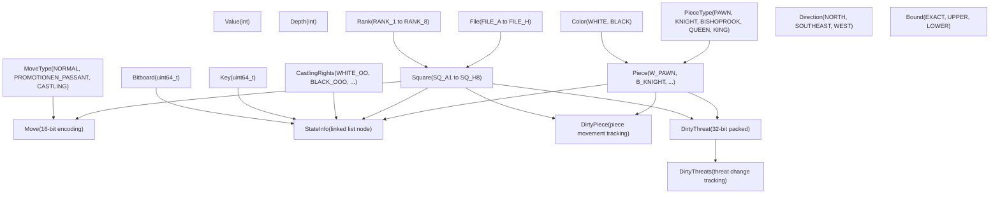
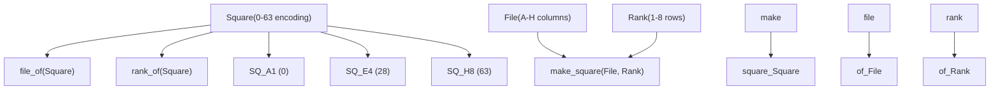
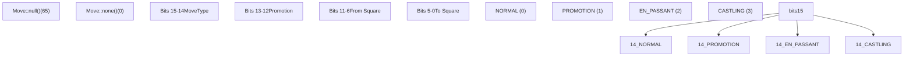
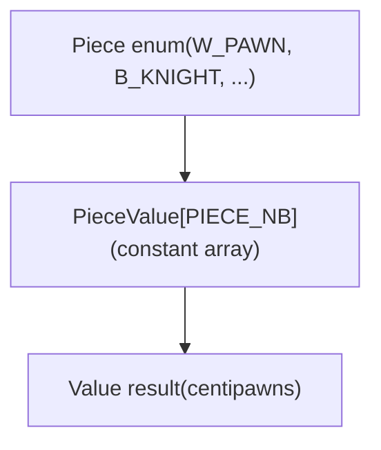
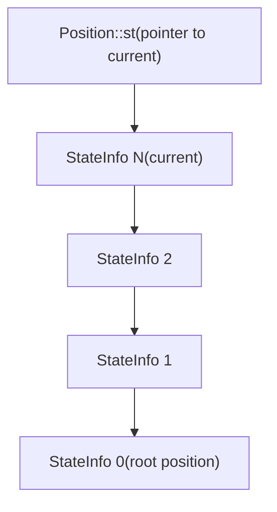
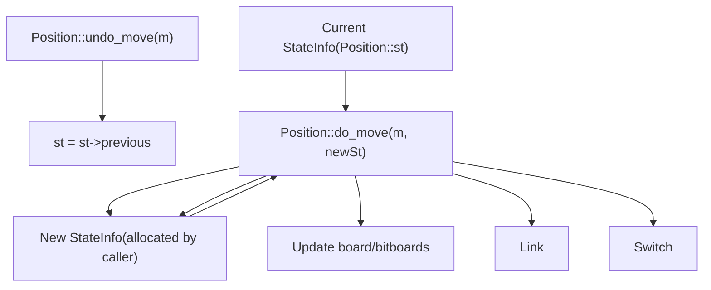
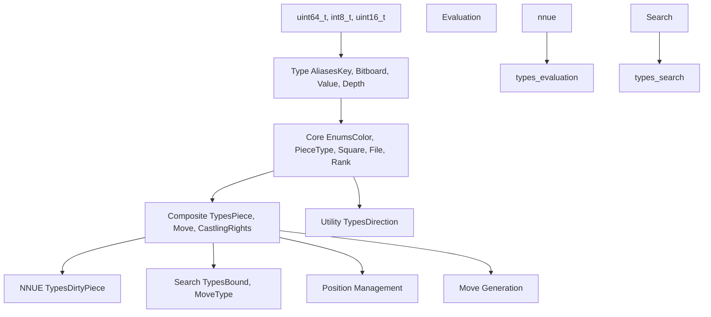

# 核心数据结构与类型

相关源文件

-   [src/position.h](https://github.com/official-stockfish/Stockfish/blob/c27c1747/src/position.h)
-   [src/types.h](https://github.com/official-stockfish/Stockfish/blob/c27c1747/src/types.h)

本文档涵盖了构成 Stockfish 引擎基础的基本数据类型、枚举和实用系统。其中包括在 `src/types.h` 中定义的用于表示局面、着法和评估值的国际象棋特定类型，以及在 `src/misc.h` 和 `src/misc.cpp` 中定义的、为整个引擎提供基础功能的基础设施类型和实用系统。

关于这些类型如何在棋盘表示中使用的信息，请参阅 [棋盘表示](/official-stockfish/Stockfish/3-board-representation)。关于着法如何生成和处理的详细信息，请参阅 [着法生成](/official-stockfish/Stockfish/3.3-move-generation)。关于评估特定值的处理，请参阅 [评估系统](/official-stockfish/Stockfish/5-evaluation-system)。关于其他实用函数和调试工具，请参阅 [实用程序和支持函数](/official-stockfish/Stockfish/7.2-utilities-and-support-functions)。

## 类型系统概述

Stockfish 使用基于 C++ 枚举和类型别名的强类型系统来精确表示国际象棋概念，并结合提供了基础功能的实用类型和基础设施系统。核心理念是对不同的概念使用不同的类型，以防止编程错误并使代码具有自文档化特性。


来源： [src/types.h114-335](https://github.com/official-stockfish/Stockfish/blob/c27c1747/src/types.h#L114-L335) [src/position.h42-64](https://github.com/official-stockfish/Stockfish/blob/c27c1747/src/position.h#L42-L64)

## 国际象棋实体表示

### 颜色与棋子

`Color` 枚举表示两名棋手，而 `PieceType` 和 `Piece` 分别表示不带颜色信息和带颜色信息的棋子。

| 类型 | 值 | 用途 |
| --- | --- | --- |
| `Color` | `WHITE`, `BLACK` | 棋手标识 |
| `PieceType` | `PAWN`, `KNIGHT`, `BISHOP`, `ROOK`, `QUEEN`, `KING` | 不带颜色的棋子类型 |
| `Piece` | `W_PAWN`, `B_KNIGHT` 等 | 带颜色的棋子（结合了 Color + PieceType） |

`Piece` 枚举巧妙地利用位操作在单个值中编码了颜色和棋子类型：

-   白棋：`W_PAWN = 1`, `W_KNIGHT = 2`, ..., `W_KING = 6`
-   黑棋：`B_PAWN = 9`, `B_KNIGHT = 10`, ..., `B_KING = 14`

实用函数用于提取组件：

-   `color_of(piece)` 返回 `Piece` 的 `Color`
-   `type_of(piece)` 返回 `Piece` 的 `PieceType`
-   `make_piece(color, piece_type)` 从组件创建一个 `Piece`

来源： [src/types.h119-123](https://github.com/official-stockfish/Stockfish/blob/c27c1747/src/types.h#L119-L123) [src/types.h192-203](https://github.com/official-stockfish/Stockfish/blob/c27c1747/src/types.h#L192-L203) [src/types.h335-342](https://github.com/official-stockfish/Stockfish/blob/c27c1747/src/types.h#L335-L342)

### 棋盘坐标


格位（Square）表示为 0-63 的整数，其中：

-   `SQ_A1 = 0`, `SQ_B1 = 1`, ..., `SQ_H1 = 7`
-   `SQ_A2 = 8`, `SQ_B2 = 9`, ..., `SQ_H8 = 63`

编码公式为：`square = rank * 8 + file`

来源： [src/types.h229-242](https://github.com/official-stockfish/Stockfish/blob/c27c1747/src/types.h#L229-L242) [src/types.h257-279](https://github.com/official-stockfish/Stockfish/blob/c27c1747/src/types.h#L257-L279) [src/types.h333-354](https://github.com/official-stockfish/Stockfish/blob/c27c1747/src/types.h#L333-L354)

## 着法表示

`Move` 类以紧凑的 16 位格式编码所有着法信息：

| 位 | 内容 | 范围 |
| --- | --- | --- |
| 0-5 | 目标格位 | 0-63 |
| 6-11 | 起始格位 | 0-63 |
| 12-13 | 升变棋子类型 | KNIGHT-2 到 QUEEN-2 |
| 14-15 | 特殊着法标志 | NORMAL, PROMOTION, EN\_PASSANT, CASTLING |


关键 `Move` 方法：

-   `from_sq()` 和 `to_sq()` 提取起始和目标格位
-   `type_of()` 返回 `MoveType`
-   `promotion_type()` 返回升变着法的升变棋子类型
-   `make<MoveType>(from, to, piece_type)` 创建具有特定类型的着法

来源： [src/types.h365-432](https://github.com/official-stockfish/Stockfish/blob/c27c1747/src/types.h#L365-L432)

## 价值系统与评估

### 价值类型与常量

`Value` 类型别名表示评估分数和博弈论价值：

| 常量 | 值 | 用途 |
| --- | --- | --- |
| `VALUE_DRAW` | 0 | 和棋评估值 |
| `VALUE_MATE` | 32000 | 杀棋基准值 |
| `VALUE_INFINITE` | 32001 | 无穷大边界 |
| `VALUE_NONE` | 32002 | 无效/未初始化值 |

杀棋分数使用“距离杀棋”编码：

-   `mate_in(ply)` 返回 `VALUE_MATE - ply`
-   `mated_in(ply)` 返回 `-VALUE_MATE + ply`

### 棋子价值

评估中使用的标准棋子价值：

| 棋子类型 | 价值 | 用途 |
| --- | --- | --- |
| `PawnValue` | 208 | 兵基准值 |
| `KnightValue` | 781 | 马基准值 |
| `BishopValue` | 825 | 象基准值 |
| `RookValue` | 1276 | 车基准值 |
| `QueenValue` | 2538 | 后基准值 |


`PieceValue` 数组提供了由 `Piece` 枚举索引的 O(1) 棋子价值查找。这些值用于子力统计，并作为更复杂的 NNUE 评估的起点。

来源： [src/types.h185-209](https://github.com/official-stockfish/Stockfish/blob/c27c1747/src/types.h#L185-L209)

## 游戏状态类型

### 王车易位权

`CastlingRights` 枚举使用位标志来有效地表示易位可行性：

| 标志 | 位值 | 含义 |
| --- | --- | --- |
| `WHITE_OO` | 1 | 白方短易位 |
| `WHITE_OOO` | 2 | 白方长易位 |
| `BLACK_OO` | 4 | 黑方短易位 |
| `BLACK_OOO` | 8 | 黑方长易位 |

组合标志支持高效操作：

-   `WHITE_CASTLING = WHITE_OO | WHITE_OOO`
-   `ANY_CASTLING = WHITE_CASTLING | BLACK_CASTLING`

### 搜索边界

`Bound` 枚举表示置换表条目类型：

-   `BOUND_EXACT`：精确的极小极大值
-   `BOUND_UPPER`：上界（Beta 截断）
-   `BOUND_LOWER`：下界（Alpha 截断）
-   `BOUND_NONE`：无边界信息

来源： [src/types.h125-139](https://github.com/official-stockfish/Stockfish/blob/c27c1747/src/types.h#L125-L139) [src/types.h141-146](https://github.com/official-stockfish/Stockfish/blob/c27c1747/src/types.h#L141-L146)

## NNUE 集成类型

### DirtyPiece 结构体

`DirtyPiece` 结构体跟踪棋子移动，以便进行高效的 NNUE 神经网络更新：

```
struct DirtyPiece {
    Piece  pc;        // 移动的棋子 (绝不是 NO_PIECE)
    Square from, to;  // 起始和目标格位

    // 用于复杂着法，如王车易位：
    Square remove_sq, add_sq;  // 额外的棋子移动
    Piece  remove_pc, add_pc;  // 受影响的额外棋子
};
```
该结构体支持增量式 NNUE 评估更新，而不是在每次着法后进行全局面重新评估。

来源： [src/types.h283-292](https://github.com/official-stockfish/Stockfish/blob/c27c1747/src/types.h#L283-L292)

### DirtyThreats 结构体

`DirtyThreats` 结构体跟踪棋子威胁的变化，用于 NNUE 威胁特征更新：

```
struct DirtyThreats {
    DirtyThreatList list;        // 威胁变化列表
    Color           us;          // 走棋方
    Square          prevKsq, ksq; // 上一次和当前的王位
    Bitboard        threatenedSqs, threateningSqs; // 威胁位棋盘
};
```
单个威胁变化由 `DirtyThreat` 表示，它将威胁信息打包成一个 32 位的值，编码了攻击棋子、受威胁棋子及其格位。一步着法最多可以改变 80 个威胁特征（考虑向量操作填充为 96 个）。

来源： [src/types.h294-335](https://github.com/official-stockfish/Stockfish/blob/c27c1747/src/types.h#L294-L335)

## 局面状态管理

### StateInfo 结构体

`StateInfo` 结构体存储了撤销一步着法时将 `Position` 恢复到先前状态所需的所有信息。这构成了贯穿游戏历史的链表，实现了高效的撤销操作。

#### StateInfo 链表架构


来源： [src/position.h42-64](https://github.com/official-stockfish/Stockfish/blob/c27c1747/src/position.h#L42-L64)

#### StateInfo 字段类别

`StateInfo` 结构体包含两类数据：

**复制字段**（执行着法时保留）：

-   `materialKey`, `pawnKey`, `minorPieceKey` - 局面特征的哈希键
-   `nonPawnKey[COLOR_NB]` - 每种颜色的非兵子力哈希键
-   `nonPawnMaterial[COLOR_NB]` - 不包括兵的子力价值
-   `castlingRights` - 当前易位可行性
-   `rule50` - 50 回合规则的半回合时钟
-   `pliesFromNull` - 自上一次空着以来的层数
-   `epSquare` - 吃过路兵的目标格位

**计算字段**（每次着法后重新计算）：

-   `key` - 全局面的 Zobrist 哈希键
-   `checkersBB` - 将军棋子的位棋盘
-   `blockersForKing[COLOR_NB]` - 阻挡对王攻击的棋子
-   `pinners[COLOR_NB]` - 牵制对手棋子使其无法离开王线的棋子
-   `checkSquares[PIECE_TYPE_NB]` - 每种棋子类型产生将军的格位
-   `capturedPiece` - 上一步着法吃掉的棋子（用于撤销）
-   `repetition` - 用于和棋检测的重复状态

来源： [src/position.h42-64](https://github.com/official-stockfish/Stockfish/blob/c27c1747/src/position.h#L42-L64)

#### 着法操作中的 StateInfo 用法


来源： [src/position.h137-147](https://github.com/official-stockfish/Stockfish/blob/c27c1747/src/position.h#L137-L147) [src/position.h405-410](https://github.com/official-stockfish/Stockfish/blob/c27c1747/src/position.h#L405-L410)

链表设计实现了 O(1) 的撤销操作——只需将指针移回。所有局面状态都保留在链中，允许搜索高效地探索并回溯游戏树。

## 类型系统架构


这种分层类型系统提供了：

1.  **基础**：标准整数类型和别名
2.  **国际象棋抽象**：特定领域的枚举和结构体
3.  **系统集成**：子系统的专用类型
4.  **高级用法**：复杂的国际象棋引擎组件

该设计在确保类型安全的同时，通过精细的位压缩和枚举设计保持了效率。

来源： [src/types.h113-447](https://github.com/official-stockfish/Stockfish/blob/c27c1747/src/types.h#L113-L447)
