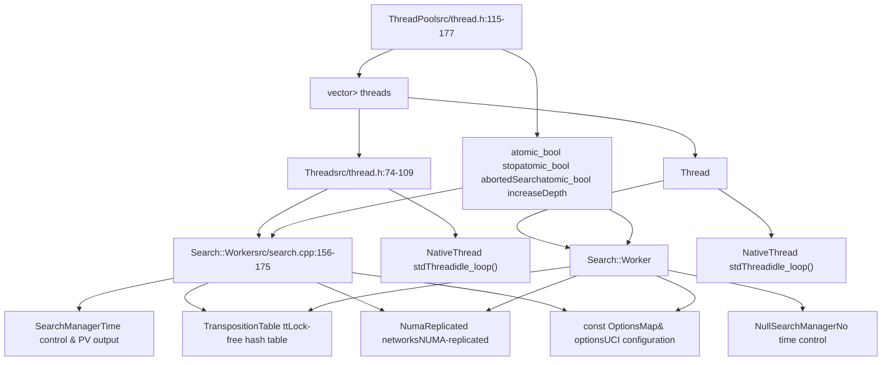
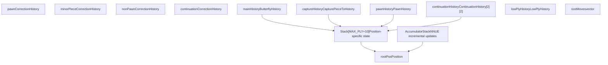
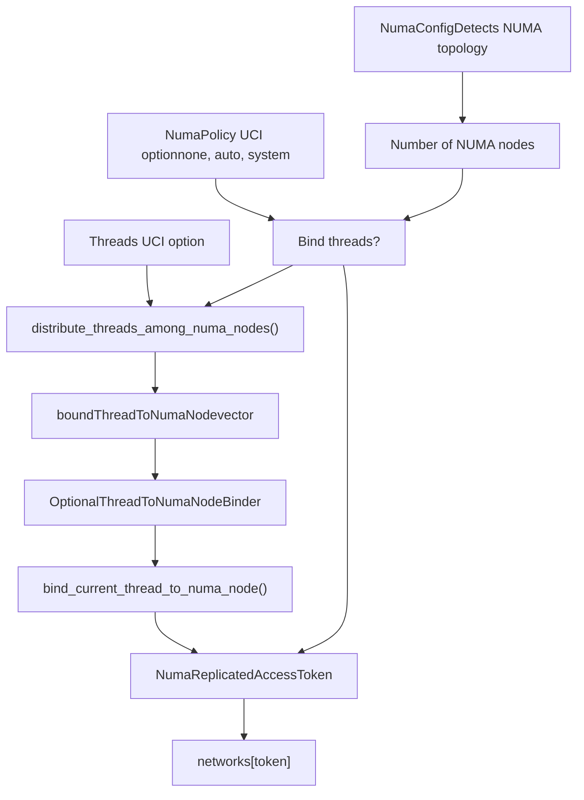
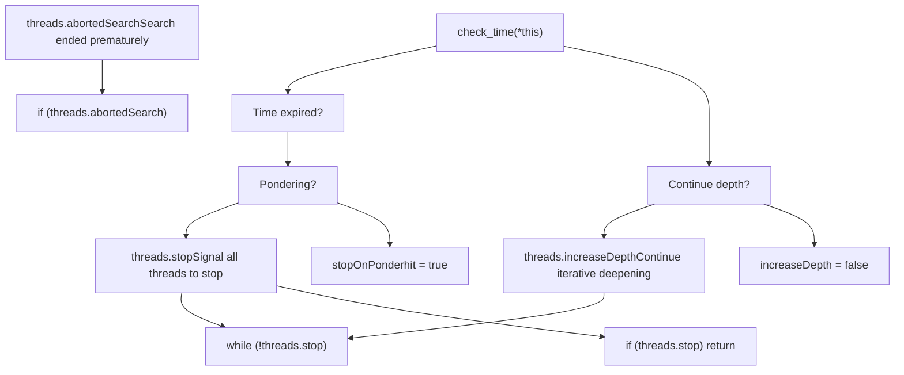
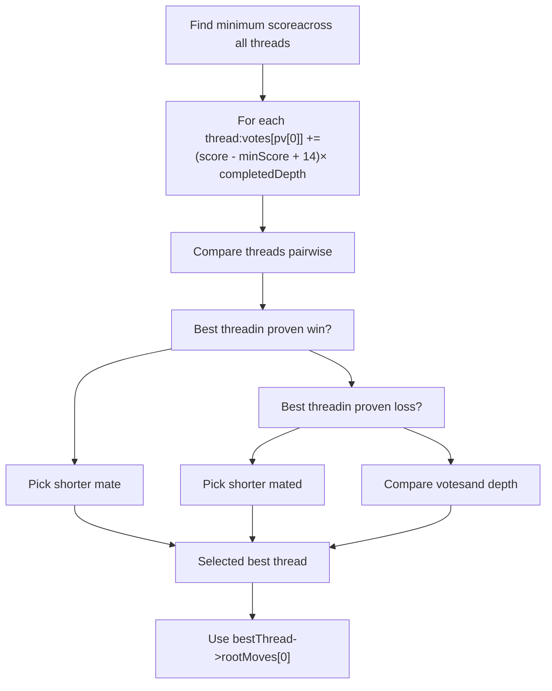

# 线程管理与并行搜索

相关源文件

-   [src/search.cpp](https://github.com/official-stockfish/Stockfish/blob/c27c1747/src/search.cpp)
-   [src/thread.h](https://github.com/official-stockfish/Stockfish/blob/c27c1747/src/thread.h)

## 目的与范围

本文档描述了 Stockfish 的多线程并行搜索架构。它涵盖了 `ThreadPool` 类、`Thread` 实例和 `Search::Worker` 对象，它们使 Stockfish 能够跨多个 CPU 核心协调并行搜索。本页面详细介绍了惰性 SMP（共享内存并行）搜索策略、NUMA 感知线程绑定和线程同步机制。

关于每个 worker 执行的搜索算法，请参阅 4.1 节。关于影响搜索效率的着法排序，请参阅 4.3 节。

## 线程架构概述

Stockfish 使用线程池架构，其中每个 `Thread` 拥有一个执行独立搜索的 `Search::Worker` 实例。该系统围绕最小共享状态设计，以最大化并行性并高效扩展到许多 CPU 核心。

### 核心组件

**图表：包含代码实体的线程架构**

**来源：** [src/thread.h74-109](https://github.com/official-stockfish/Stockfish/blob/c27c1747/src/thread.h#L74-L109) [src/thread.h115-177](https://github.com/official-stockfish/Stockfish/blob/c27c1747/src/thread.h#L115-L177) [src/search.cpp156-175](https://github.com/official-stockfish/Stockfish/blob/c27c1747/src/search.cpp#L156-L175)

### Thread 类结构

`Thread` 类封装了一个原生线程，并通过定义在 [src/thread.h74-109](https://github.com/official-stockfish/Stockfish/blob/c27c1747/src/thread.h#L74-L109) 中的基于作业的系统协调其执行：

| 成员 | 类型 | 用途 |
| --- | --- | --- |
| `worker` | `LargePagePtr<Search::Worker>` | 具有本地状态的搜索 worker |
| `stdThread` | `NativeThread` | 平台特定的原生线程句柄 |
| `mutex` | `std::mutex` | 保护线程状态转换 |
| `cv` | `std::condition_variable` | 信号通知工作可用性和完成 |
| `idx` | `size_t` | 线程索引（0 为主线程） |
| `idxInNuma` | `size_t` | 其 NUMA 节点内的线程索引 |
| `totalNuma` | `size_t` | 同一 NUMA 节点上的总线程数 |
| `searching` | `bool` | 指示线程正在执行工作 |
| `exit` | `bool` | 信号通知线程应终止 |
| `jobFunc` | `std::function<void()>` | 当前要执行的作业 |
| `numaAccessToken` | `NumaReplicatedAccessToken` | NUMA 节点绑定令牌 |

**来源：** [src/thread.h74-109](https://github.com/official-stockfish/Stockfish/blob/c27c1747/src/thread.h#L74-L109)

### ThreadPool 类结构

`ThreadPool` 类管理所有线程并协调搜索执行，定义在 [src/thread.h115-177](https://github.com/official-stockfish/Stockfish/blob/c27c1747/src/thread.h#L115-L177) 中：

| 成员 | 类型 | 用途 |
| --- | --- | --- |
| `threads` | `vector<unique_ptr<Thread>>` | 所有工作线程 |
| `setupStates` | `StateListPtr` | 共享的局面状态历史 |
| `boundThreadToNumaNode` | `vector<NumaIndex>` | 线程到 NUMA 节点的映射 |
| `stop` | `atomic_bool` | 所有线程的全局停止信号 |
| `abortedSearch` | `atomic_bool` | 搜索被提前停止 |
| `increaseDepth` | `atomic_bool` | 继续迭代加深的信号 |

**来源：** [src/thread.h115-177](https://github.com/official-stockfish/Stockfish/blob/c27c1747/src/thread.h#L115-L177)

## 线程生命周期

### 线程创建与初始化

线程通过 `ThreadPool::set()` 在 [src/thread.cpp140-202](https://github.com/official-stockfish/Stockfish/blob/c27c1747/src/thread.cpp#L140-L202) 中创建，它根据 `Threads` UCI 选项销毁现有线程并创建新线程：

**图表：线程初始化序列**

> **[Mermaid sequence]**
> *(图表结构无法解析)*

**来源：** [src/thread.cpp140-202](https://github.com/official-stockfish/Stockfish/blob/c27c1747/src/thread.cpp#L140-L202) [src/thread.cpp42-62](https://github.com/official-stockfish/Stockfish/blob/c27c1747/src/thread.cpp#L42-L62)

关键初始化步骤：

1.  **线程构造** 在 [src/thread.cpp42-62](https://github.com/official-stockfish/Stockfish/blob/c27c1747/src/thread.cpp#L42-L62)：

    -   原生线程以 `idle_loop()` 启动
    -   线程通过条件变量等待第一个作业
    -   自定义作业分配带有 NUMA 绑定的 `Search::Worker`
2.  **Worker 初始化** 在 [src/search.cpp156-175](https://github.com/official-stockfish/Stockfish/blob/c27c1747/src/search.cpp#L156-L175)：

    -   将 `SharedState` 解包到成员变量
    -   存储 NUMA 访问令牌以进行网络复制
    -   调用 `clear()` 初始化历史表
3.  **历史表初始化** 在 [src/search.cpp586-610](https://github.com/official-stockfish/Stockfish/blob/c27c1747/src/search.cpp#L586-L610)：

    -   `mainHistory.fill(mainHistoryDefault)`，其中 `mainHistoryDefault = 68` - 主历史启发式
    -   `captureHistory.fill(-689)` - 吃子着法分数
    -   按范围清除共享历史：`pawnHistory.fill(-1238)`
    -   `continuationHistory` - 着法对延续模式
    -   `continuationCorrectionHistory` - 评估修正模式

### idle\_loop() 机制

每个线程大部分时间都在定义于 [src/thread.cpp111-130](https://github.com/official-stockfish/Stockfish/blob/c27c1747/src/thread.cpp#L111-L130) 的 `idle_loop()` 中等待工作：

**图表：线程空闲循环状态机**

> **[Mermaid stateDiagram]**
> *(图表结构无法解析)*

**来源：** [src/thread.cpp111-130](https://github.com/official-stockfish/Stockfish/blob/c27c1747/src/thread.cpp#L111-L130)

[src/thread.cpp111-130](https://github.com/official-stockfish/Stockfish/blob/c27c1747/src/thread.cpp#L111-L130) 中的实现：

1.  线程设置 `searching = false` 并通知等待者
2.  线程在 `cv.wait()` 上阻塞，直到 `searching` 变为真
3.  当收到信号时，检查 `exit` 标志以终止
4.  提取并执行 `jobFunc`
5.  返回等待状态

### 搜索执行流程

当搜索开始时，主线程通过 `ThreadPool::start_thinking()` 在 [src/thread.cpp241-300](https://github.com/official-stockfish/Stockfish/blob/c27c1747/src/thread.cpp#L241-L300) 中协调辅助线程的启动：

**图表：搜索执行协调**

> **[Mermaid sequence]**
> *(图表结构无法解析)*

**来源：** [src/thread.cpp241-300](https://github.com/official-stockfish/Stockfish/blob/c27c1747/src/thread.cpp#L241-L300) [src/search.cpp183-254](https://github.com/official-stockfish/Stockfish/blob/c27c1747/src/search.cpp#L183-L254)

## 惰性 SMP 并行搜索

Stockfish 实现惰性 SMP（共享内存并行搜索），其中线程以最小的协调独立进行搜索。这与明确分割搜索树的传统并行搜索算法不同。每个 worker 探索相同的搜索树，但带有轻微的变异，自然导致不同的路径。

### 关键特征

**图表：共享资源与线程本地资源**

```mermaid
flowchart TD
    TT["TranspositionTableLock-free concurrent accesstt.probe(), ttWriter.write()"]
    Flags["Atomic Flagsthreads.stopthreads.increaseDepththreads.abortedSearch"]
    Networks["NNUE NetworksNUMA-replicatednetworks[numaAccessToken]"]
    Options["UCI OptionsHash, Threads, etc."]
    W0["Search::Worker"]
    W0_nodes["atomic<uint64_t> nodes"]
    W0_hist["History TablesmainHistorycaptureHistorycontinuationHistory"]
    W0_stack["Stack[MAX_PLY+10]"]
    W0_rootMoves["RootMoves"]
    WN["Search::Worker"]
    WN_nodes["atomic<uint64_t> nodes"]
    WN_hist["History TablesmainHistorycaptureHistorycontinuationHistory"]
    WN_stack["Stack[MAX_PLY+10]"]
    WN_rootMoves["RootMoves"]

    W0 --> TT
    W0 --> Flags
    W0 --> Networks
    W0 --> Options
    W0 --> W0_hist
    W0 --> W0_stack
    W0 --> W0_rootMoves
    WN --> TT
    WN --> Flags
    WN --> Networks
    WN --> Options
    WN --> WN_hist
    WN --> WN_stack
    WN --> WN_rootMoves
```

**来源：** [src/search.cpp156-175](https://github.com/official-stockfish/Stockfish/blob/c27c1747/src/search.cpp#L156-L175) [src/thread.cpp241-300](https://github.com/official-stockfish/Stockfish/blob/c27c1747/src/thread.cpp#L241-L300)

### 独立搜索执行

每个 worker 执行其自己的 `iterative_deepening()` 循环 [src/search.cpp259-544](https://github.com/official-stockfish/Stockfish/blob/c27c1747/src/search.cpp#L259-L544)：

| 方面 | 实现 | 好处 |
| --- | --- | --- |
| **渴望窗口** | 基于 `threadIdx` 的不同 delta [src/search.cpp355](https://github.com/official-stockfish/Stockfish/blob/c27c1747/src/search.cpp#L355-L355)：`delta = 5 + threadIdx % 8 + ...` | 探索不同的着法顺序 |
| **乐观值** | 每个线程的计算 [src/search.cpp361-362](https://github.com/official-stockfish/Stockfish/blob/c27c1747/src/search.cpp#L361-L362)：`optimism[us] = 142 * avg / (std::abs(avg) + 91)` | 不同的评估调整 |
| **根着法顺序** | 每次迭代后的稳定排序保留不同的顺序 | 自然的搜索多样性 |
| **历史表** | 每个线程完全独立 | 零锁争用 |
| **搜索栈** | 本地 `Stack[MAX_PLY + 10]` 数组 | 设计上线程安全 |

### 置换表协调

置换表是线程之间的主要协调机制，使它们能够共享发现的信息：

**图表：置换表交互**

> **[Mermaid sequence]**
> *(图表结构无法解析)*

**来源：** [src/search.cpp701-742](https://github.com/official-stockfish/Stockfish/blob/c27c1747/src/search.cpp#L701-L742)

TT 访问模式在 [src/search.cpp704](https://github.com/official-stockfish/Stockfish/blob/c27c1747/src/search.cpp#L704-L704)：

-   `tt.probe(posKey)` 返回 `[ttHit, ttData, ttWriter]` 元组
-   无锁并发读取访问
-   `ttWriter.write()` 用于原子单条目更新
-   `tt.new_search()` 中调用的基于生成（generation-based）的老化 [src/search.cpp196](https://github.com/official-stockfish/Stockfish/blob/c27c1747/src/search.cpp#L196-L196)
-   每个线程既读又写，创建隐式协调

### 线程本地资源

每个 `Search::Worker` 维护私有数据结构以避免争用并启用无锁并行执行：

**图表：Worker 线程本地状态**

**来源：** [src/search.cpp156-175](https://github.com/official-stockfish/Stockfish/blob/c27c1747/src/search.cpp#L156-L175) [src/search.h74-226](https://github.com/official-stockfish/Stockfish/blob/c27c1747/src/search.h#L74-L226)

## NUMA 优化

Stockfish 通过将线程绑定到特定的 NUMA 节点并复制网络权重来支持 NUMA（非均匀内存访问）系统。这种优化对于具有多个 CPU 插槽的系统至关重要，因为在这些系统中，内存访问延迟因位置而异。

### 线程到 NUMA 节点绑定

**图表：NUMA 线程分配与绑定**

**来源：** [src/thread.cpp140-202](https://github.com/official-stockfish/Stockfish/blob/c27c1747/src/thread.cpp#L140-L202) [src/thread.h47-67](https://github.com/official-stockfish/Stockfish/blob/c27c1747/src/thread.h#L47-L67)

### NUMA 策略决策

[src/thread.cpp163-173](https://github.com/official-stockfish/Stockfish/blob/c27c1747/src/thread.cpp#L163-L173) 中的绑定决策遵循以下逻辑：

| NumaPolicy | 行为 |
| --- | --- |
| `"none"` | 从不绑定线程 |
| `"auto"` | 仅当 `numaConfig.suggests_binding_threads(requested)` 返回 true 时绑定 |
| `"system"` | 总是绑定线程 |

`"auto"` 策略仅在以下情况下绑定线程：

-   检测到多个 NUMA 节点
-   线程数将从分配中受益
-   避免在单实例运行少量线程时绑定

### NUMA 复制的网络访问

**图表：NUMA 复制的网络加载**

> **[Mermaid sequence]**
> *(图表结构无法解析)*

**来源：** [src/search.cpp177-181](https://github.com/official-stockfish/Stockfish/blob/c27c1747/src/search.cpp#L177-L181) [src/thread.cpp52-59](https://github.com/official-stockfish/Stockfish/blob/c27c1747/src/thread.cpp#L52-L59)

[src/search.cpp177-181](https://github.com/official-stockfish/Stockfish/blob/c27c1747/src/search.cpp#L177-L181) 中的网络复制确保：

-   每个 NUMA 节点都有自己的网络权重副本
-   内存访问对节点是本地的
-   避免评估期间的跨节点内存流量
-   网络在第一次访问时通过 `ensure_network_replicated()` 懒惰初始化

## 线程同步

### 用于协调的原子标志

`ThreadPool` 使用定义在 [src/thread.h156](https://github.com/official-stockfish/Stockfish/blob/c27c1747/src/thread.h#L156-L156) 中的原子布尔标志进行无锁协调：

**图表：通过原子标志的线程协调**

**来源：** [src/search.cpp322](https://github.com/official-stockfish/Stockfish/blob/c27c1747/src/search.cpp#L322-L322) [src/search.cpp676](https://github.com/official-stockfish/Stockfish/blob/c27c1747/src/search.cpp#L676-L676) [src/search.cpp1302](https://github.com/official-stockfish/Stockfish/blob/c27c1747/src/search.cpp#L1302-L1302) [src/thread.h156](https://github.com/official-stockfish/Stockfish/blob/c27c1747/src/thread.h#L156-L156)

### 停止信号传播

通过系统的停止信号流：

1.  **主线程设置停止** 在 [src/search.cpp471](https://github.com/official-stockfish/Stockfish/blob/c27c1747/src/search.cpp#L471-L471) [src/search.cpp524](https://github.com/official-stockfish/Stockfish/blob/c27c1747/src/search.cpp#L524-L524)：

    -   超过时间限制
    -   发现匹配杀棋限制的杀棋
    -   触发技能等级 time-to-pick
2.  **所有线程检查停止** 在 [src/search.cpp322](https://github.com/official-stockfish/Stockfish/blob/c27c1747/src/search.cpp#L322-L322) [src/search.cpp676](https://github.com/official-stockfish/Stockfish/blob/c27c1747/src/search.cpp#L676-L676) [src/search.cpp1302](https://github.com/official-stockfish/Stockfish/blob/c27c1747/src/search.cpp#L1302-L1302)：

    -   在迭代加深循环中：`while (++rootDepth < MAX_PLY && !threads.stop ...)`
    -   在每个搜索节点开始时：`if (threads.stop.load(std::memory_order_relaxed))`
    -   在 TT 写入和着法更新之前
3.  **主线程等待辅助线程** 在 [src/search.cpp223](https://github.com/official-stockfish/Stockfish/blob/c27c1747/src/search.cpp#L223-L223)：

    -   `threads.wait_for_search_finished()` 阻塞直到所有线程空闲
    -   每个线程使用条件变量

### 条件变量同步

每个线程使用定义在 [src/thread.h104](https://github.com/official-stockfish/Stockfish/blob/c27c1747/src/thread.h#L104-L104) 中的条件变量进行状态转换：

**图表：通过条件变量的线程状态转换**

> **[Mermaid stateDiagram]**
> *(图表结构无法解析)*

**来源：** [src/thread.cpp89-104](https://github.com/official-stockfish/Stockfish/blob/c27c1747/src/thread.cpp#L89-L104) [src/thread.cpp111-130](https://github.com/official-stockfish/Stockfish/blob/c27c1747/src/thread.cpp#L111-L130)

关键同步点：

| 函数 | 持有锁 | CV 动作 | 用途 |
| --- | --- | --- | --- |
| `wait_for_search_finished()` | 是 | `cv.wait()` 直到 `!searching` | 等待线程变为空闲 |
| `run_custom_job()` | 是 | 设置作业后 `cv.notify_one()` | 唤醒线程执行作业 |
| `idle_loop()` | 是 | 完成时 `cv.notify_one()` | 信号通知作业完成 |
| `idle_loop()` | 是 | `cv.wait()` 直到 `searching` | 等待下一个作业 |

## 最佳线程选择

搜索完成后，主线程在 [src/thread.cpp302-366](https://github.com/official-stockfish/Stockfish/blob/c27c1747/src/thread.cpp#L302-L366) 中使用投票机制从所有 worker 中选择最佳结果。这确保了当线程发现不同的最佳着法时选择最强的着法。

### 投票算法

**图表：最佳线程选择过程**

**来源：** [src/thread.cpp302-366](https://github.com/official-stockfish/Stockfish/blob/c27c1747/src/thread.cpp#L302-L366)

### 选择逻辑

[src/thread.cpp302-366](https://github.com/official-stockfish/Stockfish/blob/c27c1747/src/thread.cpp#L302-L366) 中的算法处理三种情况：

1.  **证明胜** 在 [src/thread.cpp346-351](https://github.com/official-stockfish/Stockfish/blob/c27c1747/src/thread.cpp#L346-L351)：
    -   如果当前最佳处于证明胜，优先选择更短的杀棋
    -   比较分数：更高表示更短的杀棋
2.  **证明负** 在 [src/thread.cpp352-357](https://github.com/official-stockfish/Stockfish/blob/c27c1747/src/thread.cpp#L352-L357)：
    -   如果当前最佳处于证明负，优先选择更长的抵抗
    -   比较分数：更高（接近 0）表示更长的抵抗
3.  **正常局面** 在 [src/thread.cpp358-362](https://github.com/official-stockfish/Stockfish/blob/c27c1747/src/thread.cpp#L358-L362)：
    -   比较每个着法的投票计数
    -   投票值：`(score - minScore + 14) × completedDepth`
    -   确保 PV 至少有 3 个着法（未截断）
    -   更高的票数或更好的投票值获胜

### 处理中止的搜索

当线程过早中止搜索时（在 [src/search.cpp445-453](https://github.com/official-stockfish/Stockfish/blob/c27c1747/src/search.cpp#L445-L453) 中检查）：

**图表：处理中止的搜索结果**

> **[Mermaid sequence]**
> *(图表结构无法解析)*

**来源：** [src/search.cpp445-459](https://github.com/official-stockfish/Stockfish/blob/c27c1747/src/search.cpp#L445-L459)

这确保了：

-   中途停止的线程不会报告错误的杀棋分数
-   使用前一次迭代的已证明结果
-   即使提前停止，主线程也能获得可靠的最佳着法

### 线程投票示例

假设搜索后有 4 个线程：

| 线程 | 着法 | 分数 | 深度 | 投票计算 | 票数 |
| --- | --- | --- | --- | --- | --- |
| 0 | e2e4 | 25 | 20 | (25-(-10)+14) × 20 = 780 | 780 |
| 1 | d2d4 | \-10 | 18 | (-10-(-10)+14) × 18 = 252 | 252 |
| 2 | e2e4 | 15 | 22 | (15-(-10)+14) × 22 = 638 | 638 |
| 3 | e2e4 | 20 | 19 | (20-(-10)+14) × 19 = 646 | 646 |

总票数：`e2e4 = 780 + 638 + 646 = 2064`，`d2d4 = 252`

线程 0 作为最佳线程获胜（e2e4 的个人投票值最高）。

**来源：** [src/thread.cpp315-320](https://github.com/official-stockfish/Stockfish/blob/c27c1747/src/thread.cpp#L315-L320)
