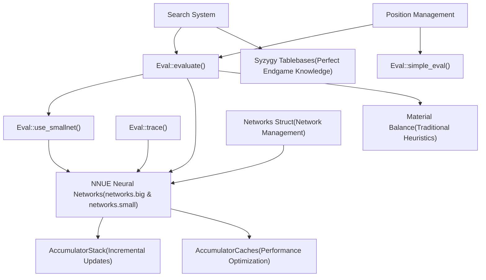
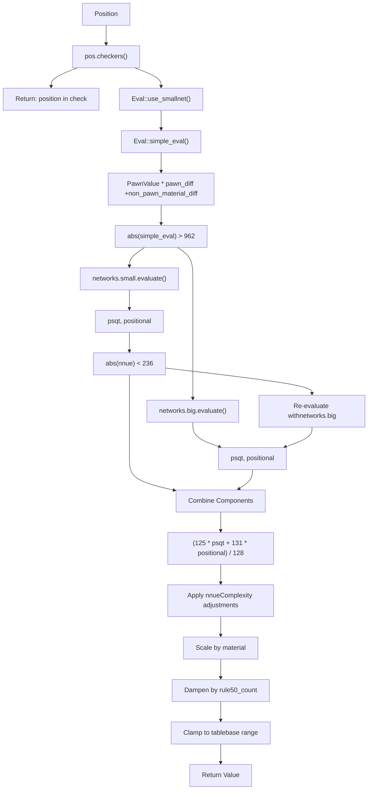
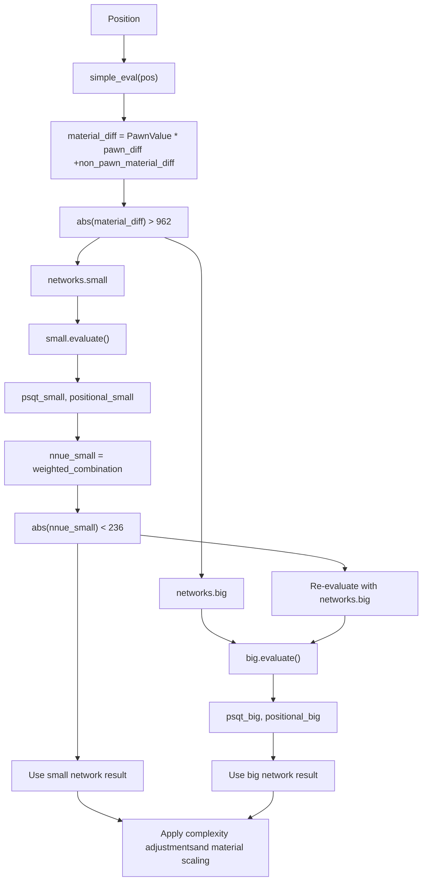
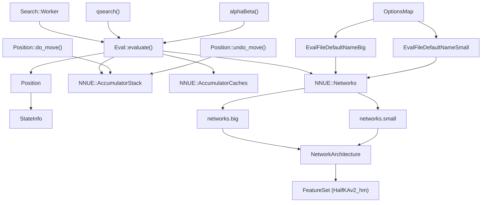

# 评估系统

相关源文件

-   [src/evaluate.cpp](https://github.com/official-stockfish/Stockfish/blob/c27c1747/src/evaluate.cpp)

Stockfish 中的评估系统为国际象棋局面分配数值，以从走棋方的角度评估其相对强度。该系统作为核心知识组件，指导搜索引擎的决策过程。评估系统集成了多种国际象棋知识来源，包括神经网络、残局码表和传统启发式方法。

## 系统架构

评估系统由三个主要子系统组成，它们协同工作以提供全面的局面评估：

### 评估系统组件


**主要子系统：**

| 子系统 | 用途 | 文档 |
| --- | --- | --- |
| **NNUE 神经网络** | 使用训练好的神经网络进行主要的局面评估 | 见页面 [5.1](https://github.com/official-stockfish/Stockfish/blob/c27c1747/5.1) |
| **NNUE 架构** | 网络结构、层级和特征处理 | 见页面 [5.2](https://github.com/official-stockfish/Stockfish/blob/c27c1747/5.2) |
| **Syzygy 码表** | ≤7 子残局的完美行棋 | 见页面 [5.3](https://github.com/official-stockfish/Stockfish/blob/c27c1747/5.3) |

来源： [src/evaluate.h30-54](https://github.com/official-stockfish/Stockfish/blob/c27c1747/src/evaluate.h#L30-L54) [src/evaluate.cpp38-124](https://github.com/official-stockfish/Stockfish/blob/c27c1747/src/evaluate.cpp#L38-L124)

## 主评估接口

`Eval` 命名空间通过几个关键函数提供了评估系统的主要接口：

| 函数 | 用途 | 签名 |
| --- | --- | --- |
| `Eval::evaluate()` | 主要评估函数 | `Value evaluate(const NNUE::Networks&, const Position&, AccumulatorStack&, AccumulatorCaches&, int optimism)` |
| `Eval::simple_eval()` | 快速的基于材质的评估 | `int simple_eval(const Position&)` |
| `Eval::use_smallnet()` | 网络选择启发式 | `bool use_smallnet(const Position&)` |
| `Eval::trace()` | 调试评估明细 | `std::string trace(Position&, const NNUE::Networks&)` |

### 评估流程


来源： [src/evaluate.cpp53-90](https://github.com/official-stockfish/Stockfish/blob/c27c1747/src/evaluate.cpp#L53-L90) [src/evaluate.h47-53](https://github.com/official-stockfish/Stockfish/blob/c27c1747/src/evaluate.h#L47-L53)

## 网络选择策略

Stockfish 使用双网络方法来优化评估准确性和计算成本之间的权衡：

### 网络类型与用法

| 网络 | 大小 | 使用标准 | 用途 |
| --- | --- | --- | --- |
| `networks.small` | 128 变换特征 | `abs(simple_eval) > 962` | 具有明显材质不平衡的局面 |
| `networks.big` | 3072 变换特征 | `abs(simple_eval) ≤ 962` | 复杂的局面评估 |

### 动态网络选择


回退机制确保当小网络产生不确定的评估（接近零）时，系统会自动切换到更准确的大网络进行最终评估。

来源： [src/evaluate.cpp43-49](https://github.com/official-stockfish/Stockfish/blob/c27c1747/src/evaluate.cpp#L43-L49) [src/evaluate.cpp61-73](https://github.com/official-stockfish/Stockfish/blob/c27c1747/src/evaluate.cpp#L61-L73)

## 与其他系统的集成

评估系统与其他核心 Stockfish 组件紧密集成：

### 系统交互


### 关键集成点

| 集成 | 描述 | 实现 |
| --- | --- | --- |
| **搜索调用** | 搜索 worker 在叶子节点调用评估 | `Search::Worker` → `Eval::evaluate()` |
| **局面状态** | 评估需要当前局面和游戏状态 | `Position` → 特征提取 |
| **增量更新** | 累加器在着法执行/撤销期间更新 | `do_move()`/`undo_move()` → `AccumulatorStack` |
| **网络加载** | UCI 选项指定要加载的网络文件 | UCI → `Networks` 结构初始化 |
| **码表集成** | 搜索在调用评估之前检查码表 | 搜索 → 码表（如果可用） |

来源： [src/evaluate.h39-54](https://github.com/official-stockfish/Stockfish/blob/c27c1747/src/evaluate.h#L39-L54) [src/evaluate.cpp53-90](https://github.com/official-stockfish/Stockfish/blob/c27c1747/src/evaluate.cpp#L53-L90)

## 默认网络配置

评估系统使用嵌入在构建过程中的预定义默认网络文件：

### 网络文件规范

```
#define EvalFileDefaultNameBig "nn-1c0000000000.nnue"
#define EvalFileDefaultNameSmall "nn-37f18f62d772.nnue"
```
这些文件名遵循特定的格式 `nn-[SHA256 前 12 位].nnue`，这对于以下方面是必需的：

-   构建过程集成 (`profile-build`)
-   自动化测试 (`fishtest`)
-   网络验证和版本控制

### 网络架构常量

NNUE 架构定义了几个决定网络结构的关键常量：

| 常量 | 值 | 用途 |
| --- | --- | --- |
| `TransformedFeatureDimensionsBig` | 3072 | 大网络的输入特征大小 |
| `TransformedFeatureDimensionsSmall` | 128 | 小网络的输入特征大小 |
| `PSQTBuckets` | 8 | 棋子-格位表（PSQT）桶的数量 |
| `LayerStacks` | 8 | 并行处理的层栈数量 |

来源： [src/evaluate.h36-37](https://github.com/official-stockfish/Stockfish/blob/c27c1747/src/evaluate.h#L36-L37) [src/nnue/nnue\_architecture.h40-50](https://github.com/official-stockfish/Stockfish/blob/c27c1747/src/nnue/nnue_architecture.h#L40-L50)

## 关键评估公式

最终评估计算通过一系列公式结合了几个因素：

### NNUE 组件加权

```
Value nnue = (125 * psqt + 131 * positional) / 128;
```
### 复杂性调整

```
int nnueComplexity = std::abs(psqt - positional);
optimism += optimism * nnueComplexity / 468;
nnue -= nnue * nnueComplexity / 18000;
```
### 材质计算

```
int material = 535 * pos.count<PAWN>() + pos.non_pawn_material();
```
### 最终评估

```
int v = (nnue * (77777 + material) + optimism * (7777 + material)) / 77777;
```
### Rule50 阻尼

```
v -= v * pos.rule50_count() / 212;
```
### 范围钳位

```
v = std::clamp(v, VALUE_TB_LOSS_IN_MAX_PLY + 1, VALUE_TB_WIN_IN_MAX_PLY - 1);
```
其中：

-   `nnue` 是组合的神经网络输出
-   `material` 将兵的权重设为 535，并包括所有非兵材质
-   `optimism` 是一个搜索参数，可以使评估偏向特定一方，这有助于搜索稳定性和渴望窗口管理
-   `nnueComplexity` 衡量 PSQT 和位置组件之间的分歧

来源： [src/evaluate.cpp65](https://github.com/official-stockfish/Stockfish/blob/c27c1747/src/evaluate.cpp#L65-L65) [src/evaluate.cpp76-87](https://github.com/official-stockfish/Stockfish/blob/c27c1747/src/evaluate.cpp#L76-L87)

## 实现细节

### 网络文件名

默认网络文件定义为宏：

```
#define EvalFileDefaultNameBig "nn-1c0000000000.nnue"
#define EvalFileDefaultNameSmall "nn-37f18f62d772.nnue"
```
这些名称遵循 `nn-[SHA256 前 12 位].nnue` 格式，以实现构建过程兼容性。

### 简单评估函数

`simple_eval()` 函数提供仅基于材质的快速评估：

```
int simple_eval(const Position& pos) {
    Color c = pos.side_to_move();
    return PawnValue * (pos.count<PAWN>(c) - pos.count<PAWN>(~c))
         + (pos.non_pawn_material(c) - pos.non_pawn_material(~c));
}
```
### 网络选择阈值

`use_smallnet()` 函数使用硬编码的阈值：

```
bool use_smallnet(const Position& pos) {
    return std::abs(simple_eval(pos)) > 962;
}
```
### 调试跟踪

`Eval::trace()` 函数提供详细的评估明细：

-   通过 `NNUE::trace()` 输出 NNUE 组件细节
-   显示原始 NNUE 评估和最终缩放后的评估
-   使用 `UCIEngine::to_cp()` 将内部值转换为厘兵（centipawns）
-   返回适合调试输出的格式化字符串

来源： [src/evaluate.h36-37](https://github.com/official-stockfish/Stockfish/blob/c27c1747/src/evaluate.h#L36-L37) [src/evaluate.cpp43-49](https://github.com/official-stockfish/Stockfish/blob/c27c1747/src/evaluate.cpp#L43-L49) [src/evaluate.cpp96-122](https://github.com/official-stockfish/Stockfish/blob/c27c1747/src/evaluate.cpp#L96-L122)

## 与搜索的集成

评估函数主要在以下情况从搜索系统调用：

1.  达到静止局面（无吃子或将军）
2.  搜索达到深度限制
3.  正在考虑空着（null move）

搜索可以将“乐观（optimism）”参数传递给评估函数，以引入受控偏差，这有助于搜索稳定性和渴望窗口管理。

来源： [src/evaluate.h49-53](https://github.com/official-stockfish/Stockfish/blob/c27c1747/src/evaluate.h#L49-L53)

## 性能考量

使用两个不同大小的网络是一种性能优化。较小的网络需要较少的计算，用于局面评估可能由材质因素主导的情况。较大的网络用于需要更详细评估的局面。

另一个关键的性能特性是累加器系统，它允许在着法进行时增量更新神经网络输入特征，而不是为每个局面从头开始重新计算所有特征。

来源： [src/evaluate.cpp61-73](https://github.com/official-stockfish/Stockfish/blob/c27c1747/src/evaluate.cpp#L61-L73) [src/evaluate.h49-53](https://github.com/official-stockfish/Stockfish/blob/c27c1747/src/evaluate.h#L49-L53)
