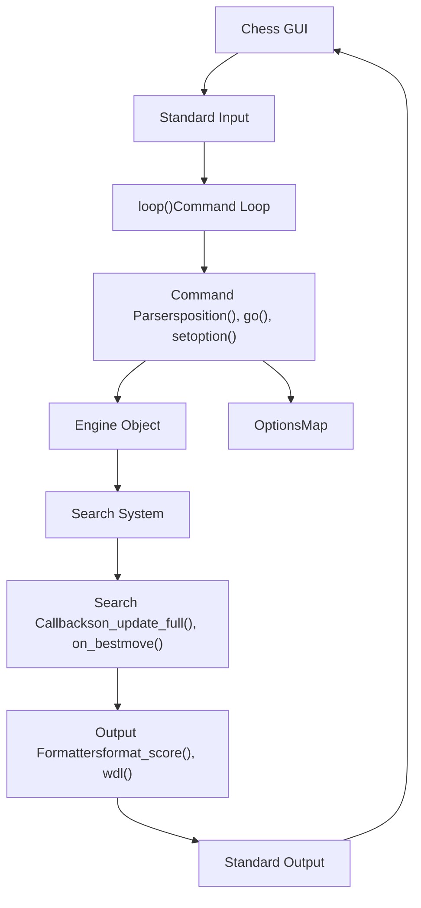
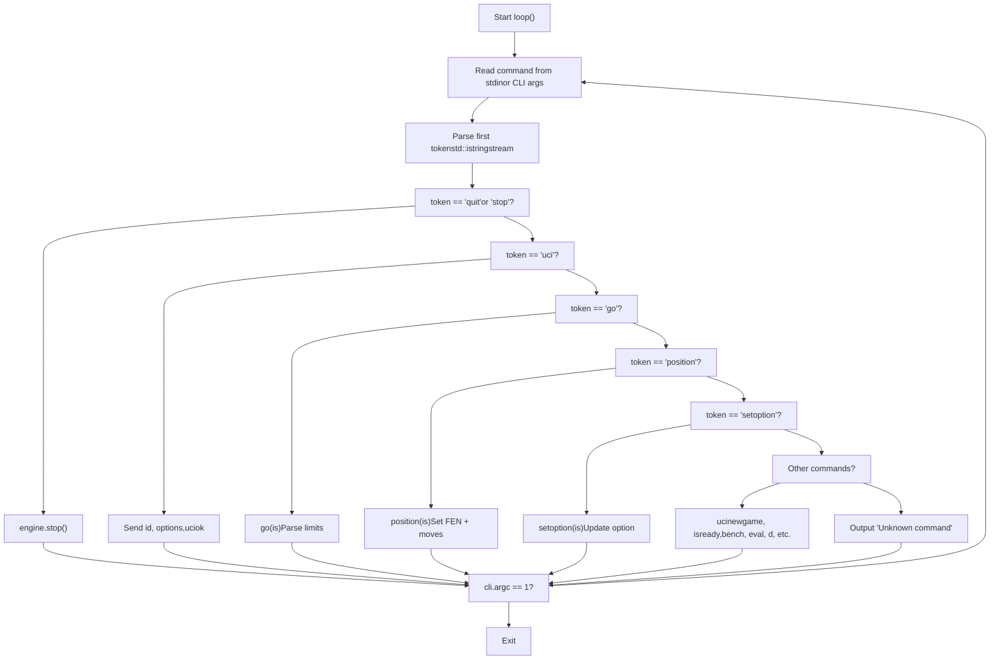
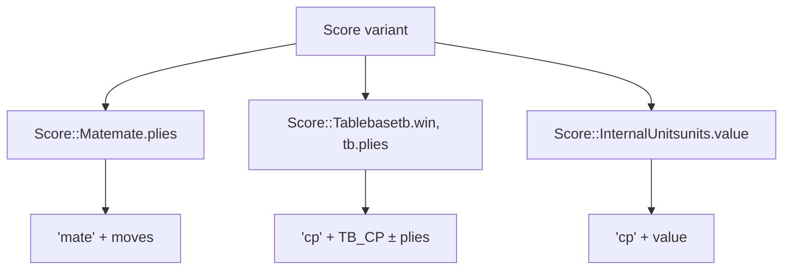
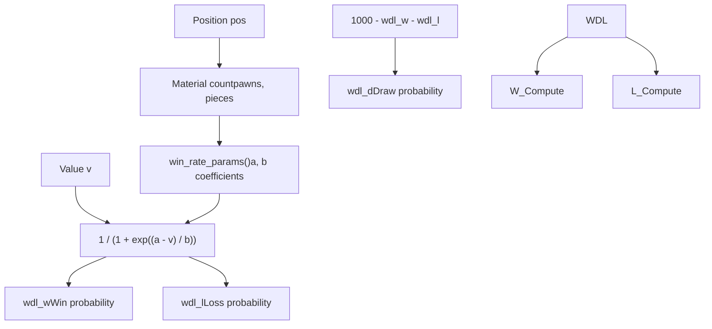
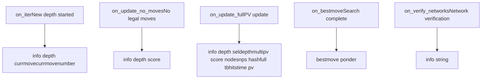

# UCI 协议处理程序

相关源文件

-   [src/benchmark.cpp](https://github.com/official-stockfish/Stockfish/blob/c27c1747/src/benchmark.cpp)
-   [src/main.cpp](https://github.com/official-stockfish/Stockfish/blob/c27c1747/src/main.cpp)
-   [src/uci.cpp](https://github.com/official-stockfish/Stockfish/blob/c27c1747/src/uci.cpp)

## 目的与范围

本文档涵盖了 Stockfish 中的 UCI（通用国际象棋接口）协议实现，特别是引擎如何接收来自国际象棋 GUI 的命令，解析它们，执行它们以及格式化响应。UCI 协议处理程序充当外部应用程序（国际象棋 GUI、API、命令行用户）与引擎核心之间的主要接口。

关于 UCI 选项配置和管理的信息，请参阅 [UCI 选项与配置](/official-stockfish/Stockfish/6-external-interface/6.2-uci-options-and-configuration)。关于 UCI 处理程序控制的搜索引擎的详细信息，请参阅 [搜索系统](/official-stockfish/Stockfish/4-search-system)。

## 架构概述

UCI 协议处理程序在 `UCIEngine` 类中实现，该类封装了核心 `Engine` 对象并提供符合 UCI 的命令解析和输出格式化。处理程序管理一个命令循环，该循环持续从标准输入读取，解析 UCI 命令，并将格式化的响应写入标准输出。


**图表：UCI 协议处理程序架构**

来源： [src/uci.cpp67-86](https://github.com/official-stockfish/Stockfish/blob/c27c1747/src/uci.cpp#L67-L86) [src/uci.cpp88-179](https://github.com/official-stockfish/Stockfish/blob/c27c1747/src/uci.cpp#L88-L179)

## 主命令循环

UCI 命令循环在 `UCIEngine::loop()` 方法中实现，它持续从标准输入读取命令并将它们分派给适当的处理程序。该循环支持交互模式（等待 stdin）和命令行参数模式（一次性执行）。


**图表：UCI 命令循环流程**

循环持续进行，直到收到 "quit" 命令或耗尽命令行参数。每次迭代解析一个命令并调用相应的处理程序。

来源： [src/uci.cpp88-179](https://github.com/official-stockfish/Stockfish/blob/c27c1747/src/uci.cpp#L88-L179)

## 命令解析

### Position 命令

`position()` 方法解析 FEN 字符串和着法序列以设置棋盘局面。它支持两种模式：

| 模式 | 语法 | 描述 |
| --- | --- | --- |
| startpos | `position startpos moves e2e4 e7e5` | 从初始局面开始 |
| fen | `position fen <FEN> moves <moves>` | 从指定 FEN 开始 |

解析器提取 FEN 字符串（或使用 `StartFEN` 常量用于 startpos），然后收集所有后续着法字符串并将它们传递给 `engine.set_position()`。

来源： [src/uci.cpp474-498](https://github.com/official-stockfish/Stockfish/blob/c27c1747/src/uci.cpp#L474-L498) [src/uci.cpp46](https://github.com/official-stockfish/Stockfish/blob/c27c1747/src/uci.cpp#L46-L46)

### Go 命令与搜索限制

`go()` 方法解析搜索参数并启动搜索。它将限制解析委托给 `parse_limits()`，后者提取各种搜索约束：

```mermaid
flowchart TD
    wtime["wtimeWhite clock"]
    btime["btimeBlack clock"]
    winc["wincWhite increment"]
    binc["bincBlack increment"]
    movestogo["movestogoMoves to time control"]
    depth["depthMax depth"]
    nodes["nodesMax nodes"]
    movetime["movetimeExact time"]
    mate["mateMate in N"]
    perft["perftPerft depth"]
    infinite["infiniteSearch until stop"]
    ponderMode["ponderModePondering flag"]
    searchmoves["searchmovesRestrict to moves"]
    go["go command"]
    parse_limits["parse_limits(is)"]
    engine_go["engine.go(limits)"]

    go --> parse_limits
    parse --> limits_wtime
    parse --> limits_btime
    parse --> limits_winc
    parse --> limits_binc
    parse --> limits_movestogo
    parse --> limits_depth
    parse --> limits_nodes
    parse --> limits_movetime
    parse --> limits_mate
    parse --> limits_perft
    parse --> limits_infinite
    parse --> limits_ponderMode
    parse --> limits_searchmoves
    parse --> limits_engine_go
```


**图表：搜索限制解析**

`parse_limits()` 函数返回包含所有已解析约束的 `Search::LimitsType` 结构。对 `perft` 模式有特殊处理，它执行 perft 计算而不是搜索。

来源： [src/uci.cpp181-218](https://github.com/official-stockfish/Stockfish/blob/c27c1747/src/uci.cpp#L181-L218) [src/uci.cpp220-228](https://github.com/official-stockfish/Stockfish/blob/c27c1747/src/uci.cpp#L220-L228)

### Setoption 命令

`setoption()` 方法委托给引擎的选项系统。在应用选项更改之前，它会等待任何正在进行的搜索完成：

```cpp
void UCIEngine::setoption(std::istringstream& is) {
    engine.wait_for_search_finished();
    engine.get_options().setoption(is);
}
```
实际的选项解析由 `OptionsMap` 类处理（参见 [UCI 选项与配置](/official-stockfish/Stockfish/6-external-interface/6.2-uci-options-and-configuration)）。

来源： [src/uci.cpp463-466](https://github.com/official-stockfish/Stockfish/blob/c27c1747/src/uci.cpp#L463-L466)

### 标准 UCI 命令

命令循环处理所有标准 UCI 协议命令：

| 命令 | 处理程序 | 描述 |
| --- | --- | --- |
| `uci` | 循环内联 | 发送引擎标识和选项 |
| `isready` | 循环内联 | 响应 `readyok` |
| `ucinewgame` | `engine.search_clear()` | 清除搜索历史和置换表 |
| `stop` | `engine.stop()` | 停止正在进行的搜索 |
| `quit` | 设置循环退出条件 | 终止引擎 |
| `ponderhit` | `engine.set_ponderhit(false)` | 确认已走思考预测的着法 |

来源： [src/uci.cpp105-137](https://github.com/official-stockfish/Stockfish/blob/c27c1747/src/uci.cpp#L105-L137)

### 调试与测试命令

Stockfish 使用几个非标准命令扩展了 UCI 以进行调试和测试：

| 命令 | 处理程序 | 描述 |
| --- | --- | --- |
| `bench` | `bench(is)` | 运行标准基准测试套件 |
| `speedtest` | `benchmark(is)` | 运行综合性能测试 |
| `d` | `engine.visualize()` | 显示当前棋盘局面 |
| `eval` | `engine.trace_eval()` | 显示详细的评估细分 |
| `flip` | `engine.flip()` | 翻转棋盘视角 |
| `compiler` | 输出编译器信息 | 显示编译细节 |
| `export_net` | `engine.save_network()` | 导出 NNUE 网络文件 |

来源： [src/uci.cpp141-176](https://github.com/official-stockfish/Stockfish/blob/c27c1747/src/uci.cpp#L141-L176)

## 分数与信息格式化

### 分数类型与格式化

UCI 协议要求不同类型的分数具有特定的格式。`format_score()` 方法使用变体访问者模式处理三种分数类型：


**图表：分数格式化逻辑**

格式化规则如下：

-   **杀棋分数**：格式化为 `mate N`，其中 N 是杀棋步数（层数除以 2）
-   **码表分数**：对于胜/负局面，格式化为 `cp 20000±plies`
-   **内部单位**：格式化为 `cp VALUE`，其中 VALUE 是原始引擎评估值

来源： [src/uci.cpp536-552](https://github.com/official-stockfish/Stockfish/blob/c27c1747/src/uci.cpp#L536-L552)

### 厘兵转换

`to_cp()` 方法使用 WDL 模型将内部引擎值转换为厘兵。这提供了与实际胜率更相关的更准确的厘兵值：

```cpp
int UCIEngine::to_cp(Value v, const Position& pos) {
    auto [a, b] = win_rate_params(pos);
    return std::round(100 * int(v) / a);
}
```
转换使用源自胜率模型的材质相关参数 `a` 和 `b`（参见下文 WDL 统计部分）。

来源： [src/uci.cpp556-565](https://github.com/official-stockfish/Stockfish/blob/c27c1747/src/uci.cpp#L556-L565)

### WDL (胜/和/负) 统计

`wdl()` 方法使用拟合模型根据评估分数计算胜/和/负概率：


**图表：WDL 计算流程**

该模型使用拟合到长时间控制 (LTC) fishtest 统计数据的多项式函数。材质计数决定了 `a` 和 `b` 参数，然后用于 Sigmoid 函数计算胜率。

WDL 输出格式为三个整数（以千分比表示）：`W D L`，例如 `480 350 170` 表示 48% 胜，35% 和，17% 负。

来源： [src/uci.cpp500-534](https://github.com/official-stockfish/Stockfish/blob/c27c1747/src/uci.cpp#L500-L534) [src/uci.cpp567-576](https://github.com/official-stockfish/Stockfish/blob/c27c1747/src/uci.cpp#L567-L576)

### 着法记法

`move()` 和 `square()` 方法将内部着法表示转换为 UCI 记法：

| 内部 | UCI 记法 | 备注 |
| --- | --- | --- |
| Move(e2, e4, NORMAL) | `e2e4` | 标准着法 |
| Move(e1, h1, CASTLING) | `e1g1` | 短易位（或 Chess960 中的 `e1h1`） |
| Move(e7, e8, PROMOTION, QUEEN) | `e7e8q` | 带棋子类型的升变 |
| Move::none() | `(none)` | 无效/无着法 |
| Move::null() | `0000` | 空着 |

Chess960 标志决定易位着法是使用王到车记法 (`e1h1`) 还是王到目标格记法 (`e1g1`)。

来源： [src/uci.cpp578-601](https://github.com/official-stockfish/Stockfish/blob/c27c1747/src/uci.cpp#L578-L601)

### 着法解析

`to_move()` 方法通过生成所有合法着法并与字符串匹配，将 UCI 着法字符串转换回内部 `Move` 对象：

```cpp
Move UCIEngine::to_move(const Position& pos, std::string str) {
    str = to_lower(str);
    for (const auto& m : MoveList<LEGAL>(pos))
        if (str == move(m, pos.is_chess960()))
            return m;
    return Move::none();
}
```
来源： [src/uci.cpp610-618](https://github.com/official-stockfish/Stockfish/blob/c27c1747/src/uci.cpp#L610-L618)

## 引擎通信与回调

### 搜索更新监听器

`UCIEngine` 类向引擎注册回调函数以接收搜索进度更新。这些回调在 `init_search_update_listeners()` 中初始化：


**图表：搜索回调流程**

来源： [src/uci.cpp79-86](https://github.com/official-stockfish/Stockfish/blob/c27c1747/src/uci.cpp#L79-L86)

### Info 输出格式

`on_update_full()` 方法产生最全面的搜索信息输出：

```cpp
void UCIEngine::on_update_full(const Engine::InfoFull& info, bool showWDL) {
    std::stringstream ss;

    ss << "info";
    ss << " depth " << info.depth
       << " seldepth " << info.selDepth
       << " multipv " << info.multiPV
       << " score " << format_score(info.score);

    if (!info.bound.empty())
        ss << " " << info.bound;

    if (showWDL)
        ss << " wdl " << info.wdl;

    ss << " nodes " << info.nodes
       << " nps " << info.nps
       << " hashfull " << info.hashfull
       << " tbhits " << info.tbHits
       << " time " << info.timeMs
       << " pv " << info.pv;

    sync_cout << ss.str() << sync_endl;
}
```
`Engine::InfoFull` 结构包含所有搜索统计信息：

| 字段 | 类型 | 描述 |
| --- | --- | --- |
| depth | int | 当前搜索深度 |
| selDepth | int | 选择性搜索深度（达到的最大深度） |
| multiPV | int | Multi-PV 线路编号 |
| score | Score | 评估分数（杀棋/码表/厘兵） |
| bound | string | 分数边界类型 ("lowerbound" 或 "upperbound") |
| wdl | string | 胜/和/负概率 |
| nodes | uint64_t | 搜索节点数 |
| nps | uint64_t | 每秒节点数 |
| hashfull | int | 置换表使用率（千分比） |
| tbHits | uint64_t | 码表探测命中数 |
| timeMs | TimePoint | 耗时（毫秒） |
| pv | string | 主要变例（最佳线路） |

来源： [src/uci.cpp624-647](https://github.com/official-stockfish/Stockfish/blob/c27c1747/src/uci.cpp#L624-L647)

### 迭代更新

`on_iter()` 方法输出有关根节点当前正在搜索的着法的信息：

```cpp
void UCIEngine::on_iter(const Engine::InfoIter& info) {
    std::stringstream ss;
    ss << "info";
    ss << " depth " << info.depth
       << " currmove " << info.currmove
       << " currmovenumber " << info.currmovenumber;
    sync_cout << ss.str() << sync_endl;
}
```
这在长时间搜索期间提供反馈，显示当前正在分析哪个着法。

来源： [src/uci.cpp649-658](https://github.com/official-stockfish/Stockfish/blob/c27c1747/src/uci.cpp#L649-L658)

### Bestmove 输出

`on_bestmove()` 回调输出最终搜索结果：

```cpp
void UCIEngine::on_bestmove(std::string_view bestmove, std::string_view ponder) {
    sync_cout << "bestmove " << bestmove;
    if (!ponder.empty())
        std::cout << " ponder " << ponder;
    std::cout << sync_endl;
}
```
输出包括：

-   **bestmove**：找到的最佳着法（UCI 记法）
-   **ponder**（可选）：用于思考预测的预期对手应着

来源： [src/uci.cpp660-665](https://github.com/official-stockfish/Stockfish/blob/c27c1747/src/uci.cpp#L660-L665)

### Info String 消息

`print_info_string()` 方法向 GUI 输出信息性消息：

```cpp
void UCIEngine::print_info_string(std::string_view str) {
    sync_cout_start();
    for (auto& line : split(str, "\n"))
    {
        if (!is_whitespace(line))
            std::cout << "info string " << line << '\n';
    }
    sync_cout_end();
}
```
这用于非搜索信息，例如：

-   NUMA 配置详情
-   线程分配信息
-   网络验证结果
-   构建和编译器信息

来源： [src/uci.cpp55-65](https://github.com/official-stockfish/Stockfish/blob/c27c1747/src/uci.cpp#L55-L65)

## 基准测试支持

### 标准 Bench 命令

`bench()` 方法在一组测试局面上运行标准化基准测试套件：

> **[Mermaid sequence]**
> *(图表结构无法解析)*

**图表：Bench 命令序列**

基准测试使用来自 `Benchmark::Defaults` 的默认局面或从文件加载自定义局面。它测量搜索的总节点数和每秒节点数。

来源： [src/uci.cpp230-297](https://github.com/official-stockfish/Stockfish/blob/c27c1747/src/uci.cpp#L230-L297) [src/benchmark.cpp390-442](https://github.com/official-stockfish/Stockfish/blob/c27c1747/src/benchmark.cpp#L390-L442)

### Speedtest 基准测试

`benchmark()` 方法（通过 `speedtest` 命令调用）运行综合性能基准测试：

-   使用来自真实对局的预定义游戏局面
-   根据层数缩放每个局面的时间（模拟现实时间控制）
-   测量哈希表利用率
-   报告包括线程绑定和 NUMA 配置在内的详细统计信息

与标准 bench 的主要区别：

-   更现实的时间分布
-   哈希利用率指标
-   预热局面
-   可配置的总时长

来源： [src/uci.cpp299-461](https://github.com/official-stockfish/Stockfish/blob/c27c1747/src/uci.cpp#L299-L461) [src/benchmark.cpp444-514](https://github.com/official-stockfish/Stockfish/blob/c27c1747/src/benchmark.cpp#L444-L514)

## 线程安全与 I/O

所有 UCI 输出都使用线程安全的 I/O 原语：

| 原语 | 用法 | 描述 |
| --- | --- | --- |
| `sync_cout_start()` | 开始输出块 | 获取 I/O 锁 |
| `sync_cout_end()` | 结束输出块 | 释放 I/O 锁 |
| `sync_cout` | 流操纵器 | 为单个语句获取锁 |
| `sync_endl` | 流操纵器 | 刷新并释放锁 |

这确保了来自多个搜索线程的输出不会在 UCI 流中交错。

来源： [src/uci.cpp56-64](https://github.com/official-stockfish/Stockfish/blob/c27c1747/src/uci.cpp#L56-L64) [src/uci.cpp117-120](https://github.com/official-stockfish/Stockfish/blob/c27c1747/src/uci.cpp#L117-L120)

## 总结

Stockfish 中的 UCI 协议处理程序提供了通用国际象棋接口标准的完整实现，并带有用于调试和性能测试的扩展。`UCIEngine` 类协调命令解析、引擎控制和输出格式化，充当外部国际象棋 GUI 与搜索引擎核心之间的桥梁。处理程序的模块化设计分离了命令解析、分数格式化和引擎通信之间的关注点，使其具有可维护性和可扩展性。

