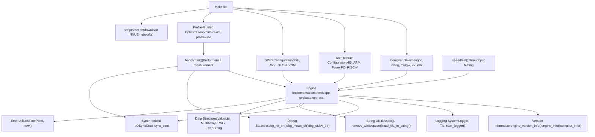
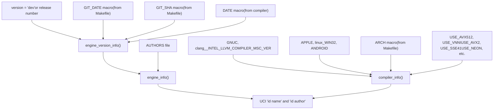

# 基础设施与支持

相关源文件

-   [AUTHORS](https://github.com/official-stockfish/Stockfish/blob/c27c1747/AUTHORS)
-   [src/Makefile](https://github.com/official-stockfish/Stockfish/blob/c27c1747/src/Makefile)
-   [src/misc.cpp](https://github.com/official-stockfish/Stockfish/blob/c27c1747/src/misc.cpp)
-   [src/misc.h](https://github.com/official-stockfish/Stockfish/blob/c27c1747/src/misc.h)

## 概述

本节记录了支持 Stockfish 开发、编译、测试和部署的基础设施与支持系统。这些系统提供了构建核心国际象棋引擎的基础。

基础设施由三个主要子系统组成：

1.  **构建系统**（见 [7.1](/official-stockfish/Stockfish/7.1-build-system)）- 基于 Makefile 的编译基础设施，支持多种平台、编译器和带有配置文件引导优化的架构
2.  **实用程序和支持函数**（见 [7.2](/official-stockfish/Stockfish/7.2-utilities-and-support-functions)）- 用于日志记录、调试、字符串操作和运行时实用程序的辅助函数
3.  **测试和基准测试**（见 [7.3](/official-stockfish/Stockfish/7.3-testing-and-benchmarking)）- 性能测量和回归测试设施

这些子系统相互独立但互为补充。构建系统编译代码，实用程序提供运行时支持，测试设施验证性能。

来源： [src/Makefile](https://github.com/official-stockfish/Stockfish/blob/c27c1747/src/Makefile) [src/misc.cpp](https://github.com/official-stockfish/Stockfish/blob/c27c1747/src/misc.cpp) [src/misc.h](https://github.com/official-stockfish/Stockfish/blob/c27c1747/src/misc.h)

---

## 基础设施架构

下图显示了基础设施组件如何相互关联以及与核心引擎的关系：


**基础设施组件关系**

构建系统 (Makefile) 协调带有特定架构优化的编译。配置文件引导优化使用基准测试生成指导编译器优化决策的分析数据。实用程序提供核心引擎在整个执行过程中使用的日志记录、调试和数据操作的运行时支持。测试设施测量性能并验证更改。

来源： [src/Makefile1-1165](https://github.com/official-stockfish/Stockfish/blob/c27c1747/src/Makefile#L1-L1165) [src/misc.cpp1-528](https://github.com/official-stockfish/Stockfish/blob/c27c1747/src/misc.cpp#L1-L528) [src/misc.h1-458](https://github.com/official-stockfish/Stockfish/blob/c27c1747/src/misc.h#L1-L458)

---

## 构建系统概述

基于 Makefile 的构建系统支持：

| 组件 | 描述 |
| --- | --- |
| **编译器** | gcc, clang, MinGW, Intel ICX, Android NDK |
| **架构** | x86-64 (各种 SIMD 级别), x86-32, ARM (v7/v8), PowerPC, RISC-V, LoongArch, Apple Silicon |
| **SIMD 扩展** | SSE2, SSSE3, SSE4.1, AVX2, AVX-VNNI, AVX-512, AVX-512-ICL, NEON, Altivec |
| **构建模式** | Release (优化), Debug, Sanitizers (address, thread, undefined) |
| **PGO 支持** | 插桩构建 → 性能分析 → 优化重建 |

构建系统自动检测本机架构并选择适当的编译器标志。它支持 Android、Windows（通过 MinGW）和各种嵌入式平台的交叉编译。

**关键 Makefile 目标：**

-   `make build` - 不带配置文件引导优化的标准构建
-   `make profile-build` - 四步 PGO 构建（插桩 → 分析 → 优化 → 清理）
-   `make net` - 下载默认 NNUE 网络文件
-   `make strip` - 从可执行文件中剥离调试符号
-   `make clean` - 删除所有构建产物

关于编译器标志、架构选项和构建过程的详细文档，请参阅 [7.1 构建系统](/official-stockfish/Stockfish/7.1-build-system)。

来源： [src/Makefile1-165](https://github.com/official-stockfish/Stockfish/blob/c27c1747/src/Makefile#L1-L165) [src/Makefile432-887](https://github.com/official-stockfish/Stockfish/blob/c27c1747/src/Makefile#L432-L887) [src/Makefile899-1040](https://github.com/official-stockfish/Stockfish/blob/c27c1747/src/Makefile#L899-L1040)

---

## 实用程序和支持函数概述

`misc.cpp` 和 `misc.h` 文件提供了 Stockfish 全局使用的基本运行时实用程序：

```mermaid
flowchart TD
    TimePoint["TimePoint, now()"]
    Prefetch["prefetch(addr)"]
    HashCombine["hash_combine()"]
    CommandLine["CommandLine utilities"]
    ValueList["ValueList"]
    MultiArray["MultiArray"]
    PRNG["PRNG (xorshift64star)"]
    FixedString["FixedString"]
    Split["split(s, delimiter)"]
    ReadFile["read_file_to_string(path)"]
    RemoveWS["remove_whitespace(s)"]
    IsWS["is_whitespace(s)"]
    StrToSize["str_to_size_t(s)"]
    SyncCout["SyncCout enumIO_LOCK, IO_UNLOCK"]
    SyncMacros["sync_cout, sync_endl macros"]
    Mutex["std::mutex for cout"]
    HitOn["dbg_hit_on(cond, slot)"]
    DbgPrint["dbg_print()"]
    MeanOf["dbg_mean_of(value, slot)"]
    StdevOf["dbg_stdev_of(value, slot)"]
    ExtremesOf["dbg_extremes_of(value, slot)"]
    CorrelOf["dbg_correl_of(v1, v2, slot)"]
    DbgClear["dbg_clear()"]
    Logger["Logger class"]
    Tie["Tie streambuf"]
    StartLog["start_logger(fname)"]
    VInfo["engine_version_info()"]
    GitMacros["GIT_SHA, GIT_DATE, ARCHcompile-time macros"]
    CInfo["compiler_info()"]
    EInfo["engine_info()"]

    SyncCout --> SyncMacros
    Mutex --> SyncCout
    HitOn --> DbgPrint
    MeanOf --> DbgPrint
    StdevOf --> DbgPrint
    ExtremesOf --> DbgPrint
    CorrelOf --> DbgPrint
    DbgClear --> DbgPrint
    Logger --> Tie
    StartLog --> Logger
    GitMacros --> VInfo
    GitMacros --> CInfo
    VInfo --> EInfo
```


**实用程序类别：**

1.  **版本信息** - 从 git SHA、构建日期、架构和编译器组装版本字符串
2.  **日志记录** - 将 stdin/stdout 重定向到文件以调试 UCI 协议交互
3.  **调试统计** - 收集运行时统计信息（命中率、均值、相关性）以进行开发调优
4.  **I/O 同步** - 使用 `sync_cout` 和 `sync_endl` 宏的线程安全控制台输出
5.  **字符串/文件实用程序** - 用于解析和文件 I/O 的辅助函数
6.  **数据结构** - 供内部使用的通用容器和 PRNG
7.  **性能实用程序** - 内存预取和计时函数

这些实用程序是仅头文件的或依赖性极小，使其可从代码库的任何部分使用。关于详细的 API 文档，请参阅 [7.2 实用程序和支持函数](/official-stockfish/Stockfish/7.2-utilities-and-support-functions)。

来源： [src/misc.cpp40-433](https://github.com/official-stockfish/Stockfish/blob/c27c1747/src/misc.cpp#L40-L433) [src/misc.h44-446](https://github.com/official-stockfish/Stockfish/blob/c27c1747/src/misc.h#L44-L446)

---

## 版本和构建信息

Stockfish 通过 `misc.cpp` 中的三个函数报告详细的版本和构建配置：


**版本字符串格式：**

对于开发构建 (version == "dev")：

```
Stockfish dev-YYYYMMDD-SHA
```
对于发布构建：

```
Stockfish 17
```
**编译器信息格式：**

`compiler_info()` 函数返回详细的多行字符串：

```
Compiled by                : clang++ 15.0.7
Compilation architecture   : x86-64-avx2
Compilation settings       : 64bit AVX2 BMI2 POPCNT
Compiler __VERSION__ macro : (compiler version string)
```
此信息是从 Makefile 在编译期间设置的预处理器宏中提取的：

| 宏 | 来源 | 用途 |
| --- | --- | --- |
| `GIT_SHA` | Git 仓库 | 8 字符提交哈希 |
| `GIT_DATE` | Git 仓库 | YYYYMMDD 格式的提交日期 |
| `ARCH` | Makefile | 目标架构 (例如 x86-64-avx2) |
| `USE_AVX2`, `USE_VNNI` 等 | Makefile | SIMD 指令集标志 |

Makefile 在编译时提取 git 信息：

```
GIT_SHA := $(shell git rev-parse HEAD 2>/dev/null | cut -c 1-8)
GIT_DATE := $(shell git show -s --date=format:'%Y%m%d' --format=%cd HEAD 2>/dev/null)
```
当用户报告错误或性能问题时，此版本信息有助于开发人员识别确切的构建配置和源代码版本。

来源： [src/misc.cpp127-283](https://github.com/official-stockfish/Stockfish/blob/c27c1747/src/misc.cpp#L127-L283) [src/Makefile836-851](https://github.com/official-stockfish/Stockfish/blob/c27c1747/src/Makefile#L836-L851) [AUTHORS1-276](https://github.com/official-stockfish/Stockfish/blob/c27c1747/AUTHORS#L1-L276)

---

## 测试和基准测试概述

基准测试系统为以下方面提供标准化的性能测量：

-   **回归测试** - 检测版本之间的性能变化
-   **配置文件引导优化** - 生成 PGO 编译的代表性工作负载
-   **硬件比较** - 测量不同 CPU 上的每秒节点数
-   **NUMA 配置** - 验证线程绑定和内存放置

`benchmark()` 函数在各种深度执行一套预定义的国际象棋局面，报告：

-   搜索的总节点数
-   每秒节点数 (NPS)
-   搜索时间
-   线程利用率

基准测试在配置文件引导优化构建期间调用，也可以通过 UCI 命令手动运行。关于基准测试局面、命令选项和性能分析的详细文档，请参阅 [7.3 测试和基准测试](/official-stockfish/Stockfish/7.3-testing-and-benchmarking)。

来源： [src/Makefile66-67](https://github.com/official-stockfish/Stockfish/blob/c27c1747/src/Makefile#L66-L67) [src/Makefile988-1002](https://github.com/official-stockfish/Stockfish/blob/c27c1747/src/Makefile#L988-L1002)

---

## 关键数据结构

实用程序模块提供了整个代码库中使用的几个通用数据结构：

### ValueList

具有 O(1) 追加和访问的固定容量、栈分配列表：

```
template<typename T, std::size_t MaxSize>
class ValueList
```
用于每个局面的最大着法数已知的着法生成（合法着法为 218）。避免堆分配开销。

### MultiArray

支持任意维度的多维数组模板：

```
template<typename T, std::size_t Size, std::size_t... Sizes>
class MultiArray
```
用于大型固定大小表，如历史表，这些表具有按棋子、格位和着法类型索引的维度。

### PRNG

xorshift64star 伪随机数生成器：

```
class PRNG {
    uint64_t s;
    uint64_t rand64();
public:
    PRNG(uint64_t seed);
    template<typename T> T rand();
    template<typename T> T sparse_rand();
};
```
用于 Zobrist 哈希初始化和着法排序随机化。`sparse_rand()` 变体生成仅设置了 1/8 位的数值，这对于魔术位棋盘候选生成很有用。

### FixedString

具有栈分配的固定容量字符串：

```
template<std::size_t Capacity>
class FixedString
```
用于 UCI 选项名称和其他堆分配会造成浪费的小字符串。

来源： [src/misc.h132-395](https://github.com/official-stockfish/Stockfish/blob/c27c1747/src/misc.h#L132-L395)

---

## 编译器和平台检测

实用程序通过编译时检测处理特定于平台的代码：

| 检测 | 宏 | 用途 |
| --- | --- | --- |
| **编译器** | `__GNUC__`, `__clang__`, `__INTEL_LLVM_COMPILER`, `_MSC_VER` | 选择特定于编译器的扩展 |
| **平台** | `_WIN32`, `_WIN64`, `__linux__`, `__APPLE__`, `__ANDROID__` | 处理特定于 OS 的 API |
| **线程** | `USE_PTHREADS` vs Windows 线程 | 选择线程实现 |
| **字节序** | 测试 `Le` 变量 | 运行时或编译时检测 |
| **64 位** | `IS_64BIT` | 启用 64 位特定优化 |
| **SIMD** | `USE_AVX512`, `USE_AVX2`, `USE_NEON` 等 | 启用指令集扩展 |

`prefetch()` 函数演示了特定于平台的代码：

```
#ifdef NO_PREFETCH
void prefetch(const void*) {}
#else
void prefetch(const void* addr) {
    #if defined(_MSC_VER)
    _mm_prefetch((char const*) addr, _MM_HINT_T0);
    #else
    __builtin_prefetch(addr);
    #endif
}
#endif
```
这允许 Stockfish 使用最佳实现，同时保持跨编译器和架构的可移植性。

来源： [src/misc.cpp435-450](https://github.com/official-stockfish/Stockfish/blob/c27c1747/src/misc.cpp#L435-L450) [src/misc.h423-446](https://github.com/official-stockfish/Stockfish/blob/c27c1747/src/misc.h#L423-L446) [src/Makefile630-656](https://github.com/official-stockfish/Stockfish/blob/c27c1747/src/Makefile#L630-L656)

---

## 线程安全控制台输出

多线程搜索需要同步的控制台输出以防止 UCI 消息乱码。`SyncCout` 系统提供了这一点：

```
enum SyncCout { IO_LOCK, IO_UNLOCK };
std::ostream& operator<<(std::ostream& os, SyncCout sc);

#define sync_cout std::cout << IO_LOCK
#define sync_endl std::endl << IO_UNLOCK
```
用法：

```
sync_cout << "info depth " << depth << " nodes " << nodes << sync_endl;
```
`SyncCout` 的重载 `operator<<` 在写入 `IO_LOCK` 时锁定互斥锁，并在写入 `IO_UNLOCK` 时解锁。这确保了整行输出是原子写入的，防止来自多个搜索线程的输出交错。

来源： [src/misc.cpp415-429](https://github.com/official-stockfish/Stockfish/blob/c27c1747/src/misc.cpp#L415-L429) [src/misc.h115-125](https://github.com/official-stockfish/Stockfish/blob/c27c1747/src/misc.h#L115-L125)

---

## 总结

基础设施和支持系统提供：

1.  **构建系统** - 具有广泛架构支持和配置文件引导优化的跨平台编译
2.  **实用程序** - 用于日志记录、调试、字符串处理和线程安全 I/O 的运行时支持
3.  **测试** - 用于回归检测和优化的标准化性能测量

这些系统使 Stockfish 能够在各种硬件平台上高效编译和运行，同时为开发人员提供用于调试、性能分析和性能分析的工具。

详细信息：

-   构建系统详情：[7.1 构建系统](/official-stockfish/Stockfish/7.1-build-system)
-   实用程序 API 参考：[7.2 实用程序和支持函数](/official-stockfish/Stockfish/7.2-utilities-and-support-functions)
-   测试程序：[7.3 测试和基准测试](/official-stockfish/Stockfish/7.3-testing-and-benchmarking)
