# 实用程序和支持函数

相关源文件

-   [src/misc.cpp](https://github.com/official-stockfish/Stockfish/blob/c27c1747/src/misc.cpp)
-   [src/misc.h](https://github.com/official-stockfish/Stockfish/blob/c27c1747/src/misc.h)

本文档涵盖了支持 Stockfish 核心国际象棋引擎功能的基础设施和实用程序系统。这些实用程序提供了基本服务，包括日志记录、调试、线程安全 I/O、内存管理、字符串处理和平台抽象。实用程序主要在 `misc.h` 和 `misc.cpp` 文件中实现，并作为整个引擎中使用的基础组件。

关于构建系统和编译基础设施的信息，请参阅 [构建系统](/official-stockfish/Stockfish/7.1-build-system)。关于测试和基准测试工具，请参阅 [测试与基准测试](/official-stockfish/Stockfish/7.3-testing-and-benchmarking)。

## 实用程序系统概述

Stockfish 中的实用程序基础设施由几个关键子系统组成，为国际象棋引擎提供基础服务：

```mermaid
flowchart TD
    Prefetch["prefetch()Cache Preloading"]
    PRNG["PRNG Classxorshift64star"]
    MathUtils["Mathematical Utilitiesmul_hi64()"]
    Logger["Logger ClassTie Streams"]
    SyncIO["Thread-Safe I/OSyncCout, sync_cout"]
    DebugStats["Debug Statisticsdbg_hit_on(), dbg_mean_of()"]
    VersionInfo["engine_version_info()engine_info()"]
    StringUtils["String Processingsplit(), remove_whitespace()"]
    FileUtils["File Operationsread_file_to_string()"]
    TimeUtils["Time ManagementTimePoint, now()"]
    ValueList["ValueListFixed-Size Container"]
    MultiArray["MultiArrayN-Dimensional Array"]
    CommandLine["CommandLineArgument Processing"]
    PlatformDetect["Platform DetectionCompiler Info"]
    PathUtils["Path UtilitiesDirectory Management"]
    Endianness["Endianness DetectionIsLittleEndian"]

    CommandLine --> PathUtils
    Logger --> SyncIO
    DebugStats --> SyncIO
    VersionInfo --> StringUtils
    FileUtils --> StringUtils
```
来源： [src/misc.h1-338](https://github.com/official-stockfish/Stockfish/blob/c27c1747/src/misc.h#L1-L338) [src/misc.cpp1-527](https://github.com/official-stockfish/Stockfish/blob/c27c1747/src/misc.cpp#L1-L527)

## 版本和引擎信息

Stockfish 通过专用实用函数提供全面的版本和编译器信息：

| 函数 | 用途 | 返回类型 |
| --- | --- | --- |
| `engine_version_info()` | 返回带有 git 信息的完整版本字符串 | `std::string` |
| `engine_info(bool to_uci)` | 返回为 UCI 或显示格式化的引擎信息 | `std::string` |
| `compiler_info()` | 返回详细的编译和平台信息 | `std::string` |

版本系统在开发构建期间自动合并 git 提交信息：

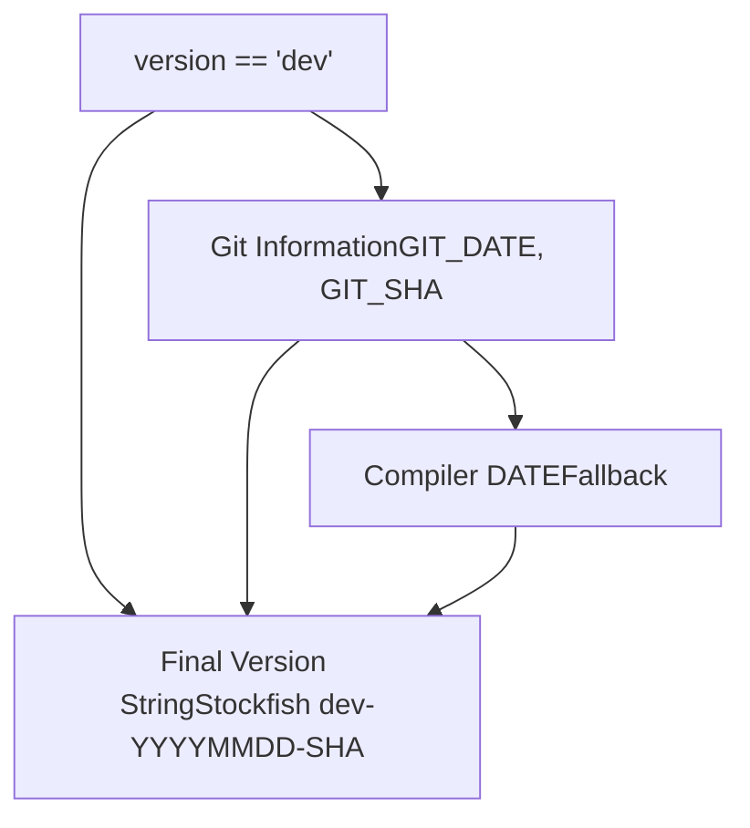
来源： [src/misc.cpp127-162](https://github.com/official-stockfish/Stockfish/blob/c27c1747/src/misc.cpp#L127-L162) [src/misc.cpp166-283](https://github.com/official-stockfish/Stockfish/blob/c27c1747/src/misc.cpp#L166-L283)

## 日志系统

日志系统提供了一种复杂的机制，用于将标准 I/O 流重定向到日志文件，而无需修改现有代码：

### Tie 流架构


`Tie` 类拦截流操作并将它们复制到原始流和日志文件，并带有指示输入 (`>>`) 和输出 (`<<`) 操作的前缀。

来源： [src/misc.cpp51-111](https://github.com/official-stockfish/Stockfish/blob/c27c1747/src/misc.cpp#L51-L111)

## 调试统计系统

Stockfish 包含一个全面的调试系统，用于在引擎开发和调优期间收集运行时统计信息：

### 统计收集函数

| 函数 | 用途 | 收集的数据 |
| --- | --- | --- |
| `dbg_hit_on(bool cond, int slot)` | 跟踪条件命中率 | 总调用次数，成功命中次数 |
| `dbg_mean_of(int64_t value, int slot)` | 计算平均值 | 计数，总和 |
| `dbg_stdev_of(int64_t value, int slot)` | 跟踪标准差 | 计数，总和，平方和 |
| `dbg_extremes_of(int64_t value, int slot)` | 记录最小/最大值 | 计数，最小值，最大值 |
| `dbg_correl_of(int64_t v1, int64_t v2, int slot)` | 测量相关性 | 双变量统计 |

该系统支持多达 32 个并发调试槽 (`MaxDebugSlots = 32`) 用于不同的测量：

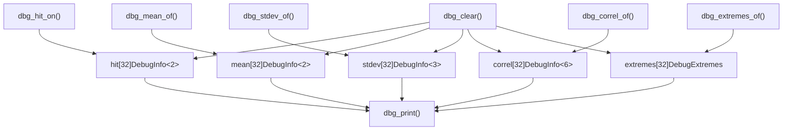
来源： [src/misc.cpp287-411](https://github.com/official-stockfish/Stockfish/blob/c27c1747/src/misc.cpp#L287-L411)

## 线程安全 I/O 系统

Stockfish 实现了一个线程安全的控制台输出系统，以防止多线程搜索中的乱码输出：

### SyncCout 实现

该系统使用 `SyncCout` 枚举和重载的流运算符，通过方便的宏提供受互斥锁保护的控制台访问。

来源： [src/misc.cpp415-429](https://github.com/official-stockfish/Stockfish/blob/c27c1747/src/misc.cpp#L415-L429) [src/misc.h111-121](https://github.com/official-stockfish/Stockfish/blob/c27c1747/src/misc.h#L111-L121)

## 内存和性能实用程序

### 缓存预取

`prefetch()` 函数提供特定于平台的缓存预加载，以提高内存访问性能：

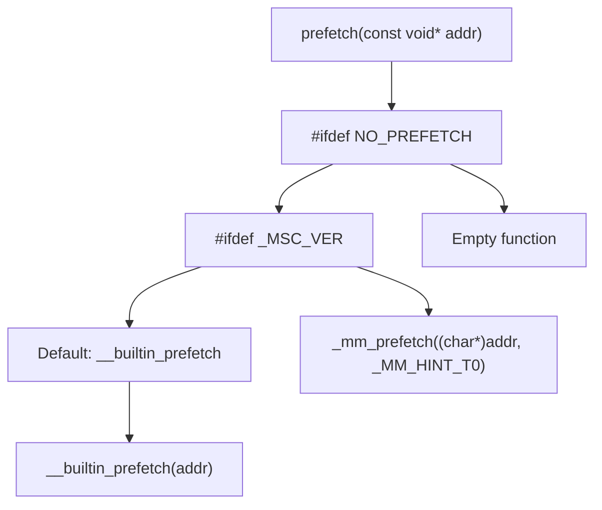
来源： [src/misc.cpp435-450](https://github.com/official-stockfish/Stockfish/blob/c27c1747/src/misc.cpp#L435-L450)

### 高精度乘法

`mul_hi64()` 函数提供具有 128 位中间结果的高效 64 位乘法：

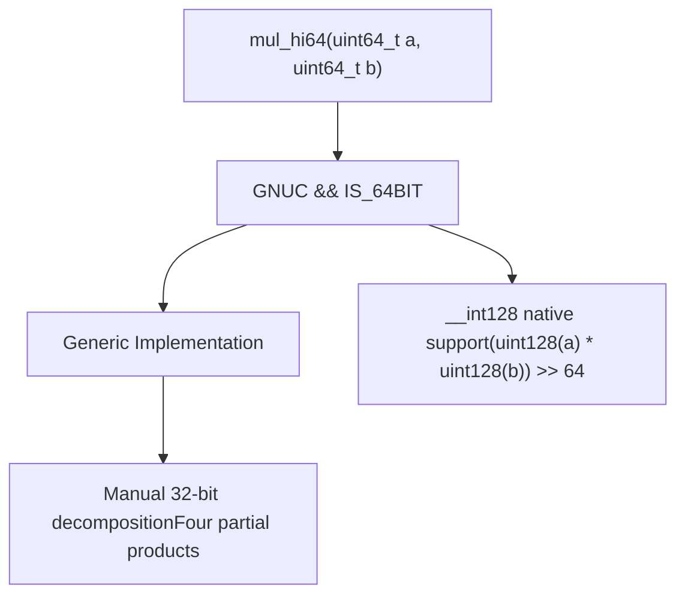
来源： [src/misc.h279-291](https://github.com/official-stockfish/Stockfish/blob/c27c1747/src/misc.h#L279-L291)

## 数据结构实用程序

### ValueList 模板

`ValueList` 模板提供了一个针对小集合优化的固定大小容器：

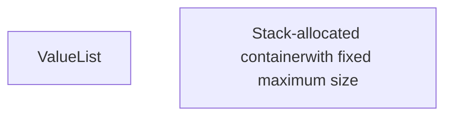
### MultiArray 模板

`MultiArray` 模板实现了具有编译时维度的 N 维数组：

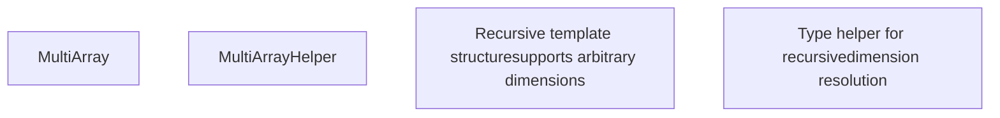
来源： [src/misc.h128-232](https://github.com/official-stockfish/Stockfish/blob/c27c1747/src/misc.h#L128-L232)

## 字符串和文件处理

Stockfish 提供了各种字符串操作和文件 I/O 实用程序：

### 字符串处理函数

| 函数 | 用途 | 实现 |
| --- | --- | --- |
| `split(string_view s, string_view delimiter)` | 按分隔符分割字符串 | 返回 `vector<string_view>` |
| `remove_whitespace(string& s)` | 就地删除所有空白 | 使用 `std::remove_if` 和 `std::isspace` |
| `is_whitespace(string_view s)` | 检查字符串是否仅包含空白 | 使用 `std::all_of` 和 `std::isspace` |
| `str_to_size_t(const string& s)` | 安全的 string 到 size_t 转换 | 带有溢出退出的边界检查 |

### 文件操作

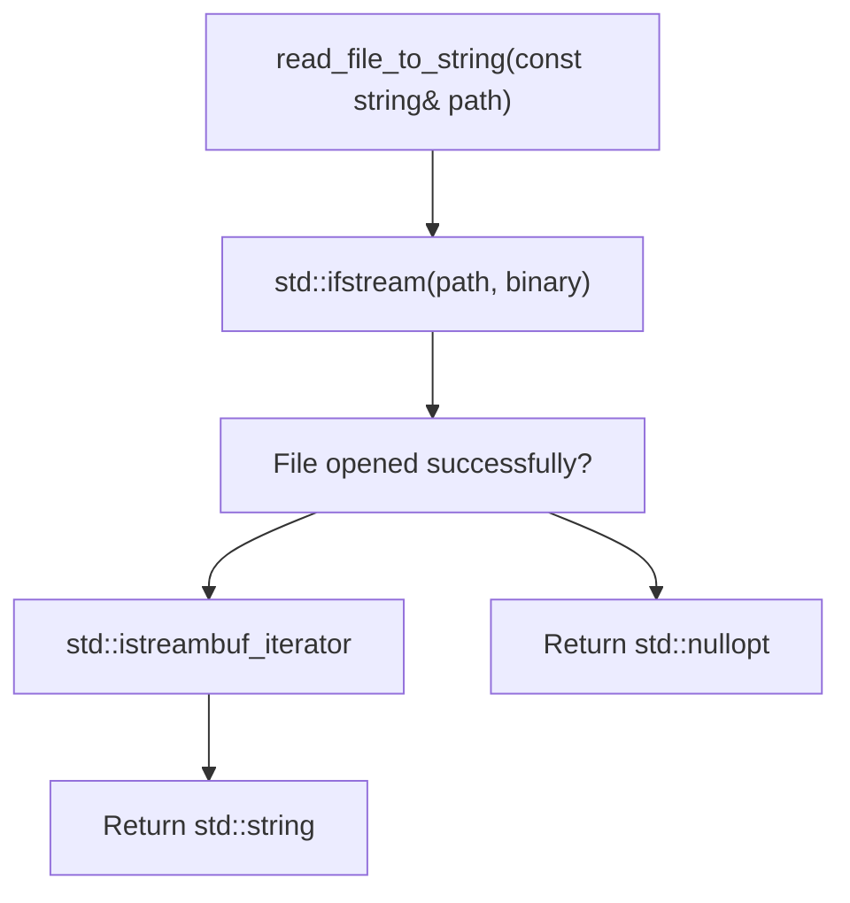
来源： [src/misc.h86-109](https://github.com/official-stockfish/Stockfish/blob/c27c1747/src/misc.h#L86-L109) [src/misc.cpp460-480](https://github.com/official-stockfish/Stockfish/blob/c27c1747/src/misc.cpp#L460-L480)

## 平台抽象

### CommandLine 实用程序

`CommandLine` 类提供了用于处理命令行参数和目录操作的跨平台实用程序：

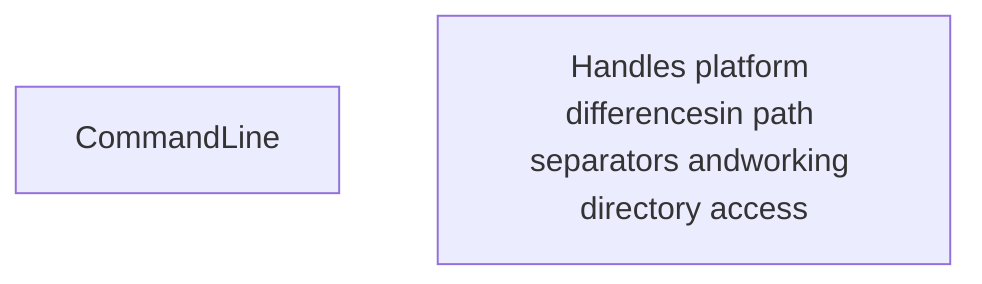
### 平台特定实现

| 功能 | Windows | Unix/Linux | 实现 |
| --- | --- | --- | --- |
| 路径分隔符 | `\\` | `/` | 条件编译 |
| 工作目录 | `_getcwd()` | `getcwd()` | `GETCWD` 宏 |
| 程序路径 | `_get_pgmptr()` | `argv[0]` | MSVC 特定处理 |

来源： [src/misc.cpp482-524](https://github.com/official-stockfish/Stockfish/blob/c27c1747/src/misc.cpp#L482-L524) [src/misc.h294-305](https://github.com/official-stockfish/Stockfish/blob/c27c1747/src/misc.h#L294-L305)

## PRNG 和数学实用程序

### xorshift64star 伪随机数生成器

Stockfish 实现了基于 Sebastiano Vigna 的 xorshift64star 算法的高质量 PRNG：

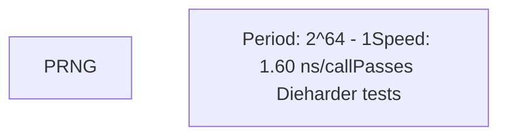
`sparse_rand()` 方法产生平均只有 1/8 位设置的值，用于在位棋盘操作中生成魔术数字。

来源： [src/misc.h250-277](https://github.com/official-stockfish/Stockfish/blob/c27c1747/src/misc.h#L250-L277)

## 编译器和构建集成

### 编译器提示宏

Stockfish 通过 `sf_assume()` 宏提供特定于编译器的优化提示：

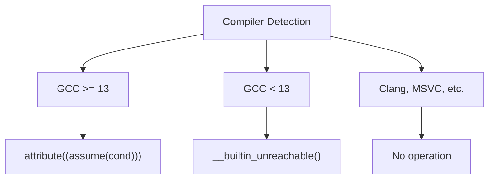
### 字节序检测

系统通过一种简单但有效的方法提供编译时字节序检测：

```
static inline const std::uint16_t Le = 1;
static inline const bool IsLittleEndian = *reinterpret_cast<const char*>(&Le) == 1;
```
来源： [src/misc.h320-334](https://github.com/official-stockfish/Stockfish/blob/c27c1747/src/misc.h#L320-L334) [src/misc.h124-125](https://github.com/official-stockfish/Stockfish/blob/c27c1747/src/misc.h#L124-L125)
```