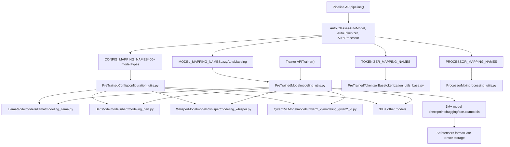
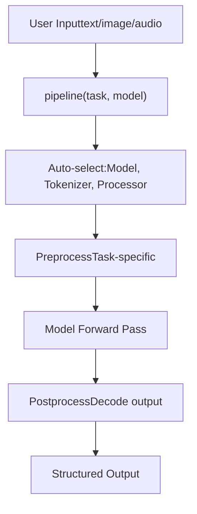
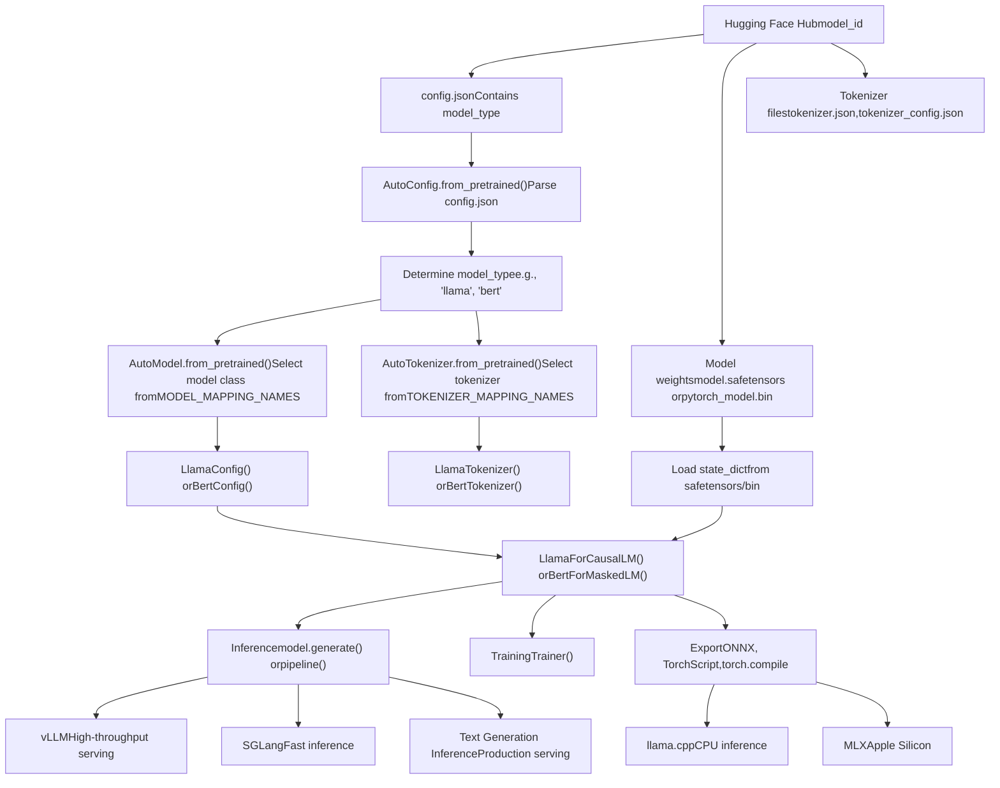
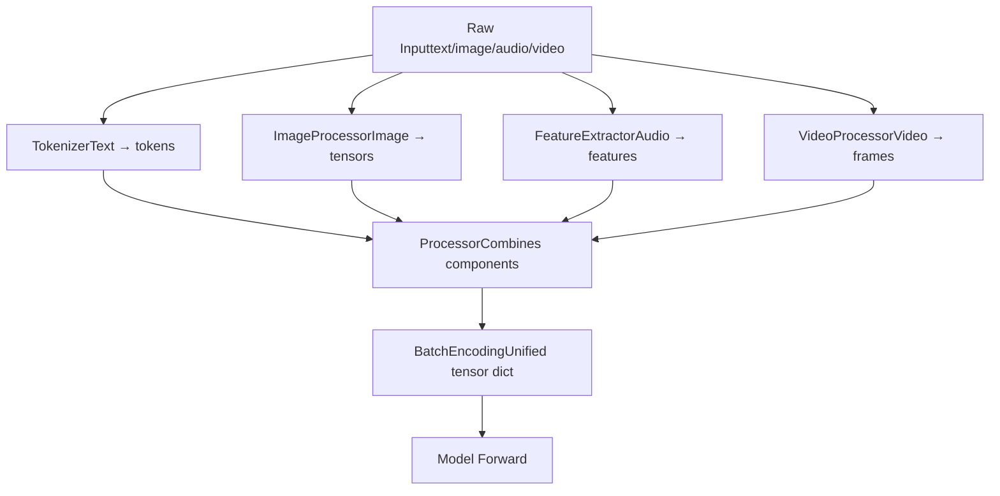
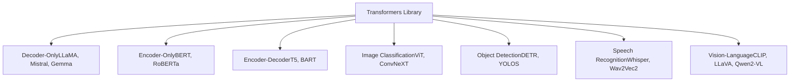

# 概览 (Overview)

相关源文件 (Relevant source files)

-   [MIGRATION\_GUIDE\_V5.md](https://github.com/huggingface/transformers/blob/9a9997fd/MIGRATION_GUIDE_V5.md?plain=1)
-   [README.md](https://github.com/huggingface/transformers/blob/9a9997fd/README.md?plain=1)
-   [docs/source/en/\_toctree.yml](https://github.com/huggingface/transformers/blob/9a9997fd/docs/source/en/_toctree.yml)
-   [docs/source/en/index.md](https://github.com/huggingface/transformers/blob/9a9997fd/docs/source/en/index.md?plain=1)
-   [docs/source/en/serve-cli/serving.md](https://github.com/huggingface/transformers/blob/9a9997fd/docs/source/en/serve-cli/serving.md?plain=1)
-   [docs/source/ko/\_toctree.yml](https://github.com/huggingface/transformers/blob/9a9997fd/docs/source/ko/_toctree.yml)
-   [src/transformers/\_\_init\_\_.py](https://github.com/huggingface/transformers/blob/9a9997fd/src/transformers/__init__.py)
-   [src/transformers/cli/add\_new\_model\_like.py](https://github.com/huggingface/transformers/blob/9a9997fd/src/transformers/cli/add_new_model_like.py)
-   [src/transformers/cli/chat.py](https://github.com/huggingface/transformers/blob/9a9997fd/src/transformers/cli/chat.py)
-   [src/transformers/cli/download.py](https://github.com/huggingface/transformers/blob/9a9997fd/src/transformers/cli/download.py)
-   [src/transformers/cli/serve.py](https://github.com/huggingface/transformers/blob/9a9997fd/src/transformers/cli/serve.py)
-   [src/transformers/cli/system.py](https://github.com/huggingface/transformers/blob/9a9997fd/src/transformers/cli/system.py)
-   [src/transformers/cli/transformers.py](https://github.com/huggingface/transformers/blob/9a9997fd/src/transformers/cli/transformers.py)
-   [src/transformers/data/datasets/glue.py](https://github.com/huggingface/transformers/blob/9a9997fd/src/transformers/data/datasets/glue.py)
-   [src/transformers/data/processors/glue.py](https://github.com/huggingface/transformers/blob/9a9997fd/src/transformers/data/processors/glue.py)
-   [src/transformers/models/\_\_init\_\_.py](https://github.com/huggingface/transformers/blob/9a9997fd/src/transformers/models/__init__.py)
-   [src/transformers/models/auto/configuration\_auto.py](https://github.com/huggingface/transformers/blob/9a9997fd/src/transformers/models/auto/configuration_auto.py)
-   [src/transformers/models/auto/feature\_extraction\_auto.py](https://github.com/huggingface/transformers/blob/9a9997fd/src/transformers/models/auto/feature_extraction_auto.py)
-   [src/transformers/models/auto/image\_processing\_auto.py](https://github.com/huggingface/transformers/blob/9a9997fd/src/transformers/models/auto/image_processing_auto.py)
-   [src/transformers/models/auto/modeling\_auto.py](https://github.com/huggingface/transformers/blob/9a9997fd/src/transformers/models/auto/modeling_auto.py)
-   [src/transformers/models/auto/processing\_auto.py](https://github.com/huggingface/transformers/blob/9a9997fd/src/transformers/models/auto/processing_auto.py)
-   [src/transformers/models/auto/tokenization\_auto.py](https://github.com/huggingface/transformers/blob/9a9997fd/src/transformers/models/auto/tokenization_auto.py)
-   [src/transformers/models/cohere/tokenization\_cohere.py](https://github.com/huggingface/transformers/blob/9a9997fd/src/transformers/models/cohere/tokenization_cohere.py)
-   [src/transformers/utils/dummy\_pt\_objects.py](https://github.com/huggingface/transformers/blob/9a9997fd/src/transformers/utils/dummy_pt_objects.py)
-   [src/transformers/utils/logging.py](https://github.com/huggingface/transformers/blob/9a9997fd/src/transformers/utils/logging.py)
-   [tests/cli/test\_serve.py](https://github.com/huggingface/transformers/blob/9a9997fd/tests/cli/test_serve.py)
-   [utils/check\_repo.py](https://github.com/huggingface/transformers/blob/9a9997fd/utils/check_repo.py)

**Transformers** 是一个模型定义框架，用于文本、计算机视觉、音频、视频和多模态领域的尖端机器学习。它提供了 400 多种模型架构的标准化实现，可用于推理 (Inference) 和训练 (Training)，作为 Hugging Face Hub（100 万个以上的模型检查点）、训练框架（Axolotl、Unsloth、DeepSpeed、FSDP）、推理引擎（vLLM、SGLang、TGI）以及相邻建模库（llama.cpp、mlx）之间的中心枢纽。[README.md67-73](https://github.com/huggingface/transformers/blob/9a9997fd/README.md?plain=1#L67-L73) [docs/source/en/index.md22-28](https://github.com/huggingface/transformers/blob/9a9997fd/docs/source/en/index.md?plain=1#L22-L28)

**本文档范围**：本页提供了 Transformers 库的目的、架构和功能的高级概览。有关特定系统的详细信息，请参阅：**核心架构 (Core Architecture)** 了解模型加载和分词 (Tokenization)，**训练系统 (Training System)** 了解微调 (Fine-tuning) 功能，**生成系统 (Generation System)** 了解文本生成，**模型架构 (Model Architectures)** 了解特定的模型系列，以及 **高级功能 (Advanced Features)** 了解量化 (Quantization) 和优化 (Optimization)。

## 目的与核心理念 (Purpose and Core Philosophy)

Transformers 将模型定义集中化，以确保整个机器学习生态系统的兼容性。在 Transformers 中实现的一个模型可以与多个框架和工具无缝协作，而无需重新实现。[README.md70-76](https://github.com/huggingface/transformers/blob/9a9997fd/README.md?plain=1#L70-L76)

**核心设计原则 (Core design principles)**：

1.  **快速且易于使用 (Fast and easy to use)**：每个模型实现仅使用三个基类：配置 (`PreTrainedConfig`)、模型 (`PreTrainedModel`) 和预处理器 (Preprocessor)（`PreTrainedTokenizerBase`、`ImageProcessingMixin` 等）。[docs/source/en/index.md54-55](https://github.com/huggingface/transformers/blob/9a9997fd/docs/source/en/index.md?plain=1#L54-L55)
2.  **预训练模型 (Pretrained models)**：通过利用现有的检查点 (Checkpoints)，减少计算成本和碳足迹。[docs/source/en/index.md55-56](https://github.com/huggingface/transformers/blob/9a9997fd/docs/source/en/index.md?plain=1#L55-L56)
3.  **生态系统兼容性 (Ecosystem compatibility)**：单一实现可跨训练、推理和部署工具使用。[README.md70-73](https://github.com/huggingface/transformers/blob/9a9997fd/README.md?plain=1#L70-L73)

来源 (Sources)：[docs/source/en/index.md1-66](https://github.com/huggingface/transformers/blob/9a9997fd/docs/source/en/index.md?plain=1#L1-L66) [README.md67-76](https://github.com/huggingface/transformers/blob/9a9997fd/README.md?plain=1#L67-L76) [src/transformers/\_\_init\_\_.py1-60](https://github.com/huggingface/transformers/blob/9a9997fd/src/transformers/__init__.py#L1-L60)

## 库架构 (Library Architecture)

该库被组织成几个互连的子系统，处理从加载到推理再到训练的完整模型生命周期。

### 高级系统组织 (High-Level System Organization)


来源 (Sources)：[src/transformers/\_\_init\_\_.py63-274](https://github.com/huggingface/transformers/blob/9a9997fd/src/transformers/__init__.py#L63-L274) [src/transformers/models/auto/configuration\_auto.py34-489](https://github.com/huggingface/transformers/blob/9a9997fd/src/transformers/models/auto/configuration_auto.py#L34-L489) [src/transformers/models/auto/modeling\_auto.py41-490](https://github.com/huggingface/transformers/blob/9a9997fd/src/transformers/models/auto/modeling_auto.py#L41-L490)

## 核心功能 (Core Capabilities)

### 1. 模型加载与推理 (Model Loading and Inference)

`AutoModel` 系统根据 `config.json` 中的 `model_type` 字段提供自动模型类选择。[src/transformers/models/auto/modeling\_auto.py41-490](https://github.com/huggingface/transformers/blob/9a9997fd/src/transformers/models/auto/modeling_auto.py#L41-L490)

| 组件 (Component) | 目的 (Purpose) | 关键类 (Key Classes) |
| --- | --- | --- |
| 自动配置 (Auto Config) | 加载配置 | `AutoConfig` [src/transformers/models/auto/configuration\_auto.py14-28](https://github.com/huggingface/transformers/blob/9a9997fd/src/transformers/models/auto/configuration_auto.py#L14-L28) |
| 自动模型 (Auto Model) | 实例化模型 | `AutoModel`、`AutoModelForCausalLM` [src/transformers/models/auto/modeling\_auto.py14-26](https://github.com/huggingface/transformers/blob/9a9997fd/src/transformers/models/auto/modeling_auto.py#L14-L26) |
| 自动分词器 (Auto Tokenizer) | 加载分词器 | `AutoTokenizer` [src/transformers/models/auto/tokenization\_auto.py14-45](https://github.com/huggingface/transformers/blob/9a9997fd/src/transformers/models/auto/tokenization_auto.py#L14-L45) |
| 自动处理器 (Auto Processor) | 加载多模态处理器 | `AutoProcessor`、`AutoImageProcessor` [src/transformers/models/auto/image\_processing\_auto.py14-43](https://github.com/huggingface/transformers/blob/9a9997fd/src/transformers/models/auto/image_processing_auto.py#L14-L43) |

**示例工作流程 (Example workflow)**：

```
from transformers import AutoModel, AutoTokenizer # Auto classes automatically determine the correct model/tokenizer classmodel = AutoModel.from_pretrained("bert-base-uncased")  # Returns BertModeltokenizer = AutoTokenizer.from_pretrained("bert-base-uncased")  # Returns BertTokenizer
```
来源 (Sources)：[src/transformers/models/auto/modeling\_auto.py1-490](https://github.com/huggingface/transformers/blob/9a9997fd/src/transformers/models/auto/modeling_auto.py#L1-L490) [src/transformers/models/auto/tokenization\_auto.py1-400](https://github.com/huggingface/transformers/blob/9a9997fd/src/transformers/models/auto/tokenization_auto.py#L1-L400) [src/transformers/models/auto/configuration\_auto.py1-489](https://github.com/huggingface/transformers/blob/9a9997fd/src/transformers/models/auto/configuration_auto.py#L1-L489)

### 2. 使用 Pipeline 进行高级推理 (High-Level Inference with Pipeline)

`Pipeline` API 提供面向任务的推理，无需手动预处理。[docs/source/en/index.md43](https://github.com/huggingface/transformers/blob/9a9997fd/docs/source/en/index.md?plain=1#L43-L43)


**支持的任务**包括：`text-generation`、`text-classification`、`token-classification`、`question-answering`、`summarization`、`translation`、`image-classification`、`object-detection`、`image-segmentation`、`automatic-speech-recognition`、`audio-classification`、`image-to-text`、`visual-question-answering`、`zero-shot-classification`、`zero-shot-image-classification` 等。[src/transformers/\_\_init\_\_.py138-170](https://github.com/huggingface/transformers/blob/9a9997fd/src/transformers/__init__.py#L138-L170)

来源 (Sources)：[src/transformers/\_\_init\_\_.py137-169](https://github.com/huggingface/transformers/blob/9a9997fd/src/transformers/__init__.py#L137-L169) [docs/source/en/index.md43](https://github.com/huggingface/transformers/blob/9a9997fd/docs/source/en/index.md?plain=1#L43-L43)

### 3. 使用 Trainer 进行训练 (Training with Trainer)

`Trainer` 类提供了一个完整的训练循环，支持分布式训练、混合精度 (Mixed Precision)、梯度累积 (Gradient Accumulation) 和回调 (Callbacks)。[docs/source/en/index.md44](https://github.com/huggingface/transformers/blob/9a9997fd/docs/source/en/index.md?plain=1#L44-L44)

```
from transformers import Trainer, TrainingArguments training_args = TrainingArguments(    output_dir="./results",    per_device_train_batch_size=8,    num_train_epochs=3,    fp16=True,  # Mixed precision) trainer = Trainer(    model=model,    args=training_args,    train_dataset=train_dataset,    eval_dataset=eval_dataset,) trainer.train()
```
来源 (Sources)：[src/transformers/\_\_init\_\_.py207-208](https://github.com/huggingface/transformers/blob/9a9997fd/src/transformers/__init__.py#L207-L208) [docs/source/en/index.md44](https://github.com/huggingface/transformers/blob/9a9997fd/docs/source/en/index.md?plain=1#L44-L44)

### 4. 文本生成 (Text Generation)

`generate()` 方法（来自 `GenerationMixin`）支持带有可配置策略、logits 处理器和缓存 (Caching) 的复杂自回归解码。[docs/source/en/index.md45](https://github.com/huggingface/transformers/blob/9a9997fd/docs/source/en/index.md?plain=1#L45-L45) [src/transformers/utils/dummy\_pt\_objects.py187-191](https://github.com/huggingface/transformers/blob/9a9997fd/src/transformers/utils/dummy_pt_objects.py#L187-L191)

来源 (Sources)：[src/transformers/\_\_init\_\_.py111-119](https://github.com/huggingface/transformers/blob/9a9997fd/src/transformers/__init__.py#L111-L119) [docs/source/en/index.md45](https://github.com/huggingface/transformers/blob/9a9997fd/docs/source/en/index.md?plain=1#L45-L45)

## 模型生命周期：从 Hub 到部署 (Model Lifecycle: Hub to Deployment)

下图说明了模型如何从 Hugging Face Hub 流经 Transformers 库到各个部署目标：


来源 (Sources)：[docs/source/en/index.md22-35](https://github.com/huggingface/transformers/blob/9a9997fd/docs/source/en/index.md?plain=1#L22-L35) [README.md67-78](https://github.com/huggingface/transformers/blob/9a9997fd/README.md?plain=1#L67-L78)

## 核心抽象与设计模式 (Key Abstractions and Design Patterns)

### 带有延迟加载的自动类 (Auto Classes with Lazy Loading)

自动类使用 `_LazyAutoMapping` 模式将导入延迟到需要时，从而缩短启动时间。[src/transformers/models/auto/auto\_factory.py24](https://github.com/huggingface/transformers/blob/9a9997fd/src/transformers/models/auto/auto_factory.py#L24-L24) 映射字典将 `model_type` 字符串连接到类名：

| 映射字典 (Mapping Dictionary) | 映射到 (Maps To) | 示例条目 (Example Entry) |
| --- | --- | --- |
| `CONFIG_MAPPING_NAMES` | 配置类 | `("llama", "LlamaConfig")` [src/transformers/models/auto/configuration\_auto.py34-489](https://github.com/huggingface/transformers/blob/9a9997fd/src/transformers/models/auto/configuration_auto.py#L34-L489) |
| `MODEL_MAPPING_NAMES` | 模型类 | `("llama", "LlamaModel")` [src/transformers/models/auto/modeling\_auto.py41-490](https://github.com/huggingface/transformers/blob/9a9997fd/src/transformers/models/auto/modeling_auto.py#L41-L490) |
| `TOKENIZER_MAPPING_NAMES` | 分词器类 | `("llama", "LlamaTokenizer")` [src/transformers/models/auto/tokenization\_auto.py64-300](https://github.com/huggingface/transformers/blob/9a9997fd/src/transformers/models/auto/tokenization_auto.py#L64-L300) |
| `IMAGE_PROCESSOR_MAPPING_NAMES` | 图像处理器 | `("clip", "CLIPImageProcessor")` [src/transformers/models/auto/image\_processing\_auto.py62-130](https://github.com/huggingface/transformers/blob/9a9997fd/src/transformers/models/auto/image_processing_auto.py#L62-L130) |

来源 (Sources)：[src/transformers/models/auto/configuration\_auto.py34-489](https://github.com/huggingface/transformers/blob/9a9997fd/src/transformers/models/auto/configuration_auto.py#L34-L489) [src/transformers/models/auto/modeling\_auto.py41-490](https://github.com/huggingface/transformers/blob/9a9997fd/src/transformers/models/auto/modeling_auto.py#L41-L490) [src/transformers/models/auto/tokenization\_auto.py64-300](https://github.com/huggingface/transformers/blob/9a9997fd/src/transformers/models/auto/tokenization_auto.py#L64-L300)

### PreTrainedModel 基类 (PreTrainedModel Base Class)

所有 PyTorch 模型都继承自 `PreTrainedModel`，它提供了权重管理、设备放置 (Device Placement) 和 Hub 集成的核心实用程序。[src/transformers/utils/dummy\_pt\_objects.py187-191](https://github.com/huggingface/transformers/blob/9a9997fd/src/transformers/utils/dummy_pt_objects.py#L187-L191)

来源 (Sources)：[src/transformers/\_\_init\_\_.py452](https://github.com/huggingface/transformers/blob/9a9997fd/src/transformers/__init__.py#L452-L452) [src/transformers/utils/dummy\_pt\_objects.py1-700](https://github.com/huggingface/transformers/blob/9a9997fd/src/transformers/utils/dummy_pt_objects.py#L1-L700)

### 模块化处理流水线 (Modular Processing Pipeline)

处理组件是可组合的，允许将多模态输入统一为单个 `BatchEncoding` 对象。[src/transformers/tokenization\_utils\_base.py185](https://github.com/huggingface/transformers/blob/9a9997fd/src/transformers/tokenization_utils_base.py#L185-L185)


来源 (Sources)：[src/transformers/\_\_init\_\_.py170-177](https://github.com/huggingface/transformers/blob/9a9997fd/src/transformers/__init__.py#L170-L177) [src/transformers/models/auto/processing\_auto.py1-200](https://github.com/huggingface/transformers/blob/9a9997fd/src/transformers/models/auto/processing_auto.py#L1-L200)

## 生态系统集成 (Ecosystem Integration)

Transformers 作为模型定义与更广泛的 ML 生态系统之间的兼容层。[README.md70-73](https://github.com/huggingface/transformers/blob/9a9997fd/README.md?plain=1#L70-L73)

### 训练和推理框架 (Training and Inference Frameworks)

-   **Accelerate**：分布式训练抽象（DDP、FSDP、DeepSpeed）。[docs/source/en/\_toctree.yml177](https://github.com/huggingface/transformers/blob/9a9997fd/docs/source/en/_toctree.yml#L177-L177)
-   **PEFT**：参数高效微调 (Parameter-efficient fine-tuning)（LoRA、QLoRA）。[docs/source/en/\_toctree.yml170](https://github.com/huggingface/transformers/blob/9a9997fd/docs/source/en/_toctree.yml#L170-L170)
-   **推理引擎 (Inference Engines)**：通过 vLLM、SGLang 和 TGI 进行高吞吐量服务。[README.md72](https://github.com/huggingface/transformers/blob/9a9997fd/README.md?plain=1#L72-L72)
-   **量化 (Quantization)**：对 bitsandbytes、GPTQ、AWQ 等的原生支持。[docs/source/en/\_toctree.yml207-246](https://github.com/huggingface/transformers/blob/9a9997fd/docs/source/en/_toctree.yml#L207-L246)

来源 (Sources)：[docs/source/en/index.md22-31](https://github.com/huggingface/transformers/blob/9a9997fd/docs/source/en/index.md?plain=1#L22-L31) [README.md70-73](https://github.com/huggingface/transformers/blob/9a9997fd/README.md?plain=1#L70-L73) [docs/source/en/\_toctree.yml258-298](https://github.com/huggingface/transformers/blob/9a9997fd/docs/source/en/_toctree.yml#L258-L298)

## 支持的模态与模型系列 (Supported Modalities and Model Families)

该库支持跨多种模态的模型，包括文本（BERT、Llama）、视觉（ViT、DETR）、音频（Whisper）和多模态（LLaVA、Qwen2-VL）。[docs/source/en/index.md22-23](https://github.com/huggingface/transformers/blob/9a9997fd/docs/source/en/index.md?plain=1#L22-L23)


来源 (Sources)：[docs/source/en/\_toctree.yml450-1096](https://github.com/huggingface/transformers/blob/9a9997fd/docs/source/en/_toctree.yml#L450-L1096) [src/transformers/models/\_\_init\_\_.py1-440](https://github.com/huggingface/transformers/blob/9a9997fd/src/transformers/models/__init__.py#L1-L440)

## 安装与快速开始 (Installation and Quick Start)

**要求 (Requirements)**：Python 3.10+、PyTorch 2.4+。[README.md84](https://github.com/huggingface/transformers/blob/9a9997fd/README.md?plain=1#L84-L84)

```
# Basic installationpip install "transformers[torch]" # From source (latest development version)git clone https://github.com/huggingface/transformers.gitcd transformerspip install '.[torch]'
```
来源 (Sources)：[README.md82-131](https://github.com/huggingface/transformers/blob/9a9997fd/README.md?plain=1#L82-L131) [docs/source/en/index.md39-61](https://github.com/huggingface/transformers/blob/9a9997fd/docs/source/en/index.md?plain=1#L39-L61)
