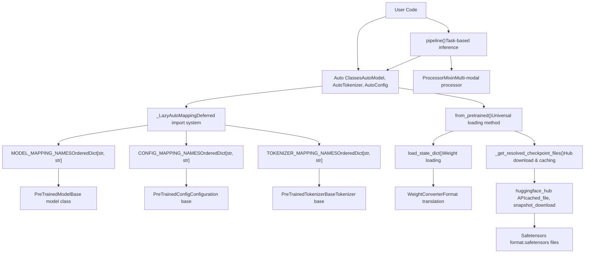
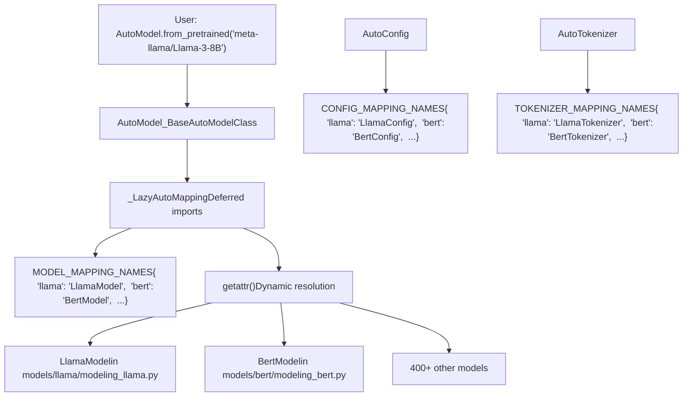
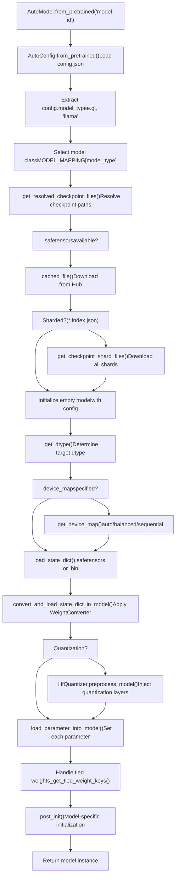
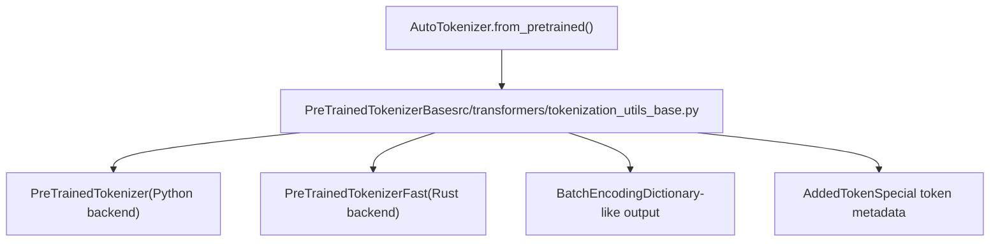
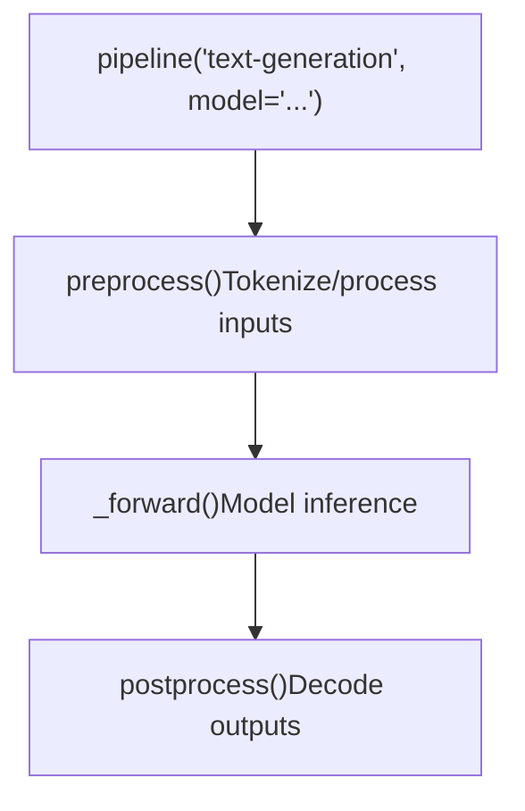

# 核心架构 (Core Architecture)

相关源文件 (Relevant source files)

-   [docs/source/en/\_toctree.yml](https://github.com/huggingface/transformers/blob/9a9997fd/docs/source/en/_toctree.yml)
-   [docs/source/en/index.md](https://github.com/huggingface/transformers/blob/9a9997fd/docs/source/en/index.md?plain=1)
-   [docs/source/en/main\_classes/quantization.md](https://github.com/huggingface/transformers/blob/9a9997fd/docs/source/en/main_classes/quantization.md?plain=1)
-   [docs/source/en/quantization/overview.md](https://github.com/huggingface/transformers/blob/9a9997fd/docs/source/en/quantization/overview.md?plain=1)
-   [setup.py](https://github.com/huggingface/transformers/blob/9a9997fd/setup.py)
-   [src/transformers/\_\_init\_\_.py](https://github.com/huggingface/transformers/blob/9a9997fd/src/transformers/__init__.py)
-   [src/transformers/conversion\_mapping.py](https://github.com/huggingface/transformers/blob/9a9997fd/src/transformers/conversion_mapping.py)
-   [src/transformers/core\_model\_loading.py](https://github.com/huggingface/transformers/blob/9a9997fd/src/transformers/core_model_loading.py)
-   [src/transformers/dependency\_versions\_table.py](https://github.com/huggingface/transformers/blob/9a9997fd/src/transformers/dependency_versions_table.py)
-   [src/transformers/integrations/\_\_init\_\_.py](https://github.com/huggingface/transformers/blob/9a9997fd/src/transformers/integrations/__init__.py)
-   [src/transformers/integrations/accelerate.py](https://github.com/huggingface/transformers/blob/9a9997fd/src/transformers/integrations/accelerate.py)
-   [src/transformers/integrations/peft.py](https://github.com/huggingface/transformers/blob/9a9997fd/src/transformers/integrations/peft.py)
-   [src/transformers/modeling\_utils.py](https://github.com/huggingface/transformers/blob/9a9997fd/src/transformers/modeling_utils.py)
-   [src/transformers/models/\_\_init\_\_.py](https://github.com/huggingface/transformers/blob/9a9997fd/src/transformers/models/__init__.py)
-   [src/transformers/models/auto/configuration\_auto.py](https://github.com/huggingface/transformers/blob/9a9997fd/src/transformers/models/auto/configuration_auto.py)
-   [src/transformers/models/auto/feature\_extraction\_auto.py](https://github.com/huggingface/transformers/blob/9a9997fd/src/transformers/models/auto/feature_extraction_auto.py)
-   [src/transformers/models/auto/image\_processing\_auto.py](https://github.com/huggingface/transformers/blob/9a9997fd/src/transformers/models/auto/image_processing_auto.py)
-   [src/transformers/models/auto/modeling\_auto.py](https://github.com/huggingface/transformers/blob/9a9997fd/src/transformers/models/auto/modeling_auto.py)
-   [src/transformers/models/auto/processing\_auto.py](https://github.com/huggingface/transformers/blob/9a9997fd/src/transformers/models/auto/processing_auto.py)
-   [src/transformers/models/auto/tokenization\_auto.py](https://github.com/huggingface/transformers/blob/9a9997fd/src/transformers/models/auto/tokenization_auto.py)
-   [src/transformers/quantizers/auto.py](https://github.com/huggingface/transformers/blob/9a9997fd/src/transformers/quantizers/auto.py)
-   [src/transformers/testing\_utils.py](https://github.com/huggingface/transformers/blob/9a9997fd/src/transformers/testing_utils.py)
-   [src/transformers/trainer.py](https://github.com/huggingface/transformers/blob/9a9997fd/src/transformers/trainer.py)
-   [src/transformers/trainer\_utils.py](https://github.com/huggingface/transformers/blob/9a9997fd/src/transformers/trainer_utils.py)
-   [src/transformers/training\_args.py](https://github.com/huggingface/transformers/blob/9a9997fd/src/transformers/training_args.py)
-   [src/transformers/utils/\_\_init\_\_.py](https://github.com/huggingface/transformers/blob/9a9997fd/src/transformers/utils/__init__.py)
-   [src/transformers/utils/dummy\_pt\_objects.py](https://github.com/huggingface/transformers/blob/9a9997fd/src/transformers/utils/dummy_pt_objects.py)
-   [src/transformers/utils/import\_utils.py](https://github.com/huggingface/transformers/blob/9a9997fd/src/transformers/utils/import_utils.py)
-   [src/transformers/utils/loading\_report.py](https://github.com/huggingface/transformers/blob/9a9997fd/src/transformers/utils/loading_report.py)
-   [src/transformers/utils/quantization\_config.py](https://github.com/huggingface/transformers/blob/9a9997fd/src/transformers/utils/quantization_config.py)
-   [tests/peft\_integration/test\_peft\_integration.py](https://github.com/huggingface/transformers/blob/9a9997fd/tests/peft_integration/test_peft_integration.py)
-   [tests/test\_modeling\_common.py](https://github.com/huggingface/transformers/blob/9a9997fd/tests/test_modeling_common.py)
-   [tests/trainer/test\_trainer.py](https://github.com/huggingface/transformers/blob/9a9997fd/tests/trainer/test_trainer.py)
-   [tests/utils/test\_core\_model\_loading.py](https://github.com/huggingface/transformers/blob/9a9997fd/tests/utils/test_core_model_loading.py)
-   [tests/utils/test\_modeling\_utils.py](https://github.com/huggingface/transformers/blob/9a9997fd/tests/utils/test_modeling_utils.py)
-   [utils/check\_config\_attributes.py](https://github.com/huggingface/transformers/blob/9a9997fd/utils/check_config_attributes.py)
-   [utils/check\_repo.py](https://github.com/huggingface/transformers/blob/9a9997fd/utils/check_repo.py)

## 目的与范围 (Purpose and Scope)

本文档解释了 Transformers 库的基础架构：用于模型发现 (Model Discovery) 的自动类 (Auto classes) 系统、模型加载基础设施、分词 (Tokenization) 抽象、多模态处理 (Multi-modal processing)、Pipeline API 以及 Hub 集成。这些组件构成了用户实例化模型并与之交互的接口，实现了对文本、视觉、音频和多模态领域 400 多种模型架构的统一访问。

有关特定子系统的详细信息：

-   模型发现和自动类 (Model discovery and Auto classes)：参见 [自动类与模型发现 (Auto Classes and Model Discovery)](/huggingface/transformers/2.1-auto-classes-and-model-discovery)
-   权重加载和状态管理 (Weight loading and state management)：参见 [模型加载与权重管理 (Model Loading and Weight Management)](/huggingface/transformers/2.2-model-loading-and-weight-management)
-   分词详情 (Tokenization details)：参见 [分词系统 (Tokenization System)](/huggingface/transformers/2.3-tokenization-system)
-   图像/音频/视频处理 (Image/audio/video processing)：参见 [多模态处理 (Multi-Modal Processing)](/huggingface/transformers/2.4-multi-modal-processing)
-   高级推理 API (High-level inference API)：参见 [Pipeline API](/huggingface/transformers/2.5-pipeline-api)
-   Hub 下载和 trust\_remote\_code：参见 [Hub 集成与远程代码 (Hub Integration and Remote Code)](/huggingface/transformers/2.6-hub-integration-and-remote-code)

---

## 系统概览 (System Overview)

核心架构被组织成几个相互连接的层，抽象掉了特定于模型的复杂性：

### 架构层级 (Architecture Hierarchy)

**来源 (Sources)：**

-   [src/transformers/modeling\_utils.py1-500](https://github.com/huggingface/transformers/blob/9a9997fd/src/transformers/modeling_utils.py#L1-L500)
-   [src/transformers/models/auto/modeling\_auto.py1-100](https://github.com/huggingface/transformers/blob/9a9997fd/src/transformers/models/auto/modeling_auto.py#L1-L100)
-   [src/transformers/models/auto/configuration\_auto.py1-100](https://github.com/huggingface/transformers/blob/9a9997fd/src/transformers/models/auto/configuration_auto.py#L1-L100)
-   [src/transformers/models/auto/tokenization\_auto.py1-100](https://github.com/huggingface/transformers/blob/9a9997fd/src/transformers/models/auto/tokenization_auto.py#L1-L100)

---

## 自动类与模型注册表 (Auto Classes and Model Registry)

自动类 (Auto classes) 系统提供了一个统一的接口，用于实例化模型、配置 (Configs) 和分词器 (Tokenizers)，而无需用户了解具体的实现类。该系统建立在映射字典和延迟加载 (Lazy loading) 机制之上。

### 注册表架构 (Registry Architecture)

`_LazyAutoMapping` 类将导入延迟到请求特定模型时，从而避免在库初始化时导入所有模型实现 [src/transformers/models/auto/auto\_factory.py24](https://github.com/huggingface/transformers/blob/9a9997fd/src/transformers/models/auto/auto_factory.py#L24-L24) 当调用 `AutoModel.from_pretrained()` 时，会在 `MODEL_MAPPING_NAMES` 中查找 `model_type` [src/transformers/models/auto/modeling\_auto.py41](https://github.com/huggingface/transformers/blob/9a9997fd/src/transformers/models/auto/modeling_auto.py#L41-L41)

**来源 (Sources)：**

-   [src/transformers/models/auto/auto\_factory.py21-26](https://github.com/huggingface/transformers/blob/9a9997fd/src/transformers/models/auto/auto_factory.py#L21-L26)
-   [src/transformers/models/auto/modeling\_auto.py41-186](https://github.com/huggingface/transformers/blob/9a9997fd/src/transformers/models/auto/modeling_auto.py#L41-L186)
-   [src/transformers/models/auto/configuration\_auto.py27-100](https://github.com/huggingface/transformers/blob/9a9997fd/src/transformers/models/auto/configuration_auto.py#L27-L100)

---

## PreTrainedModel 基类 (PreTrainedModel Base Class)

所有模型实现都继承自 `PreTrainedModel`，它提供了通用的 `from_pretrained()` 方法和权重管理功能 [src/transformers/modeling\_utils.py75](https://github.com/huggingface/transformers/blob/9a9997fd/src/transformers/modeling_utils.py#L75-L75)

### 模型加载流程 (Model Loading Flow)

**关键组件 (Key Components)：**

| 组件 (Component) | 位置 (Location) | 目的 (Purpose) |
| --- | --- | --- |
| `PreTrainedModel` | [src/transformers/modeling\_utils.py75](https://github.com/huggingface/transformers/blob/9a9997fd/src/transformers/modeling_utils.py#L75-L75) | 所有 PyTorch 模型的基类 |
| `LoadStateDictConfig` | [src/transformers/modeling\_utils.py161-185](https://github.com/huggingface/transformers/blob/9a9997fd/src/transformers/modeling_utils.py#L161-L185) | 加载权重 (Weight loading) 的配置（量化、device\_map 等） |
| `WeightConverter` | [src/transformers/core\_model\_loading.py48](https://github.com/huggingface/transformers/blob/9a9997fd/src/transformers/core_model_loading.py#L48-L48) | 用于转换检查点格式 (Checkpoint formats) 的基础设施 |
| `HfQuantizer` | [src/transformers/quantizers/auto.py94](https://github.com/huggingface/transformers/blob/9a9997fd/src/transformers/quantizers/auto.py#L94-L94) | 处理加载过程中的量化逻辑 |

**来源 (Sources)：**

-   [src/transformers/modeling\_utils.py161-185](https://github.com/huggingface/transformers/blob/9a9997fd/src/transformers/modeling_utils.py#L161-L185)
-   [src/transformers/core\_model\_loading.py47-52](https://github.com/huggingface/transformers/blob/9a9997fd/src/transformers/core_model_loading.py#L47-L52)
-   [src/transformers/modeling\_utils.py2500-3500](https://github.com/huggingface/transformers/blob/9a9997fd/src/transformers/modeling_utils.py#L2500-L3500)

---

## 分词架构 (Tokenization Architecture)

分词 (Tokenization) 通过分层抽象处理，支持纯 Python 和高性能 Rust 后端。

### 分词器层级 (Tokenizer Hierarchy)

**来源 (Sources)：**

-   [src/transformers/tokenization\_utils\_base.py183-189](https://github.com/huggingface/transformers/blob/9a9997fd/src/transformers/tokenization_utils_base.py#L183-L189)
-   [src/transformers/tokenization\_python.py181](https://github.com/huggingface/transformers/blob/9a9997fd/src/transformers/tokenization_python.py#L181-L181)

---

## 多模态处理 (Multi-Modal Processing)

该库使用 `ProcessorMixin` 来协调多模态模型的多个预处理器 (Preprocessors)（例如，一个分词器和一个图像处理器） [src/transformers/processing\_utils.py175](https://github.com/huggingface/transformers/blob/9a9997fd/src/transformers/processing_utils.py#L175-L175)

| 组件 (Component) | 目的 (Purpose) | 基类 (Base Class) |
| --- | --- | --- |
| 图像处理 (Image Processing) | 视觉转换 | `BaseImageProcessor` [src/transformers/image\_processing\_utils.py61](https://github.com/huggingface/transformers/blob/9a9997fd/src/transformers/image_processing_utils.py#L61-L61) |
| 音频处理 (Audio Processing) | 特征提取 (Feature extraction) | `SequenceFeatureExtractor` [src/transformers/feature\_extraction\_sequence\_utils.py108](https://github.com/huggingface/transformers/blob/9a9997fd/src/transformers/feature_extraction_sequence_utils.py#L108-L108) |
| 统一处理器 (Unified Processor) | 多模态协调 | `ProcessorMixin` [src/transformers/processing\_utils.py175](https://github.com/huggingface/transformers/blob/9a9997fd/src/transformers/processing_utils.py#L175-L175) |

**来源 (Sources)：**

-   [src/transformers/processing\_utils.py171-178](https://github.com/huggingface/transformers/blob/9a9997fd/src/transformers/processing_utils.py#L171-L178)
-   [src/transformers/image\_processing\_utils.py61](https://github.com/huggingface/transformers/blob/9a9997fd/src/transformers/image_processing_utils.py#L61-L61)
-   [src/transformers/feature\_extraction\_sequence\_utils.py108](https://github.com/huggingface/transformers/blob/9a9997fd/src/transformers/feature_extraction_sequence_utils.py#L108-L108)

---

## Pipeline API

`pipeline()` 函数提供了最高级别的抽象，将模型加载、预处理、推理和后处理包装在一个调用中 [src/transformers/pipelines/\_\_init\_\_.py169](https://github.com/huggingface/transformers/blob/9a9997fd/src/transformers/pipelines/__init__.py#L169-L169)

### Pipeline 执行 (Pipeline Execution)

**来源 (Sources)：**

-   [src/transformers/pipelines/\_\_init\_\_.py138-170](https://github.com/huggingface/transformers/blob/9a9997fd/src/transformers/pipelines/__init__.py#L138-L170)

---

## Hub 集成与缓存 (Hub Integration and Caching)

所有加载操作都通过 `huggingface_hub` 与 Hugging Face Hub 集成，用于下载和缓存 [src/transformers/utils/hub.py122](https://github.com/huggingface/transformers/blob/9a9997fd/src/transformers/utils/hub.py#L122-L122)

-   **缓存 (Caching)**：模型本地存储在 `~/.cache/huggingface/hub`。
-   **Safetensors**：该库优先使用 `.safetensors` 文件，以实现安全、零拷贝 (Zero-copy) 的加载 [src/transformers/modeling\_utils.py102](https://github.com/huggingface/transformers/blob/9a9997fd/src/transformers/modeling_utils.py#L102-L102)
-   **远程代码 (Remote Code)**：用户可以通过 `trust_remote_code=True` 加载自定义建模代码。

**来源 (Sources)：**

-   [src/transformers/modeling\_utils.py98-120](https://github.com/huggingface/transformers/blob/9a9997fd/src/transformers/modeling_utils.py#L98-L120)
-   [src/transformers/utils/hub.py122](https://github.com/huggingface/transformers/blob/9a9997fd/src/transformers/utils/hub.py#L122-L122)

---

## 总结 (Summary)

核心架构提供了一个分层抽象系统：

1.  **自动类 (Auto Classes)** 通过基于注册表的分发 (Dispatch) 实现与模型无关的代码。
2.  **PreTrainedModel** 提供通用的加载和权重管理。
3.  **分词 (Tokenization)** 和 **处理器 (Processors)** 处理特定于模态的数据准备。
4.  **Pipelines** 为特定任务包装整个推理循环。
5.  **Hub 集成 (Hub Integration)** 实现了无缝的模型发现和分发。

有关每个子系统的实现细节，请参阅相应的子页面（从 [自动类与模型发现 (Auto Classes and Model Discovery)](/huggingface/transformers/2.1-auto-classes-and-model-discovery) 到 [Hub 集成与远程代码 (Hub Integration and Remote Code)](/huggingface/transformers/2.6-hub-integration-and-remote-code)）。
