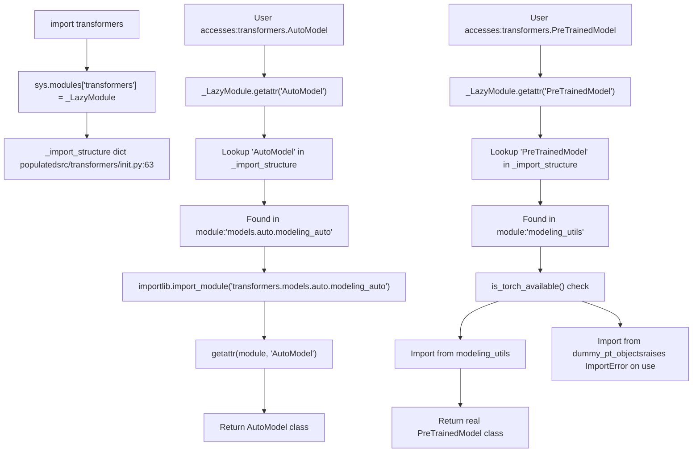
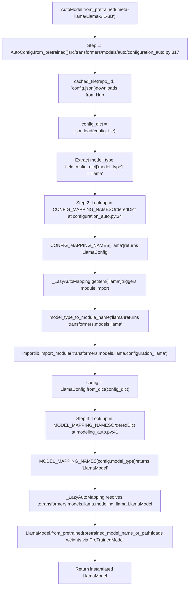
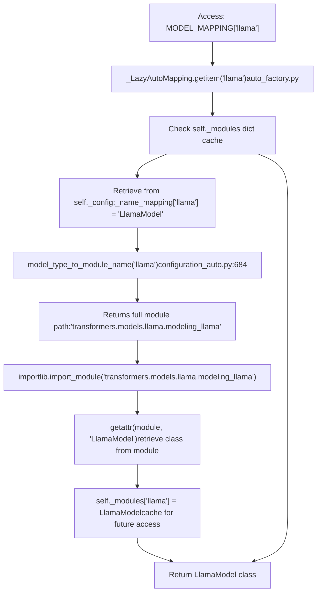
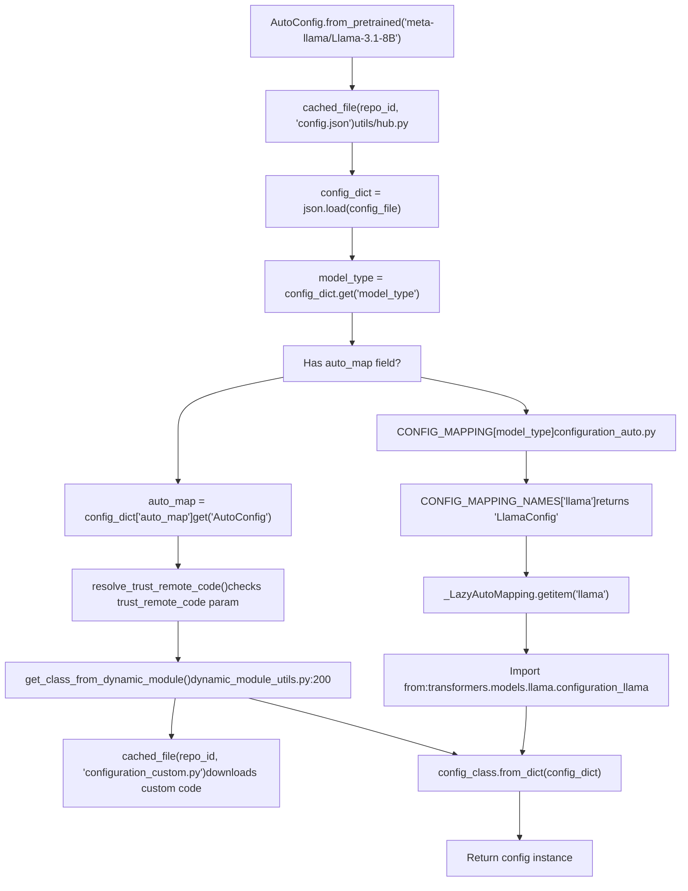
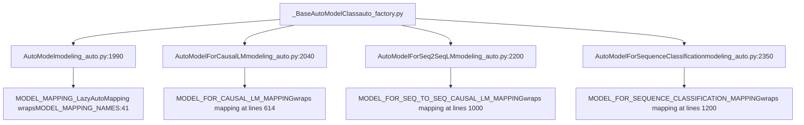
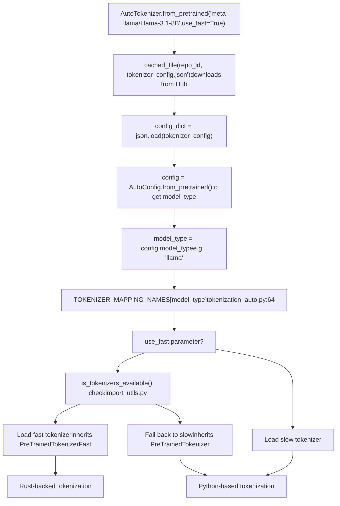
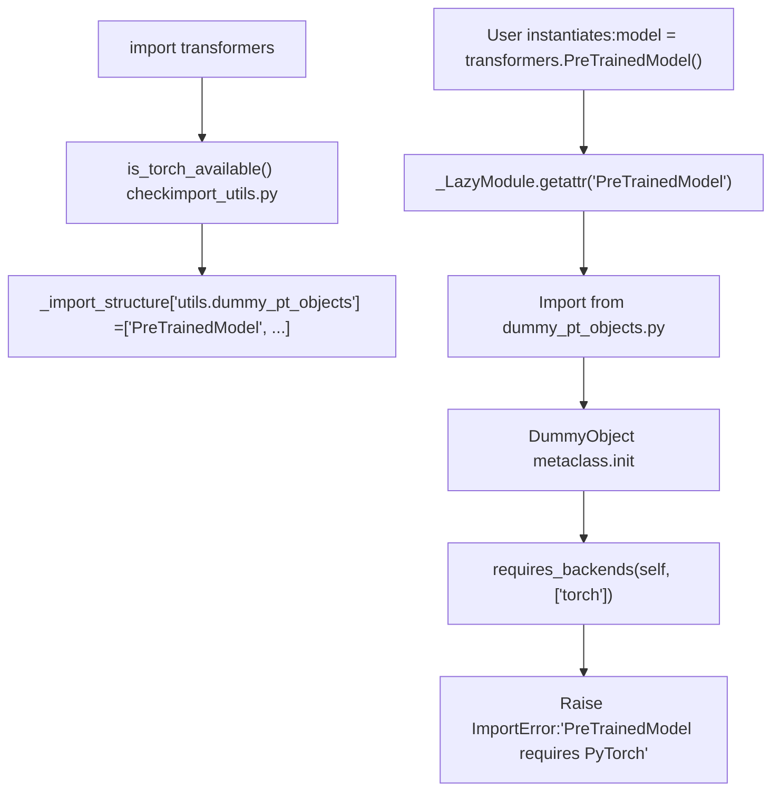

# 自动类与模型发现 (Auto Classes and Model Discovery)

相关源文件 (Relevant source files)

-   [docs/source/en/\_toctree.yml](https://github.com/huggingface/transformers/blob/9a9997fd/docs/source/en/_toctree.yml)
-   [docs/source/en/index.md](https://github.com/huggingface/transformers/blob/9a9997fd/docs/source/en/index.md?plain=1)
-   [docs/source/en/main\_classes/pipelines.md](https://github.com/huggingface/transformers/blob/9a9997fd/docs/source/en/main_classes/pipelines.md?plain=1)
-   [docs/source/en/model\_doc/auto.md](https://github.com/huggingface/transformers/blob/9a9997fd/docs/source/en/model_doc/auto.md?plain=1)
-   [docs/source/ja/model\_doc/auto.md](https://github.com/huggingface/transformers/blob/9a9997fd/docs/source/ja/model_doc/auto.md?plain=1)
-   [docs/source/ko/model\_doc/auto.md](https://github.com/huggingface/transformers/blob/9a9997fd/docs/source/ko/model_doc/auto.md?plain=1)
-   [src/transformers/\_\_init\_\_.py](https://github.com/huggingface/transformers/blob/9a9997fd/src/transformers/__init__.py)
-   [src/transformers/dynamic\_module\_utils.py](https://github.com/huggingface/transformers/blob/9a9997fd/src/transformers/dynamic_module_utils.py)
-   [src/transformers/models/\_\_init\_\_.py](https://github.com/huggingface/transformers/blob/9a9997fd/src/transformers/models/__init__.py)
-   [src/transformers/models/audio\_spectrogram\_transformer/\_\_init\_\_.py](https://github.com/huggingface/transformers/blob/9a9997fd/src/transformers/models/audio_spectrogram_transformer/__init__.py)
-   [src/transformers/models/audio\_spectrogram\_transformer/configuration\_audio\_spectrogram\_transformer.py](https://github.com/huggingface/transformers/blob/9a9997fd/src/transformers/models/audio_spectrogram_transformer/configuration_audio_spectrogram_transformer.py)
-   [src/transformers/models/auto/\_\_init\_\_.py](https://github.com/huggingface/transformers/blob/9a9997fd/src/transformers/models/auto/__init__.py)
-   [src/transformers/models/auto/auto\_factory.py](https://github.com/huggingface/transformers/blob/9a9997fd/src/transformers/models/auto/auto_factory.py)
-   [src/transformers/models/auto/configuration\_auto.py](https://github.com/huggingface/transformers/blob/9a9997fd/src/transformers/models/auto/configuration_auto.py)
-   [src/transformers/models/auto/feature\_extraction\_auto.py](https://github.com/huggingface/transformers/blob/9a9997fd/src/transformers/models/auto/feature_extraction_auto.py)
-   [src/transformers/models/auto/image\_processing\_auto.py](https://github.com/huggingface/transformers/blob/9a9997fd/src/transformers/models/auto/image_processing_auto.py)
-   [src/transformers/models/auto/modeling\_auto.py](https://github.com/huggingface/transformers/blob/9a9997fd/src/transformers/models/auto/modeling_auto.py)
-   [src/transformers/models/auto/processing\_auto.py](https://github.com/huggingface/transformers/blob/9a9997fd/src/transformers/models/auto/processing_auto.py)
-   [src/transformers/models/auto/tokenization\_auto.py](https://github.com/huggingface/transformers/blob/9a9997fd/src/transformers/models/auto/tokenization_auto.py)
-   [src/transformers/models/bark/\_\_init\_\_.py](https://github.com/huggingface/transformers/blob/9a9997fd/src/transformers/models/bark/__init__.py)
-   [src/transformers/models/bark/configuration\_bark.py](https://github.com/huggingface/transformers/blob/9a9997fd/src/transformers/models/bark/configuration_bark.py)
-   [src/transformers/models/bart/\_\_init\_\_.py](https://github.com/huggingface/transformers/blob/9a9997fd/src/transformers/models/bart/__init__.py)
-   [src/transformers/models/efficientnet/modeling\_efficientnet.py](https://github.com/huggingface/transformers/blob/9a9997fd/src/transformers/models/efficientnet/modeling_efficientnet.py)
-   [src/transformers/models/speech\_to\_text/\_\_init\_\_.py](https://github.com/huggingface/transformers/blob/9a9997fd/src/transformers/models/speech_to_text/__init__.py)
-   [src/transformers/pipelines/\_\_init\_\_.py](https://github.com/huggingface/transformers/blob/9a9997fd/src/transformers/pipelines/__init__.py)
-   [src/transformers/pipelines/base.py](https://github.com/huggingface/transformers/blob/9a9997fd/src/transformers/pipelines/base.py)
-   [src/transformers/pipelines/fill\_mask.py](https://github.com/huggingface/transformers/blob/9a9997fd/src/transformers/pipelines/fill_mask.py)
-   [src/transformers/utils/dummy\_pt\_objects.py](https://github.com/huggingface/transformers/blob/9a9997fd/src/transformers/utils/dummy_pt_objects.py)
-   [tests/models/auto/test\_modeling\_auto.py](https://github.com/huggingface/transformers/blob/9a9997fd/tests/models/auto/test_modeling_auto.py)
-   [tests/models/efficientnet/test\_modeling\_efficientnet.py](https://github.com/huggingface/transformers/blob/9a9997fd/tests/models/efficientnet/test_modeling_efficientnet.py)
-   [tests/models/markuplm/test\_modeling\_markuplm.py](https://github.com/huggingface/transformers/blob/9a9997fd/tests/models/markuplm/test_modeling_markuplm.py)
-   [tests/pipelines/test\_pipelines\_common.py](https://github.com/huggingface/transformers/blob/9a9997fd/tests/pipelines/test_pipelines_common.py)
-   [tests/pipelines/test\_pipelines\_fill\_mask.py](https://github.com/huggingface/transformers/blob/9a9997fd/tests/pipelines/test_pipelines_fill_mask.py)
-   [tests/test\_pipeline\_mixin.py](https://github.com/huggingface/transformers/blob/9a9997fd/tests/test_pipeline_mixin.py)
-   [tests/utils/tiny\_model\_summary.json](https://github.com/huggingface/transformers/blob/9a9997fd/tests/utils/tiny_model_summary.json)
-   [utils/check\_repo.py](https://github.com/huggingface/transformers/blob/9a9997fd/utils/check_repo.py)
-   [utils/create\_dummy\_models.py](https://github.com/huggingface/transformers/blob/9a9997fd/utils/create_dummy_models.py)
-   [utils/custom\_init\_isort.py](https://github.com/huggingface/transformers/blob/9a9997fd/utils/custom_init_isort.py)
-   [utils/get\_test\_info.py](https://github.com/huggingface/transformers/blob/9a9997fd/utils/get_test_info.py)
-   [utils/update\_metadata.py](https://github.com/huggingface/transformers/blob/9a9997fd/utils/update_metadata.py)

## 概览 (Overview)

本页记录了在 Transformers 库中实现模型、分词器和处理器动态加载的自动类 (Auto class) 系统。自动类提供了一个统一的接口，只需使用一个 API 即可加载 230 多种模型架构：给定一个模型标识符，如 `"meta-llama/Llama-3.1-8B"`，系统会自动确定要实例化的正确实现类。

**核心自动类 (Core Auto classes)：**

-   `AutoConfig` - 加载配置类 (Configuration classes)（`LlamaConfig`、`BertConfig` 等）[src/transformers/models/auto/configuration\_auto.py:41]
-   `AutoModel` - 加载基础模型类 (Base model classes)（`LlamaModel`、`BertModel` 等）[src/transformers/models/auto/modeling\_auto.py:1990]
-   `AutoModelForCausalLM` - 加载特定任务的模型 (`LlamaForCausalLM` 等）[src/transformers/models/auto/modeling\_auto.py:2040]
-   `AutoTokenizer` - 加载带有快速/慢速后端 (Fast/slow backend) 选择的分词器 [src/transformers/models/auto/tokenization\_auto.py:14]
-   `AutoProcessor` - 加载结合了分词器和图像/音频处理器的多模态处理器 [src/transformers/models/auto/processing\_auto.py:14]
-   `AutoImageProcessor` - 加载视觉预处理组件 [src/transformers/models/auto/image\_processing\_auto.py:14]
-   `AutoFeatureExtractor` - 加载音频预处理组件 [src/transformers/models/auto/feature\_extraction\_auto.py:14]

**发现机制 (Discovery mechanism)：**

该系统使用映射字典（`CONFIG_MAPPING_NAMES`、`MODEL_MAPPING_NAMES` 等），将模型类型字符串（例如 `"llama"`、`"bert"`）映射到类名。`_LazyAutoMapping` 包装器实现了按需导入，在支持数百种架构的同时保持库初始化快速 [src/transformers/models/auto/auto\_factory.py:24]。

## 延迟加载系统 (Lazy Loading System)

该库初始化为一个 `_LazyModule` 实例，它将导入延迟到访问属性时。这使得 `import transformers` 在约 50ms 内完成，而不是几秒钟 [src/transformers/utils/**init**.py:33]。

**延迟模块初始化流程 (Lazy Module Initialization Flow)**


**\_import\_structure 字典结构 (Dictionary Structure)**

[src/transformers/\_\_init\_\_.py63-264](https://github.com/huggingface/transformers/blob/9a9997fd/src/transformers/__init__.py#L63-L264) 处的字典将模块名称映射到可导出对象：

```
_import_structure = {    "configuration_utils": ["PreTrainedConfig", "PretrainedConfig"],    "modeling_utils": ["PreTrainedModel", "AttentionInterface"],    "tokenization_utils_base": ["PreTrainedTokenizerBase", "BatchEncoding"],    "generation": ["GenerationConfig", "GenerationMixin", "LogitsProcessor", ...],    # 230+ model modules dynamically added based on dependencies}
```
来源 (Sources)：[src/transformers/\_\_init\_\_.py63-264](https://github.com/huggingface/transformers/blob/9a9997fd/src/transformers/__init__.py#L63-L264) [src/transformers/utils/\_\_init\_\_.py33](https://github.com/huggingface/transformers/blob/9a9997fd/src/transformers/utils/__init__.py#L33-L33)

## 自动类解析架构 (Auto Class Resolution Architecture)

自动类 (Auto classes) 实现了 `from_pretrained` 工厂模式，通过映射字典将模型标识符解析为具体的实现类。

**自动类模型发现与实例化流程 (Auto Class Model Discovery and Instantiation Flow)**


**自动类映射字典 (Auto Class Mapping Dictionaries)**

| 自动类 (Auto Class) | 映射字典 (Mapping Dictionary) | 位置 (Location) | 映射到 (Maps to) |
| --- | --- | --- | --- |
| `AutoConfig` | `CONFIG_MAPPING_NAMES` | [src/transformers/models/auto/configuration\_auto.py34-456](https://github.com/huggingface/transformers/blob/9a9997fd/src/transformers/models/auto/configuration_auto.py#L34-L456) | `"model_type" → "ConfigClass"` |
| `AutoModel` | `MODEL_MAPPING_NAMES` | [src/transformers/models/auto/modeling\_auto.py41-437](https://github.com/huggingface/transformers/blob/9a9997fd/src/transformers/models/auto/modeling_auto.py#L41-L437) | `"model_type" → "BaseModelClass"` |
| `AutoModelForCausalLM` | `MODEL_FOR_CAUSAL_LM_MAPPING_NAMES` | [src/transformers/models/auto/modeling\_auto.py614-800](https://github.com/huggingface/transformers/blob/9a9997fd/src/transformers/models/auto/modeling_auto.py#L614-L800) | `"model_type" → "ModelForCausalLM"` |
| `AutoTokenizer` | `TOKENIZER_MAPPING_NAMES` | [src/transformers/models/auto/tokenization\_auto.py64-300](https://github.com/huggingface/transformers/blob/9a9997fd/src/transformers/models/auto/tokenization_auto.py#L64-L300) | `"model_type" → "TokenizerClass"` |
| `AutoImageProcessor` | `IMAGE_PROCESSOR_MAPPING_NAMES` | [src/transformers/models/auto/image\_processing\_auto.py62-214](https://github.com/huggingface/transformers/blob/9a9997fd/src/transformers/models/auto/image_processing_auto.py#L62-L214) | `"model_type" → ("SlowClass", "FastClass")` |

来源 (Sources)：[src/transformers/models/auto/configuration\_auto.py34-456](https://github.com/huggingface/transformers/blob/9a9997fd/src/transformers/models/auto/configuration_auto.py#L34-L456) [src/transformers/models/auto/modeling\_auto.py41-437](https://github.com/huggingface/transformers/blob/9a9997fd/src/transformers/models/auto/modeling_auto.py#L41-L437) [src/transformers/models/auto/tokenization\_auto.py64-300](https://github.com/huggingface/transformers/blob/9a9997fd/src/transformers/models/auto/tokenization_auto.py#L64-L300)

## \_LazyAutoMapping 解析系统 (Resolution System)

[src/transformers/models/auto/auto\_factory.py400-550](https://github.com/huggingface/transformers/blob/9a9997fd/src/transformers/models/auto/auto_factory.py#L400-L550) 处的 `_LazyAutoMapping` 类（在 [src/transformers/models/auto/modeling\_auto.py24](https://github.com/huggingface/transformers/blob/9a9997fd/src/transformers/models/auto/modeling_auto.py#L24-L24) 中引用）包装了 `OrderedDict` 映射，以将类导入延迟到访问时间。

**带有缓存的 \_LazyAutoMapping 解析 (Resolution with Caching)**


`_LazyAutoMapping` 提供了类似字典的访问，同时通过 [src/transformers/models/auto/configuration\_auto.py43](https://github.com/huggingface/transformers/blob/9a9997fd/src/transformers/models/auto/configuration_auto.py#L43-L43) 处的 `model_type_to_module_name()` 延迟导入，该函数将 `"llama"` 转换为 `"transformers.models.llama"`。

来源 (Sources)：[src/transformers/models/auto/auto\_factory.py24](https://github.com/huggingface/transformers/blob/9a9997fd/src/transformers/models/auto/auto_factory.py#L24-L24) [src/transformers/models/auto/configuration\_auto.py34-456](https://github.com/huggingface/transformers/blob/9a9997fd/src/transformers/models/auto/configuration_auto.py#L34-L456) [src/transformers/models/auto/modeling\_auto.py41-437](https://github.com/huggingface/transformers/blob/9a9997fd/src/transformers/models/auto/modeling_auto.py#L41-L437)

## AutoConfig.from\_pretrained 实现 (Implementation)

`AutoConfig.from_pretrained()` 方法实现了配置加载工作流，处理标准模型和自定义模型 [src/transformers/models/auto/configuration\_auto.py:817]。

**AutoConfig 解析：标准模型 vs 自定义模型 (Standard vs Custom Models)**


`model_type` 字段决定了配置类 [src/transformers/models/auto/configuration\_auto.py:34]。对于设置了 `trust_remote_code=True` 的自定义模型，`config.json` 中的 `auto_map` 字段指定了自定义类 [src/transformers/dynamic\_module\_utils.py:24]。

来源 (Sources)：[src/transformers/models/auto/configuration\_auto.py817](https://github.com/huggingface/transformers/blob/9a9997fd/src/transformers/models/auto/configuration_auto.py#L817-L817) [src/transformers/dynamic\_module\_utils.py200](https://github.com/huggingface/transformers/blob/9a9997fd/src/transformers/dynamic_module_utils.py#L200-L200) [src/transformers/models/auto/configuration\_auto.py34-456](https://github.com/huggingface/transformers/blob/9a9997fd/src/transformers/models/auto/configuration_auto.py#L34-L456)

## 特定任务的自动模型类 (Task-Specific Auto Model Classes)

该库提供了特定任务的自动类 (Auto classes)，它们共享基础工厂模式，但使用不同的映射字典。

**特定任务的自动类与映射字典 (Task-Specific Auto Classes and Mapping Dictionaries)**


**映射字典定义 (Mapping Dictionary Definitions)**

在 [src/transformers/models/auto/modeling\_auto.py41-437](https://github.com/huggingface/transformers/blob/9a9997fd/src/transformers/models/auto/modeling_auto.py#L41-L437) 处，用于基础模型：

```
MODEL_MAPPING_NAMES = OrderedDict([    ("llama", "LlamaModel"),    ("bert", "BertModel"),    ("bart", "BartModel"),])
```
在 [src/transformers/models/auto/modeling\_auto.py614-750](https://github.com/huggingface/transformers/blob/9a9997fd/src/transformers/models/auto/modeling_auto.py#L614-L750) 处，用于因果语言模型 (Causal LM)：

```
MODEL_FOR_CAUSAL_LM_MAPPING_NAMES = OrderedDict([    ("llama", "LlamaForCausalLM"),    ("mistral", "MistralForCausalLM"),    ("gpt2", "GPT2LMHeadModel"),])
```
来源 (Sources)：[src/transformers/models/auto/modeling\_auto.py41-2040](https://github.com/huggingface/transformers/blob/9a9997fd/src/transformers/models/auto/modeling_auto.py#L41-L2040) [src/transformers/models/auto/auto\_factory.py23](https://github.com/huggingface/transformers/blob/9a9997fd/src/transformers/models/auto/auto_factory.py#L23-L23)

## AutoTokenizer 快速/慢速解析 (AutoTokenizer Fast/Slow Resolution)

`AutoTokenizer.from_pretrained()` 实现了带有快速/慢速后端 (Fast/slow backend) 选择的分词器加载逻辑 [src/transformers/models/auto/tokenization\_auto.py:14]。

**AutoTokenizer 快速/慢速后端解析 (Fast/Slow Backend Resolution)**


**分词器映射 (Tokenizer Mapping)**

在 [src/transformers/models/auto/tokenization\_auto.py64-300](https://github.com/huggingface/transformers/blob/9a9997fd/src/transformers/models/auto/tokenization_auto.py#L64-L300) 处：

```
TOKENIZER_MAPPING_NAMES = OrderedDict([    ("llama", "LlamaTokenizer" if is_tokenizers_available() else None),    ("bert", "BertTokenizer" if is_tokenizers_available() else None),    ("gpt2", "GPT2Tokenizer" if is_tokenizers_available() else None),])
```
快速分词器 (Fast tokenizers) 使用 `tokenizers` 库（导入为 `TokenizersBackend` [src/transformers/models/auto/tokenization\_auto.py:49]）以提高性能。

来源 (Sources)：[src/transformers/models/auto/tokenization\_auto.py49-300](https://github.com/huggingface/transformers/blob/9a9997fd/src/transformers/models/auto/tokenization_auto.py#L49-L300) [src/transformers/utils/import\_utils.py51](https://github.com/huggingface/transformers/blob/9a9997fd/src/transformers/utils/import_utils.py#L51-L51)

## 多模态处理与后端 (Multi-Modal Processing and Backends)

该库为非文本模态提供了 `AutoProcessor`、`AutoImageProcessor` 和 `AutoFeatureExtractor`。

-   **AutoProcessor**：组合多个组件（例如，`CLIPProcessor` 使用一个分词器和一个图像处理器）[src/transformers/models/auto/processing\_auto.py:14]。
-   **AutoImageProcessor**：处理视觉预处理，在 PIL 和 torchvision 后端之间进行选择 [src/transformers/models/auto/image\_processing\_auto.py:14]。
-   **AutoFeatureExtractor**：处理音频预处理 [src/transformers/models/auto/feature\_extraction\_auto.py:14]。

**视觉后端选择 (Backend Selection for Vision)**

在 [src/transformers/models/auto/image\_processing\_auto.py50-55](https://github.com/huggingface/transformers/blob/9a9997fd/src/transformers/models/auto/image_processing_auto.py#L50-L55) 处，特定处理器默认使用 PIL 后端，以避免输出差异：

```
DEFAULT_TO_PIL_BACKEND_IMAGE_PROCESSORS = [    "ChameleonImageProcessor",    "FlavaImageProcessor",    "Idefics3ImageProcessor",    "SmolVLMImageProcessor",]
```
来源 (Sources)：[src/transformers/models/auto/image\_processing\_auto.py50](https://github.com/huggingface/transformers/blob/9a9997fd/src/transformers/models/auto/image_processing_auto.py#L50-L50) [src/transformers/models/auto/processing\_auto.py14](https://github.com/huggingface/transformers/blob/9a9997fd/src/transformers/models/auto/processing_auto.py#L14-L14)

## 依赖管理与虚假对象 (Dependency Management and Dummy Objects)

该库使用虚假对象 (Dummy object) 系统来处理缺失的可选依赖项（例如 PyTorch、TensorFlow、Flax）[src/transformers/utils/dummy\_pt\_objects.py:1]。

**使用虚假对象进行依赖检查 (Dependency Checking with Dummy Objects)**


虚假对象如 `PreTrainedModel` [src/transformers/utils/dummy\_pt\_objects.py:63] 或 `Cache` [src/transformers/utils/dummy\_pt\_objects.py:5] 仅在实例化或调用时引发错误。

来源 (Sources)：[src/transformers/utils/dummy\_pt\_objects.py1-100](https://github.com/huggingface/transformers/blob/9a9997fd/src/transformers/utils/dummy_pt_objects.py#L1-L100) [src/transformers/utils/import\_utils.py52](https://github.com/huggingface/transformers/blob/9a9997fd/src/transformers/utils/import_utils.py#L52-L52)
