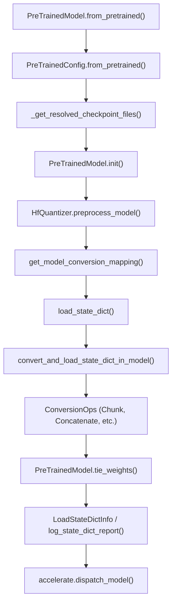
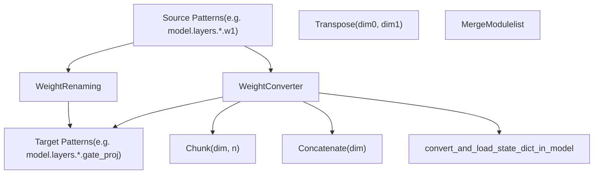

# 模型加载与权重管理 (Model Loading and Weight Management)

相关源文件 (Relevant source files)

-   [MIGRATION\_GUIDE\_V5.md](https://github.com/huggingface/transformers/blob/9a9997fd/MIGRATION_GUIDE_V5.md?plain=1)
-   [docs/source/en/main\_classes/quantization.md](https://github.com/huggingface/transformers/blob/9a9997fd/docs/source/en/main_classes/quantization.md?plain=1)
-   [docs/source/en/quantization/overview.md](https://github.com/huggingface/transformers/blob/9a9997fd/docs/source/en/quantization/overview.md?plain=1)
-   [docs/source/en/serve-cli/serving.md](https://github.com/huggingface/transformers/blob/9a9997fd/docs/source/en/serve-cli/serving.md?plain=1)
-   [setup.py](https://github.com/huggingface/transformers/blob/9a9997fd/setup.py)
-   [src/transformers/cli/add\_new\_model\_like.py](https://github.com/huggingface/transformers/blob/9a9997fd/src/transformers/cli/add_new_model_like.py)
-   [src/transformers/cli/chat.py](https://github.com/huggingface/transformers/blob/9a9997fd/src/transformers/cli/chat.py)
-   [src/transformers/cli/download.py](https://github.com/huggingface/transformers/blob/9a9997fd/src/transformers/cli/download.py)
-   [src/transformers/cli/serve.py](https://github.com/huggingface/transformers/blob/9a9997fd/src/transformers/cli/serve.py)
-   [src/transformers/cli/system.py](https://github.com/huggingface/transformers/blob/9a9997fd/src/transformers/cli/system.py)
-   [src/transformers/cli/transformers.py](https://github.com/huggingface/transformers/blob/9a9997fd/src/transformers/cli/transformers.py)
-   [src/transformers/conversion\_mapping.py](https://github.com/huggingface/transformers/blob/9a9997fd/src/transformers/conversion_mapping.py)
-   [src/transformers/core\_model\_loading.py](https://github.com/huggingface/transformers/blob/9a9997fd/src/transformers/core_model_loading.py)
-   [src/transformers/data/datasets/glue.py](https://github.com/huggingface/transformers/blob/9a9997fd/src/transformers/data/datasets/glue.py)
-   [src/transformers/data/processors/glue.py](https://github.com/huggingface/transformers/blob/9a9997fd/src/transformers/data/processors/glue.py)
-   [src/transformers/dependency\_versions\_table.py](https://github.com/huggingface/transformers/blob/9a9997fd/src/transformers/dependency_versions_table.py)
-   [src/transformers/hf\_argparser.py](https://github.com/huggingface/transformers/blob/9a9997fd/src/transformers/hf_argparser.py)
-   [src/transformers/integrations/\_\_init\_\_.py](https://github.com/huggingface/transformers/blob/9a9997fd/src/transformers/integrations/__init__.py)
-   [src/transformers/integrations/accelerate.py](https://github.com/huggingface/transformers/blob/9a9997fd/src/transformers/integrations/accelerate.py)
-   [src/transformers/integrations/peft.py](https://github.com/huggingface/transformers/blob/9a9997fd/src/transformers/integrations/peft.py)
-   [src/transformers/modeling\_attn\_mask\_utils.py](https://github.com/huggingface/transformers/blob/9a9997fd/src/transformers/modeling_attn_mask_utils.py)
-   [src/transformers/modeling\_utils.py](https://github.com/huggingface/transformers/blob/9a9997fd/src/transformers/modeling_utils.py)
-   [src/transformers/models/cohere/tokenization\_cohere.py](https://github.com/huggingface/transformers/blob/9a9997fd/src/transformers/models/cohere/tokenization_cohere.py)
-   [src/transformers/quantizers/auto.py](https://github.com/huggingface/transformers/blob/9a9997fd/src/transformers/quantizers/auto.py)
-   [src/transformers/safetensors\_conversion.py](https://github.com/huggingface/transformers/blob/9a9997fd/src/transformers/safetensors_conversion.py)
-   [src/transformers/testing\_utils.py](https://github.com/huggingface/transformers/blob/9a9997fd/src/transformers/testing_utils.py)
-   [src/transformers/trainer.py](https://github.com/huggingface/transformers/blob/9a9997fd/src/transformers/trainer.py)
-   [src/transformers/trainer\_utils.py](https://github.com/huggingface/transformers/blob/9a9997fd/src/transformers/trainer_utils.py)
-   [src/transformers/training\_args.py](https://github.com/huggingface/transformers/blob/9a9997fd/src/transformers/training_args.py)
-   [src/transformers/utils/\_\_init\_\_.py](https://github.com/huggingface/transformers/blob/9a9997fd/src/transformers/utils/__init__.py)
-   [src/transformers/utils/import\_utils.py](https://github.com/huggingface/transformers/blob/9a9997fd/src/transformers/utils/import_utils.py)
-   [src/transformers/utils/loading\_report.py](https://github.com/huggingface/transformers/blob/9a9997fd/src/transformers/utils/loading_report.py)
-   [src/transformers/utils/logging.py](https://github.com/huggingface/transformers/blob/9a9997fd/src/transformers/utils/logging.py)
-   [src/transformers/utils/quantization\_config.py](https://github.com/huggingface/transformers/blob/9a9997fd/src/transformers/utils/quantization_config.py)
-   [tests/cli/test\_serve.py](https://github.com/huggingface/transformers/blob/9a9997fd/tests/cli/test_serve.py)
-   [tests/peft\_integration/test\_peft\_integration.py](https://github.com/huggingface/transformers/blob/9a9997fd/tests/peft_integration/test_peft_integration.py)
-   [tests/test\_configuration\_common.py](https://github.com/huggingface/transformers/blob/9a9997fd/tests/test_configuration_common.py)
-   [tests/test\_feature\_extraction\_common.py](https://github.com/huggingface/transformers/blob/9a9997fd/tests/test_feature_extraction_common.py)
-   [tests/test\_modeling\_common.py](https://github.com/huggingface/transformers/blob/9a9997fd/tests/test_modeling_common.py)
-   [tests/trainer/test\_trainer.py](https://github.com/huggingface/transformers/blob/9a9997fd/tests/trainer/test_trainer.py)
-   [tests/utils/test\_core\_model\_loading.py](https://github.com/huggingface/transformers/blob/9a9997fd/tests/utils/test_core_model_loading.py)
-   [tests/utils/test\_hf\_argparser.py](https://github.com/huggingface/transformers/blob/9a9997fd/tests/utils/test_hf_argparser.py)
-   [tests/utils/test\_modeling\_utils.py](https://github.com/huggingface/transformers/blob/9a9997fd/tests/utils/test_modeling_utils.py)
-   [utils/check\_config\_attributes.py](https://github.com/huggingface/transformers/blob/9a9997fd/utils/check_config_attributes.py)

本页记录了模型检查点 (Checkpoint) 加载系统：Transformers 模型如何从预训练权重中实例化，如何解析和下载检查点文件，如何在格式之间转换权重，以及参数如何在设备之间分配。该系统以 `PreTrainedModel.from_pretrained` 方法以及 `modeling_utils.py` 和 `core_model_loading.py` 中的支持基础设施为核心。

有关模型类选择和自动类 (Auto classes) 系统的信息，请参见 [自动类与模型发现 (Auto Classes and Model Discovery)](/huggingface/transformers/2.1-auto-classes-and-model-discovery)。有关训练时检查点保存的信息，请参见 [训练器架构与训练循环 (Trainer Architecture and Training Loop)](/huggingface/transformers/3.1-trainer-architecture-and-training-loop)。有关量化配置的信息，请参见 [量化系统 (Quantization System)](/huggingface/transformers/6.1-quantization-system)。

---

## 概览：from\_pretrained 流程 (Overview: The from\_pretrained Flow)

模型加载流水线遵循一个多阶段过程，包括解析检查点文件、实例化模型结构、加载带有可选转换的权重，以及跨设备分配参数。

### 自然语言到代码实体的映射：from\_pretrained 流程 (Natural Language to Code Entity Mapping: from\_pretrained Flow)

下图将高级加载步骤与 `modeling_utils.py` 和 `core_model_loading.py` 中的具体代码实体联系起来。


**来源 (Sources)**：[src/transformers/modeling\_utils.py3397-4542](https://github.com/huggingface/transformers/blob/9a9997fd/src/transformers/modeling_utils.py#L3397-L4542) [src/transformers/core\_model\_loading.py48-52](https://github.com/huggingface/transformers/blob/9a9997fd/src/transformers/core_model_loading.py#L48-L52)

---

## 检查点文件解析 (Checkpoint File Resolution)

检查点解析系统根据模型标识符、对 `safetensors` 格式的偏好以及对分片检查点 (Sharded checkpoints) 的处理来确定要加载的文件。

### 文件发现逻辑 (File Discovery Logic)

`_get_resolved_checkpoint_files` 函数实现了一种瀑布策略来定位检查点文件：

-   **Safetensors 优先级 (Safetensors priority)**：当 `use_safetensors` 不显式为 `False` 时，系统首先尝试加载 `safetensors` 格式文件 [src/transformers/modeling\_utils.py533-547](https://github.com/huggingface/transformers/blob/9a9997fd/src/transformers/modeling_utils.py#L533-L547)
-   **自动转换 (Automatic conversion)**：如果 Hub 上仅存在 `.bin` 文件且 `use_safetensors=True`，则后台线程会触发向 `safetensors` 格式的转换 [src/transformers/modeling\_utils.py665-670](https://github.com/huggingface/transformers/blob/9a9997fd/src/transformers/modeling_utils.py#L665-L670)
-   **分片检查点处理 (Sharded checkpoint handling)**：对于大到无法放入单个文件的模型，索引 JSON 文件会将参数名称映射到分片文件名 [src/transformers/modeling\_utils.py733-746](https://github.com/huggingface/transformers/blob/9a9997fd/src/transformers/modeling_utils.py#L733-L746)
-   **变体支持 (Variant support)**：`variant` 参数（例如 `"fp16"`）将文件名模式修改为 `model.fp16.safetensors` [src/transformers/modeling\_utils.py481-486](https://github.com/huggingface/transformers/blob/9a9997fd/src/transformers/modeling_utils.py#L481-L486)

**检查点文件命名约定 (Checkpoint file naming conventions)**：

| 类型 (Type) | 单个文件 (Single File) | 索引文件 (Index File) | 分片 (Shards) |
| --- | --- | --- | --- |
| Safetensors | `model.safetensors` | `model.safetensors.index.json` | `model-00001-of-00005.safetensors` |
| PyTorch | `pytorch_model.bin` | `pytorch_model.bin.index.json` | `pytorch_model-00001-of-00005.bin` |

**来源 (Sources)**：[src/transformers/modeling\_utils.py488-751](https://github.com/huggingface/transformers/blob/9a9997fd/src/transformers/modeling_utils.py#L488-L751) [src/transformers/utils/hub.py122](https://github.com/huggingface/transformers/blob/9a9997fd/src/transformers/utils/hub.py#L122-L122)

---

## 权重加载流水线 (Weight Loading Pipeline)

一旦解析了检查点文件，权重加载系统就会从磁盘读取张量 (Tensors) 并将其分配给模型参数。

### 加载状态字典 (Loading State Dictionaries)

`load_state_dict` 函数为读取 `safetensors` 和 PyTorch 检查点格式提供了一个统一接口：

-   **元张量 (Meta tensors)**：当 `map_location="meta"` 时，张量在元设备 (Meta device) 上创建而不分配内存，这对于设备映射计算 (Device mapping computation) 很有用 [src/transformers/modeling\_utils.py301-310](https://github.com/huggingface/transformers/blob/9a9997fd/src/transformers/modeling_utils.py#L301-L310)
-   **内存映射 (Memory mapping)**：对于基于 zipfile 的 PyTorch 检查点，`mmap=True` 可减少加载期间的内存使用 [src/transformers/modeling\_utils.py318-320](https://github.com/huggingface/transformers/blob/9a9997fd/src/transformers/modeling_utils.py#L318-L320)
-   **安全性检查 (Safety checks)**：加载 `.bin` 文件时，系统会通过 `check_torch_load_is_safe` 验证其不包含不安全的 pickle 操作 [src/transformers/modeling\_utils.py314-315](https://github.com/huggingface/transformers/blob/9a9997fd/src/transformers/modeling_utils.py#L314-L315)

**来源 (Sources)**：[src/transformers/modeling\_utils.py290-322](https://github.com/huggingface/transformers/blob/9a9997fd/src/transformers/modeling_utils.py#L290-L322)

### \_load\_pretrained\_model 方法

`_load_pretrained_model` 方法编排了整个权重加载过程，处理转换、验证和设备放置。它利用 `LoadStateDictConfig` 数据类来捆绑参数 [src/transformers/modeling\_utils.py160-185](https://github.com/huggingface/transformers/blob/9a9997fd/src/transformers/modeling_utils.py#L160-L185)

```
@dataclass(frozen=True)class LoadStateDictConfig:    pretrained_model_name_or_path: str | None = None    use_safetensors: bool | None = None    ignore_mismatched_sizes: bool = False    sharded_metadata: dict | None = None    device_map: dict | None = None    dtype: torch.dtype | None = None    hf_quantizer: HfQuantizer | None = None    weight_mapping: list[WeightConverter | WeightRenaming] | None = None
```
**来源 (Sources)**：[src/transformers/modeling\_utils.py160-185](https://github.com/huggingface/transformers/blob/9a9997fd/src/transformers/modeling_utils.py#L160-L185) [src/transformers/modeling\_utils.py4213-4542](https://github.com/huggingface/transformers/blob/9a9997fd/src/transformers/modeling_utils.py#L4213-L4542)

---

## 权重转换系统 (v5) (Weight Conversion System (v5))

在 v5 中引入的权重转换系统在不同的模型实现之间转换检查点格式（例如，从供应商格式转换为 Transformers 内部格式）。

### 转换架构：模式到操作 (Conversion Architecture: Pattern to Ops)

该系统使用 `WeightRenaming` 进行简单的键 (Key) 更改，并使用 `WeightConverter` 通过 `ConversionOps` 进行结构化转换。


### 关键转换操作 (Key Conversion Operations)

1.  **Chunk**：将源张量分割为多个目标参数。用于分割融合的 QKV 权重 [src/transformers/core\_model\_loading.py116-133](https://github.com/huggingface/transformers/blob/9a9997fd/src/transformers/core_model_loading.py#L116-L133)
2.  **Concatenate**：将多个源张量合并为一个目标参数 [src/transformers/core\_model\_loading.py136-154](https://github.com/huggingface/transformers/blob/9a9997fd/src/transformers/core_model_loading.py#L136-L154)
3.  **MergeModulelist**：专门用于混合专家 (Mixture-of-Experts / MoE) 模型，将单个专家权重合并为一个打包的张量 [src/transformers/core\_model\_loading.py177-220](https://github.com/huggingface/transformers/blob/9a9997fd/src/transformers/core_model_loading.py#L177-L220)
4.  **Transpose**：交换维度，通常用于转换来自具有不同内存布局的框架的权重 [src/transformers/core\_model\_loading.py157-174](https://github.com/huggingface/transformers/blob/9a9997fd/src/transformers/core_model_loading.py#L157-L174)

**来源 (Sources)**：[src/transformers/core\_model\_loading.py84-246](https://github.com/huggingface/transformers/blob/9a9997fd/src/transformers/core_model_loading.py#L84-L246) [src/transformers/conversion\_mapping.py1-100](https://github.com/huggingface/transformers/blob/9a9997fd/src/transformers/conversion_mapping.py#L1-L100)

---

## 绑定权重管理 (Tied Weights Management)

绑定权重 (Tied weights) 是在多个模块之间共享的参数（例如，输入和输出嵌入）。系统维持指针级别的共享，以确保内存效率。

### 绑定权重逻辑 (Tied Weights Logic)

-   **声明 (Declaration)**：模型通过 `_tied_weights_keys` 声明绑定权重 [src/transformers/modeling\_utils.py1184-1187](https://github.com/huggingface/transformers/blob/9a9997fd/src/transformers/modeling_utils.py#L1184-L1187)
-   **检测 (Detection)**：`_get_tied_weight_keys` 从所有子模块中递归收集这些键 [src/transformers/modeling\_utils.py333-339](https://github.com/huggingface/transformers/blob/9a9997fd/src/transformers/modeling_utils.py#L333-L339)
-   **执行 (Execution)**：`tie_weights` 通过将目标属性设置为源张量指针，创建真实的参数共享 [src/transformers/modeling\_utils.py2163-2213](https://github.com/huggingface/transformers/blob/9a9997fd/src/transformers/modeling_utils.py#L2163-L2213)
-   **存储检查 (Storage Check)**：使用 `id_tensor_storage` 验证两个张量是否共享相同的底层内存 [src/transformers/modeling\_utils.py93](https://github.com/huggingface/transformers/blob/9a9997fd/src/transformers/modeling_utils.py#L93-L93)

**来源 (Sources)**：[src/transformers/modeling\_utils.py333-469](https://github.com/huggingface/transformers/blob/9a9997fd/src/transformers/modeling_utils.py#L333-L469) [src/transformers/modeling\_utils.py2163-2213](https://github.com/huggingface/transformers/blob/9a9997fd/src/transformers/modeling_utils.py#L2163-L2213) [src/transformers/pytorch\_utils.py93](https://github.com/huggingface/transformers/blob/9a9997fd/src/transformers/pytorch_utils.py#L93-L93)

---

## 设备映射与卸载 (Device Mapping and Offloading)

设备映射 (Device mapping) 控制模型参数在 GPU、CPU 和磁盘之间的分布。

-   **自动映射 (Automatic Mapping)**：`infer_auto_device_map` 分析模块大小和可用内存，以创建分布计划 [src/transformers/integrations/accelerate.py](https://github.com/huggingface/transformers/blob/9a9997fd/src/transformers/integrations/accelerate.py)
-   **不可分割模块 (No-split Modules)**：模型定义 `_no_split_modules` 以防止将原子块（如 Transformer 层）跨设备分割 [src/transformers/modeling\_utils.py1188-1193](https://github.com/huggingface/transformers/blob/9a9997fd/src/transformers/modeling_utils.py#L1188-L1193)
-   **磁盘卸载 (Disk Offloading)**：提供 `offload_folder` 时，参数将保存为 `safetensors` 文件，并在前向传播 (Forward Pass) 期间使用钩子 (Hooks) 按需加载 [src/transformers/modeling\_utils.py4438-4470](https://github.com/huggingface/transformers/blob/9a9997fd/src/transformers/modeling_utils.py#L4438-L4470)

**来源 (Sources)**：[src/transformers/modeling\_utils.py4371-4482](https://github.com/huggingface/transformers/blob/9a9997fd/src/transformers/modeling_utils.py#L4371-L4482) [src/transformers/integrations/accelerate.py57-65](https://github.com/huggingface/transformers/blob/9a9997fd/src/transformers/integrations/accelerate.py#L57-L65)

---

## 状态字典验证与报告 (State Dict Validation and Reporting)

加载后，系统验证 `state_dict` 并生成报告。

-   **LoadStateDictInfo**：一个跟踪 `missing_keys`、`unexpected_keys` 和 `mismatched_keys` 的数据类 [src/transformers/utils/loading\_report.py18-44](https://github.com/huggingface/transformers/blob/9a9997fd/src/transformers/utils/loading_report.py#L18-L44)
-   **忽略的键 (Ignored Keys)**：模型可以使用 `_keys_to_ignore_on_load_missing` 和 `_keys_to_ignore_on_load_unexpected` 指定验证期间要忽略的模式 [src/transformers/modeling\_utils.py1194-1209](https://github.com/huggingface/transformers/blob/9a9997fd/src/transformers/modeling_utils.py#L1194-L1209)
-   **报告 (Reporting)**：`log_state_dict_report` 生成加载状态的用户友好摘要 [src/transformers/utils/loading\_report.py130](https://github.com/huggingface/transformers/blob/9a9997fd/src/transformers/utils/loading_report.py#L130-L130)

**来源 (Sources)**：[src/transformers/modeling\_utils.py4486-4620](https://github.com/huggingface/transformers/blob/9a9997fd/src/transformers/modeling_utils.py#L4486-L4620) [src/transformers/utils/loading\_report.py18-44](https://github.com/huggingface/transformers/blob/9a9997fd/src/transformers/utils/loading_report.py#L18-L44)

---

## PreTrainedModel 基类 (PreTrainedModel Base Class)

`PreTrainedModel` 类是库中所有 PyTorch 模型的抽象基类。

-   **权重初始化 (Weight Initialization)**：`_init_weights` 是一个抽象方法，子类必须实现它来定义其初始化逻辑 [src/transformers/modeling\_utils.py1211-1214](https://github.com/huggingface/transformers/blob/9a9997fd/src/transformers/modeling_utils.py#L1211-L1214)
-   **参数访问 (Parameter Access)**：提供 `get_input_embeddings` 和 `set_input_embeddings` 等辅助程序，以标准化对通用层的访问 [src/transformers/modeling\_utils.py1300-1315](https://github.com/huggingface/transformers/blob/9a9997fd/src/transformers/modeling_utils.py#L1300-L1315)
-   **后初始化 (Post-Init)**：`post_init` 在构建模型结构后处理权重初始化和潜在的绑定 [src/transformers/modeling\_utils.py1260-1275](https://github.com/huggingface/transformers/blob/9a9997fd/src/transformers/modeling_utils.py#L1260-L1275)

**来源 (Sources)**：[src/transformers/modeling\_utils.py1063-2548](https://github.com/huggingface/transformers/blob/9a9997fd/src/transformers/modeling_utils.py#L1063-L2548) [src/transformers/modeling\_utils.py4213-4872](https://github.com/huggingface/transformers/blob/9a9997fd/src/transformers/modeling_utils.py#L4213-L4872)
