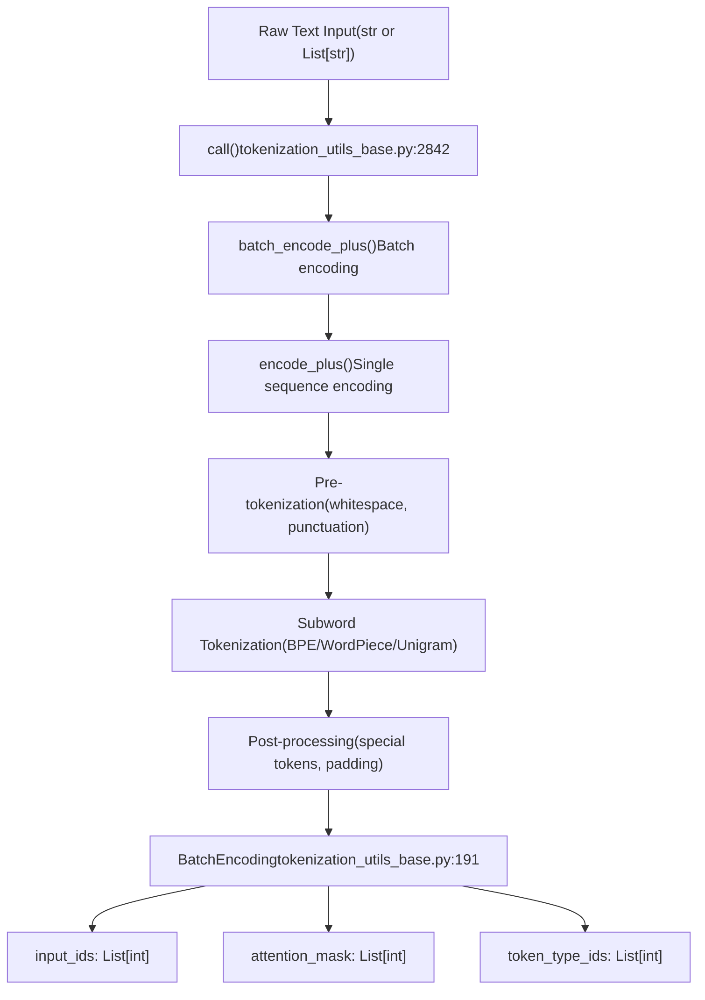
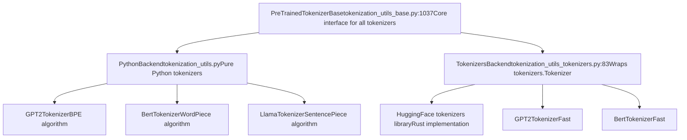
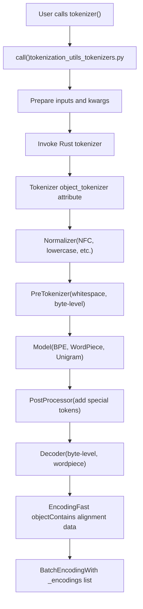
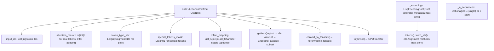
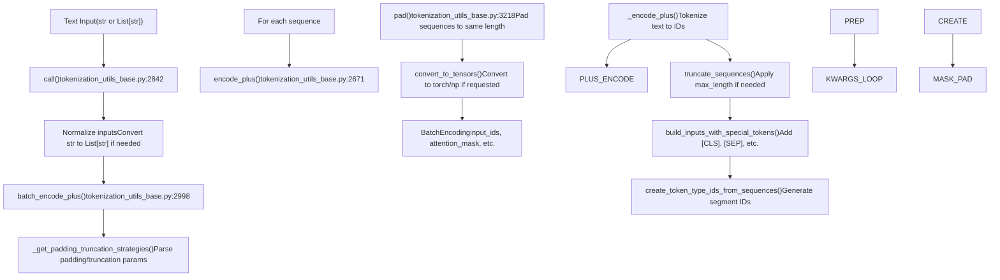
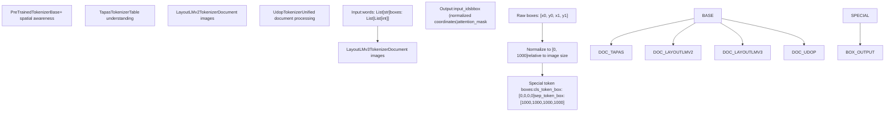
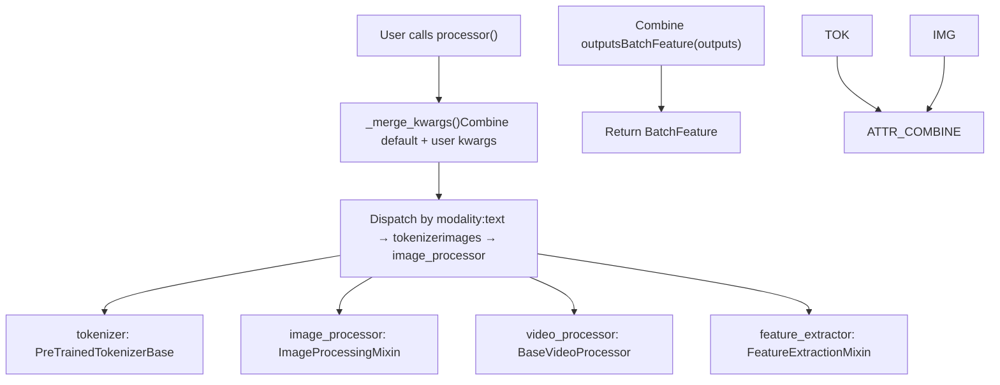
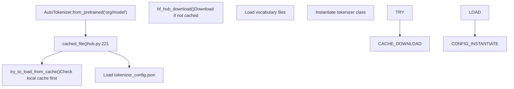

# 2.3 分词系统 (Tokenization System)

相关源文件 (Relevant source files)

-   [docs/source/en/gguf.md](https://github.com/huggingface/transformers/blob/9a9997fd/docs/source/en/gguf.md?plain=1)
-   [docs/source/en/model\_doc/code\_llama.md](https://github.com/huggingface/transformers/blob/9a9997fd/docs/source/en/model_doc/code_llama.md?plain=1)
-   [docs/source/ja/model\_doc/code\_llama.md](https://github.com/huggingface/transformers/blob/9a9997fd/docs/source/ja/model_doc/code_llama.md?plain=1)
-   [src/transformers/configuration\_utils.py](https://github.com/huggingface/transformers/blob/9a9997fd/src/transformers/configuration_utils.py)
-   [src/transformers/convert\_slow\_tokenizer.py](https://github.com/huggingface/transformers/blob/9a9997fd/src/transformers/convert_slow_tokenizer.py)
-   [src/transformers/convert\_slow\_tokenizers\_checkpoints\_to\_fast.py](https://github.com/huggingface/transformers/blob/9a9997fd/src/transformers/convert_slow_tokenizers_checkpoints_to_fast.py)
-   [src/transformers/feature\_extraction\_sequence\_utils.py](https://github.com/huggingface/transformers/blob/9a9997fd/src/transformers/feature_extraction_sequence_utils.py)
-   [src/transformers/feature\_extraction\_utils.py](https://github.com/huggingface/transformers/blob/9a9997fd/src/transformers/feature_extraction_utils.py)
-   [src/transformers/file\_utils.py](https://github.com/huggingface/transformers/blob/9a9997fd/src/transformers/file_utils.py)
-   [src/transformers/image\_processing\_base.py](https://github.com/huggingface/transformers/blob/9a9997fd/src/transformers/image_processing_base.py)
-   [src/transformers/integrations/ggml.py](https://github.com/huggingface/transformers/blob/9a9997fd/src/transformers/integrations/ggml.py)
-   [src/transformers/modeling\_gguf\_pytorch\_utils.py](https://github.com/huggingface/transformers/blob/9a9997fd/src/transformers/modeling_gguf_pytorch_utils.py)
-   [src/transformers/models/auto/video\_processing\_auto.py](https://github.com/huggingface/transformers/blob/9a9997fd/src/transformers/models/auto/video_processing_auto.py)
-   [src/transformers/models/bark/processing\_bark.py](https://github.com/huggingface/transformers/blob/9a9997fd/src/transformers/models/bark/processing_bark.py)
-   [src/transformers/models/code\_llama/tokenization\_code\_llama.py](https://github.com/huggingface/transformers/blob/9a9997fd/src/transformers/models/code_llama/tokenization_code_llama.py)
-   [src/transformers/models/layoutlmv3/tokenization\_layoutlmv3.py](https://github.com/huggingface/transformers/blob/9a9997fd/src/transformers/models/layoutlmv3/tokenization_layoutlmv3.py)
-   [src/transformers/models/layoutxlm/tokenization\_layoutxlm.py](https://github.com/huggingface/transformers/blob/9a9997fd/src/transformers/models/layoutxlm/tokenization_layoutxlm.py)
-   [src/transformers/models/llama/tokenization\_llama.py](https://github.com/huggingface/transformers/blob/9a9997fd/src/transformers/models/llama/tokenization_llama.py)
-   [src/transformers/models/luke/tokenization\_luke.py](https://github.com/huggingface/transformers/blob/9a9997fd/src/transformers/models/luke/tokenization_luke.py)
-   [src/transformers/models/markuplm/tokenization\_markuplm.py](https://github.com/huggingface/transformers/blob/9a9997fd/src/transformers/models/markuplm/tokenization_markuplm.py)
-   [src/transformers/models/mluke/tokenization\_mluke.py](https://github.com/huggingface/transformers/blob/9a9997fd/src/transformers/models/mluke/tokenization_mluke.py)
-   [src/transformers/models/plbart/tokenization\_plbart.py](https://github.com/huggingface/transformers/blob/9a9997fd/src/transformers/models/plbart/tokenization_plbart.py)
-   [src/transformers/models/qwen2/tokenization\_qwen2.py](https://github.com/huggingface/transformers/blob/9a9997fd/src/transformers/models/qwen2/tokenization_qwen2.py)
-   [src/transformers/models/seamless\_m4t/tokenization\_seamless\_m4t.py](https://github.com/huggingface/transformers/blob/9a9997fd/src/transformers/models/seamless_m4t/tokenization_seamless_m4t.py)
-   [src/transformers/models/siglip/tokenization\_siglip.py](https://github.com/huggingface/transformers/blob/9a9997fd/src/transformers/models/siglip/tokenization_siglip.py)
-   [src/transformers/models/t5/tokenization\_t5.py](https://github.com/huggingface/transformers/blob/9a9997fd/src/transformers/models/t5/tokenization_t5.py)
-   [src/transformers/models/udop/convert\_udop\_to\_hf.py](https://github.com/huggingface/transformers/blob/9a9997fd/src/transformers/models/udop/convert_udop_to_hf.py)
-   [src/transformers/models/udop/tokenization\_udop.py](https://github.com/huggingface/transformers/blob/9a9997fd/src/transformers/models/udop/tokenization_udop.py)
-   [src/transformers/models/wav2vec2/tokenization\_wav2vec2.py](https://github.com/huggingface/transformers/blob/9a9997fd/src/transformers/models/wav2vec2/tokenization_wav2vec2.py)
-   [src/transformers/models/wav2vec2\_phoneme/tokenization\_wav2vec2\_phoneme.py](https://github.com/huggingface/transformers/blob/9a9997fd/src/transformers/models/wav2vec2_phoneme/tokenization_wav2vec2_phoneme.py)
-   [src/transformers/processing\_utils.py](https://github.com/huggingface/transformers/blob/9a9997fd/src/transformers/processing_utils.py)
-   [src/transformers/tokenization\_python.py](https://github.com/huggingface/transformers/blob/9a9997fd/src/transformers/tokenization_python.py)
-   [src/transformers/tokenization\_utils\_base.py](https://github.com/huggingface/transformers/blob/9a9997fd/src/transformers/tokenization_utils_base.py)
-   [src/transformers/tokenization\_utils\_tokenizers.py](https://github.com/huggingface/transformers/blob/9a9997fd/src/transformers/tokenization_utils_tokenizers.py)
-   [src/transformers/utils/hub.py](https://github.com/huggingface/transformers/blob/9a9997fd/src/transformers/utils/hub.py)
-   [src/transformers/video\_processing\_utils.py](https://github.com/huggingface/transformers/blob/9a9997fd/src/transformers/video_processing_utils.py)
-   [tests/models/altclip/test\_processing\_altclip.py](https://github.com/huggingface/transformers/blob/9a9997fd/tests/models/altclip/test_processing_altclip.py)
-   [tests/models/auto/test\_processor\_auto.py](https://github.com/huggingface/transformers/blob/9a9997fd/tests/models/auto/test_processor_auto.py)
-   [tests/models/auto/test\_tokenization\_auto.py](https://github.com/huggingface/transformers/blob/9a9997fd/tests/models/auto/test_tokenization_auto.py)
-   [tests/models/bark/test\_processing\_bark.py](https://github.com/huggingface/transformers/blob/9a9997fd/tests/models/bark/test_processing_bark.py)
-   [tests/models/blip/test\_processing\_blip.py](https://github.com/huggingface/transformers/blob/9a9997fd/tests/models/blip/test_processing_blip.py)
-   [tests/models/clvp/test\_tokenization\_clvp.py](https://github.com/huggingface/transformers/blob/9a9997fd/tests/models/clvp/test_tokenization_clvp.py)
-   [tests/models/code\_llama/test\_tokenization\_code\_llama.py](https://github.com/huggingface/transformers/blob/9a9997fd/tests/models/code_llama/test_tokenization_code_llama.py)
-   [tests/models/layoutlmv2/test\_tokenization\_layoutlmv2.py](https://github.com/huggingface/transformers/blob/9a9997fd/tests/models/layoutlmv2/test_tokenization_layoutlmv2.py)
-   [tests/models/layoutlmv3/test\_tokenization\_layoutlmv3.py](https://github.com/huggingface/transformers/blob/9a9997fd/tests/models/layoutlmv3/test_tokenization_layoutlmv3.py)
-   [tests/models/layoutxlm/test\_tokenization\_layoutxlm.py](https://github.com/huggingface/transformers/blob/9a9997fd/tests/models/layoutxlm/test_tokenization_layoutxlm.py)
-   [tests/models/llama/test\_tokenization\_llama.py](https://github.com/huggingface/transformers/blob/9a9997fd/tests/models/llama/test_tokenization_llama.py)
-   [tests/models/markuplm/test\_tokenization\_markuplm.py](https://github.com/huggingface/transformers/blob/9a9997fd/tests/models/markuplm/test_tokenization_markuplm.py)
-   [tests/models/musicgen/test\_processing\_musicgen.py](https://github.com/huggingface/transformers/blob/9a9997fd/tests/models/musicgen/test_processing_musicgen.py)
-   [tests/models/qwen2/test\_tokenization\_qwen2.py](https://github.com/huggingface/transformers/blob/9a9997fd/tests/models/qwen2/test_tokenization_qwen2.py)
-   [tests/models/t5/test\_tokenization\_t5.py](https://github.com/huggingface/transformers/blob/9a9997fd/tests/models/t5/test_tokenization_t5.py)
-   [tests/models/tapas/test\_tokenization\_tapas.py](https://github.com/huggingface/transformers/blob/9a9997fd/tests/models/tapas/test_tokenization_tapas.py)
-   [tests/models/udop/test\_tokenization\_udop.py](https://github.com/huggingface/transformers/blob/9a9997fd/tests/models/udop/test_tokenization_udop.py)
-   [tests/models/wav2vec2/test\_feature\_extraction\_wav2vec2.py](https://github.com/huggingface/transformers/blob/9a9997fd/tests/models/wav2vec2/test_feature_extraction_wav2vec2.py)
-   [tests/models/wav2vec2/test\_tokenization\_wav2vec2.py](https://github.com/huggingface/transformers/blob/9a9997fd/tests/models/wav2vec2/test_tokenization_wav2vec2.py)
-   [tests/models/wav2vec2\_phoneme/test\_tokenization\_wav2vec2\_phoneme.py](https://github.com/huggingface/transformers/blob/9a9997fd/tests/models/wav2vec2_phoneme/test_tokenization_wav2vec2_phoneme.py)
-   [tests/quantization/ggml/test\_ggml.py](https://github.com/huggingface/transformers/blob/9a9997fd/tests/quantization/ggml/test_ggml.py)
-   [tests/quantization/quanto\_integration/test\_quanto.py](https://github.com/huggingface/transformers/blob/9a9997fd/tests/quantization/quanto_integration/test_quanto.py)
-   [tests/test\_tokenization\_common.py](https://github.com/huggingface/transformers/blob/9a9997fd/tests/test_tokenization_common.py)
-   [tests/test\_tokenizers\_backend\_mixin.py](https://github.com/huggingface/transformers/blob/9a9997fd/tests/test_tokenizers_backend_mixin.py)
-   [tests/tokenization/test\_tokenization\_utils.py](https://github.com/huggingface/transformers/blob/9a9997fd/tests/tokenization/test_tokenization_utils.py)
-   [tests/utils/test\_configuration\_utils.py](https://github.com/huggingface/transformers/blob/9a9997fd/tests/utils/test_configuration_utils.py)
-   [tests/utils/test\_convert\_slow\_tokenizer.py](https://github.com/huggingface/transformers/blob/9a9997fd/tests/utils/test_convert_slow_tokenizer.py)
-   [tests/utils/test\_feature\_extraction\_utils.py](https://github.com/huggingface/transformers/blob/9a9997fd/tests/utils/test_feature_extraction_utils.py)
-   [tests/utils/test\_image\_processing\_utils.py](https://github.com/huggingface/transformers/blob/9a9997fd/tests/utils/test_image_processing_utils.py)
-   [tests/utils/test\_tokenization\_utils.py](https://github.com/huggingface/transformers/blob/9a9997fd/tests/utils/test_tokenization_utils.py)

**目的**：本文档解释了 Transformers 库中的分词 (Tokenization) 基础设施。它涵盖了 `PreTrainedTokenizerBase`、快速 (fast) 与慢速 (slow) 分词器、`BatchEncoding`、特殊令牌 (Special token) 管理以及分词流水线。有关模型加载和自动类 (Auto class) 分发 (Dispatch)，请参见 [自动类与模型发现 (Auto Classes and Model Discovery)](/huggingface/transformers/2.1-auto-classes-and-model-discovery)。有关将分词器与图像/音频处理器结合的多模态处理，请参见 [多模态处理 (Multi-Modal Processing)](/huggingface/transformers/2.4-multi-modal-processing)。

## 分词系统概览 (Overview of the Tokenization System)

分词系统通过标准化流水线将原始文本转换为模型兼容的令牌 ID (Token IDs)。所有分词器都继承自 `PreTrainedTokenizerBase`，并遵循通用的接口进行编码 (Encoding)、解码 (Decoding) 和特殊令牌管理。该系统同时支持纯 Python（“慢速”）分词器和提供额外对齐 (Alignment) 功能的 Rust 后端（“快速”）分词器。

**分词流程图 (Tokenization Flow Diagram)**


**来源 (Sources)**：[src/transformers/tokenization\_utils\_base.py191-780](https://github.com/huggingface/transformers/blob/9a9997fd/src/transformers/tokenization_utils_base.py#L191-L780) [src/transformers/tokenization\_utils\_base.py2842-3100](https://github.com/huggingface/transformers/blob/9a9997fd/src/transformers/tokenization_utils_base.py#L2842-L3100)

## 核心分词器文件 (Core Tokenizer Files)

分词系统使用 `tokenization_utils_base.py` 中定义的标准化文件名：

| 常量 (Constant) | 文件名 (Filename) | 目的 (Purpose) |
| --- | --- | --- |
| `SPECIAL_TOKENS_MAP_FILE` | `special_tokens_map.json` | 特殊令牌映射 |
| `ADDED_TOKENS_FILE` | `added_tokens.json` | 初始化后添加的令牌 |
| `TOKENIZER_CONFIG_FILE` | `tokenizer_config.json` | 配置参数 |
| `FULL_TOKENIZER_FILE` | `tokenizer.json` | 完整的快速分词器状态 |

**来源 (Sources)**：[src/transformers/tokenization\_utils\_base.py144-150](https://github.com/huggingface/transformers/blob/9a9997fd/src/transformers/tokenization_utils_base.py#L144-L150)

## PreTrainedTokenizerBase 架构 (PreTrainedTokenizerBase Architecture)

### 类层级结构 (Class Hierarchy)

所有分词器都继承自 `PreTrainedTokenizerBase`，它定义了核心编码/解码接口。存在两条主要的实现路径：基于 Python 的慢速分词器和基于 Rust 后端的快速分词器。

**分词器类层级结构图 (Tokenizer Class Hierarchy Diagram)**


**来源 (Sources)**：[src/transformers/tokenization\_utils\_base.py1037-1600](https://github.com/huggingface/transformers/blob/9a9997fd/src/transformers/tokenization_utils_base.py#L1037-L1600) [src/transformers/tokenization\_utils\_tokenizers.py83-420](https://github.com/huggingface/transformers/blob/9a9997fd/src/transformers/tokenization_utils_tokenizers.py#L83-L420)

### 核心方法 (Core Methods)

`PreTrainedTokenizerBase` 通过几种方法提供主要的分词接口：

| 方法 (Method) | 目的 (Purpose) | 返回值 (Returns) |
| --- | --- | --- |
| `__call__()` | 主要入口点，委托给 `batch_encode_plus()` | `BatchEncoding` |
| `encode_plus()` | 编码带有所有选项的单个序列 | `BatchEncoding` |
| `batch_encode_plus()` | 编码序列批次 | `BatchEncoding` |
| `encode()` | 简单的编码为 ID 列表 | `List[int]` |
| `decode()` | 将令牌 ID 转换回文本 | `str` |
| `batch_decode()` | 解码序列批次 | `List[str]` |
| `tokenize()` | 将文本拆分为令牌（无 ID） | `List[str]` |

编码方法遵循 [src/transformers/tokenization\_utils\_base.py2842-2898](https://github.com/huggingface/transformers/blob/9a9997fd/src/transformers/tokenization_utils_base.py#L2842-L2898) 处的委派模式：

```
__call__() → batch_encode_plus() → encode_plus() → _encode_plus()
```
每一层都增加了功能：

-   `__call__()`：标准化输入和关键字参数 (kwargs) [src/transformers/tokenization\_utils\_base.py2842-2860](https://github.com/huggingface/transformers/blob/9a9997fd/src/transformers/tokenization_utils_base.py#L2842-L2860)
-   `batch_encode_plus()`：处理批处理和填充 (Padding) [src/transformers/tokenization\_utils\_base.py2998-3100](https://github.com/huggingface/transformers/blob/9a9997fd/src/transformers/tokenization_utils_base.py#L2998-L3100)
-   `encode_plus()`：处理单个序列 [src/transformers/tokenization\_utils\_base.py2671-2750](https://github.com/huggingface/transformers/blob/9a9997fd/src/transformers/tokenization_utils_base.py#L2671-L2750)
-   `_encode_plus()`：算法特定实现。

**来源 (Sources)**：[src/transformers/tokenization\_utils\_base.py2842-3100](https://github.com/huggingface/transformers/blob/9a9997fd/src/transformers/tokenization_utils_base.py#L2842-L3100) [src/transformers/tokenization\_utils\_base.py3522-3700](https://github.com/huggingface/transformers/blob/9a9997fd/src/transformers/tokenization_utils_base.py#L3522-L3700)

## 快速与慢速分词器 (Fast vs Slow Tokenizers)

该库支持两种具有不同权衡的并行分词器实现。

### 实现对比 (Implementation Comparison)

| 功能 (Feature) | 慢速分词器 (Slow Tokenizers) (PythonBackend) | 快速分词器 (Fast Tokenizers) (TokenizersBackend) |
| --- | --- | --- |
| **实现 (Implementation)** | 纯 Python | Rust (HuggingFace `tokenizers` 库) |
| **基类 (Base Class)** | `PythonBackend` | `TokenizersBackend` |
| **性能 (Performance)** | 基准 | 快 10-100 倍，特别是在批处理上 |
| **对齐信息 (Alignment Info)** | 不可用 | 完整的 词/字符 (word/char) ↔ 令牌 (token) 映射 |
| **后端访问 (Backend Access)** | 不适用 | `tokenizer._tokenizer` (Rust 对象) |
| **文件格式 (File Format)** | 多个文件 (词表 (vocab), 合并 (merges), 配置 (config)) | 单个 `tokenizer.json` 文件 |
| **并行化 (Parallelization)** | 否 | 是，通过 Rust 线程 |

**快速分词器架构图 (Fast Tokenizer Architecture Diagram)**


**来源 (Sources)**：[src/transformers/tokenization\_utils\_tokenizers.py83-420](https://github.com/huggingface/transformers/blob/9a9997fd/src/transformers/tokenization_utils_tokenizers.py#L83-L420) [src/transformers/tokenization\_utils\_base.py94-99](https://github.com/huggingface/transformers/blob/9a9997fd/src/transformers/tokenization_utils_base.py#L94-L99)

### 快速分词器对齐功能 (Fast Tokenizer Alignment Features)

快速分词器在 `EncodingFast` 对象中存储额外的元数据，这些元数据实现了令牌 (tokens)、词 (words) 和字符 (characters) 之间的对齐。当 `is_fast=True` 时，`BatchEncoding` 对象提供以下方法：

**对齐方法 (Alignment Methods)**：

| 方法 (Method) | 签名 (Signature) | 描述 (Description) |
| --- | --- | --- |
| `tokens()` | `tokens(batch_index=0) -> List[str]` | 获取批次条目的令牌字符串 |
| `word_ids()` | `word_ids(batch_index=0) -> List[Optional[int]]` | 将令牌映射到词索引 (Word indices)（特殊令牌为 None） |
| `sequence_ids()` | `sequence_ids(batch_index=0) -> List[Optional[int]]` | 将令牌映射到序列（对为 0 或 1，特殊令牌为 None） |
| `token_to_word()` | `token_to_word(batch_or_token_index, token_index=None) -> int` | 获取令牌的词索引 |
| `word_to_tokens()` | `word_to_tokens(batch_or_word_index, word_index=None) -> TokenSpan` | 获取词的令牌范围 (Token span) |
| `token_to_chars()` | `token_to_chars(batch_or_token_index, token_index=None) -> CharSpan` | 获取令牌的字符范围 (Character span) |
| `char_to_token()` | `char_to_token(batch_or_char_index, char_index=None) -> int` | 获取包含字符的令牌 |

**来源 (Sources)**：[src/transformers/tokenization\_utils\_base.py293-664](https://github.com/huggingface/transformers/blob/9a9997fd/src/transformers/tokenization_utils_base.py#L293-L664) [src/transformers/tokenization\_utils\_base.py165-189](https://github.com/huggingface/transformers/blob/9a9997fd/src/transformers/tokenization_utils_base.py#L165-L189)

### 快速与慢速之间的转换 (Converting Between Fast and Slow)

`AutoTokenizer` 会在可用时自动选择快速分词器。要强制指定类型：

```
# Force slow tokenizertokenizer = AutoTokenizer.from_pretrained("bert-base-uncased", use_fast=False) # Force fast tokenizer (raises error if not available)tokenizer = AutoTokenizer.from_pretrained("bert-base-uncased", use_fast=True)
```
`convert_slow_tokenizer.py` 实用程序处理从旧版“慢速”格式（如 SentencePiece `.model` 文件）到快速 `tokenizer.json` 格式的转换 [src/transformers/convert\_slow\_tokenizer.py15-19](https://github.com/huggingface/transformers/blob/9a9997fd/src/transformers/convert_slow_tokenizer.py#L15-L19)

**来源 (Sources)**：[src/transformers/tokenization\_utils\_base.py293-299](https://github.com/huggingface/transformers/blob/9a9997fd/src/transformers/tokenization_utils_base.py#L293-L299) [src/transformers/convert\_slow\_tokenizer.py15-19](https://github.com/huggingface/transformers/blob/9a9997fd/src/transformers/convert_slow_tokenizer.py#L15-L19)

## BatchEncoding 输出容器 (BatchEncoding Output Container)

`BatchEncoding` 是一个专门用于保存分词输出的字典。它通过张量转换和对齐方法扩展了标准字典接口。

**BatchEncoding 结构图 (BatchEncoding Structure Diagram)**


**来源 (Sources)**：[src/transformers/tokenization\_utils\_base.py191-784](https://github.com/huggingface/transformers/blob/9a9997fd/src/transformers/tokenization_utils_base.py#L191-L784)

### 关键属性 (Key Attributes)

`BatchEncoding` 对象在分词后包含以下标准键：

| 键 (Key) | 类型 (Type) | 描述 (Description) | 始终存在 (Always Present) |
| --- | --- | --- | --- |
| `input_ids` | `List[int]` | 令牌 ID | 是 |
| `attention_mask` | `List[int]` | 有效令牌为 1，填充为 0 | 如果应用了填充 |
| `token_type_ids` | `List[int]` | 分段 ID (Segment IDs)（句子对为 0 或 1） | 取决于模型 |
| `special_tokens_mask` | `List[int]` | 特殊令牌为 1，否则为 0 | 如果 `return_special_tokens_mask=True` |
| `offset_mapping` | `List[Tuple[int,int]]` | 每个令牌的字符范围 | 如果 `return_offsets_mapping=True` |

### 张量转换 (Tensor Conversion)

[src/transformers/tokenization\_utils\_base.py662-754](https://github.com/huggingface/transformers/blob/9a9997fd/src/transformers/tokenization_utils_base.py#L662-L754) 处的 `convert_to_tensors()` 方法将列表值转换为张量：

支持的张量类型：

-   `"pt"` 或 `TensorType.PYTORCH`：PyTorch 张量 [src/transformers/tokenization\_utils\_base.py716](https://github.com/huggingface/transformers/blob/9a9997fd/src/transformers/tokenization_utils_base.py#L716-L716)
-   `"np"` 或 `TensorType.NUMPY`：NumPy 数组 [src/transformers/tokenization\_utils\_base.py746](https://github.com/huggingface/transformers/blob/9a9997fd/src/transformers/tokenization_utils_base.py#L746-L746)
-   `"mlx"` 或 `TensorType.MLX`：MLX 数组 (Apple Silicon) [src/transformers/tokenization\_utils\_base.py750](https://github.com/huggingface/transformers/blob/9a9997fd/src/transformers/tokenization_utils_base.py#L750-L750)

**来源 (Sources)**：[src/transformers/tokenization\_utils\_base.py191-784](https://github.com/huggingface/transformers/blob/9a9997fd/src/transformers/tokenization_utils_base.py#L191-L784)

## 分词流水线与参数 (Tokenization Pipeline and Parameters)

分词流水线在生成最终 `BatchEncoding` 输出之前通过几个阶段处理文本。

**分词流水线流程图 (Tokenization Pipeline Flow Diagram)**


**来源 (Sources)**：[src/transformers/tokenization\_utils\_base.py2842-3100](https://github.com/huggingface/transformers/blob/9a9997fd/src/transformers/tokenization_utils_base.py#L2842-L3100) [src/transformers/tokenization\_utils\_base.py2671-2750](https://github.com/huggingface/transformers/blob/9a9997fd/src/transformers/tokenization_utils_base.py#L2671-L2750) [src/transformers/tokenization\_utils\_base.py3218-3420](https://github.com/huggingface/transformers/blob/9a9997fd/src/transformers/tokenization_utils_base.py#L3218-L3420)

### 编码参数 (Encoding Parameters)

编码方法接受许多参数来控制分词行为。关键参数定义在 [src/transformers/tokenization\_utils\_base.py782-839](https://github.com/huggingface/transformers/blob/9a9997fd/src/transformers/tokenization_utils_base.py#L782-L839) 处的 `ENCODE_KWARGS_DOCSTRING` 中：

| 参数 (Parameter) | 类型 (Type) | 描述 (Description) |
| --- | --- | --- |
| `padding` | `bool` / `str` | 填充策略 (Padding strategy)：`True`、`'longest'`、`'max_length'` 或 `False` [src/transformers/tokenization\_utils\_base.py44-60](https://github.com/huggingface/transformers/blob/9a9997fd/src/transformers/tokenization_utils_base.py#L44-L60) |
| `truncation` | `bool` / `str` | 截断策略 (Truncation strategy)：`True`、`'only_first'`、`'only_second'`、`'longest_first'` [src/transformers/tokenization\_utils\_base.py153-163](https://github.com/huggingface/transformers/blob/9a9997fd/src/transformers/tokenization_utils_base.py#L153-L163) |
| `max_length` | `int` | 最大序列长度 [src/transformers/tokenization\_utils\_base.py808](https://github.com/huggingface/transformers/blob/9a9997fd/src/transformers/tokenization_utils_base.py#L808-L808) |
| `return_tensors` | `str` | 返回类型：`'pt'`、`'np'` 或 `'mlx'` [src/transformers/tokenization\_utils\_base.py833](https://github.com/huggingface/transformers/blob/9a9997fd/src/transformers/tokenization_utils_base.py#L833-L833) |

**来源 (Sources)**：[src/transformers/tokenization\_utils\_base.py782-900](https://github.com/huggingface/transformers/blob/9a9997fd/src/transformers/tokenization_utils_base.py#L782-L900) [src/transformers/tokenization\_utils\_base.py44-60](https://github.com/huggingface/transformers/blob/9a9997fd/src/transformers/tokenization_utils_base.py#L44-L60) [src/transformers/tokenization\_utils\_base.py153-163](https://github.com/huggingface/transformers/blob/9a9997fd/src/transformers/tokenization_utils_base.py#L153-L163)

## 特殊令牌管理 (Special Token Management)

特殊令牌 (Special tokens) 是特定于模型的令牌，用于诸如分类 ([CLS])、序列分离 ([SEP]) 和填充 ([PAD]) 等任务。

**特殊令牌系统图 (Special Token System Diagram)**

```mermaid
flowchart TD
    UNK["unk_tokenUnknown/OOV tokens"]
    BOS["bos_tokenBeginning of sequence"]
    EOS["eos_tokenEnd of sequence"]
    SEP["sep_tokenSequence separator"]
    PAD["pad_tokenPadding"]
    CLS["cls_tokenClassification"]
    MASK["mask_tokenMasked LM"]
    ADDITIONAL["additional_special_tokensUser-defined tokens"]
    SPECIAL_MAP["_special_tokens_mapDict[str, str/AddedToken]"]
    ADDED_ENC["added_tokens_encoderDict[str, int]"]
    ADDED_DEC["added_tokens_decoderDict[int, AddedToken]"]
    ADD_SPECIAL["add_special_tokens()tokenization_utils_base.py:1707"]
    ADD_TOKENS["add_tokens()tokenization_utils_base.py:1802"]
    BUILD["build_inputs_with_special_tokens()Model-specific placement"]
    GET_MASK["get_special_tokens_mask()Identify positions"]

    UNK --> SPECIAL_MAP
    BOS --> SPECIAL_MAP
    EOS --> SPECIAL_MAP
    SEP --> SPECIAL_MAP
    PAD --> SPECIAL_MAP
    CLS --> SPECIAL_MAP
    MASK --> SPECIAL_MAP
    ADDITIONAL --> SPECIAL_MAP
    SPECIAL --> MAP_ADDED_ENC
    SPECIAL --> MAP_ADDED_DEC
    ADDED --> ENC_ADD_SPECIAL
    ADDED --> DEC_ADD_TOKENS
    ADD --> SPECIAL_BUILD
    BUILD --> GET_MASK
```


**来源 (Sources)**：[src/transformers/tokenization\_utils\_base.py1707-1900](https://github.com/huggingface/transformers/blob/9a9997fd/src/transformers/tokenization_utils_base.py#L1707-L1900) [src/transformers/tokenization\_utils\_base.py143-151](https://github.com/huggingface/transformers/blob/9a9997fd/src/transformers/tokenization_utils_base.py#L143-L151)

### AddedToken 类 (AddedToken Class)

特殊令牌可以是简单的字符串，也可以是提供细粒度控制的 `AddedToken` 对象。`AddedToken` 类定义在 [src/transformers/tokenization\_utils\_base.py100-127](https://github.com/huggingface/transformers/blob/9a9997fd/src/transformers/tokenization_utils_base.py#L100-L127) 处：

```
@dataclassclass AddedToken:    content: str          # The token string    single_word: bool     # Only match complete words    lstrip: bool          # Strip left whitespace    rstrip: bool          # Strip right whitespace      special: bool         # Is this a special token?    normalized: bool      # Apply normalization?
```
**来源 (Sources)**：[src/transformers/tokenization\_utils\_base.py100-127](https://github.com/huggingface/transformers/blob/9a9997fd/src/transformers/tokenization_utils_base.py#L100-L127) [src/transformers/tokenization\_utils\_base.py1707-1895](https://github.com/huggingface/transformers/blob/9a9997fd/src/transformers/tokenization_utils_base.py#L1707-L1895)

## 文档布局分词器 (Document Layout Tokenizers)

几种专门的分词器处理文档理解任务，其中文本具有空间布局信息（边界框 (Bounding boxes)）。这些分词器处理带有位置元数据 (Positional metadata) 的预分词词语。

**文档布局分词器架构 (Document Layout Tokenizer Architecture)**


**来源 (Sources)**：[src/transformers/models/udop/tokenization\_udop.py1-40](https://github.com/huggingface/transformers/blob/9a9997fd/src/transformers/models/udop/tokenization_udop.py#L1-L40) [src/transformers/models/t5/tokenization\_t5.py1-40](https://github.com/huggingface/transformers/blob/9a9997fd/src/transformers/models/t5/tokenization_t5.py#L1-L40) [tests/models/layoutlmv3/test\_tokenization\_layoutlmv3.py50-59](https://github.com/huggingface/transformers/blob/9a9997fd/tests/models/layoutlmv3/test_tokenization_layoutlmv3.py#L50-L59)

### 表格感知分词 (Tapas) (Table-Aware Tokenization (Tapas))

`TapasTokenizer` 处理具有隐式单元格结构的表格，生成编码行/列信息的特殊 `token_type_ids` [src/transformers/models/auto/tokenization\_auto.py1-40](https://github.com/huggingface/transformers/blob/9a9997fd/src/transformers/models/auto/tokenization_auto.py#L1-L40)

**来源 (Sources)**：[tests/models/tapas/test\_tokenization\_tapas.py45-110](https://github.com/huggingface/transformers/blob/9a9997fd/tests/models/tapas/test_tokenization_tapas.py#L45-L110)

## 多模态处理集成 (Multi-Modal Processing Integration)

`ProcessorMixin` 将分词与其他模态处理器（图像、音频、视频）协调一致。


**来源 (Sources)**：[src/transformers/processing\_utils.py572-678](https://github.com/huggingface/transformers/blob/9a9997fd/src/transformers/processing_utils.py#L572-L678) [src/transformers/processing\_utils.py93-121](https://github.com/huggingface/transformers/blob/9a9997fd/src/transformers/processing_utils.py#L93-L121)

## GGUF 分词支持 (GGUF Tokenization Support)

该库通过 `GGUF_TOKENIZER_MAPPING` 和专门的转换器 (Converters) 提供对 GGUF 格式分词器的集成 [src/transformers/modeling\_gguf\_pytorch\_utils.py39-51](https://github.com/huggingface/transformers/blob/9a9997fd/src/transformers/modeling_gguf_pytorch_utils.py#L39-L51)

**GGUF 分词流程 (GGUF Tokenization Flow)**：

1.  使用 `GGUF_TOKENIZER_MAPPING` 加载 GGUF 文件元数据。
2.  将 GGUF 分词参数（BPE、Unigram）映射到 Transformers 的等效参数 [src/transformers/integrations/ggml.py144-149](https://github.com/huggingface/transformers/blob/9a9997fd/src/transformers/integrations/ggml.py#L144-L149)
3.  使用 `LlamaConverter` 或 `Qwen2Converter` 实例化相应的分词器 [src/transformers/integrations/ggml.py27](https://github.com/huggingface/transformers/blob/9a9997fd/src/transformers/integrations/ggml.py#L27-L27)

**来源 (Sources)**：[src/transformers/modeling\_gguf\_pytorch\_utils.py39-51](https://github.com/huggingface/transformers/blob/9a9997fd/src/transformers/modeling_gguf_pytorch_utils.py#L39-L51) [src/transformers/integrations/ggml.py27](https://github.com/huggingface/transformers/blob/9a9997fd/src/transformers/integrations/ggml.py#L27-L27) [src/transformers/integrations/ggml.py144-149](https://github.com/huggingface/transformers/blob/9a9997fd/src/transformers/integrations/ggml.py#L144-L149)

## 保存与加载 (Saving and Loading)

### 文件结构 (File Structure)

当调用 `save_pretrained(directory)` 时，分词器会创建以下文件：

-   `tokenizer_config.json`：配置和初始化参数 [src/transformers/tokenization\_utils\_base.py146](https://github.com/huggingface/transformers/blob/9a9997fd/src/transformers/tokenization_utils_base.py#L146-L146)
-   `special_tokens_map.json`：特殊令牌映射 [src/transformers/tokenization\_utils\_base.py144](https://github.com/huggingface/transformers/blob/9a9997fd/src/transformers/tokenization_utils_base.py#L144-L144)
-   `tokenizer.json`：完整的快速分词器状态（Rust 后端） [src/transformers/tokenization\_utils\_base.py149](https://github.com/huggingface/transformers/blob/9a9997fd/src/transformers/tokenization_utils_base.py#L149-L149)

### Hub 集成 (Hub Integration)

从 Hugging Face Hub 加载使用 `cached_file()` 来下载和缓存文件：


**来源 (Sources)**：[src/transformers/utils/hub.py221-278](https://github.com/huggingface/transformers/blob/9a9997fd/src/transformers/utils/hub.py#L221-L278) [src/transformers/tokenization\_utils\_base.py2198-2400](https://github.com/huggingface/transformers/blob/9a9997fd/src/transformers/tokenization_utils_base.py#L2198-L2400)
