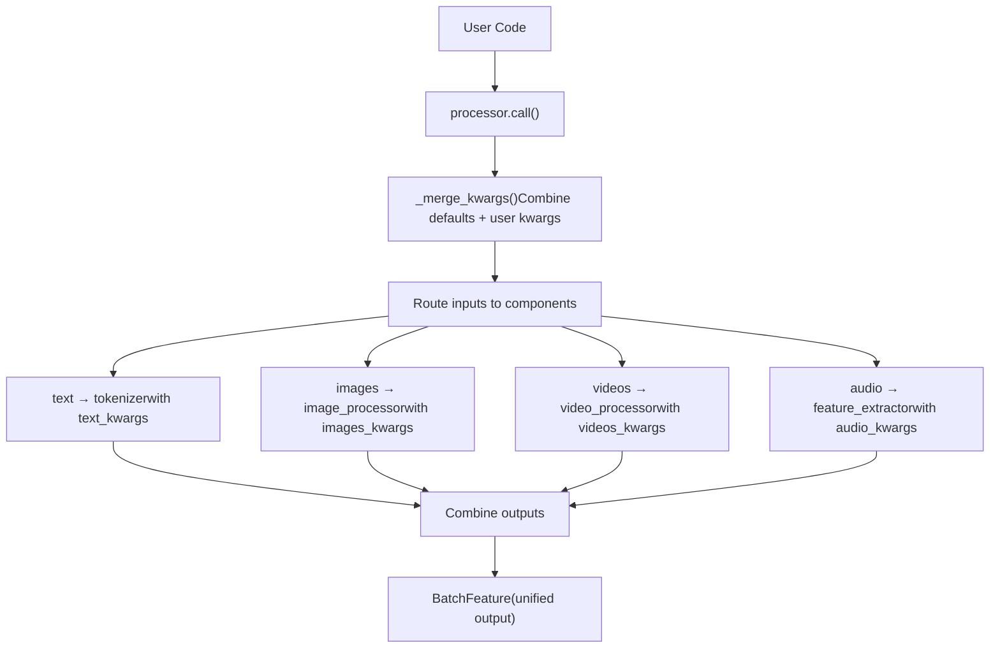
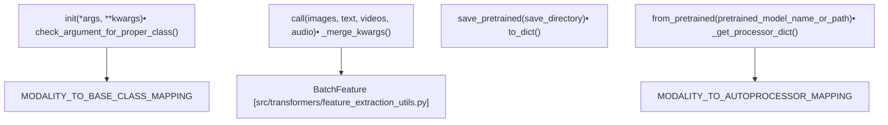
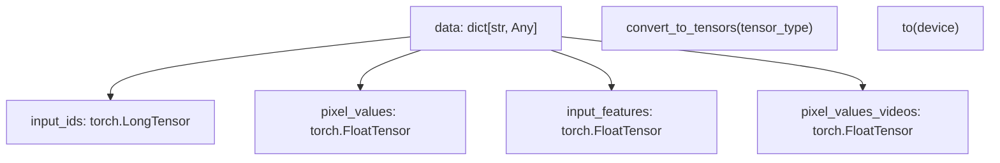

# 多模态处理 (Multi-Modal Processing)

相关源文件 (Relevant source files)

-   [src/transformers/audio\_utils.py](https://github.com/huggingface/transformers/blob/9a9997fd/src/transformers/audio_utils.py)
-   [src/transformers/configuration\_utils.py](https://github.com/huggingface/transformers/blob/9a9997fd/src/transformers/configuration_utils.py)
-   [src/transformers/feature\_extraction\_utils.py](https://github.com/huggingface/transformers/blob/9a9997fd/src/transformers/feature_extraction_utils.py)
-   [src/transformers/file\_utils.py](https://github.com/huggingface/transformers/blob/9a9997fd/src/transformers/file_utils.py)
-   [src/transformers/image\_processing\_base.py](https://github.com/huggingface/transformers/blob/9a9997fd/src/transformers/image_processing_base.py)
-   [src/transformers/models/aria/processing\_aria.py](https://github.com/huggingface/transformers/blob/9a9997fd/src/transformers/models/aria/processing_aria.py)
-   [src/transformers/models/audio_spectrogram_transformer/feature_extraction_audio_spectrogram_transformer.py](https://github.com/huggingface/transformers/blob/9a9997fd/src/transformers/models/audio_spectrogram_transformer/feature_extraction_audio_spectrogram_transformer.py)
-   [src/transformers/models/auto/video\_processing\_auto.py](https://github.com/huggingface/transformers/blob/9a9997fd/src/transformers/models/auto/video_processing_auto.py)
-   [src/transformers/models/aya\_vision/modular\_aya\_vision.py](https://github.com/huggingface/transformers/blob/9a9997fd/src/transformers/models/aya_vision/modular_aya_vision.py)
-   [src/transformers/models/aya\_vision/processing\_aya\_vision.py](https://github.com/huggingface/transformers/blob/9a9997fd/src/transformers/models/aya_vision/processing_aya_vision.py)
-   [src/transformers/models/clap/feature\_extraction\_clap.py](https://github.com/huggingface/transformers/blob/9a9997fd/src/transformers/models/clap/feature_extraction_clap.py)
-   [src/transformers/models/emu3/image\_processing\_emu3.py](https://github.com/huggingface/transformers/blob/9a9997fd/src/transformers/models/emu3/image_processing_emu3.py)
-   [src/transformers/models/gemma3/image\_processing\_gemma3.py](https://github.com/huggingface/transformers/blob/9a9997fd/src/transformers/models/gemma3/image_processing_gemma3.py)
-   [src/transformers/models/gemma3/processing\_gemma3.py](https://github.com/huggingface/transformers/blob/9a9997fd/src/transformers/models/gemma3/processing_gemma3.py)
-   [src/transformers/models/llava\_onevision/modular\_llava\_onevision.py](https://github.com/huggingface/transformers/blob/9a9997fd/src/transformers/models/llava_onevision/modular_llava_onevision.py)
-   [src/transformers/models/pix2struct/image\_processing\_pix2struct.py](https://github.com/huggingface/transformers/blob/9a9997fd/src/transformers/models/pix2struct/image_processing_pix2struct.py)
-   [src/transformers/models/qwen2\_vl/image\_processing\_qwen2\_vl.py](https://github.com/huggingface/transformers/blob/9a9997fd/src/transformers/models/qwen2_vl/image_processing_qwen2_vl.py)
-   [src/transformers/models/rt\_detr/modular\_rt\_detr.py](https://github.com/huggingface/transformers/blob/9a9997fd/src/transformers/models/rt_detr/modular_rt_detr.py)
-   [src/transformers/models/seamless\_m4t/feature\_extraction\_seamless\_m4t.py](https://github.com/huggingface/transformers/blob/9a9997fd/src/transformers/models/seamless_m4t/feature_extraction_seamless_m4t.py)
-   [src/transformers/models/speech\_to\_text/feature\_extraction\_speech_to_text.py](https://github.com/huggingface/transformers/blob/9a9997fd/src/transformers/models/speech_to_text/feature_extraction_speech_to_text.py)
-   [src/transformers/models/speecht5/feature\_extraction\_speecht5.py](https://github.com/huggingface/transformers/blob/9a9997fd/src/transformers/models/speecht5/feature_extraction_speecht5.py)
-   [src/transformers/models/whisper/feature\_extraction\_whisper.py](https://github.com/huggingface/transformers/blob/9a9997fd/src/transformers/models/whisper/feature_extraction_whisper.py)
-   [src/transformers/processing\_utils.py](https://github.com/huggingface/transformers/blob/9a9997fd/src/transformers/processing_utils.py)
-   [src/transformers/tokenization\_utils\_base.py](https://github.com/huggingface/transformers/blob/9a9997fd/src/transformers/tokenization_utils_base.py)
-   [src/transformers/utils/hub.py](https://github.com/huggingface/transformers/blob/9a9997fd/src/transformers/utils/hub.py)
-   [src/transformers/video\_processing\_utils.py](https://github.com/huggingface/transformers/blob/9a9997fd/src/transformers/video_processing_utils.py)
-   [tests/models/aria/test\_processing\_aria.py](https://github.com/huggingface/transformers/blob/9a9997fd/tests/models/aria/test_processing_aria.py)
-   [tests/models/audio_spectrogram_transformer/test_feature_extraction_audio_spectrogram_transformer.py](https://github.com/huggingface/transformers/blob/9a9997fd/tests/models/audio_spectrogram_transformer/test_feature_extraction_audio_spectrogram_transformer.py)
-   [tests/models/auto/test\_processor\_auto.py](https://github.com/huggingface/transformers/blob/9a9997fd/tests/models/auto/test_processor_auto.py)
-   [tests/models/aya\_vision/test\_processing\_aya\_vision.py](https://github.com/huggingface/transformers/blob/9a9997fd/tests/models/aya_vision/test_processing_aya_vision.py)
-   [tests/models/chameleon/test\_processing\_chameleon.py](https://github.com/huggingface/transformers/blob/9a9997fd/tests/models/chameleon/test_processing_chameleon.py)
-   [tests/models/cohere2\_vision/test\_processing\_cohere2\_vision.py](https://github.com/huggingface/transformers/blob/9a9997fd/tests/models/cohere2_vision/test_processing_cohere2_vision.py)
-   [tests/models/csm/test\_processing\_csm.py](https://github.com/huggingface/transformers/blob/9a9997fd/tests/models/csm/test_processing_csm.py)
-   [tests/models/encodec/test\_feature\_extraction\_encodec.py](https://github.com/huggingface/transformers/blob/9a9997fd/tests/models/encodec/test_feature_extraction_encodec.py)
-   [tests/models/gemma3/test\_image\_processing\_gemma3.py](https://github.com/huggingface/transformers/blob/9a9997fd/tests/models/gemma3/test_image_processing_gemma3.py)
-   [tests/models/gemma3/test\_processing\_gemma3.py](https://github.com/huggingface/transformers/blob/9a9997fd/tests/models/gemma3/test_processing_gemma3.py)
-   [tests/models/glm4v/test\_processor\_glm4v.py](https://github.com/huggingface/transformers/blob/9a9997fd/tests/models/glm4v/test_processor_glm4v.py)
-   [tests/models/grounding\_dino/test\_processing\_grounding\_dino.py](https://github.com/huggingface/transformers/blob/9a9997fd/tests/models/grounding_dino/test_processing_grounding_dino.py)
-   [tests/models/internvl/test\_processing\_internvl.py](https://github.com/huggingface/transformers/blob/9a9997fd/tests/models/internvl/test_processing_internvl.py)
-   [tests/models/llava/test\_processing\_llava.py](https://github.com/huggingface/transformers/blob/9a9997fd/tests/models/llava/test_processing_llava.py)
-   [tests/models/mistral3/test\_processing\_mistral3.py](https://github.com/huggingface/transformers/blob/9a9997fd/tests/models/mistral3/test_processing_mistral3.py)
-   [tests/models/mllama/test\_processing\_mllama.py](https://github.com/huggingface/transformers/blob/9a9997fd/tests/models/mllama/test_processing_mllama.py)
-   [tests/models/pix2struct/test\_processing\_pix2struct.py](https://github.com/huggingface/transformers/blob/9a9997fd/tests/models/pix2struct/test_processing_pix2struct.py)
-   [tests/models/qwen2\_5\_omni/test\_processing\_qwen2\_5\_omni.py](https://github.com/huggingface/transformers/blob/9a9997fd/tests/models/qwen2_5_omni/test_processing_qwen2_5_omni.py)
-   [tests/models/qwen2\_5\_vl/test\_processing\_qwen2\_5\_vl.py](https://github.com/huggingface/transformers/blob/9a9997fd/tests/models/qwen2_5_vl/test_processing_qwen2_5_vl.py)
-   [tests/models/qwen2\_vl/test\_image\_processing\_qwen2\_vl.py](https://github.com/huggingface/transformers/blob/9a9997fd/tests/models/qwen2_vl/test_image_processing_qwen2_vl.py)
-   [tests/models/qwen2\_vl/test\_processing\_qwen2\_vl.py](https://github.com/huggingface/transformers/blob/9a9997fd/tests/models/qwen2_vl/test_processing_qwen2_vl.py)
-   [tests/models/seamless\_m4t/test\_feature\_extraction\_seamless\_m4t.py](https://github.com/huggingface/transformers/blob/9a9997fd/tests/models/seamless_m4t/test_feature_extraction_seamless_m4t.py)
-   [tests/models/smolvlm/test\_processing\_smolvlm.py](https://github.com/huggingface/transformers/blob/9a9997fd/tests/models/smolvlm/test_processing_smolvlm.py)
-   [tests/models/speech\_to\_text/test\_feature\_extraction\_speech\_to\_text.py](https://github.com/huggingface/transformers/blob/9a9997fd/tests/models/speech_to_text/test_feature_extraction_speech_to_text.py)
-   [tests/models/speecht5/test\_feature\_extraction\_speecht5.py](https://github.com/huggingface/transformers/blob/9a9997fd/tests/models/speecht5/test_feature_extraction_speecht5.py)
-   [tests/models/whisper/test\_feature\_extraction\_whisper.py](https://github.com/huggingface/transformers/blob/9a9997fd/tests/models/whisper/test_feature_extraction_whisper.py)
-   [tests/test\_image\_processing\_common.py](https://github.com/huggingface/transformers/blob/9a9997fd/tests/test_image_processing_common.py)
-   [tests/test\_processing\_common.py](https://github.com/huggingface/transformers/blob/9a9997fd/tests/test_processing_common.py)
-   [tests/test\_video\_processing\_common.py](https://github.com/huggingface/transformers/blob/9a9997fd/tests/test_video_processing_common.py)
-   [tests/utils/test\_audio\_utils.py](https://github.com/huggingface/transformers/blob/9a9997fd/tests/utils/test_audio_utils.py)
-   [tests/utils/test\_configuration\_utils.py](https://github.com/huggingface/transformers/blob/9a9997fd/tests/utils/test_configuration_utils.py)
-   [tests/utils/test\_feature\_extraction\_utils.py](https://github.com/huggingface/transformers/blob/9a9997fd/tests/utils/test_feature_extraction_utils.py)
-   [tests/utils/test\_image\_processing\_utils.py](https://github.com/huggingface/transformers/blob/9a9997fd/tests/utils/test_image_processing_utils.py)
-   [tests/utils/test\_tokenization\_utils.py](https://github.com/huggingface/transformers/blob/9a9997fd/tests/utils/test_tokenization_utils.py)
-   [utils/fetch\_hub\_objects\_for\_ci.py](https://github.com/huggingface/transformers/blob/9a9997fd/utils/fetch_hub_objects_for_ci.py)

## 目的与范围 (Purpose and Scope)

本文档涵盖了 `transformers` 库中的 `ProcessorMixin` 类和多模态预处理 (Multi-modal preprocessing) 基础设施。`ProcessorMixin` 提供了一个统一接口，用于将分词器 (Tokenizers)、图像处理器 (Image processors)、音频特征提取器 (Audio feature extractors) 和视频处理器 (Video processors) 合并为一个可以同时处理多种输入模态的单一组件。

涵盖的关键主题：

-   `ProcessorMixin` 架构和模态编排系统。
-   每种模态的类型化关键字参数 (Typed kwargs)（`TextKwargs`、`ImagesKwargs`、`AudioKwargs`、`VideosKwargs`）。
-   用于自动组件加载的 `AutoProcessor` 模式。
-   用于对话模型的聊天模板 (Chat template) 集成。
-   保存、加载和 Hub 集成。

有关文本分词的详细信息，请参见 [分词系统 (Tokenization System)](/huggingface/transformers/2.3-tokenization-system)。有关使用处理器的更高级别推理，请参见 [Pipeline API](/huggingface/transformers/2.5-pipeline-api)。

**来源 (Sources)：** [src/transformers/processing\_utils.py561-667](https://github.com/huggingface/transformers/blob/9a9997fd/src/transformers/processing_utils.py#L561-L667) [src/transformers/processing\_utils.py123-134](https://github.com/huggingface/transformers/blob/9a9997fd/src/transformers/processing_utils.py#L123-L134)

---

## ProcessorMixin 架构 (ProcessorMixin Architecture)

`ProcessorMixin` 是所有处理器的基类。它编排多个特定于模态的组件，并提供统一的 `__call__` 接口。

### 高级流程 (High-Level Flow)

下图说明了从原始多模态输入到统一 `BatchFeature` 输出的数据流。


### 核心组件与模态映射 (Core Components and Modality Mapping)

该库将特定模态映射到它们各自的基类和自动类 (Auto classes)。

| 模态 (Modality) | 基类 (Base Class) | 自动类 (Auto Class) | 目的 (Purpose) |
| --- | --- | --- | --- |
| `tokenizer` | `PreTrainedTokenizerBase` | `AutoTokenizer` | 文本 → 令牌 ID |
| `image_processor` | `ImageProcessingMixin` | `AutoImageProcessor` | 图像 → 像素值 (Pixel values) |
| `feature_extractor` | `FeatureExtractionMixin` | `AutoFeatureExtractor` | 音频 → 输入特征 (Input features) |
| `video_processor` | `BaseVideoProcessor` | `AutoVideoProcessor` | 视频 → 视频帧 (Video frames) |
| `audio_tokenizer` | `PreTrainedAudioTokenizerBase` | 不适用 | 音频 → 离散令牌 |

**来源 (Sources)：** [src/transformers/processing\_utils.py123-134](https://github.com/huggingface/transformers/blob/9a9997fd/src/transformers/processing_utils.py#L123-L134) [src/transformers/processing\_utils.py93-121](https://github.com/huggingface/transformers/blob/9a9997fd/src/transformers/processing_utils.py#L93-L121)

---

## ProcessorMixin 实现 (ProcessorMixin Implementation)

### 类结构与实体映射 (Class Structure and Entity Mapping)

该图将概念性的处理步骤与 `processing_utils.py` 中的具体代码实体联系起来。


### 初始化与验证 (Initialization and Validation)

`ProcessorMixin` 确保初始化期间传递的所有组件都与预期的模态基类匹配。

[src/transformers/processing\_utils.py571-604](https://github.com/huggingface/transformers/blob/9a9997fd/src/transformers/processing_utils.py#L571-L604)

```
class ProcessorMixin(PushToHubMixin):    def __init__(self, *args, **kwargs):        # Extract chat_template        setattr(self, "chat_template", kwargs.pop("chat_template", None))                # Handle audio_tokenizer specially        if (audio_tokenizer := kwargs.pop("audio_tokenizer", None)) is not None:            self.check_argument_for_proper_class("audio_tokenizer", audio_tokenizer)            setattr(self, "audio_tokenizer", audio_tokenizer)                # Map positional args to attributes defined in get_attributes()        for arg, attribute_name in zip(args, self.get_attributes()):            kwargs[attribute_name] = arg                # Validate and set each component        for attribute_name, arg in kwargs.items():            self.check_argument_for_proper_class(attribute_name, arg)            setattr(self, attribute_name, arg)
```
**来源 (Sources)：** [src/transformers/processing\_utils.py571-604](https://github.com/huggingface/transformers/blob/9a9997fd/src/transformers/processing_utils.py#L571-L604) [src/transformers/processing\_utils.py669-690](https://github.com/huggingface/transformers/blob/9a9997fd/src/transformers/processing_utils.py#L669-L690)

---

## 类型化关键字参数系统 (Typed Kwargs System)

处理器利用 `TypedDict` 来处理特定模态的关键字参数，从而通过 `Annotated` 类型和验证器 (Validators) 实现运行时验证。

### TextKwargs 与验证 (TextKwargs and Validation)

[src/transformers/processing\_utils.py161-225](https://github.com/huggingface/transformers/blob/9a9997fd/src/transformers/processing_utils.py#L161-L225)

```
class TextKwargs(TypedDict, total=False):    padding: Annotated[bool | str | PaddingStrategy | None, padding_validator()]    truncation: Annotated[bool | str | TruncationStrategy | None, truncation_validator()]    max_length: Annotated[int | None, positive_int()]    return_tensors: Annotated[str | TensorType | None, tensor_type_validator()]
```
### 视频与音频关键字参数 (Video and Audio Kwargs)

-   **`VideosKwargs`**：处理诸如 `num_frames` 和 `fps` 之类的帧采样参数，以及 `video_metadata` 验证。[src/transformers/processing\_utils.py328-416](https://github.com/huggingface/transformers/blob/9a9997fd/src/transformers/processing_utils.py#L328-L416)
-   **`AudioKwargs`**：管理 `sampling_rate`、`max_length` 和 `padding`。[src/transformers/processing\_utils.py418-471](https://github.com/huggingface/transformers/blob/9a9997fd/src/transformers/processing_utils.py#L418-L471)

**来源 (Sources)：** [src/transformers/processing\_utils.py161-471](https://github.com/huggingface/transformers/blob/9a9997fd/src/transformers/processing_utils.py#L161-L471) [src/transformers/utils/type\_validators.py62-72](https://github.com/huggingface/transformers/blob/9a9997fd/src/transformers/utils/type_validators.py#L62-L72)

---

## BatchEncoding 与 BatchFeature

多模态处理的输出通常是 `BatchFeature`（或对于文本密集型任务为 `BatchEncoding`），它作为所有处理后张量 (Tensors) 的统一字典。

### 输出数据结构 (Output Data Structure)


### 张量转换逻辑 (Tensor Conversion Logic)

`convert_to_tensors` 方法处理从 Python 列表/NumPy 数组向特定框架张量（PyTorch、TF 或 JAX）的转换。

[src/transformers/feature\_extraction\_utils.py158-216](https://github.com/huggingface/transformers/blob/9a9997fd/src/transformers/feature_extraction_utils.py#L158-L216)

```
def convert_to_tensors(self, tensor_type=None, skip_tensor_conversion=None):    if tensor_type is None:        return self    is_tensor, as_tensor = self._get_is_as_tensor_fns(tensor_type)    # Logic to iterate through dict and convert values...
```
**来源 (Sources)：** [src/transformers/feature\_extraction\_utils.py58-216](https://github.com/huggingface/transformers/blob/9a9997fd/src/transformers/feature_extraction_utils.py#L58-L216) [src/transformers/tokenization\_utils\_base.py191-220](https://github.com/huggingface/transformers/blob/9a9997fd/src/transformers/tokenization_utils_base.py#L191-L220)

---

## \_\_call\_\_ 编排 (The **call** Orchestration)

`ProcessorMixin` 中的 `__call__` 方法负责合并关键字参数，并将数据分发给子处理器。

### 路由逻辑 (Routing Logic)

[src/transformers/processing\_utils.py646-667](https://github.com/huggingface/transformers/blob/9a9997fd/src/transformers/processing_utils.py#L646-L667)

```
# Internal routing inside __call__attribute_to_kwargs = {    "tokenizer": (text, "text_kwargs"),    "image_processor": (images, "images_kwargs"),    "video_processor": (videos, "videos_kwargs"),    "feature_extractor": (audio, "audio_kwargs"),} for attribute_name in self.get_attributes():    attribute = getattr(self, attribute_name, None)    input_data, input_kwargs_key = attribute_to_kwargs.get(attribute_name, (None, None))        if input_data is not None and attribute is not None:        # kwargs[input_kwargs_key] contains the merged modality-specific parameters        attribute_output = attribute(input_data, **kwargs[input_kwargs_key])        outputs.update(attribute_output)
```
**来源 (Sources)：** [src/transformers/processing\_utils.py606-667](https://github.com/huggingface/transformers/blob/9a9997fd/src/transformers/processing_utils.py#L606-L667) [src/transformers/processing\_utils.py1090-1199](https://github.com/huggingface/transformers/blob/9a9997fd/src/transformers/processing_utils.py#L1090-L1199)

---

## 处理器的保存与加载 (Saving and Loading Processors)

处理器保存为组件配置集合加上一个 `processor_config.json`。

### 序列化流程 (Serialization Flow)

1.  **`save_pretrained`**：在每个子组件（分词器、图像处理器等）上调用 `save_pretrained`。[src/transformers/processing\_utils.py781-836](https://github.com/huggingface/transformers/blob/9a9997fd/src/transformers/processing_utils.py#L781-L836)
2.  **`to_dict`**：序列化处理器自身的属性，同时排除完整的分词器（分词器保存在单独的文件中，如 `tokenizer.json`）。[src/transformers/processing\_utils.py692-752](https://github.com/huggingface/transformers/blob/9a9997fd/src/transformers/processing_utils.py#L692-L752)
3.  **`from_pretrained`**：
    -   加载 `processor_config.json`。
    -   识别子组件。
    -   使用 `Auto` 类（例如 `AutoTokenizer`、`AutoImageProcessor`）重建组件。[src/transformers/processing\_utils.py1010-1083](https://github.com/huggingface/transformers/blob/9a9997fd/src/transformers/processing_utils.py#L1010-L1083)

### 组件映射 (Component Mapping)

`MODALITY_TO_AUTOPROCESSOR_MAPPING` 决定了加载期间为每个属性使用哪个自动类 (Auto class)。

[src/transformers/processing\_utils.py93-121](https://github.com/huggingface/transformers/blob/9a9997fd/src/transformers/processing_utils.py#L93-L121)

```
_MAPPING_NAMES = {    "image_processor": ("transformers.models.auto.image_processing_auto", "AutoImageProcessor"),    "video_processor": ("transformers.models.auto.video_processing_auto", "AutoVideoProcessor"),    "feature_extractor": ("transformers.models.auto.feature_extraction_auto", "AutoFeatureExtractor"),    "tokenizer": ("transformers.models.auto.tokenization_auto", "AutoTokenizer"),}
```
**来源 (Sources)：** [src/transformers/processing\_utils.py93-121](https://github.com/huggingface/transformers/blob/9a9997fd/src/transformers/processing_utils.py#L93-L121) [src/transformers/processing\_utils.py692-752](https://github.com/huggingface/transformers/blob/9a9997fd/src/transformers/processing_utils.py#L692-L752) [src/transformers/processing\_utils.py781-836](https://github.com/huggingface/transformers/blob/9a9997fd/src/transformers/processing_utils.py#L781-L836) [src/transformers/processing\_utils.py1010-1083](https://github.com/huggingface/transformers/blob/9a9997fd/src/transformers/processing_utils.py#L1010-L1083)

---

## 聊天模板集成 (Chat Template Integration)

多模态处理器支持 `apply_chat_template` 以处理包含图像、视频或音频的对话。

### 处理多模态消息 (Processing Multimodal Messages)

如果 `tokenize=True`，`apply_chat_template` 方法既可以返回格式化字符串，也可以返回完整的处理后张量。

[src/transformers/processing\_utils.py1287-1358](https://github.com/huggingface/transformers/blob/9a9997fd/src/transformers/processing_utils.py#L1287-L1358)

```
def apply_chat_template(    self,    conversation,    chat_template=None,    tokenize=True,    return_dict=True,    **kwargs,):    # 1. Render text via Jinja template    # 2. If tokenize=True, extract modality objects (images, etc.) from conversation    # 3. Call processor.__call__ with text + extracted modalities
```
**来源 (Sources)：** [src/transformers/processing\_utils.py1287-1358](https://github.com/huggingface/transformers/blob/9a9997fd/src/transformers/processing_utils.py#L1287-L1358) [src/transformers/utils/hub.py68-70](https://github.com/huggingface/transformers/blob/9a9997fd/src/transformers/utils/hub.py#L68-L70)

---

## 模态特定实用程序 (Modality-Specific Utilities)

### 音频加载 (Audio Loading)

`load_audio` 函数提供了一个统一入口，用于从 URL 或本地路径加载波形，优先使用 `torchcodec` 作为后端，并回退到 `librosa`。

[src/transformers/audio\_utils.py60-88](https://github.com/huggingface/transformers/blob/9a9997fd/src/transformers/audio_utils.py#L60-L88)

### 视频加载 (Video Loading)

视频处理涉及帧采样和元数据提取（FPS、时长）。

[src/transformers/video\_processing\_utils.py77-140](https://github.com/huggingface/transformers/blob/9a9997fd/src/transformers/video_processing_utils.py#L77-L140)

| 功能 (Feature) | 实现 (Implementation) |
| --- | --- |
| **帧采样 (Frame Sampling)** | `do_sample_frames`、`num_frames`、`fps` |
| **调整大小 (Resizing)** | `do_resize`、`size`、`resample` |
| **归一化 (Normalization)** | `do_normalize`、`image_mean`、`image_std` |

**来源 (Sources)：** [src/transformers/audio\_utils.py60-88](https://github.com/huggingface/transformers/blob/9a9997fd/src/transformers/audio_utils.py#L60-L88) [src/transformers/video\_processing\_utils.py77-140](https://github.com/huggingface/transformers/blob/9a9997fd/src/transformers/video_processing_utils.py#L77-L140) [src/transformers/video\_utils.py51-61](https://github.com/huggingface/transformers/blob/9a9997fd/src/transformers/video_utils.py#L51-L61)
