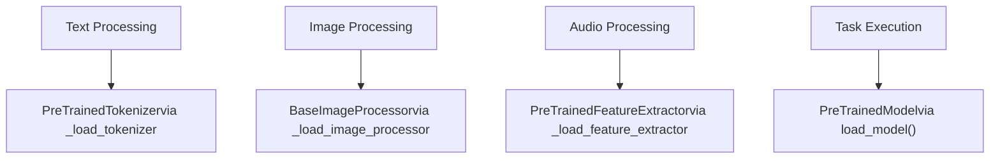
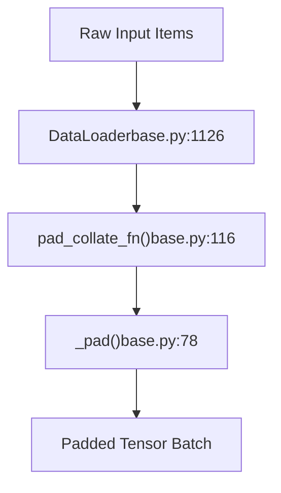

# Pipeline API

相关源文件 (Relevant source files)

-   [docs/source/it/migration.md](https://github.com/huggingface/transformers/blob/9a9997fd/docs/source/it/migration.md?plain=1)
-   [src/transformers/dynamic\_module\_utils.py](https://github.com/huggingface/transformers/blob/9a9997fd/src/transformers/dynamic_module_utils.py)
-   [src/transformers/models/auto/auto\_factory.py](https://github.com/huggingface/transformers/blob/9a9997fd/src/transformers/models/auto/auto_factory.py)
-   [src/transformers/pipelines/\_\_init\_\_.py](https://github.com/huggingface/transformers/blob/9a9997fd/src/transformers/pipelines/__init__.py)
-   [src/transformers/pipelines/audio\_classification.py](https://github.com/huggingface/transformers/blob/9a9997fd/src/transformers/pipelines/audio_classification.py)
-   [src/transformers/pipelines/base.py](https://github.com/huggingface/transformers/blob/9a9997fd/src/transformers/pipelines/base.py)
-   [src/transformers/pipelines/depth\_estimation.py](https://github.com/huggingface/transformers/blob/9a9997fd/src/transformers/pipelines/depth_estimation.py)
-   [src/transformers/pipelines/document\_question\_answering.py](https://github.com/huggingface/transformers/blob/9a9997fd/src/transformers/pipelines/document_question_answering.py)
-   [src/transformers/pipelines/fill\_mask.py](https://github.com/huggingface/transformers/blob/9a9997fd/src/transformers/pipelines/fill_mask.py)
-   [src/transformers/pipelines/image\_classification.py](https://github.com/huggingface/transformers/blob/9a9997fd/src/transformers/pipelines/image_classification.py)
-   [src/transformers/pipelines/image\_segmentation.py](https://github.com/huggingface/transformers/blob/9a9997fd/src/transformers/pipelines/image_segmentation.py)
-   [src/transformers/pipelines/image\_text\_to\_text.py](https://github.com/huggingface/transformers/blob/9a9997fd/src/transformers/pipelines/image_text_to_text.py)
-   [src/transformers/pipelines/mask\_generation.py](https://github.com/huggingface/transformers/blob/9a9997fd/src/transformers/pipelines/mask_generation.py)
-   [src/transformers/pipelines/object\_detection.py](https://github.com/huggingface/transformers/blob/9a9997fd/src/transformers/pipelines/object_detection.py)
-   [src/transformers/pipelines/pt\_utils.py](https://github.com/huggingface/transformers/blob/9a9997fd/src/transformers/pipelines/pt_utils.py)
-   [src/transformers/pipelines/table\_question\_answering.py](https://github.com/huggingface/transformers/blob/9a9997fd/src/transformers/pipelines/table_question_answering.py)
-   [src/transformers/pipelines/text\_classification.py](https://github.com/huggingface/transformers/blob/9a9997fd/src/transformers/pipelines/text_classification.py)
-   [src/transformers/pipelines/text\_generation.py](https://github.com/huggingface/transformers/blob/9a9997fd/src/transformers/pipelines/text_generation.py)
-   [src/transformers/pipelines/token\_classification.py](https://github.com/huggingface/transformers/blob/9a9997fd/src/transformers/pipelines/token_classification.py)
-   [src/transformers/pipelines/video\_classification.py](https://github.com/huggingface/transformers/blob/9a9997fd/src/transformers/pipelines/video_classification.py)
-   [src/transformers/pipelines/zero\_shot\_audio\_classification.py](https://github.com/huggingface/transformers/blob/9a9997fd/src/transformers/pipelines/zero_shot_audio_classification.py)
-   [src/transformers/pipelines/zero\_shot\_classification.py](https://github.com/huggingface/transformers/blob/9a9997fd/src/transformers/pipelines/zero_shot_classification.py)
-   [src/transformers/pipelines/zero\_shot\_image\_classification.py](https://github.com/huggingface/transformers/blob/9a9997fd/src/transformers/pipelines/zero_shot_image_classification.py)
-   [src/transformers/pipelines/zero\_shot\_object\_detection.py](https://github.com/huggingface/transformers/blob/9a9997fd/src/transformers/pipelines/zero_shot_object_detection.py)
-   [tests/models/auto/test\_modeling\_auto.py](https://github.com/huggingface/transformers/blob/9a9997fd/tests/models/auto/test_modeling_auto.py)
-   [tests/models/markuplm/test\_modeling\_markuplm.py](https://github.com/huggingface/transformers/blob/9a9997fd/tests/models/markuplm/test_modeling_markuplm.py)
-   [tests/pipelines/test\_pipelines\_audio_classification.py](https://github.com/huggingface/transformers/blob/9a9997fd/tests/pipelines/test_pipelines_audio_classification.py)
-   [tests/pipelines/test\_pipelines\_common.py](https://github.com/huggingface/transformers/blob/9a9997fd/tests/pipelines/test_pipelines_common.py)
-   [tests/pipelines/test\_pipelines\_depth\_estimation.py](https://github.com/huggingface/transformers/blob/9a9997fd/tests/pipelines/test_pipelines_depth_estimation.py)
-   [tests/pipelines/test\_pipelines\_fill\_mask.py](https://github.com/huggingface/transformers/blob/9a9997fd/tests/pipelines/test_pipelines_fill_mask.py)
-   [tests/pipelines/test\_pipelines\_image\_classification.py](https://github.com/huggingface/transformers/blob/9a9997fd/tests/pipelines/test_pipelines_image_classification.py)
-   [tests/pipelines/test\_pipelines\_image\_segmentation.py](https://github.com/huggingface/transformers/blob/9a9997fd/tests/pipelines/test_pipelines_image_segmentation.py)
-   [tests/pipelines/test\_pipelines\_image\_text\_to\_text.py](https://github.com/huggingface/transformers/blob/9a9997fd/tests/pipelines/test_pipelines_image_text_to_text.py)
-   [tests/pipelines/test\_pipelines\_mask\_generation.py](https://github.com/huggingface/transformers/blob/9a9997fd/tests/pipelines/test_pipelines_mask_generation.py)
-   [tests/pipelines/test\_pipelines\_object\_detection.py](https://github.com/huggingface/transformers/blob/9a9997fd/tests/pipelines/test_pipelines_object_detection.py)
-   [tests/pipelines/test\_pipelines\_question\_answering.py](https://github.com/huggingface/transformers/blob/9a9997fd/tests/pipelines/test_pipelines_question_answering.py)
-   [tests/pipelines/test\_pipelines\_text\_classification.py](https://github.com/huggingface/transformers/blob/9a9997fd/tests/pipelines/test_pipelines_text_classification.py)
-   [tests/pipelines/test\_pipelines\_text\_generation.py](https://github.com/huggingface/transformers/blob/9a9997fd/tests/pipelines/test_pipelines_text_generation.py)
-   [tests/pipelines/test\_pipelines\_token\_classification.py](https://github.com/huggingface/transformers/blob/9a9997fd/tests/pipelines/test_pipelines_token_classification.py)
-   [tests/pipelines/test\_pipelines\_video\_classification.py](https://github.com/huggingface/transformers/blob/9a9997fd/tests/pipelines/test_pipelines_video_classification.py)
-   [tests/pipelines/test\_pipelines\_zero\_shot.py](https://github.com/huggingface/transformers/blob/9a9997fd/tests/pipelines/test_pipelines_zero_shot.py)
-   [tests/pipelines/test\_pipelines\_zero\_shot\_image\_classification.py](https://github.com/huggingface/transformers/blob/9a9997fd/tests/pipelines/test_pipelines_zero_shot_image_classification.py)

## 目的与范围 (Purpose and Scope)

Pipeline API 为 transformer 模型的推理 (Inference) 提供了一个高级的、面向任务的接口。它将预处理输入、运行模型推理和后处理输出的复杂性抽象为一个简单的、统一的 API。Pipelines 自动处理分词 (Tokenization)、特征提取 (Feature extraction)、批处理 (Batching)、设备放置 (Device placement) 和输出格式化。

本文档涵盖了 pipelines 的架构、生命周期和用法。有关模型加载和权重管理的内容，请参见 [模型加载与权重管理 (Model Loading and Weight Management)](/huggingface/transformers/2.2-model-loading-and-weight-management)。有关分词的详细信息，请参见 [分词系统 (Tokenization System)](/huggingface/transformers/2.3-tokenization-system)。有关多模态处理的内容，请参见 [多模态处理 (Multi-Modal Processing)](/huggingface/transformers/2.4-multi-modal-processing)。

## 高级架构 (High-Level Architecture)

Pipeline 系统由三层组成：用于实例化的工厂函数、定义推理生命周期的基类以及特定于任务的实现。

### Pipeline 系统组件 (Pipeline System Components)

标题：Pipeline 系统架构 (Pipeline System Architecture)

```mermaid
flowchart TD
    pipeline_fn["pipeline() factorysrc/transformers/pipelines/init.py"]
    SUPPORTED_TASKS["SUPPORTED_TASKSTask definitions"]
    PIPELINE_REGISTRY["PIPELINE_REGISTRYTask registry"]
    check_task["check_task()Validation"]
    get_task["get_task()Auto-detection"]
    Pipeline["Pipeline base classsrc/transformers/pipelines/base.py"]
    preprocess["preprocess()"]
    _forward["_forward()"]
    postprocess["postprocess()"]
    _sanitize_parameters["_sanitize_parameters()"]
    TextGeneration["TextGenerationPipelinetext_generation.py"]
    TextClassification["TextClassificationPipeline"]
    QuestionAnswering["QuestionAnsweringPipeline"]
    DocumentQA["DocumentQuestionAnsweringPipeline"]
    VisualQA["VisualQuestionAnsweringPipeline"]
    Others["30+ other pipelines"]
    load_model["load_model()base.py:179-272"]
    AutoModel["AutoModel.from_pretrained"]
    AutoTokenizer["AutoTokenizer.from_pretrained"]
    AutoProcessor["AutoProcessor.from_pretrained"]

    pipeline --> fn_PIPELINE_REGISTRY
    pipeline --> fn_check_task
    pipeline --> fn_get_task
    PIPELINE --> REGISTRY_SUPPORTED_TASKS
    check --> task_SUPPORTED_TASKS
    pipeline --> fn_load_model
    load --> model_AutoModel
    load --> model_AutoTokenizer
    load --> model_AutoProcessor
    Pipeline --> preprocess
    Pipeline --> _forward
    Pipeline --> postprocess
    Pipeline --> _sanitize_parameters
    TextGeneration --> Pipeline
    TextClassification --> Pipeline
    QuestionAnswering --> Pipeline
    DocumentQA --> Pipeline
    VisualQA --> Pipeline
    Others --> Pipeline
```

来源 (Sources)：[src/transformers/pipelines/\_\_init\_\_.py137-312](https://github.com/huggingface/transformers/blob/9a9997fd/src/transformers/pipelines/__init__.py#L137-L312) [src/transformers/pipelines/base.py744-1435](https://github.com/huggingface/transformers/blob/9a9997fd/src/transformers/pipelines/base.py#L744-L1435)

## Pipeline 生命周期 (Pipeline Lifecycle)

每个 pipeline 都遵循一个标准化的三阶段生命周期：预处理 (preprocess) → 前向传播 (forward) → 后处理 (postprocess)。`Pipeline` 基类编排了这一流程。

### 推理执行流程 (Inference Execution Flow)

标题：Pipeline 执行顺序 (Pipeline Execution Sequence)

> **[Mermaid sequence]**
> *(图表结构无法解析)*

### 关键生命周期方法 (Key Lifecycle Methods)

| 方法 (Method) | 目的 (Purpose) | 职责 (Responsibilities) |
| --- | --- | --- |
| `_sanitize_parameters()` | 将关键字参数 (kwargs) 分离为特定阶段的参数 | 返回 `(preprocess_params, forward_params, postprocess_params)` 元组 [src/transformers/pipelines/base.py925-927](https://github.com/huggingface/transformers/blob/9a9997fd/src/transformers/pipelines/base.py#L925-L927) |
| `preprocess()` | 将原始输入转换为模型就绪的张量 (Tensors) | 分词、图像处理、填充、截断 [src/transformers/pipelines/base.py930-944](https://github.com/huggingface/transformers/blob/9a9997fd/src/transformers/pipelines/base.py#L930-L944) |
| `_forward()` | 运行模型推理 | 执行 `model.forward()` 或 `model.generate()`，处理批处理 [src/transformers/pipelines/base.py946-960](https://github.com/huggingface/transformers/blob/9a9997fd/src/transformers/pipelines/base.py#L946-L960) |
| `postprocess()` | 将模型输出转换为用户友好的格式 | 解码、分数计算、格式化 [src/transformers/pipelines/base.py962-976](https://github.com/huggingface/transformers/blob/9a9997fd/src/transformers/pipelines/base.py#L962-L976) |

来源 (Sources)：[src/transformers/pipelines/base.py744-1435](https://github.com/huggingface/transformers/blob/9a9997fd/src/transformers/pipelines/base.py#L744-L1435) [src/transformers/pipelines/base.py1114-1191](https://github.com/huggingface/transformers/blob/9a9997fd/src/transformers/pipelines/base.py#L1114-L1191)

## pipeline() 工厂函数 (The pipeline() Factory Function)

`pipeline()` 函数是创建 pipelines 的主要入口点。它处理任务解析、模型加载和组件初始化。

### 任务解析 (Task Resolution)

`SUPPORTED_TASKS` 字典 [src/transformers/pipelines/\_\_init\_\_.py137-312](https://github.com/huggingface/transformers/blob/9a9997fd/src/transformers/pipelines/__init__.py#L137-L312) 将任务标识符映射到 pipeline 配置。

| 键 (Key) | 值字段 (Value Fields) | 示例 (Example) |
| --- | --- | --- |
| 任务标识符 | `impl`: Pipeline 类 | `TextGenerationPipeline` [src/transformers/pipelines/\_\_init\_\_.py192](https://github.com/huggingface/transformers/blob/9a9997fd/src/transformers/pipelines/__init__.py#L192-L192) |
|  | `pt`: 模型类元组 | `(AutoModelForCausalLM,)` [src/transformers/pipelines/\_\_init\_\_.py193](https://github.com/huggingface/transformers/blob/9a9997fd/src/transformers/pipelines/__init__.py#L193-L193) |
|  | `default`: 默认模型字典 | `{"model": ("openai-community/gpt2", "607a30d")}` [src/transformers/pipelines/\_\_init\_\_.py194](https://github.com/huggingface/transformers/blob/9a9997fd/src/transformers/pipelines/__init__.py#L194-L194) |
|  | `type`: 输入模态 | `"text"`、`"image"`、`"multimodal"` [src/transformers/pipelines/\_\_init\_\_.py195](https://github.com/huggingface/transformers/blob/9a9997fd/src/transformers/pipelines/__init__.py#L195-L195) |

来源 (Sources)：[src/transformers/pipelines/\_\_init\_\_.py137-312](https://github.com/huggingface/transformers/blob/9a9997fd/src/transformers/pipelines/__init__.py#L137-L312) [src/transformers/pipelines/\_\_init\_\_.py341-381](https://github.com/huggingface/transformers/blob/9a9997fd/src/transformers/pipelines/__init__.py#L341-L381)

### 组件加载 (Component Loading)

pipeline 根据特定 pipeline 类中定义的标志加载组件。

标题：从自然语言空间到 Pipeline 代码实体的映射 (Natural Language Space to Pipeline Code Entity Mapping)

每个特定任务的 pipeline 都设置了这些标志：

-   `TextGenerationPipeline`：`_load_tokenizer = True` [src/transformers/pipelines/text\_generation.py90](https://github.com/huggingface/transformers/blob/9a9997fd/src/transformers/pipelines/text_generation.py#L90-L90)
-   `ImageTextToTextPipeline`：`_load_processor = True` [src/transformers/pipelines/image\_text\_to\_text.py115](https://github.com/huggingface/transformers/blob/9a9997fd/src/transformers/pipelines/image_text_to_text.py#L115-L115)
-   `TokenClassificationPipeline`：`_load_tokenizer = True` [src/transformers/pipelines/token\_classification.py134](https://github.com/huggingface/transformers/blob/9a9997fd/src/transformers/pipelines/token_classification.py#L134-L134)

来源 (Sources)：[src/transformers/pipelines/base.py766-770](https://github.com/huggingface/transformers/blob/9a9997fd/src/transformers/pipelines/base.py#L766-L770) [src/transformers/pipelines/base.py179-272](https://github.com/huggingface/transformers/blob/9a9997fd/src/transformers/pipelines/base.py#L179-L272) [src/transformers/pipelines/text\_generation.py86-90](https://github.com/huggingface/transformers/blob/9a9997fd/src/transformers/pipelines/text_generation.py#L86-L90)

## 任务特定 Pipeline 实现 (Task-Specific Pipeline Implementations)

### 文本生成 Pipeline (Text Generation Pipeline)

`TextGenerationPipeline` [src/transformers/pipelines/text\_generation.py23](https://github.com/huggingface/transformers/blob/9a9997fd/src/transformers/pipelines/text_generation.py#L23-L23) 处理因果语言模型 (Causal language model) 生成，支持文本提示 (Prompts) 和聊天对话。

**关键功能 (Key Features)：**

-   通过 `_pipeline_calls_generate = True` 与生成系统集成 [src/transformers/pipelines/text\_generation.py86](https://github.com/huggingface/transformers/blob/9a9997fd/src/transformers/pipelines/text_generation.py#L86-L86)
-   使用 `max_new_tokens=256` 的 `_default_generation_config` [src/transformers/pipelines/text\_generation.py93-97](https://github.com/huggingface/transformers/blob/9a9997fd/src/transformers/pipelines/text_generation.py#L93-L97)
-   自动为仅解码器 (Decoder-only) 模型设置 `tokenizer.padding_side = "left"` [src/transformers/pipelines/text\_generation.py105-106](https://github.com/huggingface/transformers/blob/9a9997fd/src/transformers/pipelines/text_generation.py#L105-L106)

来源 (Sources)：[src/transformers/pipelines/text\_generation.py23-146](https://github.com/huggingface/transformers/blob/9a9997fd/src/transformers/pipelines/text_generation.py#L23-L146)

### 文档问答 Pipeline (Document Question Answering Pipeline)

`DocumentQuestionAnsweringPipeline` [src/transformers/pipelines/document\_question\_answering.py29](https://github.com/huggingface/transformers/blob/9a9997fd/src/transformers/pipelines/document_question_answering.py#L29-L29) 回答有关文档的问题。在处理 LayoutLM 风格模型时，它利用 `apply_tesseract()` [src/transformers/pipelines/document\_question\_answering.py166](https://github.com/huggingface/transformers/blob/9a9997fd/src/transformers/pipelines/document_question_answering.py#L166-L166) 进行 OCR。

来源 (Sources)：[src/transformers/pipelines/document\_question\_answering.py1-200](https://github.com/huggingface/transformers/blob/9a9997fd/src/transformers/pipelines/document_question_answering.py#L1-L200)

## 批处理与串流 (Batching and Streaming)

Pipelines 通过 `DataLoader` 和自定义整理 (Collate) 函数支持高效的批处理。

### 批处理逻辑映射 (Batching Logic Mapping)

标题：向代码实体的批处理数据流 (Batching Data Flow to Code Entities)

**整理函数 (Collation Functions)：**

-   `pad_collate_fn()` [src/transformers/pipelines/base.py116-176](https://github.com/huggingface/transformers/blob/9a9997fd/src/transformers/pipelines/base.py#L116-L176)：在一个批次内将序列填充到相同长度。
-   `_pad()` [src/transformers/pipelines/base.py78-113](https://github.com/huggingface/transformers/blob/9a9997fd/src/transformers/pipelines/base.py#L78-L113)：处理张量和图像的核心填充逻辑。
-   `no_collate_fn()` [src/transformers/pipelines/base.py72-75](https://github.com/huggingface/transformers/blob/9a9997fd/src/transformers/pipelines/base.py#L72-L75)：在 `batch_size=1` 时使用。

来源 (Sources)：[src/transformers/pipelines/base.py72-176](https://github.com/huggingface/transformers/blob/9a9997fd/src/transformers/pipelines/base.py#L72-L176) [src/transformers/pipelines/base.py1114-1435](https://github.com/huggingface/transformers/blob/9a9997fd/src/transformers/pipelines/base.py#L1114-L1435)

## 高级功能 (Advanced Features)

### 设备管理 (Device Management)

Pipelines 在 `__init__` 中自动处理设备放置 [src/transformers/pipelines/base.py807-851](https://github.com/huggingface/transformers/blob/9a9997fd/src/transformers/pipelines/base.py#L807-L851)

-   支持用于多 GPU 设置的 `device_map`。
-   检查框架特定的加速器，如 `is_torch_npu_available` [src/transformers/pipelines/base.py50](https://github.com/huggingface/transformers/blob/9a9997fd/src/transformers/pipelines/base.py#L50-L50) 或 `is_torch_mps_available` [src/transformers/pipelines/base.py48](https://github.com/huggingface/transformers/blob/9a9997fd/src/transformers/pipelines/base.py#L48-L48)

### 辅助模型支持 (Assistant Model Support)

Pipelines 通过 `load_assistant_model()` [src/transformers/pipelines/base.py308-355](https://github.com/huggingface/transformers/blob/9a9997fd/src/transformers/pipelines/base.py#L308-L355) 支持推测解码 (Speculative decoding)。该方法：

-   验证主模型是否 `can_generate()` [src/transformers/pipelines/base.py315](https://github.com/huggingface/transformers/blob/9a9997fd/src/transformers/pipelines/base.py#L315-L315)
-   比较词表，以确定是否需要单独的辅助分词器 [src/transformers/pipelines/base.py339-353](https://github.com/huggingface/transformers/blob/9a9997fd/src/transformers/pipelines/base.py#L339-L353)

来源 (Sources)：[src/transformers/pipelines/base.py308-355](https://github.com/huggingface/transformers/blob/9a9997fd/src/transformers/pipelines/base.py#L308-L355) [src/transformers/pipelines/base.py807-851](https://github.com/huggingface/transformers/blob/9a9997fd/src/transformers/pipelines/base.py#L807-L851)
