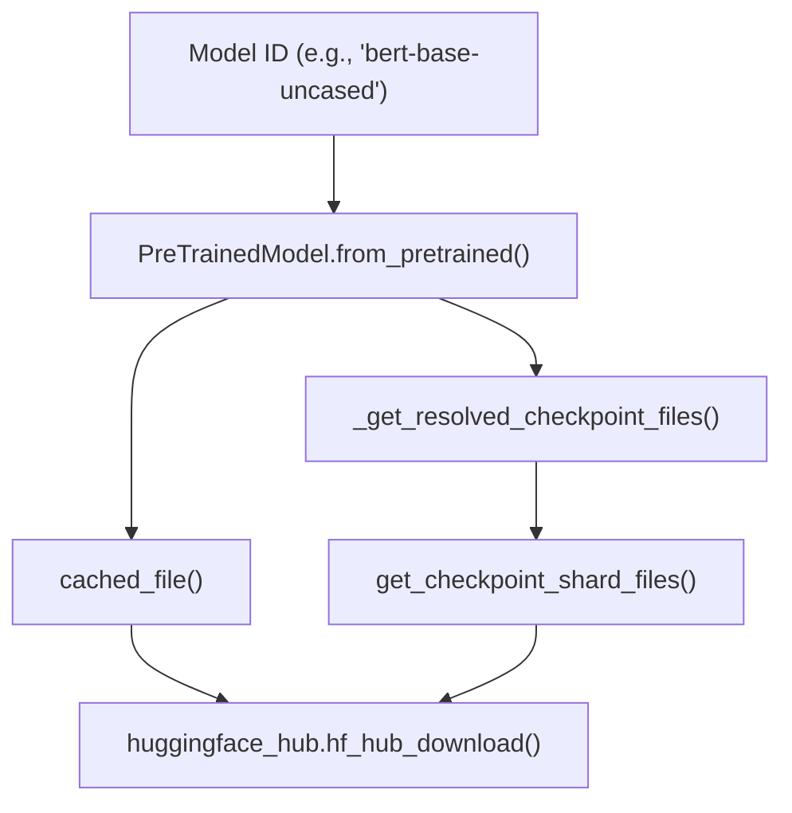
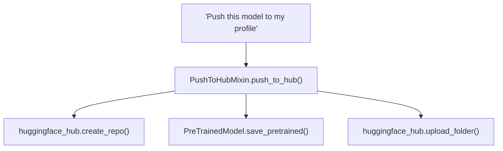

# Hub 集成与远程代码 (Hub Integration and Remote Code)

相关源文件

-   [docs/source/en/main\_classes/quantization.md](https://github.com/huggingface/transformers/blob/9a9997fd/docs/source/en/main_classes/quantization.md?plain=1)
-   [docs/source/en/quantization/overview.md](https://github.com/huggingface/transformers/blob/9a9997fd/docs/source/en/quantization/overview.md?plain=1)
-   [setup.py](https://github.com/huggingface/transformers/blob/9a9997fd/setup.py)
-   [src/transformers/configuration\_utils.py](https://github.com/huggingface/transformers/blob/9a9997fd/src/transformers/configuration_utils.py)
-   [src/transformers/conversion\_mapping.py](https://github.com/huggingface/transformers/blob/9a9997fd/src/transformers/conversion_mapping.py)
-   [src/transformers/core\_model\_loading.py](https://github.com/huggingface/transformers/blob/9a9997fd/src/transformers/core_model_loading.py)
-   [src/transformers/dependency\_versions\_table.py](https://github.com/huggingface/transformers/blob/9a9997fd/src/transformers/dependency_versions_table.py)
-   [src/transformers/feature\_extraction\_utils.py](https://github.com/huggingface/transformers/blob/9a9997fd/src/transformers/feature_extraction_utils.py)
-   [src/transformers/file\_utils.py](https://github.com/huggingface/transformers/blob/9a9997fd/src/transformers/file_utils.py)
-   [src/transformers/image\_processing\_base.py](https://github.com/huggingface/transformers/blob/9a9997fd/src/transformers/image_processing_base.py)
-   [src/transformers/integrations/\_\_init\_\_.py](https://github.com/huggingface/transformers/blob/9a9997fd/src/transformers/integrations/__init__.py)
-   [src/transformers/integrations/accelerate.py](https://github.com/huggingface/transformers/blob/9a9997fd/src/transformers/integrations/accelerate.py)
-   [src/transformers/integrations/peft.py](https://github.com/huggingface/transformers/blob/9a9997fd/src/transformers/integrations/peft.py)
-   [src/transformers/modeling\_utils.py](https://github.com/huggingface/transformers/blob/9a9997fd/src/transformers/modeling_utils.py)
-   [src/transformers/models/auto/video\_processing\_auto.py](https://github.com/huggingface/transformers/blob/9a9997fd/src/transformers/models/auto/video_processing_auto.py)
-   [src/transformers/processing\_utils.py](https://github.com/huggingface/transformers/blob/9a9997fd/src/transformers/processing_utils.py)
-   [src/transformers/quantizers/auto.py](https://github.com/huggingface/transformers/blob/9a9997fd/src/transformers/quantizers/auto.py)
-   [src/transformers/testing\_utils.py](https://github.com/huggingface/transformers/blob/9a9997fd/src/transformers/testing_utils.py)
-   [src/transformers/tokenization\_utils\_base.py](https://github.com/huggingface/transformers/blob/9a9997fd/src/transformers/tokenization_utils_base.py)
-   [src/transformers/trainer.py](https://github.com/huggingface/transformers/blob/9a9997fd/src/transformers/trainer.py)
-   [src/transformers/trainer\_utils.py](https://github.com/huggingface/transformers/blob/9a9997fd/src/transformers/trainer_utils.py)
-   [src/transformers/training\_args.py](https://github.com/huggingface/transformers/blob/9a9997fd/src/transformers/training_args.py)
-   [src/transformers/utils/\_\_init\_\_.py](https://github.com/huggingface/transformers/blob/9a9997fd/src/transformers/utils/__init__.py)
-   [src/transformers/utils/hub.py](https://github.com/huggingface/transformers/blob/9a9997fd/src/transformers/utils/hub.py)
-   [src/transformers/utils/import\_utils.py](https://github.com/huggingface/transformers/blob/9a9997fd/src/transformers/utils/import_utils.py)
-   [src/transformers/utils/loading\_report.py](https://github.com/huggingface/transformers/blob/9a9997fd/src/transformers/utils/loading_report.py)
-   [src/transformers/utils/quantization\_config.py](https://github.com/huggingface/transformers/blob/9a9997fd/src/transformers/utils/quantization_config.py)
-   [src/transformers/video\_processing\_utils.py](https://github.com/huggingface/transformers/blob/9a9997fd/src/transformers/video_processing_utils.py)
-   [tests/models/auto/test\_processor\_auto.py](https://github.com/huggingface/transformers/blob/9a9997fd/tests/models/auto/test_processor_auto.py)
-   [tests/peft\_integration/test\_peft\_integration.py](https://github.com/huggingface/transformers/blob/9a9997fd/tests/peft_integration/test_peft_integration.py)
-   [tests/test\_modeling\_common.py](https://github.com/huggingface/transformers/blob/9a9997fd/tests/test_modeling_common.py)
-   [tests/trainer/test\_trainer.py](https://github.com/huggingface/transformers/blob/9a9997fd/tests/trainer/test_trainer.py)
-   [tests/utils/test\_configuration\_utils.py](https://github.com/huggingface/transformers/blob/9a9997fd/tests/utils/test_configuration_utils.py)
-   [tests/utils/test\_core\_model\_loading.py](https://github.com/huggingface/transformers/blob/9a9997fd/tests/utils/test_core_model_loading.py)
-   [tests/utils/test\_feature\_extraction\_utils.py](https://github.com/huggingface/transformers/blob/9a9997fd/tests/utils/test_feature_extraction_utils.py)
-   [tests/utils/test\_image\_processing\_utils.py](https://github.com/huggingface/transformers/blob/9a9997fd/tests/utils/test_image_processing_utils.py)
-   [tests/utils/test\_modeling\_utils.py](https://github.com/huggingface/transformers/blob/9a9997fd/tests/utils/test_modeling_utils.py)
-   [tests/utils/test\_tokenization\_utils.py](https://github.com/huggingface/transformers/blob/9a9997fd/tests/utils/test_tokenization_utils.py)
-   [utils/check\_config\_attributes.py](https://github.com/huggingface/transformers/blob/9a9997fd/utils/check_config_attributes.py)

## 目的与范围 (Purpose and Scope)

本页面记录了 Transformers 库与 Hugging Face Hub 在模型分发方面的集成，以及用于加载自定义建模代码的 `trust_remote_code` 机制。内容涵盖：

-   **模型下载 (Model downloading)**：从 Hub 解析和下载模型，包括检查点文件查找、缓存和离线模式。
-   **Safetensors 格式 (Safetensors format)**：首选的序列化格式以及从旧版 `.bin` 文件的自动转换。
-   **模型上传 (Model uploading)**：通过 `push_to_hub` 将模型发布到 Hub，包括身份验证和模型卡片生成。
-   **远程代码执行 (Remote code execution)**：通过 `trust_remote_code` 加载带有自定义建模代码的模型，包括安全性考虑和动态模块系统。

有关使用 Hub 模型的 Auto 类的信息，请参阅第 2.1 节。有关文件下载后权重加载机制的详细信息，请参阅第 2.2 节。

---

## 模型下载流程 (Model Download Flow)

### 概述 (Overview)

当调用 `Model.from_pretrained(model_id)` 时，库会解析模型标识符，从 Hub 下载必要的文件，将它们缓存在本地，并将权重加载到模型中。该过程透明地处理简单检查点和分片（跨多个文件拆分）检查点。

### 模型下载与缓存架构 (Model Download and Caching Architecture)

**来源：** [src/transformers/modeling\_utils.py488-750](https://github.com/huggingface/transformers/blob/9a9997fd/src/transformers/modeling_utils.py#L488-L750) [src/transformers/utils/hub.py89-96](https://github.com/huggingface/transformers/blob/9a9997fd/src/transformers/utils/hub.py#L89-L96)

### 文件解析与格式选择 (File Resolution and Format Selection)

库更倾向于使用 `safetensors` 格式而非旧版的 PyTorch `.bin` 文件。`_get_resolved_checkpoint_files` 中的解析逻辑会按顺序尝试多个文件名：

1.  `model.safetensors` (单个文件)
2.  `model.safetensors.index.json` (分片索引)
3.  `pytorch_model.bin` (旧版单个文件)
4.  `pytorch_model.bin.index.json` (旧版分片索引)

如果找到了 `.bin` 文件但不存在 `safetensors` 文件，库可能会通过 `auto_conversion` 触发自动后台转换。

**来源：** [src/transformers/modeling\_utils.py524-700](https://github.com/huggingface/transformers/blob/9a9997fd/src/transformers/modeling_utils.py#L524-L700) [src/transformers/safetensors\_conversion.py97](https://github.com/huggingface/transformers/blob/9a9997fd/src/transformers/safetensors_conversion.py#L97-L97)

### 关键函数与参数 (Key Functions and Parameters)

| 函数/参数 | 位置 | 用途 |
| --- | --- | --- |
| `cached_file()` | [src/transformers/utils/hub.py89-96](https://github.com/huggingface/transformers/blob/9a9997fd/src/transformers/utils/hub.py#L89-L96) | 从 Hub 或本地路径下载并缓存单个文件。 |
| `_get_resolved_checkpoint_files()` | [src/transformers/modeling\_utils.py488-750](https://github.com/huggingface/transformers/blob/9a9997fd/src/transformers/modeling_utils.py#L488-L750) | 解析所有检查点文件（单个或分片）。 |
| `get_checkpoint_shard_files()` | [src/transformers/utils/hub.py122](https://github.com/huggingface/transformers/blob/9a9997fd/src/transformers/utils/hub.py#L122-L122) | 下载分片检查点索引和各个分片。 |
| `LoadStateDictConfig` | [src/transformers/modeling\_utils.py161-186](https://github.com/huggingface/transformers/blob/9a9997fd/src/transformers/modeling_utils.py#L161-L186) | 包含加载偏好（如 `use_safetensors`）的数据类。 |
| `use_safetensors` | `from_pretrained` 参数 | 控制格式：`True`（仅 safetensors），`False`（仅 .bin），`None`（优先选择 safetensors）。 |
| `local_files_only` | `from_pretrained` 参数 | 如果为 `True`，仅使用缓存文件，不进行下载。 |

**来源：** [src/transformers/modeling\_utils.py161-186](https://github.com/huggingface/transformers/blob/9a9997fd/src/transformers/modeling_utils.py#L161-L186) [src/transformers/modeling\_utils.py488-750](https://github.com/huggingface/transformers/blob/9a9997fd/src/transformers/modeling_utils.py#L488-L750) [src/transformers/utils/hub.py122](https://github.com/huggingface/transformers/blob/9a9997fd/src/transformers/utils/hub.py#L122-L122)

---

## Safetensors 格式 (Safetensors Format)

### 为什么选择 Safetensors (Why Safetensors)

`safetensors` 是首选的检查点格式，因为它安全（不会通过 pickle 执行任意代码）、快速（内存映射）并支持高效的部分加载。

**来源：** [src/transformers/modeling\_utils.py38-39](https://github.com/huggingface/transformers/blob/9a9997fd/src/transformers/modeling_utils.py#L38-L39) [src/transformers/safetensors\_conversion.py97](https://github.com/huggingface/transformers/blob/9a9997fd/src/transformers/safetensors_conversion.py#L97-L97)

### 自动转换机制 (Auto-Conversion Mechanism)

当在 Hub 上发现模型为 `.bin` 格式但不存在 `safetensors` 版本时，库可以触发自动转换。此过程在后台线程中使用 `auto_conversion` 运行，以避免阻塞主加载流。

**来源：** [src/transformers/modeling\_utils.py603-670](https://github.com/huggingface/transformers/blob/9a9997fd/src/transformers/modeling_utils.py#L603-L670) [src/transformers/safetensors\_conversion.py97](https://github.com/huggingface/transformers/blob/9a9997fd/src/transformers/safetensors_conversion.py#L97-L97)

### 加载权重 (Loading Weights)

`LoadStateDictConfig` 类管理在权重加载阶段是否应使用 `safetensors`。实际的加载逻辑在 `modeling_utils.py` 中处理，利用 `safetensors.torch.safe_open` 实现高效访问。

**来源：** [src/transformers/modeling\_utils.py38-39](https://github.com/huggingface/transformers/blob/9a9997fd/src/transformers/modeling_utils.py#L38-L39) [src/transformers/modeling\_utils.py161-186](https://github.com/huggingface/transformers/blob/9a9997fd/src/transformers/modeling_utils.py#L161-L186)

---

## 将模型推送到 Hub (Pushing Models to Hub)

### 推送到 Hub 的工作流 (Push to Hub Workflow)

`PushToHubMixin` 提供了模型、分词器和配置使用的 `push_to_hub` 方法。

**来源：** [src/transformers/utils/hub.py86](https://github.com/huggingface/transformers/blob/9a9997fd/src/transformers/utils/hub.py#L86-L86) [src/transformers/modeling\_utils.py2550-2700](https://github.com/huggingface/transformers/blob/9a9997fd/src/transformers/modeling_utils.py#L2550-L2700) (推送逻辑的大致范围)。

### 上传的关键参数 (Key Parameters for Uploading)

| 参数 | 位置 | 描述 |
| --- | --- | --- |
| `repo_id` | `push_to_hub` 参数 | Hub 上存储库的名称。 |
| `use_temp_dir` | `push_to_hub` 参数 | 在上传之前是否为文件使用临时目录。 |
| `commit_message` | `push_to_hub` 参数 | Hub 上 git 提交的消息。 |
| `private` | `push_to_hub` 参数 | 存储库是否应为私有。 |

**来源：** [src/transformers/modeling\_utils.py2550-2700](https://github.com/huggingface/transformers/blob/9a9997fd/src/transformers/modeling_utils.py#L2550-L2700)

---

## 信任远程代码 (Trust Remote Code)

### 什么是远程代码？ (What is Remote Code?)

Hub 上的模型可以在 Python 文件中包含自定义建模代码。这允许研究人员在将其集成到 `transformers` 库之前分享新颖的架构。`trust_remote_code=True` 参数明确选择下载并执行此自定义代码。

### 动态模块加载流程 (Dynamic Module Loading Flow)

当将 `trust_remote_code=True` 传递给 `from_pretrained` 时，库会在 `config.json` 中查找 `auto_map`。

1.  **解析 (Resolution)**：`resolve_trust_remote_code` 检查参数和环境。
2.  **下载 (Download)**：自定义 `.py` 文件被下载到本地缓存。
3.  **导入 (Import)**：`get_class_from_dynamic_module` 从下载的文件中导入类。

**来源：** [src/transformers/dynamic\_module\_utils.py54](https://github.com/huggingface/transformers/blob/9a9997fd/src/transformers/dynamic_module_utils.py#L54-L54) [src/transformers/modeling\_utils.py54](https://github.com/huggingface/transformers/blob/9a9997fd/src/transformers/modeling_utils.py#L54-L54)

### 安全警告 (Security Warning)

**⚠️ 安全警告：** 设置 `trust_remote_code=True` 允许执行来自 Hub 的任意 Python 代码。仅对来自信任来源的模型使用此参数。

---

## 与 Trainer 的集成 (Integration with Trainer)

`Trainer` 类在训练生命周期中自动进行 Hub 集成。

-   **自动上传 (Automatic Upload)**：如果在 `TrainingArguments` 中设置了 `push_to_hub=True`，训练器将上传模型。
-   **Hub 策略 (Hub Strategy)**：由 `hub_strategy` 控制（例如 `every_save`、`end`、`checkpoint`）。
-   **模型卡片 (Model Card)**：`Trainer` 使用 `TrainingSummary` 和 `create_and_tag_model_card` 为 Hub 存储库生成文档。

**来源：** [src/transformers/trainer.py49](https://github.com/huggingface/transformers/blob/9a9997fd/src/transformers/trainer.py#L49-L49) [src/transformers/trainer.py74](https://github.com/huggingface/transformers/blob/9a9997fd/src/transformers/trainer.py#L74-L74) [src/transformers/training\_args.py179-204](https://github.com/huggingface/transformers/blob/9a9997fd/src/transformers/training_args.py#L179-L204)

### Trainer Hub 参数 (Trainer Hub Parameters)

| 参数 | 类型 | 默认值 | 描述 |
| --- | --- | --- | --- |
| `push_to_hub` | `bool` | `False` | 是否将模型推送到 Hub。 |
| `hub_model_id` | `str` | `None` | Hub 上存储库的名称。 |
| `hub_strategy` | `HubStrategy` | `"every_save"` | 何时推送到 Hub。 |
| `hub_token` | `str` | `None` | 用于 Hub 身份验证的令牌。 |

**来源：** [src/transformers/training\_args.py179-204](https://github.com/huggingface/transformers/blob/9a9997fd/src/transformers/training_args.py#L179-L204) [src/transformers/trainer\_utils.py122](https://github.com/huggingface/transformers/blob/9a9997fd/src/transformers/trainer_utils.py#L122-L122) (HubStrategy 定义)。
