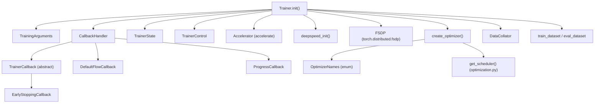
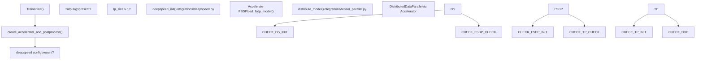

# 训练系统 (Training System)

相关源文件 (Relevant source files)

-   [docs/source/en/main\_classes/callback.md](https://github.com/huggingface/transformers/blob/9a9997fd/docs/source/en/main_classes/callback.md?plain=1)
-   [docs/source/en/main\_classes/quantization.md](https://github.com/huggingface/transformers/blob/9a9997fd/docs/source/en/main_classes/quantization.md?plain=1)
-   [docs/source/en/model\_doc/rt\_detr.md](https://github.com/huggingface/transformers/blob/9a9997fd/docs/source/en/model_doc/rt_detr.md?plain=1)
-   [docs/source/en/model\_doc/rt\_detr\_v2.md](https://github.com/huggingface/transformers/blob/9a9997fd/docs/source/en/model_doc/rt_detr_v2.md?plain=1)
-   [docs/source/en/quantization/overview.md](https://github.com/huggingface/transformers/blob/9a9997fd/docs/source/en/quantization/overview.md?plain=1)
-   [docs/source/ja/main\_classes/callback.md](https://github.com/huggingface/transformers/blob/9a9997fd/docs/source/ja/main_classes/callback.md?plain=1)
-   [docs/source/ko/main\_classes/callback.md](https://github.com/huggingface/transformers/blob/9a9997fd/docs/source/ko/main_classes/callback.md?plain=1)
-   [docs/source/zh/main\_classes/callback.md](https://github.com/huggingface/transformers/blob/9a9997fd/docs/source/zh/main_classes/callback.md?plain=1)
-   [examples/pytorch/README.md](https://github.com/huggingface/transformers/blob/9a9997fd/examples/pytorch/README.md?plain=1)
-   [examples/pytorch/instance-segmentation/README.md](https://github.com/huggingface/transformers/blob/9a9997fd/examples/pytorch/instance-segmentation/README.md?plain=1)
-   [examples/pytorch/object-detection/README.md](https://github.com/huggingface/transformers/blob/9a9997fd/examples/pytorch/object-detection/README.md?plain=1)
-   [examples/pytorch/test\_accelerate\_examples.py](https://github.com/huggingface/transformers/blob/9a9997fd/examples/pytorch/test_accelerate_examples.py)
-   [examples/pytorch/test\_pytorch\_examples.py](https://github.com/huggingface/transformers/blob/9a9997fd/examples/pytorch/test_pytorch_examples.py)
-   [setup.py](https://github.com/huggingface/transformers/blob/9a9997fd/setup.py)
-   [src/transformers/conversion\_mapping.py](https://github.com/huggingface/transformers/blob/9a9997fd/src/transformers/conversion_mapping.py)
-   [src/transformers/core\_model\_loading.py](https://github.com/huggingface/transformers/blob/9a9997fd/src/transformers/core_model_loading.py)
-   [src/transformers/dependency\_versions\_table.py](https://github.com/huggingface/transformers/blob/9a9997fd/src/transformers/dependency_versions_table.py)
-   [src/transformers/integrations/\_\_init\_\_.py](https://github.com/huggingface/transformers/blob/9a9997fd/src/transformers/integrations/__init__.py)
-   [src/transformers/integrations/accelerate.py](https://github.com/huggingface/transformers/blob/9a9997fd/src/transformers/integrations/accelerate.py)
-   [src/transformers/integrations/integration\_utils.py](https://github.com/huggingface/transformers/blob/9a9997fd/src/transformers/integrations/integration_utils.py)
-   [src/transformers/integrations/peft.py](https://github.com/huggingface/transformers/blob/9a9997fd/src/transformers/integrations/peft.py)
-   [src/transformers/modeling\_utils.py](https://github.com/huggingface/transformers/blob/9a9997fd/src/transformers/modeling_utils.py)
-   [src/transformers/models/rt\_detr/\_\_init\_\_.py](https://github.com/huggingface/transformers/blob/9a9997fd/src/transformers/models/rt_detr/__init__.py)
-   [src/transformers/quantizers/auto.py](https://github.com/huggingface/transformers/blob/9a9997fd/src/transformers/quantizers/auto.py)
-   [src/transformers/testing\_utils.py](https://github.com/huggingface/transformers/blob/9a9997fd/src/transformers/testing_utils.py)
-   [src/transformers/trainer.py](https://github.com/huggingface/transformers/blob/9a9997fd/src/transformers/trainer.py)
-   [src/transformers/trainer\_callback.py](https://github.com/huggingface/transformers/blob/9a9997fd/src/transformers/trainer_callback.py)
-   [src/transformers/trainer\_utils.py](https://github.com/huggingface/transformers/blob/9a9997fd/src/transformers/trainer_utils.py)
-   [src/transformers/training\_args.py](https://github.com/huggingface/transformers/blob/9a9997fd/src/transformers/training_args.py)
-   [src/transformers/utils/\_\_init\_\_.py](https://github.com/huggingface/transformers/blob/9a9997fd/src/transformers/utils/__init__.py)
-   [src/transformers/utils/import\_utils.py](https://github.com/huggingface/transformers/blob/9a9997fd/src/transformers/utils/import_utils.py)
-   [src/transformers/utils/loading\_report.py](https://github.com/huggingface/transformers/blob/9a9997fd/src/transformers/utils/loading_report.py)
-   [src/transformers/utils/quantization\_config.py](https://github.com/huggingface/transformers/blob/9a9997fd/src/transformers/utils/quantization_config.py)
-   [tests/peft\_integration/test\_peft\_integration.py](https://github.com/huggingface/transformers/blob/9a9997fd/tests/peft_integration/test_peft_integration.py)
-   [tests/test\_modeling\_common.py](https://github.com/huggingface/transformers/blob/9a9997fd/tests/test_modeling_common.py)
-   [tests/trainer/test\_trainer.py](https://github.com/huggingface/transformers/blob/9a9997fd/tests/trainer/test_trainer.py)
-   [tests/trainer/test\_trainer\_callback.py](https://github.com/huggingface/transformers/blob/9a9997fd/tests/trainer/test_trainer_callback.py)
-   [tests/trainer/test\_trainer\_checkpointing.py](https://github.com/huggingface/transformers/blob/9a9997fd/tests/trainer/test_trainer_checkpointing.py)
-   [tests/trainer/test\_training\_args.py](https://github.com/huggingface/transformers/blob/9a9997fd/tests/trainer/test_training_args.py)
-   [tests/trainer/trainer\_test\_utils.py](https://github.com/huggingface/transformers/blob/9a9997fd/tests/trainer/trainer_test_utils.py)
-   [tests/utils/test\_core\_model\_loading.py](https://github.com/huggingface/transformers/blob/9a9997fd/tests/utils/test_core_model_loading.py)
-   [tests/utils/test\_modeling\_utils.py](https://github.com/huggingface/transformers/blob/9a9997fd/tests/utils/test_modeling_utils.py)
-   [utils/check\_config\_attributes.py](https://github.com/huggingface/transformers/blob/9a9997fd/utils/check_config_attributes.py)

本页面介绍了 `transformers` 库中训练系统的组件：`Trainer` 类、`TrainingArguments`、回调 (Callback) 系统、分布式训练 (Distributed Training) 后端以及优化工具。

有关训练循环 (Training Loop) 内部逻辑和检查点 (Checkpoint) 逻辑，请参阅 [Trainer 架构与训练循环 (Trainer Architecture and Training Loop)](/huggingface/transformers/3.1-trainer-architecture-and-training-loop)。有关所有 `TrainingArguments` 字段的详细信息，请参阅 [TrainingArguments 配置 (TrainingArguments Configuration)](/huggingface/transformers/3.2-trainingarguments-configuration)。有关回调事件生命周期，请参阅 [回调与可扩展性 (Callbacks and Extensibility)](/huggingface/transformers/3.3-callbacks-and-extensibility)。有关 DeepSpeed 和 FSDP 集成详情，请参阅 [分布式训练支持 (Distributed Training Support)](/huggingface/transformers/3.4-distributed-training-support)。有关优化器 (Optimizer) 和调度器 (Scheduler) 的具体信息，请参阅 [优化与调度 (Optimization and Scheduling)](/huggingface/transformers/3.5-optimization-and-scheduling)。

---

## 概览 (Overview)

训练系统由几个协作组件组成。其核心是 `Trainer` 类，负责编排训练循环。配置完全通过 `TrainingArguments` 提供。可扩展性由回调系统处理。分布式和硬件相关的事务委托给 [Accelerate](https://github.com/huggingface/transformers/blob/9a9997fd/Accelerate) 以及可选的后端，如 DeepSpeed 和 FSDP。

**组件概览 (Component overview)：**

| 组件 (Component) | 文件 (File) | 角色 (Role) |
| --- | --- | --- |
| `Trainer` | [src/transformers/trainer.py255-348](https://github.com/huggingface/transformers/blob/9a9997fd/src/transformers/trainer.py#L255-L348) | 主要的训练/评估/预测驱动程序 |
| `TrainingArguments` | [src/transformers/training\_args.py179-600](https://github.com/huggingface/transformers/blob/9a9997fd/src/transformers/training_args.py#L179-L600) | 所有超参数和配置 |
| `TrainerCallback` | [src/transformers/trainer\_callback.py165-248](https://github.com/huggingface/transformers/blob/9a9997fd/src/transformers/trainer_callback.py#L165-L248) | 自定义逻辑的事件钩子 (Event Hooks) |
| `TrainerState` | [src/transformers/trainer\_callback.py34-120](https://github.com/huggingface/transformers/blob/9a9997fd/src/transformers/trainer_callback.py#L34-L120) | 可变的训练进度状态 |
| `TrainerControl` | [src/transformers/trainer\_callback.py123-162](https://github.com/huggingface/transformers/blob/9a9997fd/src/transformers/trainer_callback.py#L123-L162) | 用于控制循环的信号对象 |
| `CallbackHandler` | [src/transformers/trainer\_callback.py251-404](https://github.com/huggingface/transformers/blob/9a9997fd/src/transformers/trainer_callback.py#L251-L404) | 将事件分发给所有注册的回调 |
| `OptimizerNames` | [src/transformers/training\_args.py111-158](https://github.com/huggingface/transformers/blob/9a9997fd/src/transformers/training_args.py#L111-L158) | 支持的优化器名称枚举 |
| `trainer_utils.py` | [src/transformers/trainer\_utils.py1-147](https://github.com/huggingface/transformers/blob/9a9997fd/src/transformers/trainer_utils.py#L1-L147) | 种子控制、评估类型、检查点实用程序 |
| `trainer_pt_utils.py` | [src/transformers/trainer\_pt\_utils.py1-115](https://github.com/huggingface/transformers/blob/9a9997fd/src/transformers/trainer_pt_utils.py#L1-L115) | PyTorch 特定的数据/分布式助手 |

**来源 (Sources)：** [src/transformers/trainer.py255-348](https://github.com/huggingface/transformers/blob/9a9997fd/src/transformers/trainer.py#L255-L348) [src/transformers/training\_args.py179-200](https://github.com/huggingface/transformers/blob/9a9997fd/src/transformers/training_args.py#L179-L200) [src/transformers/trainer\_callback.py34-300](https://github.com/huggingface/transformers/blob/9a9997fd/src/transformers/trainer_callback.py#L34-L300)

---

## 系统架构 (System Architecture)

**图表：训练系统组件关系 (Diagram: Training System Component Relationships)**

**来源 (Sources)：** [src/transformers/trainer.py362-612](https://github.com/huggingface/transformers/blob/9a9997fd/src/transformers/trainer.py#L362-L612) [src/transformers/trainer\_callback.py1-50](https://github.com/huggingface/transformers/blob/9a9997fd/src/transformers/trainer_callback.py#L1-L50) [src/transformers/training\_args.py111-158](https://github.com/huggingface/transformers/blob/9a9997fd/src/transformers/training_args.py#L111-L158)

---

## Trainer

`Trainer` 类 ([src/transformers/trainer.py255-348](https://github.com/huggingface/transformers/blob/9a9997fd/src/transformers/trainer.py#L255-L348)) 是库中主要的训练抽象。它是一个仅限 PyTorch 的类，并且需要 `accelerate` 作为依赖项，通过 `@requires(backends=("torch", "accelerate"))` 装饰器强制执行。

### 构造函数参数 (Constructor Arguments)

`Trainer.__init__` 方法 ([src/transformers/trainer.py362-381](https://github.com/huggingface/transformers/blob/9a9997fd/src/transformers/trainer.py#L362-L381)) 接收：

| 参数 (Argument) | 类型 (Type) | 用途 (Purpose) |
| --- | --- | --- |
| `model` | `PreTrainedModel | nn.Module` | 要训练的模型 |
| `args` | `TrainingArguments` | 所有训练配置 |
| `data_collator` | `DataCollator` | 批次组装函数 |
| `train_dataset` | `Dataset | IterableDataset` | 训练数据 |
| `eval_dataset` | `Dataset | dict` | 评估数据 |
| `processing_class` | Tokenizer/Processor | 用于 `DataCollatorWithPadding` 和保存 |
| `model_init` | `Callable` | 超参数搜索 (Hyperparameter Search) 的工厂函数 |
| `compute_loss_func` | `Callable` | 自定义损失函数 |
| `compute_metrics` | `Callable[[EvalPrediction], dict]` | 评估时的指标计算 |
| `callbacks` | `list[TrainerCallback]` | 附加回调 |
| `optimizers` | `tuple[Optimizer, LRScheduler]` | 预构建的优化器/调度器对 |

### 初始化序列 (Initialization Sequence)

`Trainer.__init__` 遵循记录在案的 11 步序列 ([src/transformers/trainer.py383-612](https://github.com/huggingface/transformers/blob/9a9997fd/src/transformers/trainer.py#L383-L612))：

1.  **参数与种子 (Args & seed)** — 应用 `set_seed` 或 `enable_full_determinism` [src/transformers/trainer.py392-398](https://github.com/huggingface/transformers/blob/9a9997fd/src/transformers/trainer.py#L392-L398)
2.  **Accelerator 与日志 (Accelerator & logging)** — 调用 `create_accelerator_and_postprocess()`，设置内存跟踪器 [src/transformers/trainer.py409-411](https://github.com/huggingface/transformers/blob/9a9997fd/src/transformers/trainer.py#L409-L411)
3.  **模型解析 (Model resolution)** — 验证 `model` 与 `model_init`，如果要求则应用 Liger 内核，调用 `validate_quantization_for_training` [src/transformers/trainer.py421-455](https://github.com/huggingface/transformers/blob/9a9997fd/src/transformers/trainer.py#L421-L455)
4.  **分布式策略 (Distributed strategy)** — 检测模型并行 (Model Parallelism)、FSDP、DeepSpeed [src/transformers/trainer.py464-488](https://github.com/huggingface/transformers/blob/9a9997fd/src/transformers/trainer.py#L464-L488)
5.  **设备放置 (Device placement)** — 将模型移至设备，除非分布式策略管理放置 [src/transformers/trainer.py494-504](https://github.com/huggingface/transformers/blob/9a9997fd/src/transformers/trainer.py#L494-L504)
6.  **模型内省 (Model introspection)** — 检测 `accepts_loss_kwargs`，确定标签名称，创建 `LabelSmoother` [src/transformers/trainer.py507-531](https://github.com/huggingface/transformers/blob/9a9997fd/src/transformers/trainer.py#L507-L531)
7.  **存储初始化参数 (Store init arguments)** — 设置 `data_collator`、数据集、`compute_metrics`、优化器引用 [src/transformers/trainer.py534-550](https://github.com/huggingface/transformers/blob/9a9997fd/src/transformers/trainer.py#L534-L550)
8.  **回调 (Callbacks)** — 使用默认 + 报告 + 用户回调组装 `CallbackHandler` [src/transformers/trainer.py552-566](https://github.com/huggingface/transformers/blob/9a9997fd/src/transformers/trainer.py#L552-L566)
9.  **Hub 与输出 (Hub & output)** — 如果 `push_to_hub=True` 则调用 `init_hf_repo()`，创建 `output_dir` [src/transformers/trainer.py569-583](https://github.com/huggingface/transformers/blob/9a9997fd/src/transformers/trainer.py#L569-L583)
10.  **训练状态 (Training state)** — 创建 `TrainerState` 和 `TrainerControl` [src/transformers/trainer.py586-591](https://github.com/huggingface/transformers/blob/9a9997fd/src/transformers/trainer.py#L586-L591)
11.  **完成 (Finalize)** — 在模型配置上设置 `use_cache`，处理 XLA FSDPv2 网格 (Mesh) [src/transformers/trainer.py593-612](https://github.com/huggingface/transformers/blob/9a9997fd/src/transformers/trainer.py#L593-L612)

**来源 (Sources)：** [src/transformers/trainer.py330-612](https://github.com/huggingface/transformers/blob/9a9997fd/src/transformers/trainer.py#L330-L612)

---

## TrainingArguments

`TrainingArguments` ([src/transformers/training\_args.py179-600](https://github.com/huggingface/transformers/blob/9a9997fd/src/transformers/training_args.py#L179-L600)) 是一个 `@dataclass`，是所有训练行为的单一配置对象。它被设计为可以通过 `HfArgumentParser` 从命令行解析。

### 配置域 (Configuration Domains)

**图表：TrainingArguments 字段组 (Diagram: TrainingArguments Field Groups)**

### 显著枚举 (Notable Enums)

`OptimizerNames` ([src/transformers/training\_args.py111-158](https://github.com/huggingface/transformers/blob/9a9997fd/src/transformers/training_args.py#L111-L158)) 列出了所有识别的优化器标识符。关键值：

| 枚举值 (Enum Value) | 字符串键 (String Key) | 需要 (Requires) |
| --- | --- | --- |
| `ADAMW_TORCH` | `"adamw_torch"` | PyTorch 内置 [src/transformers/training\_args.py116](https://github.com/huggingface/transformers/blob/9a9997fd/src/transformers/training_args.py#L116-L116) |
| `ADAMW_TORCH_FUSED` | `"adamw_torch_fused"` | PyTorch >= 2.0 [src/transformers/training\_args.py117](https://github.com/huggingface/transformers/blob/9a9997fd/src/transformers/training_args.py#L117-L117) |
| `ADAFACTOR` | `"adafactor"` | 内置 [src/transformers/training\_args.py121](https://github.com/huggingface/transformers/blob/9a9997fd/src/transformers/training_args.py#L121-L121) |
| `ADAMW_BNB` | `"adamw_bnb_8bit"` | `bitsandbytes` [src/transformers/training\_args.py128](https://github.com/huggingface/transformers/blob/9a9997fd/src/transformers/training_args.py#L128-L128) |
| `GALORE_ADAMW` | `"galore_adamw"` | `galore_torch` [src/transformers/training\_args.py143](https://github.com/huggingface/transformers/blob/9a9997fd/src/transformers/training_args.py#L143-L143) |
| `LOMO` | `"lomo"` | `lomo` [src/transformers/training\_args.py149](https://github.com/huggingface/transformers/blob/9a9997fd/src/transformers/training_args.py#L149-L149) |
| `SCHEDULE_FREE_ADAMW` | `"schedule_free_adamw"` | `schedulefree` [src/transformers/training\_args.py153](https://github.com/huggingface/transformers/blob/9a9997fd/src/transformers/training_args.py#L153-L153) |

**来源 (Sources)：** [src/transformers/training\_args.py179-600](https://github.com/huggingface/transformers/blob/9a9997fd/src/transformers/training_args.py#L179-L600) [src/transformers/training\_args.py111-158](https://github.com/huggingface/transformers/blob/9a9997fd/src/transformers/training_args.py#L111-L158)

---

## 回调系统 (Callback System)

回调系统在整个训练循环中提供了结构化的注入点 (Injection Points)。

**图表：回调事件流 (Diagram: Callback Event Flow)**

> **[Mermaid sequence]**
> *(图表结构无法解析)*

### 核心类型 (Core Types)

-   **`TrainerCallback`** ([src/transformers/trainer\_callback.py165-248](https://github.com/huggingface/transformers/blob/9a9997fd/src/transformers/trainer_callback.py#L165-L248)) — 带有事件方法的抽象基类。所有事件方法都接收 `(args: TrainingArguments, state: TrainerState, control: TrainerControl, **kwargs)`。
-   **`TrainerState`** ([src/transformers/trainer\_callback.py34-120](https://github.com/huggingface/transformers/blob/9a9997fd/src/transformers/trainer_callback.py#L34-L120)) — 可变的数据类，跟踪 `global_step`、`epoch`、`log_history`、`best_metric`、`best_model_checkpoint`。序列化为 `trainer_state.json`。
-   **`TrainerControl`** ([src/transformers/trainer\_callback.py123-162](https://github.com/huggingface/transformers/blob/9a9997fd/src/transformers/trainer_callback.py#L123-L162)) — 带有布尔标志的数据类：`should_training_stop`、`should_epoch_stop`、`should_save`、`should_evaluate`、`should_log`。
-   **`CallbackHandler`** ([src/transformers/trainer\_callback.py251-404](https://github.com/huggingface/transformers/blob/9a9997fd/src/transformers/trainer_callback.py#L251-L404)) — 保存回调的有序列表并分发事件。

### 内置回调 (Built-in Callbacks)

| 回调类 (Callback Class) | 用途 (Purpose) |
| --- | --- |
| `DefaultFlowCallback` | 根据策略设置 `should_log`、`should_evaluate`、`should_save` [src/transformers/trainer\_callback.py407-466](https://github.com/huggingface/transformers/blob/9a9997fd/src/transformers/trainer_callback.py#L407-L466) |
| `ProgressCallback` | tqdm 进度条显示 [src/transformers/trainer\_callback.py474-533](https://github.com/huggingface/transformers/blob/9a9997fd/src/transformers/trainer_callback.py#L474-L533) |
| `PrinterCallback` | 简单的基于打印的进度 [src/transformers/trainer\_callback.py536-574](https://github.com/huggingface/transformers/blob/9a9997fd/src/transformers/trainer_callback.py#L536-L574) |
| `EarlyStoppingCallback` | 当指标停滞时停止训练 [tests/trainer/test\_trainer.py37](https://github.com/huggingface/transformers/blob/9a9997fd/tests/trainer/test_trainer.py#L37-L37) |

**来源 (Sources)：** [src/transformers/trainer\_callback.py1-404](https://github.com/huggingface/transformers/blob/9a9997fd/src/transformers/trainer_callback.py#L1-L404) [src/transformers/trainer.py552-566](https://github.com/huggingface/transformers/blob/9a9997fd/src/transformers/trainer.py#L552-L566)

---

## 分布式训练集成 (Distributed Training Integration)

**图表：Trainer 中的分布式后端选择 (Diagram: Distributed Backend Selection in Trainer)**

### Accelerate

每个 `Trainer` 都会创建一个 `Accelerator` 实例 ([src/transformers/trainer.py409](https://github.com/huggingface/transformers/blob/9a9997fd/src/transformers/trainer.py#L409-L409))。`Accelerator` 处理设备放置、混合精度 (Mixed Precision) 以及 DDP 中的梯度同步 (Gradient Synchronization)。

### DeepSpeed

DeepSpeed 集成位于 `src/transformers/integrations/deepspeed.py`。从 `Trainer` 调用的关键函数：

-   `deepspeed_init(trainer, num_training_steps)` [src/transformers/trainer.py63](https://github.com/huggingface/transformers/blob/9a9997fd/src/transformers/trainer.py#L63-L63)
-   `deepspeed_load_checkpoint(deepspeed_engine, checkpoint_path)` [src/transformers/trainer.py64](https://github.com/huggingface/transformers/blob/9a9997fd/src/transformers/trainer.py#L64-L64)
-   `propagate_args_to_deepspeed(trainer, auto_find_batch_size)` [src/transformers/trainer.py67](https://github.com/huggingface/transformers/blob/9a9997fd/src/transformers/trainer.py#L67-L67)

### FSDP

FSDP 通过 `args.fsdp` 和 `args.fsdp_config` 配置。`Trainer` 使用 Accelerate 的 FSDP 实用程序：

-   `save_fsdp_model` / `load_fsdp_model` [src/transformers/trainer.py221-224](https://github.com/huggingface/transformers/blob/9a9997fd/src/transformers/trainer.py#L221-L224)
-   `get_fsdp_ckpt_kwargs` [src/transformers/trainer.py69](https://github.com/huggingface/transformers/blob/9a9997fd/src/transformers/trainer.py#L69-L69)

**来源 (Sources)：** [src/transformers/trainer.py407-488](https://github.com/huggingface/transformers/blob/9a9997fd/src/transformers/trainer.py#L407-L488) [src/transformers/modeling\_utils.py56-83](https://github.com/huggingface/transformers/blob/9a9997fd/src/transformers/modeling_utils.py#L56-L83)

---

## 优化与调度 (Optimization and Scheduling)

### 优化器创建 (Optimizer Creation)

`Trainer.create_optimizer()` 将 `OptimizerNames` 映射到实际实现。对于 `adamw_torch`，它创建 `torch.optim.AdamW`，其参数组将偏置 (Bias) 和 `LayerNorm` 参数从 `weight_decay` 中排除 [src/transformers/training\_args.py116](https://github.com/huggingface/transformers/blob/9a9997fd/src/transformers/training_args.py#L116-L116)。

### 调度器创建 (Scheduler Creation)

来自 `src/transformers/optimization.py` 的 `get_scheduler(name, optimizer, ...)` 将 `lr_scheduler_type` 映射到诸如 `linear`、`cosine` 或 `polynomial` 之类的调度 [src/transformers/optimization.py80](https://github.com/huggingface/transformers/blob/9a9997fd/src/transformers/optimization.py#L80-L80)。

### 量化验证 (Quantization Validation)

`validate_quantization_for_training(model)` ([src/transformers/trainer\_utils.py146](https://github.com/huggingface/transformers/blob/9a9997fd/src/transformers/trainer_utils.py#L146-L146)) 在 `Trainer.__init__` 期间被调用。它确保量化模型 (Quantized Models) 与训练设置兼容（例如，检查 PEFT 适配器）。

**来源 (Sources)：** [src/transformers/trainer\_utils.py146](https://github.com/huggingface/transformers/blob/9a9997fd/src/transformers/trainer_utils.py#L146-L146) [src/transformers/training\_args.py111-158](https://github.com/huggingface/transformers/blob/9a9997fd/src/transformers/training_args.py#L111-L158) [src/transformers/trainer.py546-548](https://github.com/huggingface/transformers/blob/9a9997fd/src/transformers/trainer.py#L546-L548)

---

## 检查点 (Checkpointing)

每个保存事件写入的检查点文件包括模型权重 (`model.safetensors`)、`config.json`、`trainer_state.json` 以及优化器/调度器状态 [src/transformers/utils/import\_utils.py101-104](https://github.com/huggingface/transformers/blob/9a9997fd/src/transformers/utils/import_utils.py#L101-L104)。

-   `save_strategy` 控制频率：`"steps"`、`"epoch"` 或 `"no"`。
-   `save_total_limit` 触发 `rotate_checkpoints()` [src/transformers/trainer\_utils.py139](https://github.com/huggingface/transformers/blob/9a9997fd/src/transformers/trainer_utils.py#L139-L139) 以删除最旧的检查点。
-   `save_only_model=True` 跳过优化器/调度器状态以减小体积。

**来源 (Sources)：** [src/transformers/trainer.py238-246](https://github.com/huggingface/transformers/blob/9a9997fd/src/transformers/trainer.py#L238-L246) [src/transformers/trainer\_utils.py117-147](https://github.com/huggingface/transformers/blob/9a9997fd/src/transformers/trainer_utils.py#L117-L147)
