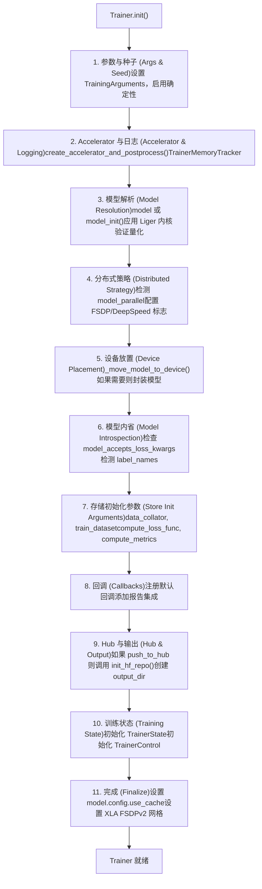
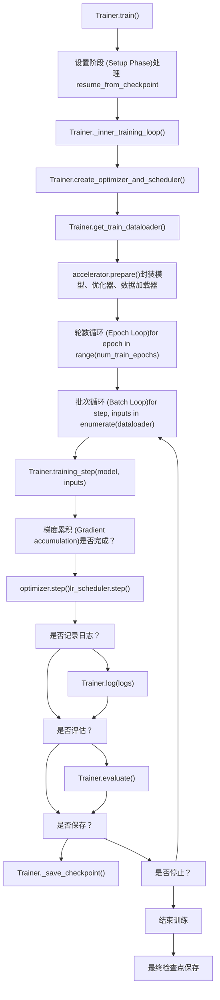
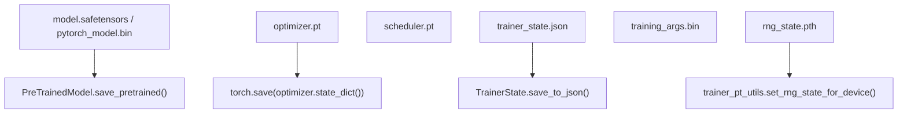

# Trainer 架构与训练循环 (Trainer Architecture and Training Loop)

相关源文件 (Relevant source files)

-   [docs/source/ar/training.md](https://github.com/huggingface/transformers/blob/9a9997fd/docs/source/ar/training.md?plain=1)
-   [docs/source/de/training.md](https://github.com/huggingface/transformers/blob/9a9997fd/docs/source/de/training.md?plain=1)
-   [docs/source/en/\_config.py](https://github.com/huggingface/transformers/blob/9a9997fd/docs/source/en/_config.py)
-   [docs/source/en/data\_collators.md](https://github.com/huggingface/transformers/blob/9a9997fd/docs/source/en/data_collators.md?plain=1)
-   [docs/source/en/internal/trainer\_utils.md](https://github.com/huggingface/transformers/blob/9a9997fd/docs/source/en/internal/trainer_utils.md?plain=1)
-   [docs/source/en/main\_classes/quantization.md](https://github.com/huggingface/transformers/blob/9a9997fd/docs/source/en/main_classes/quantization.md?plain=1)
-   [docs/source/en/optimizers.md](https://github.com/huggingface/transformers/blob/9a9997fd/docs/source/en/optimizers.md?plain=1)
-   [docs/source/en/perf\_train\_cpu.md](https://github.com/huggingface/transformers/blob/9a9997fd/docs/source/en/perf_train_cpu.md?plain=1)
-   [docs/source/en/perf\_train\_cpu\_many.md](https://github.com/huggingface/transformers/blob/9a9997fd/docs/source/en/perf_train_cpu_many.md?plain=1)
-   [docs/source/en/quantization/overview.md](https://github.com/huggingface/transformers/blob/9a9997fd/docs/source/en/quantization/overview.md?plain=1)
-   [docs/source/en/trainer.md](https://github.com/huggingface/transformers/blob/9a9997fd/docs/source/en/trainer.md?plain=1)
-   [docs/source/en/trainer\_callbacks.md](https://github.com/huggingface/transformers/blob/9a9997fd/docs/source/en/trainer_callbacks.md?plain=1)
-   [docs/source/en/trainer\_customize.md](https://github.com/huggingface/transformers/blob/9a9997fd/docs/source/en/trainer_customize.md?plain=1)
-   [docs/source/en/training.md](https://github.com/huggingface/transformers/blob/9a9997fd/docs/source/en/training.md?plain=1)
-   [docs/source/es/training.md](https://github.com/huggingface/transformers/blob/9a9997fd/docs/source/es/training.md?plain=1)
-   [docs/source/it/perf\_infer\_cpu.md](https://github.com/huggingface/transformers/blob/9a9997fd/docs/source/it/perf_infer_cpu.md?plain=1)
-   [docs/source/it/training.md](https://github.com/huggingface/transformers/blob/9a9997fd/docs/source/it/training.md?plain=1)
-   [docs/source/ja/internal/audio\_utils.md](https://github.com/huggingface/transformers/blob/9a9997fd/docs/source/ja/internal/audio_utils.md?plain=1)
-   [docs/source/ja/internal/file\_utils.md](https://github.com/huggingface/transformers/blob/9a9997fd/docs/source/ja/internal/file_utils.md?plain=1)
-   [docs/source/ja/internal/image\_processing\_utils.md](https://github.com/huggingface/transformers/blob/9a9997fd/docs/source/ja/internal/image_processing_utils.md?plain=1)
-   [docs/source/ja/internal/pipelines\_utils.md](https://github.com/huggingface/transformers/blob/9a9997fd/docs/source/ja/internal/pipelines_utils.md?plain=1)
-   [docs/source/ja/internal/time\_series\_utils.md](https://github.com/huggingface/transformers/blob/9a9997fd/docs/source/ja/internal/time_series_utils.md?plain=1)
-   [docs/source/ja/internal/tokenization\_utils.md](https://github.com/huggingface/transformers/blob/9a9997fd/docs/source/ja/internal/tokenization_utils.md?plain=1)
-   [docs/source/ja/internal/trainer\_utils.md](https://github.com/huggingface/transformers/blob/9a9997fd/docs/source/ja/internal/trainer_utils.md?plain=1)
-   [docs/source/ja/perf\_infer\_cpu.md](https://github.com/huggingface/transformers/blob/9a9997fd/docs/source/ja/perf_infer_cpu.md?plain=1)
-   [docs/source/ja/training.md](https://github.com/huggingface/transformers/blob/9a9997fd/docs/source/ja/training.md?plain=1)
-   [docs/source/ko/internal/trainer\_utils.md](https://github.com/huggingface/transformers/blob/9a9997fd/docs/source/ko/internal/trainer_utils.md?plain=1)
-   [docs/source/ko/optimizers.md](https://github.com/huggingface/transformers/blob/9a9997fd/docs/source/ko/optimizers.md?plain=1)
-   [docs/source/ko/perf\_infer\_cpu.md](https://github.com/huggingface/transformers/blob/9a9997fd/docs/source/ko/perf_infer_cpu.md?plain=1)
-   [docs/source/ko/training.md](https://github.com/huggingface/transformers/blob/9a9997fd/docs/source/ko/training.md?plain=1)
-   [docs/source/pt/training.md](https://github.com/huggingface/transformers/blob/9a9997fd/docs/source/pt/training.md?plain=1)
-   [docs/source/zh/internal/trainer\_utils.md](https://github.com/huggingface/transformers/blob/9a9997fd/docs/source/zh/internal/trainer_utils.md?plain=1)
-   [docs/source/zh/training.md](https://github.com/huggingface/transformers/blob/9a9997fd/docs/source/zh/training.md?plain=1)
-   [examples/pytorch/question-answering/trainer\_qa.py](https://github.com/huggingface/transformers/blob/9a9997fd/examples/pytorch/question-answering/trainer_qa.py)
-   [examples/pytorch/question-answering/trainer\_seq2seq\_qa.py](https://github.com/huggingface/transformers/blob/9a9997fd/examples/pytorch/question-answering/trainer_seq2seq_qa.py)
-   [setup.py](https://github.com/huggingface/transformers/blob/9a9997fd/setup.py)
-   [src/transformers/conversion\_mapping.py](https://github.com/huggingface/transformers/blob/9a9997fd/src/transformers/conversion_mapping.py)
-   [src/transformers/core\_model\_loading.py](https://github.com/huggingface/transformers/blob/9a9997fd/src/transformers/core_model_loading.py)
-   [src/transformers/dependency\_versions\_table.py](https://github.com/huggingface/transformers/blob/9a9997fd/src/transformers/dependency_versions_table.py)
-   [src/transformers/integrations/\_\_init\_\_.py](https://github.com/huggingface/transformers/blob/9a9997fd/src/transformers/integrations/__init__.py)
-   [src/transformers/integrations/accelerate.py](https://github.com/huggingface/transformers/blob/9a9997fd/src/transformers/integrations/accelerate.py)
-   [src/transformers/integrations/peft.py](https://github.com/huggingface/transformers/blob/9a9997fd/src/transformers/integrations/peft.py)
-   [src/transformers/modeling\_utils.py](https://github.com/huggingface/transformers/blob/9a9997fd/src/transformers/modeling_utils.py)
-   [src/transformers/quantizers/auto.py](https://github.com/huggingface/transformers/blob/9a9997fd/src/transformers/quantizers/auto.py)
-   [src/transformers/testing\_utils.py](https://github.com/huggingface/transformers/blob/9a9997fd/src/transformers/testing_utils.py)
-   [src/transformers/trainer.py](https://github.com/huggingface/transformers/blob/9a9997fd/src/transformers/trainer.py)
-   [src/transformers/trainer\_pt\_utils.py](https://github.com/huggingface/transformers/blob/9a9997fd/src/transformers/trainer_pt_utils.py)
-   [src/transformers/trainer\_seq2seq.py](https://github.com/huggingface/transformers/blob/9a9997fd/src/transformers/trainer_seq2seq.py)
-   [src/transformers/trainer\_utils.py](https://github.com/huggingface/transformers/blob/9a9997fd/src/transformers/trainer_utils.py)
-   [src/transformers/training\_args.py](https://github.com/huggingface/transformers/blob/9a9997fd/src/transformers/training_args.py)
-   [src/transformers/utils/\_\_init\_\_.py](https://github.com/huggingface/transformers/blob/9a9997fd/src/transformers/utils/__init__.py)
-   [src/transformers/utils/import\_utils.py](https://github.com/huggingface/transformers/blob/9a9997fd/src/transformers/utils/import_utils.py)
-   [src/transformers/utils/loading\_report.py](https://github.com/huggingface/transformers/blob/9a9997fd/src/transformers/utils/loading_report.py)
-   [src/transformers/utils/quantization\_config.py](https://github.com/huggingface/transformers/blob/9a9997fd/src/transformers/utils/quantization_config.py)
-   [tests/peft\_integration/test\_peft\_integration.py](https://github.com/huggingface/transformers/blob/9a9997fd/tests/peft_integration/test_peft_integration.py)
-   [tests/test\_modeling\_common.py](https://github.com/huggingface/transformers/blob/9a9997fd/tests/test_modeling_common.py)
-   [tests/trainer/test\_trainer.py](https://github.com/huggingface/transformers/blob/9a9997fd/tests/trainer/test_trainer.py)
-   [tests/trainer/test\_trainer\_seq2seq.py](https://github.com/huggingface/transformers/blob/9a9997fd/tests/trainer/test_trainer_seq2seq.py)
-   [tests/utils/test\_core\_model\_loading.py](https://github.com/huggingface/transformers/blob/9a9997fd/tests/utils/test_core_model_loading.py)
-   [tests/utils/test\_modeling\_utils.py](https://github.com/huggingface/transformers/blob/9a9997fd/tests/utils/test_modeling_utils.py)
-   [utils/check\_config\_attributes.py](https://github.com/huggingface/transformers/blob/9a9997fd/utils/check_config_attributes.py)

## 目的与范围 (Purpose and Scope)

本文详细介绍了 🤗 Transformers 库中 `Trainer` 类的核心架构及其训练循环实现。内容涵盖初始化流程、训练循环机制、梯度累积 (Gradient Accumulation)、损失计算策略以及检查点管理 (Checkpoint Management)。本页面侧重于 `src/transformers/trainer.py` 及相关实用程序中的技术实现细节。

## Trainer 类概览 (Trainer Class Overview)

`Trainer` 类 [src/transformers/trainer.py255-347](https://github.com/huggingface/transformers/blob/9a9997fd/src/transformers/trainer.py#L255-L347) 提供了一个功能完备的训练 API。它抽象了设备管理、分布式训练（通过 `accelerate`）、混合精度 (Mixed Precision) 以及检查点 (Checkpointing)，同时通过回调 (Callbacks) 保持了可扩展性。

### 关键属性 (Key Attributes)

`Trainer` 维护以下内部状态：

| 属性 (Attribute) | 类型 (Type) | 用途 (Purpose) |
| --- | --- | --- |
| `model` | `PreTrainedModel` | 正在训练的基础模型 [src/transformers/trainer.py331](https://github.com/huggingface/transformers/blob/9a9997fd/src/transformers/trainer.py#L331-L331) |
| `model_wrapped` | `nn.Module` | 使用 `accelerate`、DDP 或 DeepSpeed 封装后的模型 [src/transformers/trainer.py332](https://github.com/huggingface/transformers/blob/9a9997fd/src/transformers/trainer.py#L332-L332) |
| `args` | `TrainingArguments` | 超参数和环境的配置对象 [src/transformers/trainer.py333](https://github.com/huggingface/transformers/blob/9a9997fd/src/transformers/trainer.py#L333-L333) |
| `state` | `TrainerState` | 持久的训练状态（步数、轮数、日志历史） [src/transformers/trainer.py340](https://github.com/huggingface/transformers/blob/9a9997fd/src/transformers/trainer.py#L340-L340) |
| `control` | `TrainerControl` | 流量控制对象，由回调用于发出停止/保存信号 [src/transformers/trainer.py341](https://github.com/huggingface/transformers/blob/9a9997fd/src/transformers/trainer.py#L341-L341) |
| `optimizer` | `torch.optim.Optimizer` | 实例化的优化器 [src/transformers/trainer.py337](https://github.com/huggingface/transformers/blob/9a9997fd/src/transformers/trainer.py#L337-L337) |
| `lr_scheduler` | `LRScheduler` | 学习率调度器 [src/transformers/trainer.py338](https://github.com/huggingface/transformers/blob/9a9997fd/src/transformers/trainer.py#L338-L338) |
| `accelerator` | `Accelerator` | 用于分布式抽象的 `accelerate.Accelerator` 实例 [src/transformers/trainer.py346](https://github.com/huggingface/transformers/blob/9a9997fd/src/transformers/trainer.py#L346-L346) |

**来源 (Sources)：** [src/transformers/trainer.py255-347](https://github.com/huggingface/transformers/blob/9a9997fd/src/transformers/trainer.py#L255-L347) [src/transformers/trainer.py331-346](https://github.com/huggingface/transformers/blob/9a9997fd/src/transformers/trainer.py#L331-L346)

## Trainer 初始化流程 (Trainer Initialization Flow)

初始化过程在训练开始前准备环境、模型和分布式策略。

### 初始化序列图 (Initialization Sequence Diagram)

标题：Trainer 初始化逻辑 (Trainer Initialization Logic)

**关键实现细节 (Key Implementation Details)：**

-   **Accelerator 创建 (Accelerator Creation)**：`Trainer` 调用 `create_accelerator_and_postprocess` 来实例化 `Accelerator`，后者处理设备放置和分布式后端 [src/transformers/trainer.py404-417](https://github.com/huggingface/transformers/blob/9a9997fd/src/transformers/trainer.py#L404-L417)
-   **损失内省 (Loss Introspection)**：`Trainer` 检查模型的 `forward` 签名，看它是否接受 `num_items_in_batch`，以支持正确的梯度累积缩放 [src/transformers/trainer.py493-504](https://github.com/huggingface/transformers/blob/9a9997fd/src/transformers/trainer.py#L493-L504)
-   **量化验证 (Quantization Validation)**：在训练之前，`Trainer` 确保模型的量化方法与训练兼容（例如，4-bit 训练需要 PEFT） [src/transformers/trainer.py428-430](https://github.com/huggingface/transformers/blob/9a9997fd/src/transformers/trainer.py#L428-L430)

**来源 (Sources)：** [src/transformers/trainer.py382-610](https://github.com/huggingface/transformers/blob/9a9997fd/src/transformers/trainer.py#L382-L610) [src/transformers/trainer.py404-417](https://github.com/huggingface/transformers/blob/9a9997fd/src/transformers/trainer.py#L404-L417) [src/transformers/trainer.py493-504](https://github.com/huggingface/transformers/blob/9a9997fd/src/transformers/trainer.py#L493-L504)

## 训练循环架构 (Training Loop Architecture)

训练执行分为高层级的 `train()` 方法和低层级的 `_inner_training_loop()`。

### 主训练循环结构 (Main Training Loop Structure)

标题：Trainer 执行流程（代码实体空间） (Trainer Execution Flow (Code Entity Space))

**实现阶段 (Implementation Phases)：**

-   **`train()`**：入口点，管理 `TrainerMemoryTracker`，处理 trial/超参数搜索，并调用内部循环 [src/transformers/trainer.py1997-2089](https://github.com/huggingface/transformers/blob/9a9997fd/src/transformers/trainer.py#L1997-L2089)
-   **`_inner_training_loop()`**：核心实现。它处理 epoch 和 step 的实际迭代，管理用于梯度累积的 `accelerator.accumulate(model)` 上下文，并触发回调 [src/transformers/trainer.py2091-2557](https://github.com/huggingface/transformers/blob/9a9997fd/src/transformers/trainer.py#L2091-L2557)

**来源 (Sources)：** [src/transformers/trainer.py1997-2557](https://github.com/huggingface/transformers/blob/9a9997fd/src/transformers/trainer.py#L1997-L2089) [src/transformers/trainer.py2091-2557](https://github.com/huggingface/transformers/blob/9a9997fd/src/transformers/trainer.py#L2091-L2557)

## 梯度累积与损失计算 (Gradient Accumulation and Loss Computation)

梯度累积允许通过在更新权重之前在 `gradient_accumulation_steps` 上累积梯度来模拟更大的批次大小 (Batch Sizes)。

### 损失缩放逻辑 (Loss Scaling Logic)

使用梯度累积时，损失必须被正确平均。`Trainer` 计算 `num_items_in_batch` 以促进此过程 [src/transformers/trainer.py2251-2289](https://github.com/huggingface/transformers/blob/9a9997fd/src/transformers/trainer.py#L2251-L2289)

-   **标准情况 (Standard Case)**：损失除以 `gradient_accumulation_steps` [src/transformers/trainer.py3563](https://github.com/huggingface/transformers/blob/9a9997fd/src/transformers/trainer.py#L3563-L3563)
-   **基于 Token 的缩放 (Token-based Scaling)**：如果模型支持，`Trainer` 将 `num_items_in_batch` 和 `reduction='sum'` 传递给模型。模型随后在所有累积步的总 token 数上执行全局平均 [src/transformers/trainer.py3638-3645](https://github.com/huggingface/transformers/blob/9a9997fd/src/transformers/trainer.py#L3638-L3645)

### training\_step 实现 (training\_step Implementation)

`training_step` 函数 [src/transformers/trainer.py3520-3614](https://github.com/huggingface/transformers/blob/9a9997fd/src/transformers/trainer.py#L3520-L3614) 执行：

1.  **输入准备 (Input Preparation)**：通过 `_prepare_inputs` 将张量移至正确设备 [src/transformers/trainer.py3529](https://github.com/huggingface/transformers/blob/9a9997fd/src/transformers/trainer.py#L3529-L3529)
2.  **前向传播 (Forward Pass)**：调用 `compute_loss` [src/transformers/trainer.py3550](https://github.com/huggingface/transformers/blob/9a9997fd/src/transformers/trainer.py#L3550-L3550)
3.  **反向传播 (Backward Pass)**：使用 `accelerator.backward(loss)` 来处理分布式梯度和混合精度缩放 [src/transformers/trainer.py3587](https://github.com/huggingface/transformers/blob/9a9997fd/src/transformers/trainer.py#L3587-L3587)

**来源 (Sources)：** [src/transformers/trainer.py2251-2289](https://github.com/huggingface/transformers/blob/9a9997fd/src/transformers/trainer.py#L2251-L2289) [src/transformers/trainer.py3520-3614](https://github.com/huggingface/transformers/blob/9a9997fd/src/transformers/trainer.py#L3520-L3614) [src/transformers/trainer.py3618-3696](https://github.com/huggingface/transformers/blob/9a9997fd/src/transformers/trainer.py#L3618-L3696)

## 检查点管理 (Checkpoint Management)

`Trainer` 处理模型权重、优化器状态和训练进度的保存与加载。

### 保存与加载操作 (Save and Load Operations)

| 操作 (Operation) | 函数 (Function) | 描述 (Description) |
| --- | --- | --- |
| **保存检查点 (Save Checkpoint)** | `_save_checkpoint()` | 将模型、优化器、调度器和 `TrainerState` 保存到 `checkpoint-NN` 目录 [src/transformers/trainer.py3130-3332](https://github.com/huggingface/transformers/blob/9a9997fd/src/transformers/trainer.py#L3130-L3332) |
| **轮换检查点 (Rotate Checkpoints)** | `rotate_checkpoints()` | 删除旧检查点以遵守 `save_total_limit` [src/transformers/trainer\_utils.py735-771](https://github.com/huggingface/transformers/blob/9a9997fd/src/transformers/trainer_utils.py#L735-L771) |
| **恢复训练 (Resume Training)** | `_load_from_checkpoint()` | 还原模型权重和优化器/调度器状态以恢复训练 [src/transformers/trainer.py2710-2852](https://github.com/huggingface/transformers/blob/9a9997fd/src/transformers/trainer.py#L2710-L2852) |

### 检查点结构（自然语言到代码实体） (Checkpoint Structure (Natural Language to Code Entity))

标题：检查点目录内容 (Checkpoint Directory Contents)

**来源 (Sources)：** [src/transformers/trainer.py3130-3332](https://github.com/huggingface/transformers/blob/9a9997fd/src/transformers/trainer.py#L3130-L3332) [src/transformers/trainer.py2710-2852](https://github.com/huggingface/transformers/blob/9a9997fd/src/transformers/trainer.py#L2710-L2852) [src/transformers/trainer\_utils.py735-771](https://github.com/huggingface/transformers/blob/9a9997fd/src/transformers/trainer_utils.py#L735-L771)

## CallbackHandler 集成 (CallbackHandler Integration)

`Trainer` 使用 `CallbackHandler` 向注册的 `TrainerCallback` 实例广播生命周期事件。

-   **初始化 (Initialization)**：默认回调如 `DefaultFlowCallback` 和 `ProgressCallback` 在初始化期间注册 [src/transformers/trainer.py549-563](https://github.com/huggingface/transformers/blob/9a9997fd/src/transformers/trainer.py#L549-L563)
-   **触发点 (Trigger Points)**：回调在每个主要步骤触发：`on_train_begin`、`on_step_begin`、`on_substep_end`（用于累积）、`on_step_end` 和 `on_train_end` [src/transformers/trainer.py2104-2550](https://github.com/huggingface/transformers/blob/9a9997fd/src/transformers/trainer.py#L2104-L2550)
-   **控制流 (Control Flow)**：回调返回一个 `TrainerControl` 对象，告知 `Trainer` 是否停止训练、保存检查点或运行评估 [src/transformers/trainer\_callback.py90-106](https://github.com/huggingface/transformers/blob/9a9997fd/src/transformers/trainer_callback.py#L90-L106)

**来源 (Sources)：** [src/transformers/trainer.py549-563](https://github.com/huggingface/transformers/blob/9a9997fd/src/transformers/trainer.py#L549-L563) [src/transformers/trainer.py2104-2550](https://github.com/huggingface/transformers/blob/9a9997fd/src/transformers/trainer.py#L2104-L2550) [src/transformers/trainer\_callback.py90-106](https://github.com/huggingface/transformers/blob/9a9997fd/src/transformers/trainer_callback.py#L90-L106)
