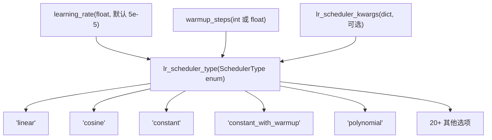
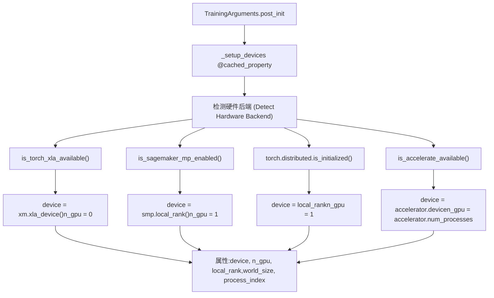
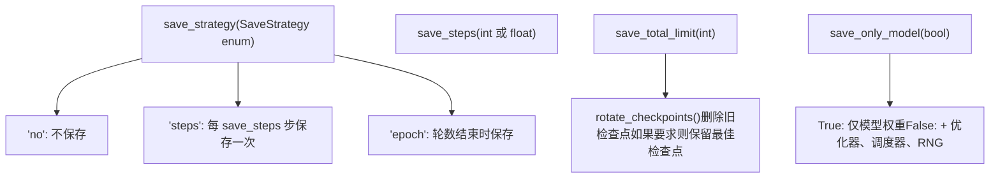
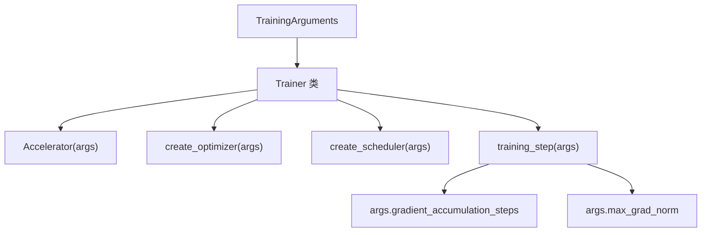

# TrainingArguments 配置 (TrainingArguments Configuration)

相关源文件 (Relevant source files)

-   [docs/source/en/main\_classes/callback.md](https://github.com/huggingface/transformers/blob/9a9997fd/docs/source/en/main_classes/callback.md?plain=1)
-   [docs/source/en/main\_classes/quantization.md](https://github.com/huggingface/transformers/blob/9a9997fd/docs/source/en/main_classes/quantization.md?plain=1)
-   [docs/source/en/model\_doc/rt\_detr.md](https://github.com/huggingface/transformers/blob/9a9997fd/docs/source/en/model_doc/rt_detr.md?plain=1)
-   [docs/source/en/model\_doc/rt\_detr\_v2.md](https://github.com/huggingface/transformers/blob/9a9997fd/docs/source/en/model_doc/rt_detr_v2.md?plain=1)
-   [docs/source/en/quantization/overview.md](https://github.com/huggingface/transformers/blob/9a9997fd/docs/source/en/quantization/overview.md?plain=1)
-   [docs/source/ja/main\_classes/callback.md](https://github.com/huggingface/transformers/blob/9a9997fd/docs/source/ja/main_classes/callback.md?plain=1)
-   [docs/source/ko/main\_classes/callback.md](https://github.com/huggingface/transformers/blob/9a9997fd/docs/source/ko/main_classes/callback.md?plain=1)
-   [docs/source/zh/main\_classes/callback.md](https://github.com/huggingface/transformers/blob/9a9997fd/docs/source/zh/main_classes/callback.md?plain=1)
-   [examples/pytorch/README.md](https://github.com/huggingface/transformers/blob/9a9997fd/examples/pytorch/README.md?plain=1)
-   [examples/pytorch/instance-segmentation/README.md](https://github.com/huggingface/transformers/blob/9a9997fd/examples/pytorch/instance-segmentation/README.md?plain=1)
-   [examples/pytorch/object-detection/README.md](https://github.com/huggingface/transformers/blob/9a9997fd/examples/pytorch/object-detection/README.md?plain=1)
-   [examples/pytorch/test\_accelerate\_examples.py](https://github.com/huggingface/transformers/blob/9a9997fd/examples/pytorch/test_accelerate_examples.py)
-   [examples/pytorch/test\_pytorch\_examples.py](https://github.com/huggingface/transformers/blob/9a9997fd/examples/pytorch/test_pytorch_examples.py)
-   [setup.py](https://github.com/huggingface/transformers/blob/9a9997fd/setup.py)
-   [src/transformers/conversion\_mapping.py](https://github.com/huggingface/transformers/blob/9a9997fd/src/transformers/conversion_mapping.py)
-   [src/transformers/core\_model\_loading.py](https://github.com/huggingface/transformers/blob/9a9997fd/src/transformers/core_model_loading.py)
-   [src/transformers/dependency\_versions\_table.py](https://github.com/huggingface/transformers/blob/9a9997fd/src/transformers/dependency_versions_table.py)
-   [src/transformers/integrations/\_\_init\_\_.py](https://github.com/huggingface/transformers/blob/9a9997fd/src/transformers/integrations/__init__.py)
-   [src/transformers/integrations/accelerate.py](https://github.com/huggingface/transformers/blob/9a9997fd/src/transformers/integrations/accelerate.py)
-   [src/transformers/integrations/integration\_utils.py](https://github.com/huggingface/transformers/blob/9a9997fd/src/transformers/integrations/integration_utils.py)
-   [src/transformers/integrations/peft.py](https://github.com/huggingface/transformers/blob/9a9997fd/src/transformers/integrations/peft.py)
-   [src/transformers/modeling\_utils.py](https://github.com/huggingface/transformers/blob/9a9997fd/src/transformers/modeling_utils.py)
-   [src/transformers/models/rt\_detr/\_\_init\_\_.py](https://github.com/huggingface/transformers/blob/9a9997fd/src/transformers/models/rt_detr/__init__.py)
-   [src/transformers/quantizers/auto.py](https://github.com/huggingface/transformers/blob/9a9997fd/src/transformers/quantizers/auto.py)
-   [src/transformers/testing\_utils.py](https://github.com/huggingface/transformers/blob/9a9997fd/src/transformers/testing_utils.py)
-   [src/transformers/trainer.py](https://github.com/huggingface/transformers/blob/9a9997fd/src/transformers/trainer.py)
-   [src/transformers/trainer\_callback.py](https://github.com/huggingface/transformers/blob/9a9997fd/src/transformers/trainer_callback.py)
-   [src/transformers/trainer\_utils.py](https://github.com/huggingface/transformers/blob/9a9997fd/src/transformers/trainer_utils.py)
-   [src/transformers/training\_args.py](https://github.com/huggingface/transformers/blob/9a9997fd/src/transformers/training_args.py)
-   [src/transformers/utils/\_\_init\_\_.py](https://github.com/huggingface/transformers/blob/9a9997fd/src/transformers/utils/__init__.py)
-   [src/transformers/utils/import\_utils.py](https://github.com/huggingface/transformers/blob/9a9997fd/src/transformers/utils/import_utils.py)
-   [src/transformers/utils/loading\_report.py](https://github.com/huggingface/transformers/blob/9a9997fd/src/transformers/utils/loading_report.py)
-   [src/transformers/utils/quantization\_config.py](https://github.com/huggingface/transformers/blob/9a9997fd/src/transformers/utils/quantization_config.py)
-   [tests/peft\_integration/test\_peft\_integration.py](https://github.com/huggingface/transformers/blob/9a9997fd/tests/peft_integration/test_peft_integration.py)
-   [tests/test\_modeling\_common.py](https://github.com/huggingface/transformers/blob/9a9997fd/tests/test_modeling_common.py)
-   [tests/trainer/test\_trainer.py](https://github.com/huggingface/transformers/blob/9a9997fd/tests/trainer/test_trainer.py)
-   [tests/trainer/test\_trainer\_callback.py](https://github.com/huggingface/transformers/blob/9a9997fd/tests/trainer/test_trainer_callback.py)
-   [tests/trainer/test\_trainer\_checkpointing.py](https://github.com/huggingface/transformers/blob/9a9997fd/tests/trainer/test_trainer_checkpointing.py)
-   [tests/trainer/test\_training\_args.py](https://github.com/huggingface/transformers/blob/9a9997fd/tests/trainer/test_training_args.py)
-   [tests/trainer/trainer\_test\_utils.py](https://github.com/huggingface/transformers/blob/9a9997fd/tests/trainer/trainer_test_utils.py)
-   [tests/utils/test\_core\_model\_loading.py](https://github.com/huggingface/transformers/blob/9a9997fd/tests/utils/test_core_model_loading.py)
-   [tests/utils/test\_modeling\_utils.py](https://github.com/huggingface/transformers/blob/9a9997fd/tests/utils/test_modeling_utils.py)
-   [utils/check\_config\_attributes.py](https://github.com/huggingface/transformers/blob/9a9997fd/utils/check_config_attributes.py)

`TrainingArguments` 是一个综合的配置数据类 (Dataclass)，它集中了使用 `Trainer` 类进行训练所需的全部超参数 (Hyperparameters)、优化设置、日志偏好以及基础设施选择。它提供了超过 150 个配置选项，组织成逻辑类别，控制从批次大小 (Batch Sizes) 和学习率 (Learning Rates) 到分布式训练策略和 Hub 集成的一切事务。

有关这些参数如何在训练循环中使用，请参阅 [Trainer 架构与训练循环 (Trainer Architecture and Training Loop)](/huggingface/transformers/3.1-trainer-architecture-and-training-loop)。有关分布式训练实现详情，请参阅 [分布式训练支持 (Distributed Training Support)](/huggingface/transformers/3.4-distributed-training-support)。有关优化器和调度器的创建，请参阅 [优化与调度 (Optimization and Scheduling)](/huggingface/transformers/3.5-optimization-and-scheduling)。

## 配置数据类结构 (Configuration Dataclass Structure)

`TrainingArguments` 在 [src/transformers/training\_args.py179-1479](https://github.com/huggingface/transformers/blob/9a9997fd/src/transformers/training_args.py#L179-L1479) 中被定义为 Python 数据类，带有详尽的字段文档和类型注释。该类使用 `@dataclass` 装饰器，并通过 `HfArgumentParser` 提供命令行解析支持。

### 系统实体映射 (System Entity Mapping)

下图将高层级的配置类别映射到 `TrainingArguments` 类的内部属性和方法。

```mermaid
flowchart TD
    Fields["150+ 配置字段类型化且带有文档说明"]
    PostInit["post_init()验证与设置"]
    CachedProps["@cached_property 方法设备设置、进程信息"]
    Duration["时长控制 (Duration Control)num_train_epochs, max_steps"]
    BatchSize["批次配置 (Batch Config)per_device_train_batch_size"]
    LR["学习率管理 (LR Management)learning_rate, lr_scheduler_type"]
    Optim["优化器选择 (Optimizer Choice)optim, weight_decay, adam_beta1"]
    Regularization["稳定性 (Stability)gradient_accumulation_steps, max_grad_norm"]
    MixedPrec["精度模式 (Precision Modes)fp16, bf16, tf32"]
    Logging["报告 (Reporting)logging_strategy, report_to"]
    Eval["评估 (Evaluation)eval_strategy, eval_steps"]
    Saving["持久化 (Persistence)save_strategy, save_steps"]
    Hub["Hub 同步 (Hub Sync)push_to_hub, hub_model_id"]
    Distributed["并行性 (Parallelism)fsdp, deepspeed, ddp_*"]
    Device["硬件信息 (Device)device, n_gpu, local_rank"]
    Validation["_convert_str_dict()验证字段值初始化设备"]
    DeviceSetup["_setup_devices确定设备、n_gpu、local_rank"]
    ProcessInfo["并行属性 (Parallel Properties)world_size, process_index"]

    Fields --> Duration
    Fields --> BatchSize
    Fields --> LR
    Fields --> Optim
    Fields --> Regularization
    Fields --> MixedPrec
    Fields --> Logging
    Fields --> Eval
    Fields --> Saving
    Fields --> Hub
    Fields --> Distributed
    Fields --> Device
    PostInit --> Validation
    CachedProps --> DeviceSetup
    CachedProps --> ProcessInfo
```


**来源 (Sources)：** [src/transformers/training\_args.py179-1479](https://github.com/huggingface/transformers/blob/9a9997fd/src/transformers/training_args.py#L179-L1479) [src/transformers/training\_args.py1523-1723](https://github.com/huggingface/transformers/blob/9a9997fd/src/transformers/training_args.py#L1523-L1723)

## 核心配置类别 (Core Configuration Categories)

### 训练时长与批次大小 (Training Duration and Batch Size)

这些字段控制训练运行的时间以及有效批次大小：

| 字段 (Field) | 类型 (Type) | 默认值 (Default) | 描述 (Description) |
| --- | --- | --- | --- |
| `per_device_train_batch_size` | int | 8 | 每个设备的批次大小 |
| `num_train_epochs` | float | 3.0 | 总训练轮数 |
| `max_steps` | int | \-1 | 如果为正值，则覆盖轮数 |
| `gradient_accumulation_steps` | int | 1 | 优化器更新前累积权重的步数 |

**有效批次大小 (Effective batch size)** = `per_device_train_batch_size × num_devices × gradient_accumulation_steps`

使用梯度累积时，一个“步 (Step)”被计为一个优化器更新，而不是一次前向传播。这会影响日志记录、评估和保存发生的时间。

**来源 (Sources)：** [src/transformers/training\_args.py194-223](https://github.com/huggingface/transformers/blob/9a9997fd/src/transformers/training_args.py#L194-L223) [src/transformers/training\_args.py276-282](https://github.com/huggingface/transformers/blob/9a9997fd/src/transformers/training_args.py#L276-L282)

### 学习率与调度 (Learning Rate and Scheduling)

学习率调度器确定学习率随时间变化的方式，通常包含热身 (Warmup) 期。


`warmup_steps` 字段可以是一个整数（确切步数）或 [0, 1) 之间的浮点数（解释为总训练步数的比例）。

**来源 (Sources)：** [src/transformers/trainer\_utils.py274-317](https://github.com/huggingface/transformers/blob/9a9997fd/src/transformers/trainer_utils.py#L274-L317)

### 优化器配置 (Optimizer Configuration)

`OptimizerNames` 枚举定义了 30 多个支持的优化器，从标准的 AdamW 到内存高效的变体（如 8-bit 优化器或 GaLore）。

```
# 来自 src/transformers/training_args.py:111-158
class OptimizerNames(ExplicitEnum):
    ADAMW_TORCH = "adamw_torch"
    ADAMW_TORCH_FUSED = "adamw_torch_fused"
    ADAMW_BNB = "adamw_bnb_8bit"
    SGD = "sgd"
    ADAFACTOR = "adafactor"
    GALORE_ADAMW = "galore_adamw"
    LOMO = "lomo"
    ADEMAMIX = "ademamix"
    SCHEDULE_FREE_ADAMW = "schedule_free_adamw"
```
关键的优化器相关字段：

| 字段 (Field) | 类型 (Type) | 默认值 (Default) | 描述 (Description) |
| --- | --- | --- | --- |
| `optim` | str/OptimizerNames | "adamw\_torch" | 优化器类型 |
| `optim_args` | str | None | 额外的优化器特定参数 |
| `weight_decay` | float | 0.0 | L2 正则化 (Regularization) 系数 |
| `adam_beta1` | float | 0.9 | Adam 第一动量衰减率 |
| `adam_beta2` | float | 0.999 | Adam 第二动量衰减率 |
| `optim_target_modules` | str/list | None | GaLore/APOLLO 的目标模块 |

**来源 (Sources)：** [src/transformers/training\_args.py111-158](https://github.com/huggingface/transformers/blob/9a9997fd/src/transformers/training_args.py#L111-L158) [src/transformers/training\_args.py242-273](https://github.com/huggingface/transformers/blob/9a9997fd/src/transformers/training_args.py#L242-L273)

### 混合精度训练 (Mixed Precision Training)

`TrainingArguments` 支持多种精度模式以优化内存和速度：

| 字段 (Field) | 类型 (Type) | 默认值 (Default) | 描述 (Description) |
| --- | --- | --- | --- |
| `fp16` | bool | False | 启用 float16 混合精度 |
| `bf16` | bool | False | 启用 bfloat16 混合精度（为了稳定性，推荐使用） |
| `fp16_full_eval` | bool | False | 仅在评估时使用完整的 FP16 |
| `bf16_full_eval` | bool | False | 仅在评估时使用完整的 BF16 |
| `tf32` | bool | None | 在 Ampere+ GPU 上启用 TensorFloat-32 |

由于更好的数值稳定性和无需损失缩放 (Loss Scaling) 要求，BF16 通常比 FP16 更受青睐。TF32 在 Ampere GPU 上提供加速，且精度损失微乎其微。

**来源 (Sources)：** [src/transformers/training\_args.py297-315](https://github.com/huggingface/transformers/blob/9a9997fd/src/transformers/training_args.py#L297-L315) [tests/trainer/test\_trainer.py96-142](https://github.com/huggingface/transformers/blob/9a9997fd/tests/trainer/test_trainer.py#L96-L142)

## 设备与硬件配置 (Device and Hardware Configuration)

### 设备设置与发现流程 (Device Setup and Discovery Flow)

`TrainingArguments` 的内部逻辑自动检测硬件环境以配置训练后端。


**来源 (Sources)：** [src/transformers/training\_args.py1523-1723](https://github.com/huggingface/transformers/blob/9a9997fd/src/transformers/training_args.py#L1523-L1723) [src/transformers/utils/import_utils.py143-233](https://github.com/huggingface/transformers/blob/9a9997fd/src/transformers/utils/import_utils.py#L143-L233)

### 关键硬件属性 (Key Hardware Properties)

| 属性 (Property) | 类型 (Type) | 描述 (Description) |
| --- | --- | --- |
| `device` | torch.device | 训练的主要设备 (CPU, CUDA, XLA 等) |
| `n_gpu` | int | 当前进程使用的 GPU 数量 |
| `local_rank` | int | 当前进程在本地机器上的秩 (Rank) |
| `world_size` | int | 分布式设置中的总进程数 |
| `process_index` | int | 当前进程的全局秩 |
| `should_save` | bool | 此进程是否负责保存检查点（通常是 rank 0） |

**来源 (Sources)：** [src/transformers/training\_args.py1523-1723](https://github.com/huggingface/transformers/blob/9a9997fd/src/transformers/training_args.py#L1523-L1723)

## 检查点与保存 (Checkpointing and Saving)

`TrainingArguments` 控制模型保存的频率以及保留的检查点数量。


**来源 (Sources)：** [src/transformers/training\_args.py464-495](https://github.com/huggingface/transformers/blob/9a9997fd/src/transformers/training_args.py#L464-L495) [src/transformers/trainer.py139-143](https://github.com/huggingface/transformers/blob/9a9997fd/src/transformers/trainer.py#L139-L143)

## 初始化与集成 (Initialization and Integration)

### `__post_init__` 逻辑 (`__post_init__` Logic)

`TrainingArguments` 中的 `__post_init__` 方法对于验证参数的一致性至关重要。

1.  **默认对齐 (Default Alignment)**：如果未设置 `eval_steps`，则默认使用 `logging_steps` [src/transformers/training\_args.py1202](https://github.com/huggingface/transformers/blob/9a9997fd/src/transformers/training_args.py#L1202-L1202)
2.  **策略匹配 (Strategy Matching)**：如果 `load_best_model_at_end` 为 True，则 `save_strategy` 必须与 `eval_strategy` 匹配（或两者都是 "steps"） [src/transformers/training\_args.py1210-1215](https://github.com/huggingface/transformers/blob/9a9997fd/src/transformers/training_args.py#L1210-L1215)
3.  **精度检查 (Precision Check)**：验证硬件是否支持所请求的精度（例如，为 `bf16` 检查 `is_torch_bf16_gpu_available`） [src/transformers/training\_args.py1238](https://github.com/huggingface/transformers/blob/9a9997fd/src/transformers/training_args.py#L1238-L1238)
4.  **分布式验证 (Distributed Validation)**：检查 DeepSpeed 或 FSDP 配置是否与当前环境兼容 [src/transformers/training\_args.py1059-1125](https://github.com/huggingface/transformers/blob/9a9997fd/src/transformers/training_args.py#L1059-L1125)

### 与 Trainer 的集成 (Integration with Trainer)

`Trainer` 类使用 `TrainingArguments` 来编排训练循环。


**来源 (Sources)：** [src/transformers/trainer.py379-754](https://github.com/huggingface/transformers/blob/9a9997fd/src/transformers/trainer.py#L379-L754) [src/transformers/training\_args.py809-1479](https://github.com/huggingface/transformers/blob/9a9997fd/src/transformers/training_args.py#L809-L1479)

---

**来源 (Sources)：**

-   [src/transformers/training\_args.py111-1723](https://github.com/huggingface/transformers/blob/9a9997fd/src/transformers/training_args.py#L111-L1723)
-   [src/transformers/trainer.py1-176](https://github.com/huggingface/transformers/blob/9a9997fd/src/transformers/trainer.py#L1-L176)
-   [src/transformers/utils/import\_utils.py128-247](https://github.com/huggingface/transformers/blob/9a9997fd/src/transformers/utils/import_utils.py#L128-L247)
-   [tests/trainer/test\_trainer.py96-200](https://github.com/huggingface/transformers/blob/9a9997fd/tests/trainer/test_trainer.py#L96-L200)
