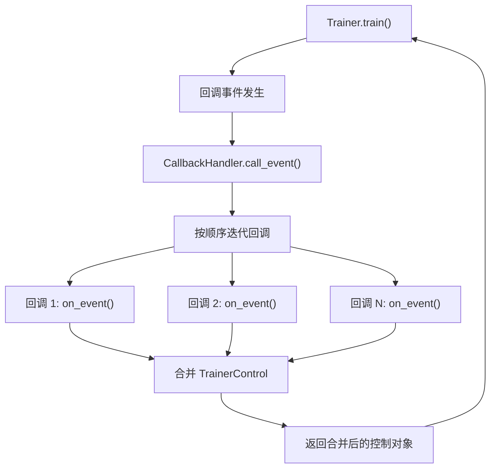
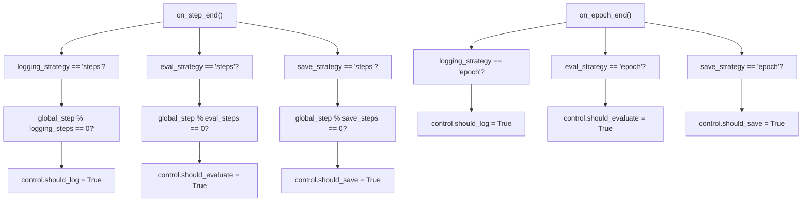
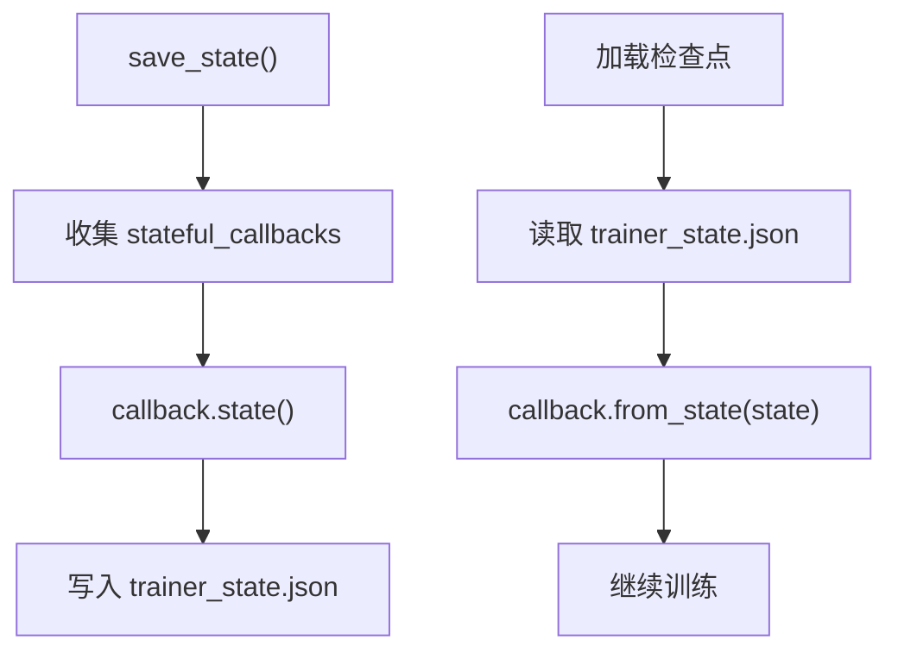

# 回调与可扩展性 (Callbacks and Extensibility)

相关源文件 (Relevant source files)

-   [ISSUES.md](https://github.com/huggingface/transformers/blob/9a9997fd/ISSUES.md?plain=1)
-   [docs/source/en/debugging.md](https://github.com/huggingface/transformers/blob/9a9997fd/docs/source/en/debugging.md?plain=1)
-   [docs/source/en/deepspeed.md](https://github.com/huggingface/transformers/blob/9a9997fd/docs/source/en/deepspeed.md?plain=1)
-   [docs/source/en/main\_classes/callback.md](https://github.com/huggingface/transformers/blob/9a9997fd/docs/source/en/main_classes/callback.md?plain=1)
-   [docs/source/en/main\_classes/deepspeed.md](https://github.com/huggingface/transformers/blob/9a9997fd/docs/source/en/main_classes/deepspeed.md?plain=1)
-   [docs/source/en/main\_classes/trainer.md](https://github.com/huggingface/transformers/blob/9a9997fd/docs/source/en/main_classes/trainer.md?plain=1)
-   [docs/source/en/model\_doc/rt\_detr.md](https://github.com/huggingface/transformers/blob/9a9997fd/docs/source/en/model_doc/rt_detr.md?plain=1)
-   [docs/source/en/model\_doc/rt\_detr\_v2.md](https://github.com/huggingface/transformers/blob/9a9997fd/docs/source/en/model_doc/rt_detr_v2.md?plain=1)
-   [docs/source/en/perf\_train\_gpu\_many.md](https://github.com/huggingface/transformers/blob/9a9997fd/docs/source/en/perf_train_gpu_many.md?plain=1)
-   [docs/source/en/perf\_train\_special.md](https://github.com/huggingface/transformers/blob/9a9997fd/docs/source/en/perf_train_special.md?plain=1)
-   [docs/source/es/debugging.md](https://github.com/huggingface/transformers/blob/9a9997fd/docs/source/es/debugging.md?plain=1)
-   [docs/source/it/debugging.md](https://github.com/huggingface/transformers/blob/9a9997fd/docs/source/it/debugging.md?plain=1)
-   [docs/source/ja/main\_classes/callback.md](https://github.com/huggingface/transformers/blob/9a9997fd/docs/source/ja/main_classes/callback.md?plain=1)
-   [docs/source/ja/main\_classes/deepspeed.md](https://github.com/huggingface/transformers/blob/9a9997fd/docs/source/ja/main_classes/deepspeed.md?plain=1)
-   [docs/source/ja/main\_classes/trainer.md](https://github.com/huggingface/transformers/blob/9a9997fd/docs/source/ja/main_classes/trainer.md?plain=1)
-   [docs/source/ja/perf\_train\_gpu\_many.md](https://github.com/huggingface/transformers/blob/9a9997fd/docs/source/ja/perf_train_gpu_many.md?plain=1)
-   [docs/source/ko/debugging.md](https://github.com/huggingface/transformers/blob/9a9997fd/docs/source/ko/debugging.md?plain=1)
-   [docs/source/ko/deepspeed.md](https://github.com/huggingface/transformers/blob/9a9997fd/docs/source/ko/deepspeed.md?plain=1)
-   [docs/source/ko/main\_classes/callback.md](https://github.com/huggingface/transformers/blob/9a9997fd/docs/source/ko/main_classes/callback.md?plain=1)
-   [docs/source/ko/perf\_train\_gpu\_many.md](https://github.com/huggingface/transformers/blob/9a9997fd/docs/source/ko/perf_train_gpu_many.md?plain=1)
-   [docs/source/zh/debugging.md](https://github.com/huggingface/transformers/blob/9a9997fd/docs/source/zh/debugging.md?plain=1)
-   [docs/source/zh/main\_classes/callback.md](https://github.com/huggingface/transformers/blob/9a9997fd/docs/source/zh/main_classes/callback.md?plain=1)
-   [docs/source/zh/main\_classes/deepspeed.md](https://github.com/huggingface/transformers/blob/9a9997fd/docs/source/zh/main_classes/deepspeed.md?plain=1)
-   [docs/source/zh/main\_classes/trainer.md](https://github.com/huggingface/transformers/blob/9a9997fd/docs/source/zh/main_classes/trainer.md?plain=1)
-   [examples/pytorch/README.md](https://github.com/huggingface/transformers/blob/9a9997fd/examples/pytorch/README.md?plain=1)
-   [examples/pytorch/instance-segmentation/README.md](https://github.com/huggingface/transformers/blob/9a9997fd/examples/pytorch/instance-segmentation/README.md?plain=1)
-   [examples/pytorch/object-detection/README.md](https://github.com/huggingface/transformers/blob/9a9997fd/examples/pytorch/object-detection/README.md?plain=1)
-   [examples/pytorch/test\_accelerate\_examples.py](https://github.com/huggingface/transformers/blob/9a9997fd/examples/pytorch/test_accelerate_examples.py)
-   [examples/pytorch/test\_pytorch\_examples.py](https://github.com/huggingface/transformers/blob/9a9997fd/examples/pytorch/test_pytorch_examples.py)
-   [src/transformers/integrations/integration\_utils.py](https://github.com/huggingface/transformers/blob/9a9997fd/src/transformers/integrations/integration_utils.py)
-   [src/transformers/modelcard.py](https://github.com/huggingface/transformers/blob/9a9997fd/src/transformers/modelcard.py)
-   [src/transformers/models/rt\_detr/\_\_init\_\_.py](https://github.com/huggingface/transformers/blob/9a9997fd/src/transformers/models/rt_detr/__init__.py)
-   [src/transformers/trainer_callback.py](https://github.com/huggingface/transformers/blob/9a9997fd/src/transformers/trainer_callback.py)
-   [tests/sagemaker/README.md](https://github.com/huggingface/transformers/blob/9a9997fd/tests/sagemaker/README.md?plain=1)
-   [tests/sagemaker/scripts/pytorch/run\_glue\_model\_parallelism.py](https://github.com/huggingface/transformers/blob/9a9997fd/tests/sagemaker/scripts/pytorch/run_glue_model_parallelism.py)
-   [tests/trainer/test\_trainer\_callback.py](https://github.com/huggingface/transformers/blob/9a9997fd/tests/trainer/test_trainer_callback.py)
-   [tests/trainer/test\_trainer\_checkpointing.py](https://github.com/huggingface/transformers/blob/9a9997fd/tests/trainer/test_trainer_checkpointing.py)
-   [tests/trainer/test\_training\_args.py](https://github.com/huggingface/transformers/blob/9a9997fd/tests/trainer/test_training_args.py)
-   [tests/trainer/trainer\_test\_utils.py](https://github.com/huggingface/transformers/blob/9a9997fd/tests/trainer/trainer_test_utils.py)

本页面记录了允许将自定义逻辑注入 `Trainer` 训练循环 (Training Loop) 的回调 (Callback) 系统。内容涵盖 `TrainerCallback`、`TrainerState`、`TrainerControl`、`CallbackHandler`、内置回调以及集成回调。

有关 `Trainer` 的整体架构以及训练循环本身的执行方式，请参阅 [3.1](/huggingface/transformers/3.1-trainer-architecture-and-training-loop)。有关控制回调相关计划（日志记录、保存、评估）的 `TrainingArguments` 配置字段，请参阅 [3.2](/huggingface/transformers/3.2-trainingarguments-configuration)。

---

## 概览 (Overview)

回调系统提供了一组**事件钩子 (Event Hooks)**，在训练期间定义的特定点触发。回调在每次事件时接收当前的 `TrainingArguments`、`TrainerState` 和 `TrainerControl`。它们可以读取状态、写入日志，或者通过修改返回的 `TrainerControl` 对象上的字段来向 `Trainer` 发出更改其行为（保存、评估、停止）的信号。

所有回调基础设施均在 [src/transformers/trainer\_callback.py](https://github.com/huggingface/transformers/blob/9a9997fd/src/transformers/trainer_callback.py) 中定义。`Trainer` 在 `__init__` 期间实例化一个 `CallbackHandler` [src/transformers/trainer.py560-562](https://github.com/huggingface/transformers/blob/9a9997fd/src/transformers/trainer.py#L560-L562)，负责管理回调列表并在整个训练生命周期中分发事件。

**关键概念 (Key concepts)：**

-   **事件钩子 (Event hooks)**：13 个生命周期方法 (`on_init_end`, `on_train_begin`, `on_step_end` 等)
-   **TrainerState**：可变的训练进度（轮数、全局步数 `global_step`、指标等）
-   **TrainerControl**：用于控制训练器行为的布尔标志 (Boolean Flags)（`should_save`, `should_evaluate`, `should_training_stop`）
-   **CallbackHandler**：分发器，为每个事件调用所有注册的回调
-   **ExportableState**：Mixin 接口，用于需要在检查点 (Checkpoints) 之间持久化状态的回调

---

## 核心数据结构 (Core Data Structures)

### TrainerState

`TrainerState` 是一个 `@dataclass`，携带所有可变的训练进度信息。它与模型一起进行检查点记录。

定义于 [src/transformers/trainer\_callback.py34-150](https://github.com/huggingface/transformers/blob/9a9997fd/src/transformers/trainer_callback.py#L34-L150)

| 字段 (Field) | 类型 (Type) | 描述 (Description) |
| --- | --- | --- |
| `epoch` | `float` | 当前轮数（小数部分 = 已完成轮数的比例） [src/transformers/trainer\_callback.py95](https://github.com/huggingface/transformers/blob/9a9997fd/src/transformers/trainer_callback.py#L95-L95) |
| `global_step` | `int` | 已完成的优化器更新步数 [src/transformers/trainer\_callback.py96](https://github.com/huggingface/transformers/blob/9a9997fd/src/transformers/trainer_callback.py#L96-L96) |
| `max_steps` | `int` | 总计划更新步数 [src/transformers/trainer\_callback.py97](https://github.com/huggingface/transformers/blob/9a9997fd/src/transformers/trainer_callback.py#L97-L97) |
| `num_train_epochs` | `int` | 总计划轮数 [src/transformers/trainer\_callback.py102](https://github.com/huggingface/transformers/blob/9a9997fd/src/transformers/trainer_callback.py#L102-L102) |
| `logging_steps` | `int` | 日志事件之间的步数 [src/transformers/trainer\_callback.py98](https://github.com/huggingface/transformers/blob/9a9997fd/src/transformers/trainer_callback.py#L98-L98) |
| `eval_steps` | `int` | 评估事件之间的步数 [src/transformers/trainer\_callback.py99](https://github.com/huggingface/transformers/blob/9a9997fd/src/transformers/trainer_callback.py#L99-L99) |
| `save_steps` | `int` | 检查点保存之间的步数 [src/transformers/trainer\_callback.py100](https://github.com/huggingface/transformers/blob/9a9997fd/src/transformers/trainer_callback.py#L100-L100) |
| `train_batch_size` | `int | None` | 有效的每设备批次大小 [src/transformers/trainer\_callback.py101](https://github.com/huggingface/transformers/blob/9a9997fd/src/transformers/trainer_callback.py#L101-L101) |
| `num_input_tokens_seen` | `int` | 累计的非填充 (Non-padding) 输入 token 数 [src/transformers/trainer\_callback.py103](https://github.com/huggingface/transformers/blob/9a9997fd/src/transformers/trainer_callback.py#L103-L103) |
| `total_flos` | `float` | 累计浮点运算次数 (Floating-point Operations) [src/transformers/trainer\_callback.py104](https://github.com/huggingface/transformers/blob/9a9997fd/src/transformers/trainer_callback.py#L104-L104) |
| `log_history` | `list[dict]` | 所有已记录指标字典的列表 [src/transformers/trainer\_callback.py105](https://github.com/huggingface/transformers/blob/9a9997fd/src/transformers/trainer_callback.py#L105-L105) |
| `best_metric` | `float | None` | 见过的 `metric_for_best_model` 的最佳值 [src/transformers/trainer\_callback.py106](https://github.com/huggingface/transformers/blob/9a9997fd/src/transformers/trainer_callback.py#L106-L106) |
| `best_model_checkpoint` | `str | None` | 具有最佳指标的检查点路径 [src/transformers/trainer\_callback.py108](https://github.com/huggingface/transformers/blob/9a9997fd/src/transformers/trainer_callback.py#L108-L108) |
| `is_local_process_zero` | `bool` | 这是否是该节点上的主进程 [src/transformers/trainer\_callback.py109](https://github.com/huggingface/transformers/blob/9a9997fd/src/transformers/trainer_callback.py#L109-L109) |
| `is_world_process_zero` | `bool` | 这是否是全局主进程 [src/transformers/trainer\_callback.py110](https://github.com/huggingface/transformers/blob/9a9997fd/src/transformers/trainer_callback.py#L110-L110) |
| `stateful_callbacks` | `list["TrainerCallback"] | None` | 实现了状态保存/恢复的回调 [src/transformers/trainer\_callback.py114](https://github.com/huggingface/transformers/blob/9a9997fd/src/transformers/trainer_callback.py#L114-L114) |

`TrainerState` 通过 `save_to_json` [src/transformers/trainer\_callback.py143-147](https://github.com/huggingface/transformers/blob/9a9997fd/src/transformers/trainer_callback.py#L143-L147) 在每个检查点保存到 `trainer_state.json`，并可以通过 `TrainerState.load_from_json` [src/transformers/trainer\_callback.py149-154](https://github.com/huggingface/transformers/blob/9a9997fd/src/transformers/trainer_callback.py#L149-L154) 进行加载。

### TrainerControl

`TrainerControl` 是一个持有布尔标志的 `@dataclass`。回调设置这些标志以请求 `Trainer` 执行操作。`Trainer` 在适当的点读取并重置它们。`TrainerControl` 还实现了 `ExportableState`，因此其标志可以在检查点之间持久化。

定义于 [src/transformers/trainer\_callback.py153-219](https://github.com/huggingface/transformers/blob/9a9997fd/src/transformers/trainer_callback.py#L153-L219)

| 字段 (Field) | 类型 (Type) | 默认值 (Default) | 为 `True` 时的效果 |
| --- | --- | --- | --- |
| `should_training_stop` | `bool` | `False` | 在当前步之后结束训练 [src/transformers/trainer\_callback.py168](https://github.com/huggingface/transformers/blob/9a9997fd/src/transformers/trainer_callback.py#L168-L168) |
| `should_epoch_stop` | `bool` | `False` | 在当前步之后结束当前轮数 [src/transformers/trainer\_callback.py169](https://github.com/huggingface/transformers/blob/9a9997fd/src/transformers/trainer_callback.py#L169-L169) |
| `should_save` | `bool` | `False` | 触发检查点保存 [src/transformers/trainer\_callback.py170](https://github.com/huggingface/transformers/blob/9a9997fd/src/transformers/trainer_callback.py#L170-L170) |
| `should_evaluate` | `bool` | `False` | 触发评估运行 [src/transformers/trainer\_callback.py171](https://github.com/huggingface/transformers/blob/9a9997fd/src/transformers/trainer_callback.py#L171-L171) |
| `should_log` | `bool` | `False` | 触发日志事件 [src/transformers/trainer\_callback.py172](https://github.com/huggingface/transformers/blob/9a9997fd/src/transformers/trainer_callback.py#L172-L172) |

---

## TrainerCallback

`TrainerCallback` 是所有回调的抽象基类。子类仅覆盖它们需要的事件方法。

定义于 [src/transformers/trainer\_callback.py222-380](https://github.com/huggingface/transformers/blob/9a9997fd/src/transformers/trainer_callback.py#L222-L380)

每个事件方法都有如下签名：

```
def on_<event>(
    self,
    args: TrainingArguments,
    state: TrainerState,
    control: TrainerControl,
    **kwargs
) -> TrainerControl | None
```
`**kwargs` 根据事件的不同而填充不同的内容。传递的常用关键字参数 (Keyword Arguments) 包括：

| kwarg | 类型 (Type) | 在哪些事件中提供 |
| --- | --- | --- |
| `model` | `PreTrainedModel` | 除 `on_init_end` 外的大多数事件 |
| `tokenizer` / `processing_class` | `PreTrainedTokenizerBase` / `ProcessorMixin` | 大多数事件 |
| `optimizer` | `torch.optim.Optimizer` | `on_step_end`, `on_substep_end`, `on_train_begin` |
| `lr_scheduler` | `LRScheduler` | `on_step_end`, `on_substep_end`, `on_train_begin` |
| `train_dataloader` | `DataLoader` | `on_train_begin` |
| `logs` | `dict[str, float]` | `on_log` |
| `metrics` | `dict[str, float]` | `on_evaluate`, `on_predict` |

**事件方法及其触发时机：**

| 方法 (Method) | 触发时机 (Fires when) | 触发位置 (Called from) |
| --- | --- | --- |
| `on_init_end` | `Trainer.__init__` 结束时 | [src/transformers/trainer.py595](https://github.com/huggingface/transformers/blob/9a9997fd/src/transformers/trainer.py#L595-L595) |
| `on_train_begin` | `Trainer.train()` 开始时 | [src/transformers/trainer\_callback.py246](https://github.com/huggingface/transformers/blob/9a9997fd/src/transformers/trainer_callback.py#L246-L246) |
| `on_train_end` | `Trainer.train()` 结束时 | [src/transformers/trainer\_callback.py257](https://github.com/huggingface/transformers/blob/9a9997fd/src/transformers/trainer_callback.py#L257-L257) |
| `on_epoch_begin` | 每轮开始时 | [src/transformers/trainer\_callback.py268](https://github.com/huggingface/transformers/blob/9a9997fd/src/transformers/trainer_callback.py#L268-L268) |
| `on_epoch_end` | 每轮结束时 | [src/transformers/trainer\_callback.py279](https://github.com/huggingface/transformers/blob/9a9997fd/src/transformers/trainer_callback.py#L279-L279) |
| `on_step_begin` | 每个优化器步的前向传播之前 | [src/transformers/trainer\_callback.py290](https://github.com/huggingface/transformers/blob/9a9997fd/src/transformers/trainer_callback.py#L290-L290) |
| `on_substep_end` | 每个梯度累积子步 (Substep) 之后 | [src/transformers/trainer\_callback.py301](https://github.com/huggingface/transformers/blob/9a9997fd/src/transformers/trainer_callback.py#L301-L301) |
| `on_step_end` | 每个优化器更新步之后 | [src/transformers/trainer\_callback.py312](https://github.com/huggingface/transformers/blob/9a9997fd/src/transformers/trainer_callback.py#L312-L312) |
| `on_evaluate` | 每次评估运行完成后 | [src/transformers/trainer\_callback.py323](https://github.com/huggingface/transformers/blob/9a9997fd/src/transformers/trainer_callback.py#L323-L323) |
| `on_predict` | 每次预测运行完成后 | [src/transformers/trainer\_callback.py335](https://github.com/huggingface/transformers/blob/9a9997fd/src/transformers/trainer_callback.py#L335-L335) |
| `on_save` | 每次保存检查点后 | [src/transformers/trainer\_callback.py347](https://github.com/huggingface/transformers/blob/9a9997fd/src/transformers/trainer_callback.py#L347-L347) |
| `on_log` | 当指标被记录日志时 | [src/transformers/trainer\_callback.py358](https://github.com/huggingface/transformers/blob/9a9997fd/src/transformers/trainer_callback.py#L358-L358) |
| `on_prediction_step` | 每个预测批次之后 | [src/transformers/trainer\_callback.py369](https://github.com/huggingface/transformers/blob/9a9997fd/src/transformers/trainer_callback.py#L369-L369) |

如果回调返回一个 `TrainerControl`，`CallbackHandler` 会通过对所有布尔标志执行 OR 操作，将其与当前控制对象合并 [src/transformers/trainer\_callback.py429-437](https://github.com/huggingface/transformers/blob/9a9997fd/src/transformers/trainer_callback.py#L429-L437)。

来源 (Sources)： [src/transformers/trainer\_callback.py222-380](https://github.com/huggingface/transformers/blob/9a9997fd/src/transformers/trainer_callback.py#L222-L380) [src/transformers/trainer.py595](https://github.com/huggingface/transformers/blob/9a9997fd/src/transformers/trainer.py#L595-L595)

---

## CallbackHandler

`CallbackHandler` 本身也是一个 `TrainerCallback`。它持有注册回调的列表，并将每个事件按插入顺序分发给所有回调。

定义于 [src/transformers/trainer\_callback.py383-478](https://github.com/huggingface/transformers/blob/9a9997fd/src/transformers/trainer_callback.py#L383-L478)

**回调分发机制 (Callback dispatch mechanism)：**


**Trainer 的回调设置** (来自 `Trainer.__init__`)：

[src/transformers/trainer.py550-563](https://github.com/huggingface/transformers/blob/9a9997fd/src/transformers/trainer.py#L550-L563)

```
default_callbacks = DEFAULT_CALLBACKS + get_reporting_integration_callbacks(args.report_to)
# 用户提供的回调被追加到默认回调之后
callbacks = default_callbacks if callbacks is None else default_callbacks + callbacks
self.callback_handler = CallbackHandler(
    callbacks, self.model, self.processing_class, self.optimizer, self.lr_scheduler
)
self.add_callback(PrinterCallback if args.disable_tqdm else DEFAULT_PROGRESS_CALLBACK)
```
`CallbackHandler` 暴露：

-   `add_callback(callback)` — 追加一个回调实例或类 [src/transformers/trainer\_callback.py385-396](https://github.com/huggingface/transformers/blob/9a9997fd/src/transformers/trainer_callback.py#L385-L396)
-   `remove_callback(callback)` — 按实例或类移除 [src/transformers/trainer\_callback.py413-423](https://github.com/huggingface/transformers/blob/9a9997fd/src/transformers/trainer_callback.py#L413-L423)
-   `pop_callback(callback)` — 移除并返回 [src/transformers/trainer\_callback.py398-411](https://github.com/huggingface/transformers/blob/9a9997fd/src/transformers/trainer_callback.py#L398-L411)
-   `callbacks` — 注册的 `TrainerCallback` 实例列表 [src/transformers/trainer\_callback.py383](https://github.com/huggingface/transformers/blob/9a9997fd/src/transformers/trainer_callback.py#L383-L383)

`Trainer` 本身也暴露了同样的 `add_callback`、`remove_callback` 和 `pop_callback` 方法，并委托给其 `CallbackHandler`。

**回调优先级顺序 (Callback priority order)：**

1.  `DefaultFlowCallback`（始终在 `DEFAULT_CALLBACKS` 中排第一 [src/transformers/trainer.py181](https://github.com/huggingface/transformers/blob/9a9997fd/src/transformers/trainer.py#L181-L181)）
2.  集成回调 (Integration callbacks)（TensorBoard, W&B 等）
3.  用户提供的回调（传递给 `Trainer(callbacks=[...])`）
4.  进度/打印回调 (Progress/Printer callback)（最后添加 [src/transformers/trainer.py563](https://github.com/huggingface/transformers/blob/9a9997fd/src/transformers/trainer.py#L563-L563)）

来源 (Sources)： [src/transformers/trainer\_callback.py383-478](https://github.com/huggingface/transformers/blob/9a9997fd/src/transformers/trainer_callback.py#L383-L478) [src/transformers/trainer.py550-563](https://github.com/huggingface/transformers/blob/9a9997fd/src/transformers/trainer.py#L550-L563)

---

## 事件生命周期图 (Event Lifecycle Diagram)

**`Trainer.train()` 内的回调事件触发顺序**

> **[Mermaid sequence]**
> *(图表结构无法解析)*

来源 (Sources)： [src/transformers/trainer.py](https://github.com/huggingface/transformers/blob/9a9997fd/src/transformers/trainer.py) [src/transformers/trainer\_callback.py](https://github.com/huggingface/transformers/blob/9a9997fd/src/transformers/trainer_callback.py)

---

## 内置回调 (Built-in Callbacks)

**类层级与职责 (Class hierarchy and responsibilities)**

```mermaid
flowchart TD
    classId_TrainerCallback_0["TrainerCallback"]
    classId_CallbackHandler_1["CallbackHandler"]
    classId_DefaultFlowCallback_2["DefaultFlowCallback"]
    classId_ProgressCallback_3["ProgressCallback"]
    classId_PrinterCallback_4["PrinterCallback"]
    classId_EarlyStoppingCallback_5["EarlyStoppingCallback"]
    classId_ExportableState_6["ExportableState"]
    classId_TrainerControl_7["TrainerControl"]
```


来源 (Sources)： [src/transformers/trainer\_callback.py](https://github.com/huggingface/transformers/blob/9a9997fd/src/transformers/trainer_callback.py)

### DefaultFlowCallback

定义于 [src/transformers/trainer\_callback.py481-559](https://github.com/huggingface/transformers/blob/9a9997fd/src/transformers/trainer_callback.py#L481-L559)

始终存在（`DEFAULT_CALLBACKS = [DefaultFlowCallback]` 位于 [src/transformers/trainer.py181](https://github.com/huggingface/transformers/blob/9a9997fd/src/transformers/trainer.py#L181-L181)）。在每个 `on_step_end` 和 `on_epoch_end` 时，它读取 `TrainingArguments` 和 `TrainerState` 来决定是否设置 `control.should_log`、`control.should_evaluate` 和 `control.should_save`。它强制执行日志记录、评估和保存策略（`"steps"`, `"epoch"`, `"no"`, `"best"`）。

**逻辑流 (Logic flow)：**


来源 (Sources)： [src/transformers/trainer\_callback.py481-559](https://github.com/huggingface/transformers/blob/9a9997fd/src/transformers/trainer_callback.py#L481-L559) [src/transformers/trainer.py181](https://github.com/huggingface/transformers/blob/9a9997fd/src/transformers/trainer.py#L181-L181)

### ProgressCallback

定义于 [src/transformers/trainer\_callback.py562-639](https://github.com/huggingface/transformers/blob/9a9997fd/src/transformers/trainer_callback.py#L562-L639)

在训练和预测期间显示 `tqdm` 进度条。使用 `on_train_begin`/`on_train_end` 来打开/关闭训练进度条 [src/transformers/trainer\_callback.py586-608](https://github.com/huggingface/transformers/blob/9a9997fd/src/transformers/trainer_callback.py#L586-L608)，并使用 `on_prediction_step` 处理预测进度条 [src/transformers/trainer\_callback.py633-636](https://github.com/huggingface/transformers/blob/9a9997fd/src/transformers/trainer_callback.py#L633-L636)。默认情况下，当 `disable_tqdm=False` 时被选中；当 `disable_tqdm=True` 时被 `PrinterCallback` 替换 [src/transformers/trainer.py563](https://github.com/huggingface/transformers/blob/9a9997fd/src/transformers/trainer.py#L563-L563)。

来源 (Sources)： [src/transformers/trainer\_callback.py562-639](https://github.com/huggingface/transformers/blob/9a9997fd/src/transformers/trainer_callback.py#L562-L639) [src/transformers/trainer.py184-187](https://github.com/huggingface/transformers/blob/9a9997fd/src/transformers/trainer.py#L184-L187)

### PrinterCallback

定义于 [src/transformers/trainer\_callback.py642-679](https://github.com/huggingface/transformers/blob/9a9997fd/src/transformers/trainer_callback.py#L642-L679)

一个极简的回调，在 `on_log` 时将日志字典打印到 stdout [src/transformers/trainer\_callback.py672-679](https://github.com/huggingface/transformers/blob/9a9997fd/src/transformers/trainer_callback.py#L672-L679)。在 `args.disable_tqdm=True` 时使用。

来源 (Sources)： [src/transformers/trainer\_callback.py642-679](https://github.com/huggingface/transformers/blob/9a9997fd/src/transformers/trainer_callback.py#L642-L679)

### EarlyStoppingCallback

定义于 [src/transformers/trainer\_callback.py682-779](https://github.com/huggingface/transformers/blob/9a9997fd/src/transformers/trainer_callback.py#L682-L779)

监控由 `args.metric_for_best_model` 指定的指标。如果该指标在 `early_stopping_patience` 次连续评估中没有超过 `early_stopping_threshold` 的改进，它会设置 `control.should_training_stop = True` [src/transformers/trainer\_callback.py772-774](https://github.com/huggingface/transformers/blob/9a9997fd/src/transformers/trainer_callback.py#L772-L774)。

构造函数参数 [src/transformers/trainer\_callback.py702-703](https://github.com/huggingface/transformers/blob/9a9997fd/src/transformers/trainer_callback.py#L702-L703)：

| 参数 (Parameter) | 类型 (Type) | 默认值 (Default) | 描述 (Description) |
| --- | --- | --- | --- |
| `early_stopping_patience` | `int` | `1` | 停止前无改进的评估次数 |
| `early_stopping_threshold` | `float` | `0.0` | 算作改进的最小绝对改进量 |

`EarlyStoppingCallback` 实现了 `ExportableState`，因此其耐心计数器 (`self.early_stopping_patience_counter`) 会保存在 `trainer_state.json` 中，并在从检查点恢复时还原 [src/transformers/trainer\_callback.py724-732](https://github.com/huggingface/transformers/blob/9a9997fd/src/transformers/trainer_callback.py#L724-L732)。

需要设置 `args.load_best_model_at_end=True` 和 `args.metric_for_best_model`。

来源 (Sources)： [src/transformers/trainer\_callback.py682-779](https://github.com/huggingface/transformers/blob/9a9997fd/src/transformers/trainer_callback.py#L682-L779)

---

## ExportableState

`ExportableState` 是一个 Mixin，回调可以实现它以使其内部状态在检查点之间持久化。

定义于 [src/transformers/trainer\_callback.py29-32](https://github.com/huggingface/transformers/blob/9a9997fd/src/transformers/trainer_callback.py#L29-L32)

```
class ExportableState:
    def state(self) -> dict:
        """返回内部状态的可序列化字典。"""
        ...

    def from_state(self, state: dict):
        """从字典中还原内部状态。"""
        ...
```
当 `Trainer` 初始化 `TrainerState` 时，它会收集所有 `ExportableState` 回调 [src/transformers/trainer.py577-580](https://github.com/huggingface/transformers/blob/9a9997fd/src/transformers/trainer.py#L577-L580)。这些回调的状态在检查点记录时保存到 `trainer_state.json` [src/transformers/trainer\_callback.py143-147](https://github.com/huggingface/transformers/blob/9a9997fd/src/transformers/trainer_callback.py#L143-L147)，并在从检查点恢复时还原。

**有状态回调的持久化流程 (Stateful callback persistence flow)：**


内置的 `ExportableState` 实现者：

-   `TrainerControl` [src/transformers/trainer\_callback.py153-219](https://github.com/huggingface/transformers/blob/9a9997fd/src/transformers/trainer_callback.py#L153-L219)
-   `EarlyStoppingCallback` [src/transformers/trainer\_callback.py682-779](https://github.com/huggingface/transformers/blob/9a9997fd/src/transformers/trainer_callback.py#L682-L779)

来源 (Sources)： [src/transformers/trainer\_callback.py29-32](https://github.com/huggingface/transformers/blob/9a9997fd/src/transformers/trainer_callback.py#L29-L32) [src/transformers/trainer.py577-580](https://github.com/huggingface/transformers/blob/9a9997fd/src/transformers/trainer.py#L577-L580)

---

## 集成（报告）回调 (Integration (Reporting) Callbacks)

当 `args.report_to` 列出一个或多个集成时，`Trainer` 调用 `get_reporting_integration_callbacks(args.report_to)` 以获取匹配的回调实例。

使用位置： [src/transformers/trainer.py550](https://github.com/huggingface/transformers/blob/9a9997fd/src/transformers/trainer.py#L550-L550)

所有集成回调都定义在 [src/transformers/integrations/integration\_utils.py](https://github.com/huggingface/transformers/blob/9a9997fd/src/transformers/integrations/integration_utils.py) 中。

**集成回调映射 (Integration callback mapping)：**

| `report_to` 值 | 回调类 (Callback class) |
| --- | --- |
| `"tensorboard"` | `TensorBoardCallback` [src/transformers/integrations/integration\_utils.py603](https://github.com/huggingface/transformers/blob/9a9997fd/src/transformers/integrations/integration_utils.py#L603-L603) |
| `"wandb"` | `WandbCallback` [src/transformers/integrations/integration\_utils.py739](https://github.com/huggingface/transformers/blob/9a9997fd/src/transformers/integrations/integration_utils.py#L739-L739) |
| `"comet_ml"` | `CometCallback` [src/transformers/integrations/integration\_utils.py1020](https://github.com/huggingface/transformers/blob/9a9997fd/src/transformers/integrations/integration_utils.py#L1020-L1020) |
| `"mlflow"` | `MLflowCallback` [src/transformers/integrations/integration\_utils.py1182](https://github.com/huggingface/transformers/blob/9a9997fd/src/transformers/integrations/integration_utils.py#L1182-L1182) |
| `"azure_ml"` | `AzureMLCallback` [src/transformers/integrations/integration\_utils.py1453](https://github.com/huggingface/transformers/blob/9a9997fd/src/transformers/integrations/integration_utils.py#L1453-L1453) |
| `"clearml"` | `ClearMLCallback` [src/transformers/integrations/integration\_utils.py1705](https://github.com/huggingface/transformers/blob/9a9997fd/src/transformers/integrations/integration_utils.py#L1705-L1705) |
| `"dagshub"` | `DagsHubCallback` [src/transformers/integrations/integration\_utils.py2020](https://github.com/huggingface/transformers/blob/9a9997fd/src/transformers/integrations/integration_utils.py#L2020-L2020) |
| `"dvclive"` | `DVCLiveCallback` [src/transformers/integrations/integration\_utils.py2104](https://github.com/huggingface/transformers/blob/9a9997fd/src/transformers/integrations/integration_utils.py#L2104-L2104) |
| `"codecarbon"` | `CodeCarbonCallback` [src/transformers/integrations/integration\_utils.py1481](https://github.com/huggingface/transformers/blob/9a9997fd/src/transformers/integrations/integration_utils.py#L1481-L1481) |
| `"flyte"` | `FlyteCallback` [src/transformers/integrations/integration\_utils.py1603](https://github.com/huggingface/transformers/blob/9a9997fd/src/transformers/integrations/integration_utils.py#L1603-L1603) |
| `"swanlab"` | `SwanLabCallback` [src/transformers/integrations/integration\_utils.py1865](https://github.com/huggingface/transformers/blob/9a9997fd/src/transformers/integrations/integration_utils.py#L1865-L1865) |
| `"trackio"` | `TrackioCallback` [src/transformers/integrations/integration\_utils.py2201](https://github.com/huggingface/transformers/blob/9a9997fd/src/transformers/integrations/integration_utils.py#L2201-L2201) |

来源 (Sources)： [src/transformers/integrations/integration\_utils.py](https://github.com/huggingface/transformers/blob/9a9997fd/src/transformers/integrations/integration_utils.py) [src/transformers/trainer.py550](https://github.com/huggingface/transformers/blob/9a9997fd/src/transformers/trainer.py#L550-L550)

---

## 编写自定义回调 (Writing a Custom Callback)

要注入自定义逻辑，请继承 `TrainerCallback`，覆盖相关的事件方法，并将实例传递给 `Trainer(callbacks=[...])`。

**示例模式** (来自 `tests/trainer/test_trainer_callback.py`)：

[tests/trainer/test\_trainer\_callback.py61-120](https://github.com/huggingface/transformers/blob/9a9997fd/tests/trainer/test_trainer_callback.py#L61-L120)

```
class EventRecorderCallback(TrainerCallback):
    def __init__(self):
        self.events = []

    def on_train_begin(self, args, state, control, **kwargs):
        self.events.append("on_train_begin")

    def on_step_end(self, args, state, control, **kwargs):
        self.events.append("on_step_end")
```
要发出提前停止信号，请设置 `control.should_training_stop = True` 并返回 control 对象 [tests/trainer/test\_trainer\_callback.py144-148](https://github.com/huggingface/transformers/blob/9a9997fd/tests/trainer/test_trainer_callback.py#L144-L148)。

要在 `Trainer` 构建之后添加或移除回调：

```
trainer.add_callback(MyCallback())          # 追加
trainer.remove_callback(MyCallback)         # 按类移除
cb = trainer.pop_callback(MyCallback)       # 移除并返回
```
这三个方法都委托给 `trainer.callback_handler` [src/transformers/trainer\_callback.py385-423](https://github.com/huggingface/transformers/blob/9a9997fd/src/transformers/trainer_callback.py#L385-L423)。

来源 (Sources)： [src/transformers/trainer\_callback.py](https://github.com/huggingface/transformers/blob/9a9997fd/src/transformers/trainer_callback.py) [tests/trainer/test\_trainer\_callback.py61-120](https://github.com/huggingface/transformers/blob/9a9997fd/tests/trainer/test_trainer_callback.py#L61-L120)
