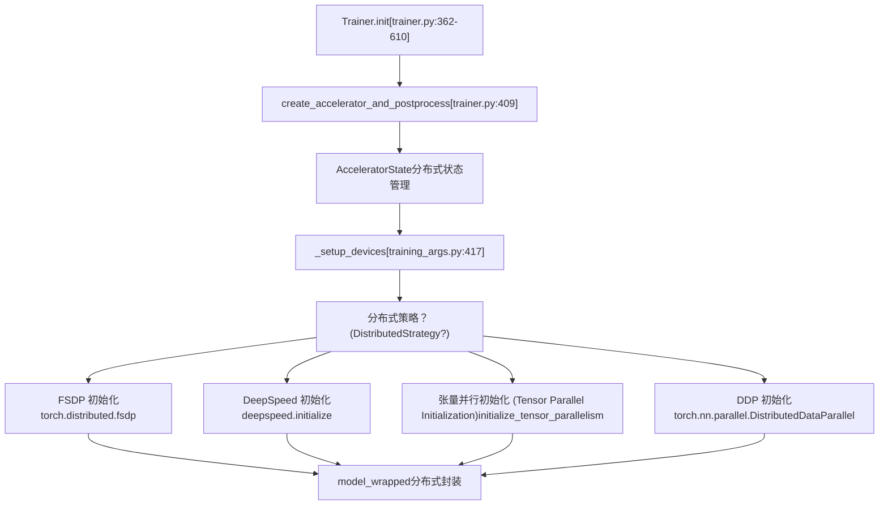
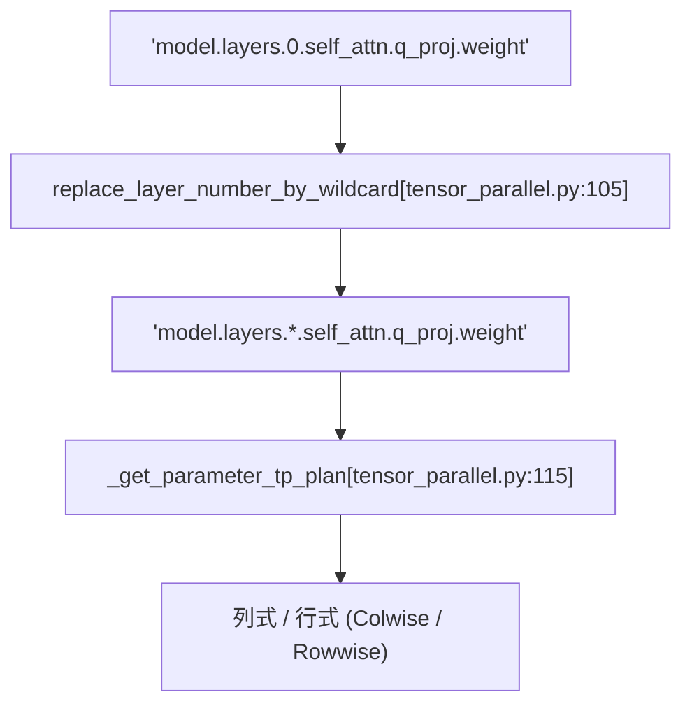

# 分布式训练支持 (Distributed Training Support)

相关源文件 (Relevant source files)

-   [ISSUES.md](https://github.com/huggingface/transformers/blob/9a9997fd/ISSUES.md?plain=1)
-   [docs/source/en/debugging.md](https://github.com/huggingface/transformers/blob/9a9997fd/docs/source/en/debugging.md?plain=1)
-   [docs/source/en/deepspeed.md](https://github.com/huggingface/transformers/blob/9a9997fd/docs/source/en/deepspeed.md?plain=1)
-   [docs/source/en/main\_classes/deepspeed.md](https://github.com/huggingface/transformers/blob/9a9997fd/docs/source/en/main_classes/deepspeed.md?plain=1)
-   [docs/source/en/main\_classes/trainer.md](https://github.com/huggingface/transformers/blob/9a9997fd/docs/source/en/main_classes/trainer.md?plain=1)
-   [docs/source/en/perf\_train\_gpu\_many.md](https://github.com/huggingface/transformers/blob/9a9997fd/docs/source/en/perf_train_gpu_many.md?plain=1)
-   [docs/source/en/perf\_train\_special.md](https://github.com/huggingface/transformers/blob/9a9997fd/docs/source/en/perf_train_special.md?plain=1)
-   [docs/source/en/weightconverter.md](https://github.com/huggingface/transformers/blob/9a9997fd/docs/source/en/weightconverter.md?plain=1)
-   [docs/source/es/debugging.md](https://github.com/huggingface/transformers/blob/9a9997fd/docs/source/es/debugging.md?plain=1)
-   [docs/source/it/debugging.md](https://github.com/huggingface/transformers/blob/9a9997fd/docs/source/it/debugging.md?plain=1)
-   [docs/source/ja/main\_classes/deepspeed.md](https://github.com/huggingface/transformers/blob/9a9997fd/docs/source/ja/main_classes/deepspeed.md?plain=1)
-   [docs/source/ja/main\_classes/trainer.md](https://github.com/huggingface/transformers/blob/9a9997fd/docs/source/ja/main_classes/trainer.md?plain=1)
-   [docs/source/ja/perf\_train\_gpu\_many.md](https://github.com/huggingface/transformers/blob/9a9997fd/docs/source/ja/perf_train_gpu_many.md?plain=1)
-   [docs/source/ko/debugging.md](https://github.com/huggingface/transformers/blob/9a9997fd/docs/source/ko/debugging.md?plain=1)
-   [docs/source/ko/deepspeed.md](https://github.com/huggingface/transformers/blob/9a9997fd/docs/source/ko/deepspeed.md?plain=1)
-   [docs/source/ko/perf\_train\_gpu\_many.md](https://github.com/huggingface/transformers/blob/9a9997fd/docs/source/ko/perf_train_gpu_many.md?plain=1)
-   [docs/source/zh/debugging.md](https://github.com/huggingface/transformers/blob/9a9997fd/docs/source/zh/debugging.md?plain=1)
-   [docs/source/zh/main\_classes/deepspeed.md](https://github.com/huggingface/transformers/blob/9a9997fd/docs/source/zh/main_classes/deepspeed.md?plain=1)
-   [docs/source/zh/main\_classes/trainer.md](https://github.com/huggingface/transformers/blob/9a9997fd/docs/source/zh/main_classes/trainer.md?plain=1)
-   [examples/3D\_parallel.py](https://github.com/huggingface/transformers/blob/9a9997fd/examples/3D_parallel.py)
-   [examples/pytorch/3d\_parallel\_checks.py](https://github.com/huggingface/transformers/blob/9a9997fd/examples/pytorch/3d_parallel_checks.py)
-   [examples/pytorch/context\_parallel.py](https://github.com/huggingface/transformers/blob/9a9997fd/examples/pytorch/context_parallel.py)
-   [src/transformers/integrations/deepspeed.py](https://github.com/huggingface/transformers/blob/9a9997fd/src/transformers/integrations/deepspeed.py)
-   [src/transformers/integrations/moe.py](https://github.com/huggingface/transformers/blob/9a9997fd/src/transformers/integrations/moe.py)
-   [src/transformers/integrations/tensor\_parallel.py](https://github.com/huggingface/transformers/blob/9a9997fd/src/transformers/integrations/tensor_parallel.py)
-   [src/transformers/modelcard.py](https://github.com/huggingface/transformers/blob/9a9997fd/src/transformers/modelcard.py)
-   [src/transformers/modeling\_layers.py](https://github.com/huggingface/transformers/blob/9a9997fd/src/transformers/modeling_layers.py)
-   [tests/models/deepseek\_vl/test\_modeling\_deepseek\_vl.py](https://github.com/huggingface/transformers/blob/9a9997fd/tests/models/deepseek_vl/test_modeling_deepseek_vl.py)
-   [tests/models/deepseek\_vl\_hybrid/test\_modeling\_deepseek\_vl\_hybrid.py](https://github.com/huggingface/transformers/blob/9a9997fd/tests/models/deepseek_vl_hybrid/test_modeling_deepseek_vl_hybrid.py)
-   [tests/sagemaker/README.md](https://github.com/huggingface/transformers/blob/9a9997fd/tests/sagemaker/README.md?plain=1)
-   [tests/sagemaker/scripts/pytorch/run\_glue\_model\_parallelism.py](https://github.com/huggingface/transformers/blob/9a9997fd/tests/sagemaker/scripts/pytorch/run_glue_model_parallelism.py)
-   [tests/tensor\_parallel/test\_tensor\_parallel.py](https://github.com/huggingface/transformers/blob/9a9997fd/tests/tensor_parallel/test_tensor_parallel.py)
-   [tests/trainer/test\_trainer\_accelerator.py](https://github.com/huggingface/transformers/blob/9a9997fd/tests/trainer/test_trainer_accelerator.py)
-   [tests/trainer/test\_trainer\_data.py](https://github.com/huggingface/transformers/blob/9a9997fd/tests/trainer/test_trainer_data.py)
-   [tests/trainer/test\_trainer\_evaluation.py](https://github.com/huggingface/transformers/blob/9a9997fd/tests/trainer/test_trainer_evaluation.py)
-   [tests/vlm\_tester.py](https://github.com/huggingface/transformers/blob/9a9997fd/tests/vlm_tester.py)

分布式训练 (Distributed Training) 支持通过并行化计算和内存，实现跨多个 GPU 和节点的超大规模模型训练。该系统与 🤗 Accelerate 集成，提供数据并行 (Data Parallel, DDP)、完全分片数据并行 (Fully Sharded Data Parallel, FSDP)、DeepSpeed ZeRO 以及张量并行 (Tensor Parallelism, TP) 策略。

## 概览 (Overview)

分布式训练系统建立在 🤗 Accelerate 之上，支持四种主要的并行化策略：

-   **数据并行 (Data Parallelism, DDP)**：在每个 GPU 上复制模型，将批次 (Batch) 拆分到各个 GPU。
-   **完全分片数据并行 (Fully Sharded Data Parallel, FSDP)**：将模型参数、梯度和优化器状态分片到各个 GPU。
-   **DeepSpeed ZeRO**：通过 ZeRO-1（优化器分片）、ZeRO-2（+ 梯度分片）和 ZeRO-3（+ 参数分片）实现内存高效的训练。
-   **张量并行 (Tensor Parallelism, TP)**：为超大规模模型将单个层/张量分片到各个 GPU。

系统根据硬件和所选策略自动初始化适当的后端（CUDA 使用 NCCL，CPU 使用 Gloo，XPU 使用 XCCL，HPU 使用 HCCL，AWS Trainium 使用 Neuron）。

## Accelerate 集成 (Accelerate Integration)

`Trainer` 使用 🤗 Accelerate 作为分布式训练后端，在 `Trainer.__init__` [src/transformers/trainer.py362-610] 期间初始化。

### Accelerator 初始化 (Accelerator Initialization)

**来源 (Sources)**： [src/transformers/trainer.py362-610](https://github.com/huggingface/transformers/blob/9a9997fd/src/transformers/trainer.py#L362-L610) [src/transformers/trainer.py404-409](https://github.com/huggingface/transformers/blob/9a9997fd/src/transformers/trainer.py#L404-L409) [src/transformers/training\_args.py417](https://github.com/huggingface/transformers/blob/9a9997fd/src/transformers/training_args.py#L417-L417)

`Accelerator` 管理进程组初始化、设备放置和梯度同步。初始化期间设置的关键属性包括 `self.is_deepspeed_enabled` [src/transformers/trainer.py452] 和 `self.is_fsdp_enabled` [src/transformers/trainer.py456-457]。

## 分布式策略 (Distributed Strategies)

### 数据并行 (Data Parallelism, DDP)

DDP 在每个 GPU 上复制完整模型，并将训练批次分布到各个设备。在每次反向传播之后，使用 all-reduce 同步梯度。

**内存概况 (Memory Profile)**：

-   模型 (Model)：每个 GPU 一个完整副本。
-   梯度 (Gradients)：每个 GPU 一个完整副本（已同步）。
-   优化器 (Optimizer)：每个 GPU 一个完整状态。

### 完全分片数据并行 (Fully Sharded Data Parallel, FSDP)

FSDP 将模型参数、梯度和优化器状态分片到各个 GPU，从而显著减少每个 GPU 的内存占用。它在正向/反向传播期间动态收集参数。

**配置 (Configuration)**：

| 参数 (Parameter) | 描述 (Description) | 位置 (Location) |
| --- | --- | --- |
| `fsdp` | 启用带有分片选项的 FSDP | [src/transformers/training\_args.py450-457](https://github.com/huggingface/transformers/blob/9a9997fd/src/transformers/training_args.py#L450-L457) |
| `fsdp_config` | 详细的 FSDP 配置 | [src/transformers/training\_args.py450-457](https://github.com/huggingface/transformers/blob/9a9997fd/src/transformers/training_args.py#L450-L457) |

### DeepSpeed ZeRO

DeepSpeed 通过 ZeRO（零冗余优化器，Zero Redundancy Optimizer）阶段提供内存高效的训练，这些阶段逐步对优化器状态（阶段 1）、梯度（阶段 2）和参数（阶段 3）进行分片 [docs/source/en/deepspeed.md21-25]。

**Trainer 集成 (Trainer Integration)**：`Trainer` 使用 `HfTrainerDeepSpeedConfig` 子类将 `TrainingArguments` 与 DeepSpeed 的 JSON 配置同步 [src/transformers/integrations/deepspeed.py82-132]。它根据世界大小 (World Size)、每设备批次大小和梯度累积步数自动计算 `train_batch_size` [src/transformers/integrations/deepspeed.py140-157]。

**ZeRO-3 与模型加载 (ZeRO-3 and Model Loading)**：对于 ZeRO-3，参数分布在各个 GPU 上。库提供了 `_load_state_dict_into_zero3_model` 来处理将权重加载到这些分片状态中 [src/transformers/integrations/deepspeed.py66]。

**来源 (Sources)**： [src/transformers/integrations/deepspeed.py82-157](https://github.com/huggingface/transformers/blob/9a9997fd/src/transformers/integrations/deepspeed.py#L82-L157) [docs/source/en/deepspeed.md17-30](https://github.com/huggingface/transformers/blob/9a9997fd/docs/source/en/deepspeed.md?plain=1#L17-L30)

### 张量并行 (Tensor Parallelism, TP)

张量并行将单个层分片到各个 GPU。它通过 `initialize_tensor_parallelism` 初始化 [src/transformers/integrations/tensor\_parallel.py40-102]。

**并行样式 (Parallel Styles)**：TP 支持在 `src/transformers/integrations/tensor_parallel.py` 中定义的几种分片样式：

-   `ColwiseParallel`：对权重矩阵进行列式分片 [src/transformers/integrations/tensor\_parallel.py22]。
-   `RowwiseParallel`：对权重矩阵进行行式分片 [src/transformers/integrations/tensor\_parallel.py27]。
-   `EmbeddingParallel`：对嵌入层 (Embedding Layers) 进行分片。
-   `GroupedGemmParallel`：针对混合专家 (Mixture-of-Experts, MoE) 层的专门分片 [src/transformers/integrations/tensor\_parallel.py24]。

**TP 计划与通配符 (TP Plan and Wildcards)**：`tp_plan` 将参数名称映射到样式。系统使用 `replace_layer_number_by_wildcard` 来匹配通用模式，例如 `model.layers.*.self_attn.q_proj` [src/transformers/integrations/tensor\_parallel.py105-112]。

**来源 (Sources)**： [src/transformers/integrations/tensor\_parallel.py22-30](https://github.com/huggingface/transformers/blob/9a9997fd/src/transformers/integrations/tensor_parallel.py#L22-L30) [src/transformers/integrations/tensor\_parallel.py105-130](https://github.com/huggingface/transformers/blob/9a9997fd/src/transformers/integrations/tensor_parallel.py#L105-L130)

## 设备映射 (Device Mapping) (Auto/Balanced/Sequential)

设备映射用于在推理 (Inference) 或单进程训练中将模型分布到多个 GPU。它通过 `accelerate` 集成进行管理。

**逻辑流 (Logic Flow)**：

1.  `_get_device_map` 计算分配情况 [src/transformers/integrations/accelerate.py58]。
2.  `check_and_set_device_map` 根据可用硬件验证映射 [src/transformers/integrations/accelerate.py61]。
3.  `accelerate_dispatch` 将映射应用到模型 [src/transformers/integrations/accelerate.py60]。

**互斥性 (Mutual Exclusion)**：`tp_plan` 和 `device_map` 是互斥的；必须为并行化选择其中之一 [src/transformers/integrations/tensor\_parallel.py49-50]。

## 动态权重加载与 MoE (Dynamic Weight Loading and MoE)

系统支持混合专家 (Mixture-of-Experts, MoE) 等复杂架构的动态权重加载。

**MoE 整合 (MoE Consolidation)**：MoE 模型通常在检查点中分别存储专家权重。`WeightConverter` 使用 `MergeModulelist` 和 `Concatenate` 操作在加载期间将这些权重堆叠成 3D 张量 [docs/source/en/weightconverter.md81-90]。

**专家并行 (Expert Parallelism, EP)**：在 MoE 模型中，token 可以路由到不同设备上的专家。`batched_mm_experts_forward` 函数处理路由，并应用掩码 (Mask) 来归零来自无效专家（位于其他设备上的专家）的贡献 [src/transformers/integrations/moe.py103-160]。

**来源 (Sources)**： [docs/source/en/weightconverter.md81-90](https://github.com/huggingface/transformers/blob/9a9997fd/docs/source/en/weightconverter.md?plain=1#L81-L90) [src/transformers/integrations/moe.py103-160](https://github.com/huggingface/transformers/blob/9a9997fd/src/transformers/integrations/moe.py#L103-L160)

## 多节点设置 (Multi-Node Setup)

多节点训练需要 `device_mesh`。系统通过 `torch.distributed.init_device_mesh` 初始化此网格 [src/transformers/integrations/tensor\_parallel.py90]。

**后端映射 (Backend Map)**：系统将硬件映射到分布式后端：

-   `cuda`：`nccl`
-   `cpu`：`gloo`
-   `xpu`：`xccl`
-   `hpu`：`hccl`
-   `neuron`：`neuron` [src/transformers/integrations/tensor\_parallel.py66-67]

**进程初始化 (Process Initialization)**：库尝试通过从环境变量读取 `RANK`、`LOCAL_RANK` 和 `WORLD_SIZE` 来自动初始化进程组 [src/transformers/integrations/tensor\_parallel.py62-69]。

**来源 (Sources)**： [src/transformers/integrations/tensor\_parallel.py60-90](https://github.com/huggingface/transformers/blob/9a9997fd/src/transformers/integrations/tensor_parallel.py#L60-L90)
