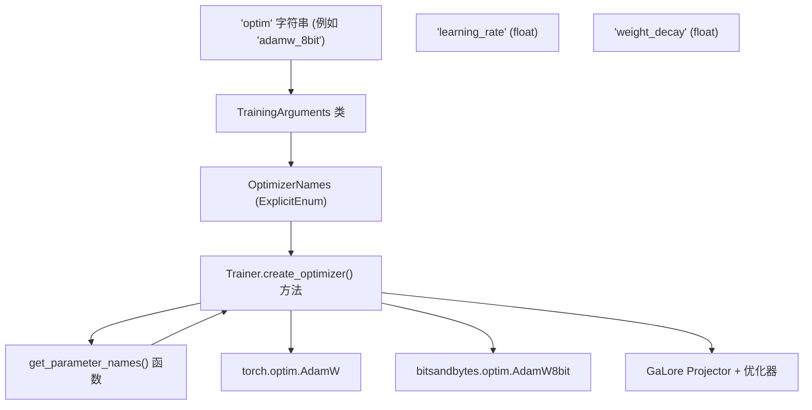
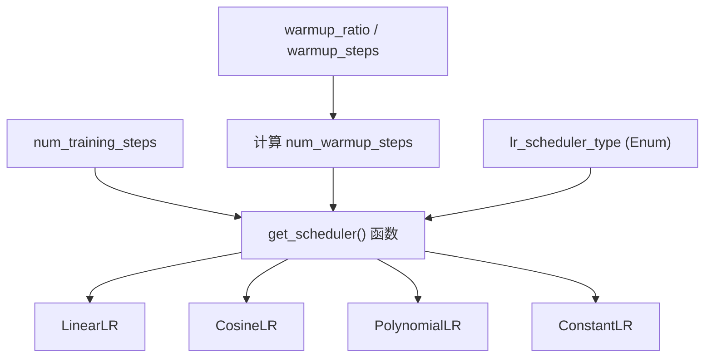

# 优化与调度 (Optimization and Scheduling)

相关源文件 (Relevant source files)

-   [docs/source/ar/training.md](https://github.com/huggingface/transformers/blob/9a9997fd/docs/source/ar/training.md?plain=1)
-   [docs/source/de/training.md](https://github.com/huggingface/transformers/blob/9a9997fd/docs/source/de/training.md?plain=1)
-   [docs/source/en/data\_collators.md](https://github.com/huggingface/transformers/blob/9a9997fd/docs/source/en/data_collators.md?plain=1)
-   [docs/source/en/main\_classes/quantization.md](https://github.com/huggingface/transformers/blob/9a9997fd/docs/source/en/main_classes/quantization.md?plain=1)
-   [docs/source/en/optimizers.md](https://github.com/huggingface/transformers/blob/9a9997fd/docs/source/en/optimizers.md?plain=1)
-   [docs/source/en/quantization/overview.md](https://github.com/huggingface/transformers/blob/9a9997fd/docs/source/en/quantization/overview.md?plain=1)
-   [docs/source/en/trainer.md](https://github.com/huggingface/transformers/blob/9a9997fd/docs/source/en/trainer.md?plain=1)
-   [docs/source/en/trainer\_callbacks.md](https://github.com/huggingface/transformers/blob/9a9997fd/docs/source/en/trainer_callbacks.md?plain=1)
-   [docs/source/en/trainer\_customize.md](https://github.com/huggingface/transformers/blob/9a9997fd/docs/source/en/trainer_customize.md?plain=1)
-   [docs/source/en/training.md](https://github.com/huggingface/transformers/blob/9a9997fd/docs/source/en/training.md?plain=1)
-   [docs/source/es/training.md](https://github.com/huggingface/transformers/blob/9a9997fd/docs/source/es/training.md?plain=1)
-   [docs/source/it/training.md](https://github.com/huggingface/transformers/blob/9a9997fd/docs/source/it/training.md?plain=1)
-   [docs/source/ja/training.md](https://github.com/huggingface/transformers/blob/9a9997fd/docs/source/ja/training.md?plain=1)
-   [docs/source/ko/optimizers.md](https://github.com/huggingface/transformers/blob/9a9997fd/docs/source/ko/optimizers.md?plain=1)
-   [docs/source/ko/training.md](https://github.com/huggingface/transformers/blob/9a9997fd/docs/source/ko/training.md?plain=1)
-   [docs/source/pt/training.md](https://github.com/huggingface/transformers/blob/9a9997fd/docs/source/pt/training.md?plain=1)
-   [docs/source/zh/training.md](https://github.com/huggingface/transformers/blob/9a9997fd/docs/source/zh/training.md?plain=1)
-   [setup.py](https://github.com/huggingface/transformers/blob/9a9997fd/setup.py)
-   [src/transformers/conversion\_mapping.py](https://github.com/huggingface/transformers/blob/9a9997fd/src/transformers/conversion_mapping.py)
-   [src/transformers/core\_model\_loading.py](https://github.com/huggingface/transformers/blob/9a9997fd/src/transformers/core_model_loading.py)
-   [src/transformers/dependency\_versions\_table.py](https://github.com/huggingface/transformers/blob/9a9997fd/src/transformers/dependency_versions_table.py)
-   [src/transformers/integrations/\_\_init\_\_.py](https://github.com/huggingface/transformers/blob/9a9997fd/src/transformers/integrations/__init__.py)
-   [src/transformers/integrations/accelerate.py](https://github.com/huggingface/transformers/blob/9a9997fd/src/transformers/integrations/accelerate.py)
-   [src/transformers/integrations/peft.py](https://github.com/huggingface/transformers/blob/9a9997fd/src/transformers/integrations/peft.py)
-   [src/transformers/modeling\_utils.py](https://github.com/huggingface/transformers/blob/9a9997fd/src/transformers/modeling_utils.py)
-   [src/transformers/quantizers/auto.py](https://github.com/huggingface/transformers/blob/9a9997fd/src/transformers/quantizers/auto.py)
-   [src/transformers/testing\_utils.py](https://github.com/huggingface/transformers/blob/9a9997fd/src/transformers/testing_utils.py)
-   [src/transformers/trainer.py](https://github.com/huggingface/transformers/blob/9a9997fd/src/transformers/trainer.py)
-   [src/transformers/trainer\_utils.py](https://github.com/huggingface/transformers/blob/9a9997fd/src/transformers/trainer_utils.py)
-   [src/transformers/training\_args.py](https://github.com/huggingface/transformers/blob/9a9997fd/src/transformers/training_args.py)
-   [src/transformers/utils/\_\_init\_\_.py](https://github.com/huggingface/transformers/blob/9a9997fd/src/transformers/utils/__init__.py)
-   [src/transformers/utils/import\_utils.py](https://github.com/huggingface/transformers/blob/9a9997fd/src/transformers/utils/import_utils.py)
-   [src/transformers/utils/loading\_report.py](https://github.com/huggingface/transformers/blob/9a9997fd/src/transformers/utils/loading_report.py)
-   [src/transformers/utils/quantization\_config.py](https://github.com/huggingface/transformers/blob/9a9997fd/src/transformers/utils/quantization_config.py)
-   [tests/peft\_integration/test\_peft\_integration.py](https://github.com/huggingface/transformers/blob/9a9997fd/tests/peft_integration/test_peft_integration.py)
-   [tests/test\_modeling\_common.py](https://github.com/huggingface/transformers/blob/9a9997fd/tests/test_modeling_common.py)
-   [tests/trainer/test\_trainer.py](https://github.com/huggingface/transformers/blob/9a9997fd/tests/trainer/test_trainer.py)
-   [tests/utils/test\_core\_model\_loading.py](https://github.com/huggingface/transformers/blob/9a9997fd/tests/utils/test_core_model_loading.py)
-   [tests/utils/test\_modeling\_utils.py](https://github.com/huggingface/transformers/blob/9a9997fd/tests/utils/test_modeling_utils.py)
-   [utils/check\_config\_attributes.py](https://github.com/huggingface/transformers/blob/9a9997fd/utils/check_config_attributes.py)

本文档介绍了 `Trainer` 中的优化与调度系统，该系统支持 30 多种优化器 (Optimizer) 变体和灵活的学习率调度 (Learning Rate Scheduling) 策略。该系统处理优化器选择、权重衰减 (Weight Decay) 处理、学习率调度、梯度裁剪 (Gradient Clipping) 以及 GaLore、LOMO 和 APOLLO 等高级优化技术。

---

## 目的与范围 (Purpose and Scope)

优化与调度系统提供：

-   **优化器工厂 (Optimizer Factory)**：根据 `TrainingArguments.optim` 配置动态创建优化器。 [src/transformers/trainer.py1277-1498](https://github.com/huggingface/transformers/blob/9a9997fd/src/transformers/trainer.py#L1277-L1498)
-   **30 多种优化器变体**：支持标准优化器（AdamW, SGD, Adagrad）、内存高效变体（8-bit AdamW、分页优化器 (Paged Optimizers)）以及高级技术（GaLore, LOMO, APOLLO, ScheduleFree）。 [src/transformers/training\_args.py111-158](https://github.com/huggingface/transformers/blob/9a9997fd/src/transformers/training_args.py#L111-L158)
-   **学习率调度器 (Learning Rate Schedulers)**：多种调度器类型，包括线性热身 (Linear Warmup)、余弦退火 (Cosine Annealing)、多项式衰减 (Polynomial Decay) 和常量调度 (Constant Schedules)。 [src/transformers/trainer\_utils.py355-367](https://github.com/huggingface/transformers/blob/9a9997fd/src/transformers/trainer_utils.py#L355-L367)
-   **梯度管理 (Gradient Management)**：梯度裁剪和带有可配置策略的梯度累积 (Gradient Accumulation)。 [src/transformers/trainer.py3065-3080](https://github.com/huggingface/transformers/blob/9a9997fd/src/transformers/trainer.py#L3065-L3080)
-   **权重衰减处理 (Weight Decay Handling)**：自动将参数分为衰减组和非衰减组（排除偏置 (Biases) 和 LayerNorm）。 [src/transformers/trainer\_pt\_utils.py1038-1088](https://github.com/huggingface/transformers/blob/9a9997fd/src/transformers/trainer_pt_utils.py#L1038-L1088)

---

## 优化器工厂系统 (Optimizer Factory System)

`Trainer` 使用工厂模式根据 `TrainingArguments` 中的 `optim` 参数实例化优化器。该工厂既支持标准 PyTorch 优化器，也支持来自 `bitsandbytes` 等外部库的专门变体。

### 优化器创建流程 (Optimizer Creation Flow)

下图说明了 `Trainer` 如何将配置解析为功能性代码实体。

**图表：优化实体映射 (Diagram: Optimization Entity Mapping)**


**来源 (Sources)**： [src/transformers/trainer.py1277-1498](https://github.com/huggingface/transformers/blob/9a9997fd/src/transformers/trainer.py#L1277-L1498) [src/transformers/training\_args.py111-158](https://github.com/huggingface/transformers/blob/9a9997fd/src/transformers/training_args.py#L111-L158) [src/transformers/trainer\_pt\_utils.py1038-1088](https://github.com/huggingface/transformers/blob/9a9997fd/src/transformers/trainer_pt_utils.py#L1038-L1088)

### 关键方法与配置 (Key Methods and Configuration)

| 方法 (Method) | 位置 (Location) | 目的 (Purpose) |
| --- | --- | --- |
| `create_optimizer_and_scheduler()` | [src/transformers/trainer.py1112-1275](https://github.com/huggingface/transformers/blob/9a9997fd/src/transformers/trainer.py#L1112-L1275) | 编排优化器和调度器设置的主要入口点。 |
| `create_optimizer()` | [src/transformers/trainer.py1277-1498](https://github.com/huggingface/transformers/blob/9a9997fd/src/transformers/trainer.py#L1277-L1498) | 根据 `optim` 参数实例化优化器的工厂方法。 |
| `create_scheduler()` | [src/transformers/trainer.py1500-1552](https://github.com/huggingface/transformers/blob/9a9997fd/src/transformers/trainer.py#L1500-L1552) | 根据 `lr_scheduler_type` 创建学习率调度器。 |
| `get_parameter_names()` | [src/transformers/trainer\_pt\_utils.py1038-1088](https://github.com/huggingface/transformers/blob/9a9997fd/src/transformers/trainer_pt_utils.py#L1038-L1088) | 识别用于优化的参数，特别是过滤出权重衰减的应用对象。 |

**来源 (Sources)**： [src/transformers/trainer.py1112-1552](https://github.com/huggingface/transformers/blob/9a9997fd/src/transformers/trainer.py#L1112-L1552) [src/transformers/trainer\_pt\_utils.py1038-1088](https://github.com/huggingface/transformers/blob/9a9997fd/src/transformers/trainer_pt_utils.py#L1038-L1088)

---

## 支持的优化器 (Supported Optimizers)

`Trainer` 通过 `training_args.py` 中定义的 `OptimizerNames` 枚举支持大量优化器。 [src/transformers/training\_args.py111-158](https://github.com/huggingface/transformers/blob/9a9997fd/src/transformers/training_args.py#L111-L158)

### 优化器类别 (Optimizer Categories)

| 类别 (Category) | 优化器标识符（示例） | 特性 (Characteristics) |
| --- | --- | --- |
| **标准 (Standard)** | `adamw_torch`, `sgd`, `adagrad` | 默认 PyTorch 实现。 |
| **融合 (Fused)** | `adamw_torch_fused`, `adamw_apex_fused` | 通过算子融合 (Kernel Fusion) 实现更快执行。 |
| **8-bit** | `adamw_bnb_8bit`, `lion_8bit` | 使用 `bitsandbytes` 减少内存。 |
| **分页 (Paged)** | `paged_adamw_8bit`, `paged_lion_32bit` | 通过分页到 CPU 处理显存溢出 (OOM)。 |
| **低秩 (Low-Rank)** | `galore_adamw`, `galore_adafactor` | 将梯度投影到低秩子空间。 |
| **内存高效 (Memory-Efficient)** | `lomo`, `adalomo`, `adafactor` | 为超大规模模型设计。 |
| **无调度器 (Schedule-Free)** | `schedule_free_adamw`, `schedule_free_sgd` | 无需学习率调度器。 |

**来源 (Sources)**： [src/transformers/training\_args.py111-158](https://github.com/huggingface/transformers/blob/9a9997fd/src/transformers/training_args.py#L111-L158) [src/transformers/trainer.py1277-1498](https://github.com/huggingface/transformers/blob/9a9997fd/src/transformers/trainer.py#L1277-L1498)

### 权重衰减处理 (Weight Decay Handling)

`Trainer` 通过将参数分为两组自动处理权重衰减。它使用 `get_parameter_names` 来识别*不应*应用权重衰减的参数，通常包括所有 `LayerNorm` 类型以及名称中带有 "bias" 的任何参数。 [src/transformers/trainer\_pt\_utils.py1038-1088](https://github.com/huggingface/transformers/blob/9a9997fd/src/transformers/trainer_pt_utils.py#L1038-L1088)

```
# 来自 create_optimizer() 的逻辑
decay_parameters = get_parameter_names(model, ALL_LAYERNORM_LAYERS)
decay_parameters = [name for name in decay_parameters if "bias" not in name]
optimizer_grouped_parameters = [
    {
        "params": [p for n, p in model.named_parameters() if (n in decay_parameters and p.requires_grad)],
        "weight_decay": self.args.weight_decay,
    },
    {
        "params": [p for n, p in model.named_parameters() if (n not in decay_parameters and p.requires_grad)],
        "weight_decay": 0.0,
    },
]
```
**来源 (Sources)**： [src/transformers/trainer.py1290-1310](https://github.com/huggingface/transformers/blob/9a9997fd/src/transformers/trainer.py#L1290-L1310) [src/transformers/trainer\_pt\_utils.py1038-1088](https://github.com/huggingface/transformers/blob/9a9997fd/src/transformers/trainer_pt_utils.py#L1038-L1088)

---

## 学习率调度器 (Learning Rate Schedulers)

调度器根据 `TrainingArguments.lr_scheduler_type` 创建。库支持标准衰减模式以及热身 (Warmup) 阶段。

### 调度器实现流程 (Scheduler Implementation Flow)

**图表：调度器逻辑与数据流 (Diagram: Scheduler Logic and Data Flow)**


**来源 (Sources)**： [src/transformers/trainer.py1500-1552](https://github.com/huggingface/transformers/blob/9a9997fd/src/transformers/trainer.py#L1500-L1552) [src/transformers/optimization.py80](https://github.com/huggingface/transformers/blob/9a9997fd/src/transformers/optimization.py#L80-L80)

### 支持的调度器类型 (Supported Scheduler Types)

| 类型 (Type) | 描述 (Description) |
| --- | --- |
| `linear` | 从峰值到 0 的线性衰减。 |
| `cosine` | 余弦退火退火退火退火 (Cosine Annealing) 衰减。 |
| `cosine_with_restarts` | 带有周期性重启的余弦衰减。 |
| `polynomial` | 多项式幂次衰减。 |
| `constant` | 学习率保持在 `learning_rate`。 |
| `constant_with_warmup` | 线性热身后跟随常量速率。 |
| `inverse_sqrt` | 基于步数倒数平方根的衰减。 |

**来源 (Sources)**： [src/transformers/trainer\_utils.py355-367](https://github.com/huggingface/transformers/blob/9a9997fd/src/transformers/trainer_utils.py#L355-L367) [src/transformers/trainer.py1500-1552](https://github.com/huggingface/transformers/blob/9a9997fd/src/transformers/trainer.py#L1500-L1552)

---

## 梯度管理 (Gradient Management)

### 梯度裁剪 (Gradient Clipping)

梯度裁剪应用于训练循环中，以防止梯度爆炸 (Exploding Gradients)。它由 `TrainingArguments.max_grad_norm` 控制。 [src/transformers/training\_args.py286-291](https://github.com/huggingface/transformers/blob/9a9997fd/src/transformers/training_args.py#L286-291)

如果启用，`Trainer` 在优化器步之前调用 `accelerator.clip_grad_norm_`（或针对 FSDP/DeepSpeed 的特定模型裁剪）。 [src/transformers/trainer.py3065-3080](https://github.com/huggingface/transformers/blob/9a9997fd/src/transformers/trainer.py#L3065-L3080)

### 梯度累积 (Gradient Accumulation)

梯度累积允许通过在执行优化器更新之前在 `gradient_accumulation_steps` 上累积梯度来模拟更大的批次大小。 [src/transformers/training\_args.py276-281](https://github.com/huggingface/transformers/blob/9a9997fd/src/transformers/training_args.py#L276-L281)

`Trainer` 通过将损失缩放 `1 / gradient_accumulation_steps`，并仅在达到累积阈值时调用 `optimizer.step()` 和 `scheduler.step()` 来管理此过程。 [src/transformers/trainer.py2537-2555](https://github.com/huggingface/transformers/blob/9a9997fd/src/transformers/trainer.py#L2537-L2555)

---

## 高级优化技术 (Advanced Optimization Techniques)

### GaLore (梯度低秩投影, Gradient Low-Rank Projection)

GaLore 通过将梯度投影到低秩子空间来减少内存。当 `optim` 设置为 `galore_*` 变体时触发。 [src/transformers/trainer.py1351-1403](https://github.com/huggingface/transformers/blob/9a9997fd/src/transformers/trainer.py#L1351-L1403)

### LOMO (低内存优化, Low-Memory Optimization)

LOMO 将反向传播和优化器更新融合在一起以节省内存。它在反向传播期间逐层更新参数，避免了存储全模型梯度的需要。 [src/transformers/trainer.py1436-1454](https://github.com/huggingface/transformers/blob/9a9997fd/src/transformers/trainer.py#L1436-L1454)

### APOLLO

APOLLO 根据局部曲率使用每个参数的自适应学习率。它需要在 `TrainingArguments` 中指定 `optim_target_modules`。 [src/transformers/trainer.py1405-1434](https://github.com/huggingface/transformers/blob/9a9997fd/src/transformers/trainer.py#L1405-L1434)

---

## 关键文件摘要 (Summary of Key Files)

-   `src/transformers/trainer.py`：包含创建和执行优化器/调度步的逻辑。 [src/transformers/trainer.py1](https://github.com/huggingface/transformers/blob/9a9997fd/src/transformers/trainer.py#L1-L1)
-   `src/transformers/training_args.py`：定义配置选项和 `OptimizerNames` 枚举。 [src/transformers/training\_args.py1](https://github.com/huggingface/transformers/blob/9a9997fd/src/transformers/training_args.py#L1-L1)
-   `src/transformers/trainer_pt_utils.py`：用于参数分组和权重衰减过滤的实用函数。 [src/transformers/trainer\_pt\_utils.py1](https://github.com/huggingface/transformers/blob/9a9997fd/src/transformers/trainer_pt_utils.py#L1-L1)
-   `src/transformers/optimization.py`：调度器工厂和特定调度器逻辑的实现。 [src/transformers/optimization.py1](https://github.com/huggingface/transformers/blob/9a9997fd/src/transformers/optimization.py#L1-L1)

**来源 (Sources)**： [src/transformers/trainer.py1](https://github.com/huggingface/transformers/blob/9a9997fd/src/transformers/trainer.py#L1-L1) [src/transformers/training\_args.py1](https://github.com/huggingface/transformers/blob/9a9997fd/src/transformers/training_args.py#L1-L1) [src/transformers/trainer\_pt\_utils.py1](https://github.com/huggingface/transformers/blob/9a9997fd/src/transformers/trainer_pt_utils.py#L1-L1) [src/transformers/optimization.py1](https://github.com/huggingface/transformers/blob/9a9997fd/src/transformers/optimization.py#L1-L1)
