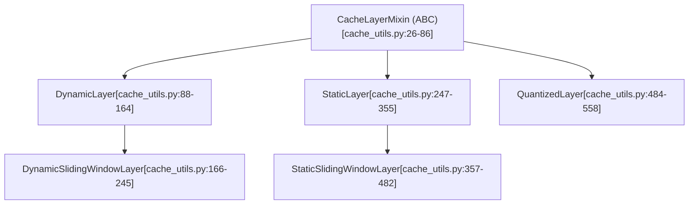

# 生成系统 (Generation System)

相关源文件

-   [benchmark_v2/benchmark_scripts/continuous_batching_overall.py](https://github.com/huggingface/transformers/blob/9a9997fd/benchmark_v2/benchmark_scripts/continuous_batching_overall.py)
-   [docs/source/en/generation_strategies.md](https://github.com/huggingface/transformers/blob/9a9997fd/docs/source/en/generation_strategies.md?plain=1)
-   [docs/source/en/internal/generation_utils.md](https://github.com/huggingface/transformers/blob/9a9997fd/docs/source/en/internal/generation_utils.md?plain=1)
-   [docs/source/en/main_classes/text_generation.md](https://github.com/huggingface/transformers/blob/9a9997fd/docs/source/en/main_classes/text_generation.md?plain=1)
-   [examples/pytorch/continuous_batching.py](https://github.com/huggingface/transformers/blob/9a9997fd/examples/pytorch/continuous_batching.py)
-   [src/transformers/cache_utils.py](https://github.com/huggingface/transformers/blob/9a9997fd/src/transformers/cache_utils.py)
-   [src/transformers/generation/__init__.py](https://github.com/huggingface/transformers/blob/9a9997fd/src/transformers/generation/__init__.py)
-   [src/transformers/generation/candidate_generator.py](https://github.com/huggingface/transformers/blob/9a9997fd/src/transformers/generation/candidate_generator.py)
-   [src/transformers/generation/configuration_utils.py](https://github.com/huggingface/transformers/blob/9a9997fd/src/transformers/generation/configuration_utils.py)
-   [src/transformers/generation/continuous_batching/cache.py](https://github.com/huggingface/transformers/blob/9a9997fd/src/transformers/generation/continuous_batching/cache.py)
-   [src/transformers/generation/continuous_batching/cache_manager.py](https://github.com/huggingface/transformers/blob/9a9997fd/src/transformers/generation/continuous_batching/cache_manager.py)
-   [src/transformers/generation/continuous_batching/continuous_api.py](https://github.com/huggingface/transformers/blob/9a9997fd/src/transformers/generation/continuous_batching/continuous_api.py)
-   [src/transformers/generation/continuous_batching/input_outputs.py](https://github.com/huggingface/transformers/blob/9a9997fd/src/transformers/generation/continuous_batching/input_outputs.py)
-   [src/transformers/generation/continuous_batching/requests.py](https://github.com/huggingface/transformers/blob/9a9997fd/src/transformers/generation/continuous_batching/requests.py)
-   [src/transformers/generation/continuous_batching/scheduler.py](https://github.com/huggingface/transformers/blob/9a9997fd/src/transformers/generation/continuous_batching/scheduler.py)
-   [src/transformers/generation/continuous_batching/utils.py](https://github.com/huggingface/transformers/blob/9a9997fd/src/transformers/generation/continuous_batching/utils.py)
-   [src/transformers/generation/logits_process.py](https://github.com/huggingface/transformers/blob/9a9997fd/src/transformers/generation/logits_process.py)
-   [src/transformers/generation/stopping_criteria.py](https://github.com/huggingface/transformers/blob/9a9997fd/src/transformers/generation/stopping_criteria.py)
-   [src/transformers/generation/utils.py](https://github.com/huggingface/transformers/blob/9a9997fd/src/transformers/generation/utils.py)
-   [src/transformers/integrations/flash_paged.py](https://github.com/huggingface/transformers/blob/9a9997fd/src/transformers/integrations/flash_paged.py)
-   [src/transformers/models/clvp/modeling_clvp.py](https://github.com/huggingface/transformers/blob/9a9997fd/src/transformers/models/clvp/modeling_clvp.py)
-   [src/transformers/pytorch_utils.py](https://github.com/huggingface/transformers/blob/9a9997fd/src/transformers/pytorch_utils.py)
-   [tests/generation/test_candidate_generator.py](https://github.com/huggingface/transformers/blob/9a9997fd/tests/generation/test_candidate_generator.py)
-   [tests/generation/test_configuration_utils.py](https://github.com/huggingface/transformers/blob/9a9997fd/tests/generation/test_configuration_utils.py)
-   [tests/generation/test_continuous_batching.py](https://github.com/huggingface/transformers/blob/9a9997fd/tests/generation/test_continuous_batching.py)
-   [tests/generation/test_logits_process.py](https://github.com/huggingface/transformers/blob/9a9997fd/tests/generation/test_logits_process.py)
-   [tests/generation/test_stopping_criteria.py](https://github.com/huggingface/transformers/blob/9a9997fd/tests/generation/test_stopping_criteria.py)
-   [tests/generation/test_utils.py](https://github.com/huggingface/transformers/blob/9a9997fd/tests/generation/test_utils.py)
-   [tests/utils/test_cache_utils.py](https://github.com/huggingface/transformers/blob/9a9997fd/tests/utils/test_cache_utils.py)

本页面介绍了 `transformers` 库的文本生成子系统。它涵盖了主要抽象、它们之间的关系，以及 `generate()` 调用如何在系统中流动。有关特定子系统的详细介绍，请参阅子页面：

-   配置和解码模式选择 → [Generation Configuration and Modes (生成配置与模式)](/huggingface/transformers/4.1-generation-configuration-and-modes)
-   Logits 处理器和停止标准 → [Logits Processing Pipeline (Logits 处理流水线)](/huggingface/transformers/4.2-logits-processing-pipeline)
-   KV 缓存实现 → [Cache System (缓存系统)](/huggingface/transformers/4.3-cache-system)
-   投机解码与辅助解码 → [Assisted and Speculative Decoding (辅助解码与投机解码)](/huggingface/transformers/4.4-assisted-and-speculative-decoding)
-   用于服务的连续批处理 → [Continuous Batching and Serving (连续批处理与服务)](/huggingface/transformers/4.5-continuous-batching-and-serving)

有关生成建立在其之上的模型架构（例如，Decoder-only (仅解码器) LLMs），请参阅 [Model Architectures (模型架构)](/huggingface/transformers/5-model-architectures)。

---

## 概览 (Overview)

生成子系统是实现 Auto-regressive (自回归) 文本生成的类和实用程序的集合。任何能够生成序列的模型（Causal LMs (因果语言模型)、Encoder-decoder (编码器-解码器) 模型等）都通过继承 `GenerationMixin` 来获得此能力，该 mixin 提供了 `generate()` 方法及其所有支持基础设施。

该子系统主要包含在 `src/transformers/generation/` 目录中，KV cache (KV 缓存) 实现在 `src/transformers/cache_utils.py` 中。

**主要源文件：**

| 文件 | 职责 |
| --- | --- |
| `src/transformers/generation/utils.py` | `GenerationMixin`、输出数据类、核心循环 |
| `src/transformers/generation/configuration_utils.py` | `GenerationConfig`、`GenerationMode` 枚举 |
| `src/transformers/generation/logits_process.py` | 所有 `LogitsProcessor` 和 `LogitsWarper` 子类 |
| `src/transformers/generation/stopping_criteria.py` | `StoppingCriteria` 子类 |
| `src/transformers/generation/candidate_generator.py` | 用于 Speculative Decoding (投机解码) 的 `CandidateGenerator` |
| `src/transformers/generation/continuous_batching/` | `ContinuousBatchProcessor`、`PagedAttentionCache` |
| `src/transformers/cache_utils.py` | `Cache`、`DynamicCache`、`StaticCache` 等 |

来源：[src/transformers/generation/__init__.py1-203](https://github.com/huggingface/transformers/blob/9a9997fd/src/transformers/generation/__init__.py#L1-L203) [src/transformers/generation/utils.py1-143](https://github.com/huggingface/transformers/blob/9a9997fd/src/transformers/generation/utils.py#L1-L143)

---

## 组件图 (Component Map)

下图映射了主要抽象及其代码位置和关系。

**图表：生成系统 – 组件图**

```mermaid
flowchart TD
    GM["GenerationMixin"]
    OUT1["GenerateDecoderOnlyOutput"]
    OUT2["GenerateEncoderDecoderOutput"]
    OUT3["GenerateBeamDecoderOnlyOutput"]
    OUT4["GenerateBeamEncoderDecoderOutput"]
    GC["GenerationConfig"]
    MODE["GenerationMode (enum)"]
    CC["CompileConfig"]
    LP["LogitsProcessor (ABC)"]
    LPL["LogitsProcessorList"]
    PROCS["TemperatureLogitsWarperTopKLogitsWarperTopPLogitsWarperRepetitionPenaltyLogitsProcessor..."]
    SC["StoppingCriteria (ABC)"]
    SCL["StoppingCriteriaList"]
    STOPS["MaxLengthCriteriaMaxTimeCriteriaEosTokenCriteriaStopStringCriteria"]
    CACHE["Cache (base)"]
    DC["DynamicCache"]
    STC["StaticCache"]
    QC["QuantizedCache"]
    EDC["EncoderDecoderCache"]
    CG["CandidateGenerator (ABC)"]
    ACG["AssistedCandidateGenerator"]
    PLCG["PromptLookupCandidateGenerator"]
    USDG["UniversalSpeculativeDecodingGenerator"]
    CM["ContinuousMixin"]
    CBP["ContinuousBatchProcessor"]
    PAC["PagedAttentionCache"]

    GM --> GC
    GM --> LPL
    GM --> SCL
    GM --> CACHE
    GM --> CG
    GM --> CM
    GC --> MODE
    LPL --> LP
    SCL --> SC
    LP --> PROCS
    SC --> STOPS
    CACHE --> DC
    CACHE --> STC
    CACHE --> QC
    CACHE --> EDC
    CG --> ACG
    CG --> PLCG
    CG --> USDG
    CM --> CBP
    CBP --> PAC
```

来源：[src/transformers/generation/utils.py53-109](https://github.com/huggingface/transformers/blob/9a9997fd/src/transformers/generation/utils.py#L53-L109) [src/transformers/generation/configuration_utils.py63-79](https://github.com/huggingface/transformers/blob/9a9997fd/src/transformers/generation/configuration_utils.py#L63-L79) [src/transformers/cache_utils.py27-56](https://github.com/huggingface/transformers/blob/9a9997fd/src/transformers/cache_utils.py#L27-L56) [src/transformers/generation/continuous_batching/continuous_api.py82-112](https://github.com/huggingface/transformers/blob/9a9997fd/src/transformers/generation/continuous_batching/continuous_api.py#L82-L112)

---

## `GenerationMixin` 类

`GenerationMixin` 定义在 [src/transformers/generation/utils.py338-365](https://github.com/huggingface/transformers/blob/9a9997fd/src/transformers/generation/utils.py#L338-L365)，是所有生成功能的入口点。它继承自 `ContinuousMixin`，后者增加了面向服务的 Continuous Batching (连续批处理) 支持。

任何生成序列的模型都应继承它。该类包含以下面向公众的方法：

| 方法 | 用途 | 位置 |
| --- | --- | --- |
| `generate()` | 主要入口点；编排整个解码循环 | 主要生成方法 |
| `prepare_inputs_for_generation()` | 按步组装模型输入字典 | [src/transformers/generation/utils.py494-592](https://github.com/huggingface/transformers/blob/9a9997fd/src/transformers/generation/utils.py#L494-L592) |
| `compute_transition_scores()` | 根据 Beam scores (束分数) 计算每个 token 的对数概率 | 生成后分析 |
| `adjust_generation_fn()` | 加载 `GenerationConfig` 和可选的自定义 `generate.py` | [src/transformers/generation/utils.py370-421](https://github.com/huggingface/transformers/blob/9a9997fd/src/transformers/generation/utils.py#L370-L421) |

`generate()` 方法在内部派发到 `GENERATION_MODES_MAPPING` 中定义的私有方法之一：`_sample()`（用于 Greedy (贪婪)/Sampling (采样)）、`_beam_search()`（用于 Beam (束) 方法）或 `_assisted_decoding()`（用于 Speculative Decoding (投机解码)）。

来源：[src/transformers/generation/utils.py133-144](https://github.com/huggingface/transformers/blob/9a9997fd/src/transformers/generation/utils.py#L133-L144) [src/transformers/generation/utils.py338-593](https://github.com/huggingface/transformers/blob/9a9997fd/src/transformers/generation/utils.py#L338-L593)

---

## `GenerationConfig`

[src/transformers/generation/configuration_utils.py83-337](https://github.com/huggingface/transformers/blob/9a9997fd/src/transformers/generation/configuration_utils.py#L83-L337) 中的 `GenerationConfig` 是控制生成各方面的配置对象。它可以通过 `GenerationConfig.from_pretrained()` 从 `generation_config.json` 文件加载。

参数按功能分组：

| 分组 | 关键参数 |
| --- | --- |
| 长度控制 | `max_new_tokens`、`min_new_tokens`、`max_length`、`stop_strings` |
| 策略选择 | `do_sample`、`num_beams` |
| 采样 | `temperature`、`top_k`、`top_p`、`min_p`、`typical_p` |
| 惩罚 | `repetition_penalty`、`no_repeat_ngram_size`、`bad_words_ids` |
| 缓存 | `use_cache`、`cache_implementation`、`cache_config` |
| 辅助解码 | `num_assistant_tokens`、`prompt_lookup_num_tokens` |
| 编译 | `compile_config`、`disable_compile` |

来源：[src/transformers/generation/configuration_utils.py83-337](https://github.com/huggingface/transformers/blob/9a9997fd/src/transformers/generation/configuration_utils.py#L83-L337)

---

## `generate()` 调用流 (The `generate()` Call Flow)

下图追踪了从调用到 token 输出通过 `generate()` 的执行过程。

**图表：`generate()` 执行流**

> **[Mermaid sequence]**
> *(图表结构无法解析)*

来源：[src/transformers/generation/utils.py493-591](https://github.com/huggingface/transformers/blob/9a9997fd/src/transformers/generation/utils.py#L493-L591) [src/transformers/generation/logits_process.py66-94](https://github.com/huggingface/transformers/blob/9a9997fd/src/transformers/generation/logits_process.py#L66-L94)

---

## Logits 处理流水线 (Logits Processing Pipeline)

在每个生成步骤中，原始模型 logits 被传递到一个 `LogitsProcessorList`，该列表按顺序应用零个或多个 `LogitsProcessor` 实例。每个处理器接收 `(input_ids, scores)` 并返回修改后的 `scores`。

`LogitsProcessor` 是 [src/transformers/generation/logits_process.py49-56](https://github.com/huggingface/transformers/blob/9a9997fd/src/transformers/generation/logits_process.py#L49-L56) 中的抽象基类。`LogitsProcessorList` 通过其在 [src/transformers/generation/logits_process.py66-94](https://github.com/huggingface/transformers/blob/9a9997fd/src/transformers/generation/logits_process.py#L66-L94) 处的 `__call__` 方法依次调用每个处理器。

由 `generate()` 构建并添加的处理器由活动的 `GenerationConfig` 字段决定：

| `GenerationConfig` 字段 | 添加的处理器 | 类位置 |
| --- | --- | --- |
| `temperature` | `TemperatureLogitsWarper` | [src/transformers/generation/logits_process.py236-299](https://github.com/huggingface/transformers/blob/9a9997fd/src/transformers/generation/logits_process.py#L236-L299) |
| `top_k` | `TopKLogitsWarper` | 过滤至 top-k tokens |
| `top_p` | `TopPLogitsWarper` | Nucleus sampling (核采样) |
| `repetition_penalty` | `RepetitionPenaltyLogitsProcessor` | [src/transformers/generation/logits_process.py302-411](https://github.com/huggingface/transformers/blob/9a9997fd/src/transformers/generation/logits_process.py#L302-L411) |
| `min_length` | `MinLengthLogitsProcessor` | [src/transformers/generation/logits_process.py103-161](https://github.com/huggingface/transformers/blob/9a9997fd/src/transformers/generation/logits_process.py#L103-L161) |
| `min_new_tokens` | `MinNewTokensLengthLogitsProcessor` | [src/transformers/generation/logits_process.py164-233](https://github.com/huggingface/transformers/blob/9a9997fd/src/transformers/generation/logits_process.py#L164-L233) |

有关完整详情，请参阅 [Logits Processing Pipeline (Logits 处理流水线)](/huggingface/transformers/4.2-logits-processing-pipeline)。

来源：[src/transformers/generation/logits_process.py49-100](https://github.com/huggingface/transformers/blob/9a9997fd/src/transformers/generation/logits_process.py#L49-L100) [src/transformers/generation/utils.py73-100](https://github.com/huggingface/transformers/blob/9a9997fd/src/transformers/generation/utils.py#L73-L100)

---

## 缓存系统 (Cache System)

KV cache (KV 缓存) 通过以 [src/transformers/cache_utils.py](https://github.com/huggingface/transformers/blob/9a9997fd/src/transformers/cache_utils.py) 中的 `Cache` 和 `CacheLayerMixin` 为根的类层次结构进行管理。每个缓存实例存储来自 Self-attention (自注意力) 层的 Key-Value (键-值) 张量，以避免重新计算。

**缓存实现层次结构：**

要实例化的缓存类型由 `GenerationConfig` 中的 `cache_implementation` 选择。有效值包括 `"dynamic"`、`"static"`、`"offloaded"`、`"offloaded_static"` 和 `"quantized"`。

有关完整详情，请参阅 [Cache System (缓存系统)](/huggingface/transformers/4.3-cache-system)。

来源：[src/transformers/cache_utils.py26-681](https://github.com/huggingface/transformers/blob/9a9997fd/src/transformers/cache_utils.py#L26-L681) [src/transformers/generation/configuration_utils.py147-157](https://github.com/huggingface/transformers/blob/9a9997fd/src/transformers/generation/configuration_utils.py#L147-L157)

---

## 解码策略 (Decoding Strategies)

### 标准策略 (Standard Strategies)

-   **`_sample()`**: 处理 Greedy (贪婪) (`do_sample=False`) 和 Multinomial sampling (多项式采样) (`do_sample=True`)。
-   **`_beam_search()`**: 为每个 batch 项目维护 `num_beams` 个候选序列，在每步剪枝低概率的 beams (束)。

### 辅助解码 / 投机解码 (Assisted / Speculative Decoding)

当使用 `assistant_model` 或 `prompt_lookup_num_tokens` 时，会运行 `_assisted_decoding()`。这使用 `CandidateGenerator` 来建议 Draft tokens (草稿 token)，这些 token 在单个目标模型前向传递中进行验证。

| 类 | 策略 |
| --- | --- |
| `AssistedCandidateGenerator` | 使用较小的草稿模型 |
| `PromptLookupCandidateGenerator` | 匹配 prompt (提示) 中的 n-grams |
| `UniversalSpeculativeDecodingGenerator` | 处理词表不匹配的情况 |

有关完整详情，请参阅 [Assisted and Speculative Decoding (辅助解码与投机解码)](/huggingface/transformers/4.4-assisted-and-speculative-decoding)。

来源：[src/transformers/generation/candidate_generator.py39-323](https://github.com/huggingface/transformers/blob/9a9997fd/src/transformers/generation/candidate_generator.py#L39-L323) [src/transformers/generation/utils.py133-144](https://github.com/huggingface/transformers/blob/9a9997fd/src/transformers/generation/utils.py#L133-L144)

---

## 停止标准 (Stopping Criteria)

`StoppingCriteriaList` 聚合了 `StoppingCriteria` 对象。当任何标准返回 `True` 时，生成停止。

| 类 | 停止条件 |
| --- | --- |
| `MaxLengthCriteria` | 总序列长度 ≥ `max_length` |
| `MaxTimeCriteria` | 挂钟时间 ≥ `max_time` |
| `StopStringCriteria` | 解码输出包含特定的停止字符串 |
| `ConfidenceCriteria` | Token 概率低于阈值（投机） |

有关完整详情，请参阅 [Logits Processing Pipeline (Logits 处理流水线)](/huggingface/transformers/4.2-logits-processing-pipeline)（涵盖停止标准）。

来源：[src/transformers/generation/stopping_criteria.py1-321](https://github.com/huggingface/transformers/blob/9a9997fd/src/transformers/generation/stopping_criteria.py#L1-L321) [src/transformers/generation/utils.py101-109](https://github.com/huggingface/transformers/blob/9a9997fd/src/transformers/generation/utils.py#L101-L109)

---

## 连续批处理 (Continuous Batching)

`GenerationMixin` 继承自 `ContinuousMixin`，通过 `ContinuousBatchProcessor` 实现高吞吐量服务。该系统使用 `PagedAttentionCache` 和 `Scheduler`（例如 `FIFOScheduler`）在单个批处理传递中处理多个不同长度的请求。

有关完整详情，请参阅 [Continuous Batching and Serving (连续批处理与服务)](/huggingface/transformers/4.5-continuous-batching-and-serving)。

来源：[src/transformers/generation/continuous_batching/continuous_api.py82-160](https://github.com/huggingface/transformers/blob/9a9997fd/src/transformers/generation/continuous_batching/continuous_api.py#L82-L160) [src/transformers/generation/continuous_batching/scheduler.py39](https://github.com/huggingface/transformers/blob/9a9997fd/src/transformers/generation/continuous_batching/scheduler.py#L39-L39)
