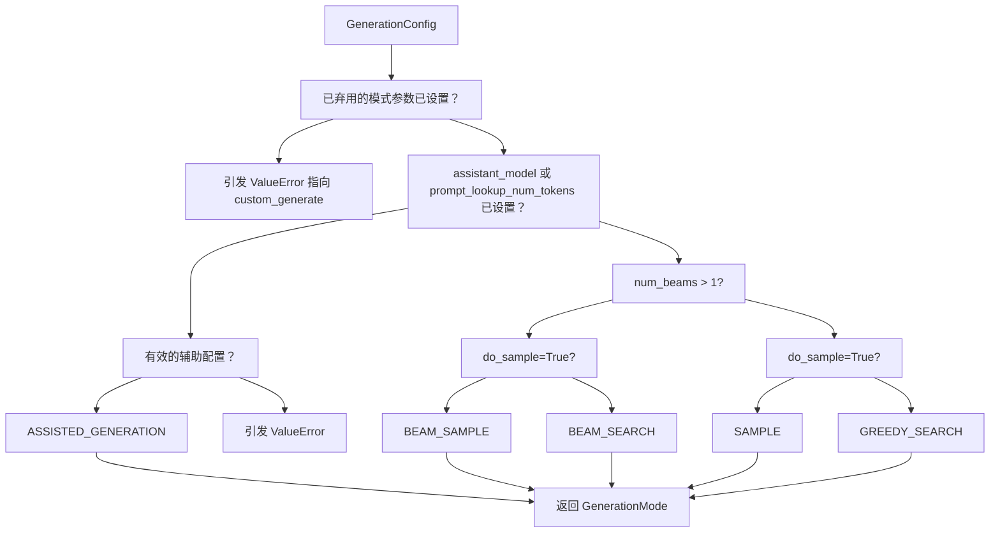
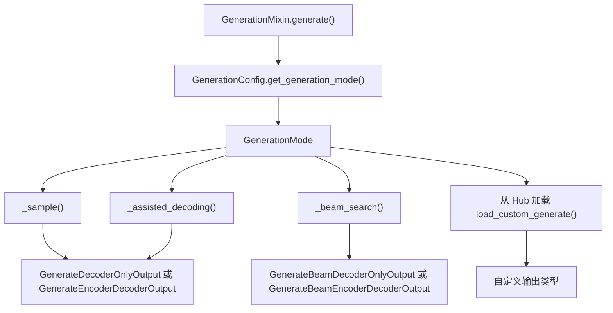

# 生成配置与模式 (Generation Configuration and Modes)

相关源文件

-   [docs/source/en/generation_strategies.md](https://github.com/huggingface/transformers/blob/9a9997fd/docs/source/en/generation_strategies.md?plain=1)
-   [docs/source/en/internal/generation_utils.md](https://github.com/huggingface/transformers/blob/9a9997fd/docs/source/en/internal/generation_utils.md?plain=1)
-   [docs/source/en/main_classes/text_generation.md](https://github.com/huggingface/transformers/blob/9a9997fd/docs/source/en/main_classes/text_generation.md?plain=1)
-   [src/transformers/cache_utils.py](https://github.com/huggingface/transformers/blob/9a9997fd/src/transformers/cache_utils.py)
-   [src/transformers/generation/__init__.py](https://github.com/huggingface/transformers/blob/9a9997fd/src/transformers/generation/__init__.py)
-   [src/transformers/generation/candidate_generator.py](https://github.com/huggingface/transformers/blob/9a9997fd/src/transformers/generation/candidate_generator.py)
-   [src/transformers/generation/configuration_utils.py](https://github.com/huggingface/transformers/blob/9a9997fd/src/transformers/generation/configuration_utils.py)
-   [src/transformers/generation/logits_process.py](https://github.com/huggingface/transformers/blob/9a9997fd/src/transformers/generation/logits_process.py)
-   [src/transformers/generation/stopping_criteria.py](https://github.com/huggingface/transformers/blob/9a9997fd/src/transformers/generation/stopping_criteria.py)
-   [src/transformers/generation/utils.py](https://github.com/huggingface/transformers/blob/9a9997fd/src/transformers/generation/utils.py)
-   [src/transformers/models/clvp/modeling_clvp.py](https://github.com/huggingface/transformers/blob/9a9997fd/src/transformers/models/clvp/modeling_clvp.py)
-   [src/transformers/pipelines/image_text_to_text.py](https://github.com/huggingface/transformers/blob/9a9997fd/src/transformers/pipelines/image_text_to_text.py)
-   [src/transformers/pipelines/text_generation.py](https://github.com/huggingface/transformers/blob/9a9997fd/src/transformers/pipelines/text_generation.py)
-   [src/transformers/pytorch_utils.py](https://github.com/huggingface/transformers/blob/9a9997fd/src/transformers/pytorch_utils.py)
-   [tests/generation/test_candidate_generator.py](https://github.com/huggingface/transformers/blob/9a9997fd/tests/generation/test_candidate_generator.py)
-   [tests/generation/test_configuration_utils.py](https://github.com/huggingface/transformers/blob/9a9997fd/tests/generation/test_configuration_utils.py)
-   [tests/generation/test_logits_process.py](https://github.com/huggingface/transformers/blob/9a9997fd/tests/generation/test_logits_process.py)
-   [tests/generation/test_stopping_criteria.py](https://github.com/huggingface/transformers/blob/9a9997fd/tests/generation/test_stopping_criteria.py)
-   [tests/generation/test_utils.py](https://github.com/huggingface/transformers/blob/9a9997fd/tests/generation/test_utils.py)
-   [tests/pipelines/test_pipelines_image_text_to_text.py](https://github.com/huggingface/transformers/blob/9a9997fd/tests/pipelines/test_pipelines_image_text_to_text.py)
-   [tests/pipelines/test_pipelines_text_generation.py](https://github.com/huggingface/transformers/blob/9a9997fd/tests/pipelines/test_pipelines_text_generation.py)
-   [tests/utils/test_cache_utils.py](https://github.com/huggingface/transformers/blob/9a9997fd/tests/utils/test_cache_utils.py)

本页面记录了 Transformers 库中控制文本生成行为的配置系统。它涵盖了 `GenerationConfig` 类、`GenerationMode` 枚举，以及根据配置参数决定使用哪种生成策略的逻辑。

有关实际生成算法和策略的信息，请参阅 [Logits Processing Pipeline (Logits 处理流水线)](/huggingface/transformers/4.2-logits-processing-pipeline)。有关辅助生成和投机解码的详细信息，请参阅 [Assisted and Speculative Decoding (辅助解码与投机解码)](/huggingface/transformers/4.4-assisted-and-speculative-decoding)。有关生成期间使用的缓存实现，请参阅 [Cache System (缓存系统)](/huggingface/transformers/4.3-cache-system)。

---

## 概览 (Overview)

生成配置系统通过 `GenerationConfig` 类为控制文本生成的各个方面提供了一个统一接口。此配置决定了将使用哪种生成模式（Greedy search (贪婪搜索)、Sampling (采样)、Beam search (束搜索) 或 Assisted generation (辅助生成)），控制输出长度，操纵 token 概率，并管理缓存行为。

**关键组件：**

-   **GenerationConfig**: 包含所有生成参数的配置数据类。
-   **GenerationMode**: 定义可用生成策略的枚举。
-   **模式选择逻辑 (Mode Selection Logic)**: 根据配置参数决定调用哪种生成方法的算法。

来源：[src/transformers/generation/configuration_utils.py83-108](https://github.com/huggingface/transformers/blob/9a9997fd/src/transformers/generation/configuration_utils.py#L83-L108) [src/transformers/generation/configuration_utils.py65-81](https://github.com/huggingface/transformers/blob/9a9997fd/src/transformers/generation/configuration_utils.py#L65-L81)

---

## GenerationConfig 类

`GenerationConfig` 类定义在 [src/transformers/generation/configuration_utils.py83-638](https://github.com/huggingface/transformers/blob/9a9997fd/src/transformers/generation/configuration_utils.py#L83-L638)，是所有生成操作的核心配置对象。它是 `PushToHubMixin` 的子类，可以序列化为 JSON 并保存到 Hub 或从 Hub 加载。

### 配置结构 (Configuration Structure)

下图将高层配置类别与 `GenerationConfig` 类中定义的特定字段相关联。

**图表：GenerationConfig 实体空间**

```mermaid
flowchart TD
    AG["num_assistant_tokensassistant_confidence_thresholdprompt_lookup_num_tokens"]
    GC["GenerationConfig"]
    LC1["max_lengthmax_new_tokens"]
    LC2["min_lengthmin_new_tokens"]
    LC3["early_stoppingmax_timestop_strings"]
    SS1["do_sample"]
    SS2["num_beams"]
    CM1["use_cache"]
    CM2["cache_implementation"]
    CM3["cache_config"]
    LM1["temperaturetop_ktop_pmin_p"]
    LM2["repetition_penaltylength_penalty"]
    LM3["bad_words_idsforced_eos_token_id"]
    OC1["output_scoresoutput_logits"]
    OC2["output_attentionsoutput_hidden_states"]
    OC3["return_dict_in_generate"]
    ST["pad_token_idbos_token_ideos_token_id"]

    GC --> LC1
    GC --> LC2
    GC --> LC3
    GC --> SS1
    GC --> SS2
    GC --> CM1
    GC --> CM2
    GC --> CM3
    GC --> LM1
    GC --> LM2
    GC --> LM3
    GC --> OC1
    GC --> OC2
    GC --> OC3
    GC --> ST
    GC --> AG
```


来源：[src/transformers/generation/configuration_utils.py109-437](https://github.com/huggingface/transformers/blob/9a9997fd/src/transformers/generation/configuration_utils.py#L109-L437)

### 参数类别 (Parameter Categories)

配置参数被组织成逻辑类别：

| 类别 | 关键参数 | 用途 |
| --- | --- | --- |
| **长度控制 (Length Control)** | `max_length`, `max_new_tokens`, `min_length`, `min_new_tokens`, `early_stopping`, `max_time`, `stop_strings` | 控制生成的序列长度 |
| **策略选择 (Strategy Selection)** | `do_sample`, `num_beams` | 确定使用哪种生成模式 |
| **缓存管理 (Cache Management)** | `use_cache`, `cache_implementation`, `cache_config` | 配置 KV cache (KV 缓存) 行为 |
| **Logits 操纵 (Logits Manipulation)** | `temperature`, `top_k`, `top_p`, `min_p`, `top_h`, `typical_p`, `epsilon_cutoff`, `eta_cutoff`, `repetition_penalty`, `encoder_repetition_penalty`, `length_penalty`, `no_repeat_ngram_size`, `bad_words_ids`, `forced_bos_token_id`, `forced_eos_token_id` | 修改 token 概率分布 |
| **输出控制 (Output Control)** | `output_scores`, `output_logits`, `output_attentions`, `output_hidden_states`, `return_dict_in_generate`, `num_return_sequences` | 控制返回哪些信息 |
| **特殊 Token (Special Tokens)** | `pad_token_id`, `bos_token_id`, `eos_token_id` | 定义特殊 token ID |
| **编码器-解码器 (Encoder-Decoder)** | `encoder_no_repeat_ngram_size`, `decoder_start_token_id` | 编码器-解码器特定参数 |
| **辅助生成 (Assisted Generation)** | `num_assistant_tokens`, `num_assistant_tokens_schedule`, `assistant_confidence_threshold`, `prompt_lookup_num_tokens`, `max_matching_ngram_size`, `assistant_early_exit`, `assistant_lookbehind`, `target_lookbehind` | 控制 Speculative (投机)/Assisted (辅助) 解码 |
| **性能 (Performance)** | `compile_config` (`CompileConfig`), `disable_compile` | 控制 `torch.compile` 在 Static-cache (静态缓存) 解码时的行为 |

来源：[src/transformers/generation/configuration_utils.py112-437](https://github.com/huggingface/transformers/blob/9a9997fd/src/transformers/generation/configuration_utils.py#L112-L437)

---

## GenerationMode 枚举

`GenerationMode` 枚举定义在 [src/transformers/generation/configuration_utils.py65-81](https://github.com/huggingface/transformers/blob/9a9997fd/src/transformers/generation/configuration_utils.py#L65-L81)，代表了可用的生成策略：

```
class GenerationMode(ExplicitEnum):    # 非 Beam 方法    CONTRASTIVE_SEARCH = "contrastive_search"    GREEDY_SEARCH = "greedy_search"    SAMPLE = "sample"    ASSISTED_GENERATION = "assisted_generation"    DOLA_GENERATION = "dola_generation"    # Beam 方法    BEAM_SEARCH = "beam_search"    BEAM_SAMPLE = "beam_sample"    CONSTRAINED_BEAM_SEARCH = "constrained_beam_search"    GROUP_BEAM_SEARCH = "group_beam_search"
```
### 模式与实现映射 (Mode to Implementation Mapping)

[src/transformers/generation/utils.py133-144](https://github.com/huggingface/transformers/blob/9a9997fd/src/transformers/generation/utils.py#L133-L144) 中的 `GENERATION_MODES_MAPPING` 字典将每个 `GenerationMode` 映射到实现它的私有方法或社区仓库：

| `GenerationMode` | 实现 | 备注 |
| --- | --- | --- |
| `GREEDY_SEARCH` | `_sample` | 使用 `do_sample=False` |
| `SAMPLE` | `_sample` | 使用 `do_sample=True` |
| `BEAM_SEARCH` | `_beam_search` | 使用 `do_sample=False` |
| `BEAM_SAMPLE` | `_beam_search` | 使用 `do_sample=True` |
| `ASSISTED_GENERATION` | `_assisted_decoding` | 需要 Draft model (草稿模型) 或 Prompt lookup (提示查找) |
| `DOLA_GENERATION` | `"transformers-community/dola"` | 已弃用，从 Hub 加载 |
| `CONTRASTIVE_SEARCH` | `"transformers-community/contrastive-search"` | 已弃用，从 Hub 加载 |
| `GROUP_BEAM_SEARCH` | `"transformers-community/group-beam-search"` | 已弃用，从 Hub 加载 |
| `CONSTRAINED_BEAM_SEARCH` | `"transformers-community/constrained-beam-search"` | 已弃用，从 Hub 加载 |

`GREEDY_SEARCH` 和 `SAMPLE` 都派发到 `_sample`。区别在于贪婪搜索等同于取 argmax 的采样（即 `do_sample=False`）。

来源：[src/transformers/generation/configuration_utils.py65-81](https://github.com/huggingface/transformers/blob/9a9997fd/src/transformers/generation/configuration_utils.py#L65-L81) [src/transformers/generation/utils.py133-144](https://github.com/huggingface/transformers/blob/9a9997fd/src/transformers/generation/utils.py#L133-L144)

---

## 生成模式选择逻辑 (Generation Mode Selection Logic)

生成模式通过调用 `GenerationConfig.get_generation_mode()` 确定，该方法在 `GenerationMixin.generate()` 内部使用。

### 模式选择流程图 (Mode Selection Flowchart)


### 实现方法选择 (Implementation Method Selection)

一旦模式确定，`GenerationMixin.generate()` 就会派发到内部解码方法。

**图表：生成代码入口点**


来源：[src/transformers/generation/utils.py133-144](https://github.com/huggingface/transformers/blob/9a9997fd/src/transformers/generation/utils.py#L133-L144) [src/transformers/generation/configuration_utils.py65-81](https://github.com/huggingface/transformers/blob/9a9997fd/src/transformers/generation/configuration_utils.py#L65-L81)

---

## 配置加载与优先级 (Configuration Loading and Precedence)

`GenerationConfig` 可以从多个来源加载，并具有定义的优先级顺序。

### 配置加载流程 (Configuration Loading Flow)

> **[Mermaid sequence]**
> *(图表结构无法解析)*

### 优先级顺序 (Precedence Order)

配置值按此顺序解析（靠后的会覆盖靠前的）：

1.  **默认值 (Default Values)**: `_get_default_generation_params()` 中硬编码的默认值 [src/transformers/generation/configuration_utils.py1093-1122](https://github.com/huggingface/transformers/blob/9a9997fd/src/transformers/generation/configuration_utils.py#L1093-L1122)
2.  **模型配置 (Model Config)**: 从模型的 `config.json` 中提取的生成相关参数 [src/transformers/generation/configuration_utils.py550-617](https://github.com/huggingface/transformers/blob/9a9997fd/src/transformers/generation/configuration_utils.py#L550-L617)
3.  **生成配置文件 (Generation Config File)**: 来自 `generation_config.json`（如果存在）的值 [src/transformers/generation/configuration_utils.py439-548](https://github.com/huggingface/transformers/blob/9a9997fd/src/transformers/generation/configuration_utils.py#L439-L548)
4.  **运行时参数 (Runtime Arguments)**: 直接传递给 `generate()` 方法的参数。

来源：[src/transformers/generation/configuration_utils.py439-617](https://github.com/huggingface/transformers/blob/9a9997fd/src/transformers/generation/configuration_utils.py#L439-L617) [src/transformers/generation/configuration_utils.py1093-1122](https://github.com/huggingface/transformers/blob/9a9997fd/src/transformers/generation/configuration_utils.py#L1093-L1122)

---

## 配置验证 (Configuration Validation)

`GenerationConfig` 在初始化和更新时通过 `validate` 方法进行自我验证 [src/transformers/generation/configuration_utils.py879-1091](https://github.com/huggingface/transformers/blob/9a9997fd/src/transformers/generation/configuration_utils.py#L879-L1091)

### 验证规则 (Validation Rules)

1.  **采样一致性 (Sampling Consistency)**: 如果在 `do_sample=False` 时设置了仅限采样的参数（例如 `temperature`, `top_p`），则发出警告。
2.  **束搜索一致性 (Beam Search Consistency)**: 如果在 `num_beams=1` 时设置了束搜索特定参数（例如 `length_penalty`），则发出警告。
3.  **输出依赖性 (Output Dependencies)**: 检查输出标志（例如 `output_scores`）是否与 `return_dict_in_generate=True` 配合使用。
4.  **辅助生成 (Assisted Generation)**: 验证辅助生成是否使用了兼容回滚的缓存（目前仅 `DynamicCache`）。

来源：[src/transformers/generation/configuration_utils.py879-1091](https://github.com/huggingface/transformers/blob/9a9997fd/src/transformers/generation/configuration_utils.py#L879-L1091)

---

## 缓存实现字符串 (Cache Implementation Strings)

`GenerationConfig` 中的 `cache_implementation` 字段映射到特定的 `Cache` 子类：

| 字符串值 | 缓存类 | 文件参考 |
| --- | --- | --- |
| `"dynamic"` | `DynamicCache` | [src/transformers/cache_utils.py442](https://github.com/huggingface/transformers/blob/9a9997fd/src/transformers/cache_utils.py#L442-L442) |
| `"static"` | `StaticCache` | [src/transformers/cache_utils.py1044](https://github.com/huggingface/transformers/blob/9a9997fd/src/transformers/cache_utils.py#L1044-L1044) |
| `"quantized"` | `QuantizedCache` | [src/transformers/cache_utils.py1551](https://github.com/huggingface/transformers/blob/9a9997fd/src/transformers/cache_utils.py#L1551-L1551) |
| `"offloaded"` | `DynamicCache(offloaded=True)` | [src/transformers/cache_utils.py442](https://github.com/huggingface/transformers/blob/9a9997fd/src/transformers/cache_utils.py#L442-L442) |
| `"offloaded_static"` | `StaticCache(offloaded=True)` | [src/transformers/cache_utils.py1044](https://github.com/huggingface/transformers/blob/9a9997fd/src/transformers/cache_utils.py#L1044-L1044) |

来源：[src/transformers/generation/configuration_utils.py47-58](https://github.com/huggingface/transformers/blob/9a9997fd/src/transformers/generation/configuration_utils.py#L47-L58) [src/transformers/cache_utils.py26-1551](https://github.com/huggingface/transformers/blob/9a9997fd/src/transformers/cache_utils.py#L26-L1551)

---

## 基于配置的输出类型 (Output Types Based on Configuration)

生成输出类型由模式和 `return_dict_in_generate` 标志决定。

### 输出数据类字段 (Output Dataclass Fields)

[src/transformers/generation/utils.py146-329](https://github.com/huggingface/transformers/blob/9a9997fd/src/transformers/generation/utils.py#L146-L329) 中定义的所有输出类都共享公共字段：

-   `sequences`: 生成的 token ID。
-   `scores` (可选): 每步处理后的预测分数。
-   `logits` (可选): 每步原始预测 logits。
-   `past_key_values` (可选): 最终缓存状态。

Beam 输出（例如 `GenerateBeamDecoderOnlyOutput`）额外包含 `sequences_scores` 和 `beam_indices` [src/transformers/generation/utils.py231-278](https://github.com/huggingface/transformers/blob/9a9997fd/src/transformers/generation/utils.py#L231-L278)

来源：[src/transformers/generation/utils.py146-329](https://github.com/huggingface/transformers/blob/9a9997fd/src/transformers/generation/utils.py#L146-L329)
