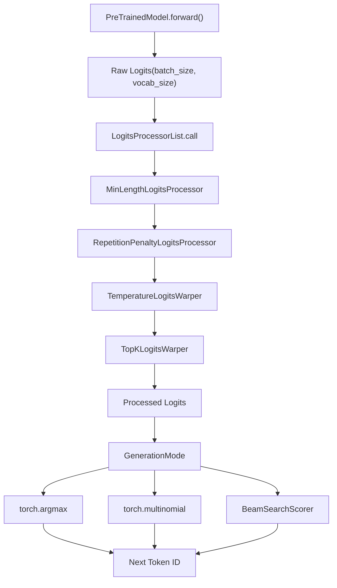
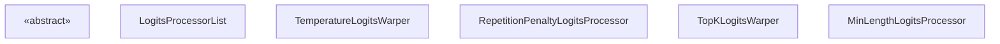
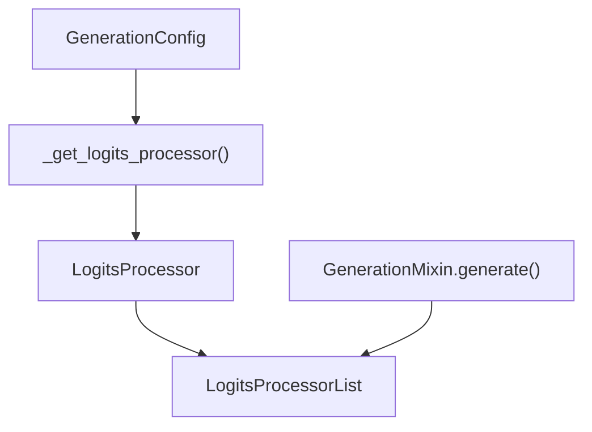

# Logits 处理流水线 (Logits Processing Pipeline)

相关源文件

-   [docs/source/en/generation_strategies.md](https://github.com/huggingface/transformers/blob/9a9997fd/docs/source/en/generation_strategies.md?plain=1)
-   [docs/source/en/internal/generation_utils.md](https://github.com/huggingface/transformers/blob/9a9997fd/docs/source/en/internal/generation_utils.md?plain=1)
-   [docs/source/en/main_classes/text_generation.md](https://github.com/huggingface/transformers/blob/9a9997fd/docs/source/en/main_classes/text_generation.md?plain=1)
-   [src/transformers/cache_utils.py](https://github.com/huggingface/transformers/blob/9a9997fd/src/transformers/cache_utils.py)
-   [src/transformers/generation/__init__.py](https://github.com/huggingface/transformers/blob/9a9997fd/src/transformers/generation/__init__.py)
-   [src/transformers/generation/candidate_generator.py](https://github.com/huggingface/transformers/blob/9a9997fd/src/transformers/generation/candidate_generator.py)
-   [src/transformers/generation/configuration_utils.py](https://github.com/huggingface/transformers/blob/9a9997fd/src/transformers/generation/configuration_utils.py)
-   [src/transformers/generation/logits_process.py](https://github.com/huggingface/transformers/blob/9a9997fd/src/transformers/generation/logits_process.py)
-   [src/transformers/generation/stopping_criteria.py](https://github.com/huggingface/transformers/blob/9a9997fd/src/transformers/generation/stopping_criteria.py)
-   [src/transformers/generation/utils.py](https://github.com/huggingface/transformers/blob/9a9997fd/src/transformers/generation/utils.py)
-   [src/transformers/models/clvp/modeling_clvp.py](https://github.com/huggingface/transformers/blob/9a9997fd/src/transformers/models/clvp/modeling_clvp.py)
-   [src/transformers/pytorch_utils.py](https://github.com/huggingface/transformers/blob/9a9997fd/src/transformers/pytorch_utils.py)
-   [tests/generation/test_candidate_generator.py](https://github.com/huggingface/transformers/blob/9a9997fd/tests/generation/test_candidate_generator.py)
-   [tests/generation/test_configuration_utils.py](https://github.com/huggingface/transformers/blob/9a9997fd/tests/generation/test_configuration_utils.py)
-   [tests/generation/test_logits_process.py](https://github.com/huggingface/transformers/blob/9a9997fd/tests/generation/test_logits_process.py)
-   [tests/generation/test_stopping_criteria.py](https://github.com/huggingface/transformers/blob/9a9997fd/tests/generation/test_stopping_criteria.py)
-   [tests/generation/test_utils.py](https://github.com/huggingface/transformers/blob/9a9997fd/tests/generation/test_utils.py)
-   [tests/utils/test_cache_utils.py](https://github.com/huggingface/transformers/blob/9a9997fd/tests/utils/test_cache_utils.py)

Logits Processing Pipeline (Logits 处理流水线) 在文本生成过程中 token 选择之前修改原始模型的预测分数。该系统通过 Temperature scaling (温度缩放)、Sampling (采样) 策略（top-k, top-p）、Repetition penalties (重复惩罚) 和 token 级别的约束来实现对生成质量的控制。它作为一个顺序处理器链运行，在每个生成步骤中转换 logits。

有关整体生成流程和配置的信息，请参阅 [Generation Configuration and Modes (生成配置与模式)](/huggingface/transformers/4.1-generation-configuration-and-modes)。有关生成期间缓存的信息，请参阅 [Cache System (缓存系统)](/huggingface/transformers/4.3-cache-system)。

## 用途与架构 (Purpose and Architecture)

Logits 处理流水线位于模型前向传递和 token 选择之间。在每个生成步骤中，模型输出原始 Logits (对数几率)（未归一化分数的词表大小向量）。这些 logits 经过一系列处理器进行转换，然后采样或选择下一个 token。

### 数据流概览 (Data Flow Overview)


**来源：** [src/transformers/generation/utils.py1-113](https://github.com/huggingface/transformers/blob/9a9997fd/src/transformers/generation/utils.py#L1-L113) [docs/source/en/generation_strategies.md17-100](https://github.com/huggingface/transformers/blob/9a9997fd/docs/source/en/generation_strategies.md?plain=1#L17-L100)

## 核心类 (Core Classes)

### LogitsProcessor

所有 Logit 操纵操作的抽象基类。每个处理器必须实现 `__call__` 方法，该方法接收 `input_ids` 和 `scores` (logits) 并返回修改后的分数。


**来源：** [src/transformers/generation/logits_process.py49-56](https://github.com/huggingface/transformers/blob/9a9997fd/src/transformers/generation/logits_process.py#L49-L56) [src/transformers/generation/logits_process.py59-94](https://github.com/huggingface/transformers/blob/9a9997fd/src/transformers/generation/logits_process.py#L59-L94)

### LogitsProcessorList

一个专门的列表，按顺序应用包含的所有处理器。它通过 `inspect.signature` 检查每个处理器的签名，以确定是否需要传递额外的 `kwargs`（例如连续批处理的 `logits_indices`）。

```
# 来自 LogitsProcessorList.__call__ [src/transformers/generation/logits_process.py:82-94]for processor in self:    function_args = inspect.signature(processor.__call__).parameters    if len(function_args) > 2:        # 如果处理器支持，则传递额外的 kwargs        scores = processor(input_ids, scores, **kwargs)    else:        scores = processor(input_ids, scores)
```
**来源：** [src/transformers/generation/logits_process.py59-94](https://github.com/huggingface/transformers/blob/9a9997fd/src/transformers/generation/logits_process.py#L59-L94)

## 单个处理器 (Individual Processors)

### 长度控制：MinLengthLogitsProcessor

通过在生成的序列达到 `min_length` 之前将 `eos_token_id` 的分数设置为 `-inf` 来强制执行最小序列长度。

```
# 实现逻辑 [src/transformers/generation/logits_process.py:155-161]def __call__(self, input_ids, scores):    if input_ids.shape[-1] < self.min_length:        vocab_tensor = torch.arange(scores.shape[-1], device=scores.device)        eos_token_mask = torch.isin(vocab_tensor, self.eos_token_id)        scores = torch.where(eos_token_mask, -float("inf"), scores)    return scores
```
**来源：** [src/transformers/generation/logits_process.py103-161](https://github.com/huggingface/transformers/blob/9a9997fd/src/transformers/generation/logits_process.py#L103-L161)

### 采样变形器：Temperature, Top-K, Top-P (Sampling Warpers)

Warpers (变形器) 是通常用于 Multinomial sampling (多项式采样) (`do_sample=True`) 的处理器子集。

| 类 | 实现细节 | 来源 |
| --- | --- | --- |
| `TemperatureLogitsWarper` | 将分数除以 `temperature`。`scores = scores / self.temperature`。 | [src/transformers/generation/logits_process.py230-294](https://github.com/huggingface/transformers/blob/9a9997fd/src/transformers/generation/logits_process.py#L230-L294) |
| `TopKLogitsWarper` | 除 `top_k` 个最大值外，将所有分数设置为 `-inf`。 | [src/transformers/generation/logits_process.py1092-1161](https://github.com/huggingface/transformers/blob/9a9997fd/src/transformers/generation/logits_process.py#L1092-L1161) |
| `TopPLogitsWarper` | Nucleus sampling (核采样)：保留累积概率高达 `top_p` 的 token。 | [src/transformers/generation/logits_process.py1163-1259](https://github.com/huggingface/transformers/blob/9a9997fd/src/transformers/generation/logits_process.py#L1163-L1259) |

**来源：** [src/transformers/generation/logits_process.py230-1259](https://github.com/huggingface/transformers/blob/9a9997fd/src/transformers/generation/logits_process.py#L230-L1259)

### 重复控制：RepetitionPenaltyLogitsProcessor

对已经在 `input_ids` 中出现的 token 应用惩罚。如果一个 token 已被看到，其分数会被除以惩罚项（如果是正数）或乘以惩罚项（如果是负数）。

```
# 来自 RepetitionPenaltyLogitsProcessor.__call__ [src/transformers/generation/logits_process.py:348-358]score = scores.gather(1, input_ids)# 如果分数 < 0，则重复惩罚必须相乘# 如果分数 > 0，则重复惩罚必须相除score = torch.where(score < 0, score * self.penalty, score / self.penalty)scores.scatter_(1, input_ids, score)
```
**来源：** [src/transformers/generation/logits_process.py296-406](https://github.com/huggingface/transformers/blob/9a9997fd/src/transformers/generation/logits_process.py#L296-L406)

## 在生成循环中的实现 (Implementation in Generation Loop)

流水线在 `GenerationMixin` 的 `generate` 方法中构建并执行。

### 逻辑关联：代码到概念 (Logical Association: Code to Concept)


**来源：** [src/transformers/generation/utils.py1314-1471](https://github.com/huggingface/transformers/blob/9a9997fd/src/transformers/generation/utils.py#L1314-L1471) [src/transformers/generation/configuration_utils.py83-338](https://github.com/huggingface/transformers/blob/9a9997fd/src/transformers/generation/configuration_utils.py#L83-L338)

### 逐步执行 (Step-by-Step Execution)

1.  **初始化**: `generate()` 调用 `_get_logits_processor()` 根据 `GenerationConfig` 构建 `LogitsProcessorList`。[src/transformers/generation/utils.py1314-1471](https://github.com/huggingface/transformers/blob/9a9997fd/src/transformers/generation/utils.py#L1314-L1471)
2.  **前向传递**: 模型为下一个 token 生成原始 Logits。[src/transformers/generation/utils.py2841-2850](https://github.com/huggingface/transformers/blob/9a9997fd/src/transformers/generation/utils.py#L2841-2850)
3.  **处理**: 使用当前的 `input_ids` 和原始 `logits` 调用 `LogitsProcessorList`。[src/transformers/generation/utils.py2875-2880](https://github.com/huggingface/transformers/blob/9a9997fd/src/transformers/generation/utils.py#L2875-L2880)
4.  **选择**: 处理后的 logits 用于 Greedy selection (贪婪选择) 或 Multinomial sampling (多项式采样)。[src/transformers/generation/utils.py2900-2915](https://github.com/huggingface/transformers/blob/9a9997fd/src/transformers/generation/utils.py#L2900-L2915)

### 连续批处理集成 (Continuous Batching Integration)

流水线通过 `set_continuous_batching_context` 方法支持 Continuous batching (连续批处理)。这允许像 `RepetitionPenaltyLogitsProcessor` 这样的处理器正确识别展平批次中的哪些 token 属于哪个序列。

```
# 来自 LogitsProcessorList [src/transformers/generation/logits_process.py:96-100]def set_continuous_batching_context(self, logits_indices, cu_seq_lens_q):    for processor in self:        if hasattr(processor, "set_continuous_batching_context"):            processor.set_continuous_batching_context(logits_indices, cu_seq_lens_q)
```
**来源：** [src/transformers/generation/logits_process.py96-100](https://github.com/huggingface/transformers/blob/9a9997fd/src/transformers/generation/logits_process.py#L96-L100) [src/transformers/generation/utils.py1314-1471](https://github.com/huggingface/transformers/blob/9a9997fd/src/transformers/generation/utils.py#L1314-L1471)
