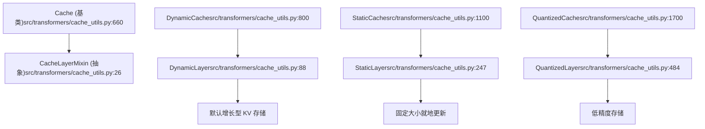
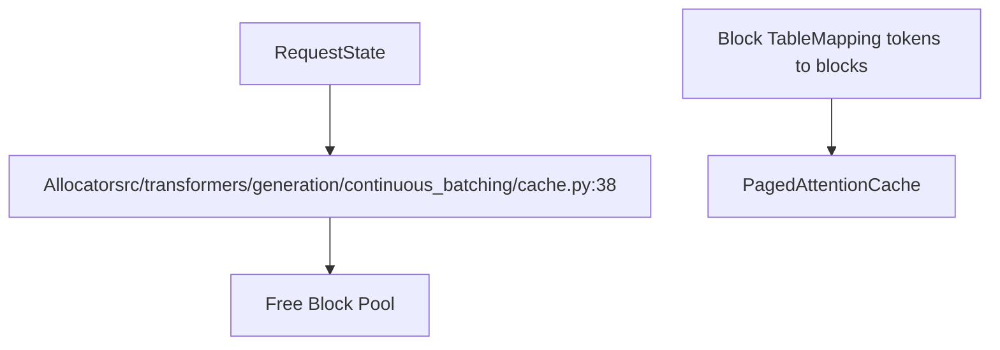

# 缓存系统 (Cache System)

相关源文件

-   [benchmark_v2/benchmark_scripts/continuous_batching_overall.py](https://github.com/huggingface/transformers/blob/9a9997fd/benchmark_v2/benchmark_scripts/continuous_batching_overall.py)
-   [docs/source/en/generation_strategies.md](https://github.com/huggingface/transformers/blob/9a9997fd/docs/source/en/generation_strategies.md?plain=1)
-   [docs/source/en/internal/generation_utils.md](https://github.com/huggingface/transformers/blob/9a9997fd/docs/source/en/internal/generation_utils.md?plain=1)
-   [docs/source/en/kv_cache.md](https://github.com/huggingface/transformers/blob/9a9997fd/docs/source/en/kv_cache.md?plain=1)
-   [docs/source/en/main_classes/text_generation.md](https://github.com/huggingface/transformers/blob/9a9997fd/docs/source/en/main_classes/text_generation.md?plain=1)
-   [docs/source/en/model_doc/gpt_neox.md](https://github.com/huggingface/transformers/blob/9a9997fd/docs/source/en/model_doc/gpt_neox.md?plain=1)
-   [docs/source/en/model_doc/idefics2.md](https://github.com/huggingface/transformers/blob/9a9997fd/docs/source/en/model_doc/idefics2.md?plain=1)
-   [docs/source/en/model_doc/llama4.md](https://github.com/huggingface/transformers/blob/9a9997fd/docs/source/en/model_doc/llama4.md?plain=1)
-   [docs/source/en/model_doc/mistral.md](https://github.com/huggingface/transformers/blob/9a9997fd/docs/source/en/model_doc/mistral.md?plain=1)
-   [docs/source/en/model_doc/mixtral.md](https://github.com/huggingface/transformers/blob/9a9997fd/docs/source/en/model_doc/mixtral.md?plain=1)
-   [docs/source/en/model_doc/qwen2.md](https://github.com/huggingface/transformers/blob/9a9997fd/docs/source/en/model_doc/qwen2.md?plain=1)
-   [docs/source/en/model_doc/qwen2_audio.md](https://github.com/huggingface/transformers/blob/9a9997fd/docs/source/en/model_doc/qwen2_audio.md?plain=1)
-   [docs/source/en/model_doc/qwen2_moe.md](https://github.com/huggingface/transformers/blob/9a9997fd/docs/source/en/model_doc/qwen2_moe.md?plain=1)
-   [docs/source/en/tasks/visual_document_retrieval.md](https://github.com/huggingface/transformers/blob/9a9997fd/docs/source/en/tasks/visual_document_retrieval.md?plain=1)
-   [examples/pytorch/continuous_batching.py](https://github.com/huggingface/transformers/blob/9a9997fd/examples/pytorch/continuous_batching.py)
-   [src/transformers/cache_utils.py](https://github.com/huggingface/transformers/blob/9a9997fd/src/transformers/cache_utils.py)
-   [src/transformers/generation/__init__.py](https://github.com/huggingface/transformers/blob/9a9997fd/src/transformers/generation/__init__.py)
-   [src/transformers/generation/candidate_generator.py](https://github.com/huggingface/transformers/blob/9a9997fd/src/transformers/generation/candidate_generator.py)
-   [src/transformers/generation/configuration_utils.py](https://github.com/huggingface/transformers/blob/9a9997fd/src/transformers/generation/configuration_utils.py)
-   [src/transformers/generation/continuous_batching/cache.py](https://github.com/huggingface/transformers/blob/9a9997fd/src/transformers/generation/continuous_batching/cache.py)
-   [src/transformers/generation/continuous_batching/cache_manager.py](https://github.com/huggingface/transformers/blob/9a9997fd/src/transformers/generation/continuous_batching/cache_manager.py)
-   [src/transformers/generation/continuous_batching/continuous_api.py](https://github.com/huggingface/transformers/blob/9a9997fd/src/transformers/generation/continuous_batching/continuous_api.py)
-   [src/transformers/generation/continuous_batching/input_outputs.py](https://github.com/huggingface/transformers/blob/9a9997fd/src/transformers/generation/continuous_batching/input_outputs.py)
-   [src/transformers/generation/continuous_batching/requests.py](https://github.com/huggingface/transformers/blob/9a9997fd/src/transformers/generation/continuous_batching/requests.py)
-   [src/transformers/generation/continuous_batching/scheduler.py](https://github.com/huggingface/transformers/blob/9a9997fd/src/transformers/generation/continuous_batching/scheduler.py)
-   [src/transformers/generation/continuous_batching/utils.py](https://github.com/huggingface/transformers/blob/9a9997fd/src/transformers/generation/continuous_batching/utils.py)
-   [src/transformers/generation/logits_process.py](https://github.com/huggingface/transformers/blob/9a9997fd/src/transformers/generation/logits_process.py)
-   [src/transformers/generation/stopping_criteria.py](https://github.com/huggingface/transformers/blob/9a9997fd/src/transformers/generation/stopping_criteria.py)
-   [src/transformers/generation/utils.py](https://github.com/huggingface/transformers/blob/9a9997fd/src/transformers/generation/utils.py)
-   [src/transformers/integrations/flash_paged.py](https://github.com/huggingface/transformers/blob/9a9997fd/src/transformers/integrations/flash_paged.py)
-   [src/transformers/models/clvp/modeling_clvp.py](https://github.com/huggingface/transformers/blob/9a9997fd/src/transformers/models/clvp/modeling_clvp.py)
-   [src/transformers/models/mistral/__init__.py](https://github.com/huggingface/transformers/blob/9a9997fd/src/transformers/models/mistral/__init__.py)
-   [src/transformers/models/mixtral/__init__.py](https://github.com/huggingface/transformers/blob/9a9997fd/src/transformers/models/mixtral/__init__.py)
-   [src/transformers/models/qwen2/__init__.py](https://github.com/huggingface/transformers/blob/9a9997fd/src/transformers/models/qwen2/__init__.py)
-   [src/transformers/models/qwen2_audio/modeling_qwen2_audio.py](https://github.com/huggingface/transformers/blob/9a9997fd/src/transformers/models/qwen2_audio/modeling_qwen2_audio.py)
-   [src/transformers/models/qwen2_audio/processing_qwen2_audio.py](https://github.com/huggingface/transformers/blob/9a9997fd/src/transformers/models/qwen2_audio/processing_qwen2_audio.py)
-   [src/transformers/models/qwen2_moe/__init__.py](https://github.com/huggingface/transformers/blob/9a9997fd/src/transformers/models/qwen2_moe/__init__.py)
-   [src/transformers/pytorch_utils.py](https://github.com/huggingface/transformers/blob/9a9997fd/src/transformers/pytorch_utils.py)
-   [tests/generation/test_candidate_generator.py](https://github.com/huggingface/transformers/blob/9a9997fd/tests/generation/test_candidate_generator.py)
-   [tests/generation/test_configuration_utils.py](https://github.com/huggingface/transformers/blob/9a9997fd/tests/generation/test_configuration_utils.py)
-   [tests/generation/test_continuous_batching.py](https://github.com/huggingface/transformers/blob/9a9997fd/tests/generation/test_continuous_batching.py)
-   [tests/generation/test_logits_process.py](https://github.com/huggingface/transformers/blob/9a9997fd/tests/generation/test_logits_process.py)
-   [tests/generation/test_stopping_criteria.py](https://github.com/huggingface/transformers/blob/9a9997fd/tests/generation/test_stopping_criteria.py)
-   [tests/generation/test_utils.py](https://github.com/huggingface/transformers/blob/9a9997fd/tests/utils/test_utils.py)
-   [tests/models/kosmos2_5/test_modeling_kosmos2_5.py](https://github.com/huggingface/transformers/blob/9a9997fd/tests/models/kosmos2_5/test_modeling_kosmos2_5.py)
-   [tests/models/qwen2_audio/test_modeling_qwen2_audio.py](https://github.com/huggingface/transformers/blob/9a9997fd/tests/models/qwen2_audio/test_modeling_qwen2_audio.py)
-   [tests/utils/test_cache_utils.py](https://github.com/huggingface/transformers/blob/9a9997fd/tests/utils/test_cache_utils.py)

## 用途与范围 (Purpose and Scope)

本文件介绍了 `transformers` 库中用于加速文本生成的缓存系统。缓存存储了先前注意力计算的 Key-Value pairs (键-值对)，从而允许模型在 Autoregressive (自回归) 生成过程中避免重新计算。本页面涵盖了缓存实现、配置以及与生成系统的集成。

有关使用这些缓存的更广泛生成系统的信息，请参阅 [4.1 Generation Configuration and Modes (生成配置与模式)](https://github.com/huggingface/transformers/blob/9a9997fd/4.1 Generation Configuration and Modes)。有关需要特定缓存类型的辅助生成的详细信息，请参阅 [4.4 Assisted and Speculative Decoding (辅助解码与投机解码)](https://github.com/huggingface/transformers/blob/9a9997fd/4.4 Assisted and Speculative Decoding)。

---

## 概览 (Overview)

在 Autoregressive (自回归) 文本生成过程中，模型在每一步都要对所有先前生成的 token 计算注意力。如果没有缓存，这需要重新计算所有过去 token 的 Key (键) 和 Value (值) 张量，导致 O(n²) 的复杂度。缓存系统存储了这些张量，将复杂度降低到 O(n)。

缓存系统提供了针对不同场景优化的多种实现：

-   用于标准生成的**增长型缓存 (Growing caches)** (`DynamicCache`)。
-   用于 `torch.compile` 兼容性的**预分配静态缓存 (Pre-allocated static caches)** (`StaticCache`)。
-   用于内存受限环境的**量化缓存 (Quantized caches)** (`QuantizedCache`)。
-   用于处理极长序列的**卸载缓存 (Offloaded caches)**。
-   用于 Encoder-decoder (编码器-解码器) 模型和 Sliding window attention (滑动窗口注意力) 的**专门缓存**。
-   用于高吞吐量连续批处理的**分页缓存 (Paged caches)** (`PagedAttentionCache`)。

来源：[src/transformers/cache_utils.py26-86](https://github.com/huggingface/transformers/blob/9a9997fd/src/transformers/cache_utils.py#L26-L86) [src/transformers/generation/utils.py125-131](https://github.com/huggingface/transformers/blob/9a9997fd/src/transformers/generation/utils.py#L125-L131) [src/transformers/generation/configuration_utils.py144-160](https://github.com/huggingface/transformers/blob/9a9997fd/src/transformers/generation/configuration_utils.py#L144-L160)

---

## 缓存架构 (Cache Architecture)

缓存系统建立在分层架构之上，模型的每一层都维护自己的缓存状态。

### 代码实体空间到自然语言空间 (Code Entity Space to Natural Language Space)

下图将内部代码类映射到它们在缓存系统中的功能角色。

**缓存基类 (Cache Base Class)**

`Cache` 抽象基类定义了所有缓存实现的接口：

| 方法 | 用途 | 来源 |
| --- | --- | --- |
| `update()` | 向缓存添加新的 key-value 状态 | [src/transformers/cache_utils.py43-45](https://github.com/huggingface/transformers/blob/9a9997fd/src/transformers/cache_utils.py#L43-L45) |
| `get_seq_length()` | 返回已缓存的序列长度 | [src/transformers/cache_utils.py51](https://github.com/huggingface/transformers/blob/9a9997fd/src/transformers/cache_utils.py#L51-L51) |
| `get_max_cache_shape()` | 返回最大缓存容量 | [src/transformers/cache_utils.py54](https://github.com/huggingface/transformers/blob/9a9997fd/src/transformers/cache_utils.py#L54-L54) |
| `reset()` | 清除缓存内容 | [src/transformers/cache_utils.py68](https://github.com/huggingface/transformers/blob/9a9997fd/src/transformers/cache_utils.py#L68-L68) |
| `reorder_cache()` | 为束搜索重排 | [src/transformers/cache_utils.py81](https://github.com/huggingface/transformers/blob/9a9997fd/src/transformers/cache_utils.py#L81-L81) |
| `offload()` | 将数据移动到 CPU | [src/transformers/cache_utils.py56](https://github.com/huggingface/transformers/blob/9a9997fd/src/transformers/cache_utils.py#L56-L56) |

来源：[src/transformers/cache_utils.py26-86](https://github.com/huggingface/transformers/blob/9a9997fd/src/transformers/cache_utils.py#L26-L86) [src/transformers/cache_utils.py660-800](https://github.com/huggingface/transformers/blob/9a9997fd/src/transformers/cache_utils.py#L660-L800)

---

## 缓存类型 (Cache Types)

### DynamicCache

`DynamicCache` 是默认的缓存实现，它随着 token 的生成而动态增长。每一层使用一个 `DynamicLayer`，将新的 key-value 状态连接到现有状态。

**关键特性：**

-   内存随序列长度无限制增长。
-   简单的连接操作：[src/transformers/cache_utils.py119](https://github.com/huggingface/transformers/blob/9a9997fd/src/transformers/cache_utils.py#L119-L119) 处的 `torch.cat([self.keys, key_states], dim=-2)`。
-   由于动态形状，不兼容 `torch.compile`。

来源：[src/transformers/cache_utils.py88-164](https://github.com/huggingface/transformers/blob/9a9997fd/src/transformers/cache_utils.py#L88-L164) [src/transformers/cache_utils.py800-950](https://github.com/huggingface/transformers/blob/9a9997fd/src/transformers/cache_utils.py#L800-L950)

### StaticCache

`StaticCache` 预分配固定大小的张量并就地更新它们，使其兼容 `torch.compile` 和 CUDA 图。

**实现细节：**

-   预分配形状：`[batch_size, num_heads, max_cache_len, head_dim]`。
-   使用 `cumulative_length` 作为 Tensor (张量)（而不是 int），以避免在 [src/transformers/cache_utils.py269](https://github.com/huggingface/transformers/blob/9a9997fd/src/transformers/cache_utils.py#L269-L269) 处重新编译。
-   通过 [src/transformers/cache_utils.py332-338](https://github.com/huggingface/transformers/blob/9a9997fd/src/transformers/cache_utils.py#L332-L338) 处的 `index_copy_()` 或直接索引进行更新。
-   需要 `max_cache_len` 参数，通常来自 `GenerationConfig.max_length`。

来源：[src/transformers/cache_utils.py247-355](https://github.com/huggingface/transformers/blob/9a9997fd/src/transformers/cache_utils.py#L247-L355) [src/transformers/cache_utils.py1100-1300](https://github.com/huggingface/transformers/blob/9a9997fd/src/transformers/cache_utils.py#L1100-L1300)

### QuantizedCache

`QuantizedCache` 通过 Quantize (量化) key-value 状态来减少内存占用。它维护一个全精度的小型残差缓存和一个较大的量化缓存。

**量化后端：**

| 后端 | 精度 | 要求 | 来源 |
| --- | --- | --- | --- |
| **Quanto** | 2-bit, 4-bit | `optimum-quanto` | [src/transformers/cache_utils.py604](https://github.com/huggingface/transformers/blob/9a9997fd/src/transformers/cache_utils.py#L604-L604) |
| **HQQ** | 1-8 bit | `hqq` | [src/transformers/cache_utils.py642](https://github.com/huggingface/transformers/blob/9a9997fd/src/transformers/cache_utils.py#L642-L642) |

来源：[src/transformers/cache_utils.py484-658](https://github.com/huggingface/transformers/blob/9a9997fd/src/transformers/cache_utils.py#L484-L658) [src/transformers/cache_utils.py1700-2000](https://github.com/huggingface/transformers/blob/9a9997fd/src/transformers/cache_utils.py#L1700-L2000)

### EncoderDecoderCache

`EncoderDecoderCache` 为 Encoder-decoder (编码器-解码器) 模型（例如 T5, Whisper）中的 Self-attention (自注意力) 和 Cross-attention (交叉注意力) 管理单独的缓存。

-   **Self-attention 缓存**: 随每个解码器步长增长。
-   **Cross-attention 缓存**: 在编码器前向传递期间填充一次并重复使用。

来源：[src/transformers/cache_utils.py2100-2400](https://github.com/huggingface/transformers/blob/9a9997fd/src/transformers/cache_utils.py#L2100-L2400) [src/transformers/generation/utils.py32](https://github.com/huggingface/transformers/blob/9a9997fd/src/transformers/generation/utils.py#L32-L32)

### PagedAttentionCache

专门用于 Continuous Batching (连续批处理) 系统，以优化服务内存。

**关键特性：**

-   **非连续存储 (Non-contiguous storage)**: KV 状态存储在固定大小的块中（例如 16 或 32 个 token）。
-   **Block Tables (块表)**: 将逻辑序列位置映射到物理内存块。
-   **共享内存 (Shared Memory)**: 促进高效的 Beam search (束搜索) 和前缀共享。

来源：[src/transformers/generation/continuous_batching/cache.py36-40](https://github.com/huggingface/transformers/blob/9a9997fd/src/transformers/generation/continuous_batching/cache.py#L36-L40) [src/transformers/generation/continuous_batching/continuous_api.py88-102](https://github.com/huggingface/transformers/blob/9a9997fd/src/transformers/generation/continuous_batching/continuous_api.py#L88-L102)

---

## 缓存选择与配置 (Cache Selection and Configuration)

缓存通过 `GenerationConfig` 参数进行配置：

| 参数 | 类型 | 描述 | 来源 |
| --- | --- | --- | --- |
| `cache_implementation` | str | "dynamic", "static", "quantized", "offloaded", "offloaded_static" | [src/transformers/generation/configuration_utils.py147](https://github.com/huggingface/transformers/blob/9a9997fd/src/transformers/generation/configuration_utils.py#L147-L147) |
| `cache_config` | dict | 诸如 `nbits`、`residual_length` 或 `q_group_size` 之类的设置 | [src/transformers/generation/configuration_utils.py158](https://github.com/huggingface/transformers/blob/9a9997fd/src/transformers/generation/configuration_utils.py#L158-L158) |

**选择逻辑 (Selection Logic):** 生成流程在 [src/transformers/generation/utils.py1200-1400](https://github.com/huggingface/transformers/blob/9a9997fd/src/transformers/generation/utils.py#L1200-L1400) 处的 `_get_cache()` 中实例化缓存。如果检测到 `torch.compile` 或设置了 `cache_implementation="static"`，则首选 `StaticCache`。

来源：[src/transformers/generation/configuration_utils.py47-58](https://github.com/huggingface/transformers/blob/9a9997fd/src/transformers/generation/configuration_utils.py#L47-L58) [src/transformers/generation/utils.py1200-1400](https://github.com/huggingface/transformers/blob/9a9997fd/src/transformers/generation/utils.py#L1200-L1400)

---

## 与生成流程的集成 (Integration with Generation Flow)

缓存对象在 Autoregressive (自回归) 循环中流动，并在模型的每个 Attention (注意力) 层中每步更新。

### 数据流：从生成到缓存更新 (Data Flow: Generation to Cache Update)

> **[Mermaid sequence]**
> *(图表结构无法解析)*

**模型输入准备 (Model Input Preparation):** `prepare_inputs_for_generation()` 确保在 [src/transformers/generation/utils.py494-592](https://github.com/huggingface/transformers/blob/9a9997fd/src/transformers/generation/utils.py#L494-L592) 处将缓存和正确的 `cache_position` 传递给模型。

**注意力层交互 (Attention Layer Interaction):** 在模型的注意力层内，会调用 `past_key_values.update()` 方法。该方法处理：

1.  **延迟初始化 (Lazy Initialization)**: 在第一次传递时在正确的设备/dtype上分配张量 [src/transformers/cache_utils.py40](https://github.com/huggingface/transformers/blob/9a9997fd/src/transformers/cache_utils.py#L40-L40)
2.  **就地/连接 (In-place/Concatenation)**: 根据实现更新存储 [src/transformers/cache_utils.py119](https://github.com/huggingface/transformers/blob/9a9997fd/src/transformers/cache_utils.py#L119-L119)
3.  **形状检索 (Shape Retrieval)**: 返回当前注意力操作的完整 key 和 value 历史。

来源：[src/transformers/generation/utils.py494-592](https://github.com/huggingface/transformers/blob/9a9997fd/src/transformers/generation/utils.py#L494-L592) [src/transformers/cache_utils.py40-45](https://github.com/huggingface/transformers/blob/9a9997fd/src/transformers/cache_utils.py#L40-L45) [src/transformers/cache_utils.py116-121](https://github.com/huggingface/transformers/blob/9a9997fd/src/transformers/cache_utils.py#L116-L121)

---

## 实现细节 (Implementation Details)

### 束搜索重排 (Beam Search Reordering)

使用多个束时，缓存必须重排以匹配选定的束索引。这是通过在 [src/transformers/cache_utils.py81-85](https://github.com/huggingface/transformers/blob/9a9997fd/src/transformers/cache_utils.py#L81-L85) 处对批次维度（维度 0）进行 `index_select` 实现的。

### 滑动窗口缓存 (Sliding Window Cache)

`DynamicSlidingWindowLayer` 维护累积长度，同时仅缓存由 `sliding_window` 定义的最新 token。它为当前查询返回完整上下文，但在 [src/transformers/cache_utils.py184-211](https://github.com/huggingface/transformers/blob/9a9997fd/src/transformers/cache_utils.py#L184-L211) 处从存储中逐出旧 token。

### 静态缓存编译支持 (Static Cache Compilation Support)

为了避免在 `torch.compile` 中重新编译，`StaticCache` 使用：

-   在 [src/transformers/cache_utils.py296-304](https://github.com/huggingface/transformers/blob/9a9997fd/src/transformers/cache_utils.py#L296-L304) 处对内部张量使用 `torch._dynamo.mark_static_address()`。
-   就地 `index_copy_` 操作以更新 [src/transformers/cache_utils.py332-338](https://github.com/huggingface/transformers/blob/9a9997fd/src/transformers/cache_utils.py#L332-L338) 处的预分配内存。

来源：[src/transformers/cache_utils.py81-85](https://github.com/huggingface/transformers/blob/9a9997fd/src/transformers/cache_utils.py#L81-L85) [src/transformers/cache_utils.py184-211](https://github.com/huggingface/transformers/blob/9a9997fd/src/transformers/cache_utils.py#L184-211) [src/transformers/cache_utils.py296-304](https://github.com/huggingface/transformers/blob/9a9997fd/src/transformers/cache_utils.py#L296-L304)
