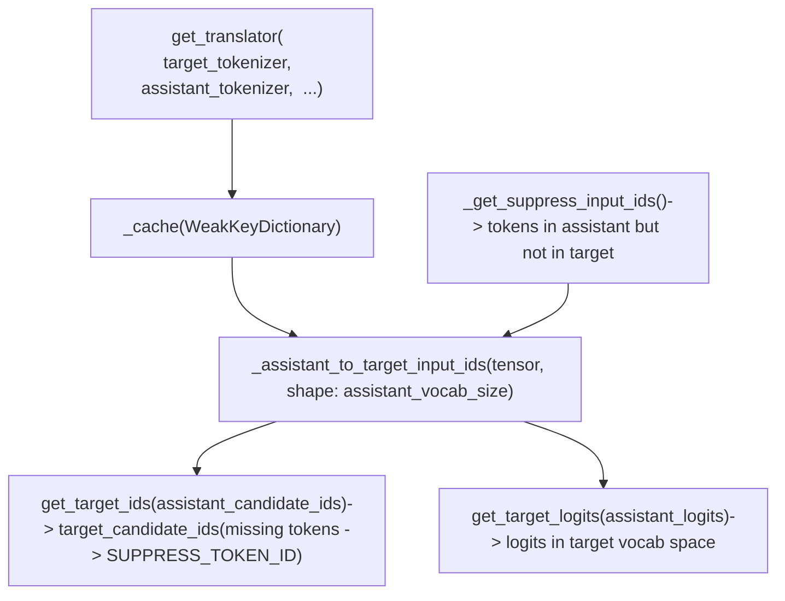
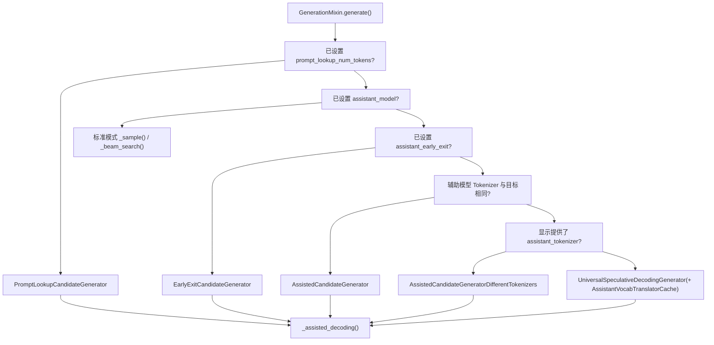

# 辅助解码与投机解码 (Assisted and Speculative Decoding)

相关源文件

-   [docs/source/en/generation_strategies.md](https://github.com/huggingface/transformers/blob/9a9997fd/docs/source/en/generation_strategies.md?plain=1)
-   [docs/source/en/internal/generation_utils.md](https://github.com/huggingface/transformers/blob/9a9997fd/docs/source/en/internal/generation_utils.md?plain=1)
-   [docs/source/en/main_classes/text_generation.md](https://github.com/huggingface/transformers/blob/9a9997fd/docs/source/en/main_classes/text_generation.md?plain=1)
-   [src/transformers/cache_utils.py](https://github.com/huggingface/transformers/blob/9a9997fd/src/transformers/cache_utils.py)
-   [src/transformers/generation/__init__.py](https://github.com/huggingface/transformers/blob/9a9997fd/src/transformers/generation/__init__.py)
-   [src/transformers/generation/candidate_generator.py](https://github.com/huggingface/transformers/blob/9a9997fd/src/transformers/generation/candidate_generator.py)
-   [src/transformers/generation/configuration_utils.py](https://github.com/huggingface/transformers/blob/9a9997fd/src/transformers/generation/configuration_utils.py)
-   [src/transformers/generation/logits_process.py](https://github.com/huggingface/transformers/blob/9a9997fd/src/transformers/generation/logits_process.py)
-   [src/transformers/generation/stopping_criteria.py](https://github.com/huggingface/transformers/blob/9a9997fd/src/transformers/generation/stopping_criteria.py)
-   [src/transformers/generation/utils.py](https://github.com/huggingface/transformers/blob/9a9997fd/src/transformers/generation/utils.py)
-   [src/transformers/models/clvp/modeling_clvp.py](https://github.com/huggingface/transformers/blob/9a9997fd/src/transformers/models/clvp/modeling_clvp.py)
-   [src/transformers/pytorch_utils.py](https://github.com/huggingface/transformers/blob/9a9997fd/src/transformers/pytorch_utils.py)
-   [tests/generation/test_candidate_generator.py](https://github.com/huggingface/transformers/blob/9a9997fd/tests/generation/test_candidate_generator.py)
-   [tests/generation/test_configuration_utils.py](https://github.com/huggingface/transformers/blob/9a9997fd/tests/generation/test_configuration_utils.py)
-   [tests/generation/test_logits_process.py](https://github.com/huggingface/transformers/blob/9a9997fd/tests/generation/test_logits_process.py)
-   [tests/generation/test_stopping_criteria.py](https://github.com/huggingface/transformers/blob/9a9997fd/tests/generation/test_stopping_criteria.py)
-   [tests/generation/test_utils.py](https://github.com/huggingface/transformers/blob/9a9997fd/tests/generation/test_utils.py)
-   [tests/utils/test_cache_utils.py](https://github.com/huggingface/transformers/blob/9a9997fd/tests/utils/test_cache_utils.py)

本页面涵盖了辅助解码和投机解码子系统：`CandidateGenerator` 抽象、所有具体实现、候选验证函数 `_speculative_sampling`、用于辅助模型提前停止的 `ConfidenceCriteria`，以及动态 token 预算系统。

有关选择和配置此模式的 `GenerationConfig` 字段，请参阅 [Generation Configuration and Modes (生成配置与模式)](/huggingface/transformers/4.1-generation-configuration-and-modes)。有关 `ConfidenceCriteria` 扩展的基础停止标准框架，请参阅 [Logits Processing Pipeline (Logits 处理流水线)](/huggingface/transformers/4.2-logits-processing-pipeline)。有关回滚所需的缓存类型，请参阅 [Cache System (缓存系统)](/huggingface/transformers/4.3-cache-system)。

---

## 核心思想 (Core Idea)

标准的 Autoregressive (自回归) 解码每生成一个 token 就在大型目标模型中运行一次前向传递。Speculative Decoding (投机解码) 通过使用开销较小的草稿源一次性生成 `k` 个候选 token 来打破这一瓶颈。然后目标模型在单次并行前向传递中处理所有 `k+1` 个位置，并在同意时接受 token，在第一次拒绝时重新采样。当草稿接受率较高时，由于目标模型的计算在多个被接受的 token 之间共享，有效吞吐量将显著提高。

该框架将其概括为 `CandidateGenerator` 接口，它抽象了多种草稿源：单独的小型模型、目标模型本身的 Early exit (提前退出)，或输入 Prompt (提示) 中的 n-gram 查找。

---

## CandidateGenerator 接口

[src/transformers/generation/candidate_generator.py39-75](https://github.com/huggingface/transformers/blob/9a9997fd/src/transformers/generation/candidate_generator.py#L39-L75)

`CandidateGenerator` 是所有候选生成器的抽象基类。它指定了两个方法：

| 方法 | 签名 | 用途 |
| --- | --- | --- |
| `get_candidates` | `(input_ids) → (candidate_ids, candidate_logits)` | 产生最多 `k` 个草稿 token ID 和可选的 logits |
| `update_candidate_strategy` | `(input_ids, scores, num_matches) → None` | 根据接受了多少 token 来调整草稿预算 |

`candidate_ids` 的形状为 `(batch_size, current_length + k)` —— 它是包含现有 token 后跟新草稿 token 的完整序列。`candidate_logits` 形状为 `(batch_size, k, vocab_size)`，对于无法产生逐 token 分布的生成器，可能为 `None`。

来源：[src/transformers/generation/candidate_generator.py39-75](https://github.com/huggingface/transformers/blob/9a9997fd/src/transformers/generation/candidate_generator.py#L39-L75)

---

## 具体生成器实现 (Concrete Generator Implementations)

**图表：CandidateGenerator 类层次结构**

来源：[src/transformers/generation/candidate_generator.py78-109](https://github.com/huggingface/transformers/blob/9a9997fd/src/transformers/generation/candidate_generator.py#L78-L109) [src/transformers/generation/candidate_generator.py39-75](https://github.com/huggingface/transformers/blob/9a9997fd/src/transformers/generation/candidate_generator.py#L39-L75)

### AssistedCandidateGenerator

[src/transformers/generation/candidate_generator.py78-299](https://github.com/huggingface/transformers/blob/9a9997fd/src/transformers/generation/candidate_generator.py#L78-L299)

在目标模型和辅助模型共享相同 Tokenizer (分词器) 时使用。调用 `assistant_model.generate()` 每轮产生最多 `num_assistant_tokens` 个 token。关键初始化决策：

-   在辅助模型的生成配置上强制使用 `cache_implementation = "dynamic_full"`，以便缓存可以在被拒绝时回滚 [src/transformers/generation/candidate_generator.py188-192](https://github.com/huggingface/transformers/blob/9a9997fd/src/transformers/generation/candidate_generator.py#L188-L192)
-   设置 `generation_config.is_assistant = True`，这会导致当 `assistant_confidence_threshold > 0` 时，将 `ConfidenceCriteria` 注入辅助模型的停止标准列表中 [src/transformers/generation/candidate_generator.py193-195](https://github.com/huggingface/transformers/blob/9a9997fd/src/transformers/generation/candidate_generator.py#L193-L195)
-   在交给辅助模型之前，从处理器列表中剥离任何 `MinLengthLogitsProcessor`；主模型的 `min_length` 约束不得阻塞草稿 token [src/transformers/generation/candidate_generator.py165-175](https://github.com/huggingface/transformers/blob/9a9997fd/src/transformers/generation/candidate_generator.py#L165-L175)
-   通过每个张量的 `detach()` 或 `deepcopy()` 复制 `model_kwargs`，但对于 Encoder-decoder (编码器-解码器) 模型通过引用传递 `encoder_outputs` [src/transformers/generation/candidate_generator.py130-135](https://github.com/huggingface/transformers/blob/9a9997fd/src/transformers/generation/candidate_generator.py#L130-L135)
-   设置辅助模型的 `generation_config.eos_token_id` 以匹配目标模型，使辅助模型在相同的 EOS token 上终止 [src/transformers/generation/candidate_generator.py127](https://github.com/huggingface/transformers/blob/9a9997fd/src/transformers/generation/candidate_generator.py#L127-L127)

`get_candidates` 内部调用：`_calculate_new_tokens` → `_update_past_and_masks` → `_prepare_generation_args` → `_generate_candidates`。

### AssistedCandidateGeneratorDifferentTokenizers

当目标模型和辅助模型 Tokenizer (分词器) 不同时扩展 `AssistedCandidateGenerator`。辅助模型产生草稿 token 后，执行重新编码步骤：

1.  使用辅助模型分词器将草稿 token 解码为文本。
2.  使用目标模型分词器对文本进行重新编码。
3.  由此产生的目标词表 ID 用于验证。

`assistant_lookbehind` 和 `target_lookbehind` 控制重新编码窗口周围有多少个额外的上下文 token，以防止边界分词伪影。

### UniversalSpeculativeDecodingGenerator

通过直接的词表级转换扩展 `AssistedCandidateGeneratorDifferentTokenizers`，绕过了“先解码再重编码”的步骤。它使用通过 `AssistantVocabTranslatorCache` 获取的 `AssistantToTargetTranslator`。

**图表：UniversalSpeculativeDecodingGenerator 中的词表转换**

两个词表共享的 token 会被直接映射。仅存在于辅助模型词表中的 token 会映射到 `SUPPRESS_TOKEN_ID`，强制目标模型拒绝它们。Logits 被投影到目标模型词表空间，以便在 `_speculative_sampling` 中使用。

来源：[src/transformers/generation/candidate_generator.py700-750](https://github.com/huggingface/transformers/blob/9a9997fd/src/transformers/generation/candidate_generator.py#L700-L750) [tests/generation/test_candidate_generator.py50-100](https://github.com/huggingface/transformers/blob/9a9997fd/tests/generation/test_candidate_generator.py#L50-L100)

### EarlyExitCandidateGenerator

继承自 `AssistedCandidateGenerator`。它不使用单独的模型，而是使用目标模型本身中间层的 Logits 作为草稿。`GenerationConfig` 中的 `assistant_early_exit` 整数指定退出层索引。需要一个 LM head (语言模型头) 能够解释中间隐藏状态的模型。

### PromptLookupCandidateGenerator

不需要辅助模型。在每一步它：

1.  将当前序列的最后 `max_matching_ngram_size` 个 token 作为查询。
2.  扫描输入 Prompt (提示) 中该 n-gram 的出现。
3.  返回第一个匹配项后的 `num_output_tokens` 个 token 作为候选。

不产生 Logits (`candidate_logits = None`)。`update_candidate_strategy` 方法使用与 `AssistedCandidateGenerator` 相同的启发式方法调整 `num_output_tokens`。

来源：[src/transformers/generation/candidate_generator.py750-800](https://github.com/huggingface/transformers/blob/9a9997fd/src/transformers/generation/candidate_generator.py#L750-L800)

---

## `_assisted_decoding` 循环

[src/transformers/generation/utils.py](https://github.com/huggingface/transformers/blob/9a9997fd/src/transformers/generation/utils.py)

当 `generate()` 选择 `GenerationMode.ASSISTED_GENERATION` 时调用 `GenerationMixin._assisted_decoding`。`GENERATION_MODES_MAPPING` 将此模式映射到 [src/transformers/generation/utils.py138](https://github.com/huggingface/transformers/blob/9a9997fd/src/transformers/generation/utils.py#L138-L138) 处的 `"_assisted_decoding"`。

**图表：辅助解码迭代**

> **[Mermaid sequence]**
> *(图表结构无法解析)*

在迭代之间，当候选被部分拒绝时，使用 `DynamicLayer.crop()` 将 KV cache (KV 缓存) 回滚到接受的前缀长度 [src/transformers/cache_utils.py139-151](https://github.com/huggingface/transformers/blob/9a9997fd/src/transformers/cache_utils.py#L139-L151)。

`_assisted_decoding` 内部使用了来自 `candidate_generator.py` 的三个模块级助手函数来为辅助模型准备输入：`_prepare_attention_mask`、`_prepare_position_ids` 和 `_prepare_token_type_ids` [src/transformers/generation/candidate_generator.py61-64](https://github.com/huggingface/transformers/blob/9a9997fd/src/transformers/generation/candidate_generator.py#L61-L64)。

来源：[src/transformers/generation/utils.py138](https://github.com/huggingface/transformers/blob/9a9997fd/src/transformers/generation/utils.py#L138-L138) [src/transformers/generation/candidate_generator.py61-64](https://github.com/huggingface/transformers/blob/9a9997fd/src/transformers/generation/candidate_generator.py#L61-L64) [src/transformers/cache_utils.py139-151](https://github.com/huggingface/transformers/blob/9a9997fd/src/transformers/cache_utils.py#L139-L151)

---

## 候选验证：`_speculative_sampling`

[src/transformers/generation/utils.py](https://github.com/huggingface/transformers/blob/9a9997fd/src/transformers/generation/utils.py)

`_speculative_sampling` 是一个模块级函数（可见于 [tests/generation/test_utils.py108](https://github.com/huggingface/transformers/blob/9a9997fd/tests/generation/test_utils.py#L108-L108) 的测试导入）。它实现了应用于每次迭代的 token 接受/拒绝逻辑。

对于位置 `i` 的每个草稿 token：

1.  从目标模型 Logits（应用 `logits_processor` 后）获取 `p(token_i)`。
2.  从辅助模型 Logits（如果提供）获取 `q(token_i)`。
3.  以概率 `min(1, p / q)` 接受 token `i`。
4.  在第一次拒绝时，从调整后的分布 `normalize(max(0, p − q))` 中采样一个奖励 token。

如果 `candidate_logits` 为 `None`（例如来自 `PromptLookupCandidateGenerator`），则验证降级为检查目标模型的 argmax 是否与候选 token 一致。在这种情况下不计算接受概率。

该函数返回一个包含被接受 token 加一个新 token 的张量，以及驱动 `update_candidate_strategy` 的计数 `num_matches`。

来源：[src/transformers/generation/utils.py](https://github.com/huggingface/transformers/blob/9a9997fd/src/transformers/generation/utils.py) [tests/generation/test_utils.py108](https://github.com/huggingface/transformers/blob/9a9997fd/tests/generation/test_utils.py#L108-L108)

---

## ConfidenceCriteria 与辅助模型提前停止 (ConfidenceCriteria and Assistant Early Stopping)

`ConfidenceCriteria` 是 `src/transformers/generation/stopping_criteria.py` 中的 `StoppingCriteria` 子类，列在 `generation/__init__.py` 的 `_import_structure["stopping_criteria"]` 下。

它在以下情况下由 `AssistedCandidateGenerator` 自动添加到辅助模型的停止标准列表中：

-   `generation_config.is_assistant = True`（由生成器设置）
-   `generation_config.assistant_confidence_threshold > 0`

在每个辅助模型草稿步骤中，`ConfidenceCriteria` 计算 top-1 token 的 softmax 概率。如果低于 `assistant_confidence_threshold`，则辅助模型停止进一步生成草稿 token，即使 `num_assistant_tokens` 尚未耗尽。

该阈值不是静态的。`update_candidate_strategy` 维护两个跟踪列表 `self.probs` 和 `self.matches`，并且当 `sklearn` 可用时，拟合一条 ROC 曲线以找到最小化代价函数的阈值，该函数对假阳性 (False Positive) 赋予 25% 权重，对假阴性 (False Negative) 赋予 75% 权重。这使阈值偏向于接受更多 token，以避免不必要的拒绝。

[src/transformers/generation/candidate_generator.py251-280](https://github.com/huggingface/transformers/blob/9a9997fd/src/transformers/generation/candidate_generator.py#L251-L280)

来源：[src/transformers/generation/candidate_generator.py251-280](https://github.com/huggingface/transformers/blob/9a9997fd/src/transformers/generation/candidate_generator.py#L251-L280) [src/transformers/generation/stopping_criteria.py102](https://github.com/huggingface/transformers/blob/9a9997fd/src/transformers/generation/stopping_criteria.py#L102-L102)

---

## Token 预算调整 (Token Budget Adaptation)

`update_candidate_strategy` 根据 `num_assistant_tokens_schedule` 字段调整 `self.num_assistant_tokens`。

| 调度策略 | 规则 | 持久性 |
| --- | --- | --- |
| `"heuristic"` | 如果 `k` 个候选全部接受则 +2；否则 −1 | 在使用同一生成器的 `generate()` 调用之间持久存在 |
| `"heuristic_transient"` | 相同规则 | 每次 `generate()` 调用后重置为初始值 |
| `"constant"` | 无变化 | N/A |

启发式规则依赖于以下观察：完全接受的一批建议辅助模型对当前上下文校准良好，可以更积极地进行投机。

[src/transformers/generation/candidate_generator.py225-250](https://github.com/huggingface/transformers/blob/9a9997fd/src/transformers/generation/candidate_generator.py#L225-L250)

来源：[src/transformers/generation/candidate_generator.py225-250](https://github.com/huggingface/transformers/blob/9a9997fd/src/transformers/generation/candidate_generator.py#L225-L250)

---

## `generate()` 中的生成器选择 (Generator Selection in `generate()`)

**图表：GenerationMixin.generate() 中的生成器选择与派发**

所有路径最终汇集到 `_assisted_decoding`，它是 [src/transformers/generation/utils.py138](https://github.com/huggingface/transformers/blob/9a9997fd/src/transformers/generation/utils.py#L138-L138) 处在 `GENERATION_MODES_MAPPING` 中注册的 `GenerationMode.ASSISTED_GENERATION` 处理程序。

来源：[src/transformers/generation/utils.py138](https://github.com/huggingface/transformers/blob/9a9997fd/src/transformers/generation/utils.py#L138-L138) [src/transformers/generation/candidate_generator.py78-109](https://github.com/huggingface/transformers/blob/9a9997fd/src/transformers/generation/candidate_generator.py#L78-L109)

---

## GenerationConfig 参数

所有辅助/投机解码设置都位于 `src/transformers/generation/configuration_utils.py` 中的 `GenerationConfig`：

[src/transformers/generation/configuration_utils.py291-327](https://github.com/huggingface/transformers/blob/9a9997fd/src/transformers/generation/configuration_utils.py#L291-L327)

| 参数 | 类型 | 描述 |
| --- | --- | --- |
| `num_assistant_tokens` | `int` | 每轮初始草稿 token 预算 |
| `num_assistant_tokens_schedule` | `str` | 预算调度策略：`"heuristic"`, `"heuristic_transient"`, `"constant"` |
| `assistant_confidence_threshold` | `float` | 概率低于此值时辅助模型提前停止 |
| `prompt_lookup_num_tokens` | `int` | `PromptLookupCandidateGenerator` 的候选数量 |
| `max_matching_ngram_size` | `int` | Prompt lookup (提示查找) 的 n-gram 查询大小（默认 2） |
| `assistant_early_exit` | `int` | `EarlyExitCandidateGenerator` 的层索引 |
| `assistant_lookbehind` | `int` | 辅助模型重新编码对齐的上下文窗口 |
| `target_lookbehind` | `int` | 目标模型重新编码对齐的上下文窗口 |
| `is_assistant` | `bool` | 将模型标记为草稿模型；由生成器自动设置 |

来源：[src/transformers/generation/configuration_utils.py291-327](https://github.com/huggingface/transformers/blob/9a9997fd/src/transformers/generation/configuration_utils.py#L291-L327)

---

## 缓存要求 (Cache Requirements)

`AssistedCandidateGenerator.__init__` 在辅助模型使用的配置上强制设置 `cache_implementation = "dynamic_full"`：

[src/transformers/generation/candidate_generator.py188-192](https://github.com/huggingface/transformers/blob/9a9997fd/src/transformers/generation/candidate_generator.py#L188-L192)

主模型的缓存也必须支持回滚。这就是为什么测试套件在测试辅助生成时传递 `cache_implementation = "dynamic_full"`。当候选被拒绝时，`DynamicLayer.crop()` 将主模型的缓存修整回最后一个被接受的位置：

[src/transformers/cache_utils.py139-151](https://github.com/huggingface/transformers/blob/9a9997fd/src/transformers/cache_utils.py#L139-L151)

静态缓存 (`StaticCache`) 和滑动窗口缓存不支持以相同方式进行 `crop()`，通常需要专门的管理。

来源：[src/transformers/generation/candidate_generator.py188-192](https://github.com/huggingface/transformers/blob/9a9997fd/src/transformers/generation/candidate_generator.py#L188-L192) [src/transformers/cache_utils.py139-151](https://github.com/huggingface/transformers/blob/9a9997fd/src/transformers/cache_utils.py#L139-L151)

---

## AssistantVocabTranslatorCache

[src/transformers/generation/candidate_generator.py800-850](https://github.com/huggingface/transformers/blob/9a9997fd/src/transformers/generation/candidate_generator.py#L800-L850)

一个模块级的 Singleton (单例) 类，缓存 `AssistantToTargetTranslator` 实例，由指向 `(target_tokenizer, assistant_tokenizer)` 对的弱引用键控。计算词表映射的时间复杂度为 O(vocab_size)，不得在每次 `generate()` 调用时重复。

关键方法：

| 方法 | 描述 |
| --- | --- |
| `get_translator(target_tokenizer, assistant_tokenizer, ...)` | 返回缓存的翻译器，或者创建并存储一个新的翻译器 |
| `cleanup()` | 移除那些 Tokenizer 弱引用已被垃圾回收的条目 |

使用 `weakref` 确保缓存不会阻止 Tokenizer 在超出范围时被垃圾回收。

来源：[src/transformers/generation/candidate_generator.py800-850](https://github.com/huggingface/transformers/blob/9a9997fd/src/transformers/generation/candidate_generator.py#L800-L850) [tests/generation/test_candidate_generator.py100-150](https://github.com/huggingface/transformers/blob/9a9997fd/tests/generation/test_candidate_generator.py#L100-L150)
